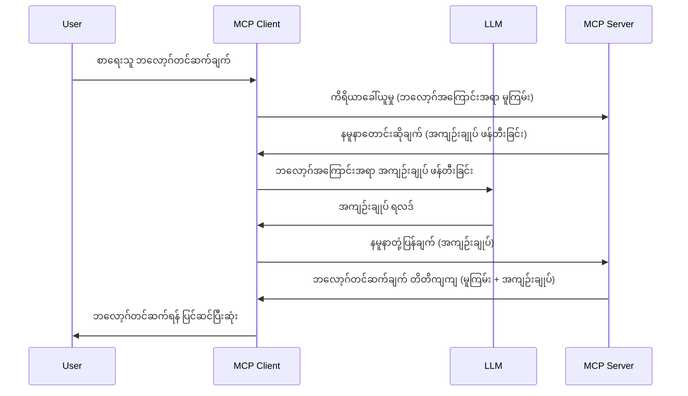

> [အသုံးမပြုတော့သော: 2026-07-28 ဖြန့်ချိမှုရင်ဆိုင်လမ်းညွှန်](https://blog.modelcontextprotocol.io/posts/2026-07-28-release-candidate/)

# Sampling - Client ကိုအင်အားပေးခြင်းအတွက် feature များအပ်နှင်းခြင်း

> **အသုံးမပြုတော့သောကြေညာချက်:** `2026-07-28` MCP သတ်မှတ်ချက် ဖြန့်ချိမှုရင်ဆိုင်လမ်းညွှန်သည် Sampling ကိုdeprecated သတ်မှတ်ပြီး LLM provider APIs နှင့် တိုက်ရိုက်ပေါင်းစည်းမှုကို ဝါနှင့်ထားသည်။ Sampling သည် `2025-11-25` နောက်ပိုင်းနှင့် တရားဝင် deprecated ဖြစ်သည့်အချိန်မှလွန်၍ တစ်နှစ်အထိ ဆက်လက်လုပ်ဆောင်နိုင်ပြီး ဤသင်ခန်းစာ၏ အရာအားလုံး သက်ဆိုင်နေသေးသည်။ သို့သော် စက်ဝန်ဆောင်မှုရေးစက်သည် အစားထိုးရေးစနစ်ကို သုံးသပ်သင့်သည်။ [MCP တွင် အပြောင်းအလဲများ - 2026-07-28 Release Candidate](../../01-CoreConcepts/mcp-2026-07-28-release-candidate.md) ကို ကြည့်ပါ။

တခါတရံ MCP Client နှင့် MCP Server တို့သည် ပူးပေါင်းဆောင်ရွက်ရန် လိုအပ်သည်။ Server သည် Client အပေါ်တွင်တည်ရှိသော LLM အကူအညီ လိုအပ်နိုင်သည်။ ဤအခြေအနေတွင် sampling ကို သုံးသင့်သည်။

Sampling ပါဝင်သည့် အသုံးပြုမှုများနှင့် ဖြေရှင်းနည်း ဆောက်ရွက်နည်းကို လေ့လာကြမယ်။

## အကျဉ်းချုပ်

ဤသင်ခန်းစာတွင် Sampling ကို မည်သည့်အချိန်နှင့် ဘယ်နေရာတွင် အသုံးပြုရမည်နည်း၊ ထိုသို့ပြင်ဆင်နည်းကို အဓိကဖော်ပြမည်။

## သင်ယူနိုင်မည့်ရည်မှန်းချက်များ

ဤအခန်းတွင်:

- Sampling ဆိုတာဘာလဲ၊ မည်သည့်အချိန်တွင် အသုံးပြုရမည်ကို ရှင်းပြမည်။
- MCP တွင် Sampling ကို မည်သို့ပြင်ဆင်ရမည်ကို ပြသမည်။
- Sampling ကို လက်တွေ့အသုံးပြုမှု ဥပမာများကို ပံ့ပိုးပေးမည်။

## Sampling ဆိုတာဘာလဲ၊ မည်သို့အသုံးပြုရမည်နည်း?

Sampling သည် အဆင့်မြင့် feature တစ်ခုဖြစ်ပြီး အောက်ပါနည်းလမ်းဖြင့် လုပ်ဆောင်သည်-



### Sampling အပေးအယူတောင်းဆိုမှု

သေချာသော နမူနာတစ်ခုကို ကြည့်ပြီးသောကြောင့် sampling တောင်းဆိုမှုအား Server မှ Client ထံ ပို့ပေးသည်။ ဤတောင်းဆိုမှုကို JSON-RPC ပုံစံဖြင့် အောက်မှာ မြင်ရပါမည်-

```json
{
  "jsonrpc": "2.0",
  "id": 1,
  "method": "sampling/createMessage",
  "params": {
    "messages": [
      {
        "role": "user",
        "content": {
          "type": "text",
          "text": "Create a blog post summary of the following blog post: <BLOG POST>"
        }
      }
    ],
    "modelPreferences": {
      "hints": [
        {
          "name": "claude-3-sonnet"
        }
      ],
      "intelligencePriority": 0.8,
      "speedPriority": 0.5
    },
    "systemPrompt": "You are a helpful assistant.",
    "maxTokens": 100
  }
}
```

ဒီမှာ သတိထားသင့်တဲ့အချက်များအချို့ရှိသည်-

- Prompt သည် content -> text အောက်ရှိ LLM အတွက် ဘလော့ဂ်ပို့စ် အကြောင်းအရာကို အနှစ်ချုပ်ပြုရန် ညွှန်ကြားချက်ဖြစ်သည်။

- **modelPreferences**။ ဤအပိုင်းသည် LLM အသုံးပြုရန် ပြင်ဆင်မှုအကြံပြုချက်တစ်ခုဖြစ်သည်။ အသုံးပြုသူသည် ဤအကြံပြုချက်များနှင့်အညီသို့မဟုတ် မပြောင်းလဲဘဲရွေးချယ်နိုင်သည်။ ဤကိစ္စတွင် မော်ဒယ်အသုံးပြုမှု၊ အမြန်နှုန်းနှင့် ဉာဏ်ရည် ဦးစားပေးထားသည်။
- **systemPrompt**,  သင်၏ LLM အတွက် ကိုယ်ရည်ကိုယ်သွေးပေးသည့် ပုံမှန်စနစ် Prompt ဖြစ်ပြီး လမ်းညွှန်မှု ညွှန်ကြားချက် ပါဝင်သည်။
- **maxTokens**, ထိုညွှန်ကြားမှုအတွက် အသုံးပြုရန် အကြံပြုသည့် token အရေအတွက်ကို သတ်မှတ်ထားသည်။

### Sampling မှ တုံ့ပြန်ချက်

ဤတုံ့ပြန်ချက်သည် MCP Client မှ MCP Server သို့ပြန်ပို့သည့် မက်ဆေ့ခ််ဖြစ်ပြီး Client က LLM ကို ဖုန်းခေါ်ပြီး တုံ့ပြန်ချက်ကို စောင့်မှတ်ပြီး ဖန်တီးသော အချက်အလက်ဖြစ်သည်။ JSON-RPC ပုံစံဖြင့် အောက်မှာ မြင်ရပါမည်-

```json
{
  "jsonrpc": "2.0",
  "id": 1,
  "result": {
    "role": "assistant",
    "content": {
      "type": "text",
      "text": "Here's your abstract <ABSTRACT>"
    },
    "model": "gpt-5",
    "stopReason": "endTurn"
  }
}
```

တုံ့ပြန်ချက်သည် ဘလော့ဂ်ပို့စ် အနှစ်ချုပ်ဖြစ်ကြောင်း သေချာစေရန် စိတ်ဝင်စားစရာ အသေးစိတ်များပါရှိသည်။ သင့် sampling တောင်းဆိုချက်တွင် "claude-3-sonnet" မော်ဒယ်ကို ဦးစားပေးထားသော вып However, သုံးစွဲသူသည် "gpt-5" ကို ရွေးချယ်နိုင်ပြီး မော်ဒယ်အသုံးပြုမှုသည် အကြံပြုချက်သာဖြစ်သည်။

အခုလည်း မူလဆွေးနွေးမှုကို နားလည်သွားပြီဖြစ်ပြီး "ဘလော့ဂ်ပို့စ်ပြုလုပ်ခြင်း + အနှစ်ချုပ်" အတွက် အသုံးဝင်သော အလုပ်တစ်ခုအဖြစ် အသုံးပြုနိုင်သည်။ ၎င်းကို လည်ပတ်စေဖို့ လုပ်ရမည့်အရာများကို ကြည့်ကြမယ်။

### မက်ဆေ့ခ််အမျိုးအစားများ

Sampling မက်ဆေ့ခ််များသည် စာသားတစ်မျိုးတည်းမဟုတ်ဘဲ ပုံရိပ်နှင့် အသံတင်ပို့လို့လည်းရသည်။ JSON-RPC ပုံစံကွဲပြားမှုကို အောက်တွင် မြင်ရပါမည်-

**စာသား**

```json
{
  "type": "text",
  "text": "The message content"
}
```

**ပုံဖော်အကြောင်းအရာ**

```json
{
  "type": "image",
  "data": "base64-encoded-image-data",
  "mimeType": "image/jpeg"
}
```

**အသံအကြောင်းအရာ**

```json
{
  "type": "audio",
  "data": "base64-encoded-audio-data",
  "mimeType": "audio/wav"
}
```

> မှတ်ချက်- Sampling အကြောင်းအသေးစိတ်ကို [တရားဝင်စာရွက်စာတမ်းများ](https://modelcontextprotocol.io/specification/2025-11-25/client/sampling) တွင် ကြည့်ရှုနိုင်ပါသည်။

## Client တွင် Sampling ကို မည်သို့ပြင်ဆင်ရမည်နည်း

> မှတ်ချက်- သင်သည် server သာတည်ဆောက်ဖို့ သေချာသည်면၊ ဤမှာ အများကြီးလုပ်ရန် မလိုအပ်ပါ။

Client တွင် အောက်ပါ feature ကို အောက်ပါပုံစံအတိုင်း သတ်မှတ်ရမည်-

```json
{
  "capabilities": {
    "sampling": {}
  }
}
```

သင်ရွေးချယ်ထားသော client သည် Server နှင့်သွားရာ၌ ထို feature ကို ရယူမည်ဖြစ်သည်။

## Sampling လုပ်ဆောင်မှု ဥပမာ - ဘလော့ဂ်ပို့စ် တည်ဆောက်ခြင်း

Sampling server တစ်ခုကို အတူတကွ ရေးသားကြမယ်၊ လုပ်ဆောင်ရမည့် အချက်များမှာ-

1. Server ပေါ်တွင် tool တစ်ခုတည်ဆောက်ပါ။
1. ထို tool က sampling တောင်းဆိုမှု တစ်ခုဖန်တီးရမည်။
1. Tool သည် Client ၏ sampling တောင်းဆိုမှု ဖြေကြားမှုကို စောင့်ရှောက်ရမည်။
1. ထိုနောက် tool ၏ရလဒ် ထုတ်ပေးရမည်။

အဆင့်လိုက် ကုဒ်ကိုကြည့်ရှုကြမည်-

### -1- Tool တည်ဆောက်ခြင်း

**python**

```python
@mcp.tool()
async def create_blog(title: str, content: str, ctx: Context[ServerSession, None]) -> str:
    """Create a blog post and generate a summary"""

```

### -2- Sampling တောင်းဆိုမှုဖန်တီးခြင်း

သင့် tool ကို အောက်ပါကုဒ်ဖြင့် တိုးချဲ့ပါ-

**python**

```python
post = BlogPost(
        id=len(posts) + 1,
        title=title,
        content=content,
        abstract=""
    )

prompt = f"Create an abstract of the following blog post: title: {title} and draft: {content} "

result = await ctx.session.create_message(
        messages=[
            SamplingMessage(
                role="user",
                content=TextContent(type="text", text=prompt),
            )
        ],
        max_tokens=100,
)

```

### -3- တုံ့ပြန်မှုကို စောင့်ပြီး ပြန်လာသော တုံ့ပြန်မှု ထုတ်ပေးခြင်း

**python**

```python
post.abstract = result.content.text

posts.append(post)

# ထုတ်ကုန်အားလုံးကိုပြန်ပေးပါ
return json.dumps({
    "id": post.title,
    "abstract": post.abstract
})
```

### -4- အပြည့်အစုံကုဒ်

**python**

```python
from starlette.applications import Starlette
from starlette.routing import Mount, Host

from mcp.server.fastmcp import Context, FastMCP

from mcp.server.session import ServerSession
from mcp.types import SamplingMessage, TextContent

import json


from uuid import uuid4
from typing import List
from pydantic import BaseModel


mcp = FastMCP("Blog post generator")

# app = FastAPI()

posts = []

class BlogPost(BaseModel):
    id: int
    title: str
    content: str
    abstract: str

posts: List[BlogPost] = []

@mcp.tool()
async def create_blog(title: str, content: str, ctx: Context[ServerSession, None]) -> str:
    """Create a blog post and generate a summary"""

    post = BlogPost(
        id=len(posts) + 1,
        title=title,
        content=content,
        abstract=""
    )

    prompt = f"Create an abstract of the following blog post: title: {title} and draft: {content} "

    result = await ctx.session.create_message(
        messages=[
            SamplingMessage(
                role="user",
                content=TextContent(type="text", text=prompt),
            )
        ],
        max_tokens=100,
    )

    post.abstract = result.content.text

    posts.append(post)

    # အပြည့်အစုံ ဘလော့ဂ်ပို့စ်ကို ပြန်ပေးပါ
    return json.dumps({
        "id": post.title,
        "abstract": post.abstract
    })

if __name__ == "__main__":
    print("Starting server...")
    # mcp.run()
    mcp.run(transport="streamable-http")

# app ကို chạy ဖို့: python server.py
```

### -5- Visual Studio Code တွင် စမ်းသပ်ခြင်း

Visual Studio Code တွင် ဤအရာကို စမ်းသပ်ရန် အောက်ပါအတိုင်း လုပ်ဆောင်ပါ-

1. Terminal တွင် server ကို စတင်တည်ဆောက်ပါ။
1. *mcp.json* တွင် ထည့်ပြီး စတင်ထားခြင်းကို အတည်ပြုပါ၊ ဥပမာ အောက်ပါအတိုင်း-

   ```json
   "servers": {
      "blog-server": {
        "type": "http",
        "url": "http://localhost:8000/mcp"
      }
   }
   ```

1. Prompt တစ်ခုရိုက်ထည့်ပါ-

   ```text
   create a blog post named "Where Python comes from", the content is "Python is actually named after Monty Python Flying Circus"
   ```

1. Sampling ဖြစ်ပေါ်ခွင့်ပြုပါ။ ပထမဆုံးစမ်းသပ်မှုတွင် သင့်အား ဆွေးနွေးရန် အပြည့်အစုံသော Dialog တစ်ခု ဖေါ်ပြမည်ဖြစ်ပြီး သဘောတူရမည်၊ ထို့နောက် tool ကို ဖော်ဆောင်ရန်မေးသော အမြဲတမ်းရှိသော Dialog ကို မြင်ရပါမည်။

1. ရလဒ်များကို စစ်ဆေးပါ။ GitHub Copilot Chat အတွင်း ပိုပြီးကောင်းမွန်စွာ ဖော်ပြထားသလို ရ(raw) JSON တုံ့ပြန်ချက်ကိုလည်း စစ်ဆေးနိုင်ပါသည်။

**အပိုဆောင်း**။ Visual Studio Code စက်နှင့် sampling အတွက် ထူးခြားသော ပံ့ပိုးမှုရှိသည်။ သင့်တပ်ဆင်ထားသည့် server တွင် Sampling ဝင်ရောက်ခွင့်ကို အောက်ပါအတိုင်း ပြင်ဆင်နိုင်သည်-

1. Extension အပိုင်းသို့ သွားပါ။
1. "MCP SERVERS - INSTALLED" အပိုင်းမှ သင့်တပ်ဆင်ထားသော server အတွက် cog icon ကို ရွေးပါ။
1 "Configure Model Access" ကို ရွေးပါ၊ ဤနေရာတွင် Sampling ဖြင့် GitHub Copilot က အသုံးပြုခွင့်ရမည့် မော်ဒယ်များကို ရွေးချယ်နိုင်သည်။ တစ်ချိန်ရာ sampling တောင်းဆိုမှုအားလုံးကို "Show Sampling requests" ဖြင့် ကြည့်ရှုနိုင်သည်။

## အလုပ်အပ်

ဤအလုပ်အပ်တွင် သင့်အား နည်းနည်းကွဲပြားသော Sampling integration တစ်ရပ် တည်ဆောက်ရန်ရှိပါသည်၊ အဲဒါက ကုန်ပစ္စည်းဖော်ပြချက် ထုတ်ပေးနိုင်မှုကို ပံ့ပိုးသည့် sampling integration ဖြစ်ပါသည်။ သင့်အခြေအနေမှာ-

**Scenario**: E-commerce ပြင်ပုံး အလုပ်သမားဟာ ကုန်ပစ္စည်းဖော်ပြချက် ထုတ်ဖော်ဖို့ အချိန်အများကြီးလုန့်နေပါတယ်။ ထို့ကြောင့် "create_product" ဟုခေါ်သော tool ကို "title" နှင့် "keywords" ကို argument အဖြစ် ခေါ်ယူ၍ client ၏ LLM မှ "description" လွှမ်းခြုံသည့် အပြည့်အစုံကုန်ပစ္စည်းတစ်ခု ဖန်တီးပေးရန် ဖြေရှင်းနည်းတစ်ခု တည်ဆောက်ဖို့ လိုအပ်သည်။

TIP: မကြာမီ လေ့လာခဲ့သော Sampling တောင်းဆိုမှု အသုံးပြုပြီး ဤ server နှင့် tool ကို တည်ဆောက်ပါ။

## ဖြေရှင်းနည်း

[ဖြေရှင်းနည်း](./solution/README.md)

## အဓိကယူဆချက်များ

Sampling သည် LLM အကူအညီလိုအပ်သောအခါ server သည် client ကို အလုပ်ခွဲထုတ်ပေးနိုင်သော ထူးခြားတဲ့ feature ဖြစ်သည်။

## နောက်ဆက်တွဲ

- [အခန်း ၄ - လက်တွေ့အကောင်အထည်ဖော်ခြင်း](../../04-PracticalImplementation/README.md)

---

<!-- CO-OP TRANSLATOR DISCLAIMER START -->
**ပြောကြားချက်**
ဤစာတမ်းကို AI ဘာသာပြန်ဝန်ဆောင်မှု [Co-op Translator](https://github.com/Azure/co-op-translator) အသုံးပြု၍ ဘာသာပြန်ထားပါသည်။ ကျွန်ုပ်တို့သည် တိကျမှန်ကန်မှုအတွက် ကြိုးပမ်းနေသော်လည်း၊ စက်ကိရိယာဘာသာပြန်ခြင်းများတွင် အမှားများ သို့မဟုတ် မှားယွင်းချက်များ ပါဝင်နိုင်ကြောင်း သတိပြုပါရန် လိုအပ်ပါသည်။ မူလစာတမ်းကို မူရင်းဘာသာဖြင့်သာ ယုံကြည်စိတ်ချရသော အချက်အလက်အဖြစ် သတ်မှတ်သင့်သည်။ အရေးကြီးသည့် သတင်းအချက်အလက်များအတွက် ပရော်ဖက်ရှင်နယ် လူသားဘာသာပြန်သူဝန်ဆောင်မှုကို အကြံပြုပါသည်။ ဤဘာသာပြန်ချက်ကို အသုံးပြုခြင်းမှ ဖြစ်ပေါ်လာသော နားလည်မှုကွာခြားမှုများ သို့မဟုတ် မမှန်ကန်သော အသုံးပြုမှုများအတွက် ကျွန်ုပ်တို့ တာဝန်မခံပါ။
<!-- CO-OP TRANSLATOR DISCLAIMER END -->