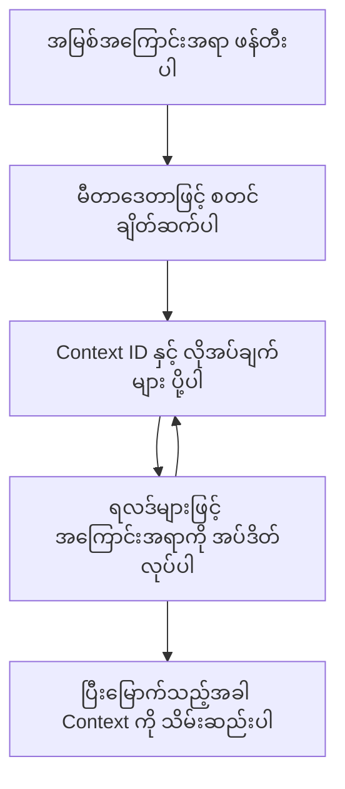

> [ပယ်ချခြင်း: 2026-07-28 ထုတ်ဝေမှု အလျင်အမြန်စားရန်](https://blog.modelcontextprotocol.io/posts/2026-07-28-release-candidate/#roots-sampling-and-logging-are-deprecated)

# MCP Root Contexts

> **ပယ်ချခြင်း အသိပေးချက်:** `2026-07-28` MCP specification ထုတ်ဝေမှုအလျင်အမြန်စားရန်သည် Roots ကို tool parameters, resource URIs, သို့မဟုတ် server configuration အစားထိုးခြင်းအတွက် deprecated ဖြစ်ကြောင်းသတ်မှတ်ထားသည်။ Roots များကို `2025-11-25` မှာ တည်ရှိနေဆဲဖြစ်ပြီး တရားဝင် Deprecated ဖြစ်ကြပြီးနောက် အနည်းဆုံး တစ်နှစ်ကြာအောင် ဆက်လက်အလုပ်လုပ်နိုင်သဖြင့် ဒီသင်ခန်းစာရှိ အရာအားလုံးကို မှန်ကန်နေဆဲဖြစ်သည် - သို့သော် ဆာဗာဒီဇိုင်းအသစ်များသည် အစားထိုးပုံစံကို သုံးသပ်သင့်သည်။ ဆက်လက်ကြည့်ရှုရန် [MCP မှာ ဘာတွေပြောင်းလဲနေသလဲ: 2026-07-28 ထုတ်ဝေမှု အလျင်အမြန်စားရန်](../../01-CoreConcepts/mcp-2026-07-28-release-candidate.md) ကိုကြည့်ပါ။

Root contexts သည် Model Context Protocol တွင် အခြေခံ အကြောင်းအရာဖြစ်ပြီး ဆက်သွယ်ဖြေဆိုမှုမှတ်တမ်းနှင့် မတူညီသော တောင်းဆိုမှုများနှင့် အစည်းအဝေးများအတွင်း မျှဝေထားသော အခြေအနေများကို ဆက်လက် ထိန်းသိမ်းထားရန်အတွက် အမြဲတမ်း အလွှာကို ပေးသည်။

## နိဒါန်း

ဒီသင်ခန်းစာမှာ MCP မှာ root contexts ကို မည်သို့ ဖန်တီး၊ စီမံ၊ အသုံးပြုရမည်ကို လေ့လာကြမယ်။

## သင်ယူရမည့် ရည်ရွယ်ချက်များ

သင်ခန်းစာပြီးဆုံးချိန်မှာ သင်မှာ အောက်ပါအရာများကို သိရှိနိုင်ပါမည် -

- root contexts ရဲ့ ရည်ရွယ်ချက်နှင့် ဖွဲ့စည်းပုံကို နားလည်နိုင်ခြင်း
- MCP client libraries ကို အသုံးပြုပြီး root contexts ဖန်တီး၊ စီမံနိုင်ခြင်း
- .NET, Java, JavaScript နှင့် Python အက်ပလီကေးရှင်းများတွင် root contexts ရေးဆွဲနိုင်ခြင်း
- multi-turn ဆက်ဆံရေးနှင့် အခြေအနေ စီမံခန့်ခွဲမှုအတွက် root contexts ကို အသုံးပြုနိုင်ခြင်း
- root context စီမံခန့်ခွဲမှုအတွက် အကောင်းဆုံးနည်းလမ်းများကို လုပ်ကိုင်နိုင်ခြင်း

## Root Contexts နားလည်မှု

Root contexts သည် ဆက်စပ်မှုရှိသည့် ဆက်ဆံရေးများ၏ သမိုင်းနှင့် အခြေအနေများကို ထိန်းသိမ်းထားသော အခြားတစ်မျိုး ပုံးကဲ့သို့ အလုပ်လုပ်သည်။ ၎င်းတို့သည် -

- **ဆက်ဆံရေး တည်တံ့မှု**: စဉ်ဆက်မပြတ် မူလဆက်ဆံရေးများကို ထိန်းသိမ်းခြင်း
- **မှတ်ဉာဏ် စီမံခန့်ခွဲမှု**: ဆက်ဆံရေးများအတွင်း ဒေတာများ သိမ်းဆည်းပြီး ထုတ်ယူခြင်း
- **အခြေအနေ စီမံခန့်ခွဲမှု**: ပြင်းပြမှု အဆင့်ဆင့်လုပ်ငန်းစဉ်များကို ချိန်ညှိခြင်း
- **Context အချက်များ မျှဝေပေးခြင်း**: အမျိုးမျိုးသော client များအတွက် ဆက်ဆံရေး အခြေအနေတူကို ဝင်ရောက်အသုံးပြုခွင့် ပေးခြင်း

MCP တွင် root contexts တွင် အဓိကအောက်ပါ လက္ခဏာများ ရှိပါသည် -

- တစ်ခုချင်း root context အသီးသီးသည် ထူးခြားတဲ့ အသိအမှတ်ပြု အမှတ်စဉ်ရှိသည်။
- ဆက်ဆံရေးသမိုင်း, အသုံးပြုသူ နှစ်သက်ရာနှင့် အခြား metadata များပါဝင်နိုင်သည်။
- လိုအပ်သလောက် ဖန်တီး, ဝင်ရောက်, မှတ်တိုက်သိမ်းဆည်းခြင်း ပြုလုပ်နိုင်သည်။
- အသေးစိတ် access control နှင့် ခြင်းချက်များကို ပံ့ပိုးပေးသည်။

## Root Context အသက်တာဝင်ခြင်း



## Root Contexts နှင့် ဆိုင်ရာလုပ်ဆောင်မှု

Root contexts ကို ဖန်တီး၍ စီမံထိန်းသိမ်းတဲ့ နမူနာတစ်ခုကို ဒီမှာပြထားပါတယ်။

### C# အကောင်အထည်ဖော်မှု

```csharp
// .NET Example: Root Context Management
using Microsoft.Mcp.Client;
using System;
using System.Threading.Tasks;
using System.Collections.Generic;

public class RootContextExample
{
    private readonly IMcpClient _client;
    private readonly IRootContextManager _contextManager;
    
    public RootContextExample(IMcpClient client, IRootContextManager contextManager)
    {
        _client = client;
        _contextManager = contextManager;
    }
    
    public async Task DemonstrateRootContextAsync()
    {
        // 1. Create a new root context
        var contextResult = await _contextManager.CreateRootContextAsync(new RootContextCreateOptions
        {
            Name = "Customer Support Session",
            Metadata = new Dictionary<string, string>
            {
                ["CustomerName"] = "Acme Corporation",
                ["PriorityLevel"] = "High",
                ["Domain"] = "Cloud Services"
            }
        });
        
        string contextId = contextResult.ContextId;
        Console.WriteLine($"Created root context with ID: {contextId}");
        
        // 2. First interaction using the context
        var response1 = await _client.SendPromptAsync(
            "I'm having issues scaling my web service deployment in the cloud.", 
            new SendPromptOptions { RootContextId = contextId }
        );
        
        Console.WriteLine($"First response: {response1.GeneratedText}");
        
        // Second interaction - the model will have access to the previous conversation
        var response2 = await _client.SendPromptAsync(
            "Yes, we're using containerized deployments with Kubernetes.", 
            new SendPromptOptions { RootContextId = contextId }
        );
        
        Console.WriteLine($"Second response: {response2.GeneratedText}");
        
        // 3. Add metadata to the context based on conversation
        await _contextManager.UpdateContextMetadataAsync(contextId, new Dictionary<string, string>
        {
            ["TechnicalEnvironment"] = "Kubernetes",
            ["IssueType"] = "Scaling"
        });
        
        // 4. Get context information
        var contextInfo = await _contextManager.GetRootContextInfoAsync(contextId);
        
        Console.WriteLine("Context Information:");
        Console.WriteLine($"- Name: {contextInfo.Name}");
        Console.WriteLine($"- Created: {contextInfo.CreatedAt}");
        Console.WriteLine($"- Messages: {contextInfo.MessageCount}");
        
        // 5. When the conversation is complete, archive the context
        await _contextManager.ArchiveRootContextAsync(contextId);
        Console.WriteLine($"Archived context {contextId}");
    }
}
```

အပေါ်ပါ ကုဒ်တွင် ကျွန်တော်တို့ -

1. ဖောက်သည်ထောက်ခံမှု အစည်းအဝေးအတွက် root context တစ်ခု ဖန်တီးထားသည်။
1. ထို context တွင်း မက်ဆေ့ခ်ျများစွာ ပို ့ခဲ့ပြီး မော်ဒယ်အနေဖြင့် အခြေအနေ ထိန်းသိမ်းနိုင်သည်။
1. ဆက်ဆံရေးအပေါ် အခြေခံ၍ context အချက်အလက်များကို Update ပြုလုပ်သည်။
1. ဆက်ဆံမှုသမိုင်းကို နားလည်ရန် context အချက်အလက် သားတွေ ရယူထားသည်။
1. ဆက်ဆံရေးပြီးဆုံးသည့်အခါ context ကို မှတ်တိုက်သိမ်းဆည်းသည်။

## ဥပမာ: root context ကို ငွေကြေး စိစစ်မှုအတွက် တည်ဆောက်ခြင်း

ဤဥပမာတွင်၊ အကြိမ်ရေစုံဆက်ဆံမှုများအတွင်း အခြေအနေကို ထိန်းသိမ်းရန် root context တစ်ခု ဖန်တီးသွားမည်ဖြစ်သည်။

### Java အကောင်အထည်ဖော်မှု

```java
// Java ဥပမာ - အမြစ် Context အကောင်အထည်ဖော်ခြင်း
package com.example.mcp.contexts;

import com.mcp.client.McpClient;
import com.mcp.client.ContextManager;
import com.mcp.models.RootContext;
import com.mcp.models.McpResponse;

import java.util.HashMap;
import java.util.Map;
import java.util.UUID;

public class RootContextsDemo {
    private final McpClient client;
    private final ContextManager contextManager;
    
    public RootContextsDemo(String serverUrl) {
        this.client = new McpClient.Builder()
            .setServerUrl(serverUrl)
            .build();
            
        this.contextManager = new ContextManager(client);
    }
    
    public void demonstrateRootContext() throws Exception {
        // Context metadata ဖန်တီးရန်
        Map<String, String> metadata = new HashMap<>();
        metadata.put("projectName", "Financial Analysis");
        metadata.put("userRole", "Financial Analyst");
        metadata.put("dataSource", "Q1 2025 Financial Reports");
        
        // 1. အသစ်သော အမြစ် context ကို ဖန်တီးသည်
        RootContext context = contextManager.createRootContext("Financial Analysis Session", metadata);
        String contextId = context.getId();
        
        System.out.println("Created context: " + contextId);
        
        // 2. ပထမဆုံး အပြောအဆို
        McpResponse response1 = client.sendPrompt(
            "Analyze the trends in Q1 financial data for our technology division",
            contextId
        );
        
        System.out.println("First response: " + response1.getGeneratedText());
        
        // 3. ပြန်ကြားချက်မှ သိရှိရသော အရေးကြီးသော အချက်အလက်များဖြင့် context ကို အပ်ဒိတ်လုပ်ပါ
        contextManager.addContextMetadata(contextId, 
            Map.of("identifiedTrend", "Increasing cloud infrastructure costs"));
        
        // ဒုတိယ အပြောအဆို - တူညီသော context ကို အသုံးပြုနေခြင်း
        McpResponse response2 = client.sendPrompt(
            "What's driving the increase in cloud infrastructure costs?",
            contextId
        );
        
        System.out.println("Second response: " + response2.getGeneratedText());
        
        // 4. စိစစ်မှု အစည်းအဝေး၏ အကျဉ်းချုပ်ကို ဖန်တီးပါ
        McpResponse summaryResponse = client.sendPrompt(
            "Summarize our analysis of the technology division financials in 3-5 key points",
            contextId
        );
        
        // အကျဉ်းချုပ်ကို context metadata တွင် သိမ်းဆည်းပါ
        contextManager.addContextMetadata(contextId, 
            Map.of("analysisSummary", summaryResponse.getGeneratedText()));
            
        // အပ်ဒိတ်လုပ်ပြီး context အချက်အလက်များကို ရယူပါ
        RootContext updatedContext = contextManager.getRootContext(contextId);
        
        System.out.println("Context Information:");
        System.out.println("- Created: " + updatedContext.getCreatedAt());
        System.out.println("- Last Updated: " + updatedContext.getLastUpdatedAt());
        System.out.println("- Analysis Summary: " + 
            updatedContext.getMetadata().get("analysisSummary"));
            
        // 5. ပြီးဆုံးလျှင် context ကို စုဆောင်းသိမ်းသွင်းပါ
        contextManager.archiveContext(contextId);
        System.out.println("Context archived");
    }
}
```

အပေါ်ပါ ကုဒ်တွင် ကျွန်တော်တို့ -

1. ငွေကြေးစိစစ်မှုအစည်းအဝေးအတွက် root context တင်ဆောက်သည်။
2. ထို context တွင်း မက်ဆေ့ခ်ျများစွာ ပို့ပြီး မော်ဒယ်အနေဖြင့် အခြေအနေ ထိန်းသိမ်းသည်။
3. ဆက်ဆံရေးအပေါ် အခြေခံ၍ context အချက်အလက်များ Update ပြုလုပ်သည်။
4. စိစစ်မှုအစည်းအဝေးအကျဉ်းချုပ် ရေးဆွဲပြီး context metadata တွင် သိမ်းဆည်းထားသည်။
5. ဆက်ဆံမှုပြီးဆုံးသည့်အခါ context ကို သိုလှောင်ထားသည်။

## ဥပမာ: Root Context စီမံခန့်ခွဲမှု

Root contexts ကို ထိရောက်စွာ စီမံခြင်းမှာ ဆက်ဆံမှုသမိုင်းနှင့် အခြေအနေ ထိန်းသိမ်းမှုအတွက် အရေးကြီးပါသည်။ အောက်တွင် root context စီမံခန့်ခွဲမှု ပြုလုပ်ပုံကို နမူနာအဖြစ် ပြထားသည်။

### JavaScript အကောင်အထည်ဖော်မှု

```javascript
// JavaScript ဥပမာ: MCP Root Context များကို စီမံခန့်ခွဲခြင်း
const { McpClient, RootContextManager } = require('@mcp/client');

class ContextSession {
  constructor(serverUrl, apiKey = null) {
    // MCP client ကို စတင်ပြင်ဆင်ခြင်း
    this.client = new McpClient({
      serverUrl,
      apiKey
    });
    
    // context manager ကို စတင်ပြင်ဆင်ခြင်း
    this.contextManager = new RootContextManager(this.client);
  }
  
  /**
   * Create a new conversation context
   * @param {string} sessionName - Name of the conversation session
   * @param {Object} metadata - Additional metadata for the context
   * @returns {Promise<string>} - Context ID
   */
  async createConversationContext(sessionName, metadata = {}) {
    try {
      const contextResult = await this.contextManager.createRootContext({
        name: sessionName,
        metadata: {
          ...metadata,
          createdAt: new Date().toISOString(),
          status: 'active'
        }
      });
      
      console.log(`Created root context '${sessionName}' with ID: ${contextResult.id}`);
      return contextResult.id;
    } catch (error) {
      console.error('Error creating root context:', error);
      throw error;
    }
  }
  
  /**
   * Send a message in an existing context
   * @param {string} contextId - The root context ID
   * @param {string} message - The user's message
   * @param {Object} options - Additional options
   * @returns {Promise<Object>} - Response data
   */
  async sendMessage(contextId, message, options = {}) {
    try {
      // ဖော်ပြထားသော context ကို အသုံးပြုပြီး အကြောင်းကြားစာ ပို့ခြင်း
      const response = await this.client.sendPrompt(message, {
        rootContextId: contextId,
        temperature: options.temperature || 0.7,
        allowedTools: options.allowedTools || []
      });
      
      // ဆွေးနွေးပွဲမှ အရေးကြီးသော နက်နက်ရှိုင်းရှိုင်းများကို လိုအပ်ပါက သိမ်းဆည်းခြင်း
      if (options.storeInsights) {
        await this.storeConversationInsights(contextId, message, response.generatedText);
      }
      
      return {
        message: response.generatedText,
        toolCalls: response.toolCalls || [],
        contextId
      };
    } catch (error) {
      console.error(`Error sending message in context ${contextId}:`, error);
      throw error;
    }
  }
  
  /**
   * Store important insights from a conversation
   * @param {string} contextId - The root context ID
   * @param {string} userMessage - User's message
   * @param {string} aiResponse - AI's response
   */
  async storeConversationInsights(contextId, userMessage, aiResponse) {
    try {
      // ဖြစ်နိုင်သော နက်နက်ရှိုင်းရှိုင်းများကို ထုတ်ယူခြင်း (အမှန်တကယ် အက်ပ်တစ်ခုတွင် ထိုနေ့ ကျွမ်းကျင်မှုများ ပိုမိုပြီး ကြည့်ရှုနိုင်မည်)
      const combinedText = userMessage + "\n" + aiResponse;
      
      // ဖြစ်နိုင်သော နက်နက်ရှိုင်းရှိုင်းများကို ဖော်ထုတ်ရန် ရိုးရိုးရှင်းရှင်း heuristic
      const insightWords = ["important", "key point", "remember", "significant", "crucial"];
      
      const potentialInsights = combinedText
        .split(".")
        .filter(sentence => 
          insightWords.some(word => sentence.toLowerCase().includes(word))
        )
        .map(sentence => sentence.trim())
        .filter(sentence => sentence.length > 10);
      
      // နက်နက်ရှိုင်းရှိုင်းများကို context metadata ထဲသို့ သိမ်းဆည်းခြင်း
      if (potentialInsights.length > 0) {
        const insights = {};
        potentialInsights.forEach((insight, index) => {
          insights[`insight_${Date.now()}_${index}`] = insight;
        });
        
        await this.contextManager.updateContextMetadata(contextId, insights);
        console.log(`Stored ${potentialInsights.length} insights in context ${contextId}`);
      }
    } catch (error) {
      console.warn('Error storing conversation insights:', error);
      // အရေးကြီးမဟုတ်သော အမှား၊ ထိုကြောင့် သတိပေးချက်ကိုသာ မှတ်တမ်းတင်ခြင်း
    }
  }
  
  /**
   * Get summary information about a context
   * @param {string} contextId - The root context ID
   * @returns {Promise<Object>} - Context information
   */
  async getContextInfo(contextId) {
    try {
      const contextInfo = await this.contextManager.getContextInfo(contextId);
      
      return {
        id: contextInfo.id,
        name: contextInfo.name,
        created: new Date(contextInfo.createdAt).toLocaleString(),
        lastUpdated: new Date(contextInfo.lastUpdatedAt).toLocaleString(),
        messageCount: contextInfo.messageCount,
        metadata: contextInfo.metadata,
        status: contextInfo.status
      };
    } catch (error) {
      console.error(`Error getting context info for ${contextId}:`, error);
      throw error;
    }
  }
  
  /**
   * Generate a summary of the conversation in a context
   * @param {string} contextId - The root context ID
   * @returns {Promise<string>} - Generated summary
   */
  async generateContextSummary(contextId) {
    try {
      // မော်ဒယ်ကို ယနေ့အထိ ဆွေးနွေးမှု၏ အကျဥ်းချုပ်တစ်ခု ဖန်တီးရန် မေးခြင်း
      const response = await this.client.sendPrompt(
        "Please summarize our conversation so far in 3-4 sentences, highlighting the main points discussed.",
        { rootContextId: contextId, temperature: 0.3 }
      );
      
      // အကျဥ်းချုပ်ကို context metadata ထဲသို့ သိမ်းဆည်းခြင်း
      await this.contextManager.updateContextMetadata(contextId, {
        conversationSummary: response.generatedText,
        summarizedAt: new Date().toISOString()
      });
      
      return response.generatedText;
    } catch (error) {
      console.error(`Error generating context summary for ${contextId}:`, error);
      throw error;
    }
  }
  
  /**
   * Archive a context when it's no longer needed
   * @param {string} contextId - The root context ID
   * @returns {Promise<Object>} - Result of the archive operation
   */
  async archiveContext(contextId) {
    try {
      // မှတ်တမ်းတင်ရန် မတိုင်မီ နောက်ဆုံးအကျဥ်းချုပ် တစ်ခု ဖန်တီးခြင်း
      const summary = await this.generateContextSummary(contextId);
      
      // context ကို မှတ်တမ်းတင်ခြင်း
      await this.contextManager.archiveContext(contextId);
      
      return {
        status: "archived",
        contextId,
        summary
      };
    } catch (error) {
      console.error(`Error archiving context ${contextId}:`, error);
      throw error;
    }
  }
}

// ဥပမာ အသုံးပြုမှု
async function demonstrateContextSession() {
  const session = new ContextSession('https://mcp-server-example.com');
  
  try {
    // ၁။ ထုတ်ကုန် ပံ့ပိုးမှုဆွေးနွေးမှုအတွက် context အသစ် တစ်ခု ဖန်တီးခြင်း
    const contextId = await session.createConversationContext(
      'Product Support - Database Performance',
      {
        customer: 'Globex Corporation',
        product: 'Enterprise Database',
        severity: 'Medium',
        supportAgent: 'AI Assistant'
      }
    );
    
    // ၂။ ဆွေးနွေးမှုအတွင်း ပထမဆုံး အကြောင်းကြားစာ
    const response1 = await session.sendMessage(
      contextId,
      "I'm experiencing slow query performance on our database cluster after the latest update.",
      { storeInsights: true }
    );
    console.log('Response 1:', response1.message);
    
    // အတူတူ context တွင် ဆက်လက် ပေးပို့သော အကြောင်းကြားစာ
    const response2 = await session.sendMessage(
      contextId,
      "Yes, we've already checked the indexes and they seem to be properly configured.",
      { storeInsights: true }
    );
    console.log('Response 2:', response2.message);
    
    // ၃။ context အကြောင်း အချက်အလက် ရယူခြင်း
    const contextInfo = await session.getContextInfo(contextId);
    console.log('Context Information:', contextInfo);
    
    // ၄။ ဆွေးနွေးမှု အကျဥ်းချုပ် ဖန်တီးပြီး ပြသခြင်း
    const summary = await session.generateContextSummary(contextId);
    console.log('Conversation Summary:', summary);
    
    // ၅။ ပြီးဆုံးသည်နှင့် context ကို မှတ်တမ်းတင်ခြင်း
    const archiveResult = await session.archiveContext(contextId);
    console.log('Archive Result:', archiveResult);
    
    // ၆။ အမှားများကို ကြင်နာစွာ စီမံခန့်ခွဲခြင်း
  } catch (error) {
    console.error('Error in context session demonstration:', error);
  }
}

demonstrateContextSession();
```

အပေါ်ပါ ကုဒ်တွင် ကျွန်တော်တို့ -

1. `createConversationContext` function ဖြင့် ထုတ်ကုန်ထောက်ခံရေး ဆက်ဆံရေးအတွက် root context တစ်ခု ဖန်တီးထားသည်။ ဤ context သည် ဒေတာဘေ့စ် လုပ်ဆောင်မှုချို့ယွင်းမှုများအကြောင်း ဖြစ်သည်။

1. `sendMessage` function ဖြင့် ထို context တွင်း မက်ဆေ့ခ်ျများစွာ ပို့ပြီး မော်ဒယ်ကို အခြေအနေ ထိန်းသိမ်းခွင့်ပြုသည်။ ပို့သောမက်ဆေ့ခ်ျများမှာ နှေးသော query လုပ်ဆောင်ချက်နှင့် index ပြုပြင်မှုများ အကြောင်းဖြစ်သည်။

1. ဆက်ဆံရေး အပေါ် အခြေခံ၍ context အသေးစိတ်အချက်အလက်များ Update ပြုလုပ်သည်။

1. `generateContextSummary` function သုံးပြီး ဆက်ဆံရေးအကျဉ်းချုပ် ပြုလုပ်၍ context metadata တွင် သိမ်းဆည်းထားသည်။

1. ဆက်ဆံမှုပြီးဆုံးသည့်အခါ `archiveContext` function ဖြင့် context ကို မှတ်တိုက်တင်သိမ်းသည်။

1. မှားယွင်းမှုများကို ချောမွေ့စွာ သွားရောက် ဟန်ချက်ညှိသည်။

## Multi-Turn အကူအညီအတွက် Root Context

ဤဥပမာတွင် multi-turn အကူအညီအစည်းအဝေးအတွက် root context တစ်ခု ဖန်တီးသွားမည်ဖြစ်ပြီး အနည်းငယ်ဆက်ဆံမှုများအတွင်း အခြေအနေ ထိန်းသိမ်းပုံကို တွေ့မြင်ရမည်။

### Python အကောင်အထည်ဖော်မှု

```python
# Python ဥပမာ: Multi-Turn အကူအညီအတွက် Root Context
import asyncio
from datetime import datetime
from mcp_client import McpClient, RootContextManager

class AssistantSession:
    def __init__(self, server_url, api_key=None):
        self.client = McpClient(server_url=server_url, api_key=api_key)
        self.context_manager = RootContextManager(self.client)
    
    async def create_session(self, name, user_info=None):
        """Create a new root context for an assistant session"""
        metadata = {
            "session_type": "assistant",
            "created_at": datetime.now().isoformat(),
        }
        
        # အသုံးပြုသူ အချက်အလက်များ ပေးထားလျှင် ထည့်သွင်းပါ
        if user_info:
            metadata.update({f"user_{k}": v for k, v in user_info.items()})
            
        # Root context ကို ဖန်တီးပါ
        context = await self.context_manager.create_root_context(name, metadata)
        return context.id
    
    async def send_message(self, context_id, message, tools=None):
        """Send a message within a root context"""
        # context ID ဖြင့် options ဖန်တီးပါ
        options = {
            "root_context_id": context_id
        }
        
        # အသုံးပြုရန် ကိရိယာများရှိလျှင် ထည့်ပါ
        if tools:
            options["allowed_tools"] = tools
        
        # Context အတွင်း prompt ကို ပို့ပါ
        response = await self.client.send_prompt(message, options)
        
        # စကားပြော ရှုပ်ထွေးမှုနှင့် အတူ context metadata ကို အပ်ဒိတ်လုပ်ပါ
        await self.context_manager.update_context_metadata(
            context_id,
            {
                f"message_{datetime.now().timestamp()}": message[:50] + "...",
                "last_interaction": datetime.now().isoformat()
            }
        )
        
        return response
    
    async def get_conversation_history(self, context_id):
        """Retrieve conversation history from a context"""
        context_info = await self.context_manager.get_context_info(context_id)
        messages = await self.client.get_context_messages(context_id)
        
        return {
            "context_info": context_info,
            "messages": messages
        }
    
    async def end_session(self, context_id):
        """End an assistant session by archiving the context"""
        # အကျဉ်းချုပ် prompt ကို ပထမဆုံး ဖန်တီးပါ
        summary_response = await self.client.send_prompt(
            "Please summarize our conversation and any key points or decisions made.",
            {"root_context_id": context_id}
        )
        
        # အကျဉ်းချုပ်ကို metadata ထဲသို့ သိမ်းဆည်းပါ
        await self.context_manager.update_context_metadata(
            context_id,
            {
                "summary": summary_response.generated_text,
                "ended_at": datetime.now().isoformat(),
                "status": "completed"
            }
        )
        
        # Context ကို မှတ်တမ်းတင်ပါ
        await self.context_manager.archive_context(context_id)
        
        return {
            "status": "completed",
            "summary": summary_response.generated_text
        }

# အသုံးပြုခြင်း ဥပမာ
async def demo_assistant_session():
    assistant = AssistantSession("https://mcp-server-example.com")
    
    # 1. အတန်းသစ် ဖန်တီးပါ
    context_id = await assistant.create_session(
        "Technical Support Session",
        {"name": "Alex", "technical_level": "advanced", "product": "Cloud Services"}
    )
    print(f"Created session with context ID: {context_id}")
    
    # 2. ပထမဆုံး အပြန်အလှန် ဆက်သွယ်မှု
    response1 = await assistant.send_message(
        context_id, 
        "I'm having trouble with the auto-scaling feature in your cloud platform.",
        ["documentation_search", "diagnostic_tool"]
    )
    print(f"Response 1: {response1.generated_text}")
    
    # တူညီသော context အတွင်း ဒုတိယ အပြန်အလှန် ဆက်သွယ်မှု
    response2 = await assistant.send_message(
        context_id,
        "Yes, I've already checked the configuration settings you mentioned, but it's still not working."
    )
    print(f"Response 2: {response2.generated_text}")
    
    # 3. သမိုင်းအကြောင်း ရယူပါ
    history = await assistant.get_conversation_history(context_id)
    print(f"Session has {len(history['messages'])} messages")
    
    # 4. အတန်းကို နိမ့်ချအပြီး
    end_result = await assistant.end_session(context_id)
    print(f"Session ended with summary: {end_result['summary']}")

if __name__ == "__main__":
    asyncio.run(demo_assistant_session())
```

အပေါ်ပါ ကုဒ်တွင် ကျွန်တော်တို့ -

1. `create_session` function ဖြင့် နည်းပညာဆိုင်ရာထောက်ခံမှုအစည်းအဝေးအတွက် root context တစ်ခု ဖန်တီးထားသည်။ Context တွင် အသုံးပြုသူ အချက်အလက်များ (နာမည်နှင့် နည်းပညာအဆင့်) ပါဝင်သည်။

1. `send_message` function ဖြင့် ထို context တွင်း မက်ဆေ့ခ်ျများစွာ ပို့ပြီး မော်ဒယ်အား အခြေအနေ ထိန်းသိမ်းခွင့်ပြုပါသည်။ ပို့သော မက်ဆေ့ခ်ျများသည် auto-scaling feature ဆိုင်ရာပြဿနာများ ဖြစ်သည်။

1. `get_conversation_history` function ကိုသုံး၍ ဆက်ဆံရေးသမိုင်းနှင့် မက်ဆေ့ခ်ျများ စုဆောင်းရယူထားသည်။

1. အစည်းအဝေးပြီးဆုံးသောအခါ `end_session` function ဖြင့် context ကို မှတ်တိုက်တင်သိမ်းပြီး အကျဉ်းချုပ် ရေးဆွဲထားသည်။ အကျဉ်းချုပ်သည် ဆွေးနွေးချက်အချက်အလက် အဓိကအချက်များပါဝင်သည်။

## Root Context အကောင်းဆုံးလေ့လာမှုနည်းလမ်းများ

Root contexts ကို ထိရောက်စွာ စီမံရန် အကောင်းဆုံးလေ့လာမှုများမှာ -

- **အာရုံစိုက်သော Context များ ဖန်တီးပါ**: မည်မျှမူကားဖြစ်စေ သီးခြားသော စာအုပ်ခွဲများ သို့ domain များအတွက် သီးခြား root contexts ဖန်တီးပါ။

- **ကာလ သတ်မှတ်ချက်များ ချထားပါ**: အဟောင်းများကို မှတ်တိုက်သိုလှောင်ခြင်း သို့မဟုတ် ဖျက်ပစ်ခြင်း ၊ သိမ်းဆည်းမှု စီမံရန် နှင့် ဒေတာသိုလှောင်မှုမူဝါဒနှင့် ကိုက်ညီရန် မူဝါဒများချထားပါ။

- **သက်ဆိုင်သော Metadata သိမ်းဆည်းပါ**: ဆက်ဆံရေးအချက်အလက် ဖြစ်နိုင်သော ထိရောက်သော အချက်အလက်များ ကို context metadata တွင်သိမ်းဆည်းပါ။

- **Context ID များကို အတည်ပြုမည့်အခါ သုံးပါ**: Context တစ်ခု ဖန်တီးပြီးနောက်၊ ဆက်လက်တောင်းဆိုမှုများအတွက် အဲဒီ ID ကို မပြောင်းပဲ အတိအကျ အသုံးပြုပါ။

- **အကျဉ်းချုပ်များ ဖန်တီးပါ**: Context အရွယ်အစား ကြီးလာသည်နှင့်အမျှ၊ အရေးကြီးသော အချက်အလက်များကို ဖော်ထုတ်ရန် အကျဉ်းချုပ်များ ဖန်တီးစဉ်းစားပါ။

- **Access Control ကို လိုက်နာပါ**: မျိုးစုံသော အသုံးပြုသူစနစ်များအတွက် privacy နှင့် စနစ်လုံခြုံရေးအတွက် သင့်လျော်သော access control များ ပြုလုပ်ပါ။

- **Context ကန့်သတ်ချက်များ ကို ကျေနပ်စွာ ကြည့်ပါ**: အလွန် ကြာရှည်စဉ်ဆက်ဆံမှုများကို စီမံရန် နည်းလမ်းများကို ဖြည့်ဆည်းပါ။

- **ပြီးဆုံးသည်နှင့် တင်သိမ်းပါ**: ဆက်ဆံမှုပြီးဆုံးသည့်အခါ context များကို မှတ်တိုက်သိုလှောင်ခြင်းဖြင့် ယာဉ်ကြောကင်းလွတ်ရေးနှင့် သမိုင်းတင်ခြင်းများကို ဆက်ထားနိုင်ပါသည်။

## နောက်တစ်ခုမှာဘာဖြစ်မလဲ

- [5.5 Routing](../mcp-routing/README.md)

---

<!-- CO-OP TRANSLATOR DISCLAIMER START -->
**ပြောကြားချက်**
ဤစာတမ်းကို AI ဘာသာပြန်ဝန်ဆောင်မှု [Co-op Translator](https://github.com/Azure/co-op-translator) အသုံးပြု၍ ဘာသာပြန်ထားပါသည်။ ကျွန်ုပ်တို့သည် တိကျမှန်ကန်မှုအတွက် ကြိုးပမ်းနေသော်လည်း၊ စက်ကိရိယာဘာသာပြန်ခြင်းများတွင် အမှားများ သို့မဟုတ် မှားယွင်းချက်များ ပါဝင်နိုင်ကြောင်း သတိပြုပါရန် လိုအပ်ပါသည်။ မူလစာတမ်းကို မူရင်းဘာသာဖြင့်သာ ယုံကြည်စိတ်ချရသော အချက်အလက်အဖြစ် သတ်မှတ်သင့်သည်။ အရေးကြီးသည့် သတင်းအချက်အလက်များအတွက် ပရော်ဖက်ရှင်နယ် လူသားဘာသာပြန်သူဝန်ဆောင်မှုကို အကြံပြုပါသည်။ ဤဘာသာပြန်ချက်ကို အသုံးပြုခြင်းမှ ဖြစ်ပေါ်လာသော နားလည်မှုကွာခြားမှုများ သို့မဟုတ် မမှန်ကန်သော အသုံးပြုမှုများအတွက် ကျွန်ုပ်တို့ တာဝန်မခံပါ။
<!-- CO-OP TRANSLATOR DISCLAIMER END -->