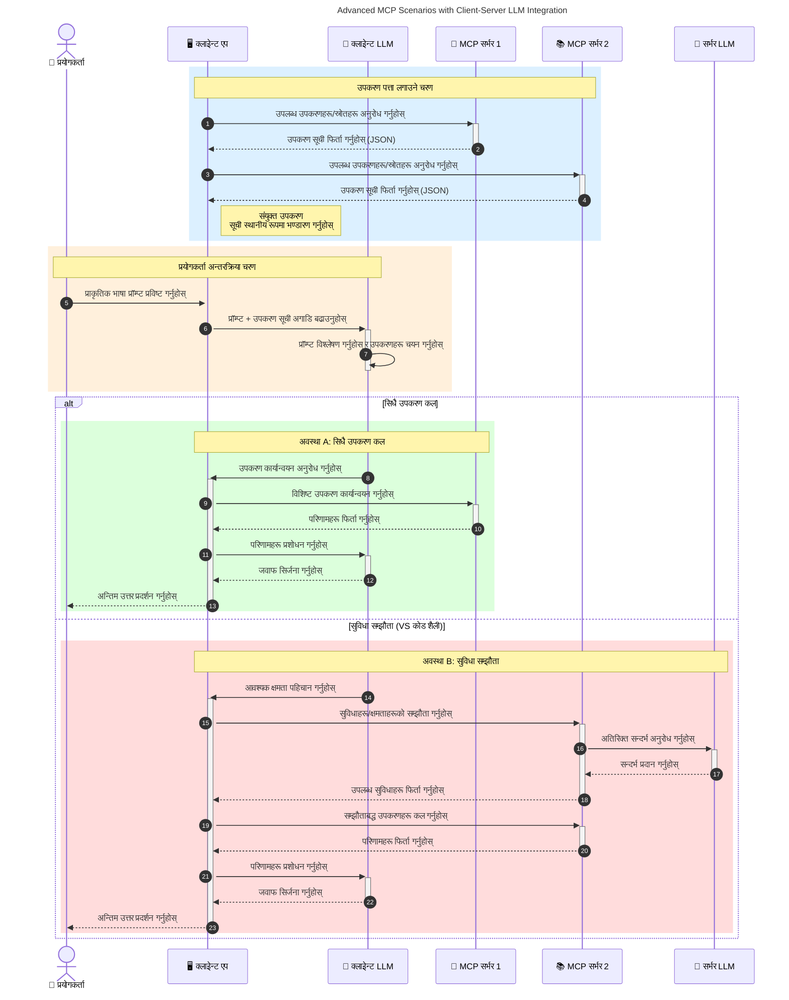

# मोडेल सन्दर्भ प्रोटोकल (MCP) परिचय: किन यो स्केलेबल AI अनुप्रयोगहरूका लागि महत्वपूर्ण छ

[](https://youtu.be/agBbdiOPLQA)

_(यस पाठको भिडियो हेर्न माथि चित्रमा क्लिक गर्नुहोस्)_

जनरेटिभ AI अनुप्रयोगहरू एक ठूलो प्रगति हुन् किनभने ती प्रायः प्रयोगकर्ताले प्राकृतिक भाषा प्रॉम्प्टको प्रयोग गरेर अनुप्रयोगसँग अन्तरक्रिया गर्न दिन्छन्। तर, त्यस्ता अनुप्रयोगहरूमा बढी समय र स्रोतहरू लगानी गर्दा, तपाईंले सजिलैसँग सुविधाहरू र स्रोतहरू समाहित गर्न सक्नुहुने सुनिश्चित गर्न चाहनुहुन्छ जसले विस्तार गर्न सजिलो होस्, तपाईंको अनुप्रयोग एक भन्दा बढी मोडेल प्रयोग गर्न सक्षम होस्, र विभिन्न मोडेल जटिलताहरू व्यवस्थित गर्न सकोस। छोटकरीमा, जनरेटिभ AI अनुप्रयोगहरू शुरुवातमा सहज बनाउने काम सजिलो छ, तर जब तिनीहरू बढ्छन् र जटिल हुन्छन्, तपाईंले वास्तुकला परिभाषित गर्न थाल्नुपर्छ र सम्भवतया एक मानकमा निर्भर हुनुपर्ने हुन्छ जसले तपाईंका अनुप्रयोगहरूलाई एकरूप तरिकाले निर्माण गर्न सुनिश्चित गर्दछ। MCP त्यहीँ आउँछ वस्तुहरू व्यवस्थापन गर्न र मानक प्रदान गर्न।

---

## **🔍 मोडेल सन्दर्भ प्रोटोकल (MCP) के हो?**

**मोडेल सन्दर्भ प्रोटोकल (MCP)** एउटा **खुला, मानकीकृत अन्तरफेस** हो जसले ठूलो भाषा मोडेलहरू (LLMs) लाई बिदेशी उपकरणहरू, एपीआईहरू, र डाटा स्रोतहरू सँग सहज रूपमा अन्तरक्रिया गर्न अनुमति दिन्छ। यसले AI मोडेलको कार्यक्षमता तिनको प्रशिक्षण डेटाबाट बाहिर विस्तार गर्न एक समान वास्तुकला प्रदान गर्दछ, जसले स्मार्ट, स्केलेबल, र प्रतिक्रियाशील AI प्रणालीहरू सक्षम बनाउँछ।

---

## **🎯 AI मा मानकीकरण किन आवश्यक छ**

जति जति जनरेटिभ AI अनुप्रयोगहरू जटिल बन्दैछन्, त्यति नै आवश्यक हुन्छ कि मानकहरू अपनाइयोस् जसले **स्केलेबिलिटी, विस्तारयोग्यता, मर्मतयोग्यता,** र **विक्रेता लक-इनबाट बच्न** सुनिश्चित गर्छ। MCP ले यी आवश्यकताहरू समाधान गर्दछ:

- मोडेल-उपकरण एकीकरणहरूलाई एकीकरण गर्ने
- कमजोर, एक-कपान कस्टम समाधानहरू घटाउने
- विभिन्न विक्रेताबाट आएका एक भन्दा बढी मोडेलहरू एउटै पारिस्थितिकी प्रणालीमा सहअस्तित्व गर्न दिने

**सूचना:** MCP आफुलाई एउटा खुला मानकको रूपमा स्थापित गर्छ तर कुनै पनि विद्यमान मानक निकायहरूमार्फत जस्तै IEEE, IETF, W3C, ISO, वा अन्य कुनै मानक निकायमार्फत मानकीकरण गर्ने योजना छैन।

---

## **📚 सिकाइ उद्देश्यहरू**

यस लेखको अन्त्यसम्म, तपाईं सक्षम हुनुहुनेछ:

- **मोडेल सन्दर्भ प्रोटोकल (MCP)** र यसको प्रयोग केसहरू परिभाषित गर्न
- MCP कसरी मोडेलदेखि उपकरण सञ्‍चारलाई मानकीकृत गर्छ बुझ्न
- MCP वास्तुकलाका मुख्य अवयवहरू पहिचान गर्न
- उद्यम र विकास सन्दर्भमा MCP को वास्तविक प्रयोगहरू अन्वेषण गर्न

---

## **💡 मोडेल सन्दर्भ प्रोटोकल (MCP) किन एक गेम-चेंजर हो**

### **🔗 MCP ले AI अन्तरक्रियाहरूमा टुक्रावाटो(फ्राग्मेन्टेशन) समाधान गर्छ**

MCP अघि, मोडेलहरू उपकरणहरूसँग संयोजन गर्न आवश्यक थियो:

- उपकरण-मोडेल जोडीप्रति कस्टम कोड
- प्रत्येक विक्रेताको गैर-मानक एपीआईहरू
- अपडेटहरूका कारण बारम्बार अवरोधहरू
- बढी उपकरणहरू सँग खराब स्केलेबिलिटी

### **✅ MCP मानकीकरणका लाभहरू**

| **लाभ**                 | **विवरण**                                                                          |
|--------------------------|------------------------------------------------------------------------------------|
| अन्तरसञ्चालनशीलता      | LLM हरू विभिन्न विक्रेताको उपकरणहरूसँग सहजै काम गर्छन्                         |
| एकरूपता                   | प्लेटफर्म र उपकरणहरूमा समान व्यवहार                                              |
| पुन: प्रयोगयोग्यता       | एक पटक निर्मित उपकरणहरू परियोजनाहरू र प्रणालीहरूमा प्रयोग गर्न सकिन्छ             |
| तीव्र विकास              | मानकीकृत, प्लग-अन्ड-प्ले अन्तरफेसहरू प्रयोग गरेर विकास समय घटाउने                  |

---

## **🧱 उच्च-स्तरीय MCP वास्तुकला अवलोकन**

MCP **क्लाइंट-सर्भर मोडेल** अनुसार चल्छ, जहाँ:

- **MCP होस्टहरू** AI मोडेलहरू सञ्चालन गर्छन्
- **MCP क्लाइंटहरू** अनुरोधहरू सुरु गर्छन्
- **MCP सर्भरहरू** सन्दर्भ, उपकरणहरू, र क्षमता प्रदान गर्छन्

### **मुख्य अवयवहरू:**

- **स्रोतहरू** – मोडेलहरूका लागि स्थिर या गतिशील डेटा  
- **प्रॉम्प्टहरू** – मार्गनिर्देशनका लागि पूर्वनिर्धारित कार्यप्रवाहहरू  
- **उपकरणहरू** – खोज, गणना जस्ता कार्यसम्पादनयोग्य फंक्शनहरू  
- **सैंप्लिङ (नमूना लिने)** – पुनरावृत्त अन्तरक्रियाहरू मार्फत एजेन्टिक व्यवहार (`2026-07-28` रिलिज क्यान्डीडेटमा निरस्त)  
- **प्रेरणा (इलिसिटेसन)** – सर्वरद्वारा सुरु गरिएका प्रयोगकर्ता इनपुट अनुरोधहरू  
- **मूलहरू (रुट्स)** – सर्वर पहुँच नियन्त्रणका लागि फाइल सिस्टम सीमाहरू (`2026-07-28` रिलिज क्यान्डीडेटमा निरस्त)  

### **प्रोटोकल वास्तुकला:**

MCP दुई तहको वास्तुकला प्रयोग गर्छ:
- **डेटा तह**: JSON-RPC 2.0 आधारित सञ्‍चार जसमा जीवनचक्र व्यवस्थापन र प्रिमिटिभहरू समावेश छन्
- **ट्रान्सपोर्ट तह**: STDIO (स्थानीय) र SSE सहित स्ट्रिमेबल HTTP (दूरस्थ) सञ्‍चार च्यानलहरू

---

## MCP सर्भरहरू कसरी काम गर्छन्

MCP सर्भरहरू तलका तरिकाले सञ्चालन हुन्छन्:

- **अनुरोध प्रवाह**:
    १. अन्त प्रयोगकर्ता वा तिनको तर्फबाट कार्य गर्ने सफ्टवेयरले अनुरोध सुरु गर्छ।
    २. **MCP क्लाइंट** अनुरोधलाई **MCP होस्ट** मा पठाउँछ, जुन AI मोडेल रनटाइम व्यवस्थापन गर्छ।
    ३. **AI मोडेल** प्रयोगकर्ताको प्रॉम्प्ट प्राप्त गर्छ र बाह्य उपकरण वा डाटामा पहुँच माग्न सक्छ एक वा बढी उपकरण कल मार्फत।
    ४. **MCP होस्ट**, मोडेलले सिधै होइन, उपयुक्त **MCP सर्भर(हरू)** सँग मानकीकृत प्रोटोकल प्रयोग गर्दै संचार गर्छ।
- **MCP होस्ट कार्यक्षमता**:
    - **उपकरण सूची**: उपलब्ध उपकरणहरू र तिनका क्षमताहरूको सूची राख्छ।
    - **प्रमाणीकरण**: उपकरण पहुँचको अनुमति प्रमाणित गर्छ।
    - **अनुरोध ह्यान्डलर**: मोडेलबाट आउने उपकरण अनुरोधहरू प्रक्रिया गर्छ।
    - **प्रतिक्रिया स्वरूपकर्ता**: उपकरण आउटपुटलाई मोडेलले बुझ्ने ढाँचामा बनाउँछ।
- **MCP सर्भर कार्यान्वयन**:
    - **MCP होस्ट** एक वा बढी **MCP सर्भरहरूसम्म** उपकरण कलहरू पठाउँछ, प्रत्येकले विशेष कार्यहरू (जस्तै खोज, गणना, डाटाबेस क्वेरी) प्रस्तुत गर्छ।
    - **MCP सर्भरहरू** आफ्ना क्रियाकलापहरू गर्छन् र परिणामहरूलाई समान ढाँचामा **MCP होस्ट** लाई फर्काउँछन्।
    - **MCP होस्ट** यी परिणामहरूलाई स्वरूपित गरी **AI मोडेल** लाई पुर्‍याउँछ।
- **प्रतिक्रिया समाप्ति**:
    - **AI मोडेल** उपकरण आउटपुटलाई अन्तिम प्रतिक्रियामा समावेश गर्छ।
    - **MCP होस्ट** यो प्रतिक्रिया **MCP क्लाइंट** लाई पठाउँछ, जसले यसलाई अन्त प्रयोगकर्ता वा कल गर्ने सफ्टवेयरलाई पुर्‍याउँछ।
    

```mermaid
---
title: MCP Architecture and Component Interactions
description: A diagram showing the flows of the components in MCP.
---
graph TD
    Client[MCP क्लाइंट/अनुप्रयोग] -->|अनुरोध पठाउनुहोस्| H[MCP होस्ट]
    H -->|बोलाउनुहोस्| A[AI मोडेल]
    A -->|उपकरण कल अनुरोध| H
    H -->|MCP Protocol| T1[MCP Server Tool 01: वेब खोज
    H -->|MCP Protocol| T2[MCP Server Tool 02: क्यालकुलेटर उपकरण
    H -->|MCP Protocol| T3[MCP Server Tool 03: डाटाबेस पहुँच उपकरण
    H -->|MCP Protocol| T4[MCP Server Tool 04: फाइल सिस्टम उपकरण
    H -->|प्रतिक्रिया पठाउनुहोस्| Client

    subgraph "MCP होस्ट कम्पोनेन्टहरू"
        H
        G[उपकरण दर्ता]
        I[प्रमाणीकरण]
        J[अनुरोध ह्यान्डलर]
        K[प्रतिक्रिया स्वरूपकर्ता]
    end

    H <--> G
    H <--> I
    H <--> J
    H <--> K

    style A fill:#f9d5e5,stroke:#333,stroke-width:2px
    style H fill:#eeeeee,stroke:#333,stroke-width:2px
    style Client fill:#d5e8f9,stroke:#333,stroke-width:2px
    style G fill:#fffbe6,stroke:#333,stroke-width:1px
    style I fill:#fffbe6,stroke:#333,stroke-width:1px
    style J fill:#fffbe6,stroke:#333,stroke-width:1px
    style K fill:#fffbe6,stroke:#333,stroke-width:1px
    style T1 fill:#c2f0c2,stroke:#333,stroke-width:1px
    style T2 fill:#c2f0c2,stroke:#333,stroke-width:1px
    style T3 fill:#c2f0c2,stroke:#333,stroke-width:1px
    style T4 fill:#c2f0c2,stroke:#333,stroke-width:1px
```

## 👨‍💻 कसरी MCP सर्भर बनाउने (उदाहरणहरू सहित)

MCP सर्भरहरूले तपाईंलाई LLM क्षमताहरू विस्तार गर्न डेटा र कार्यक्षमता प्रदान गरेर मद्दत गर्छन्। 

प्रयास गर्न तयार हुनुहुन्छ? यहाँ विभिन्न भाषा/स्ट्याकहरूमा सरल MCP सर्भरहरू सिर्जना गर्ने उदाहरण सहितका SDK हरू छन्:

- **Python SDK**: https://github.com/modelcontextprotocol/python-sdk

- **TypeScript SDK**: https://github.com/modelcontextprotocol/typescript-sdk

- **Java SDK**: https://github.com/modelcontextprotocol/java-sdk

- **C#/.NET SDK**: https://github.com/modelcontextprotocol/csharp-sdk


## 🌍 MCP का वास्तविक प्रयोग केसहरू

MCP ले AI क्षमता विस्तार गरेर विभिन्न अनुप्रयोगहरू सक्षम बनाउँछ:

| **अनुप्रयोग**              | **विवरण**                                                                  |
|------------------------------|----------------------------------------------------------------------------|
| उद्यम डाटा एकीकरण          | LLMs लाई डाटाबेस, CRM, वा आन्तरिक उपकरणहरूसँग जडान गर्ने                         |
| एजेन्टिक AI प्रणालीहरू      | उपकरण पहुँच र निर्णय-निर्माण कार्यप्रवाहसहित स्वायत्त एजेन्टहरू सक्षम बनाउने       |
| बहु-मोडल अनुप्रयोगहरू       | पाठ, छवि, र अडियो उपकरणहरू एउटै एकीकृत AI अनुप्रयोगमा संयोजन गर्ने               |
| वास्तविक-समय डाटा एकीकरण    | AI अन्तरक्रियाका लागि प्रत्यक्ष डाटा ल्याएर बढी शुद्ध, वर्तमान आउटपुटहरू उपलब्ध गराउने |


### 🧠 MCP = AI अन्तरक्रियाका लागि सार्वभौमिक मानक

मोडेल सन्दर्भ प्रोटोकल (MCP) AI अन्तरक्रियाका लागि एक सार्वभौमिक मानकको रूपमा कार्य गर्दछ, ठीक USB-C ले उपकरणहरूको भौतिक जडानहरू मानकीकृत गरेजस्तै। AI संसारमा, MCP ले समान अन्तरफेस दिन्छ जसले मोडेलहरू (क्लाइंटहरू) लाई बिदेशी उपकरण र डाटा प्रदायकहरू (सर्भरहरू) सँग सहज रूपमा एकीकृत गर्न दिन्छ। यसले प्रत्येक एपीआई वा डाटा स्रोतका लागि फरक-फरक कस्टम प्रोटोकलको आवश्यकता समाप्त गर्दछ।

MCP अन्तर्गत, MCP-अनुकूलित उपकरण (जसलाई MCP सर्भर भनिन्छ) एक एकीकृत मानकअनुसार काम गर्छ। यी सर्भरहरूले उनीहरूले प्रस्ताव गर्ने उपकरण वा क्रियाकलापहरूको सूची गर्न सक्छन् र एआई एजेन्टको अनुरोधमा ती कार्यहरू सम्पादन गर्छन्। एआई एजेन्ट प्लेटफर्महरूले MCP समर्थन गर्दा सर्भरहरूबाट उपलब्ध उपकरणहरू पत्ता लगाउन र यो मानक प्रोटोकलमार्फत तिनीहरूलाई चलाउन सक्षम हुन्छन्।

### 💡 ज्ञान पहुँचमा सुविधा प्रदान गर्दछ

उपकरणहरू प्रस्ताव गर्नुका अलावा, MCP ज्ञान पहुँच गर्न पनि सुविधा दिन्छ। यसले अनुप्रयोगहरूलाई ठूलो भाषा मोडेलहरू (LLMs) लाई विभिन्न डाटास्रोतहरूसँग जोडेर सन्दर्भ प्रदान गर्न सक्षम बनाउँछ। उदाहरणका लागि, MCP सर्भर कम्पनीको कागजात भण्डार प्रतिनिधित्व गर्न सक्छ, जसले एजेन्टहरूलाई माग अनुसार सम्बन्धित जानकारी पुनःप्राप्त गर्न दिन्छ। अर्को सर्भरले इमेल पठाउने या अभिलेख अपडेट गर्ने जस्ता विशिष्ट कार्यहरू ह्यान्डल गर्न सक्छ। एजेन्टको दृष्टिकोणबाट यी सबै उपकरणहरू हुन—केही उपकरणले डेटा (ज्ञान सन्दर्भ) फर्काउँछन् भने अरूले क्रियाकलाप गर्छन्। MCP दुबैलाई प्रभावकारी रूपमा व्यवस्थापन गर्छ।

एक एजेन्टले MCP सर्भरसँग जडान गर्दा स्वतः सर्भरका उपलब्ध क्षमताहरू र पहुँचयोग्य डाटा मानक ढाँचाबाट सिक्छ। यो मानकीकरणले गतिशील उपकरण उपलब्धता सक्षम बनाउँछ। उदाहरणका लागि, एउटा नयाँ MCP सर्भर एजेन्टको प्रणालीमा थप्दा, यसको कार्यहरू तुरुन्त प्रयोग गर्न सकिन्छ बिना एजेन्टका निर्देशनहरूमा थप अनुकूलन आवश्यक नपरेको।

यो प्रभावकारी एकीकरण तलको Diagram मा देखाइएझैं हुन्छ, जहाँ सर्भरहरूले उपकरण र ज्ञान दुवै प्रदान गर्छन्, प्रणालीहरूबीच निरन्तर सहकार्य सुनिश्चित गर्दै।

### 👉 उदाहरण: स्केलेबल एजेन्ट समाधान

```mermaid
---
title: Scalable Agent Solution with MCP
description: A diagram illustrating how a user interacts with an LLM that connects to multiple MCP servers, with each server providing both knowledge and tools, creating a scalable AI system architecture
---
graph TD
    User -->|संकेत| LLM
    LLM -->|प्रतिक्रिया| User
    LLM -->|MCP| ServerA
    LLM -->|MCP| ServerB
    ServerA -->|सार्वभौमिक कनेक्टर| ServerB
    ServerA --> KnowledgeA
    ServerA --> ToolsA
    ServerB --> KnowledgeB
    ServerB --> ToolsB

    subgraph सर्भर A
        KnowledgeA[ज्ञान]
        ToolsA[उपकरणहरू]
    end

    subgraph सर्भर B
        KnowledgeB[ज्ञान]
        ToolsB[उपकरणहरू]
    end
```
युनिभर्सल कनेक्टरले MCP सर्भरहरूलाई एकअर्कासँग सञ्‍चार गर्न र क्षमताहरू साझा गर्न अनुमति दिन्छ, जसले ServerA लाई ServerB लाई कार्य बहन गर्न वा यसको उपकरण र ज्ञान पहुँच गर्न सक्षम बनाउँछ। यसले सर्भरहरूबीच उपकरण र डाटा संघ प्रदान गर्छ, जसले स्केलेबल र मोडुलर एजेन्ट वास्तुकलाहरूलाई समर्थन गर्दछ। किनकि MCP उपकरणहरूको प्रकटीकरण मानकीकृत गर्छ, एजेन्टहरूले सर्भरहरू बीच गतिशील रूपमा उपकरणहरू फेला पार्न र अनुरोधहरू राउट गर्न सक्छन् बिना कडाइका पूर्वनिर्धारित संयोजनहरू।


उपकरण र ज्ञान संघ: उपकरणहरू र डाटा सर्भरहरूबीच पहुँचयोग्य हुन सक्छन्, जसले बढी स्केलेबल र मोडुलर एजेन्टिक वास्तुकलाहरू सक्षम पार्छ।

### 🔄 क्लाइंट-साइड LLM समावेशीकरणसहित उन्नत MCP परिदृश्यहरू

आधारभूत MCP वास्तुकलाअघि, यस्ता उन्नत परिदृश्यहरू छन् जहाँ दुबै क्लाइंट र सर्भरमा LLM हुन्छन्, जसले थप परिष्कृत अन्तरक्रिया सक्षम बनाउँछ। तलको Diagram मा, **क्लाइंट अनुप्रयोग** एउटा IDE हुन सक्छ जसमा प्रयोगकर्ताका लागि धेरै MCP उपकरण उपलब्ध छन्:



## 🔐 MCP को व्यावहारिक फाइदाहरू

MCP को प्रयोगबाट प्राप्त व्यावहारिक फाइदाहरू यहाँ छन्:

- **ताजगी**: मोडेलहरूले आफ्ना प्रशिक्षण डाटाभन्दा बाहिर अद्यावधिक जानकारी प्राप्त गर्न सक्छन्
- **क्षमता विस्तार**: मोडेलहरूले विशेष उपकरणहरूको प्रयोग गर्न सक्छन् जुन तिनीहरूलाई प्रशिक्षण दिइएको थिएन
- **हल्युसिनेशन घटाउने**: बाह्य डाटा स्रोतहरूले वास्तविक आधार प्रदान गर्छन्
- **गोपनीयता**: संवेदनशील डाटा सुरक्षित वातावरणमा रहन सक्छ, प्रॉम्प्टमा समाहित हुनुभन्दा

## 📌 मुख्य सिकाइहरू

MCP को प्रयोगका लागि मुख्य सिकाइहरू यहाँ छन्:

- **MCP** ले AI मोडेलहरू कसरी उपकरण र डाटा संग अन्तरक्रिया गर्छन् भन्ने कुरा मानकीकृत गर्छ
- **विस्तारयोग्यता, एकरूपता, र अन्तरसञ्चालनशीलता** बढावा दिन्छ
- MCP ले विकास समय घटाउन, विश्वसनीयता सुधार गर्न, र मोडेल क्षमताहरू विस्तार गर्न मद्दत गर्छ
- क्लाइंट-सर्भर वास्तुकलाले लचिलो, विस्तारयोग्य AI अनुप्रयोगहरू सक्षम बनाउँछ

## 🧠 व्यायाम

तपाईं जिस AI अनुप्रयोग बनाउन इच्छुक हुनुहुन्छ त्यसको बारेमा सोच्नुहोस्।

- कुन **बाह्य उपकरणहरू वा डाटा** ले यसको क्षमता बढाउन सक्छ?
- MCP ले एकीकरणलाई कसरी **सरल र विश्वसनीय बनाउँछ**?

## थप स्रोतहरू

- [MCP GitHub रिपोजिटरी](https://github.com/modelcontextprotocol)


## के हुन्छ पछि

अर्को: [अध्याय १: मुख्य अवधारणाहरू](../01-CoreConcepts/README.md)

---

<!-- CO-OP TRANSLATOR DISCLAIMER START -->
**अस्वीकरण**:
यो दस्तावेज़ AI अनुवाद सेवा [Co-op Translator](https://github.com/Azure/co-op-translator) प्रयोग गरेर अनुवाद गरिएको हो। हामी सही हुन प्रयास गर्छौं, तर कृपया जानकार हुनुस् कि स्वचालित अनुवादमा त्रुटिहरू वा अशुद्धताहरू हुन सक्छन्। मूल दस्तावेज़ यसको मूल भाषामा आधिकारिक स्रोत मानिनुपर्छ। महत्वपूर्ण जानकारीका लागि व्यावसायिक मानव अनुवाद सिफारिस गरिन्छ। यस अनुवादको प्रयोगबाट उत्पन्न कुनै पनि गलत बुझाइ वा त्रुटिको लागि हामी जिम्मेवार छैनौं।
<!-- CO-OP TRANSLATOR DISCLAIMER END -->