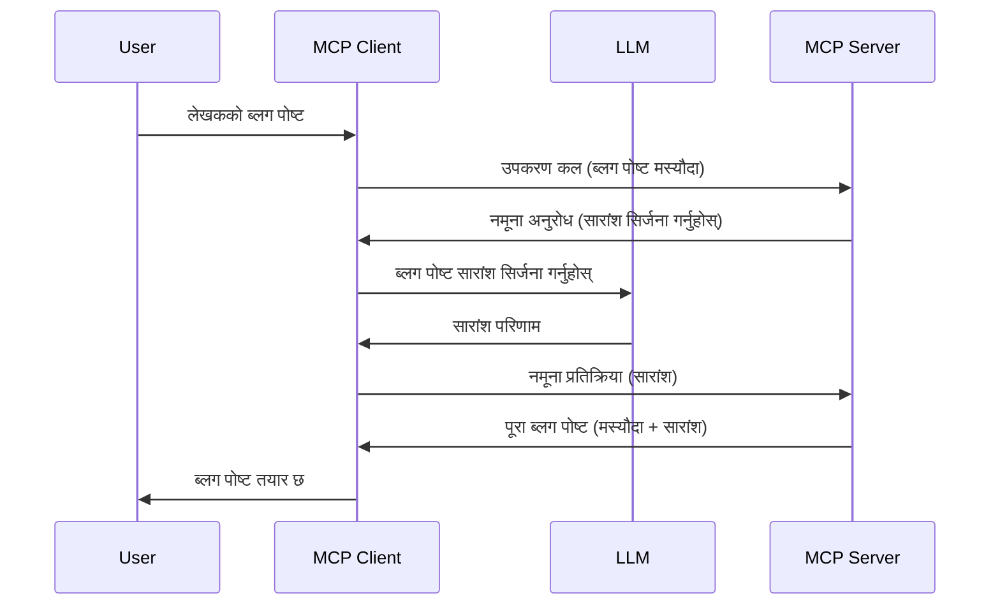

> [अप्रचलित: २०२६-०७-२८ रिलिज क्यान्डिडेट](https://blog.modelcontextprotocol.io/posts/2026-07-28-release-candidate/)

# स्याम्पलिंग - क्लाएन्टलाई सुविधाहरू सुम्पनुहोस्

> **अप्रचलन सूचना:** `२०२६-०७-२८` MCP विशिष्टता रिलिज क्यान्डिडेटले स्याम्पलिंगलाई LLM प्रदायक API हरूसँग प्रत्यक्ष एकीकरणको पक्षमा अप्रचलित बनाएको छ। स्याम्पलिंग `२०२५-११-२५` मा काम गर्न जारी रहनेछ र कुनै पनि औपचारिक अप्रचलन पछि कम्तीमा एक वर्षसम्म मान्य रहनेछ, त्यसैले यस पाठका सबै कुरा मान्य छन् — तर नयाँ सर्भर डिजाइनहरूले प्रतिस्थापन नमूनालाई मूल्यांकन गर्नुपर्छ। हेर्नुहोस् [MCP मा के परिवर्तन हुँदैछ: २०२६-०७-२८ रिलिज क्यान्डिडेट](../../01-CoreConcepts/mcp-2026-07-28-release-candidate.md)।

कहिलेकाहीँ, तपाईलाई MCP क्लाएन्ट र MCP सर्भरलाई एक साझा लक्ष्य प्राप्त गर्न सहकार्य गर्न आवश्यक पर्न सक्छ। तपाइंसँग यस्तो अवस्था हुन सक्छ जहाँ सर्भरलाई क्लाएन्टमा रहेको LLM को सहयोग चाहिन्छ। यस्तो अवस्थाको लागि, स्याम्पलिंग प्रयोग गर्नु पर्छ।

केही प्रयोग केसहरू अन्वेषण गरौं र स्याम्पलिंग समावेश गर्दै समाधान कसरी बनाउने जानौं।

## अवलोकन

यस पाठमा, हामी स्याम्पलिंग कहिले र कहाँ प्रयोग गर्ने, र यसको कन्फिगरेसन कसरी गर्ने भन्नेमा केन्द्रित छौं।

## सिकाइ उद्देश्यहरू

यस अध्यायमा हामी:

- स्याम्पलिंग के हो र कहिले प्रयोग गर्ने भनेर व्याख्या गर्नेछौं।
- MCP मा स्याम्पलिंग कन्फिगर कसरी गर्ने देखाउनेछौं।
- स्याम्पलिंगको उदाहरणहरू प्रदान गर्नेछौं।

## स्याम्पलिंग के हो र किन प्रयोग गर्ने?

स्याम्पलिंग एक उन्नत सुविधा हो जसले निम्न तरिकाले काम गर्दछ:



### स्याम्पलिंग अनुरोध

ठीक छ, अब हामीसँग एक विश्वसनीय परिदृश्यको उच्च स्तरको दृष्टिकोण छ, अब सर्भरले क्लाएन्टलाई पठाउने स्याम्पलिंग अनुरोधको बारेमा कुरा गरौं। JSON-RPC ढाँचामा यस्ता अनुरोध कस्तो देखिन्छ:

```json
{
  "jsonrpc": "2.0",
  "id": 1,
  "method": "sampling/createMessage",
  "params": {
    "messages": [
      {
        "role": "user",
        "content": {
          "type": "text",
          "text": "Create a blog post summary of the following blog post: <BLOG POST>"
        }
      }
    ],
    "modelPreferences": {
      "hints": [
        {
          "name": "claude-3-sonnet"
        }
      ],
      "intelligencePriority": 0.8,
      "speedPriority": 0.5
    },
    "systemPrompt": "You are a helpful assistant.",
    "maxTokens": 100
  }
}
```

यहाँ केही कुराहरू उल्लेख गर्न लायक छन्:

- सामग्री -> टेक्स्ट अन्तर्गत प्रोम्प्ट हाम्रो प्रोम्प्ट हो जुन LLM लाई ब्लग पोस्टको सामग्री सारांश गर्न निर्देशन हो।

- **modelPreferences**। यो भाग त्यहि हो, एक प्राथमिकता, LLM सँग कुन कन्फिगरेसन प्रयोग गर्ने सिफारिस। प्रयोगकर्ताले यी सिफारिसहरु स्वीकार्न वा परिवर्तन गर्न सक्छ। यस अवस्थामा मोडेल, गति, र बुद्धिमत्ता प्राथमिकताहरूमा सिफारिसहरू छन्।
- **systemPrompt**, यो तपाईंको सामान्य प्रणाली प्रोम्प्ट हो जसले तपाईंको LLM लाई व्यक्तित्व दिन्छ र निर्देशन समावेश गर्दछ।
- **maxTokens**, यो अर्को सम्पत्ति हो जुन यस कार्यका लागि कति टोकन प्रयोग गर्न सिफारिस गरिएको छ भन्ने कुरा बताउन प्रयोग हुन्छ।

### स्याम्पलिंग प्रतिक्रिया

यो प्रतिक्रिया हो जुन MCP क्लाएन्टले अन्ततः MCP सर्भरलाई पठाउँछ, र यो क्लाएन्टले LLM लाई कल गरेर प्राप्त गर्ने परिणाम हो, त्यसपछि यो सन्देश तयार पारिन्छ। JSON-RPC मा यसो देखिन्छ:

```json
{
  "jsonrpc": "2.0",
  "id": 1,
  "result": {
    "role": "assistant",
    "content": {
      "type": "text",
      "text": "Here's your abstract <ABSTRACT>"
    },
    "model": "gpt-5",
    "stopReason": "endTurn"
  }
}
```

ध्यान दिनुहोस् कि प्रतिक्रिया ब्लग पोस्टको सारांश जस्तै हामीले माग गरेका थियौं। साथै प्रयोग गरिएको `model` हामीले मागेको होइन तर "gpt-5" हो जुन "claude-3-sonnet" भन्दा माथि छ। यो देखाउनका लागि हो कि प्रयोगकर्ताले आफूले के प्रयोग गर्ने भन्ने निर्णय परिवर्तन गर्न सक्छन् र तपाईंको स्याम्पलिंग अनुरोध एउटा सिफारिस मात्र हो।

ठीक छ, अब मुख्य प्रवाह बुझिसक्यौं र प्रयोगको लागि सहयोगी कार्य "ब्लग पोस्ट सिर्जना + सारांश" का लागि उपयोगी छ, यसको काम गर्न के गर्नुपर्छ हेरौं।

### सन्देश प्रकारहरू

स्याम्पलिंग सन्देशहरू मात्र टेक्स्टमा सीमित छैन, तपाईंले चित्र र आवाज पनि पठाउन सक्नुहुन्छ। JSON-RPC यसरी फरक देखिन्छ:

**टेक्स्ट**

```json
{
  "type": "text",
  "text": "The message content"
}
```

**छवि सामग्री**

```json
{
  "type": "image",
  "data": "base64-encoded-image-data",
  "mimeType": "image/jpeg"
}
```

**अडियो सामग्री**

```json
{
  "type": "audio",
  "data": "base64-encoded-audio-data",
  "mimeType": "audio/wav"
}
```

> नोट: स्याम्पलिंगको बढी विस्तृत जानकारीको लागि, [अधिकृत कागजातहरू](https://modelcontextprotocol.io/specification/2025-11-25/client/sampling) हेर्नुहोस्।

## क्लाएन्टमा स्याम्पलिंग कसरी कन्फिगर गर्ने

> नोट: यदि तपाईं केवल सर्भर निर्माण गर्दै हुनुहुन्छ भने, यहाँ धेरै गर्न आवश्यक छैन।

क्लाएन्टमा, तपाईंले निम्न सुविधा यसरी निर्दिष्ट गर्न आवश्यक छ:

```json
{
  "capabilities": {
    "sampling": {}
  }
}
```

यसपछि तपाईंको चयन गरिएको क्लाएन्टले सर्भरसँग सुरु गर्दा यसलाई समात्नेछ।

## स्याम्पलिंगको कार्यान्वयन उदाहरण - ब्लग पोस्ट सिर्जना गर्नुहोस्

आउनुहोस् स्याम्पलिंग सर्भर कोड गरौं, हामीले निम्न गर्न आवश्यक छ:

1. सर्भरमा एउटा टुल सिर्जना गर्नुहोस्।
1. उक्त टुलले स्याम्पलिंग अनुरोध बनाउनेछ
1. टुलले क्लाएन्टको स्याम्पलिंग अनुरोधको जवाफ कुर्नेछ।
1. त्यसपछि टुलको परिणाम तयार हुनेछ।

कोडलाई चरण-द्वारा-चरण हेरौं:

### -1- टुल सिर्जना गर्नुहोस्

**python**

```python
@mcp.tool()
async def create_blog(title: str, content: str, ctx: Context[ServerSession, None]) -> str:
    """Create a blog post and generate a summary"""

```

### -2- स्याम्पलिंग अनुरोध बनाउनुहोस्

तपाईंको टुललाई निम्न कोडले विस्तार गर्नुहोस्:

**python**

```python
post = BlogPost(
        id=len(posts) + 1,
        title=title,
        content=content,
        abstract=""
    )

prompt = f"Create an abstract of the following blog post: title: {title} and draft: {content} "

result = await ctx.session.create_message(
        messages=[
            SamplingMessage(
                role="user",
                content=TextContent(type="text", text=prompt),
            )
        ],
        max_tokens=100,
)

```

### -3- जवाफ कुर्नुहोस् र जवाफ फर्काउनुहोस्

**python**

```python
post.abstract = result.content.text

posts.append(post)

# पूरा उत्पादन फिर्ता गर्नुहोस्
return json.dumps({
    "id": post.title,
    "abstract": post.abstract
})
```

### -4- पूर्ण कोड

**python**

```python
from starlette.applications import Starlette
from starlette.routing import Mount, Host

from mcp.server.fastmcp import Context, FastMCP

from mcp.server.session import ServerSession
from mcp.types import SamplingMessage, TextContent

import json


from uuid import uuid4
from typing import List
from pydantic import BaseModel


mcp = FastMCP("Blog post generator")

# app = FastAPI()

posts = []

class BlogPost(BaseModel):
    id: int
    title: str
    content: str
    abstract: str

posts: List[BlogPost] = []

@mcp.tool()
async def create_blog(title: str, content: str, ctx: Context[ServerSession, None]) -> str:
    """Create a blog post and generate a summary"""

    post = BlogPost(
        id=len(posts) + 1,
        title=title,
        content=content,
        abstract=""
    )

    prompt = f"Create an abstract of the following blog post: title: {title} and draft: {content} "

    result = await ctx.session.create_message(
        messages=[
            SamplingMessage(
                role="user",
                content=TextContent(type="text", text=prompt),
            )
        ],
        max_tokens=100,
    )

    post.abstract = result.content.text

    posts.append(post)

    # पूर्ण ब्लग पोस्ट फिर्ता गर्नुहोस्
    return json.dumps({
        "id": post.title,
        "abstract": post.abstract
    })

if __name__ == "__main__":
    print("Starting server...")
    # mcp.run()
    mcp.run(transport="streamable-http")

# यसरी अनुप्रयोग चलाउनुहोस्: python server.py
```

### -5- Visual Studio Code मा परीक्षण गर्ने

Visual Studio Code मा यो परीक्षण गर्न, निम्न गर्नुहोस्:

1. टर्मिनलमा सर्भर सुरु गर्नुहोस्
1. यसलाई *mcp.json* मा थप्नुहोस् (र सुरू भयो सुनिश्चित गर्नुहोस्) जस्तै:

   ```json
   "servers": {
      "blog-server": {
        "type": "http",
        "url": "http://localhost:8000/mcp"
      }
   }
   ```

1. एक प्रोम्प्ट टाइप गर्नुहोस्:

   ```text
   create a blog post named "Where Python comes from", the content is "Python is actually named after Monty Python Flying Circus"
   ```

1. स्याम्पलिंग हुन दिनुहोस्। पहिलो पटक यो परीक्षण गर्दा, तपाईंलाई अतिरिक्त संवाद स्वीकार्नुपर्नेछ, त्यसपछि तपाईंलाई टुल चलाउन अनुरोध गर्ने सामान्य संवाद देखिनेछ।

1. नतिजाहरू निरीक्षण गर्नुहोस्। तपाईं नतिजाहरुलाई GitHub Copilot Chat मा राम्रोसँग प्रदर्शित भएको देख्नुहुनेछ र त्यस्तै कच्चा JSON प्रतिक्रिया पनि हेर्न सक्नुहुनेछ।

**बोनस**। Visual Studio Code टुलहरूले स्याम्पलिंगमा उत्कृष्ट समर्थन गर्छन्। तपाईंले आफ्नो स्थापित सर्भरमा स्याम्पलिंग पहुँच कन्फिगर गर्न यस प्रकार जान सक्नुहुन्छ:

1. विस्तार खण्डमा जानुहोस्।
1. "MCP SERVERS - INSTALLED" खण्डमा आफ्नो स्थापित सर्भरको कग आइकन चयन गर्नुहोस्।
1 "Configure Model Access" चयन गर्नुहोस्, यहाँ तपाईंले GitHub Copilot ले स्याम्पलिंग गर्दा कुन मोडेलहरू प्रयोग गर्न अनुमति पाउने छनोट गर्न सक्नुहुन्छ। तपाईं ले हालै भएका सब स्याम्पलिंग अनुरोधहरू "Show Sampling requests" चयन गरेर हेर्न सक्नुहुन्छ।

## असाइनमेन्ट

यस असाइनमेन्टमा, तपाईंले अलिकति फरक स्याम्पलिंग बनाउनु पर्नेछ, अर्थात् एउटा स्याम्पलिंग एकीकरण जुन उत्पादन विवरण जेनरेट गर्न समर्थन गर्दछ। तपाईंको परिदृश्य यहाँ छ:

**परिदृश्य**: एक ई-कॉमर्सको ब्याक अफिस कर्मचारीलाई सहयोग चाहिन्छ, उत्पादन विवरणहरू बनाउनु धेरै समय लाग्छ। त्यसैले, तपाईंले यस्तो समाधान बनाउनु पर्नेछ जहाँ तपाईंले "create_product" नामको टुललाई "title" र "keywords" तर्कका साथ कल गर्न सक्नुहुन्छ र यसले "description" क्षेत्रमा ग्राहकको LLM द्वारा पूरै उत्पादन तयार पार्नुपर्नेछ।

सुझाव: पहिला सिकेका कुरा प्रयोग गरेर यो सर्भर र यसको टुल स्याम्पलिंग अनुरोध प्रयोग गरी निर्माण गर्नुहोस्।

## समाधान

[समाधान](./solution/README.md)

## मुख्य बुँदाहरू

स्याम्पलिंग एउटा शक्तिशाली सुविधा हो जसले सर्भरलाई LLM को सहयोग आवश्यक पर्दा क्लाएन्टलाई कार्यहरू सुम्पन अनुमति दिन्छ।

## के छ अर्को

- [अध्याय ४ - व्यावहारिक कार्यान्वयन](../../04-PracticalImplementation/README.md)

---

<!-- CO-OP TRANSLATOR DISCLAIMER START -->
**अस्वीकरण**:
यो दस्तावेज़ AI अनुवाद सेवा [Co-op Translator](https://github.com/Azure/co-op-translator) प्रयोग गरेर अनुवाद गरिएको हो। हामी सही हुन प्रयास गर्छौं, तर कृपया जानकार हुनुस् कि स्वचालित अनुवादमा त्रुटिहरू वा अशुद्धताहरू हुन सक्छन्। मूल दस्तावेज़ यसको मूल भाषामा आधिकारिक स्रोत मानिनुपर्छ। महत्वपूर्ण जानकारीका लागि व्यावसायिक मानव अनुवाद सिफारिस गरिन्छ। यस अनुवादको प्रयोगबाट उत्पन्न कुनै पनि गलत बुझाइ वा त्रुटिको लागि हामी जिम्मेवार छैनौं।
<!-- CO-OP TRANSLATOR DISCLAIMER END -->