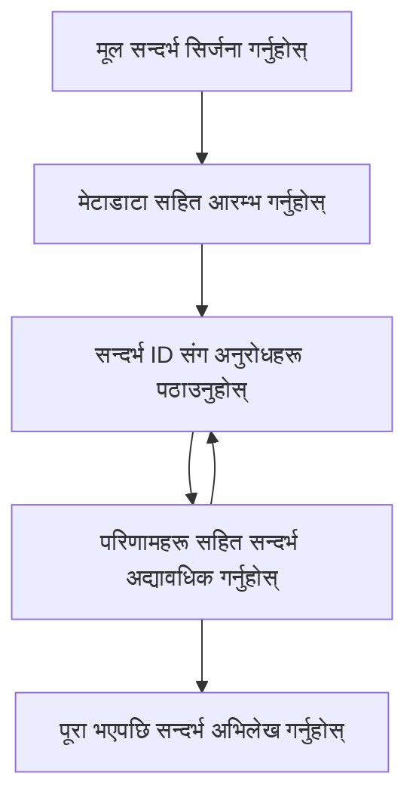

> [डिप्रेकेटेड: 2026-07-28 रिलिज क्यान्डिडेट](https://blog.modelcontextprotocol.io/posts/2026-07-28-release-candidate/#roots-sampling-and-logging-are-deprecated)

# MCP रुट सन्दर्भहरू

> **अप्रचलन सूचना:** `2026-07-28` MCP विनिर्देश रिलिज क्यान्डिडेटले रुटलाई उपकरण प्यारामिटरहरू, स्रोत URI, वा सर्भर कन्फिगरेसनको पक्षमा अप्रचलित बनाएको छ। रुटहरू `2025-11-25` मा र औपचारिक अप्रचलन पछि कम्तीमा एक वर्षसम्म काम गर्न जारी रहनेछन्, त्यसैले यो पाठमा सबै कुरा मान्य छ - तर नयाँ सर्भर डिजाइनहरूले प्रतिस्थापन ढाँचालाई मूल्याङ्कन गर्नुपर्छ। हेर्नुहोस् [MCP मा के परिवर्तन हुँदैछ: 2026-07-28 रिलिज क्यान्डिडेट](../../01-CoreConcepts/mcp-2026-07-28-release-candidate.md)।

रुट सन्दर्भहरू मोडल सन्दर्भ प्रोटोकलमा एक मौलिक अवधारणा हुन् जुन बहु अनुरोध र सत्रहरूमा वार्तालाप इतिहास र साझा अवस्था कायम राख्न स्थायी तह प्रदान गर्छन्।

## परिचय

यस पाठमा, हामी MCP मा रुट सन्दर्भहरू कसरी सिर्जना गर्ने, व्यवस्थापन गर्ने, र उपयोग गर्ने भनेर अन्वेषण गर्नेछौं। 

## सिकाइ उद्देश्यहरू

यस पाठको अन्त्यमा, तपाईं सक्षम हुनुहुनेछ:

- रुट सन्दर्भहरूको उद्देश्य र संरचना बुझ्न
- MCP क्लाइन्ट लाइब्रेरीहरू प्रयोग गरेर रुट सन्दर्भहरू सिर्जना र व्यवस्थापन गर्न
- .NET, Java, JavaScript, र Python अनुप्रयोगहरूमा रुट सन्दर्भहरू कार्यान्वयन गर्न
- बहु-चक्र वार्तालापहरू र अवस्था व्यवस्थापनका लागि रुट सन्दर्भहरू प्रयोग गर्न
- रुट सन्दर्भ व्यवस्थापनको लागि उत्कृष्ट अभ्यासहरू कार्यान्वयन गर्न

## रुट सन्दर्भहरू बुझ्न

रुट सन्दर्भहरू अनुक्रमिक सम्बन्धित अन्तरक्रियाहरूको इतिहास र अवस्था समात्ने कन्टेनरको रुपमा काम गर्छन्। तिनीहरूले सक्षम गर्छन्:

- **वार्तालाप स्थायित्व**: संगत बहु-चरण वार्तालाप कायम राख्न
- **मेमोरी व्यवस्थापन**: अन्तरक्रियाहरूमा जानकारी भण्डारण र पुन:प्राप्ति
- **अवस्था व्यवस्थापन**: जटिल कार्यप्रवाहहरूमा प्रगतिको ट्र्याकिङ
- **सन्दर्भ साझा गर्ने**: धेरै क्लाइन्टहरूलाई एउटै वार्तालाप अवस्थामा पहुँच दिन

MCP मा, रुट सन्दर्भहरूको केही प्रमुख विशेषताहरू छन्:

- प्रत्येक रुट सन्दर्भसँग एउटा अद्वितीय पहिचानकर्ता हुन्छ।
- तिनीहरूले वार्तालाप इतिहास, प्रयोगकर्ता प्राथमिकताहरू, र अन्य मेटाडाटा समावेश गर्न सक्छन्।
- तिनीहरू आवश्यकतानुसार सिर्जना, पहुँच, र आर्काइभ गर्न सकिन्छ।
- तिनीहरूले सूक्ष्म पहुंच नियन्त्रण र अनुमति समर्थन गर्दछन्।

## रुट सन्दर्भ जीवनचक्र



## रुट सन्दर्भहरूसँग काम गर्दै

यहाँ रुट सन्दर्भहरू कसरी सिर्जना र व्यवस्थापन गर्ने एउटा उदाहरण छ। 

### C# कार्यान्वयन

```csharp
// .NET Example: Root Context Management
using Microsoft.Mcp.Client;
using System;
using System.Threading.Tasks;
using System.Collections.Generic;

public class RootContextExample
{
    private readonly IMcpClient _client;
    private readonly IRootContextManager _contextManager;
    
    public RootContextExample(IMcpClient client, IRootContextManager contextManager)
    {
        _client = client;
        _contextManager = contextManager;
    }
    
    public async Task DemonstrateRootContextAsync()
    {
        // 1. Create a new root context
        var contextResult = await _contextManager.CreateRootContextAsync(new RootContextCreateOptions
        {
            Name = "Customer Support Session",
            Metadata = new Dictionary<string, string>
            {
                ["CustomerName"] = "Acme Corporation",
                ["PriorityLevel"] = "High",
                ["Domain"] = "Cloud Services"
            }
        });
        
        string contextId = contextResult.ContextId;
        Console.WriteLine($"Created root context with ID: {contextId}");
        
        // 2. First interaction using the context
        var response1 = await _client.SendPromptAsync(
            "I'm having issues scaling my web service deployment in the cloud.", 
            new SendPromptOptions { RootContextId = contextId }
        );
        
        Console.WriteLine($"First response: {response1.GeneratedText}");
        
        // Second interaction - the model will have access to the previous conversation
        var response2 = await _client.SendPromptAsync(
            "Yes, we're using containerized deployments with Kubernetes.", 
            new SendPromptOptions { RootContextId = contextId }
        );
        
        Console.WriteLine($"Second response: {response2.GeneratedText}");
        
        // 3. Add metadata to the context based on conversation
        await _contextManager.UpdateContextMetadataAsync(contextId, new Dictionary<string, string>
        {
            ["TechnicalEnvironment"] = "Kubernetes",
            ["IssueType"] = "Scaling"
        });
        
        // 4. Get context information
        var contextInfo = await _contextManager.GetRootContextInfoAsync(contextId);
        
        Console.WriteLine("Context Information:");
        Console.WriteLine($"- Name: {contextInfo.Name}");
        Console.WriteLine($"- Created: {contextInfo.CreatedAt}");
        Console.WriteLine($"- Messages: {contextInfo.MessageCount}");
        
        // 5. When the conversation is complete, archive the context
        await _contextManager.ArchiveRootContextAsync(contextId);
        Console.WriteLine($"Archived context {contextId}");
    }
}
```

माथिको कोडमा हामीले:

1. ग्राहक समर्थन सत्रको लागि रुट सन्दर्भ सिर्जना गर्यौं।
1. त्यस सन्दर्भ भित्र धेरै सन्देशहरू पठायौं, जसले मोडललाई अवस्था कायम राख्न अनुमति दियो।
1. वार्तालापको आधारमा सन्दर्भलाई सान्दर्भिक मेटाडाटाले अपडेट गर्यौं।
1. वार्तालाप इतिहास बुझ्न सन्दर्भ जानकारी प्राप्त गर्यौं।
1. वार्तालाप पूरा भएसँगै सन्दर्भलाई आर्काइभ गर्यौं।

## उदाहरण: वित्तीय विश्लेषणका लागि रुट सन्दर्भ कार्यान्वयन

यस उदाहरणमा, हामी वित्तीय विश्लेषण सत्रको लागि रुट सन्दर्भ सिर्जना गर्नेछौं, जसले बहु अन्तरक्रियाहरूमा कसरी अवस्था कायम गर्ने देखाउँछ।

### Java कार्यान्वयन

```java
// Java उदाहरण: रुट सन्दर्भ कार्यान्वयन
package com.example.mcp.contexts;

import com.mcp.client.McpClient;
import com.mcp.client.ContextManager;
import com.mcp.models.RootContext;
import com.mcp.models.McpResponse;

import java.util.HashMap;
import java.util.Map;
import java.util.UUID;

public class RootContextsDemo {
    private final McpClient client;
    private final ContextManager contextManager;
    
    public RootContextsDemo(String serverUrl) {
        this.client = new McpClient.Builder()
            .setServerUrl(serverUrl)
            .build();
            
        this.contextManager = new ContextManager(client);
    }
    
    public void demonstrateRootContext() throws Exception {
        // सन्दर्भ मेटाडाटा सिर्जना गर्नुहोस्
        Map<String, String> metadata = new HashMap<>();
        metadata.put("projectName", "Financial Analysis");
        metadata.put("userRole", "Financial Analyst");
        metadata.put("dataSource", "Q1 2025 Financial Reports");
        
        // 1. नयाँ रुट सन्दर्भ सिर्जना गर्नुहोस्
        RootContext context = contextManager.createRootContext("Financial Analysis Session", metadata);
        String contextId = context.getId();
        
        System.out.println("Created context: " + contextId);
        
        // 2. पहिलो अन्तरक्रिया
        McpResponse response1 = client.sendPrompt(
            "Analyze the trends in Q1 financial data for our technology division",
            contextId
        );
        
        System.out.println("First response: " + response1.getGeneratedText());
        
        // 3. प्रतिक्रिया बाट प्राप्त महत्वपूर्ण जानकारीसहित सन्दर्भ अपडेट गर्नुहोस्
        contextManager.addContextMetadata(contextId, 
            Map.of("identifiedTrend", "Increasing cloud infrastructure costs"));
        
        // दोस्रो अन्तरक्रिया - उस्तै सन्दर्भ प्रयोग गर्दै
        McpResponse response2 = client.sendPrompt(
            "What's driving the increase in cloud infrastructure costs?",
            contextId
        );
        
        System.out.println("Second response: " + response2.getGeneratedText());
        
        // 4. विश्लेषण सत्रको सारांश सिर्जना गर्नुहोस्
        McpResponse summaryResponse = client.sendPrompt(
            "Summarize our analysis of the technology division financials in 3-5 key points",
            contextId
        );
        
        // सारांशलाई सन्दर्भ मेटाडाटामा सङ्ग्रह गर्नुहोस्
        contextManager.addContextMetadata(contextId, 
            Map.of("analysisSummary", summaryResponse.getGeneratedText()));
            
        // अद्यावधिक सन्दर्भ जानकारी प्राप्त गर्नुहोस्
        RootContext updatedContext = contextManager.getRootContext(contextId);
        
        System.out.println("Context Information:");
        System.out.println("- Created: " + updatedContext.getCreatedAt());
        System.out.println("- Last Updated: " + updatedContext.getLastUpdatedAt());
        System.out.println("- Analysis Summary: " + 
            updatedContext.getMetadata().get("analysisSummary"));
            
        // 5. कार्य सम्पन्न हुँदा सन्दर्भ संग्रहित गर्नुहोस्
        contextManager.archiveContext(contextId);
        System.out.println("Context archived");
    }
}
```

माथिको कोडमा हामीले:

1. वित्तीय विश्लेषण सत्रको लागि रुट सन्दर्भ सिर्जना गर्यौं।
2. त्यस सन्दर्भ भित्र धेरै सन्देशहरू पठायौं, जसले मोडललाई अवस्था कायम राख्न अनुमति दियो।
3. वार्तालापको आधारमा सन्दर्भलाई सान्दर्भिक मेटाडाटाले अपडेट गर्यौं।
4. विश्लेषण सत्रको सारांश तयार गर्यौं र यसलाई सन्दर्भ मेटाडाटामा संग्रह गर्यौं।
5. वार्तालाप पूरा भएपछि सन्दर्भलाई आर्काइभ गर्यौं।

## उदाहरण: रुट सन्दर्भ व्यवस्थापन

रुट सन्दर्भहरू प्रभावकारी रूपमा व्यवस्थापन गर्नु वार्तालाप इतिहास र अवस्था कायम राख्न अत्यावश्यक छ। तल रुट सन्दर्भ व्यवस्थापन कसरी कार्यान्वयन गर्ने एउटा उदाहरण छ।

### JavaScript कार्यान्वयन

```javascript
// JavaScript उदाहरण: MCP मूल सन्दर्भ व्यवस्थापन
const { McpClient, RootContextManager } = require('@mcp/client');

class ContextSession {
  constructor(serverUrl, apiKey = null) {
    // MCP क्लाइन्ट सुरु गर्नुहोस्
    this.client = new McpClient({
      serverUrl,
      apiKey
    });
    
    // सन्दर्भ व्यवस्थापक सुरु गर्नुहोस्
    this.contextManager = new RootContextManager(this.client);
  }
  
  /**
   * Create a new conversation context
   * @param {string} sessionName - Name of the conversation session
   * @param {Object} metadata - Additional metadata for the context
   * @returns {Promise<string>} - Context ID
   */
  async createConversationContext(sessionName, metadata = {}) {
    try {
      const contextResult = await this.contextManager.createRootContext({
        name: sessionName,
        metadata: {
          ...metadata,
          createdAt: new Date().toISOString(),
          status: 'active'
        }
      });
      
      console.log(`Created root context '${sessionName}' with ID: ${contextResult.id}`);
      return contextResult.id;
    } catch (error) {
      console.error('Error creating root context:', error);
      throw error;
    }
  }
  
  /**
   * Send a message in an existing context
   * @param {string} contextId - The root context ID
   * @param {string} message - The user's message
   * @param {Object} options - Additional options
   * @returns {Promise<Object>} - Response data
   */
  async sendMessage(contextId, message, options = {}) {
    try {
      // निर्दिष्ट सन्दर्भ प्रयोग गरी सन्देश पठाउनुहोस्
      const response = await this.client.sendPrompt(message, {
        rootContextId: contextId,
        temperature: options.temperature || 0.7,
        allowedTools: options.allowedTools || []
      });
      
      // वैकल्पिक रूपमा कुराकानीका महत्वपूर्ण तथ्य भण्डारण गर्नुहोस्
      if (options.storeInsights) {
        await this.storeConversationInsights(contextId, message, response.generatedText);
      }
      
      return {
        message: response.generatedText,
        toolCalls: response.toolCalls || [],
        contextId
      };
    } catch (error) {
      console.error(`Error sending message in context ${contextId}:`, error);
      throw error;
    }
  }
  
  /**
   * Store important insights from a conversation
   * @param {string} contextId - The root context ID
   * @param {string} userMessage - User's message
   * @param {string} aiResponse - AI's response
   */
  async storeConversationInsights(contextId, userMessage, aiResponse) {
    try {
      // सम्भावित तथ्यहरू निकाल्नुहोस् (एक वास्तविक अनुप्रयोगमा यो अधिक जटिल हुनेछ)
      const combinedText = userMessage + "\n" + aiResponse;
      
      // सम्भावित तथ्यहरू पहिचान गर्न सरल नियम
      const insightWords = ["important", "key point", "remember", "significant", "crucial"];
      
      const potentialInsights = combinedText
        .split(".")
        .filter(sentence => 
          insightWords.some(word => sentence.toLowerCase().includes(word))
        )
        .map(sentence => sentence.trim())
        .filter(sentence => sentence.length > 10);
      
      // तथ्यहरू सन्दर्भ मेटाडाटामा भण्डारण गर्नुहोस्
      if (potentialInsights.length > 0) {
        const insights = {};
        potentialInsights.forEach((insight, index) => {
          insights[`insight_${Date.now()}_${index}`] = insight;
        });
        
        await this.contextManager.updateContextMetadata(contextId, insights);
        console.log(`Stored ${potentialInsights.length} insights in context ${contextId}`);
      }
    } catch (error) {
      console.warn('Error storing conversation insights:', error);
      // गैर-गम्भीर त्रुटि, त्यसैले केवल चेतावनी लग गर्नुहोस्
    }
  }
  
  /**
   * Get summary information about a context
   * @param {string} contextId - The root context ID
   * @returns {Promise<Object>} - Context information
   */
  async getContextInfo(contextId) {
    try {
      const contextInfo = await this.contextManager.getContextInfo(contextId);
      
      return {
        id: contextInfo.id,
        name: contextInfo.name,
        created: new Date(contextInfo.createdAt).toLocaleString(),
        lastUpdated: new Date(contextInfo.lastUpdatedAt).toLocaleString(),
        messageCount: contextInfo.messageCount,
        metadata: contextInfo.metadata,
        status: contextInfo.status
      };
    } catch (error) {
      console.error(`Error getting context info for ${contextId}:`, error);
      throw error;
    }
  }
  
  /**
   * Generate a summary of the conversation in a context
   * @param {string} contextId - The root context ID
   * @returns {Promise<string>} - Generated summary
   */
  async generateContextSummary(contextId) {
    try {
      // मोडेललाई अहिलेसम्मको कुराकानीको सारांश उत्पादन गर्न भन्नुहोस्
      const response = await this.client.sendPrompt(
        "Please summarize our conversation so far in 3-4 sentences, highlighting the main points discussed.",
        { rootContextId: contextId, temperature: 0.3 }
      );
      
      // सारांश सन्दर्भ मेटाडाटामा भण्डारण गर्नुहोस्
      await this.contextManager.updateContextMetadata(contextId, {
        conversationSummary: response.generatedText,
        summarizedAt: new Date().toISOString()
      });
      
      return response.generatedText;
    } catch (error) {
      console.error(`Error generating context summary for ${contextId}:`, error);
      throw error;
    }
  }
  
  /**
   * Archive a context when it's no longer needed
   * @param {string} contextId - The root context ID
   * @returns {Promise<Object>} - Result of the archive operation
   */
  async archiveContext(contextId) {
    try {
      // संग्रहण अघि अन्तिम सारांश उत्पादन गर्नुहोस्
      const summary = await this.generateContextSummary(contextId);
      
      // सन्दर्भ संग्रह गर्नुहोस्
      await this.contextManager.archiveContext(contextId);
      
      return {
        status: "archived",
        contextId,
        summary
      };
    } catch (error) {
      console.error(`Error archiving context ${contextId}:`, error);
      throw error;
    }
  }
}

// उदाहरण प्रयोग
async function demonstrateContextSession() {
  const session = new ContextSession('https://mcp-server-example.com');
  
  try {
    // 1. उत्पादन समर्थन कुराकानीका लागि नयाँ सन्दर्भ सिर्जना गर्नुहोस्
    const contextId = await session.createConversationContext(
      'Product Support - Database Performance',
      {
        customer: 'Globex Corporation',
        product: 'Enterprise Database',
        severity: 'Medium',
        supportAgent: 'AI Assistant'
      }
    );
    
    // 2. कुराकानीमा पहिलो सन्देश
    const response1 = await session.sendMessage(
      contextId,
      "I'm experiencing slow query performance on our database cluster after the latest update.",
      { storeInsights: true }
    );
    console.log('Response 1:', response1.message);
    
    // उही सन्दर्भमा फलोअप सन्देश
    const response2 = await session.sendMessage(
      contextId,
      "Yes, we've already checked the indexes and they seem to be properly configured.",
      { storeInsights: true }
    );
    console.log('Response 2:', response2.message);
    
    // 3. सन्दर्भ बारे जानकारी प्राप्त गर्नुहोस्
    const contextInfo = await session.getContextInfo(contextId);
    console.log('Context Information:', contextInfo);
    
    // 4. कुराकानी सारांश उत्पादन गरी देखाउनुहोस्
    const summary = await session.generateContextSummary(contextId);
    console.log('Conversation Summary:', summary);
    
    // 5. समाप्त भएपछि सन्दर्भ संग्रह गर्नुहोस्
    const archiveResult = await session.archiveContext(contextId);
    console.log('Archive Result:', archiveResult);
    
    // 6. कुनै पनि त्रुटिलाई सहजरूपमा व्यवस्थापन गर्नुहोस्
  } catch (error) {
    console.error('Error in context session demonstration:', error);
  }
}

demonstrateContextSession();
```

माथिको कोडमा हामीले:

1. `createConversationContext` फन्क्सनसँग उत्पादन समर्थन वार्तालापको लागि रुट सन्दर्भ सिर्जना गर्यौं। यो सन्दर्भ डेटाबेस प्रदर्शन समस्याहरूको बारेमा छ।

1. `sendMessage` फन्क्सन प्रयोग गरेर त्यस सन्दर्भ भित्र धेरै सन्देशहरू पठायौं, जसले मोडललाई अवस्था कायम राख्न अनुमति दियो। पठाइएका सन्देशहरू ढिलो क्वेरी प्रदर्शन र अनुक्रमणिका कन्फिगरेसनका बारेमा थिए।

1. वार्तालापको आधारमा सन्दर्भलाई सान्दर्भिक मेटाडाटाले अपडेट गर्यौं।

1. `generateContextSummary` फन्क्सन प्रयोग गरेर वार्तालापको सारांश तयार गर्यौं र यसलाई सन्दर्भ मेटाडाटामा संग्रह गर्यौं।

1. वार्तालाप पूरा भएपछि सन्दर्भलाई `archiveContext` फन्क्सन प्रयोग गरेर आर्काइभ गर्यौं।

1. मजबुती सुनिश्चित गर्न त्रुटिहरूलाई सजिलोसँग ह्यान्डल गर्यौं।

## बहु-चक्र सहायता लागि रुट सन्दर्भ

यस उदाहरणमा, हामी बहु-चक्र सहायता सत्रको लागि रुट सन्दर्भ सिर्जना गर्नेछौं, जसले बहु अन्तरक्रियाहरूमा कसरी अवस्था कायम गर्ने देखाउँछ।

### Python कार्यान्वयन

```python
# Python उदाहरण: बहु-चरण सहायता को लागि रूट सन्दर्भ
import asyncio
from datetime import datetime
from mcp_client import McpClient, RootContextManager

class AssistantSession:
    def __init__(self, server_url, api_key=None):
        self.client = McpClient(server_url=server_url, api_key=api_key)
        self.context_manager = RootContextManager(self.client)
    
    async def create_session(self, name, user_info=None):
        """Create a new root context for an assistant session"""
        metadata = {
            "session_type": "assistant",
            "created_at": datetime.now().isoformat(),
        }
        
        # प्रयोगकर्ता जानकारी थप्नुहोस् यदि प्रदान गरिएको छ भने
        if user_info:
            metadata.update({f"user_{k}": v for k, v in user_info.items()})
            
        # रूट सन्दर्भ सिर्जना गर्नुहोस्
        context = await self.context_manager.create_root_context(name, metadata)
        return context.id
    
    async def send_message(self, context_id, message, tools=None):
        """Send a message within a root context"""
        # सन्दर्भ ID सँग विकल्पहरू सिर्जना गर्नुहोस्
        options = {
            "root_context_id": context_id
        }
        
        # उपकरणहरू थप्नुहोस् यदि निर्दिष्ट गरिएको छ भने
        if tools:
            options["allowed_tools"] = tools
        
        # सन्दर्भ भित्र प्रॉम्प्ट पठाउनुहोस्
        response = await self.client.send_prompt(message, options)
        
        # वार्तालाप प्रगतिको साथ सन्दर्भ मेटाडाटा अपडेट गर्नुहोस्
        await self.context_manager.update_context_metadata(
            context_id,
            {
                f"message_{datetime.now().timestamp()}": message[:50] + "...",
                "last_interaction": datetime.now().isoformat()
            }
        )
        
        return response
    
    async def get_conversation_history(self, context_id):
        """Retrieve conversation history from a context"""
        context_info = await self.context_manager.get_context_info(context_id)
        messages = await self.client.get_context_messages(context_id)
        
        return {
            "context_info": context_info,
            "messages": messages
        }
    
    async def end_session(self, context_id):
        """End an assistant session by archiving the context"""
        # पहिले सारांश प्रॉम्प्ट उत्पन्न गर्नुहोस्
        summary_response = await self.client.send_prompt(
            "Please summarize our conversation and any key points or decisions made.",
            {"root_context_id": context_id}
        )
        
        # मेटाडाटामा सारांश भण्डारण गर्नुहोस्
        await self.context_manager.update_context_metadata(
            context_id,
            {
                "summary": summary_response.generated_text,
                "ended_at": datetime.now().isoformat(),
                "status": "completed"
            }
        )
        
        # सन्दर्भ सङ्ग्रह गर्नुहोस्
        await self.context_manager.archive_context(context_id)
        
        return {
            "status": "completed",
            "summary": summary_response.generated_text
        }

# उदाहरण प्रयोग
async def demo_assistant_session():
    assistant = AssistantSession("https://mcp-server-example.com")
    
    # 1. सत्र सिर्जना गर्नुहोस्
    context_id = await assistant.create_session(
        "Technical Support Session",
        {"name": "Alex", "technical_level": "advanced", "product": "Cloud Services"}
    )
    print(f"Created session with context ID: {context_id}")
    
    # 2. पहिलो अन्तरक्रिया
    response1 = await assistant.send_message(
        context_id, 
        "I'm having trouble with the auto-scaling feature in your cloud platform.",
        ["documentation_search", "diagnostic_tool"]
    )
    print(f"Response 1: {response1.generated_text}")
    
    # समान सन्दर्भमा दोस्रो अन्तरक्रिया
    response2 = await assistant.send_message(
        context_id,
        "Yes, I've already checked the configuration settings you mentioned, but it's still not working."
    )
    print(f"Response 2: {response2.generated_text}")
    
    # 3. इतिहास प्राप्त गर्नुहोस्
    history = await assistant.get_conversation_history(context_id)
    print(f"Session has {len(history['messages'])} messages")
    
    # 4. सत्र समाप्त गर्नुहोस्
    end_result = await assistant.end_session(context_id)
    print(f"Session ended with summary: {end_result['summary']}")

if __name__ == "__main__":
    asyncio.run(demo_assistant_session())
```

माथिको कोडमा हामीले:

1. `create_session` फन्क्सनसँग प्राविधिक समर्थन सत्रको लागि रुट सन्दर्भ सिर्जना गर्यौं। सन्दर्भमा प्रयोगकर्ताको नाम र प्राविधिक स्तर जस्ता जानकारी समावेश छ।

1. `send_message` फन्क्सन प्रयोग गरेर त्यस सन्दर्भ भित्र धेरै सन्देशहरू पठायौं, जसले मोडललाई अवस्था कायम राख्न अनुमति दियो। पठाइएका सन्देशहरू अटो-स्केलिङ सुविधा सम्बन्धी समस्याहरूका बारेमा थिए।

1. `get_conversation_history` फन्क्सन प्रयोग गरेर वार्तालाप इतिहास प्राप्त गर्यौं जसले सन्दर्भ जानकारी र सन्देशहरू प्रदान गर्छ।

1. `end_session` फन्क्सन प्रयोग गरेर सत्र समाप्त गर्दै सन्दर्भ आर्काइभ गर्यौं र सारांश तयार गर्यौं। सारांशले वार्तालापका मुख्य बुँदाहरू समेट्छ।

## रुट सन्दर्भ उत्कृष्ट अभ्यासहरू

यहाँ रुट सन्दर्भहरू प्रभावकारी रूपमा व्यवस्थापनको लागि केही उत्कृष्ट अभ्यासहरू छन्:

- **केन्द्रित सन्दर्भहरू सिर्जना गर्नुहोस्**: स्पष्टता कायम राख्न विभिन्न वार्तालाप उद्देश्य वा डोमेनहरूका लागि अलग रुट सन्दर्भहरू सिर्जना गर्नुहोस्।

- **समाप्ति नीतिहरू सेट गर्नुहोस्**: संग्रह वा पुराना सन्दर्भहरू मेट्ने नीतिहरू कार्यान्वयन गरेर भण्डारण व्यवस्थापन गर्नुहोस् र डाटा अवधारण नीतिहरू पालना गर्नुहोस्।

- **सान्दर्भिक मेटाडाटा संग्रह गर्नुहोस्**: सन्दर्भ मेटाडाटामा वार्तालापको महत्वपूर्ण जानकारी संग्रह गर्नुहोस् जुन पछि उपयोगी हुन सक्छ।

- **सन्दर्भ ID को निरन्तर प्रयोग गर्नुहोस्**: सन्दर्भ सिर्जना भइसकेपछि सबै सम्बन्धित अनुरोधहरूका लागि यसको ID निरन्तर प्रयोग गरेर निरन्तरता कायम राख्नुहोस्।

- **सारांशहरू उत्पादन गर्नुहोस्**: सन्दर्भ ठूलो भएपछि, आवश्यक जानकारी समेट्न र सन्दर्भ आकार व्यवस्थापन गर्न सारांशहरू उत्पादन गर्ने विचार गर्नुस्।

- **पहुँच नियन्त्रण कार्यान्वयन गर्नुहोस्**: बहु-प्रयोगकर्ता प्रणालीहरूको लागि, वार्तालाप सन्दर्भहरूको गोपनीयता र सुरक्षा सुनिश्चित गर्न उपयुक्त पहुँच नियन्त्रणहरू लागू गर्नुहोस्।

- **सन्दर्भ सीमाहरू ह्यान्डल गर्नुहोस्**: सन्दर्भ आकार सीमाहरूमा सचेत हुनुहोस् र धेरै लामो वार्तालापहरू ह्यान्डल गर्न रणनीतिहरू कार्यान्वयन गर्नुहोस्।

- **पूरा भएसँगै आर्काइभ गर्नुहोस्**: वार्तालाप पूरा भएपछि सन्दर्भहरू संग्रह गरेर स्रोतहरू मुक्त गर्नुहोस् र वार्तालाप इतिहास सुरक्षित गर्नुहोस्।

## अब के हुन्छ

- [5.5 रूटिङ](../mcp-routing/README.md)

---

<!-- CO-OP TRANSLATOR DISCLAIMER START -->
**अस्वीकरण**:
यो दस्तावेज़ AI अनुवाद सेवा [Co-op Translator](https://github.com/Azure/co-op-translator) प्रयोग गरेर अनुवाद गरिएको हो। हामी सही हुन प्रयास गर्छौं, तर कृपया जानकार हुनुस् कि स्वचालित अनुवादमा त्रुटिहरू वा अशुद्धताहरू हुन सक्छन्। मूल दस्तावेज़ यसको मूल भाषामा आधिकारिक स्रोत मानिनुपर्छ। महत्वपूर्ण जानकारीका लागि व्यावसायिक मानव अनुवाद सिफारिस गरिन्छ। यस अनुवादको प्रयोगबाट उत्पन्न कुनै पनि गलत बुझाइ वा त्रुटिको लागि हामी जिम्मेवार छैनौं।
<!-- CO-OP TRANSLATOR DISCLAIMER END -->