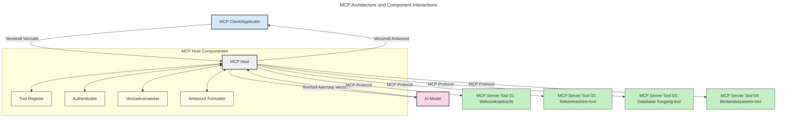
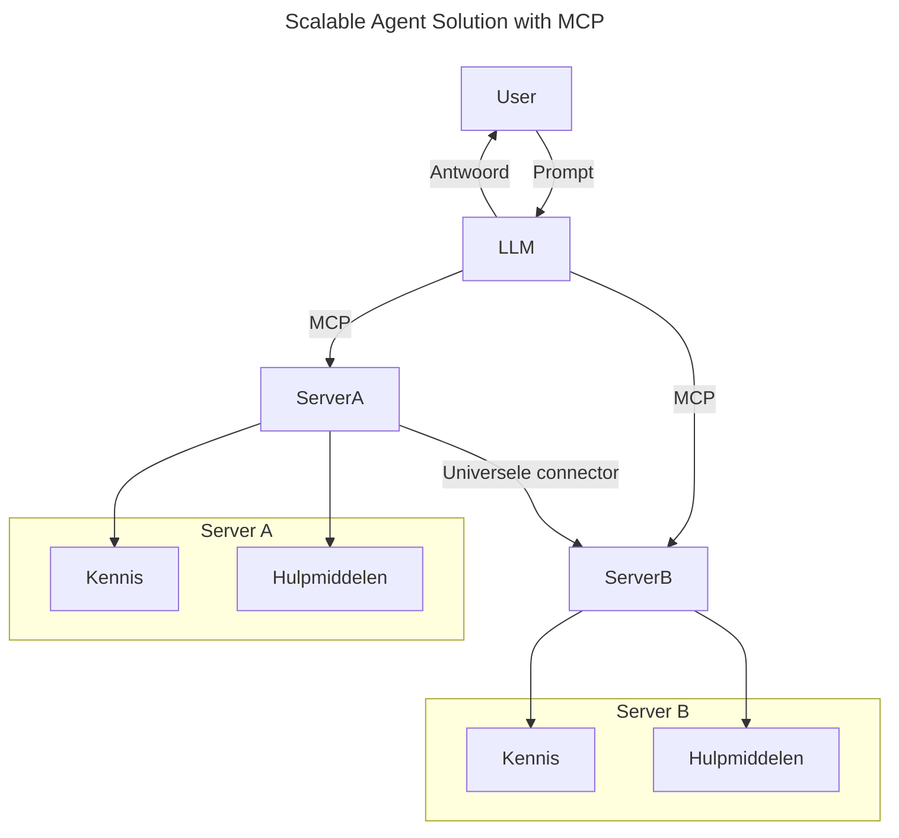
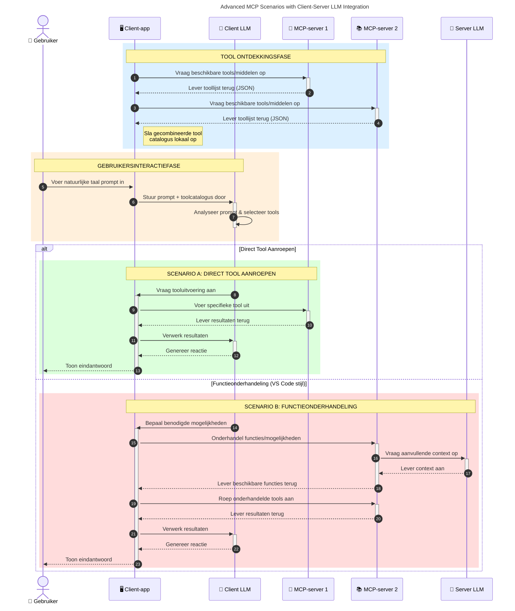

# Inleiding tot het Model Context Protocol (MCP): Waarom het Belangrijk is voor Schaalbare AI-toepassingen

_(Klik op de afbeelding hierboven om de video van deze les te bekijken)_

Generatieve AI-toepassingen zijn een geweldige stap vooruit omdat ze gebruikers vaak laten communiceren met de app via natuurlijke taal prompts. Echter, naarmate er meer tijd en middelen in dergelijke apps worden geïnvesteerd, wil je ervoor zorgen dat je functies en middelen eenvoudig kunt integreren op zo'n manier dat het makkelijk uitbreidbaar is, dat je app meer dan één model kan gebruiken, en kan omgaan met verschillende modelcomplexiteiten. Kortom, het bouwen van Gen AI-apps is makkelijk om mee te beginnen, maar naarmate ze groeien en complexer worden, moet je een architectuur definiëren en zal je waarschijnlijk moeten vertrouwen op een standaard om ervoor te zorgen dat je apps op een consistente manier worden gebouwd. Dit is waar MCP in beeld komt om de zaken te organiseren en een standaard te bieden.

---

## **🔍 Wat is het Model Context Protocol (MCP)?**

Het **Model Context Protocol (MCP)** is een **open, gestandaardiseerde interface** die Large Language Models (LLM's) in staat stelt naadloos te communiceren met externe tools, API's en gegevensbronnen. Het biedt een consistente architectuur om de functionaliteit van AI-modellen te verbeteren voorbij hun trainingsdata, waardoor slimmere, schaalbare en responsievere AI-systemen mogelijk worden.

---

## **🎯 Waarom standaardisatie in AI belangrijk is**

Naarmate generatieve AI-toepassingen complexer worden, is het essentieel om standaarden te adopteren die zorgen voor **schaalbaarheid, uitbreidbaarheid, onderhoudbaarheid** en **het vermijden van vendor lock-in**. MCP voorziet in deze behoeften door:

- Integratie van model-tools te verenigen
- Het verminderen van broze, eendimensionale maatwerkoplossingen
- Meerdere modellen van verschillende leveranciers te laten samenwerken binnen één ecosysteem

**Opmerking:** Hoewel MCP zichzelf presenteert als een open standaard, zijn er geen plannen om MCP te standaardiseren via bestaande standaardenorganisaties zoals IEEE, IETF, W3C, ISO, of andere standaardenorganen.

---

## **📚 Leerdoelen**

Aan het einde van dit artikel kun je:

- Het **Model Context Protocol (MCP)** definiëren en de gebruikssituaties ervan beschrijven
- Begrijpen hoe MCP de communicatie tussen model en tool standaardiseert
- De kerncomponenten van de MCP-architectuur identificeren
- Praktijkvoorbeelden van MCP onderzoeken in enterprise- en ontwikkelcontexten

---

## **💡 Waarom het Model Context Protocol (MCP) een Doorbraak is**

### **🔗 MCP lost fragmentatie in AI-interacties op**

Voor MCP vereiste het integreren van modellen met tools:

- Maatwerkcode per tool-modelcombinatie
- Niet-gestandaardiseerde API's voor elke leverancier
- Regelmatige onderbrekingen door updates
- Slechte schaalbaarheid bij meer tools

### **✅ Voordelen van MCP Standaardisatie**

| **Voordeel**              | **Beschrijving**                                                                |
|--------------------------|--------------------------------------------------------------------------------|
| Interoperabiliteit       | LLM's werken naadloos met tools van verschillende leveranciers                   |
| Consistentie            | Uniform gedrag over platforms en tools                                          |
| Hergebruik              | Tools die eenmaal zijn gebouwd kunnen worden gebruikt in verschillende projecten en systemen |
| Versnelde Ontwikkeling  | Vermindert ontwikkeltijd door gebruik van gestandaardiseerde, plug-and-play interfaces |

---

## **🧱 Hoog-niveau Overzicht van MCP Architectuur**

MCP volgt een **client-servermodel**, waarbij:

- **MCP Hosts** draaien de AI-modellen
- **MCP Clients** initiëren verzoeken
- **MCP Servers** leveren context, tools en mogelijkheden

### **Belangrijke componenten:**

- **Resources** – Statische of dynamische data voor modellen  
- **Prompts** – Vooraf gedefinieerde workflows voor begeleide generaties  
- **Tools** – Uitvoerbare functies zoals zoeken, berekeningen  
- **Sampling** – Agentgedrag via recursieve interacties (afgeschaft in release kandidaat `2026-07-28`)
- **Elicitation** – Server-geïnitieerde verzoeken om gebruikersinvoer
- **Roots** – Bestandsysteem-grenzen voor servertoegangscontrole (afgeschaft in release kandidaat `2026-07-28`)

### **Protocol Architectuur:**

MCP gebruikt een architectuur met twee lagen:
- **Datalayer**: Communicatie gebaseerd op JSON-RPC 2.0 met levenscyclusbeheer en primitieve functies
- **Transportlaag**: STDIO (lokaal) en Streamable HTTP met SSE (remote) communicatiekanalen

---

## Hoe MCP Servers Werken

MCP-servers werken als volgt:

- **Verzoekstroom**:
    1. Een verzoek wordt geïnitieerd door een eindgebruiker of software die namens hen handelt.
    2. De **MCP Client** stuurt het verzoek naar een **MCP Host**, die de AI Model runtime beheert.
    3. Het **AI Model** ontvangt de gebruikersprompt en kan toegang aanvragen tot externe tools of data via één of meer toolaanroepen.
    4. De **MCP Host**, niet het model direct, communiceert met de juiste **MCP Server(s)** via het gestandaardiseerde protocol.
- **Functionaliteit van MCP Host**:
    - **Tool Registry**: Beheert een catalogus van beschikbare tools en hun mogelijkheden.
    - **Authenticatie**: Verifieert permissies voor tooltoegang.
    - **Request Handler**: Verwerkt binnenkomende toolverzoeken van het model.
    - **Response Formatter**: Structureert tooluitvoer in een voor het model begrijpelijk formaat.
- **Uitvoering MCP Server**:
    - De **MCP Host** leidt toolaanroepen door naar één of meer **MCP Servers**, elk met gespecialiseerde functies (bijv. zoeken, berekeningen, databasequery's).
    - De **MCP Servers** voeren hun respectievelijke operaties uit en sturen resultaten terug naar de **MCP Host** in een consistent formaat.
    - De **MCP Host** formatteert en zendt deze resultaten door aan het **AI Model**.
- **Afhandeling Antwoord**:
    - Het **AI Model** verwerkt de tooluitvoer in een eindantwoord.
    - De **MCP Host** stuurt dit antwoord terug naar de **MCP Client**, die het levert aan de eindgebruiker of de opvragende software.
    

## 👨‍💻 Hoe Maak je een MCP Server (Met Voorbeelden)

MCP-servers stellen je in staat de mogelijkheden van LLM's uit te breiden door data en functionaliteit te bieden.

Klaar om het te proberen? Hier zijn taal- en/of stack-specifieke SDK's met voorbeelden van het maken van eenvoudige MCP-servers in verschillende talen/stacks:

- **Python SDK**: https://github.com/modelcontextprotocol/python-sdk

- **TypeScript SDK**: https://github.com/modelcontextprotocol/typescript-sdk

- **Java SDK**: https://github.com/modelcontextprotocol/java-sdk

- **C#/.NET SDK**: https://github.com/modelcontextprotocol/csharp-sdk

## 🌍 Praktijkvoorbeelden voor MCP

MCP maakt een breed scala aan toepassingen mogelijk door AI-mogelijkheden uit te breiden:

| **Toepassing**              | **Beschrijving**                                                                |
|------------------------------|--------------------------------------------------------------------------------|
| Enterprise Data Integratie  | Verbind LLM's met databases, CRM's, of interne tools                           |
| Agentische AI Systemen      | Maak autonome agenten mogelijk met tooltoegang en besluitvormingsworkflows      |
| Multi-modale Toepassingen   | Combineer tekst-, beeld- en audiotools in één enkele AI-app                    |
| Real-time Data Integratie   | Breng live data in AI-interacties voor nauwkeuriger, actuele output            |

### 🧠 MCP = Universele Standaard voor AI-interacties

Het Model Context Protocol (MCP) fungeert als een universele standaard voor AI-interacties, vergelijkbaar met hoe USB-C fysische verbindingen voor apparaten heeft gestandaardiseerd. In de wereld van AI biedt MCP een consistente interface waardoor modellen (clients) naadloos kunnen integreren met externe tools en databronnen (servers). Dit elimineert de noodzaak voor diverse, aangepaste protocollen voor elke API of databron.

Onder MCP volgt een MCP-compatibele tool (vermeld als MCP-server) een uniforme standaard. Deze servers kunnen de tools of acties die zij aanbieden weergeven en die acties uitvoeren op verzoek van een AI-agent. AI-agentplatformen die MCP ondersteunen, kunnen beschikbare tools van de servers ontdekken en aanroepen via dit standaardprotocol.

### 💡 Maakt toegang tot kennis mogelijk

Naast het aanbieden van tools faciliteert MCP ook de toegang tot kennis. Het stelt applicaties in staat om context te bieden aan large language models (LLM's) door ze te koppelen aan verschillende gegevensbronnen. Bijvoorbeeld, een MCP-server kan een documentenrepository van een bedrijf vertegenwoordigen, waardoor agenten relevante informatie op aanvraag kunnen ophalen. Een andere server kan specifieke acties verzorgen zoals het verzenden van e-mails of het bijwerken van records. Vanuit het perspectief van de agent zijn dit simpelweg tools die hij kan gebruiken—sommige tools leveren data (kenniscontext), terwijl andere acties uitvoeren. MCP beheert beide efficiënt.

Een agent die verbinding maakt met een MCP-server leert automatisch over de beschikbare mogelijkheden en toegankelijke data van de server via een standaardformaat. Deze standaardisatie maakt dynamische toolbeschikbaarheid mogelijk. Bijvoorbeeld, het toevoegen van een nieuwe MCP-server aan het systeem van een agent maakt de functies direct bruikbaar zonder verdere aanpassing van de instructies van de agent.

Deze gestroomlijnde integratie sluit aan bij de stroom die wordt afgebeeld in het volgende diagram, waarin servers zowel tools als kennis leveren, wat zorgt voor naadloze samenwerking tussen systemen.

### 👉 Voorbeeld: Schaalbare Agentoplossing

De Universal Connector stelt MCP-servers in staat om te communiceren en mogelijkheden met elkaar te delen, waardoor ServerA taken kan delegeren aan ServerB of toegang kan krijgen tot diens tools en kennis. Dit federereert tools en data over servers, wat schaalbare en modulaire agentarchitecturen ondersteunt. Omdat MCP de blootstelling van tools standaardiseert, kunnen agenten dynamisch tools ontdekken en verzoeken tussen servers routeren zonder vast gecodeerde integraties.

Federatie van tools en kennis: Tools en data kunnen over servers worden benaderd, wat meer schaalbare en modulaire agentische architecturen mogelijk maakt.

### 🔄 Geavanceerde MCP-scenario's met client-side LLM-integratie

Naast de basale MCP-architectuur zijn er geavanceerde scenario's waarbij zowel client als server LLM's bevatten, wat meer geavanceerde interacties mogelijk maakt. In het volgende diagram kan **Client App** een IDE zijn met een aantal MCP-tools beschikbaar voor gebruik door de LLM:

## 🔐 Praktische Voordelen van MCP

Hier zijn de praktische voordelen van het gebruik van MCP:

- **Actualiteit**: Modellen kunnen toegang krijgen tot up-to-date informatie buiten hun trainingsdata
- **Mogelijkheid Uitbreiding**: Modellen kunnen gespecialiseerde tools gebruiken voor taken waarvoor ze niet getraind zijn
- **Verminderde Hallucinaties**: Externe gegevensbronnen bieden feitelijke onderbouwing
- **Privacy**: Gevoelige data kan binnen veilige omgevingen blijven in plaats van in prompts ingebed te zijn

## 📌 Belangrijkste Leerpunten

Dit zijn de belangrijkste leerpunten voor het gebruik van MCP:

- **MCP** standaardiseert hoe AI-modellen met tools en data interacteren
- Bevordert **uitbreidbaarheid, consistentie en interoperabiliteit**
- MCP helpt **ontwikkeltijd te verminderen, betrouwbaarheid te verbeteren en modelmogelijkheden uit te breiden**
- De client-serverarchitectuur **maakt flexibele, uitbreidbare AI-toepassingen mogelijk**

## 🧠 Oefening

Denk na over een AI-toepassing die je graag wilt bouwen.

- Welke **externe tools of data** zouden de mogelijkheden kunnen verbeteren?
- Hoe zou MCP integratie **eenvoudiger en betrouwbaarder** kunnen maken?

## Aanvullende Bronnen

- [MCP GitHub Repository](https://github.com/modelcontextprotocol)

## Wat volgt

Volgend: [Hoofdstuk 1: Kernconcepten](../01-CoreConcepts/README.md)

---

<!-- CO-OP TRANSLATOR DISCLAIMER START -->
**Disclaimer**:
Dit document is vertaald met behulp van de AI vertaaldienst [Co-op Translator](https://github.com/Azure/co-op-translator). Hoewel we streven naar nauwkeurigheid, dient u er rekening mee te houden dat geautomatiseerde vertalingen fouten of onnauwkeurigheden kunnen bevatten. Het originele document in de oorspronkelijke taal moet worden beschouwd als de gezaghebbende bron. Voor kritieke informatie wordt professionele menselijke vertaling aanbevolen. Wij zijn niet aansprakelijk voor eventuele misverstanden of verkeerde interpretaties die voortvloeien uit het gebruik van deze vertaling.
<!-- CO-OP TRANSLATOR DISCLAIMER END -->