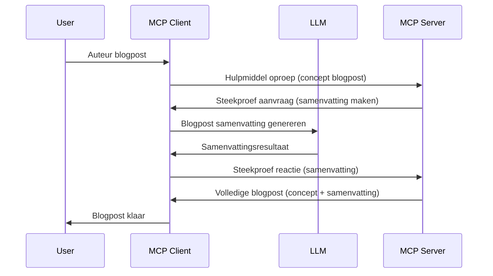

> [VEROUDERD: 2026-07-28 RELEASEKANDIDAAT](https://blog.modelcontextprotocol.io/posts/2026-07-28-release-candidate/)

# Sampling - delegeren van functies aan de Client

> **Afstemmingsmelding:** de `2026-07-28` MCP specificatie releasekandidaat markeert Sampling als verouderd ten gunste van directe integratie met LLM-provider API's. Sampling blijft werken in `2025-11-25` en minstens een jaar na elke formele veroudering, dus alles in deze les blijft geldig — maar nieuwe serverontwerpen moeten het vervangende patroon evalueren. Zie [Wat verandert er in MCP: De 2026-07-28 Release Candidate](../../01-CoreConcepts/mcp-2026-07-28-release-candidate.md).

Soms moet de MCP Client en MCP Server samenwerken om een gemeenschappelijk doel te bereiken. Je kunt een situatie hebben waarin de Server de hulp van een LLM nodig heeft die op de client zit. Voor deze situatie is sampling wat je zou moeten gebruiken.

Laten we enkele gebruikssituaties verkennen en hoe je een oplossing bouwt met sampling.

## Overzicht

In deze les richten we ons op het uitleggen wanneer en waar Sampling te gebruiken en hoe het te configureren.

## Leerdoelen

In dit hoofdstuk zullen we:

- Uitleggen wat Sampling is en wanneer het te gebruiken.
- Tonen hoe Sampling in MCP te configureren.
- Voorbeelden geven van Sampling in actie.

## Wat is Sampling en waarom gebruiken?

Sampling is een geavanceerde functie die op de volgende manier werkt:



### Samplingaanvraag

Oké, nu we een globaal overzicht hebben van een geloofwaardig scenario, laten we praten over de samplingaanvraag die de server terugstuurt naar de client. Dit is hoe zo'n aanvraag eruit kan zien in JSON-RPC-formaat:

```json
{
  "jsonrpc": "2.0",
  "id": 1,
  "method": "sampling/createMessage",
  "params": {
    "messages": [
      {
        "role": "user",
        "content": {
          "type": "text",
          "text": "Create a blog post summary of the following blog post: <BLOG POST>"
        }
      }
    ],
    "modelPreferences": {
      "hints": [
        {
          "name": "claude-3-sonnet"
        }
      ],
      "intelligencePriority": 0.8,
      "speedPriority": 0.5
    },
    "systemPrompt": "You are a helpful assistant.",
    "maxTokens": 100
  }
}
```

Er zijn een paar dingen die het waard zijn om op te merken:

- Prompt, onder content -> text, is onze prompt, een instructie voor de LLM om blogpostinhoud samen te vatten.

- **modelPreferences**. Dit gedeelte is precies dat, een voorkeur, een aanbeveling welke configuratie te gebruiken met de LLM. De gebruiker kan kiezen of hij deze aanbevelingen volgt of aanpast. In dit geval zijn er aanbevelingen over welk model te gebruiken en prioriteit op snelheid en intelligentie.
- **systemPrompt**, dit is je normale systeemprompt die je LLM een persoonlijkheid geeft en instructies bevat.
- **maxTokens**, dit is een andere eigenschap die aangeeft hoeveel tokens aanbevolen worden voor deze taak.

### Samplingantwoord

Dit antwoord is wat de MCP Client uiteindelijk terugstuurt naar de MCP Server en is het resultaat van het aanroepen van de LLM door de client, wachten op dat antwoord en dan dit bericht construeren. Zo kan het eruitzien in JSON-RPC:

```json
{
  "jsonrpc": "2.0",
  "id": 1,
  "result": {
    "role": "assistant",
    "content": {
      "type": "text",
      "text": "Here's your abstract <ABSTRACT>"
    },
    "model": "gpt-5",
    "stopReason": "endTurn"
  }
}
```

Let op hoe het antwoord een samenvatting is van de blogpost, net zoals we vroegen. Let ook op hoe het gebruikte `model` niet is wat we vroegen maar "gpt-5" in plaats van "claude-3-sonnet". Dit illustreert dat de gebruiker van gedachten kan veranderen over wat te gebruiken en dat je samplingaanvraag een aanbeveling is.

Oké, nu we de hoofdworkflow begrijpen en een bruikbare taak om het toe te passen "blogpostcreatie + samenvatting", laten we zien wat we moeten doen om het werkend te krijgen.

### Berichttypen

Samplingberichten zijn niet beperkt tot alleen tekst maar je kunt ook afbeeldingen en audio versturen. Zo ziet JSON-RPC er anders uit:

**Tekst**

```json
{
  "type": "text",
  "text": "The message content"
}
```

**Afbeeldingsinhoud**

```json
{
  "type": "image",
  "data": "base64-encoded-image-data",
  "mimeType": "image/jpeg"
}
```

**Audio-inhoud**

```json
{
  "type": "audio",
  "data": "base64-encoded-audio-data",
  "mimeType": "audio/wav"
}
```

> OPMERKING: voor meer gedetailleerde info over Sampling, bekijk de [officiële docs](https://modelcontextprotocol.io/specification/2025-11-25/client/sampling)

## Hoe Sampling in de Client te Configureren

> Opmerking: als je alleen een server bouwt, hoef je hier niet veel te doen.

In een client moet je de volgende functie zo specificeren:

```json
{
  "capabilities": {
    "sampling": {}
  }
}
```

Dit wordt dan opgepikt wanneer je gekozen client initialiseert met de server.

## Voorbeeld van Sampling in Actie - Maak een Blog Post

Laten we samen een sampling server coderen, we moeten het volgende doen:

1. Maak een tool aan op de Server.
1. Die tool maakt een samplingaanvraag
1. Tool moet wachten tot de samplingaanvraag van de client beantwoord is.
1. Dan moet het toolresultaat geproduceerd worden.

Laten we de code stap voor stap bekijken:

### -1- Maak de tool

**python**

```python
@mcp.tool()
async def create_blog(title: str, content: str, ctx: Context[ServerSession, None]) -> str:
    """Create a blog post and generate a summary"""

```

### -2- Maak een samplingaanvraag

Breid je tool uit met de volgende code:

**python**

```python
post = BlogPost(
        id=len(posts) + 1,
        title=title,
        content=content,
        abstract=""
    )

prompt = f"Create an abstract of the following blog post: title: {title} and draft: {content} "

result = await ctx.session.create_message(
        messages=[
            SamplingMessage(
                role="user",
                content=TextContent(type="text", text=prompt),
            )
        ],
        max_tokens=100,
)

```

### -3- Wacht op het antwoord en retourneer het antwoord

**python**

```python
post.abstract = result.content.text

posts.append(post)

# retourneer het complete product
return json.dumps({
    "id": post.title,
    "abstract": post.abstract
})
```

### -4- Volledige code

**python**

```python
from starlette.applications import Starlette
from starlette.routing import Mount, Host

from mcp.server.fastmcp import Context, FastMCP

from mcp.server.session import ServerSession
from mcp.types import SamplingMessage, TextContent

import json


from uuid import uuid4
from typing import List
from pydantic import BaseModel


mcp = FastMCP("Blog post generator")

# app = FastAPI()

posts = []

class BlogPost(BaseModel):
    id: int
    title: str
    content: str
    abstract: str

posts: List[BlogPost] = []

@mcp.tool()
async def create_blog(title: str, content: str, ctx: Context[ServerSession, None]) -> str:
    """Create a blog post and generate a summary"""

    post = BlogPost(
        id=len(posts) + 1,
        title=title,
        content=content,
        abstract=""
    )

    prompt = f"Create an abstract of the following blog post: title: {title} and draft: {content} "

    result = await ctx.session.create_message(
        messages=[
            SamplingMessage(
                role="user",
                content=TextContent(type="text", text=prompt),
            )
        ],
        max_tokens=100,
    )

    post.abstract = result.content.text

    posts.append(post)

    # retourneer het volledige blogbericht
    return json.dumps({
        "id": post.title,
        "abstract": post.abstract
    })

if __name__ == "__main__":
    print("Starting server...")
    # mcp.run()
    mcp.run(transport="streamable-http")

# run de app met: python server.py
```

### -5- Testen in Visual Studio Code

Om dit te testen in Visual Studio Code, doe het volgende:

1. Start de server in de terminal
1. Voeg het toe aan *mcp.json* (en zorg dat het gestart is) bijvoorbeeld zoiets als:

   ```json
   "servers": {
      "blog-server": {
        "type": "http",
        "url": "http://localhost:8000/mcp"
      }
   }
   ```

1. Typ een prompt:

   ```text
   create a blog post named "Where Python comes from", the content is "Python is actually named after Monty Python Flying Circus"
   ```

1. Sta toe dat sampling plaatsvindt. De eerste keer dat je dit test krijg je een extra dialoog die je moet accepteren, daarna zie je de normale dialoog om je te vragen een tool uit te voeren.

1. Bekijk de resultaten. Je ziet de resultaten zowel fraai weergegeven in GitHub Copilot Chat als de ruwe JSON-respons.

**Bonus**. Visual Studio Code heeft uitstekende ondersteuning voor sampling. Je kunt Sampling-toegang configureren op je geïnstalleerde server door daar zo naartoe te navigeren:

1. Ga naar de extensiesectie.
1. Selecteer het tandwielicoontje voor je geïnstalleerde server in de sectie "MCP SERVERS - INSTALLED".
1 Selecteer "Configure Model Access", hier kun je selecteren welke modellen GitHub Copilot mag gebruiken bij het uitvoeren van sampling. Je kunt ook alle recente samplingaanvragen bekijken door te kiezen voor "Show Sampling requests".

## Opdracht

In deze opdracht bouw je een iets andere Sampling, namelijk een sampling-integratie die productbeschrijvingen ondersteunt genereren. Dit is je scenario:

**Scenario**: De backoffice medewerker van een e-commerce heeft hulp nodig, het kost veel te veel tijd om productbeschrijvingen te maken. Daarom bouw je een oplossing waarbij je een tool "create_product" kunt aanroepen met "title" en "keywords" als argumenten en deze moet een compleet product produceren inclusief een "description"-veld die door een client-LLM gevuld wordt.

TIP: gebruik wat je eerder hebt geleerd om deze server en zijn tool te construeren met een samplingaanvraag.

## Oplossing

[Oplossing](./solution/README.md)

## Belangrijkste leerpunten

Sampling is een krachtige functie die de server in staat stelt taken te delegeren aan de client wanneer hulp van een LLM nodig is.

## Wat Nu

- [Hoofdstuk 4 - Praktische implementatie](../../04-PracticalImplementation/README.md)

---

<!-- CO-OP TRANSLATOR DISCLAIMER START -->
**Disclaimer**:
Dit document is vertaald met behulp van de AI vertaaldienst [Co-op Translator](https://github.com/Azure/co-op-translator). Hoewel we streven naar nauwkeurigheid, dient u er rekening mee te houden dat geautomatiseerde vertalingen fouten of onnauwkeurigheden kunnen bevatten. Het originele document in de oorspronkelijke taal moet worden beschouwd als de gezaghebbende bron. Voor kritieke informatie wordt professionele menselijke vertaling aanbevolen. Wij zijn niet aansprakelijk voor eventuele misverstanden of verkeerde interpretaties die voortvloeien uit het gebruik van deze vertaling.
<!-- CO-OP TRANSLATOR DISCLAIMER END -->