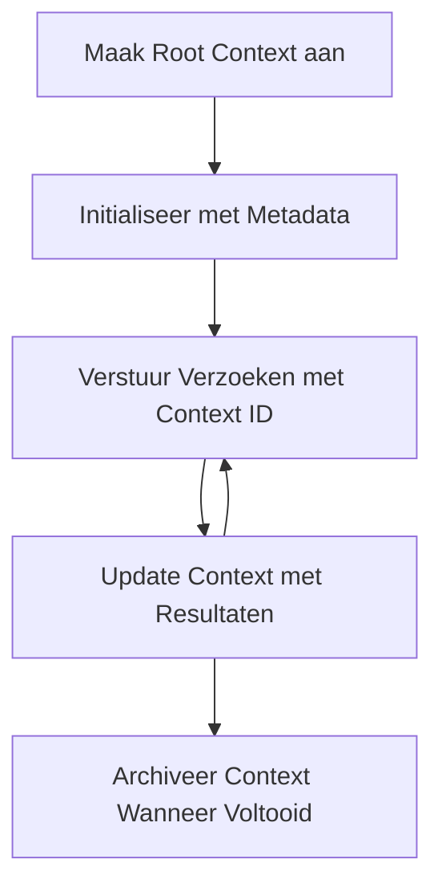

> [VEROUDERD: 2026-07-28 RELEASE KANDIDAAT](https://blog.modelcontextprotocol.io/posts/2026-07-28-release-candidate/#roots-sampling-and-logging-are-deprecated)

# MCP Root Contexten

> **Afschaffingsmelding:** de `2026-07-28` MCP specificatie release kandidaat markeert Roots als verouderd ten gunste van toolparameters, resource-URI's of serverconfiguratie. Roots blijven werken in `2025-11-25` en minstens een jaar na elke formele afschaffing, dus alles in deze les blijft geldig – maar nieuwe serverontwerpen moeten het vervangingspatroon evalueren. Zie [Wat verandert er in MCP: De 2026-07-28 Release Kandidaat](../../01-CoreConcepts/mcp-2026-07-28-release-candidate.md).

Root-contexten zijn een fundamenteel concept in het Model Context Protocol dat een persistente laag biedt voor het bijhouden van gespreksgeschiedenis en gedeelde status over meerdere verzoeken en sessies heen.

## Introductie

In deze les zullen we verkennen hoe root-contexten te maken, beheren en gebruiken in MCP.

## Leerdoelen

Aan het eind van deze les zul je in staat zijn om:

- Het doel en de structuur van root-contexten te begrijpen
- Root-contexten te maken en beheren met MCP-clientbibliotheken
- Root-contexten te implementeren in .NET, Java, JavaScript en Python toepassingen
- Root-contexten te gebruiken voor meertraps-gesprekken en statusbeheer
- Best practices voor root-contextbeheer toe te passen

## Root-contexten begrijpen

Root-contexten dienen als containers die de geschiedenis en status vasthouden voor een reeks gerelateerde interacties. Ze maken het mogelijk:

- **Gesprek persistentie**: coherente meertraps-gesprekken onderhouden
- **Geheugenbeheer**: informatie opslaan en ophalen over interacties heen
- **Statusbeheer**: voortgang volgen in complexe workflows
- **Contextdeling**: meerdere clients toegang geven tot dezelfde gespreksstatus

In MCP hebben root-contexten de volgende kernkenmerken:

- Elke root-context heeft een unieke identifier.
- Ze kunnen gespreksgeschiedenis, gebruikersvoorkeuren en andere metadata bevatten.
- Ze kunnen worden aangemaakt, benaderd en gearchiveerd indien nodig.
- Ze ondersteunen fijnmazige toegangscontrole en permissies.

## Levenscyclus van Root-contexten



## Werken met Root-contexten

Hier is een voorbeeld van hoe root-contexten te maken en beheren.

### C# Implementatie

```csharp
// .NET Example: Root Context Management
using Microsoft.Mcp.Client;
using System;
using System.Threading.Tasks;
using System.Collections.Generic;

public class RootContextExample
{
    private readonly IMcpClient _client;
    private readonly IRootContextManager _contextManager;
    
    public RootContextExample(IMcpClient client, IRootContextManager contextManager)
    {
        _client = client;
        _contextManager = contextManager;
    }
    
    public async Task DemonstrateRootContextAsync()
    {
        // 1. Create a new root context
        var contextResult = await _contextManager.CreateRootContextAsync(new RootContextCreateOptions
        {
            Name = "Customer Support Session",
            Metadata = new Dictionary<string, string>
            {
                ["CustomerName"] = "Acme Corporation",
                ["PriorityLevel"] = "High",
                ["Domain"] = "Cloud Services"
            }
        });
        
        string contextId = contextResult.ContextId;
        Console.WriteLine($"Created root context with ID: {contextId}");
        
        // 2. First interaction using the context
        var response1 = await _client.SendPromptAsync(
            "I'm having issues scaling my web service deployment in the cloud.", 
            new SendPromptOptions { RootContextId = contextId }
        );
        
        Console.WriteLine($"First response: {response1.GeneratedText}");
        
        // Second interaction - the model will have access to the previous conversation
        var response2 = await _client.SendPromptAsync(
            "Yes, we're using containerized deployments with Kubernetes.", 
            new SendPromptOptions { RootContextId = contextId }
        );
        
        Console.WriteLine($"Second response: {response2.GeneratedText}");
        
        // 3. Add metadata to the context based on conversation
        await _contextManager.UpdateContextMetadataAsync(contextId, new Dictionary<string, string>
        {
            ["TechnicalEnvironment"] = "Kubernetes",
            ["IssueType"] = "Scaling"
        });
        
        // 4. Get context information
        var contextInfo = await _contextManager.GetRootContextInfoAsync(contextId);
        
        Console.WriteLine("Context Information:");
        Console.WriteLine($"- Name: {contextInfo.Name}");
        Console.WriteLine($"- Created: {contextInfo.CreatedAt}");
        Console.WriteLine($"- Messages: {contextInfo.MessageCount}");
        
        // 5. When the conversation is complete, archive the context
        await _contextManager.ArchiveRootContextAsync(contextId);
        Console.WriteLine($"Archived context {contextId}");
    }
}
```

In de bovenstaande code hebben we:

1. Een root-context aangemaakt voor een klantenservice-sessie.
1. Meerdere berichten verstuurd binnen die context, waardoor het model de status kan behouden.
1. De context bijgewerkt met relevante metadata op basis van het gesprek.
1. Contextinformatie opgehaald om de gespreksgeschiedenis te begrijpen.
1. De context gearchiveerd nadat het gesprek was afgerond.

## Voorbeeld: Implementatie van Root-context voor financiële analyse

In dit voorbeeld maken we een root-context voor een financiële analysesessie, en demonstreren we hoe status over meerdere interacties wordt behouden.

### Java Implementatie

```java
// Java Voorbeeld: Root Context Implementatie
package com.example.mcp.contexts;

import com.mcp.client.McpClient;
import com.mcp.client.ContextManager;
import com.mcp.models.RootContext;
import com.mcp.models.McpResponse;

import java.util.HashMap;
import java.util.Map;
import java.util.UUID;

public class RootContextsDemo {
    private final McpClient client;
    private final ContextManager contextManager;
    
    public RootContextsDemo(String serverUrl) {
        this.client = new McpClient.Builder()
            .setServerUrl(serverUrl)
            .build();
            
        this.contextManager = new ContextManager(client);
    }
    
    public void demonstrateRootContext() throws Exception {
        // Contextmetadata maken
        Map<String, String> metadata = new HashMap<>();
        metadata.put("projectName", "Financial Analysis");
        metadata.put("userRole", "Financial Analyst");
        metadata.put("dataSource", "Q1 2025 Financial Reports");
        
        // 1. Maak een nieuwe root context aan
        RootContext context = contextManager.createRootContext("Financial Analysis Session", metadata);
        String contextId = context.getId();
        
        System.out.println("Created context: " + contextId);
        
        // 2. Eerste interactie
        McpResponse response1 = client.sendPrompt(
            "Analyze the trends in Q1 financial data for our technology division",
            contextId
        );
        
        System.out.println("First response: " + response1.getGeneratedText());
        
        // 3. Werk context bij met belangrijke informatie verkregen uit reactie
        contextManager.addContextMetadata(contextId, 
            Map.of("identifiedTrend", "Increasing cloud infrastructure costs"));
        
        // Tweede interactie - gebruikmakend van dezelfde context
        McpResponse response2 = client.sendPrompt(
            "What's driving the increase in cloud infrastructure costs?",
            contextId
        );
        
        System.out.println("Second response: " + response2.getGeneratedText());
        
        // 4. Genereer een samenvatting van de analysesessie
        McpResponse summaryResponse = client.sendPrompt(
            "Summarize our analysis of the technology division financials in 3-5 key points",
            contextId
        );
        
        // Sla de samenvatting op in contextmetadata
        contextManager.addContextMetadata(contextId, 
            Map.of("analysisSummary", summaryResponse.getGeneratedText()));
            
        // Verkrijg bijgewerkte contextinformatie
        RootContext updatedContext = contextManager.getRootContext(contextId);
        
        System.out.println("Context Information:");
        System.out.println("- Created: " + updatedContext.getCreatedAt());
        System.out.println("- Last Updated: " + updatedContext.getLastUpdatedAt());
        System.out.println("- Analysis Summary: " + 
            updatedContext.getMetadata().get("analysisSummary"));
            
        // 5. Archiveer context wanneer klaar
        contextManager.archiveContext(contextId);
        System.out.println("Context archived");
    }
}
```

In de bovenstaande code hebben we:

1. Een root-context aangemaakt voor een financiële analysesessie.
2. Meerdere berichten verstuurd binnen die context, waardoor het model status kan behouden.
3. De context bijgewerkt met relevante metadata op basis van het gesprek.
4. Een samenvatting van de analysesessie gegenereerd en opgeslagen in de contextmetadata.
5. De context gearchiveerd toen het gesprek was afgerond.

## Voorbeeld: Root-contextbeheer

Effectief beheren van root-contexten is cruciaal voor het behouden van gespreksgeschiedenis en status. Hieronder een voorbeeld van hoe root-contextbeheer te implementeren.

### JavaScript Implementatie

```javascript
// JavaScript Voorbeeld: Beheren van MCP Root Contexten
const { McpClient, RootContextManager } = require('@mcp/client');

class ContextSession {
  constructor(serverUrl, apiKey = null) {
    // Initialiseer de MCP-client
    this.client = new McpClient({
      serverUrl,
      apiKey
    });
    
    // Initialiseer contextbeheerder
    this.contextManager = new RootContextManager(this.client);
  }
  
  /**
   * Create a new conversation context
   * @param {string} sessionName - Name of the conversation session
   * @param {Object} metadata - Additional metadata for the context
   * @returns {Promise<string>} - Context ID
   */
  async createConversationContext(sessionName, metadata = {}) {
    try {
      const contextResult = await this.contextManager.createRootContext({
        name: sessionName,
        metadata: {
          ...metadata,
          createdAt: new Date().toISOString(),
          status: 'active'
        }
      });
      
      console.log(`Created root context '${sessionName}' with ID: ${contextResult.id}`);
      return contextResult.id;
    } catch (error) {
      console.error('Error creating root context:', error);
      throw error;
    }
  }
  
  /**
   * Send a message in an existing context
   * @param {string} contextId - The root context ID
   * @param {string} message - The user's message
   * @param {Object} options - Additional options
   * @returns {Promise<Object>} - Response data
   */
  async sendMessage(contextId, message, options = {}) {
    try {
      // Verstuur het bericht met de opgegeven context
      const response = await this.client.sendPrompt(message, {
        rootContextId: contextId,
        temperature: options.temperature || 0.7,
        allowedTools: options.allowedTools || []
      });
      
      // Optioneel belangrijke inzichten uit het gesprek opslaan
      if (options.storeInsights) {
        await this.storeConversationInsights(contextId, message, response.generatedText);
      }
      
      return {
        message: response.generatedText,
        toolCalls: response.toolCalls || [],
        contextId
      };
    } catch (error) {
      console.error(`Error sending message in context ${contextId}:`, error);
      throw error;
    }
  }
  
  /**
   * Store important insights from a conversation
   * @param {string} contextId - The root context ID
   * @param {string} userMessage - User's message
   * @param {string} aiResponse - AI's response
   */
  async storeConversationInsights(contextId, userMessage, aiResponse) {
    try {
      // Haal potentiële inzichten eruit (in een echte app zou dit geavanceerder zijn)
      const combinedText = userMessage + "\n" + aiResponse;
      
      // Simpele heuristiek om potentiële inzichten te identificeren
      const insightWords = ["important", "key point", "remember", "significant", "crucial"];
      
      const potentialInsights = combinedText
        .split(".")
        .filter(sentence => 
          insightWords.some(word => sentence.toLowerCase().includes(word))
        )
        .map(sentence => sentence.trim())
        .filter(sentence => sentence.length > 10);
      
      // Sla inzichten op in contextmetadata
      if (potentialInsights.length > 0) {
        const insights = {};
        potentialInsights.forEach((insight, index) => {
          insights[`insight_${Date.now()}_${index}`] = insight;
        });
        
        await this.contextManager.updateContextMetadata(contextId, insights);
        console.log(`Stored ${potentialInsights.length} insights in context ${contextId}`);
      }
    } catch (error) {
      console.warn('Error storing conversation insights:', error);
      // Niet-kritieke fout, dus alleen waarschuwing loggen
    }
  }
  
  /**
   * Get summary information about a context
   * @param {string} contextId - The root context ID
   * @returns {Promise<Object>} - Context information
   */
  async getContextInfo(contextId) {
    try {
      const contextInfo = await this.contextManager.getContextInfo(contextId);
      
      return {
        id: contextInfo.id,
        name: contextInfo.name,
        created: new Date(contextInfo.createdAt).toLocaleString(),
        lastUpdated: new Date(contextInfo.lastUpdatedAt).toLocaleString(),
        messageCount: contextInfo.messageCount,
        metadata: contextInfo.metadata,
        status: contextInfo.status
      };
    } catch (error) {
      console.error(`Error getting context info for ${contextId}:`, error);
      throw error;
    }
  }
  
  /**
   * Generate a summary of the conversation in a context
   * @param {string} contextId - The root context ID
   * @returns {Promise<string>} - Generated summary
   */
  async generateContextSummary(contextId) {
    try {
      // Vraag het model om een samenvatting van het gesprek tot nu toe te genereren
      const response = await this.client.sendPrompt(
        "Please summarize our conversation so far in 3-4 sentences, highlighting the main points discussed.",
        { rootContextId: contextId, temperature: 0.3 }
      );
      
      // Sla de samenvatting op in contextmetadata
      await this.contextManager.updateContextMetadata(contextId, {
        conversationSummary: response.generatedText,
        summarizedAt: new Date().toISOString()
      });
      
      return response.generatedText;
    } catch (error) {
      console.error(`Error generating context summary for ${contextId}:`, error);
      throw error;
    }
  }
  
  /**
   * Archive a context when it's no longer needed
   * @param {string} contextId - The root context ID
   * @returns {Promise<Object>} - Result of the archive operation
   */
  async archiveContext(contextId) {
    try {
      // Genereer een definitieve samenvatting voordat je archiveert
      const summary = await this.generateContextSummary(contextId);
      
      // Archiveer de context
      await this.contextManager.archiveContext(contextId);
      
      return {
        status: "archived",
        contextId,
        summary
      };
    } catch (error) {
      console.error(`Error archiving context ${contextId}:`, error);
      throw error;
    }
  }
}

// Voorbeeld gebruik
async function demonstrateContextSession() {
  const session = new ContextSession('https://mcp-server-example.com');
  
  try {
    // 1. Maak een nieuwe context aan voor een productondersteuningsgesprek
    const contextId = await session.createConversationContext(
      'Product Support - Database Performance',
      {
        customer: 'Globex Corporation',
        product: 'Enterprise Database',
        severity: 'Medium',
        supportAgent: 'AI Assistant'
      }
    );
    
    // 2. Eerste bericht in het gesprek
    const response1 = await session.sendMessage(
      contextId,
      "I'm experiencing slow query performance on our database cluster after the latest update.",
      { storeInsights: true }
    );
    console.log('Response 1:', response1.message);
    
    // Vervolgbericht in dezelfde context
    const response2 = await session.sendMessage(
      contextId,
      "Yes, we've already checked the indexes and they seem to be properly configured.",
      { storeInsights: true }
    );
    console.log('Response 2:', response2.message);
    
    // 3. Verkrijg informatie over de context
    const contextInfo = await session.getContextInfo(contextId);
    console.log('Context Information:', contextInfo);
    
    // 4. Genereer en toon samenvatting van het gesprek
    const summary = await session.generateContextSummary(contextId);
    console.log('Conversation Summary:', summary);
    
    // 5. Archiveer de context wanneer klaar
    const archiveResult = await session.archiveContext(contextId);
    console.log('Archive Result:', archiveResult);
    
    // 6. Handel eventuele fouten netjes af
  } catch (error) {
    console.error('Error in context session demonstration:', error);
  }
}

demonstrateContextSession();
```

In de bovenstaande code hebben we:

1. Een root-context aangemaakt voor een productondersteuningsgesprek met de functie `createConversationContext`. In dit geval gaat de context over prestatieproblemen van een database.

1. Meerdere berichten verstuurd binnen die context, waardoor het model status kan behouden met de functie `sendMessage`. De berichten gaan over trage queryprestaties en indexconfiguratie.

1. De context bijgewerkt met relevante metadata op basis van het gesprek.

1. Een samenvatting van het gesprek gegenereerd en opgeslagen in de contextmetadata met de functie `generateContextSummary`.

1. De context gearchiveerd toen het gesprek was afgerond met de functie `archiveContext`.

1. Fouten soepel afgehandeld om robuustheid te waarborgen.

## Root-context voor Meertraps Assistentie

In dit voorbeeld maken we een root-context voor een meertraps assistentiesessie, en tonen we hoe staat over meerdere interacties behouden blijft.

### Python Implementatie

```python
# Python Voorbeeld: Root Context voor Multi-Turn Assistentie
import asyncio
from datetime import datetime
from mcp_client import McpClient, RootContextManager

class AssistantSession:
    def __init__(self, server_url, api_key=None):
        self.client = McpClient(server_url=server_url, api_key=api_key)
        self.context_manager = RootContextManager(self.client)
    
    async def create_session(self, name, user_info=None):
        """Create a new root context for an assistant session"""
        metadata = {
            "session_type": "assistant",
            "created_at": datetime.now().isoformat(),
        }
        
        # Voeg gebruikersinformatie toe indien opgegeven
        if user_info:
            metadata.update({f"user_{k}": v for k, v in user_info.items()})
            
        # Maak de root context aan
        context = await self.context_manager.create_root_context(name, metadata)
        return context.id
    
    async def send_message(self, context_id, message, tools=None):
        """Send a message within a root context"""
        # Maak opties met context-ID
        options = {
            "root_context_id": context_id
        }
        
        # Voeg tools toe indien gespecificeerd
        if tools:
            options["allowed_tools"] = tools
        
        # Verstuur de prompt binnen de context
        response = await self.client.send_prompt(message, options)
        
        # Werk contextmetadata bij met gespreksvoortgang
        await self.context_manager.update_context_metadata(
            context_id,
            {
                f"message_{datetime.now().timestamp()}": message[:50] + "...",
                "last_interaction": datetime.now().isoformat()
            }
        )
        
        return response
    
    async def get_conversation_history(self, context_id):
        """Retrieve conversation history from a context"""
        context_info = await self.context_manager.get_context_info(context_id)
        messages = await self.client.get_context_messages(context_id)
        
        return {
            "context_info": context_info,
            "messages": messages
        }
    
    async def end_session(self, context_id):
        """End an assistant session by archiving the context"""
        # Genereer eerst een samenvattende prompt
        summary_response = await self.client.send_prompt(
            "Please summarize our conversation and any key points or decisions made.",
            {"root_context_id": context_id}
        )
        
        # Sla samenvatting op in metadata
        await self.context_manager.update_context_metadata(
            context_id,
            {
                "summary": summary_response.generated_text,
                "ended_at": datetime.now().isoformat(),
                "status": "completed"
            }
        )
        
        # Archiveer de context
        await self.context_manager.archive_context(context_id)
        
        return {
            "status": "completed",
            "summary": summary_response.generated_text
        }

# Voorbeeld gebruik
async def demo_assistant_session():
    assistant = AssistantSession("https://mcp-server-example.com")
    
    # 1. Maak sessie aan
    context_id = await assistant.create_session(
        "Technical Support Session",
        {"name": "Alex", "technical_level": "advanced", "product": "Cloud Services"}
    )
    print(f"Created session with context ID: {context_id}")
    
    # 2. Eerste interactie
    response1 = await assistant.send_message(
        context_id, 
        "I'm having trouble with the auto-scaling feature in your cloud platform.",
        ["documentation_search", "diagnostic_tool"]
    )
    print(f"Response 1: {response1.generated_text}")
    
    # Tweede interactie in dezelfde context
    response2 = await assistant.send_message(
        context_id,
        "Yes, I've already checked the configuration settings you mentioned, but it's still not working."
    )
    print(f"Response 2: {response2.generated_text}")
    
    # 3. Haal geschiedenis op
    history = await assistant.get_conversation_history(context_id)
    print(f"Session has {len(history['messages'])} messages")
    
    # 4. Beëindig sessie
    end_result = await assistant.end_session(context_id)
    print(f"Session ended with summary: {end_result['summary']}")

if __name__ == "__main__":
    asyncio.run(demo_assistant_session())
```

In de bovenstaande code hebben we:

1. Een root-context aangemaakt voor een technische supportsessie met de functie `create_session`. De context bevat gebruikersinformatie zoals naam en technisch niveau.

1. Meerdere berichten verstuurd binnen die context, waardoor het model status kan behouden met de functie `send_message`. De berichten gaan over problemen met de autoscale-functie.

1. Gespreksgeschiedenis opgehaald met de functie `get_conversation_history`, die contextinformatie en berichten levert.

1. De sessie beëindigd door de context te archiveren en een samenvatting te genereren met de functie `end_session`. De samenvatting legt de belangrijkste punten van het gesprek vast.

## Best practices Root-context

Hier volgen enkele best practices voor het effectief beheren van root-contexten:

- **Maak Gerichte Contexten**: Maak aparte root-contexten voor verschillende gespreksdoelen of domeinen voor duidelijkheid.

- **Stel Verloopregels in**: Implementeer regels om oude contexten te archiveren of verwijderen voor opslagbeheer en naleving van gegevensbewaarbeleid.

- **Sla Relevante Metadata op**: Gebruik contextmetadata om belangrijke informatie over het gesprek op te slaan die later nuttig kan zijn.

- **Gebruik Context-ID's Consistent**: Gebruik na het aanmaken van een context consistent de ID voor alle gerelateerde verzoeken om continuïteit te waarborgen.

- **Genereer Samenvattingen**: Overweeg het genereren van samenvattingen zodra een context groot wordt om essentiële informatie vast te leggen en contextgrootte te beheren.

- **Implementeer Toegangscontrole**: Voor multi-gebruikerssystemen implementeer juiste toegangsniveaus om privacy en beveiliging van gesprekscontexten te garanderen.

- **Ga om met Contextbeperkingen**: Wees bewust van contextgroottebeperkingen en implementeer strategieën voor het omgaan met zeer lange gesprekken.

- **Archiveer bij Afronding**: Archiveer contexten als gesprekken voltooid zijn om resources vrij te maken en toch gespreksgeschiedenis te behouden.

## Wat nu

- [5.5 Routing](../mcp-routing/README.md)

---

<!-- CO-OP TRANSLATOR DISCLAIMER START -->
**Disclaimer**:
Dit document is vertaald met behulp van de AI vertaaldienst [Co-op Translator](https://github.com/Azure/co-op-translator). Hoewel we streven naar nauwkeurigheid, dient u er rekening mee te houden dat geautomatiseerde vertalingen fouten of onnauwkeurigheden kunnen bevatten. Het originele document in de oorspronkelijke taal moet worden beschouwd als de gezaghebbende bron. Voor kritieke informatie wordt professionele menselijke vertaling aanbevolen. Wij zijn niet aansprakelijk voor eventuele misverstanden of verkeerde interpretaties die voortvloeien uit het gebruik van deze vertaling.
<!-- CO-OP TRANSLATOR DISCLAIMER END -->