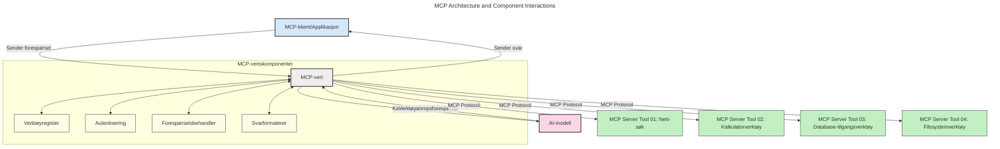
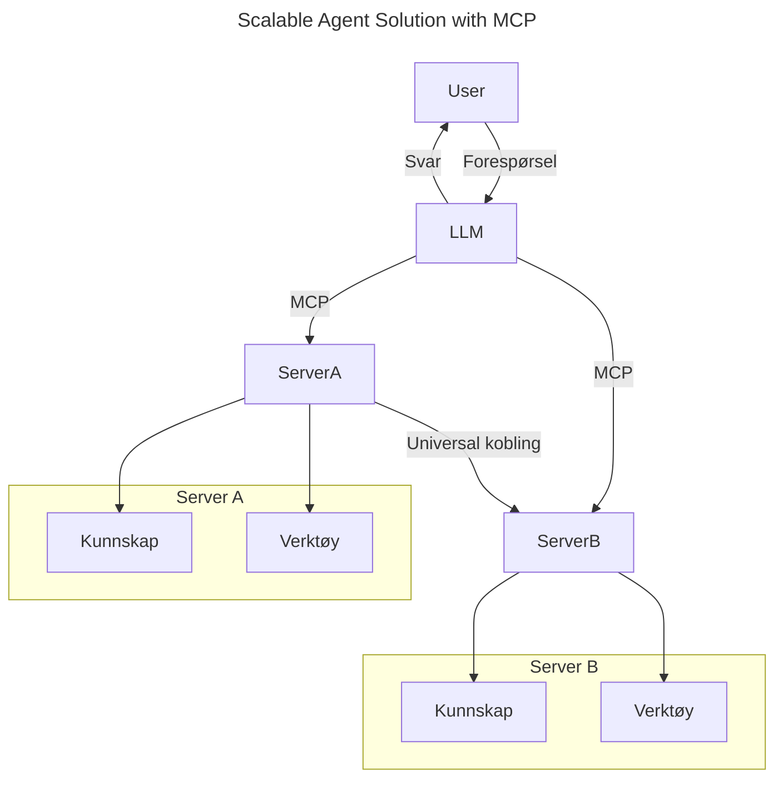
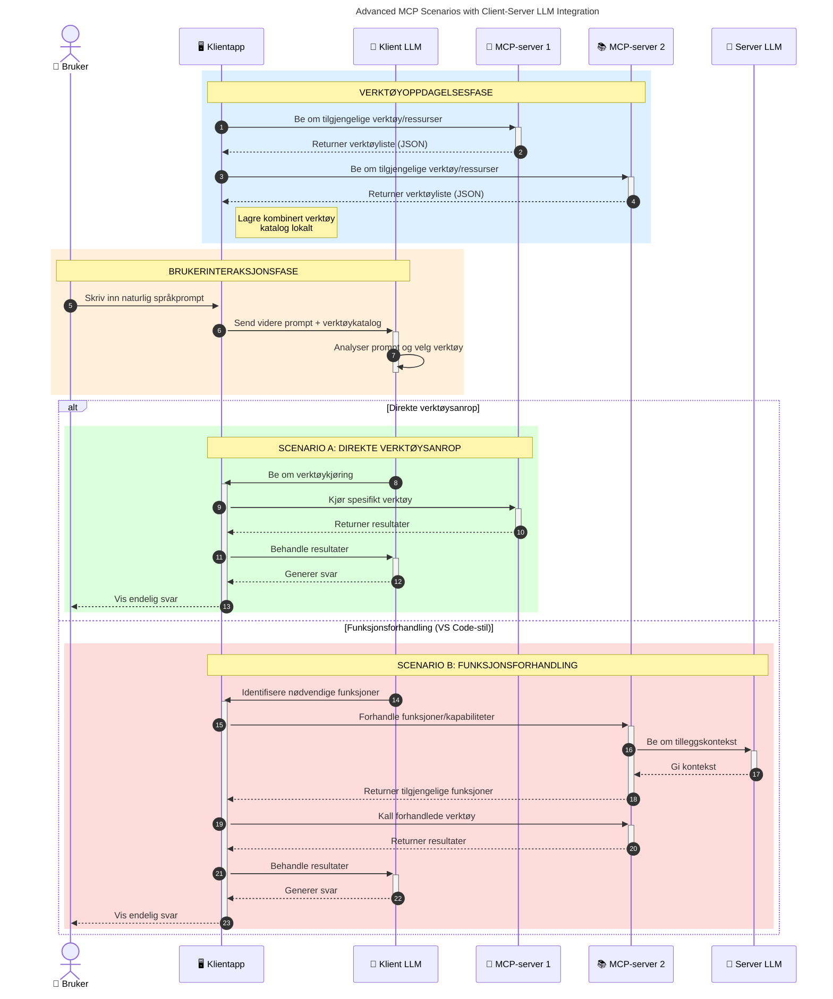

# Introduksjon til Model Context Protocol (MCP): Hvorfor det er viktig for skalerbare AI-applikasjoner

_(Klikk på bildet over for å se video av denne leksjonen)_

Generative AI-applikasjoner er et stort steg fremover, siden de ofte lar brukeren samhandle med appen ved hjelp av naturlige språkforespørsler. Men etter hvert som mer tid og ressurser investeres i slike apper, vil du forsikre deg om at du enkelt kan integrere funksjonaliteter og ressurser på en måte som gjør det lett å utvide, at appen din kan håndtere mer enn én modell, og håndtere ulike modellspesifikke detaljer. Kort fortalt er det lett å komme i gang med å bygge Gen AI-apper, men når de vokser og blir mer komplekse, må du begynne å definere en arkitektur og vil sannsynligvis trenge å støtte deg på en standard for å sikre at appene dine bygges på en konsistent måte. Dette er der MCP kommer inn for å organisere ting og tilby en standard.

---

## **🔍 Hva er Model Context Protocol (MCP)?**

**Model Context Protocol (MCP)** er et **åpent, standardisert grensesnitt** som gjør det mulig for store språkmodeller (LLMs) å samhandle sømløst med eksterne verktøy, API-er og datakilder. Det tilbyr en konsekvent arkitektur som forbedrer AI-modellfunksjonalitet utover treningsdataene, og muliggjør smartere, skalerbare og mer responsive AI-systemer.

---

## **🎯 Hvorfor standardisering innen AI er viktig**

Etter hvert som generative AI-applikasjoner blir mer komplekse, er det avgjørende å ta i bruk standarder som sikrer **skalerbarhet, utvidbarhet, vedlikeholdbarhet** og **unngå leverandørbinding**. MCP adresserer disse behovene ved å:

- Forene modell-verktøy-integrasjoner
- Redusere skjøre, spesialløsninger
- La flere modeller fra forskjellige leverandører eksistere innen ett økosystem

**Merk:** Selv om MCP beskriver seg som en åpen standard, er det ingen planer om å standardisere MCP gjennom eksisterende standardiseringsorganer som IEEE, IETF, W3C, ISO eller noen annen standardiseringsorganisasjon.

---

## **📚 Læringsmål**

Når du er ferdig med denne artikkelen, vil du kunne:

- Definere **Model Context Protocol (MCP)** og dets bruksområder
- Forstå hvordan MCP standardiserer kommunikasjon fra modell til verktøy
- Identifisere kjernekomponentene i MCP-arkitekturen
- Utforske virkelige applikasjoner av MCP i virksomheter og utviklingskontekster

---

## **💡 Hvorfor Model Context Protocol (MCP) er en banebryter**

### **🔗 MCP løser fragmentering i AI-interaksjoner**

Før MCP krevde integrering av modeller med verktøy:

- Egne tilpassede koder per verktøy-modell-par
- Ikke-standardiserte API-er for hver leverandør
- Hyppige brudd ved oppdateringer
- Dårlig skalerbarhet med flere verktøy

### **✅ Fordeler med MCP-standardisering**

| **Fordel**                | **Beskrivelse**                                                               |
|--------------------------|-------------------------------------------------------------------------------|
| Interoperabilitet         | LLM-er fungerer sømløst med verktøy fra forskjellige leverandører             |
| Konsistens               | Uniform oppførsel på tvers av plattformer og verktøy                           |
| Gjenbrukbarhet            | Verktøy bygget én gang kan brukes på tvers av prosjekter og systemer           |
| Raskere utvikling         | Reduserer utviklingstid ved å bruke standardiserte, plug-and-play grensesnitt  |

---

## **🧱 Høy-nivå overblikk over MCP-arkitektur**

MCP følger en **klient-tjener-modell**, hvor:

- **MCP-verter** kjører AI-modellene
- **MCP-klienter** initierer forespørsler
- **MCP-tjenere** serverer kontekst, verktøy og kapasiteter

### **Hovedkomponenter:**

- **Ressurser** – Statisk eller dynamisk data for modeller  
- **Forespørsler** – Forhåndsdefinerte arbeidsflyter for veiledet generering  
- **Verktøy** – Utførbare funksjoner som søk, beregninger  
- **Sampling** – Agentisk oppførsel via rekursive interaksjoner (utfaset i `2026-07-28` releasekandidat)
- **Elicitering** – Tjener-initiated forespørsler om brukerinput
- **Roots** – Filssystemgrenser for tjenertilgangskontroll (utfaset i `2026-07-28` releasekandidat)

### **Protokollarkitektur:**

MCP benytter en to-lags-arkitektur:
- **Data-lag**: JSON-RPC 2.0-basert kommunikasjon med livssyklusstyring og primitivfunksjoner
- **Transportlag**: STDIO (lokal) og strømmbart HTTP med SSE (fjernkommunikasjon)

---

## Hvordan MCP-tjenere fungerer

MCP-tjenere opererer på følgende måte:

- **Forespørselsflyt**:
    1. En forespørsel initieres av en sluttbruker eller programvare på deres vegne.
    2. **MCP-klienten** sender forespørselen til en **MCP-vert**, som håndterer AI-modellens runtime.
    3. **AI-modellen** mottar brukerforespørselen og kan be om tilgang til eksterne verktøy eller data via ett eller flere verktøysamtaler.
    4. **MCP-verten**, ikke modellen direkte, kommuniserer med passende **MCP-tjenere** ved hjelp av den standardiserte protokollen.
- **MCP-vertsfunksjonalitet**:
    - **Verktøyregister**: Opprettholder en katalog over tilgjengelige verktøy og deres kapasiteter.
    - **Autentisering**: Verifiserer tillatelser for verktøytillatelse.
    - **Forespørselsbehandler**: Behandler innkommende verktøyforespørsler fra modellen.
    - **Responsformaterer**: Strukturert verktøyutdata i et format som modellen kan forstå.
- **MCP-tjenerutførelse**:
    - **MCP-verten** videresender verktøysamtaler til en eller flere **MCP-tjenere**, som hver eksponerer spesialiserte funksjoner (f.eks. søk, beregninger, databasespørringer).
    - **MCP-tjenerne** utfører sine respektive operasjoner og returnerer resultater til **MCP-verten** i et konsistent format.
    - **MCP-verten** formaterer og videresender disse resultatene til **AI-modellen**.
- **Fullføring av respons**:
    - **AI-modellen** inkluderer verktøyoutput i et endelig svar.
    - **MCP-verten** sender dette svaret tilbake til **MCP-klienten**, som leverer det til sluttbrukeren eller kallende programvare.
    

## 👨‍💻 Hvordan bygge en MCP-tjener (Med eksempler)

MCP-tjenere lar deg utvide LLMs muligheter ved å tilby data og funksjonalitet.

Klar til å prøve? Her er språk- og/eller stack-spesifikke SDK-er med eksempler på å lage enkle MCP-tjenere i ulike språk/stacks:

- **Python SDK**: https://github.com/modelcontextprotocol/python-sdk

- **TypeScript SDK**: https://github.com/modelcontextprotocol/typescript-sdk

- **Java SDK**: https://github.com/modelcontextprotocol/java-sdk

- **C#/.NET SDK**: https://github.com/modelcontextprotocol/csharp-sdk

## 🌍 Virkelige bruksområder for MCP

MCP muliggjør et bredt spekter av applikasjoner ved å utvide AI-muligheter:

| **Applikasjon**               | **Beskrivelse**                                                                |
|------------------------------|--------------------------------------------------------------------------------|
| Enterprise data-integrasjon  | Koble LLM-er til databaser, CRM-er eller interne verktøy                        |
| Agent-baserte AI-systemer    | Aktivere autonome agenter med verktøytillatelse og beslutningsarbeidsflyter     |
| Multi-modale applikasjoner   | Kombinere tekst-, bilde- og lydverktøy i en enkelt samlet AI-app                |
| Sanntidsdata-integrasjon    | Ta live data inn i AI-interaksjoner for mer nøyaktige og aktuelle resultater    |

### 🧠 MCP = Universell standard for AI-interaksjoner

Model Context Protocol (MCP) fungerer som en universell standard for AI-interaksjoner, akkurat som USB-C standardiserte fysiske forbindelser for enheter. I AI-verdenen gir MCP et ensartet grensesnitt, som gjør at modeller (klienter) kan integreres sømløst med eksterne verktøy og dataleverandører (tjenere). Dette eliminerer behovet for diverse, tilpassede protokoller for hver API eller datakilde.

Under MCP følger et MCP-kompatibelt verktøy (referert til som en MCP-tjener) en enhetlig standard. Disse tjenerne kan liste opp verktøyene eller handlingene de tilbyr og utføre disse når en AI-agent ber om det. AI-agent-plattformer som støtter MCP kan oppdage tilgjengelige verktøy fra tjenerne og kalle dem gjennom denne standardprotokollen.

### 💡 Legger til rette for tilgang til kunnskap

Utover å tilby verktøy, legger MCP også til rette for tilgang til kunnskap. Det gjør det mulig for applikasjoner å gi kontekst til store språkmodeller (LLMs) ved å koble dem til ulike datakilder. For eksempel kan en MCP-tjener representere et selskaps dokumentarkiv, noe som gjør det mulig for agenter å hente relevant informasjon ved behov. En annen tjener kan håndtere spesifikke handlinger som å sende e-post eller oppdatere poster. Fra agentens perspektiv er dette ganske enkelt verktøy den kan bruke—noen verktøy returnerer data (kunnskapskontekst), mens andre utfører handlinger. MCP håndterer begge effektivt.

En agent som kobler seg til en MCP-tjener lærer automatisk tjenerens tilgjengelige kapabiliteter og tilgjengelige data gjennom et standardformat. Denne standardiseringen muliggjør dynamisk tilgjengelighet av verktøy. For eksempel gjør det å legge til en ny MCP-tjener til agentens system funksjonene umiddelbart tilgjengelige uten behov for videre tilpasning av agentens instruksjoner.

Denne strømlinjeformede integrasjonen stemmer overens med flyten vist i følgende diagram, hvor tjenerne tilbyr både verktøy og kunnskap, og sikrer sømløst samarbeid på tvers av systemer.

### 👉 Eksempel: Skalerbar agentløsning

Den universelle kobleren gjør det mulig for MCP-tjenere å kommunisere og dele kapasiteter med hverandre, slik at ServerA kan delegere oppgaver til ServerB eller få tilgang til dens verktøy og kunnskap. Dette fødererer verktøy og data på tvers av tjenere, og støtter skalerbare og modulære agentarkitekturer. Fordi MCP standardiserer eksponeringen av verktøy, kan agenter dynamisk oppdage og rute forespørsler mellom tjenere uten kodespesifikke integrasjoner.

Verktøy- og kunnskapsføderasjon: Verktøy og data kan aksesseres på tvers av tjenere, noe som muliggjør mer skalerbare og modulære agentiske arkitekturer.

### 🔄 Avanserte MCP-scenarier med klient-side LLM-integrasjon

Utover den grunnleggende MCP-arkitekturen finnes det avanserte scenarier der både klient og tjener inneholder LLMs, som muliggjør mer sofistikerte interaksjoner. I følgende diagram kan **Client App** være et IDE med en rekke MCP-verktøy tilgjengelig for LLM å bruke:

## 🔐 Praktiske fordeler med MCP

Her er de praktiske fordelene med å bruke MCP:

- **Oppdatert informasjon**: Modeller kan få tilgang til oppdatert informasjon utover treningsdataene sine
- **Utvidet kapasitet**: Modeller kan bruke spesialiserte verktøy for oppgaver de ikke ble trent for
- **Reduserte hallusinasjoner**: Eksterne datakilder gir faktabasert grunnlag
- **Personvern**: Sensitiv data kan forbli i sikre miljøer i stedet for å være innebygd i forespørsler

## 📌 Viktige punkter

Følgende er viktige punkter for bruk av MCP:

- **MCP** standardiserer hvordan AI-modeller samhandler med verktøy og data
- Fremmer **utvidbarhet, konsistens og interoperabilitet**
- MCP hjelper til med å **redusere utviklingstid, forbedre pålitelighet og utvide modellkapasiteter**
- Klient-tjener-arkitektur **muliggjør fleksible, utvidbare AI-applikasjoner**

## 🧠 Oppgave

Tenk på en AI-applikasjon du er interessert i å bygge.

- Hvilke **eksterne verktøy eller data** kunne forbedre dens kapabiliteter?
- Hvordan kan MCP gjøre integrasjonen **enklere og mer pålitelig?**

## Ytterligere ressurser

- [MCP GitHub Repository](https://github.com/modelcontextprotocol)

## Hva nå

Neste: [Kapittel 1: Kjernebegreper](../01-CoreConcepts/README.md)

---

<!-- CO-OP TRANSLATOR DISCLAIMER START -->
**Ansvarsfraskrivelse**:
Dette dokumentet er oversatt ved hjelp av AI-oversettelsestjenesten [Co-op Translator](https://github.com/Azure/co-op-translator). Selv om vi streber etter nøyaktighet, vær oppmerksom på at automatiske oversettelser kan inneholde feil eller unøyaktigheter. Det opprinnelige dokumentet på originalspråket skal betraktes som den autoritative kilden. For kritisk informasjon anbefales profesjonell menneskelig oversettelse. Vi er ikke ansvarlige for eventuelle misforståelser eller feiltolkninger som oppstår ved bruk av denne oversettelsen.
<!-- CO-OP TRANSLATOR DISCLAIMER END -->