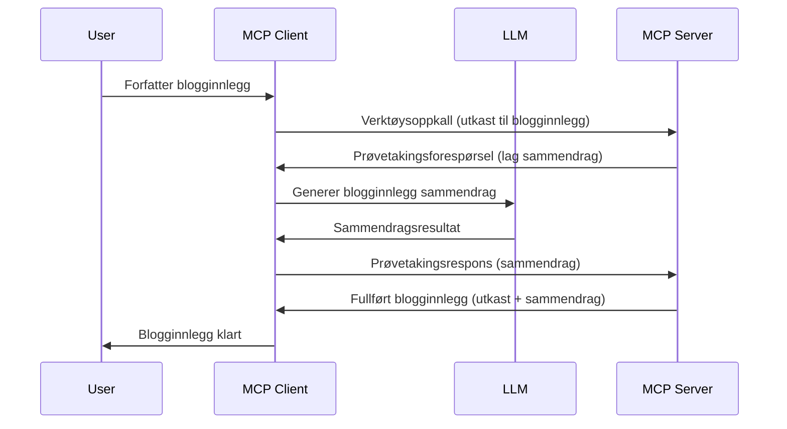

> [UTFASSET: 2026-07-28 RELEASE CANDIDATE](https://blog.modelcontextprotocol.io/posts/2026-07-28-release-candidate/)

# Sampling - delegere funksjoner til klienten

> **Avviklingsvarsel:** MCP-spesifikasjonsutgivelseskandidaten `2026-07-28` markerer Sampling som avviklet til fordel for direkte integrasjon med API-er fra LLM-leverandører. Sampling fungerer fortsatt i `2025-11-25` og i minst ett år etter en formell avvikling, så alt i denne leksjonen er gyldig — men nye serverdesign bør vurdere erstatningsmønsteret. Se [Hva endres i MCP: Utgivelseskandidaten 2026-07-28](../../01-CoreConcepts/mcp-2026-07-28-release-candidate.md).

Noen ganger trenger du at MCP-klienten og MCP-serveren samarbeider for å oppnå et felles mål. Du kan ha en situasjon der serveren trenger hjelp fra en LLM som kjører på klienten. For dette tilfelle er sampling det du bør bruke.

La oss utforske noen brukstilfeller og hvordan bygge en løsning som involverer sampling.

## Oversikt

I denne leksjonen fokuserer vi på å forklare når og hvor Sampling skal brukes, og hvordan konfigurere det.

## Læringsmål

I dette kapitlet skal vi:

- Forklare hva Sampling er og når du skal bruke det.
- Vise hvordan du konfigurerer Sampling i MCP.
- Gi eksempler på Sampling i praksis.

## Hva er Sampling og hvorfor bruke det?

Sampling er en avansert funksjon som fungerer på følgende måte:



### Sampling-forespørsel

Ok, nå har vi et overblikk over en troverdig situasjon, la oss snakke om sampling-forespørselen som serveren sender tilbake til klienten. Slik kan en slik forespørsel se ut i JSON-RPC-format:

```json
{
  "jsonrpc": "2.0",
  "id": 1,
  "method": "sampling/createMessage",
  "params": {
    "messages": [
      {
        "role": "user",
        "content": {
          "type": "text",
          "text": "Create a blog post summary of the following blog post: <BLOG POST>"
        }
      }
    ],
    "modelPreferences": {
      "hints": [
        {
          "name": "claude-3-sonnet"
        }
      ],
      "intelligencePriority": 0.8,
      "speedPriority": 0.5
    },
    "systemPrompt": "You are a helpful assistant.",
    "maxTokens": 100
  }
}
```

Det er noen ting her verdt å merke seg:

- Prompt, under content -> text, er vår prompt som er en instruksjon til LLM-en om å oppsummere innholdet i et blogginnlegg.

- **modelPreferences**. Dette avsnittet er akkurat som det høres ut, en preferanse, en anbefaling om hvilken konfigurasjon som skal brukes med LLM-en. Brukeren kan velge å følge disse anbefalingene eller endre dem. I dette tilfellet er det anbefalinger om modell å bruke, hastighet og prioritet for intelligens.
- **systemPrompt**, dette er din normale system-prompt som gir LLM-en en personlighet og inneholder veiledende instruksjoner.
- **maxTokens**, dette er en annen egenskap som angir hvor mange tokens som anbefales brukt for denne oppgaven.

### Sampling-svar

Dette svaret er det MCP-klienten ender opp med å sende tilbake til MCP-serveren, og er resultatet av at klienten kaller LLM-en, venter på svaret og deretter bygger denne meldingen. Slik kan det se ut i JSON-RPC:

```json
{
  "jsonrpc": "2.0",
  "id": 1,
  "result": {
    "role": "assistant",
    "content": {
      "type": "text",
      "text": "Here's your abstract <ABSTRACT>"
    },
    "model": "gpt-5",
    "stopReason": "endTurn"
  }
}
```

Legg merke til hvordan svaret er et sammendrag av blogginnlegget akkurat som vi ba om. Legg også merke til hvordan den brukte `model` ikke er den vi ba om, men "gpt-5" foran "claude-3-sonnet". Dette illustrerer at brukeren kan ombestemme seg om hvilken modell som skal brukes, og at sampling-forespørselen din kun er en anbefaling.

Ok, nå som vi forstår hovedflyten, og nyttige oppgaver å bruke det til "blogginnlegg-opprettelse + sammendrag", la oss se hva vi må gjøre for å få det til å fungere.

### Meldings-typer

Sampling-meldinger er ikke begrenset til bare tekst, men du kan også sende bilder og lyd. Slik ser JSON-RPC ut forskjellig:

**Tekst**

```json
{
  "type": "text",
  "text": "The message content"
}
```

**Bildeinnhold**

```json
{
  "type": "image",
  "data": "base64-encoded-image-data",
  "mimeType": "image/jpeg"
}
```

**Lydinnhold**

```json
{
  "type": "audio",
  "data": "base64-encoded-audio-data",
  "mimeType": "audio/wav"
}
```

> MERK: for mer detaljert info om Sampling, sjekk ut [offisiell dokumentasjon](https://modelcontextprotocol.io/specification/2025-11-25/client/sampling)

## Hvordan konfigurere Sampling i klienten

> Merk: hvis du bare bygger en server, trenger du ikke gjøre mye her.

I en klient må du spesifisere følgende funksjon slik:

```json
{
  "capabilities": {
    "sampling": {}
  }
}
```

Dette vil da bli plukket opp når den valgte klienten initialiseres med serveren.

## Eksempel på Sampling i praksis - Opprett et blogginnlegg

La oss kode en sampling-server sammen, vi må gjøre følgende:

1. Opprett et verktøy på serveren.
1. Dette verktøyet skal lage en sampling-forespørsel.
1. Verktøyet skal vente på at klientens sampling-forespørsel besvares.
1. Deretter skal verktøy-resultatet produseres.

La oss se på koden steg for steg:

### -1- Opprett verktøyet

**python**

```python
@mcp.tool()
async def create_blog(title: str, content: str, ctx: Context[ServerSession, None]) -> str:
    """Create a blog post and generate a summary"""

```

### -2- Opprett en sampling-forespørsel

Utvid verktøyet ditt med følgende kode:

**python**

```python
post = BlogPost(
        id=len(posts) + 1,
        title=title,
        content=content,
        abstract=""
    )

prompt = f"Create an abstract of the following blog post: title: {title} and draft: {content} "

result = await ctx.session.create_message(
        messages=[
            SamplingMessage(
                role="user",
                content=TextContent(type="text", text=prompt),
            )
        ],
        max_tokens=100,
)

```

### -3- Vent på svaret og returner svaret

**python**

```python
post.abstract = result.content.text

posts.append(post)

# returner hele produktet
return json.dumps({
    "id": post.title,
    "abstract": post.abstract
})
```

### -4- Full kode

**python**

```python
from starlette.applications import Starlette
from starlette.routing import Mount, Host

from mcp.server.fastmcp import Context, FastMCP

from mcp.server.session import ServerSession
from mcp.types import SamplingMessage, TextContent

import json


from uuid import uuid4
from typing import List
from pydantic import BaseModel


mcp = FastMCP("Blog post generator")

# app = FastAPI()

posts = []

class BlogPost(BaseModel):
    id: int
    title: str
    content: str
    abstract: str

posts: List[BlogPost] = []

@mcp.tool()
async def create_blog(title: str, content: str, ctx: Context[ServerSession, None]) -> str:
    """Create a blog post and generate a summary"""

    post = BlogPost(
        id=len(posts) + 1,
        title=title,
        content=content,
        abstract=""
    )

    prompt = f"Create an abstract of the following blog post: title: {title} and draft: {content} "

    result = await ctx.session.create_message(
        messages=[
            SamplingMessage(
                role="user",
                content=TextContent(type="text", text=prompt),
            )
        ],
        max_tokens=100,
    )

    post.abstract = result.content.text

    posts.append(post)

    # returner hele blogginnlegget
    return json.dumps({
        "id": post.title,
        "abstract": post.abstract
    })

if __name__ == "__main__":
    print("Starting server...")
    # mcp.kjør()
    mcp.run(transport="streamable-http")

# kjør app med: python server.py
```

### -5- Teste det i Visual Studio Code

For å teste dette i Visual Studio Code, gjør følgende:

1. Start server i terminal
1. Legg det til *mcp.json* (og sørg for at det er startet) f.eks noe sånt som:

   ```json
   "servers": {
      "blog-server": {
        "type": "http",
        "url": "http://localhost:8000/mcp"
      }
   }
   ```

1. Skriv inn et prompt:

   ```text
   create a blog post named "Where Python comes from", the content is "Python is actually named after Monty Python Flying Circus"
   ```

1. La sampling skje. Første gangen du tester dette vil du få opp en ekstra dialog du må godta, deretter vil du se normal dialog som spør deg om å kjøre et verktøy

1. Inspiser resultatene. Du vil se resultatene fint gjengitt i GitHub Copilot Chat, men du kan også inspisere det rå JSON-svaret.

**Bonus**. Visual Studio Code-verktøyet har flott støtte for sampling. Du kan konfigurere Sampling-tilgang på den installerte serveren din ved å navigere slik:

1. Naviger til utvidelsesseksjonen.
1. Velg tannhjulikonet for din installerte server i "MCP SERVERS - INSTALLED"-seksjonen.
1 Velg "Configure Model Access", her kan du velge hvilke modeller GitHub Copilot får lov til å bruke når sampling utføres. Du kan også se alle sampling-forespørsler som har skjedd nylig ved å velge "Show Sampling requests".

## Oppgave

I denne oppgaven skal du bygge en litt annerledes Sampling, nemlig en sampling-integrasjon som støtter generering av produktbeskrivelser. Her er ditt scenario:

**Scenario**: En backoffice-ansatt i en e-handel trenger hjelp, det tar altfor mye tid å generere produktbeskrivelser. Derfor skal du bygge en løsning der du kan kalle et verktøy "create_product" med "title" og "keywords" som argumenter, og det skal produsere et komplett produkt inkludert et "description"-felt som skal fylles ut av en klient-LLM.

TIP: bruk det du lærte tidligere for å bygge denne serveren og verktøyet ved bruk av en sampling-forespørsel.

## Løsning

[Løsning](./solution/README.md)

## Viktige poeng

Sampling er en kraftfull funksjon som lar serveren delegere oppgaver til klienten når den trenger hjelp av en LLM.

## Hva kommer nå

- [Kapittel 4 - Praktisk implementering](../../04-PracticalImplementation/README.md)

---

<!-- CO-OP TRANSLATOR DISCLAIMER START -->
**Ansvarsfraskrivelse**:
Dette dokumentet er oversatt ved hjelp av AI-oversettelsestjenesten [Co-op Translator](https://github.com/Azure/co-op-translator). Selv om vi streber etter nøyaktighet, vær oppmerksom på at automatiske oversettelser kan inneholde feil eller unøyaktigheter. Det opprinnelige dokumentet på originalspråket skal betraktes som den autoritative kilden. For kritisk informasjon anbefales profesjonell menneskelig oversettelse. Vi er ikke ansvarlige for eventuelle misforståelser eller feiltolkninger som oppstår ved bruk av denne oversettelsen.
<!-- CO-OP TRANSLATOR DISCLAIMER END -->