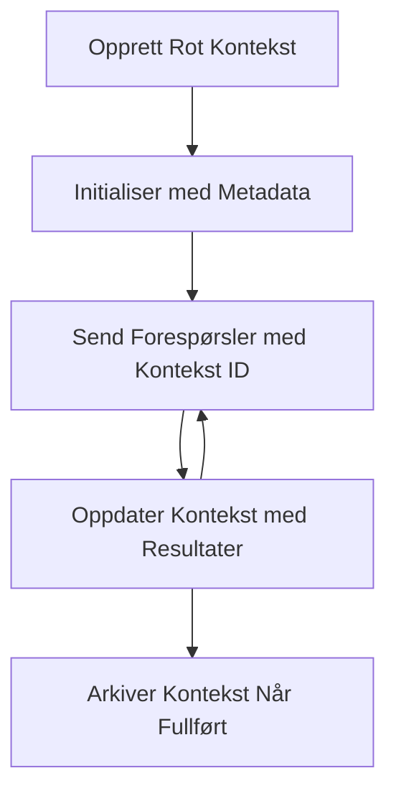

> [DEPRECATED: 2026-07-28 RELEASE CANDIDATE](https://blog.modelcontextprotocol.io/posts/2026-07-28-release-candidate/#roots-sampling-and-logging-are-deprecated)

# MCP Root Contexts

> **Avviksmelding:** MCP-spesifikasjonskandidaten for utgivelsen `2026-07-28` markerer Roots som avviklet til fordel for verktøyparametere, ressurs-URIer eller serverkonfigurasjon. Roots fungerer fortsatt i `2025-11-25` og i minst ett år etter enhver formell avvikling, så alt i denne leksjonen forblir gyldig – men nye serverdesign bør vurdere erstatningsmønsteret. Se [Hva endres i MCP: Utgivelseskandidat 2026-07-28](../../01-CoreConcepts/mcp-2026-07-28-release-candidate.md).

Root-kontekster er et grunnleggende konsept i Model Context Protocol som gir et vedvarende lag for å opprettholde samtalehistorikk og delt tilstand på tvers av flere forespørsler og økter.

## Introduksjon

I denne leksjonen skal vi utforske hvordan man oppretter, administrerer og bruker root-kontekster i MCP.

## Læringsmål

Mot slutten av denne leksjonen skal du kunne:

- Forstå formålet og strukturen til root-kontekster
- Opprette og administrere root-kontekster ved hjelp av MCP-klientbiblioteker
- Implementere root-kontekster i .NET, Java, JavaScript og Python-applikasjoner
- Bruke root-kontekster for samtaler med flere runder og tilstandsadministrasjon
- Implementere beste praksis for håndtering av root-kontekster

## Forstå root-kontekster

Root-kontekster fungerer som beholdere som holder historikk og tilstand for en serie relaterte interaksjoner. De gjør det mulig å:

- **Samtalepersistens**: Opprettholde koherente samtaler med flere runder
- **Minnehåndtering**: Lagring og henting av informasjon på tvers av interaksjoner
- **Tilstandsadministrasjon**: Sporing av fremdrift i komplekse arbeidsflyter
- **Kontekstdeling**: La flere klienter få tilgang til samme samtaletilstand

I MCP har root-kontekster disse nøkkelfunksjonene:

- Hver root-kontekst har en unik identifikator.
- De kan inneholde samtalehistorikk, brukerpreferanser og annen metadata.
- De kan opprettes, aksesseres og arkiveres etter behov.
- De støtter detaljert tilgangskontroll og tillatelser.

## Livssyklus for root-kontekst



## Arbeide med root-kontekster

Her er et eksempel på hvordan man oppretter og administrerer root-kontekster.

### C#-implementasjon

```csharp
// .NET Example: Root Context Management
using Microsoft.Mcp.Client;
using System;
using System.Threading.Tasks;
using System.Collections.Generic;

public class RootContextExample
{
    private readonly IMcpClient _client;
    private readonly IRootContextManager _contextManager;
    
    public RootContextExample(IMcpClient client, IRootContextManager contextManager)
    {
        _client = client;
        _contextManager = contextManager;
    }
    
    public async Task DemonstrateRootContextAsync()
    {
        // 1. Create a new root context
        var contextResult = await _contextManager.CreateRootContextAsync(new RootContextCreateOptions
        {
            Name = "Customer Support Session",
            Metadata = new Dictionary<string, string>
            {
                ["CustomerName"] = "Acme Corporation",
                ["PriorityLevel"] = "High",
                ["Domain"] = "Cloud Services"
            }
        });
        
        string contextId = contextResult.ContextId;
        Console.WriteLine($"Created root context with ID: {contextId}");
        
        // 2. First interaction using the context
        var response1 = await _client.SendPromptAsync(
            "I'm having issues scaling my web service deployment in the cloud.", 
            new SendPromptOptions { RootContextId = contextId }
        );
        
        Console.WriteLine($"First response: {response1.GeneratedText}");
        
        // Second interaction - the model will have access to the previous conversation
        var response2 = await _client.SendPromptAsync(
            "Yes, we're using containerized deployments with Kubernetes.", 
            new SendPromptOptions { RootContextId = contextId }
        );
        
        Console.WriteLine($"Second response: {response2.GeneratedText}");
        
        // 3. Add metadata to the context based on conversation
        await _contextManager.UpdateContextMetadataAsync(contextId, new Dictionary<string, string>
        {
            ["TechnicalEnvironment"] = "Kubernetes",
            ["IssueType"] = "Scaling"
        });
        
        // 4. Get context information
        var contextInfo = await _contextManager.GetRootContextInfoAsync(contextId);
        
        Console.WriteLine("Context Information:");
        Console.WriteLine($"- Name: {contextInfo.Name}");
        Console.WriteLine($"- Created: {contextInfo.CreatedAt}");
        Console.WriteLine($"- Messages: {contextInfo.MessageCount}");
        
        // 5. When the conversation is complete, archive the context
        await _contextManager.ArchiveRootContextAsync(contextId);
        Console.WriteLine($"Archived context {contextId}");
    }
}
```

I koden ovenfor har vi:

1. Opprettet en root-kontekst for en kundesupportøkt.
1. Sendt flere meldinger innenfor den konteksten, slik at modellen kan opprettholde tilstand.
1. Oppdatert konteksten med relevant metadata basert på samtalen.
1. Hentet kontekstinformasjon for å forstå samtalehistorikken.
1. Arkivert konteksten da samtalen var fullført.

## Eksempel: Implementering av root-kontekst for finansanalyse

I dette eksemplet skal vi opprette en root-kontekst for en finansanalyseøkt og demonstrere hvordan man opprettholder tilstand på tvers av flere interaksjoner.

### Java-implementasjon

```java
// Java Eksempel: Rotkontekst Implementering
package com.example.mcp.contexts;

import com.mcp.client.McpClient;
import com.mcp.client.ContextManager;
import com.mcp.models.RootContext;
import com.mcp.models.McpResponse;

import java.util.HashMap;
import java.util.Map;
import java.util.UUID;

public class RootContextsDemo {
    private final McpClient client;
    private final ContextManager contextManager;
    
    public RootContextsDemo(String serverUrl) {
        this.client = new McpClient.Builder()
            .setServerUrl(serverUrl)
            .build();
            
        this.contextManager = new ContextManager(client);
    }
    
    public void demonstrateRootContext() throws Exception {
        // Opprett kontekstmetadata
        Map<String, String> metadata = new HashMap<>();
        metadata.put("projectName", "Financial Analysis");
        metadata.put("userRole", "Financial Analyst");
        metadata.put("dataSource", "Q1 2025 Financial Reports");
        
        // 1. Opprett en ny rotkontekst
        RootContext context = contextManager.createRootContext("Financial Analysis Session", metadata);
        String contextId = context.getId();
        
        System.out.println("Created context: " + contextId);
        
        // 2. Første interaksjon
        McpResponse response1 = client.sendPrompt(
            "Analyze the trends in Q1 financial data for our technology division",
            contextId
        );
        
        System.out.println("First response: " + response1.getGeneratedText());
        
        // 3. Oppdater kontekst med viktig informasjon hentet fra responsen
        contextManager.addContextMetadata(contextId, 
            Map.of("identifiedTrend", "Increasing cloud infrastructure costs"));
        
        // Andre interaksjon - bruker samme kontekst
        McpResponse response2 = client.sendPrompt(
            "What's driving the increase in cloud infrastructure costs?",
            contextId
        );
        
        System.out.println("Second response: " + response2.getGeneratedText());
        
        // 4. Generer et sammendrag av analysesesjonen
        McpResponse summaryResponse = client.sendPrompt(
            "Summarize our analysis of the technology division financials in 3-5 key points",
            contextId
        );
        
        // Lagre sammendraget i kontekstmetadata
        contextManager.addContextMetadata(contextId, 
            Map.of("analysisSummary", summaryResponse.getGeneratedText()));
            
        // Hent oppdatert kontekstinformasjon
        RootContext updatedContext = contextManager.getRootContext(contextId);
        
        System.out.println("Context Information:");
        System.out.println("- Created: " + updatedContext.getCreatedAt());
        System.out.println("- Last Updated: " + updatedContext.getLastUpdatedAt());
        System.out.println("- Analysis Summary: " + 
            updatedContext.getMetadata().get("analysisSummary"));
            
        // 5. Arkiver konteksten når du er ferdig
        contextManager.archiveContext(contextId);
        System.out.println("Context archived");
    }
}
```

I koden ovenfor har vi:

1. Opprettet en root-kontekst for en finansanalyseøkt.
2. Sendt flere meldinger innenfor den konteksten, slik at modellen kan opprettholde tilstand.
3. Oppdatert konteksten med relevant metadata basert på samtalen.
4. Generert et sammendrag av analyseøkten og lagret det i kontekstmetadataen.
5. Arkivert konteksten da samtalen var fullført.

## Eksempel: Administrasjon av root-kontekst

Å administrere root-kontekster effektivt er avgjørende for å opprettholde samtalehistorikk og tilstand. Nedenfor er et eksempel på hvordan man implementerer root-kontekstadministrasjon.

### JavaScript-implementasjon

```javascript
// JavaScript-eksempel: Håndtering av MCP-root-kontekster
const { McpClient, RootContextManager } = require('@mcp/client');

class ContextSession {
  constructor(serverUrl, apiKey = null) {
    // Initialiser MCP-klienten
    this.client = new McpClient({
      serverUrl,
      apiKey
    });
    
    // Initialiser kontekstbehandler
    this.contextManager = new RootContextManager(this.client);
  }
  
  /**
   * Create a new conversation context
   * @param {string} sessionName - Name of the conversation session
   * @param {Object} metadata - Additional metadata for the context
   * @returns {Promise<string>} - Context ID
   */
  async createConversationContext(sessionName, metadata = {}) {
    try {
      const contextResult = await this.contextManager.createRootContext({
        name: sessionName,
        metadata: {
          ...metadata,
          createdAt: new Date().toISOString(),
          status: 'active'
        }
      });
      
      console.log(`Created root context '${sessionName}' with ID: ${contextResult.id}`);
      return contextResult.id;
    } catch (error) {
      console.error('Error creating root context:', error);
      throw error;
    }
  }
  
  /**
   * Send a message in an existing context
   * @param {string} contextId - The root context ID
   * @param {string} message - The user's message
   * @param {Object} options - Additional options
   * @returns {Promise<Object>} - Response data
   */
  async sendMessage(contextId, message, options = {}) {
    try {
      // Send meldingen ved å bruke den spesifiserte konteksten
      const response = await this.client.sendPrompt(message, {
        rootContextId: contextId,
        temperature: options.temperature || 0.7,
        allowedTools: options.allowedTools || []
      });
      
      // Valgfritt lagre viktige innsikter fra samtalen
      if (options.storeInsights) {
        await this.storeConversationInsights(contextId, message, response.generatedText);
      }
      
      return {
        message: response.generatedText,
        toolCalls: response.toolCalls || [],
        contextId
      };
    } catch (error) {
      console.error(`Error sending message in context ${contextId}:`, error);
      throw error;
    }
  }
  
  /**
   * Store important insights from a conversation
   * @param {string} contextId - The root context ID
   * @param {string} userMessage - User's message
   * @param {string} aiResponse - AI's response
   */
  async storeConversationInsights(contextId, userMessage, aiResponse) {
    try {
      // Ekstraher potensielle innsikter (i en ekte app vil dette være mer sofistikert)
      const combinedText = userMessage + "\n" + aiResponse;
      
      // Enkel heuristikk for å identifisere potensielle innsikter
      const insightWords = ["important", "key point", "remember", "significant", "crucial"];
      
      const potentialInsights = combinedText
        .split(".")
        .filter(sentence => 
          insightWords.some(word => sentence.toLowerCase().includes(word))
        )
        .map(sentence => sentence.trim())
        .filter(sentence => sentence.length > 10);
      
      // Lagre innsikter i kontekstmetadata
      if (potentialInsights.length > 0) {
        const insights = {};
        potentialInsights.forEach((insight, index) => {
          insights[`insight_${Date.now()}_${index}`] = insight;
        });
        
        await this.contextManager.updateContextMetadata(contextId, insights);
        console.log(`Stored ${potentialInsights.length} insights in context ${contextId}`);
      }
    } catch (error) {
      console.warn('Error storing conversation insights:', error);
      // Ikke-kritisk feil, så bare logg advarsel
    }
  }
  
  /**
   * Get summary information about a context
   * @param {string} contextId - The root context ID
   * @returns {Promise<Object>} - Context information
   */
  async getContextInfo(contextId) {
    try {
      const contextInfo = await this.contextManager.getContextInfo(contextId);
      
      return {
        id: contextInfo.id,
        name: contextInfo.name,
        created: new Date(contextInfo.createdAt).toLocaleString(),
        lastUpdated: new Date(contextInfo.lastUpdatedAt).toLocaleString(),
        messageCount: contextInfo.messageCount,
        metadata: contextInfo.metadata,
        status: contextInfo.status
      };
    } catch (error) {
      console.error(`Error getting context info for ${contextId}:`, error);
      throw error;
    }
  }
  
  /**
   * Generate a summary of the conversation in a context
   * @param {string} contextId - The root context ID
   * @returns {Promise<string>} - Generated summary
   */
  async generateContextSummary(contextId) {
    try {
      // Be modellen om å generere en oppsummering av samtalen så langt
      const response = await this.client.sendPrompt(
        "Please summarize our conversation so far in 3-4 sentences, highlighting the main points discussed.",
        { rootContextId: contextId, temperature: 0.3 }
      );
      
      // Lagre oppsummeringen i kontekstmetadata
      await this.contextManager.updateContextMetadata(contextId, {
        conversationSummary: response.generatedText,
        summarizedAt: new Date().toISOString()
      });
      
      return response.generatedText;
    } catch (error) {
      console.error(`Error generating context summary for ${contextId}:`, error);
      throw error;
    }
  }
  
  /**
   * Archive a context when it's no longer needed
   * @param {string} contextId - The root context ID
   * @returns {Promise<Object>} - Result of the archive operation
   */
  async archiveContext(contextId) {
    try {
      // Generer en endelig oppsummering før arkivering
      const summary = await this.generateContextSummary(contextId);
      
      // Arkiver konteksten
      await this.contextManager.archiveContext(contextId);
      
      return {
        status: "archived",
        contextId,
        summary
      };
    } catch (error) {
      console.error(`Error archiving context ${contextId}:`, error);
      throw error;
    }
  }
}

// Eksempel på bruk
async function demonstrateContextSession() {
  const session = new ContextSession('https://mcp-server-example.com');
  
  try {
    // 1. Opprett en ny kontekst for en produktstøttesamtale
    const contextId = await session.createConversationContext(
      'Product Support - Database Performance',
      {
        customer: 'Globex Corporation',
        product: 'Enterprise Database',
        severity: 'Medium',
        supportAgent: 'AI Assistant'
      }
    );
    
    // 2. Første melding i samtalen
    const response1 = await session.sendMessage(
      contextId,
      "I'm experiencing slow query performance on our database cluster after the latest update.",
      { storeInsights: true }
    );
    console.log('Response 1:', response1.message);
    
    // Oppfølgingsmelding i samme kontekst
    const response2 = await session.sendMessage(
      contextId,
      "Yes, we've already checked the indexes and they seem to be properly configured.",
      { storeInsights: true }
    );
    console.log('Response 2:', response2.message);
    
    // 3. Hent informasjon om konteksten
    const contextInfo = await session.getContextInfo(contextId);
    console.log('Context Information:', contextInfo);
    
    // 4. Generer og vis samtaleoppsummering
    const summary = await session.generateContextSummary(contextId);
    console.log('Conversation Summary:', summary);
    
    // 5. Arkiver konteksten når du er ferdig
    const archiveResult = await session.archiveContext(contextId);
    console.log('Archive Result:', archiveResult);
    
    // 6. Håndter eventuelle feil på en smidig måte
  } catch (error) {
    console.error('Error in context session demonstration:', error);
  }
}

demonstrateContextSession();
```

I koden ovenfor har vi:

1. Opprettet en root-kontekst for en produktsupport-samtale med funksjonen `createConversationContext`. I dette tilfellet handler konteksten om databaseytelsesproblemer.

1. Sendt flere meldinger innenfor den konteksten, slik at modellen kan opprettholde tilstand med funksjonen `sendMessage`. Meldingenes tema er treg spørringsytelse og indekskonfigurasjon.

1. Oppdatert konteksten med relevant metadata basert på samtalen.

1. Generert et sammendrag av samtalen og lagret dette i kontekstmetadataen med funksjonen `generateContextSummary`.

1. Arkivert konteksten når samtalen var fullført med funksjonen `archiveContext`.

1. Håndtert feil på en smidig måte for å sikre robusthet.

## Root-kontekst for fleromgangshjelp

I dette eksemplet skal vi opprette en root-kontekst for en fleromgangshjelp-økt, og demonstrere hvordan man opprettholder tilstand på tvers av flere interaksjoner.

### Python-implementasjon

```python
# Python-eksempel: Rotkontekst for fleromgangshjelp
import asyncio
from datetime import datetime
from mcp_client import McpClient, RootContextManager

class AssistantSession:
    def __init__(self, server_url, api_key=None):
        self.client = McpClient(server_url=server_url, api_key=api_key)
        self.context_manager = RootContextManager(self.client)
    
    async def create_session(self, name, user_info=None):
        """Create a new root context for an assistant session"""
        metadata = {
            "session_type": "assistant",
            "created_at": datetime.now().isoformat(),
        }
        
        # Legg til brukerinformasjon hvis oppgitt
        if user_info:
            metadata.update({f"user_{k}": v for k, v in user_info.items()})
            
        # Opprett rotkonteksten
        context = await self.context_manager.create_root_context(name, metadata)
        return context.id
    
    async def send_message(self, context_id, message, tools=None):
        """Send a message within a root context"""
        # Opprett alternativer med kontekst-ID
        options = {
            "root_context_id": context_id
        }
        
        # Legg til verktøy hvis spesifisert
        if tools:
            options["allowed_tools"] = tools
        
        # Send prompten innenfor konteksten
        response = await self.client.send_prompt(message, options)
        
        # Oppdater kontekstmetadata med samtalefremgang
        await self.context_manager.update_context_metadata(
            context_id,
            {
                f"message_{datetime.now().timestamp()}": message[:50] + "...",
                "last_interaction": datetime.now().isoformat()
            }
        )
        
        return response
    
    async def get_conversation_history(self, context_id):
        """Retrieve conversation history from a context"""
        context_info = await self.context_manager.get_context_info(context_id)
        messages = await self.client.get_context_messages(context_id)
        
        return {
            "context_info": context_info,
            "messages": messages
        }
    
    async def end_session(self, context_id):
        """End an assistant session by archiving the context"""
        # Generer en sammendrags-prompt først
        summary_response = await self.client.send_prompt(
            "Please summarize our conversation and any key points or decisions made.",
            {"root_context_id": context_id}
        )
        
        # Lagre sammendrag i metadata
        await self.context_manager.update_context_metadata(
            context_id,
            {
                "summary": summary_response.generated_text,
                "ended_at": datetime.now().isoformat(),
                "status": "completed"
            }
        )
        
        # Arkiver konteksten
        await self.context_manager.archive_context(context_id)
        
        return {
            "status": "completed",
            "summary": summary_response.generated_text
        }

# Eksempel på bruk
async def demo_assistant_session():
    assistant = AssistantSession("https://mcp-server-example.com")
    
    # 1. Opprett sesjon
    context_id = await assistant.create_session(
        "Technical Support Session",
        {"name": "Alex", "technical_level": "advanced", "product": "Cloud Services"}
    )
    print(f"Created session with context ID: {context_id}")
    
    # 2. Første interaksjon
    response1 = await assistant.send_message(
        context_id, 
        "I'm having trouble with the auto-scaling feature in your cloud platform.",
        ["documentation_search", "diagnostic_tool"]
    )
    print(f"Response 1: {response1.generated_text}")
    
    # Andre interaksjon i samme kontekst
    response2 = await assistant.send_message(
        context_id,
        "Yes, I've already checked the configuration settings you mentioned, but it's still not working."
    )
    print(f"Response 2: {response2.generated_text}")
    
    # 3. Hent historikk
    history = await assistant.get_conversation_history(context_id)
    print(f"Session has {len(history['messages'])} messages")
    
    # 4. Avslutt sesjon
    end_result = await assistant.end_session(context_id)
    print(f"Session ended with summary: {end_result['summary']}")

if __name__ == "__main__":
    asyncio.run(demo_assistant_session())
```

I koden ovenfor har vi:

1. Opprettet en root-kontekst for en teknisk supportøkt med funksjonen `create_session`. Konteksten inkluderer brukeropplysninger som navn og teknisk nivå.

1. Sendt flere meldinger innenfor den konteksten, slik at modellen kan opprettholde tilstand med funksjonen `send_message`. Meldingenes tema er problemer med auto-skaleringsfunksjonen.

1. Hentet samtalehistorikk ved å bruke funksjonen `get_conversation_history`, som gir kontekstinformasjon og meldinger.

1. Avsluttet økten ved å arkivere konteksten og generere et sammendrag med funksjonen `end_session`. Sammendraget fanger opp viktige punkter fra samtalen.

## Beste praksis for root-kontekst

Her er noen beste praksiser for effektiv håndtering av root-kontekster:

- **Opprett fokuserte kontekster**: Opprett separate root-kontekster for forskjellige samtalehensikter eller domener for å opprettholde klarhet.

- **Sett utløpspolicyer**: Implementer retningslinjer for arkivering eller sletting av gamle kontekster for å håndtere lagring og overholde retningslinjer for datalagring.

- **Lagre relevant metadata**: Bruk kontekstmetadata for å lagre viktig informasjon om samtalen som kan være nyttig senere.

- **Bruk kontekst-IDer konsistent**: Når en kontekst er opprettet, bruk ID-en konsistent for alle tilknyttede forespørsler for å opprettholde kontinuitet.

- **Generer sammendrag**: Når en kontekst vokser seg stor, vurder å generere sammendrag for å fange essensiell informasjon samtidig som man håndterer kontekststørrelse.

- **Implementer tilgangskontroll**: For systemer med flere brukere, implementer riktig tilgangskontroll for å sikre personvern og sikkerhet for samtalekontekster.

- **Håndter kontekstbegrensninger**: Vær oppmerksom på begrensninger i kontekststørrelse og implementer strategier for å håndtere svært lange samtaler.

- **Arkiver når fullført**: Arkiver kontekster når samtaler er fullført for å frigjøre ressurser samtidig som samtalehistorikken bevares.

## Hva er det neste?

- [5.5 Ruting](../mcp-routing/README.md)

---

<!-- CO-OP TRANSLATOR DISCLAIMER START -->
**Ansvarsfraskrivelse**:
Dette dokumentet er oversatt ved hjelp av AI-oversettelsestjenesten [Co-op Translator](https://github.com/Azure/co-op-translator). Selv om vi streber etter nøyaktighet, vær oppmerksom på at automatiske oversettelser kan inneholde feil eller unøyaktigheter. Det opprinnelige dokumentet på originalspråket skal betraktes som den autoritative kilden. For kritisk informasjon anbefales profesjonell menneskelig oversettelse. Vi er ikke ansvarlige for eventuelle misforståelser eller feiltolkninger som oppstår ved bruk av denne oversettelsen.
<!-- CO-OP TRANSLATOR DISCLAIMER END -->