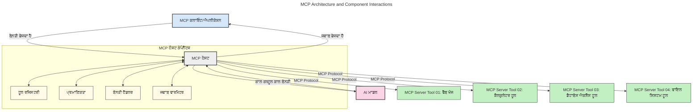
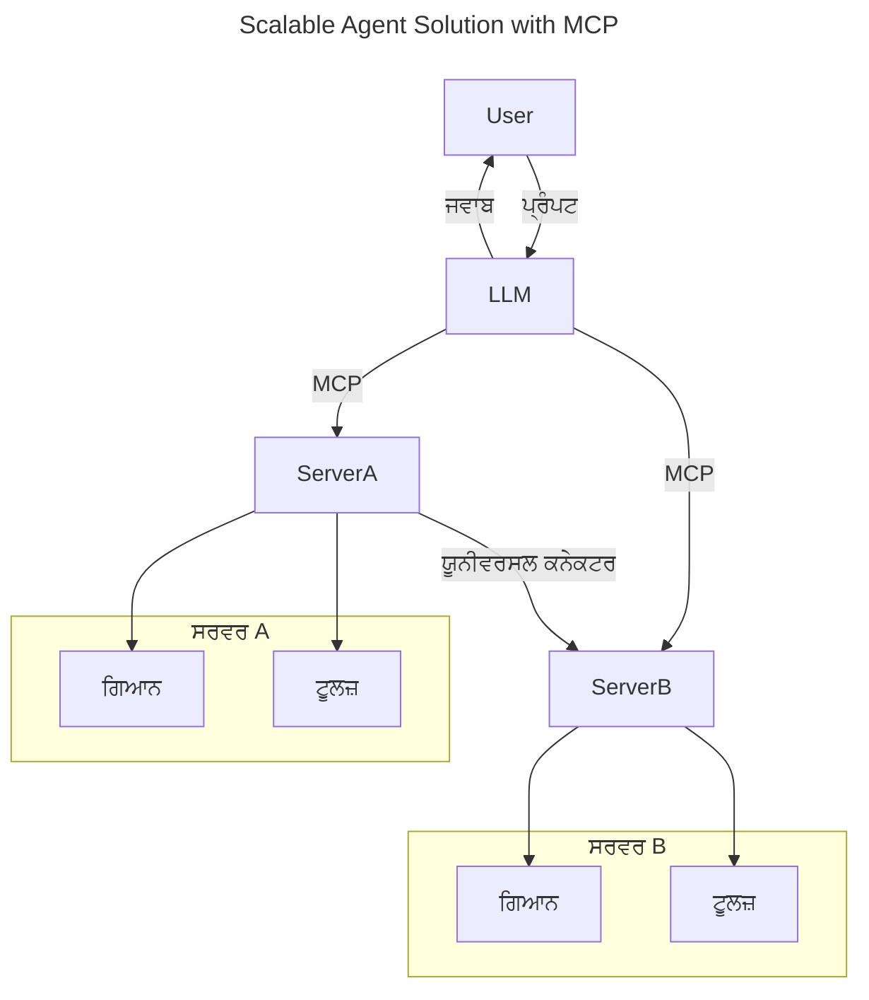
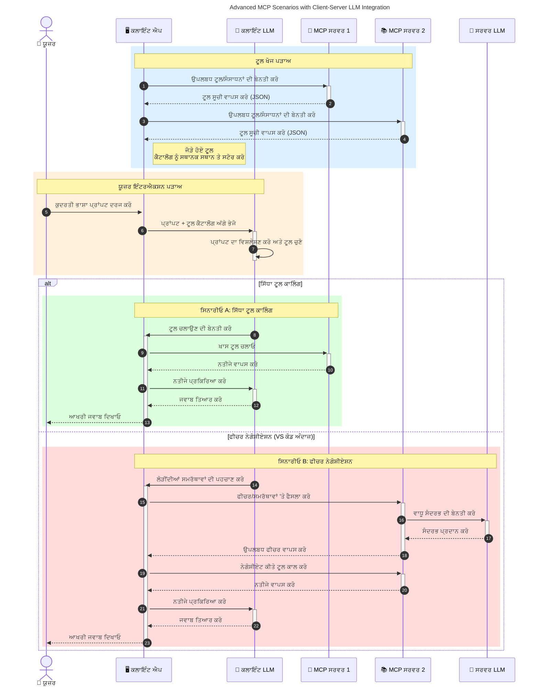

# ਮਾਡਲ ਕਾਂਟੈਕਸਟ ਪ੍ਰੋਟੋਕੌਲ (MCP) ਦਾ ਪਰਚਯ: ਸਕੇਲ ਕਰਨ ਯੋਗ AI ਐਪਲੀਕੇਸ਼ਨਾਂ ਲਈ ਇਹ ਕਿਉਂ ਮਹੱਤਵਪੂਰਨ ਹੈ

_(ਇਸ ਪਾਠ ਦੀ ਵੀਡੀਓ ਦੇਖਣ ਲਈ ਉੱਪਰ ਦਿੱਤੀ ਤਸਵੀਰ 'ਤੇ ਕਲਿੱਕ ਕਰੋ)_

ਜਨਰੇਟਿਵ AI ਐਪਲੀਕੇਸ਼ਨ ਇੱਕ ਵੱਡਾ ਕਦਮ ਅੱਗੇ ਹਨ ਕਿਉਂਕਿ ਇਹ ਅਕਸਰ ਉਪਭੋਗਤਾ ਨੂੰ ਕੁਦਰਤੀ ਭਾਸ਼ਾ ਪ੍ਰੋੰਪਟਸ ਦੀ ਵਰਤੋਂ ਕਰਕੇ ਐਪ ਨਾਲ ਇੰਟਰੇਕਟ ਕਰਨ ਦਿੰਦੇ ਹਨ। ਪਰ ਜਿਵੇਂ ਜਿਵੇਂ ਐਸੀ ਐਪਲੀਕੇਸ਼ਨਾਂ ਵਿੱਚ ਵਧੇਰੇ ਸਮਾਂ ਅਤੇ ਸਰੋਤ ਲਾਏ ਜਾਂਦੇ ਹਨ, ਤੁਸੀਂ ਇਹ ਯਕੀਨੀ ਬਣਾਉਣਾ ਚਾਹੁੰਦੇ ਹੋ ਕਿ ਤੁਸੀਂ ਫੰਕਸ਼ਨਲਿਟੀਜ਼ ਅਤੇ ਸਰੋਤਾਂ ਨੂੰ ਇਸ ਤਰ੍ਹਾਂ ਸਮੇਤ ਸਕਦੇ ਹੋ ਕਿ ਉਹ ਅਸਾਨੀ ਨਾਲ ਵਧਾਈ ਜਾ ਸਕਣ, ਤੁਹਾਡੀ ਐਪ ਇਕ ਤੋਂ ਵੱਧ ਮਾਡਲਾਂ ਦੀ ਸੇਵਾ ਕਰ ਸਕੇ ਅਤੇ ਵੱਖ-ਵੱਖ ਮਾਡਲਾਂ ਦੀਆਂ ਜਟਿਲਤਾਵਾਂ ਨੂੰ ਸਹੀ ਢੰਗ ਨਾਲ ਸੰਭਾਲ ਸਕੇ। ਸਾਰ ਵਿੱਚ, ਜਨਰੇਟਿਵ AI ਐਪ ਬਣਾਉਣਾ ਸ਼ੁਰੂ ਵਿੱਚ ਆਸਾਨ ਹੁੰਦਾ ਹੈ, ਪਰ ਜਦੋਂ ਇਹ ਵਧਦੇ ਹਨ ਅਤੇ ਜ਼ਿਆਦਾ ਜਟਿਲ ਹੋ ਜਾਂਦੇ ਹਨ, ਤੁਹਾਨੂੰ ਇਕ ਆਰਕੀਟੈਕਚਰ ਨੂੰ ਪਰਿਭਾਸ਼ਿਤ ਕਰਨਾ ਸ਼ੁਰੂ ਕਰਨਾ ਪੈਂਦਾ ਹੈ ਅਤੇ ਇੱਕ ਸਟੈਂਡਰਡ 'ਤੇ ਨਿਰਭਰ ਰਹਿਣ ਦੀ ਲੋੜ ਪੈਂਦੀ ਹੈ ਤਾਂ ਜੋ ਤੁਹਾਡੀਆਂ ਐਪਲੀਕੇਸ਼ਨ ਇੱਕ ਸੰਗਠਿਤ ਢੰਗ ਨਾਲ ਬਣੀਆਂ ਹੋਣ। ਇਹੀ ਜਗ੍ਹਾ ਹੈ ਜਿੱਥੇ MCP ਕੰਮ ਕਰਦਾ ਹੈ ਤਾਕੀ ਚੀਜ਼ਾਂ ਨੂੰ ਸੁਚਾਰੂ ਢੰਗ ਨਾਲ ਮਿਲਾਇਆ ਜਾ ਸਕੇ ਅਤੇ ਇੱਕ ਮਿਆਰੀ ਤਰੀਕਾ ਮੁਹੱਈਆ ਕਰਵਾਇਆ ਜਾ ਸਕੇ।

---

## **🔍 ਮਾਡਲ ਕਾਂਟੈਕਸਟ ਪ੍ਰੋਟੋਕੌਲ (MCP) ਕੀ ਹੈ?**

**ਮਾਡਲ ਕਾਂਟੈਕਸਟ ਪ੍ਰੋਟੋਕੌਲ (MCP)** ਇੱਕ **ਖੁੱਲ੍ਹਾ, ਮਿਆਰੀ ਇੰਟਰਫੇਸ** ਹੈ ਜੋ ਵੱਡੇ ਭਾਸ਼ਾਈ ਮਾਡਲਾਂ (LLMs) ਨੂੰ ਬਾਹਰੀ ਟੂਲਾਂ, APIs ਅਤੇ ਡਾਟਾ ਸਰੋਤਾਂ ਨਾਲ ਬਿਨਾ ਕਿਸੇ ਰੁਕਾਵਟ ਦੇ ਇੰਟਰਐਕਟ ਕਰਨ ਦੀ ਆਗਿਆ ਦਿੰਦਾ ਹੈ। ਇਹ ਇੱਕ ਸਥਿਰ ਆਰਕੀਟੈਕਚਰ ਪ੍ਰਦਾਨ ਕਰਦਾ ਹੈ ਜੋ AI ਮਾਡਲ ਦੀ ਕਾਰਗੁਜ਼ਾਰੀ ਨੂੰ ਉਨ੍ਹਾਂ ਦੀ ਟ੍ਰੇਨਿੰਗ ਡੇਟਾ ਦੇ ਪਰੇ ਵਧਾਉਂਦਾ ਹੈ, ਜਿਸ ਨਾਲ ਹੋਸ਼ਿਆਰ, ਸਕੇਲ ਕਰਨ ਯੋਗ ਅਤੇ ਜ਼ਿਆਦਾ ਜਵਾਬਦੇਹ AI ਪ੍ਰਣਾਲੀਆਂ ਬਣਦੀਆਂ ਹਨ।

---

## **🎯 AI ਵਿੱਚ ਮਿਆਰੀਕਰਨ ਕਿਉਂ ਜਰੂਰੀ ਹੈ**

ਜਿਵੇਂ ਜਨਰੇਟਿਵ AI ਐਪਲੀਕੇਸ਼ਨਾਂ ਵੱਧ ਜਟਿਲ ਹੁੰਦੀਆਂ ਹਨ, ਇਹ ਜਰੂਰੀ ਹੈ ਕਿ ਐਸੀ ਸਟੈਂਡਰਡਜ਼ ਨੂੰ ਅਪਣਾਇਆ ਜਾਵੇ ਜੋ **ਸਕੇਲਬਿਲਟੀ, ਵਿਸਥਾਰਯੋਗਤਾ, ਰਖ-ਰਖਾਵ** ਅਤੇ **ਵੈਂਡਰ ਲੌਕ-ਇਨ ਤੋਂ ਬਚਾਅ** ਯਕੀਨੀ ਬਣਾਉਂਦੇ ਹਨ। MCP ਇਹਨਾਂ ਜਰੂਰਤਾਂ ਨੂੰ ਕੁਝ ਇਸ ਤਰ੍ਹਾਂ ਪੂਰੀ ਕਰਦਾ ਹੈ:

- ਮਾਡਲ-ਟੂਲ ਇੰਟਿਗ੍ਰੇਸ਼ਨਾਂ ਨੂੰ ਇਕਤਾ ਦੇਣਾ
- ਇਕ-ਵਾਰੀ ਦੇ ਕਸਟਮ ਹੱਲਾਂ ਨੂੰ ਘਟਾਉਣਾ
- ਵੱਖਰੇ ਵੈਂਡਰਾਂ ਦੇ ਕਈ ਮਾਡਲ ਇਕੋ ਇਕ ਸਿਸਟਮ ਵਿੱਚ ਹੋਣ ਦਿੰਦਾ

**ਨੋਟ:** ਜਿੱਥੇ MCP ਖੁੱਲ੍ਹੇ ਮਿਆਰੀ ਤੌਰ 'ਤੇ ਦਰਸਾਇਆ ਗਿਆ ਹੈ, ਪਰ MCP ਨੂੰ ਕਿਸੇ ਮੌਜੂਦਾ ਮਿਆਰ ਬਾਡੀ ਜਿਵੇਂ IEEE, IETF, W3C, ISO ਜਾਂ ਹੋਰ ਕਿਸੇ ਸਥਾਨਿਕ ਮਿਆਰ ਬਾਡੀ ਰਾਹੀਂ ਮਿਆਰੀਕਰਨ ਕਰਨ ਦੇ ਕੋਈ ਯੋਜਨਾ ਨਹੀਂ ਹਨ।

---

## **📚 ਸਿੱਖਣ ਦੇ ਉਦੇਸ਼**

ਇਸ ਲੇਖ ਦੇ ਅੰਤ ਤੱਕ, ਤੁਸੀਂ ਸਮਰੱਥ ਹੋਵੋਗੇ:

- **ਮਾਡਲ ਕਾਂਟੈਕਸਟ ਪ੍ਰੋਟੋਕੌਲ (MCP)** ਅਤੇ ਇਸ ਦੇ ਇਸ਼ਤੇਮਾਲਾਂ ਨੂੰ ਪਰਿਭਾਸ਼ਿਤ ਕਰਨ ਲਈ
- ਸਮਝਣ ਲਈ ਕਿ MCP ਮਾਡਲ-ਟੂਲ ਸੰਚਾਰ ਨੂੰ ਕਿਵੇਂ ਮਿਆਰੀਕਰਦਾ ਹੈ
- MCP ਆਰਕੀਟੈਕਚਰ ਦੇ ਮੁੱਖ ਹਿਸਿਆਂ ਦੀ ਪਹਿਚਾਣ ਕਰਨ ਲਈ
- ਵਾਸਤਵਿਕ ਜੀਵਨ ਦੇ ਐਕਸਪਲਾਂ ਵਿਚ MCP ਦੀਆਂ ਵਰਤੋਂਆਂ ਬਾਰੇ ਜਾਣਨ ਲਈ

---

## **💡 ਮਾਡਲ ਕਾਂਟੈਕਸਟ ਪ੍ਰੋਟੋਕੌਲ (MCP) ਕਿਉਂ ਇਕ ਗੇਮ-ਚੇਂਜਰ ਹੈ**

### **🔗 MCP AI ਇੰਟਰਐਕਸ਼ਨਾਂ ਵਿੱਚ ਟੁਕੜੇ-ਦੁਰੀ ਨੂੰ ਮੁਕੰਮਲ ਕਰਦਾ ਹੈ**

MCP ਤੋਂ ਪਹਿਲਾਂ, ਮਾਡਲਾਂ ਨੂੰ ਟੂਲਾਂ ਨਾਲ ਜੋੜਨ ਲਈ ਲੋੜ ਸੀ:

- ਹਰ ਇੱਕ ਟੂਲ-ਮਾਡਲ ਜੋੜੀ ਲਈ ਕਸਟਮ ਕੋਡ
- ਹਰ ਇੱਕ ਵੈਂਡਰ ਲਈ ਗੈਰ-ਮਿਆਰੀ API
- ਅੱਪਡੇਟਾਂ ਦੇ ਕਾਰਨ ਅਕਸਰ ਟੁੱਟਣਾ
- ਵੱਧ ਟੂਲਾਂ ਨਾਲ ਘੱਟ ਸਕੇਲਬਿਲਟੀ

### **✅ MCP ਮਿਆਰੀਕਰਨ ਦੇ ਫਾਇਦੇ**

| **ਫਾਇਦਾ**               | **ਵੇਰਵਾ**                                                                   |
|------------------------|-----------------------------------------------------------------------------|
| ਇੰਟਰਓਪਰੇਬਿਲਿਟੀ       | ਵੱਖਰੇ ਵੈਂਡਰਾਂ ਦੇ ਟੂਲਾਂ ਨਾਲ LLM ਸਹਿਜ ਤੌਰ 'ਤੇ ਕੰਮ ਕਰਦਾ ਹੈ                  |
| ਇਕਸਾਰਤਾ               | ਪਲੇਟਫਾਰਮ ਅਤੇ ਟੂਲਾਂ 'ਤੇ ਸਾਂਝਾ ਵਰਤਾਰਾ                                    |
| ਦੁਬਾਰਾ ਵਰਤੋਂ ਯੋਗਤਾ    | ਇੱਕ ਵਾਰੀ ਬਣੇ ਟੂਲਾਂ ਨੂੰ ਵੱਖ-ਵੱਖ ਪ੍ਰੋਜੈਕਟਾਂ ਅਤੇ ਸਿਸਟਮਾਂ ਵਿਚ ਵਰਤਿਆ ਜਾ ਸਕਦਾ ਹੈ |
| ਤੇਜ਼ ਵਿਕਾਸ              | ਮਿਆਰੀ, ਪਲੱਗ-ਐਂਡ-ਪਲੇਅ ਇੰਟਰਫੇਸ ਨਾਲ ਵਿਕਾਸ ਸਮਾਂ ਘਟਾਉਂਦਾ ਹੈ                  |

---

## **🧱 ਉੱਚ-ਸਤਰ MCP ਆਰਕੀਟੈਕਚਰ ਦੇਖੋ**

MCP ਇਕ **ਕਲਾਇੰਟ-ਸਰਵਰ ਮਾਡਲ** ਦੀ ਪਾਲਣਾ ਕਰਦਾ ਹੈ, ਜਿਸ ਵਿੱਚ:

- **MCP ਹੋਸਟ** AI ਮਾਡਲ ਚਲਾਉਂਦੇ ਹਨ
- **MCP ਕਲਾਇੰਟ** ਬੇਨਤੀਆਂ ਸ਼ੁਰੂ ਕਰਦੇ ਹਨ
- **MCP ਸਰਵਰ** ਕਾਂਟੈਕਸਟ, ਟੂਲ ਅਤੇ ਸਮਰੱਥਾਵਾਂ ਮੁਹੱਈਆ ਕਰਵਾਉਂਦੇ ਹਨ

### **ਮੁੱਖ ਹਿੱਸੇ:**

- **ਸਰੋਤ** – ਮਾਡਲਾਂ ਲਈ ਸਥਿਰ ਜਾਂ ਗਤੀਸ਼ੀਲ ਡਾਟਾ  
- **ਪ੍ਰੋੰਪਟ** – ਦਿਸ਼ਾ ਨਿਰਦੇਸ਼ਿਤ ਜਨਰੇਸ਼ਨ ਵਾਰਕਫਲੋ  
- **ਟੂਲ** – ਲਾਭਕਾਰੀ ਕਾਰਜ ਜਿਵੇਂ ਖੋਜ, ਹਿਸਾਬ  
- **ਨਮੂਨਾ ਲੈਣਾ** – ਰਿਕਰਸੀਵ ਸੰਵਾਦਾਂ ਰਾਹੀਂ ਏਜੰਟਿਕ ਬਿਹਿਵਿਅਰ (`2026-07-28` ਰਿਲੀਜ਼ ਕੈਂਡੀਡੇਟ ਵਿੱਚ ਰੱਦ)  
- **ਮੰਗਨਾ** – ਉਪਭੋਗਤਾ ਇਨਪੁੱਟ ਲਈ ਸਰਵਰ ਸ਼ੁਰੂ ਕਰਨ ਵਾਲੀਆਂ ਬੇਨਤੀਆਂ  
- **ਰੂਟ** – ਸਰਵਰ ਐਕਸੇਸ ਕੰਟਰੋਲ ਲਈ ਫਾਇਲ ਸਿਸਟਮ ਸਰਹੱਦਾਂ (`2026-07-28` ਰਿਲੀਜ਼ ਕੈਂਡੀਡੇਟ ਵਿੱਚ ਰੱਦ)  

### **ਪ੍ਰੋਟੋਕੌਲ ਆਰਕੀਟੈਕਚਰ:**

MCP ਦੋ-ਪਹਿਰਾਂ ਵਾਲਾ ਆਰਕੀਟੈਕਚਰ ਵਰਤਦਾ ਹੈ:
- **ਡਾਟਾ ਪਹਿਰਾ**: JSON-RPC 2.0 ਆਧਾਰਿਤ ਸੰਚਾਰ ਲਾਈਫਸਾਈਕਲ ਪ੍ਰਬੰਧਨ ਅਤੇ ਮੁਕੱਦਮੇ ਨਾਲ
- **ਟ੍ਰਾਂਸਪੋਰਟ ਪਹਿਰਾ**: STDIO (ਥਾਂਈ) ਅਤੇ ਸ੍ਟ੍ਰੀਮੇਬਲ HTTP ਨਾਲ SSE (ਦੂਰਸਥ) ਸੰਚਾਰ ਚੈਨਲ

---

## MCP ਸਰਵਰ ਕਿਵੇਂ ਕੰਮ ਕਰਦੇ ਹਨ

MCP ਸਰਵਰ ਹੇਠ ਲਿਖੇ ਢੰਗ ਨਾਲ ਕੰਮ ਕਰਦੇ ਹਨ:

- **ਬੇਨਤੀ ਪ੍ਰਵਾਹ**:
    1. ਇਕ ਬੇਨਤੀ ਕਿਸੇ ਅੰਤਮ ਉਪਭੋਗਤਾ ਜਾਂ ਉਨ੍ਹਾਂ ਵੱਲੋਂ ਕੰਮ ਕਰਨ ਵਾਲੇ ਸੌਫਟਵੇਅਰ ਵੱਲੋਂ ਸ਼ੁਰੂ ਕੀਤੀ ਜਾਂਦੀ ਹੈ।
    2. **MCP ਕਲਾਇੰਟ** ਬੇਨਤੀ ਨੂੰ ਇਕ **MCP ਹੋਸਟ** ਨੂੰ ਭੇਜਦਾ ਹੈ, ਜੋ AI ਮਾਡਲ ਰਨਟਾਈਮ ਨੂੰ ਸੰਭਾਲਦਾ ਹੈ।
    3. **AI ਮਾਡਲ** ਉਪਭੋਗਤਾ ਪ੍ਰੋੰਪਟ ਪ੍ਰਾਪਤ ਕਰਦਾ ਹੈ ਅਤੇ ਇੱਕ ਜਾਂ ਵੱਧ ਟੂਲ ਕਾਲਾਂ ਰਾਹੀਂ ਬਾਹਰੀ ਟੂਲਾਂ ਜਾਂ ਡਾਟਾ ਤੱਕ ਪਹੁੰਚ ਦੀ ਬੇਨਤੀ ਕਰ ਸਕਦਾ ਹੈ।
    4. **MCP ਹੋਸਟ**, ਸਿੱਧਾ ਮਾਡਲ ਨਹੀਂ, ਮਿਆਰੀ ਪ੍ਰੋਟੋਕੌਲ ਦੀ ਵਰਤੋਂ ਕਰਦੇ ਹੋਏ ਲੋੜੀਂਦੇ **MCP ਸਰਵਰ(ਆਂ)** ਨਾਲ ਸੰਚਾਰ ਕਰਦਾ ਹੈ।
- **MCP ਹੋਸਟ ਸਹੂਲਤਾਂ**:
    - **ਟੂਲ ਰਜਿਸਟਰੀ**: ਉਪਲਬਧ ਟੂਲਾਂ ਅਤੇ ਉਨ੍ਹਾਂ ਦੀ ਸਮਰੱਥਾ ਦਾ ਕੈਟਾਲੌਗ ਸੰਭਾਲਦਾ ਹੈ।
    - **ਪ੍ਰਮਾਣਿਕਤਾ**: ਟੂਲ ਐਕਸੇਸ ਲਈ ਅਧਿਕਾਰਾਂ ਦੀ ਜਾਂਚ ਕਰਦਾ ਹੈ।
    - **ਬੇਨਤੀ ਪ੍ਰੋਸੈਸਰ**: ਮਾਡਲ ਵੱਲੋਂ ਆਉਣ ਵਾਲੀਆਂ ਟੂਲ ਬੇਨਤੀਆਂ ਨੂੰ ਸੰਭਾਲਦਾ ਹੈ।
    - **ਜਵਾਬ ਫਾਰਮੈਟਰ**: ਟੂਲ ਨਤੀਜੇ ਇਕ ਫਾਰਮੈਟ ਵਿੱਚ ਬਨਾਉਂਦਾ ਹੈ ਜੋ ਮਾਡਲ ਸਮਝ ਸਕੇ।
- **MCP ਸਰਵਰ ਕਰਵਾਈ**:
    - **MCP ਹੋਸਟ** ਟੂਲ ਕਾਲਾਂ ਨੂੰ ਇਕ ਜਾਂ ਵੱਧ **MCP ਸਰਵਰਾਂ** ਨੂੰ ਭੇਜਦਾ ਹੈ, ਜੋ ਖਾਸ ਕਾਰਜ (ਜਿਵੇਂ ਖੋਜ, ਹਿਸਾਬ βιβā) ਕਰਦੇ ਹਨ।
    - **MCP ਸਰਵਰ** ਆਪਣੇ ਕੰਮ ਕਰਕੇ ਨਤੀਜੇ ਇਕਸਾਰ ਫਾਰਮੈਟ ਵਿੱਚ **MCP ਹੋਸਟ** ਨੂੰ ਵਾਪਸ ਭੇਜਦੇ ਹਨ।
    - **MCP ਹੋਸਟ** ਨਤੀਜੇ ਫਾਰਮੈਟ ਕਰਕੇ **AI ਮਾਡਲ** ਨੂੰ ਭੇਜਦਾ ਹੈ।
- **ਜਵਾਬ ਮੁਕੰਮਲ ਕਰਨਾ**:
    - **AI ਮਾਡਲ** ਟੂਲ ਆਉਟਪੁੱਟ ਅੰਦਰ ਸ਼ਾਮਲ ਕਰਦਾ ਹੈ।
    - **MCP ਹੋਸਟ** ਇਹ ਜਵਾਬ ਮੁੜ **MCP ਕਲਾਇੰਟ** ਨੂੰ ਭੇਜਦਾ ਹੈ, ਜੋ ਇਸਨੂੰ ਅੰਤਮ ਉਪਭੋਗਤਾ ਜਾਂ ਕਾਲ ਕਰਨ ਵਾਲੇ ਸੌਫਟਵੇਅਰ ਨੂੰ ਵੰਡਦਾ ਹੈ।
    

## 👨‍💻 MCP ਸਰਵਰ ਕਿਵੇਂ ਬਣਾਈਏ (ਉਦਾਹਰਣਾਂ ਸਮੇਤ)

MCP ਸਰਵਰ ਤੁਹਾਨੂੰ LLM ਸਮਰੱਥਾਵਾਂ ਨੂੰ ਵਧਾਉਣ ਦੀ ਆਗਿਆ ਦਿੰਦੇ ਹਨ ਜਿਸ ਨਾਲ ਡੇਟਾ ਅਤੇ ਕਾਰਗੁਜ਼ਾਰੀ ਪ੍ਰਦਾਨ ਕੀਤੀ ਜਾਂਦੀ ਹੈ।

ਤਿਆਰ ਹੋ? ਇੱਥੇ ਭਿੰਨ ਭਾਸ਼ਾਵਾਂ/ਸਟੈਕਾਂ ਲਈ SDKs ਹਨ ਜੋ ਸਧਾਰਨ MCP ਸਰਵਰ ਬਣਾਉਣ ਦੇ ਉਦਾਹਰਣ ਦਿੰਦੇ ਹਨ:

- **Python SDK**: https://github.com/modelcontextprotocol/python-sdk

- **TypeScript SDK**: https://github.com/modelcontextprotocol/typescript-sdk

- **Java SDK**: https://github.com/modelcontextprotocol/java-sdk

- **C#/.NET SDK**: https://github.com/modelcontextprotocol/csharp-sdk

## 🌍 MCP ਲਈ ਵਾਸਤਵਿਕ ਜੀਵਨ ਦੇ ਉਪਯੋਗ

MCP AI ਸਮਰੱਥਾਵਾਂ ਨੂੰ ਵਧਾਉਂਦੇ ਹੋਏ ਕਈ ਕਿਸਮ ਦੀਆਂ ਐਪਲੀਕੇਸ਼ਨਾਂ ਲਈ ਮੌਕਾ ਦਿੰਦਾ ਹੈ:

| **ਐਪਲੀਕੇਸ਼ਨ**                | **ਵੇਰਵਾ**                                                                     |
|------------------------------|--------------------------------------------------------------------------------|
| ਕਾਰੋਬਾਰੀ ਡਾਟਾ ਇਕੀਕਰਨ          | LLMs ਨੂੰ ਡੇਟਾਬੇਸ, CRM ਜਾਂ ਅੰਦਰੂਨੀ ਟੂਲਾਂ ਨਾਲ ਜੋੜਨਾ                              |
| ਏਜੰਟਿਕ AI ਪ੍ਰਣਾਲੀਆਂ            | ਟੂਲ ਐਕਸੇਸ ਅਤੇ ਫੈਸਲਾ ਲੈਣ ਵਾਲੇ ਵਰਕਫਲੋਜ਼ ਨਾਲ ਸਵੈ-ਚਾਲਿਤ ਏਜੰਟ ਬਣਾਉਣਾ            |
| ਮਲਟੀ-ਮੋਡਲ ਐਪਲੀਕੇਸ਼ਨ           | ਇੱਕੱਲੇ ਇਕ AI ਐਪ ਵਿੱਚ ਟੈਕਸਟ, ਤਸਵੀਰ ਅਤੇ ਆਡੀਓ ਟੂਲਾਂ ਦਾ ਸੰਯੋਗ                    |
| ਰੀਅਲ-ਟਾਈਮ ਡਾਟਾ ਇਕੀਕਰਨ          | ਜ਼ਿਆਦਾ ਸਹੀ, ਤਾਜ਼ਾ ਆਉਟਪੁੱਟ ਲਈ ਜੀਵੰਤ ਡਾਟਾ AI ਇੰਟਰਐਕਸ਼ਨਾਂ ਵਿੱਚ ਲਿਆਉਣਾ         |

### 🧠 MCP = AI ਇੰਟਰਐਕਸ਼ਨਾਂ ਲਈ ਵਿਸ਼ਵ-ਮਿਆਰੀ ਸਟੈਂਡਰਡ

ਮਾਡਲ ਕਾਂਟੈਕਸਟ ਪ੍ਰੋਟੋਕੌਲ (MCP) AI ਇੰਟਰਐਕਸ਼ਨਾਂ ਲਈ ਵਿਸ਼ਵ-ਮਿਆਰੀ ਸਟੈਂਡਰਡ ਵਾਂਗ ਕੰਮ ਕਰਦਾ ਹੈ, ਜਿਵੇਂ USB-C ਸਾਜੋ-ਸਮਾਨ ਲਈ ਭੌਤਿਕ ਸਬੰਧ ਸਧਾਰਨ ਕੀਤਾ। AI ਦੀ ਦੁਨੀਆ ਵਿੱਚ, MCP ਇਕ ਇਕਸਾਰ ਇੰਟਰਫੇਸ ਪ੍ਰਦਾਨ ਕਰਦਾ ਹੈ, ਜਿਸ ਨਾਲ ਮਾਡਲ (ਕਲਾਇੰਟ) ਬਾਹਰੀ ਟੂਲਾਂ ਅਤੇ ਡਾਟਾ ਪ੍ਰਦਾਤਾਵਾਂ (ਸਰਵਰ) ਨਾਲ ਬਿਨਾ ਕਿਸੇ ਰੁਕਾਵਟ ਦੇ ਜੁੜ ਸਕਦੇ ਹਨ। ਇਸ ਨਾਲ ਹਰ API ਜਾਂ ਡਾਟਾ ਸਰੋਤ ਲਈ ਵੱਖਰੇ, ਖਾਸ ਪ੍ਰੋਟੋਕੌਲ ਦੀ ਲੋੜ ਖ਼ਤਮ ਹੋ ਜਾਂਦੀ ਹੈ।

MCP ਅਧੀਨ, ਇਕ MCP-ਅਨੁਕੂਲ ਟੂਲ (ਜਿਸਨੂੰ MCP ਸਰਵਰ ਕਿਹਾ ਜਾਂਦਾ ਹੈ) ਇਕ ਇਕਸਾਰ ਮਿਆਰੀਕਰਨ ਦੀ ਪਾਲਣਾ ਕਰਦਾ ਹੈ। ਇਹ ਸਰਵਰ ਆਪਣੇ ਟੂਲ ਜਾਂ ਕਾਰਜਾਂ ਦੀ ਸੂਚੀ ਦਿੰਦੇ ਹਨ ਅਤੇ ਜਦੋਂ AI ਏਜੰਟ ਮੰਗਦਾ ਹੈ ਤਾਂ ਉਨ੍ਹਾਂ ਕਾਰਜਾਂ ਨੂੰ ਚਲਾਉਂਦੇ ਹਨ। AI ਏਜੰਟ ਪਲੇਟਫਾਰਮ ਜੋ MCP ਨੂੰ ਸਹਿਯੋਗ ਦਿੰਦੇ ਹਨ ਸਰਵਰਾਂ ਤੋਂ ਉਪਲਬਧ ਟੂਲਾਂ ਨੂੰ ਖੋਜ ਕੇ ਇਸ ਮਿਆਰੀ ਪ੍ਰੋਟੋਕੌਲ ਰਾਹੀਂ ਵਰਤਦੇ ਹਨ।

### 💡 ਗਿਆਨ ਤੱਕ ਪਹੁੰਚ ਸੌਖੀ ਬਣਾਉਂਦਾ ਹੈ

ਸਿਰਫ ਟੂਲ ਨਹੀਂ, MCP ਗਿਆਨ ਤੱਕ ਪਹੁੰਚ ਵੀ ਸੌਖੀ ਬਣਾਉਂਦਾ ਹੈ। ਇਹ ਐਪ ਨੂੰ ਵੱਡੇ ਭਾਸ਼ਾਈ ਮਾਡਲਾਂ (LLMs) ਨੂੰ ਕਾਂਟੈਕਸਟ ਦੇਣ ਦੀ ਆਗਿਆ ਦਿੰਦਾ ਹੈ ਜਿਹੜੇ ਵੱਖ-ਵੱਖ ਡਾਟਾ ਸਰੋਤਾਂ ਨਾਲ ਜੁੜਦੇ ਹਨ। ਉਦਾਹਰਣ ਵਜੋਂ, ਇਕ MCP ਸਰਵਰ ਇੱਕ ਕੰਪਨੀ ਦੇ ਦਸਤਾਵੇਜ਼ ਰਿਪੋਜ਼ਟਰੀ ਦਾ ਪ੍ਰਤੀਨਿਧਿਤ ਕਰ ਸਕਦਾ ਹੈ, ਜਿਸ ਨਾਲ ਏਜੰਟ ਲੋੜ ਅਨੁਸਾਰ ਜਾਣਕਾਰੀ ਪ੍ਰਾਪਤ ਕਰ ਸਕਦੇ ਹਨ। ਦੂਜਾ ਸਰਵਰ ਕੁਝ ਖਾਸ ਕਾਰਜਾਂ ਜਿਵੇਂ ਈਮੇਲ ਭੇਜਣਾ ਜਾਂ ਰਿਕਾਰਡ ਅੱਪਡੇਟ ਕਰਨਾ ਸੰਭਾਲ ਸਕਦਾ ਹੈ। ਏਜੰਟ ਦੀ ਨਜ਼ਰ ਵਿੱਚ, ਇਹ ਸਿਰਫ਼ ਟੂਲ ਹਨ—ਕੁਝ ਟੂਲ ਡੇਟਾ (ਗਿਆਨ ਕਾਂਟੈਕਸਟ) ਵਾਪਸ ਕਰਦੇ ਹਨ, ਜਦਕਿ ਹੋਰ ਕਾਰਜ ਕਰਦੇ ਹਨ। MCP ਦੋਹਾਂ ਨੂੰ ਪ੍ਰਭਾਵਸ਼ਾਲੀ ਢੰਗ ਨਾਲ ਸੰਭਾਲਦਾ ਹੈ।

ਇੱਕ ਏਜੰਟ ਜੋ MCP ਸਰਵਰ ਨਾਲ ਜੁੜਦਾ ਹੈ ਓਹ ਸਰਵਰ ਦੀਆਂ ਉਪਲਬਧ ਸਮਰੱਥਾਵਾਂ ਅਤੇ ਡਾਟਾ ਨੂੰ ਇੱਕ ਮਿਆਰੀ ਫਾਰਮੈਟ ਵਿੱਚ ਸਵੈ-ਮੈਲ੍ਹ ਕਰ ਲੈਦਾ ਹੈ। ਇਹ ਮਿਆਰੀਕਰਨ ਡਾਇਨਾਂਮਿਕ ਟੂਲ ਉਪਲਬਧਤਾ ਨੂੰ ਯਕੀਨੀ ਬਣਾਉਂਦਾ ਹੈ। ਜਿਵੇਂ ਕਿ ਕੋਈ ਨਵਾਂ MCP ਸਰਵਰ ਏਜੰਟ ਦੀ ਪ੍ਰਣਾਲੀ ਵਿੱਚ ਸ਼ਾਮਲ ਕਰਨਾ ਇਸਦੇ ਫੰਕਸ਼ਨ ਤੁਰੰਤ ਵਰਤੇ ਜਾ ਸਕਦੇ ਹਨ ਬਿਨਾਂ ਕਿਸੇ ਹੋਰ ਖਾਸ ਏਜੰਟ ਹਦਾਇਤਾਂ ਦੀ ਲੋੜ ਦੇ।

ਇਹ ਸੁਚਾਰੂ ਇੰਟਿਗ੍ਰੇਸ਼ਨ ਹੇਠਾਂ ਦਿੱਤੇ ਚਿੱਤਰ ਵਿੱਚ ਦਿਖਾਏ ਗਏ ਪ੍ਰਵਾਹ ਦੇ ਨਾਲ ਮਿਲਦੀ ਹੈ, ਜਿੱਥੇ ਸਰਵਰ ਟੂਲਾਂ ਅਤੇ ਗਿਆਨ ਦੋਹਾਂ ਪ੍ਰਦਾਨ ਕਰਦੇ ਹਨ, ਇਸ ਤਰ੍ਹਾਂ ਸਿਸਟਮਾਂ ਵਿੱਚ ਬਿਨਾ ਰੁਕਾਵਟ ਮਿਲਕੇ ਕੰਮ ਕਰਦੇ ਹਨ।

### 👉 ਉਦਾਹਰਣ: ਸਕੇਲ ਕਰਨ ਯੋਗ ਏਜੰਟ ਸਮਾਧਾਨ

ਯੂਨੀਵਰਸਲ ਕਨੈਕਟਰ MCP ਸਰਵਰਾਂ ਨੂੰ ਆਪਸੀ ਸੰਚਾਰ ਅਤੇ ਸਮਰੱਥਾਵਾਂ ਸਾਂਝਾ ਕਰਨ ਯੋਗ ਬਣਾਉਂਦਾ ਹੈ, ਜਿਸ ਨਾਲ ServerA ServerB ਨੂੰ ਕੰਮ ਸੌਂਪ ਸਕਦਾ ਹੈ ਜਾਂ ਇਸਦੇ ਟੂਲ ਅਤੇ ਗਿਆਨ ਤੱਕ ਪਹੁੰਚ ਸਕਦਾ ਹੈ। ਇਹ ਸਾਲਾਰ ਟੂਲ ਅਤੇ ਡਾਟਾ ਸਾਰੇ ਸਰਵਰਾਂ ਵਿੱਚ ਫੈਲਾਓਂਦਾ ਹੈ, ਜਿਸ ਨਾਲ ਸਕੇਲ ਕਰਨ ਯੋਗ ਅਤੇ ਮੋਡੀਊਲਰ ਏਜੰਟ ਆਰਕੀਟੈਕਚਰ ਬਣਦੀਆਂ ਹਨ। ਕਿਉਂਕਿ MCP ਟੂਲ ਪ੍ਰਦਰਸ਼ਨ ਨੂੰ ਮਿਆਰਬੱਧ ਕਰਦਾ ਹੈ, ਏਜੰਟ ਡਾਇਨਾਂਮਿਕ ਤੌਰ ਤੇ ਟੂਲ ਖੋਜ ਅਤੇ ਸੇਵਾ ਨੂੰ ਬਿਨਾਂ ਮਜ਼ਬੂਤ ਕੋਡਿੰਗ ਇੰਟੀਗ੍ਰੇਸ਼ਨਾਂ ਦੇ ਰਾਊਟ ਕਰ ਸਕਦੇ ਹਨ।

ਟੂਲ ਅਤੇ ਗਿਆਨ ਫੈਡਰੇਸ਼ਨ: ਟੂਲ ਅਤੇ ਡਾਟਾ ਸਰਵਰਾਂ ਵਿੱਚ ਪਹੁੰਚ ਯੋਗ ਹੁੰਦੇ ਹਨ, ਜਿਸ ਨਾਲ ਹੋਰ ਜ਼ਿਆਦਾ ਸਕੇਲਬਲ ਅਤੇ ਮੋਡੀਊਲਰ ਏਜੰਟਿਕ ਆਰਕੀਟੈਕਚਰ ਬਣਦੇ ਹਨ।

### 🔄 ਕਲਾਇੰਟ-ਸਾਈਡ LLM ਇੰਟੀਗ੍ਰੇਸ਼ਨ ਨਾਲ ਉੱਚੇ MCP ਦ੍ਰਿਸ਼

ਮੂਲ MCP ਆਰਕੀਟੈਕਚਰ ਤੋਂ ਬਿਨਾਂ, ਉਦਾਹਰਣਾਂ ਹਨ ਜਿੱਥੇ ਦੋਹਾਂ ਕਲਾਇੰਟ ਅਤੇ ਸਰਵਰ ਵਿੱਚ LLM ਹੁੰਦੇ ਹਨ, ਜਿਸ ਨਾਲ ਹੋਰ ਵਿਸਥਾਰਯੋਗ ਇੰਟਰਐਕਸ਼ਨਾਂ ਦਾ ਆਯੋਜਨ ਹੁੰਦਾ ਹੈ। ਹੇਠ ਲਿਖੇ ਚਿੱਤਰ ਵਿੱਚ, **ਕਲਾਇੰਟ ਐਪ** ਇੱਕ IDE ਹੋ ਸਕਦੀ ਹੈ ਜਿਸ ਵਿੱਚ ਬਹੁਤ ਸਾਰੇ MCP ਟੂਲ ਕਿਸਮਤ ਲਈ ਲੱਭੇ ਜਾ ਸਕਦੇ ਹਨ:

## 🔐 MCP ਦੇ ਲਾਗੂ ਫਾਇਦੇ

ਇੱਥੇ MCP ਵਰਤਣ ਦੇ ਕਾਇਮਕੀ ਫਾਇਦੇ ਹਨ:

- **ਤਾਜ਼ਗੀ**: ਮਾਡਲ ਆਪਣੇ ਟ੍ਰੇਨਿੰਗ ਡੇਟਾ ਤੋਂ ਬਿਨਾਂ ਤਾਜ਼ਾ ਜਾਣਕਾਰੀ ਤੱਕ ਪਹੁੰਚ ਸਕਦੇ ਹਨ
- **ਸਮਰੱਥਾ ਵਿਸਥਾਰ**: ਮਾਡਲ ਉਹਨਾਂ ਕਾਰਜਾਂ ਲਈ ਖਾਸ ਟੂਲ ਵਰਤ ਸਕਦੇ ਹਨ ਜਿਨ੍ਹਾਂ ਲਈ ਉਹ ਟਰੇਨ ਨਹੀਂ ਕੀਤੇ ਗਏ
- **ਘਟੇ ਹੋਏ ਹਲੂਸੀਨੇਸ਼ਨ**: ਬਾਹਰੀ ਡਾਟਾ ਸਰੋਤ ਤੱਥਭਰਪੂਰ ਆਧਾਰ ਮੁਹੱਈਆ ਕਰਵਾਉਂਦੇ ਹਨ
- **ਗੁਪਤਤਾ**: ਸੰਵੇਦਨਸ਼ੀਲ ਡਾਟਾ ਪ੍ਰੋੰਪਟਸ ਵਿੱਚ ਸਮਾਇਆ ਬਿਨਾਂ ਸੁਰੱਖਿਅਤ ਵਾਤਾਵਰਣਾਂ ਵਿੱਚ ਰਹਿ ਸਕਦਾ ਹੈ

## 📌 ਮੁੱਖ ਨਤੀਜੇ

ਹੇਠ ਲਿਖੀਆਂ ਮੁੱਖ ਨਤੀਜੇ ਹਨ MCP ਵਰਤੋਂ ਲਈ:

- **MCP** AI ਮਾਡਲਾਂ ਦੇ ਟੂਲ ਅਤੇ ਡਾਟਾ ਨਾਲ ਇੰਟਰਐਕਸ਼ਨ ਨੂੰ ਮਿਆਰੀਕਰਦਾ ਹੈ
- **ਵਿਸਥਾਰਯੋਗਤਾ, ਇਕਸਾਰਤਾ ਅਤੇ ਇੰਟਰਓਪਰੇਬਿਲਿਟੀ** ਨੂੰ ਉਤਸ਼ਾਹਿਤ ਕਰਦਾ ਹੈ
- MCP **ਵਿਕਾਸ ਸਮਾਂ ਘਟਾਉਂਦਾ, ਭਰੋਸੇਯੋਗਤਾ ਬਿਹਤਰ ਕਰਦਾ ਅਤੇ ਮਾਡਲ ਸਮਰੱਥਾਵਾਂ ਦਾ ਵਿਸਥਾਰ ਕਰਦਾ ਹੈ**
- ਕਲਾਇੰਟ-ਸਰਵਰ ਆਰਕੀਟੈਕਚਰ **ਲਚਕੀਲੇ, ਵਿਸਥਾਰਯੋਗ AI ਐਪਲੀਕੇਸ਼ਨਾਂ ਨੂੰ ਯੋਗ ਬਣਾਉਂਦਾ ਹੈ**

## 🧠 ਅਭਿਆਸ

ਉਸ AI ਐਪਲੀਕੇਸ਼ਨ ਬਾਰੇ ਸੋਚੋ ਜੋ ਤੁਸੀਂ ਬਣਾਉਣ ਵਿੱਚ ਰੁਚੀ ਰੱਖਦੇ ਹੋ।

- ਕਿਹੜੇ **ਬਾਹਰੀ ਟੂਲ ਜਾਂ ਡਾਟਾ** ਇਸਦੀ ਸਮਰੱਥਾ ਵਧਾਉਂਦੇ?
- MCP ਇਸਨੂੰ **ਸਰਲ ਅਤੇ ਭਰੋਸੇਯੋਗ** ਕਿਵੇਂ ਬਣਾਉਂਦਾ ਹੈ?

## ਵਾਧੂ ਸਰੋਤ

- [MCP GitHub ਰਿਪੋਜ਼ਟਰੀ](https://github.com/modelcontextprotocol)

## ਅਗਲਾ ਕੀ ਹੈ

ਅਗਲਾ: [ਚੈਪਟਰ 1: ਮੁੱਖ ਅਵਧਾਰਣਾਵਾਂ](../01-CoreConcepts/README.md)

---

<!-- CO-OP TRANSLATOR DISCLAIMER START -->
**ਅਸਵੀਕਾਰੋਪਣ**:
ਇਸ ਦਸਤਾਵੇਜ਼ ਦਾ ਅਨੁਵਾਦ ਏਆਈ ਅਨੁਵਾਦ ਸੇਵਾ [Co-op Translator](https://github.com/Azure/co-op-translator) ਦੀ ਵਰਤੋਂ ਕਰਕੇ ਕੀਤਾ ਗਿਆ ਹੈ। ਜਦੋਂ ਕਿ ਅਸੀਂ ਸਹੀਤਾਵਾਂ ਲਈ ਯਤਨਸ਼ੀਲ ਹਾਂ, ਕਿਰਪਾ ਕਰਕੇ ਧਿਆਨ ਰੱਖੋ ਕਿ ਸਵੈਚਾਲਿਤ ਅਨੁਵਾਦਾਂ ਵਿੱਚ ਗਲਤੀਆਂ ਜਾਂ ਅਸਮੱਤਿਆਵਾਂ ਹੋ ਸਕਦੀਆਂ ਹਨ। ਮੂਲ ਦਸਤਾਵੇਜ਼ ਆਪਣੀ ਮੂਲ ਭਾਸ਼ਾ ਵਿੱਚ ਅਧਿਕਾਰਕ ਸਰੋਤ ਮੰਨਿਆ ਜਾਣਾ ਚਾਹੀਦਾ ਹੈ। ਜਰੂਰੀ ਜਾਣਕਾਰੀ ਲਈ, ਪੇਸ਼ੇਵਰ ਮਨੁੱਖੀ ਅਨੁਵਾਦ ਦੀ ਸਿਫ਼ਾਰਸ਼ ਕੀਤੀ ਜਾਂਦੀ ਹੈ। ਅਸੀਂ ਇਸ ਅਨੁਵਾਦ ਦੇ ਉਪਯੋਗ ਤੋਂ ਪੈਦਾ ਹੋਣ ਵਾਲੀਆਂ ਕਿਸੇ ਵੀ ਗਲਤਫਹਿਮੀਆਂ ਜਾਂ ਗਲਤ ਵਿਆਖਿਆਵਾਂ ਲਈ ਜਵਾਬਦੇਹ ਨਹੀਂ ਹਾਂ।
<!-- CO-OP TRANSLATOR DISCLAIMER END -->