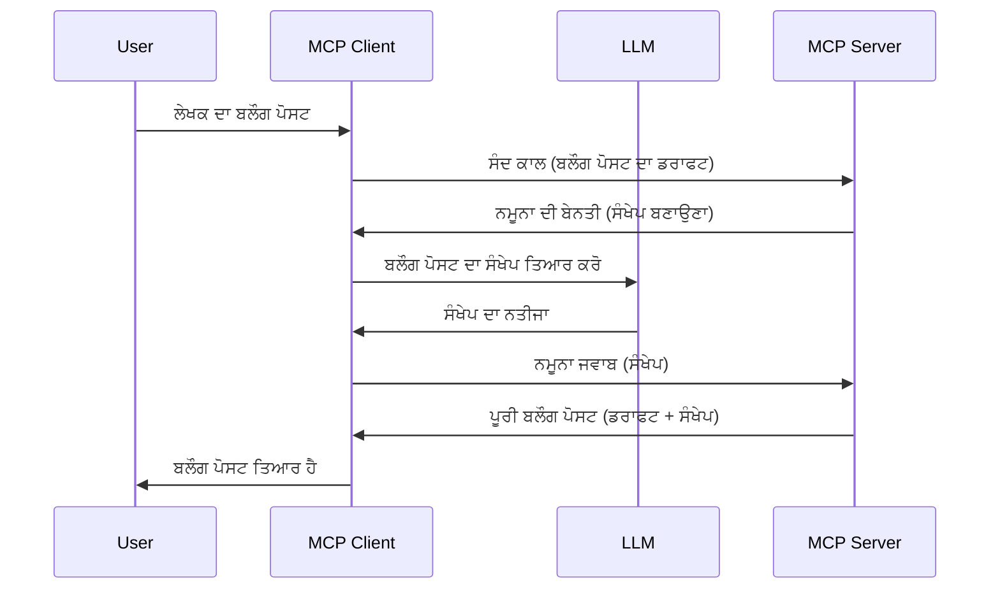

> [ਅਪਰੇਸ਼ਨਸ਼ੀਲ: 2026-07-28 ਰਿਲੀਜ਼ ਉਮੀਦਵਾਰ](https://blog.modelcontextprotocol.io/posts/2026-07-28-release-candidate/)

# ਸੈਂਪਲਿੰਗ - ਫੀਚਰਾਂ ਨੂੰ ਕਲਾਇੰਟ ਵੱਲ ਡੈਲੀਗੇਟ ਕਰਨਾ

> **ਅਪਰੇਸ਼ਨਸ਼ੀਲ ਨੋਟਿਸ:** `2026-07-28` MCP ਵਿਸ਼ੇਸ਼ਤਾ ਰਿਲੀਜ਼ ਉਮੀਦਵਾਰ ਸੈਂਪਲਿੰਗ ਨੂੰ LLM ਪ੍ਰਦਾਤਾ API ਨਾਲ ਸਿੱਧਾ ਇੰਟਿਗ੍ਰੇਸ਼ਨ ਦੇ ਹੱਕ ਵਿੱਚ ਅਪਰੇਸ਼ਨਸ਼ੀਲ ਵਜੋਂ ਨਿਸ਼ਾਨਜੋੜਦਾ ਹੈ। ਸੈਂਪਲਿੰਗ `2025-11-25` ਵਿੱਚ ਕੰਮ ਕਰਦਾ ਰਹੇਗਾ ਅਤੇ ਕਿਸੇ ਵੀ ਸਥਿਰ ਅਪਰੇਸ਼ਨਸ਼ੀਲ ਬਾਅਦ ਘੱਟੋ-ਘੱਟ ਇਕ ਸਾਲ ਲਈ ਕੰਮ ਕਰਦਾ ਰਹੇਗਾ, ਇਸ ਲਈ ਇਸ ਪਾਠ ਵਿਚ ਸਾਰਾ ਕੁਝ ਵੈਧ ਰਹਿੰਦਾ ਹੈ — ਪਰ ਨਵੇਂ ਸਰਵਰ ਡਿਜ਼ਾਈਨਜ਼ ਨੂੰ ਬਦਲੀ ਵਾਲੇ ਪੈਟਰਨ ਦਾ ਮੁਲਾਂਕਣ ਕਰਨਾ ਚਾਹੀਦਾ ਹੈ। ਦੇਖੋ [MCP ਵਿੱਚ ਕੀ ਬਦਲ ਰਿਹਾ ਹੈ: 2026-07-28 ਰਿਲੀਜ਼ ਉਮੀਦਵਾਰ](../../01-CoreConcepts/mcp-2026-07-28-release-candidate.md)।

ਕਈ ਵਾਰ, ਤੁਹਾਨੂੰ MCP ਕਲਾਇੰਟ ਅਤੇ MCP ਸਰਵਰ ਨੂੰ ਸਾਂਝੇ ਲਕੜੇ ਨੂੰ ਪ੍ਰਾਪਤ ਕਰਨ ਲਈ ਇਕੱਠੇ ਕੰਮ ਕਰਨ ਦੀ ਜ਼ਰੂਰਤ ਹੁੰਦੀ ਹੈ। ਹੋ ਸਕਦਾ ਹੈ ਕਿ ਤੁਹਾਡੇ ਕੋਲ ਐਸਾ ਮਾਮਲਾ ਹੋਵੇ ਜਿੱਥੇ ਸਰਵਰ ਨੂੰ ਕਿਸੇ LLM ਦੀ ਲੋੜ ਹੋਵੇ ਜੋ ਕਲਾਇੰਟ ਤੇ ਹੁੰਦਾ ਹੈ। ਇਸ ਸਥਿਤੀ ਲਈ, ਸੈਂਪਲਿੰਗ ਤੁਹਾਨੂੰ ਵਰਤਣੀ ਚਾਹੀਦੀ ਹੈ।

ਆਓ ਕੁਝ ਵਰਤੋਂ ਦੇ ਮਾਮਲੇ ਵੇਖੀਏ ਅਤੇ ਕਿਵੇਂ ਸੈਂਪਲਿੰਗ ਸ਼ਾਮਲ ਕਰਨ ਵਾਲਾ ਹੱਲ ਬਣਾਇਆ ਜਾ ਸਕਦਾ ਹੈ।

## ਝਲਕ

ਇਸ ਪਾਠ ਵਿੱਚ, ਅਸੀਂ ਦੱਸਦੇ ਹਾਂ ਕਿ ਕਦੋਂ ਅਤੇ ਕਿੱਥੇ ਸੈਂਪਲਿੰਗ ਦਾ ਇਸਤੇਮਾਲ ਕਰਨਾ ਹੈ ਅਤੇ ਇਸ ਨੂੰ ਕਿਵੇਂ ਸੰਰਚਿਤ ਕਰਨਾ ਹੈ।

## ਸਿੱਖਣ ਦੇ ਲੱਖੜੇ

ਇਸ ਅਧਿਆਇ ਵਿੱਚ, ਅਸੀਂ:

- ਸੈਂਪਲਿੰਗ ਕੀ ਹੈ ਅਤੇ ਕਦੋਂ ਇਸਦਾ ਇਸਤੇਮਾਲ ਕਰਨਾ ਹੈ, ਵਿਆਖਿਆ ਕਰਾਂਗੇ।
- MCP ਵਿੱਚ ਸੈਂਪਲਿੰਗ ਨੂੰ ਕਿਵੇਂ ਸੰਰਚਿਤ ਕਰਨਾ ਹੈ, ਦਿਖਾਵਾਂਗੇ।
- ਸੈਂਪਲਿੰਗ ਦੇ ਕਾਰਜਾਂ ਦੇ ਉਦਾਹਰਨ ਦਿਓਂਗੇ।

## ਸੈਂਪਲਿੰਗ ਕੀ ਹੈ ਅਤੇ ਇਸਦਾ ਇਸਤੇਮਾਲ ਕਿਉਂ?

ਸੈਂਪਲਿੰਗ ਇੱਕ ਅਡਵਾਂਸ ਫੀਚਰ ਹੈ ਜੋ ਹੇਠਾਂ ਦਿੱਤੇ ਤਰੀਕੇ ਨਾਲ ਕੰਮ ਕਰਦਾ ਹੈ:



### ਸੈਂਪਲਿੰਗ ਬੇਨਤੀ

ਠੀਕ ਹੈ, ਹੁਣ ਸਾਡੇ ਕੋਲ ਯਕੀਨੀ ਮਾਮਲੇ ਦੀ ਇੱਕ ਉੱਚੇ ਪੱਧਰ ਦੀ ਝਲਕ ਹੈ, ਆਓ ਸਰਵਰ ਵੱਲੋਂ ਕਲਾਇੰਟ ਨੂੰ ਭੇਜੀ ਜਾ ਰਹੀ ਸੈਂਪਲਿੰਗ ਦੀ ਬੇਨਤੀ ਬਾਰੇ ਗੱਲ ਕਰੀਏ। ਇਹ ਜੇ(JSON-RPC) ਫਾਰਮੈਟ ਵਿੱਚ ਇਸ ਤਰ੍ਹਾਂ ਹੋ ਸਕਦੀ ਹੈ:

```json
{
  "jsonrpc": "2.0",
  "id": 1,
  "method": "sampling/createMessage",
  "params": {
    "messages": [
      {
        "role": "user",
        "content": {
          "type": "text",
          "text": "Create a blog post summary of the following blog post: <BLOG POST>"
        }
      }
    ],
    "modelPreferences": {
      "hints": [
        {
          "name": "claude-3-sonnet"
        }
      ],
      "intelligencePriority": 0.8,
      "speedPriority": 0.5
    },
    "systemPrompt": "You are a helpful assistant.",
    "maxTokens": 100
  }
}
```

ਇੱਥੇ ਕੁਝ ਗੱਲਾਂ ਹਨ ਜੋ ਸੂਚਿਤ ਕਰਨ ਯੋਗ ਹਨ:

- ਪ੍ਰੰਪਟ, ਜੋ content -> text ਹਿੱਸੇ ਹੇਠਾਂ ਹੈ, ਉਹ ਸਾਡਾ ਉਸ ਹੁਕਮ ਹੈ ਜੋ LLM ਨੂੰ ਬਲੌਗ ਪੋਸਟ ਸਮਗਰੀ ਦਾ ਸਾਰ ਬਣਾਉਣ ਲਈ ਹੈ।

- **modelPreferences**. ਇਹ ਸੈਕਸ਼ਨ ਸਿਰਫ ਇਹ ਦਰਸਾਉਂਦਾ ਹੈ ਕਿ LLM ਨਾਲ ਕਿਹੜੀ ਸੰਰਚਨਾ ਇਸਤੇਮਾਲ ਕਰਨੀ ਚਾਹੀਦੀ ਹੈ। ਯੂਜ਼ਰ ਇਹ ਫੈਸਲਾ ਕਰ ਸਕਦਾ ਹੈ ਕਿ ਉਹ ਇਨ੍ਹਾਂ ਸਿਫਾਰਸ਼ਾਂ ਨੂੰ ਮੰਨਦਾ ਹੈ ਜਾਂ ਬਦਲਦਾ ਹੈ। ਇਸ ਵਿਚ ਮਾਡਲ, ਤੇਜ਼ੀ ਅਤੇ ਬੁੱਧੀਮਾਨਤਾ ਪ੍ਰਾਥਮਿਕਤਾ ਦੇ ਸਿਫਾਰਸ਼ਾਂ ਹਨ।
- **systemPrompt**, ਇਹ ਤੁਹਾਡਾ ਸਧਾਰਣ ਸਿਸਟਮ ਪ੍ਰੰਪਟ ਹੈ ਜੋ ਤੁਹਾਡੇ LLM ਨੂੰ ਇੱਕ ਜਾਦੂਈ ਵਿਅਕਤੀਗਤਤਾ ਦਿੰਦਾ ਹੈ ਅਤੇ ਮਾਰਗਦਰਸ਼ਕ ਨਿਰਦੇਸ਼ ਸ਼ਾਮਲ ਹੁੰਦੇ ਹਨ।
- **maxTokens**, ਇਹ ਇੱਕ ਹੋਰ ਗੁਣ ਹੈ ਜੋ ਦੱਸਦਾ ਹੈ ਕਿ ਇਸ ਕੰਮ ਲਈ ਕਿੰਨੇ ਟੋਕਨ ਵਰਤਣ ਦੀ ਸਿਫਾਰਸ਼ ਕੀਤੀ ਗਈ ਹੈ।

### ਸੈਂਪਲਿੰਗ ਜਵਾਬ

ਇਹ ਜਵਾਬ ਹੈ ਜੋ MCP ਕਲਾਇੰਟ MCP ਸਰਵਰ ਨੂੰ ਭੇਜਦਾ ਹੈ ਅਤੇ ਇਹ ਗਾਹਕ ਵੱਲੋਂ LLM ਨੂੰ ਕਾਲ ਕਰਨ, ਉਸ ਜਵਾਬ ਦੀ ਉਡੀਕ ਕਰਨ ਅਤੇ ਫਿਰ ਇਹ ਸੁਨੇਹਾ ਬਣਾਉਣ ਦਾ ਨਤੀਜਾ ਹੈ। JSON-RPC ਵਿੱਚ ਇਹ ਇਸ ਤਰ੍ਹਾਂ ਹੋ ਸਕਦਾ ਹੈ:

```json
{
  "jsonrpc": "2.0",
  "id": 1,
  "result": {
    "role": "assistant",
    "content": {
      "type": "text",
      "text": "Here's your abstract <ABSTRACT>"
    },
    "model": "gpt-5",
    "stopReason": "endTurn"
  }
}
```

ਧਿਆਨ ਦਿਉ ਕਿ ਜਵਾਬ ਬਲੌਗ ਪੋਸਟ ਦਾ ਸਾਰ ਹੈ ਜਿਵੇਂ ਅਸੀਂ ਮੰਗਿਆ ਸੀ। ਨਾਲ ਹੀ ਧਿਆਨ ਦਿਉ ਕਿ ਵਰਤਿਆ "model" ਉਸ ਮਾਡਲ ਤੋਂ ਵੱਖਰਾ ਹੈ ਜੋ ਅਸੀਂ ਮੰਗਿਆ ਸੀ, ਮਿਸਾਲ ਵਜੋਂ "gpt-5" ਨੂੰ "claude-3-sonnet" ਉੱਪਰ ਦਿਖਾਇਆ ਗਿਆ ਹੈ। ਇਹ ਦਰਸਾਉਂਦਾ ਹੈ ਕਿ ਯੂਜ਼ਰ ਆਪਣਾ ਫੈਸਲਾ ਬਦਲ ਸਕਦਾ ਹੈ ਅਤੇ ਤੁਹਾਡੀ ਸੈਂਪਲਿੰਗ ਬੇਨਤੀ ਸਿਫਾਰਸ਼ ਹੈ।

ਠੀਕ ਹੈ, ਹੁਣ ਜਦੋਂ ਅਸੀਂ ਮੁੱਖ ਪ੍ਰਵਾਹ ਨੂੰ ਸਮਝ ਚੁੱਕੇ ਹਾਂ, ਅਤੇ ਇਹ ਫਾਇਦੇਮੰਦ ਕਾਰਜ ਹੈ "ਬਲੌਗ ਪੋਸਟ ਬਣਾਉਣਾ + ਸਾਰ", ਆਓ ਦੇਖੀਏ ਕਿ ਇਸ ਨੂੰ ਕੰਮ ਕਰਨ ਲਈ ਕੀ ਕਰਨ ਦੀ ਲੋੜ ਹੈ।

### ਸੁਨੇਹਾ ਕਿਸਮਾਂ

ਸੈਂਪਲਿੰਗ ਸੁਨੇਹੇ ਸਿਰਫ ਟੈਕਸਟ ਤੱਕ ਸੀਮਿਤ ਨਹੀਂ ਹਨ ਬਲਕਿ ਤੁਸੀਂ ਤਸਵੀਰਾਂ ਅਤੇ ਆਡੀਓ ਵੀ ਭੇਜ ਸਕਦੇ ਹੋ। JSON-RPC ਹੇਠਾਂ ਦਿੱਤੇ ਤਰੀਕੇ ਨਾਲ ਵੱਖਰਾ ਦਿੱਸਦਾ ਹੈ:

**ਟੈਕਸਟ**

```json
{
  "type": "text",
  "text": "The message content"
}
```

**ਤਸਵੀਰ ਸਮੱਗਰੀ**

```json
{
  "type": "image",
  "data": "base64-encoded-image-data",
  "mimeType": "image/jpeg"
}
```

**ਆਡੀਓ ਸਮੱਗਰੀ**

```json
{
  "type": "audio",
  "data": "base64-encoded-audio-data",
  "mimeType": "audio/wav"
}
```

> ਨੋਟ: ਸੈਂਪਲਿੰਗ ਬਾਰੇ ਹੋਰ ਵਿਸਥਾਰ ਨਾਲ ਜਾਣਕਾਰੀ ਲਈ, [ਅਧਿਕਾਰਿਕ ਦਸਤਾਵੇਜ਼](https://modelcontextprotocol.io/specification/2025-11-25/client/sampling) ਵੇਖੋ

## ਕਲਾਇੰਟ ਵਿੱਚ ਸੈਂਪਲਿੰਗ ਕਿਵੇਂ ਸੰਰਚਿਤ ਕਰੀਏ

> ਨੋਟ: ਜੇ ਤੁਸੀਂ ਸਿਰਫ ਸਰਵਰ ਬਣਾ ਰਹੇ ਹੋ, ਤਾਂ ਤੁਹਾਨੂੰ ਇੱਥੇ ਜ਼ਿਆਦਾ ਕੁਝ ਕਰਨ ਦੀ ਲੋੜ ਨਹੀਂ ਹੈ।

ਇੱਕ ਕਲਾਇੰਟ ਵਿੱਚ, ਤੁਹਾਨੂੰ ਹੇਠਾਂ ਦਿੱਤਾ ਫੀਚਰ ਇਸ ਤਰ੍ਹਾਂ ਨਿਰਧਾਰਤ ਕਰਨਾ ਪਵੇਗਾ:

```json
{
  "capabilities": {
    "sampling": {}
  }
}
```

ਇਹ ਫਿਰ ਉਹ ਸਮਾਂ ਕਲਾਇੰਟ ਤੁਹਾਡੇ ਚੁਣੇ ਸਰਵਰ ਨਾਲ ਸ਼ੁਰੂ ਹੋਣ ਸਮੇਂ ਲਏਗਾ।

## ਸੈਂਪਲਿੰਗ ਦਾ ਕਾਰਜ ਉਦਾਹਰਨ - ਬਲੌਗ ਪੋਸਟ ਬਣਾਉਣਾ

ਆਓ ਇਕੱਠੇ ਇੱਕ ਸੈਂਪਲਿੰਗ ਸਰਵਰ ਕੋਡ ਕਰੀਏ, ਸਾਨੂੰ ਇਹ ਕਰਨ ਦੀ ਜ਼ਰੂਰਤ ਹੈ:

1. ਸਰਵਰ 'ਤੇ ਇੱਕ ਟੂਲ ਬਣਾਓ।
1. ਆਖਿਆ ਟੂਲ ਨੂੰ ਇੱਕ ਸੈਂਪਲਿੰਗ ਬੇਨਤੀ ਬਣਾਉਣੀ ਚਾਹੀਦੀ ਹੈ
1. ਟੂਲ ਨੂੰ ਕਲਾਇੰਟ ਦੀ ਸੈਂਪਲਿੰਗ ਬੇਨਤੀ ਦੇ ਜਵਾਬ ਦੀ ਉਡੀਕ ਕਰਨੀ ਚਾਹੀਦੀ ਹੈ।
1. ਫਿਰ ਟੂਲ ਨਤੀਜਾ ਤਿਆਰ ਕਰਨਾ ਚਾਹੀਦਾ ਹੈ।

ਆਓ ਕਦਮ-ਦਰ-কਦਮ ਕੋਡ ਵੇਖੀਏ:

### -1- ਟੂਲ ਬਣਾਓ

**python**

```python
@mcp.tool()
async def create_blog(title: str, content: str, ctx: Context[ServerSession, None]) -> str:
    """Create a blog post and generate a summary"""

```

### -2- ਸੈਂਪਲਿੰਗ ਬੇਨਤੀ ਬਣਾਓ

ਟੂਲ ਨੂੰ ਹੇਠਾਂ ਦਿੱਤਾ ਕੋਡ ਨਾਲ ਵਧਾਓ:

**python**

```python
post = BlogPost(
        id=len(posts) + 1,
        title=title,
        content=content,
        abstract=""
    )

prompt = f"Create an abstract of the following blog post: title: {title} and draft: {content} "

result = await ctx.session.create_message(
        messages=[
            SamplingMessage(
                role="user",
                content=TextContent(type="text", text=prompt),
            )
        ],
        max_tokens=100,
)

```

### -3- ਜਵਾਬ ਦੀ ਉਡੀਕ ਕਰੋ ਅਤੇ ਜਵਾਬ ਵਾਪਸ ਦਿਓ

**python**

```python
post.abstract = result.content.text

posts.append(post)

# ਪੂਰਾ ਉਤਪਾਦ ਵਾਪਸ ਕਰੋ
return json.dumps({
    "id": post.title,
    "abstract": post.abstract
})
```

### -4- ਪੂਰਾ ਕੋਡ

**python**

```python
from starlette.applications import Starlette
from starlette.routing import Mount, Host

from mcp.server.fastmcp import Context, FastMCP

from mcp.server.session import ServerSession
from mcp.types import SamplingMessage, TextContent

import json


from uuid import uuid4
from typing import List
from pydantic import BaseModel


mcp = FastMCP("Blog post generator")

# app = FastAPI()

posts = []

class BlogPost(BaseModel):
    id: int
    title: str
    content: str
    abstract: str

posts: List[BlogPost] = []

@mcp.tool()
async def create_blog(title: str, content: str, ctx: Context[ServerSession, None]) -> str:
    """Create a blog post and generate a summary"""

    post = BlogPost(
        id=len(posts) + 1,
        title=title,
        content=content,
        abstract=""
    )

    prompt = f"Create an abstract of the following blog post: title: {title} and draft: {content} "

    result = await ctx.session.create_message(
        messages=[
            SamplingMessage(
                role="user",
                content=TextContent(type="text", text=prompt),
            )
        ],
        max_tokens=100,
    )

    post.abstract = result.content.text

    posts.append(post)

    # ਪੂਰਾ ਬਲੋਗ ਪੋਸਟ ਵਾਪਸ ਕਰੋ
    return json.dumps({
        "id": post.title,
        "abstract": post.abstract
    })

if __name__ == "__main__":
    print("Starting server...")
    # mcp.run()
    mcp.run(transport="streamable-http")

# ਐਪ ਚਲਾਓ: python server.py
```

### -5- Visual Studio Code ਵਿੱਚ ਇਸ ਦੀ ਜਾਂਚ

Visual Studio Code ਵਿੱਚ ਇਸ ਦੀ ਜਾਂਚ ਕਰਨ ਲਈ, ਹੇਠਾਂ ਦਿੱਤਾ ਤਰੀਕਾ ਅਪਣਾਓ:

1. ਟਰਮੀਨਲ ਵਿਚ ਸਰਵਰ ਸ਼ੁਰੂ ਕਰੋ
1. ਇਸ ਨੂੰ *mcp.json* ਵਿੱਚ ਸ਼ਾਮਿਲ ਕਰੋ (ਅਤੇ ਯਕੀਨੀ ਬਣਾਓ ਕਿ ਇਹ ਸ਼ੁਰੂ ਹੋਇਆ ਹੈ) ਉਦਾਹਰਨ ਲਈ ਚੀਜਾਂ ਇਸ ਤਰ੍ਹਾਂ:

   ```json
   "servers": {
      "blog-server": {
        "type": "http",
        "url": "http://localhost:8000/mcp"
      }
   }
   ```

1. ਇੱਕ ਪ੍ਰੰਪਟ ਟਾਈਪ ਕਰੋ:

   ```text
   create a blog post named "Where Python comes from", the content is "Python is actually named after Monty Python Flying Circus"
   ```

1. ਸੈਂਪਲਿੰਗ ਹੋਣ ਦਿਓ। ਪਹਿਲੀ ਵਾਰੀ ਤੁਸੀਂ ਇਸ ਦੀ ਜਾਂਚ ਕਰੋਗੇ ਤਾਂ ਤੁਹਾਨੂੰ ਇੱਕ ਵਾਧੂ ਡਾਇਲਾਗਲ ਦੇਖਣ ਨੂੰ ਮਿਲੇਗਾ ਜਿਹੜਾ ਤੁਹਾਨੂੰ ਸਵੀਕਾਰ ਕਰਨਾ ਪਵੇਗਾ, ਫਿਰ ਤੁਸੀਂ ਸਮਾਨਕ ਡਾਇਲਾਗਗਲ ਦੇਖੋਗੇ ਜੋ ਤੁਹਾਨੂੰ ਟੂਲ ਚਲਾਉਣ ਲਈ ਪੂੱਛੇਗਾ

1. ਨਤੀਜੇ ਨਿਰੀਖਣ ਕਰੋ। ਤੁਸੀਂ ਨਤੀਜੇ GitHub Copilot ਚੈਟ ਵਿੱਚ ਸੁੰਦਰ ਤਰੀਕੇ ਨਾਲ ਰੇਂਡਰ ਕੀਤੇ ਹੋਏ ਦੇਖੋਗੇ ਪਰ ਤੁਸੀਂ ਰਾ JSON ਜਵਾਬ ਵੀ ਨਿਰੀਖ ਸਕਦੇ ਹੋ।

**ਬੋਨਸ**. Visual Studio Code ਟੂਲਿੰਗ ਸੈਂਪਲਿੰਗ ਲਈ ਬਹੁਤ ਵਧੀਆ ਸਹਾਇਤਾ ਰੱਖਦੀ ਹੈ। ਤੁਸੀਂ ਆਪਣੇ ਇੰਸਟਾਲਡ ਸਰਵਰ 'ਤੇ ਸੈਂਪਲਿੰਗ ਪਹੁੰਚ ਨੂੰ ਇਸ ਤਰ੍ਹਾਂ ਸੰਰਚਿਤ ਕਰ ਸਕਦੇ ਹੋ:

1. ਐਕਸਟੈਂਸ਼ਨ ਸੈਕਸ਼ਨ 'ਤੇ ਜਾਓ।
1. "MCP SERVERS - INSTALLED" ਸੈਕਸ਼ਨ ਵਿੱਚ ਆਪਣੇ ਇੰਸਟਾਲਡ ਸਰਵਰ ਲਈ ਕਾਗ ਆਇਕਾਨ ਚੁਣੋ।
1 "Configure Model Access" ਚੁਣੋ, ਇਸ ਥਾਂ ਤੁਸੀਂ ਚੁਣ ਸਕਦੇ ਹੋ ਕਿ GitHub Copilot ਨੂੰ ਸੈਂਪਲਿੰਗ ਕਰਨ ਵੇਲੇ ਕਿਹੜੇ ਮਾਡਲ ਵਰਤਣ ਦੀ ਆਗਿਆ ਹੈ। ਤੁਸੀਂ ਹਾਲ ਹੀ ਵਿੱਚ ਹੋਈਆਂ ਸਾਰੀ ਸੈਂਪਲਿੰਗ ਬੇਨਤੀਆਂ ਵੀ ਵੇਖ ਸਕਦੇ ਹੋ "Show Sampling requests" ਚੁਣ ਕੇ।

## ਆਪਣਾ ਕੰਮ

ਇਸ ਕੰਮ ਵਿੱਚ, ਤੁਸੀਂ ਥੋੜ੍ਹਾ ਵੱਖਰਾ ਸੈਂਪਲਿੰਗ ਇੰਟੀਗ੍ਰੇਸ਼ਨ ਬਣਾਉਣੇ ਹੋ ਜੇੜਾ ਉਤਪਾਦ ਵਰਣਨ ਤਿਆਰ ਕਰਨ ਨੂੰ ਸਮਰਥਨ ਦਿੰਦਾ ਹੈ। ਤੁਹਾਡਾ ਮਾਮਲਾ ਹੇਠਾਂ ਹੈ:

**ਮਾਮਲਾ**: ਇੱਕ ਈ-ਕਾਮਰਸ ਦੀ ਬੈਕ ਆਫਿਸ ਵਰਕਰ ਨੂੰ ਮਦਦ ਦੀ ਲੋੜ ਹੈ, ਉਤਪਾਦ ਵਰਣਨ ਬਣਾਉਣ ਲਈ ਬਹੁਤ ਸਾਰਾ ਸਮਾਂ ਲੱਗਦਾ ਹੈ। ਇਸ ਲਈ, ਤੁਸੀਂ ਇੱਕ ਹੱਲ ਬਣਾਉਣਾ ਹੈ ਜਿੱਥੇ ਤੁਸੀਂ "create_product" ਨਾਮਕ ਟੂਲ ਨੂੰ "title" ਅਤੇ "keywords" ਦਲੀਲਾਂ ਸਹਿਤ ਕਾਲ ਕਰ ਸਕੋ ਅਤੇ ਇਹ ਪੂਰਾ ਉਤਪਾਦ ਤਿਆਰ ਕਰੇ ਜਿਸ ਵਿੱਚ "description" ਸਥਾਨ ਖਾਲੀ ਹੋਵੇ ਜੋ ਕਲਾਇੰਟ ਦੇ LLM ਵੱਲੋਂ ਭਰਿਆ ਜਾਵੇ।

ਟਿਪ: ਪਹਿਲਾਂ ਜੋ ਤੁਹਾਡੇ ਨੇ ਸਿੱਖਿਆ ਹੈ ਉਸ ਦਾ ਇਸਤੇਮਾਲ ਕਰੋ ਇਸ ਸਰਵਰ ਅਤੇ ਇਸਦਾ ਟੂਲ ਸੈਂਪਲਿੰਗ ਬੇਨਤੀ ਵਰਤ ਕੇ ਬਣਾਉਣ ਲਈ।

## ਹੱਲ

[Solution](./solution/README.md)

## ਮੁੱਖ ਸਿੱਖਿਆ ਗਈਆਂ ਗੱਲਾਂ

ਸੈਂਪਲਿੰਗ ਇੱਕ ਸ਼ਕਤੀਸ਼ਾਲੀ ਫੀਚਰ ਹੈ ਜੋ ਸਰਵਰ ਨੂੰ ਕਲਾਇੰਟ ਦੇ ਸਹਿਯੋਗ ਨਾਲ ਤਾਸਕ ਸੌਂਪਣ ਦੀ ਆਗਿਆ ਦਿੰਦਾ ਹੈ ਜਦੋਂ ਉਸਨੂੰ ਕਿਸੇ LLM ਦੀ ਮਦਦ ਦੀ ਲੋੜ ਹੁੰਦੀ ਹੈ।

## ਅੱਗੇ ਕੀ ਹੈ

- [ਅਧਿਆਇ 4 - ਪ੍ਰਯੋਗਿਕ ਲਾਗੂ ਕਰਨਾ](../../04-PracticalImplementation/README.md)

---

<!-- CO-OP TRANSLATOR DISCLAIMER START -->
**ਅਸਵੀਕਾਰੋਪਣ**:
ਇਸ ਦਸਤਾਵੇਜ਼ ਦਾ ਅਨੁਵਾਦ ਏਆਈ ਅਨੁਵਾਦ ਸੇਵਾ [Co-op Translator](https://github.com/Azure/co-op-translator) ਦੀ ਵਰਤੋਂ ਕਰਕੇ ਕੀਤਾ ਗਿਆ ਹੈ। ਜਦੋਂ ਕਿ ਅਸੀਂ ਸਹੀਤਾਵਾਂ ਲਈ ਯਤਨਸ਼ੀਲ ਹਾਂ, ਕਿਰਪਾ ਕਰਕੇ ਧਿਆਨ ਰੱਖੋ ਕਿ ਸਵੈਚਾਲਿਤ ਅਨੁਵਾਦਾਂ ਵਿੱਚ ਗਲਤੀਆਂ ਜਾਂ ਅਸਮੱਤਿਆਵਾਂ ਹੋ ਸਕਦੀਆਂ ਹਨ। ਮੂਲ ਦਸਤਾਵੇਜ਼ ਆਪਣੀ ਮੂਲ ਭਾਸ਼ਾ ਵਿੱਚ ਅਧਿਕਾਰਕ ਸਰੋਤ ਮੰਨਿਆ ਜਾਣਾ ਚਾਹੀਦਾ ਹੈ। ਜਰੂਰੀ ਜਾਣਕਾਰੀ ਲਈ, ਪੇਸ਼ੇਵਰ ਮਨੁੱਖੀ ਅਨੁਵਾਦ ਦੀ ਸਿਫ਼ਾਰਸ਼ ਕੀਤੀ ਜਾਂਦੀ ਹੈ। ਅਸੀਂ ਇਸ ਅਨੁਵਾਦ ਦੇ ਉਪਯੋਗ ਤੋਂ ਪੈਦਾ ਹੋਣ ਵਾਲੀਆਂ ਕਿਸੇ ਵੀ ਗਲਤਫਹਿਮੀਆਂ ਜਾਂ ਗਲਤ ਵਿਆਖਿਆਵਾਂ ਲਈ ਜਵਾਬਦੇਹ ਨਹੀਂ ਹਾਂ।
<!-- CO-OP TRANSLATOR DISCLAIMER END -->