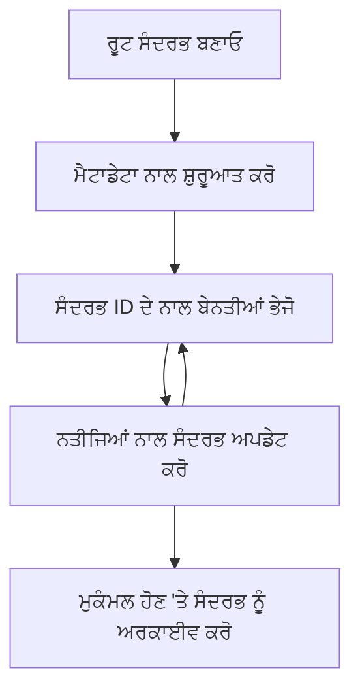

> [ਪੁਰਾਣਾ ਹੋ ਚੁੱਕਾ: 2026-07-28 ਰਿਲੀਜ਼ ਉਮੀਦਵਾਰ](https://blog.modelcontextprotocol.io/posts/2026-07-28-release-candidate/#roots-sampling-and-logging-are-deprecated)

# MCP ਰੂਟ ਕਾਂਟੈਕਸਟ

> **ਪੁਰਾਣੇ ਹੋਣ ਦੀ ਸੂਚਨਾ:** `2026-07-28` MCP ਵਿਸ਼ੇਸ਼ਤਾ ਰਿਲੀਜ਼ ਉਮੀਦਵਾਰ ਰੂਟ ਨੂੰ ਟੂਲ ਪੈਰਾਮੀਟਰਾਂ, ਸਰੋਤ URI, ਜਾਂ ਸਰਵਰ ਕਨਫਿਗਰੇਸ਼ਨ ਦੀ ਥਾਂ ਵਿੱਚ ਪੁਰਾਣਾ ਕਰ ਦਿੰਦਾ ਹੈ। ਰੂਟ `2025-11-25` ਵਿੱਚ ਕੰਮ ਕਰਦੇ ਰਹਿੰਦੇ ਹਨ ਅਤੇ ਕਿਸੇ ਵੀ ਰਸਮੀ ਪੁਰਾਣੇ ਹੋਣ ਤੋਂ ਘੱਟੋ-ਘੱਟ ਇੱਕ ਸਾਲ ਬਾਅਦ ਤਕ ਲਾਗੂ ਰਹਿੰਦੇ ਹਨ, ਇਸ ਲਈ ਇਸ ਸਬਕ ਵਿੱਚ ਸਭ ਕੁਝ ਵੈਧ ਰਹਿੰਦਾ ਹੈ - ਪਰ ਨਵੇਂ ਸਰਵਰ ਡਿਜ਼ਾਈਨ ਨੂੰ ਬਦਲਣ ਵਾਲੇ ਪੈਟਰਨ ਦਾ ਮੁਲਾਂਕਣ ਕਰਨਾ ਚਾਹੀਦਾ ਹੈ। ਵੇਖੋ [MCP ਵਿੱਚ ਕੀ ਬਦਲ ਰਿਹਾ ਹੈ: 2026-07-28 ਰਿਲੀਜ਼ ਉਮੀਦਵਾਰ](../../01-CoreConcepts/mcp-2026-07-28-release-candidate.md).

ਰੂਟ ਕਾਂਟੈਕਸਟ ਮਾਡਲ ਕਾਂਟੈਕਸਟ ਪ੍ਰੋਟੋਕੋਲ ਵਿੱਚ ਇਕ ਮੂਲਭੂਤ ਧਾਰਨਾ ਹਨ ਜੋ ਕਿ ਗੱਲਬਾਤ ਦੇ ਇਤਿਹਾਸ ਅਤੇ ਸਾਂਝੇ ઇહારો ਨੂੰ ਕਈ ਬੇਨਤੀਅਾਂ ਅਤੇ ਸੈਸ਼ਨਾਂ ਵਿੱਚ ਕਾਇਮ ਰੱਖਣ ਲਈ ਇੱਕ ਪੱਕੀ ਪਰਤ ਪ੍ਰਦਾਨ ਕਰਦੇ ਹਨ।

## ਜਾਣ-ਪਛਾਣ

ਇਸ ਸਬਕ ਵਿੱਚ, ਅਸੀਂ ਦੇਖਾਂਗੇ ਕਿ MCP ਵਿੱਚ ਰੂਟ ਕਾਂਟੈਕਸਟ ਕਿਵੇਂ ਬਣਾਏ, ਪ੍ਰਬੰਧਿਤ ਕੀਤੇ ਜਾਂਦੇ ਹਨ ਅਤੇ ਵਰਤੋਂ ਕੀਤੀ ਜਾਂਦੀ ਹੈ।

## ਸਿੱਖਣ ਦੇ ਉਦਦੇਸ਼

ਇਸ ਸਬਕ ਦੇ ਅੰਤ ਵਿੱਚ, ਤੁਸੀਂ ਸਮਰੱਥ ਹੋਵੋਗੇ:

- ਰੂਟ ਕਾਂਟੈਕਸਟ ਦੇ ਉਦੇਸ਼ ਅਤੇ ਸਰਚਨਾ ਨੂੰ ਸਮਝਣਾ
- MCP ਕਲਾਇੰਟ ਲਾਇਬ੍ਰੇਰੀਆਂ ਦੀ ਵਰਤੋਂ ਨਾਲ ਰੂਟ ਕਾਂਟੈਕਸਟ ਬਣਾਉਣਾ ਅਤੇ ਪ੍ਰਬੰਧਿਤ ਕਰਨਾ
- .NET, ਜਾਵਾ, ਜਾਵਾਸਕ੍ਰਿਪਟ ਅਤੇ ਪਾਇਥਨ ਐਪਲੀਕੇਸ਼ਨਾਂ ਵਿੱਚ ਰੂਟ ਕਾਂਟੈਕਸਟ ਲਾਗੂ ਕਰਨਾ
- ਬਹੁ-ਚੱਕਰ ਵਾਲੀਆਂ ਗੱਲਬਾਤਾਂ ਅਤੇ ਹਾਲਤ ਪ੍ਰਬੰਧਨ ਲਈ ਰੂਟ ਕਾਂਟੈਕਸਟ ਵਰਤਣਾ
- ਰੂਟ ਕਾਂਟੈਕਸਟ ਪ੍ਰਬੰਧਨ ਲਈ ਸਭ ਤੋਂ ਵਧੀਆ ਅਭਿਆਸ ਲਾਗੂ ਕਰਨਾ

## ਰੂਟ ਕਾਂਟੈਕਸਟ ਨੂੰ ਸਮਝਣਾ

ਰੂਟ ਕਾਂਟੈਕਸਟ ਓਹ ਹਿਸੇ ਹੁੰਦੇ ਹਨ ਜੋ ਕਈ ਸੰਬੰਧਤ ਇੰਟਰਐਕਸ਼ਨਾਂ ਦਾ ਇਤਿਹਾਸ ਅਤੇ ਹਾਲਤ ਰੱਖਦੇ ਹਨ। ਇਹ ਯੋਗ ਬਣਾਉਂਦੇ ਹਨ:

- **ਗੱਲਬਾਤ ਦੀ ਸਥਿਰਤਾ**: ਸੰਗਠਿਤ ਬਹੁ-ਚੱਕਰ ਗੱਲਬਾਤਾਂ ਨੂੰ ਕਾਇਮ ਰੱਖਣਾ
- **ਯਾਦاشت ਪ੍ਰਬੰਧਨ**: ਇੰਟਰਐਕਸ਼ਨਾਂ ਵਿੱਚ ਸੂਚਨਾ ਸੰਗ੍ਰਹਿਤ ਅਤੇ ਪਰਤ ਲੈਣਾ
- **ਹਾਲਤ ਪ੍ਰਬੰਧਨ**: ਜਟਿਲ ਕਾਰਜ ਪ੍ਰਵਾਹਾਂ ਵਿੱਚ ਪ੍ਰਗਟਿ ਦੀ ਨਿਗਰਾਨੀ
- **ਕਾਂਟੈਕਸਟ ਸਾਂਝਾ ਕਰਨਾ**: ਕਈ ਕਲਾਇੰਟਾਂ ਨੂੰ ਇੱਕੋ ਗੱਲਬਾਤ ਹਾਲਤ ਤੱਕ ਪਹੁੰਚ ਪ੍ਰਦਾਨ ਕਰਨਾ

MCP ਵਿੱਚ, ਰੂਟ ਕਾਂਟੈਕਸਟ ਦੇ ਇਹ ਮੁੱਖ ਵਿਸ਼ੇਸ਼ਤਾਵਾਂ ਹਨ:

- ਹਰ ਇੱਕ ਰੂਟ ਕਾਂਟੈਕਸਟ ਦਾ ਇਕ ਵਿਲੱਖਣ ਪਛਾਣਕ ਹੈ।
- ਇਹ ਗੱਲਬਾਤ ਇਤਿਹਾਸ, ਉਪਭੋਗਤਾ ਪਸੰਦਾਂ ਅਤੇ ਹੋਰ ਮੇਟਾਡਾਟਾ ਰੱਖ ਸਕਦੇ ਹਨ।
- ਜਰੂਰਤ ਅਨੁਸਾਰ ਬਣਾਏ, ਐਕਸੈੱਸ ਅਤੇ ਆਰਕਾਈਵ ਕੀਤੇ ਜਾ ਸਕਦੇ ਹਨ।
- ਇਹ ਸੁਖਮਾਂਸ਼ੀ ਐਕਸੈੱਸ ਕੰਟਰੋਲ ਅਤੇ ਅਧਿਕਾਰਾਂ ਦਾ ਸਮਰਥਨ ਕਰਦੇ ਹਨ।

## ਰੂਟ ਕਾਂਟੈਕਸਟ ਜੀਵਨ ਚਕਰ



## ਰੂਟ ਕਾਂਟੈਕਸਟ ਨਾਲ ਕੰਮ ਕਰਨਾ

ਇੱਥੇ ਇੱਕ ਉਦਾਹਰਣ ਦਿੱਤੀ ਗਈ ਹੈ ਕਿ ਰੂਟ ਕਾਂਟੈਕਸਟ ਕਿਵੇਂ ਬਣਾਏ ਅਤੇ ਪ੍ਰਬੰਧਿਤ ਕੀਤੇ ਜਾਂਦੇ ਹਨ।

### C# ਲਾਗੂ ਕਰਨਾ

```csharp
// .NET Example: Root Context Management
using Microsoft.Mcp.Client;
using System;
using System.Threading.Tasks;
using System.Collections.Generic;

public class RootContextExample
{
    private readonly IMcpClient _client;
    private readonly IRootContextManager _contextManager;
    
    public RootContextExample(IMcpClient client, IRootContextManager contextManager)
    {
        _client = client;
        _contextManager = contextManager;
    }
    
    public async Task DemonstrateRootContextAsync()
    {
        // 1. Create a new root context
        var contextResult = await _contextManager.CreateRootContextAsync(new RootContextCreateOptions
        {
            Name = "Customer Support Session",
            Metadata = new Dictionary<string, string>
            {
                ["CustomerName"] = "Acme Corporation",
                ["PriorityLevel"] = "High",
                ["Domain"] = "Cloud Services"
            }
        });
        
        string contextId = contextResult.ContextId;
        Console.WriteLine($"Created root context with ID: {contextId}");
        
        // 2. First interaction using the context
        var response1 = await _client.SendPromptAsync(
            "I'm having issues scaling my web service deployment in the cloud.", 
            new SendPromptOptions { RootContextId = contextId }
        );
        
        Console.WriteLine($"First response: {response1.GeneratedText}");
        
        // Second interaction - the model will have access to the previous conversation
        var response2 = await _client.SendPromptAsync(
            "Yes, we're using containerized deployments with Kubernetes.", 
            new SendPromptOptions { RootContextId = contextId }
        );
        
        Console.WriteLine($"Second response: {response2.GeneratedText}");
        
        // 3. Add metadata to the context based on conversation
        await _contextManager.UpdateContextMetadataAsync(contextId, new Dictionary<string, string>
        {
            ["TechnicalEnvironment"] = "Kubernetes",
            ["IssueType"] = "Scaling"
        });
        
        // 4. Get context information
        var contextInfo = await _contextManager.GetRootContextInfoAsync(contextId);
        
        Console.WriteLine("Context Information:");
        Console.WriteLine($"- Name: {contextInfo.Name}");
        Console.WriteLine($"- Created: {contextInfo.CreatedAt}");
        Console.WriteLine($"- Messages: {contextInfo.MessageCount}");
        
        // 5. When the conversation is complete, archive the context
        await _contextManager.ArchiveRootContextAsync(contextId);
        Console.WriteLine($"Archived context {contextId}");
    }
}
```

ਉਸ ਕੋਡ ਵਿੱਚ ਅਸੀਂ:

1. ਗਾਹਕ ਸਮਰਥਨ ਸੈਸ਼ਨ ਲਈ ਇੱਕ ਰੂਟ ਕਾਂਟੈਕਸਟ ਬਣਾਇਆ।
1. ਉਸ ਕਾਂਟੈਕਸਟ ਵਿੱਚ ਕਈ ਸਨੇਹੇ ਭੇਜੇ, ਜਿਸ ਨਾਲ ਮਾਡਲ ਹਾਲਤ ਕਾਇਮ ਰੱਖ ਸਕਿਆ।
1. ਗੱਲਬਾਤ ਦੇ ਅਧਾਰ 'ਤੇ ਸੰਬੰਧਤ ਮੇਟਾਡਾਟਾ ਨਾਲ ਕਾਂਟੈਕਸਟ ਨੂੰ ਅਪਡੇਟ ਕੀਤਾ।
1. ਗੱਲਬਾਤ ਇਤਿਹਾਸ ਨੂੰ ਸਮਝਣ ਲਈ ਕਾਂਟੈਕਸਟ ਜਾਣਕਾਰੀ ਪ੍ਰਾਪਤ ਕੀਤੀ।
1. ਗੱਲਬਾਤ ਸਥਿਤੀ ਪੂਰੀ ਹੋਣ 'ਤੇ ਕਾਂਟੈਕਸਟ ਨੂੰ ਆਰਕਾਈਵ ਕੀਤਾ।

## ਉਦਾਹਰਣ: ਵਿੱਤੀ ਵਿਸ਼ਲੇਸ਼ਣ ਲਈ ਰੂਟ ਕਾਂਟੈਕਸਟ ਅਮਲੀਕਰਨ

ਇਸ ਉਦਾਹਰਣ ਵਿੱਚ, ਅਸੀਂ ਵਿੱਤੀ ਵਿਸ਼ਲੇਸ਼ਣ ਸੈਸ਼ਨ ਲਈ ਰੂਟ ਕਾਂਟੈਕਸਟ ਬਣਾਵਾਂਗੇ, ਜੋ ਕਈ ਇੰਟਰਐਕਸ਼ਨਾਂ ਵਿੱਚ ਹਾਲਤ ਕਾਇਮ ਕਰਨ ਦਾ ਪ੍ਰਦਰਸ਼ਨ ਕਰਦਾ ਹੈ।

### ਜਾਵਾ ਲਾਗੂ ਕਰਨਾ

```java
// ਜਾਵਾ ਉਦਾਹਰਣ: ਰੂਟ ਸੰਦਰਭ ਅਮਲਦਾਰੀ
package com.example.mcp.contexts;

import com.mcp.client.McpClient;
import com.mcp.client.ContextManager;
import com.mcp.models.RootContext;
import com.mcp.models.McpResponse;

import java.util.HashMap;
import java.util.Map;
import java.util.UUID;

public class RootContextsDemo {
    private final McpClient client;
    private final ContextManager contextManager;
    
    public RootContextsDemo(String serverUrl) {
        this.client = new McpClient.Builder()
            .setServerUrl(serverUrl)
            .build();
            
        this.contextManager = new ContextManager(client);
    }
    
    public void demonstrateRootContext() throws Exception {
        // ਸੰਦਰਭ ਮੈਟਾਡੇਟਾ ਬਣਾਓ
        Map<String, String> metadata = new HashMap<>();
        metadata.put("projectName", "Financial Analysis");
        metadata.put("userRole", "Financial Analyst");
        metadata.put("dataSource", "Q1 2025 Financial Reports");
        
        // 1. ਇੱਕ ਨਵਾਂ ਰੂਟ ਸੰਦਰਭ ਬਣਾਓ
        RootContext context = contextManager.createRootContext("Financial Analysis Session", metadata);
        String contextId = context.getId();
        
        System.out.println("Created context: " + contextId);
        
        // 2. ਪਹਿਲੀ ਪਰਸਪਰਕਿਰਿਆ
        McpResponse response1 = client.sendPrompt(
            "Analyze the trends in Q1 financial data for our technology division",
            contextId
        );
        
        System.out.println("First response: " + response1.getGeneratedText());
        
        // 3. ਪ੍ਰਤਿਕਿਰਿਆ ਤੋਂ ਪ੍ਰਾਪਤ ਮਹੱਤਵਪੂਰਣ ਜਾਣਕਾਰੀ ਨਾਲ ਸੰਦਰਭ ਨੂੰ ਅਪਡੇਟ ਕਰੋ
        contextManager.addContextMetadata(contextId, 
            Map.of("identifiedTrend", "Increasing cloud infrastructure costs"));
        
        // ਦੂਜੀ ਪਰਸਪਰਕਿਰਿਆ - ਉਸੇ ਸੰਦਰਭ ਦੀ ਵਰਤੋਂ ਕਰਦੇ ਹੋਏ
        McpResponse response2 = client.sendPrompt(
            "What's driving the increase in cloud infrastructure costs?",
            contextId
        );
        
        System.out.println("Second response: " + response2.getGeneratedText());
        
        // 4. ਵਿਸ਼ਲੇਸ਼ਣ ਸੈਸ਼ਨ ਦਾ ਸਾਰ ਬਣਾਓ
        McpResponse summaryResponse = client.sendPrompt(
            "Summarize our analysis of the technology division financials in 3-5 key points",
            contextId
        );
        
        // ਸਾਰ ਨੂੰ ਸੰਦਰਭ ਮੈਟਾਡੇਟਾ ਵਿੱਚ ਸਟੋਰ ਕਰੋ
        contextManager.addContextMetadata(contextId, 
            Map.of("analysisSummary", summaryResponse.getGeneratedText()));
            
        // ਅਪਡੇਟ ਕੀਤੀ ਸੰਦਰਭ ਜਾਣਕਾਰੀ ਪ੍ਰਾਪਤ ਕਰੋ
        RootContext updatedContext = contextManager.getRootContext(contextId);
        
        System.out.println("Context Information:");
        System.out.println("- Created: " + updatedContext.getCreatedAt());
        System.out.println("- Last Updated: " + updatedContext.getLastUpdatedAt());
        System.out.println("- Analysis Summary: " + 
            updatedContext.getMetadata().get("analysisSummary"));
            
        // 5. ਕੰਮ ਮੁਕੰਮਲ ਹੋਣ 'ਤੇ ਸੰਦਰਭ ਨੂੰ ਆਰਕਾਈਵ ਕਰੋ
        contextManager.archiveContext(contextId);
        System.out.println("Context archived");
    }
}
```

ਉਸ ਕੋਡ ਵਿੱਚ ਅਸੀਂ:

1. ਵਿੱਤੀ ਵਿਸ਼ਲੇਸ਼ਣ ਸੈਸ਼ਨ ਲਈ ਇੱਕ ਰੂਟ ਕਾਂਟੈਕਸਟ ਬਣਾਇਆ।
2. ਉਸ ਕਾਂਟੈਕਸਟ ਵਿੱਚ ਕਈ ਸਨੇਹੇ ਭੇਜੇ, ਜਿਸ ਨਾਲ ਮਾਡਲ ਹਾਲਤ ਕਾਇਮ ਰੱਖ ਸਕਿਆ।
3. ਗੱਲਬਾਤ ਦੇ ਅਧਾਰ 'ਤੇ ਸੰਬੰਧਤ ਮੇਟਾਡਾਟਾ ਨਾਲ ਕਾਂਟੈਕਸਟ ਨੂੰ ਅਪਡੇਟ ਕੀਤਾ।
4. ਵਿਸ਼ਲੇਸ਼ਣ ਸੈਸ਼ਨ ਦਾ ਸਰੰਸ਼ ਉਤਪੰਨ ਕੀਤਾ ਅਤੇ ਕਾਂਟੈਕਸਟ ਮੇਟਾਡਾਟਾ ਵਿੱਚ ਸੰਭਾਲਿਆ।
5. ਗੱਲਬਾਤ ਸਥਿਤੀ ਪੂਰੀ ਹੋਣ 'ਤੇ ਕਾਂਟੈਕਸਟ ਨੂੰ ਆਰਕਾਈਵ ਕੀਤਾ।

## ਉਦਾਹਰਣ: ਰੂਟ ਕਾਂਟੈਕਸਟ ਪ੍ਰਬੰਧਨ

ਗੱਲਬਾਤ ਇਤਿਹਾਸ ਅਤੇ ਹਾਲਤ ਕਾਇਮ ਰੱਖਣ ਲਈ ਰੂਟ ਕਾਂਟੈਕਸਟ ਦੀ ਪ੍ਰਭਾਵਸ਼ੀਲ ਪ੍ਰਬੰਧਗੀ ਜਰੂਰੀ ਹੈ। ਹੇਠਾਂ ਦਿੱਤਾ ਉਦਾਹਰਣ ਇਸ ਨੂੰ ਲਾਗੂ ਕਰਨ ਦਾ ਤਰੀਕਾ ਦਿਖਾਉਂਦਾ ਹੈ।

### ਜਾਵਾਸਕ੍ਰਿਪਟ ਲਾਗੂ ਕਰਨਾ

```javascript
// ਜਾਵਾਸਕ੍ਰਿਪਟ ਉਦਾਹਰਨ: MCP ਰੂਟ ਕੰਟੈਕਸਟਾਂ ਦਾ ਪ੍ਰਬੰਧਨ
const { McpClient, RootContextManager } = require('@mcp/client');

class ContextSession {
  constructor(serverUrl, apiKey = null) {
    // MCP ਕਲਾਇੰਟ ਨੂੰ ਸ਼ੁਰੂ ਕਰੋ
    this.client = new McpClient({
      serverUrl,
      apiKey
    });
    
    // ਕੰਟੈਕਸਟ ਮੈਨੇਜਰ ਸ਼ੁਰੂ ਕਰੋ
    this.contextManager = new RootContextManager(this.client);
  }
  
  /**
   * Create a new conversation context
   * @param {string} sessionName - Name of the conversation session
   * @param {Object} metadata - Additional metadata for the context
   * @returns {Promise<string>} - Context ID
   */
  async createConversationContext(sessionName, metadata = {}) {
    try {
      const contextResult = await this.contextManager.createRootContext({
        name: sessionName,
        metadata: {
          ...metadata,
          createdAt: new Date().toISOString(),
          status: 'active'
        }
      });
      
      console.log(`Created root context '${sessionName}' with ID: ${contextResult.id}`);
      return contextResult.id;
    } catch (error) {
      console.error('Error creating root context:', error);
      throw error;
    }
  }
  
  /**
   * Send a message in an existing context
   * @param {string} contextId - The root context ID
   * @param {string} message - The user's message
   * @param {Object} options - Additional options
   * @returns {Promise<Object>} - Response data
   */
  async sendMessage(contextId, message, options = {}) {
    try {
      // ਦਿੱਏ ਗਏ ਕੰਟੈਕਸਟ ਦੀ ਵਰਤੋਂ ਕਰਕੇ ਸੁਨੇਹਾ ਭੇਜੋ
      const response = await this.client.sendPrompt(message, {
        rootContextId: contextId,
        temperature: options.temperature || 0.7,
        allowedTools: options.allowedTools || []
      });
      
      // ਗੱਲਬਾਤ ਤੋਂ ਜਰੂਰੀ ਜਾਣਕਾਰੀਆਂ ਨੂੰ ਵਿਕਲਪਿਕ ਤੌਰ 'ਤੇ ਸੰਭਾਲੋ
      if (options.storeInsights) {
        await this.storeConversationInsights(contextId, message, response.generatedText);
      }
      
      return {
        message: response.generatedText,
        toolCalls: response.toolCalls || [],
        contextId
      };
    } catch (error) {
      console.error(`Error sending message in context ${contextId}:`, error);
      throw error;
    }
  }
  
  /**
   * Store important insights from a conversation
   * @param {string} contextId - The root context ID
   * @param {string} userMessage - User's message
   * @param {string} aiResponse - AI's response
   */
  async storeConversationInsights(contextId, userMessage, aiResponse) {
    try {
      // ਸੰਭਾਵਿਤ ਜਾਣਕਾਰੀਆਂ ਨੂੰ ਨਿਕਾਲੋ (ਅਸਲੀ ਐਪ ਵਿੱਚ ਇਹ ਹੋਰ ਵਿਚਾਰਸ਼ੀਲ ਹੋਵੇਗਾ)
      const combinedText = userMessage + "\n" + aiResponse;
      
      // ਸੰਭਾਵਿਤ ਜਾਣਕਾਰੀਆਂ ਪਛਾਣਣ ਲਈ ਸਧਾਰਣ ਹਿਊਰਿਸਟਿਕ
      const insightWords = ["important", "key point", "remember", "significant", "crucial"];
      
      const potentialInsights = combinedText
        .split(".")
        .filter(sentence => 
          insightWords.some(word => sentence.toLowerCase().includes(word))
        )
        .map(sentence => sentence.trim())
        .filter(sentence => sentence.length > 10);
      
      // ਜਾਣਕਾਰੀਆਂ ਨੂੰ ਕੰਟੈਕਸਟ ਮੈਟਾ ਡੇਟਾ ਵਿੱਚ ਸੰਭਾਲੋ
      if (potentialInsights.length > 0) {
        const insights = {};
        potentialInsights.forEach((insight, index) => {
          insights[`insight_${Date.now()}_${index}`] = insight;
        });
        
        await this.contextManager.updateContextMetadata(contextId, insights);
        console.log(`Stored ${potentialInsights.length} insights in context ${contextId}`);
      }
    } catch (error) {
      console.warn('Error storing conversation insights:', error);
      // ਗੈਰ-ਮਹੱਤਵਪੂਰਨ ਗਲਤੀ, ਇਸ ਲਈ ਸਿਰਫ ਚੇਤਾਵਨੀ ਲਿੱਖੋ
    }
  }
  
  /**
   * Get summary information about a context
   * @param {string} contextId - The root context ID
   * @returns {Promise<Object>} - Context information
   */
  async getContextInfo(contextId) {
    try {
      const contextInfo = await this.contextManager.getContextInfo(contextId);
      
      return {
        id: contextInfo.id,
        name: contextInfo.name,
        created: new Date(contextInfo.createdAt).toLocaleString(),
        lastUpdated: new Date(contextInfo.lastUpdatedAt).toLocaleString(),
        messageCount: contextInfo.messageCount,
        metadata: contextInfo.metadata,
        status: contextInfo.status
      };
    } catch (error) {
      console.error(`Error getting context info for ${contextId}:`, error);
      throw error;
    }
  }
  
  /**
   * Generate a summary of the conversation in a context
   * @param {string} contextId - The root context ID
   * @returns {Promise<string>} - Generated summary
   */
  async generateContextSummary(contextId) {
    try {
      // ਮਾਡਲ ਨੂੰ ਹੁਣ ਤਕ ਦੀ ਗੱਲਬਾਤ ਦਾ ਸਾਰ ਬਣਾਉਣ ਲਈ ਕਹੋ
      const response = await this.client.sendPrompt(
        "Please summarize our conversation so far in 3-4 sentences, highlighting the main points discussed.",
        { rootContextId: contextId, temperature: 0.3 }
      );
      
      // ਸਾਰ ਨੂੰ ਕੰਟੈਕਸਟ ਮੈਟਾ ਡੇਟਾ ਵਿੱਚ ਸੰਭਾਲੋ
      await this.contextManager.updateContextMetadata(contextId, {
        conversationSummary: response.generatedText,
        summarizedAt: new Date().toISOString()
      });
      
      return response.generatedText;
    } catch (error) {
      console.error(`Error generating context summary for ${contextId}:`, error);
      throw error;
    }
  }
  
  /**
   * Archive a context when it's no longer needed
   * @param {string} contextId - The root context ID
   * @returns {Promise<Object>} - Result of the archive operation
   */
  async archiveContext(contextId) {
    try {
      // ਆਰਕਾਈਵ ਕਰਨ ਤੋਂ ਪਹਿਲਾਂ ਅੰਤਿਮ ਸਾਰ ਤਿਆਰ ਕਰੋ
      const summary = await this.generateContextSummary(contextId);
      
      // ਕੰਟੈਕਸਟ ਨੂੰ ਆਰਕਾਈਵ ਕਰੋ
      await this.contextManager.archiveContext(contextId);
      
      return {
        status: "archived",
        contextId,
        summary
      };
    } catch (error) {
      console.error(`Error archiving context ${contextId}:`, error);
      throw error;
    }
  }
}

// ਉਦਾਹਰਨ ਵਰਤੋਂ
async function demonstrateContextSession() {
  const session = new ContextSession('https://mcp-server-example.com');
  
  try {
    // 1. ਪੁਰੋਡਕਟ ਸਪੋਰਟ ਗੱਲਬਾਤ ਲਈ ਨਵਾਂ ਕੰਟੈਕਸਟ ਬਣਾਓ
    const contextId = await session.createConversationContext(
      'Product Support - Database Performance',
      {
        customer: 'Globex Corporation',
        product: 'Enterprise Database',
        severity: 'Medium',
        supportAgent: 'AI Assistant'
      }
    );
    
    // 2. ਗੱਲਬਾਤ ਵਿੱਚ ਪਹਿਲਾ ਸੁਨੇਹਾ
    const response1 = await session.sendMessage(
      contextId,
      "I'm experiencing slow query performance on our database cluster after the latest update.",
      { storeInsights: true }
    );
    console.log('Response 1:', response1.message);
    
    // ਉਸੇ ਕੰਟੈਕਸਟ ਵਿੱਚ ਫਾਲੋ-ਅਪ ਸੁਨੇਹਾ
    const response2 = await session.sendMessage(
      contextId,
      "Yes, we've already checked the indexes and they seem to be properly configured.",
      { storeInsights: true }
    );
    console.log('Response 2:', response2.message);
    
    // 3. ਕੰਟੈਕਸਟ ਬਾਰੇ ਜਾਣਕਾਰੀ ਪ੍ਰਾਪਤ ਕਰੋ
    const contextInfo = await session.getContextInfo(contextId);
    console.log('Context Information:', contextInfo);
    
    // 4. ਗੱਲਬਾਤ ਦਾ ਸਾਰ ਜਨਰੇਟ ਕਰਕੇ ਦਿਖਾਓ
    const summary = await session.generateContextSummary(contextId);
    console.log('Conversation Summary:', summary);
    
    // 5. ਕੰਟੈਕਸਟ ਨੂੰ ਮੁਕੰਮਲ ਹੋਣ 'ਤੇ ਆਰਕਾਈਵ ਕਰੋ
    const archiveResult = await session.archiveContext(contextId);
    console.log('Archive Result:', archiveResult);
    
    // 6. ਕੋਈ ਵੀ ਗਲਤੀਆਂ ਨਰਮਾਈ ਨਾਲ ਸੰਭਾਲੋ
  } catch (error) {
    console.error('Error in context session demonstration:', error);
  }
}

demonstrateContextSession();
```

ਉਸ ਕੋਡ ਵਿੱਚ ਅਸੀਂ:

1. ਫੰਕਸ਼ਨ `createConversationContext` ਨਾਲ ਇੱਕ ਉਤਪਾਦ ਸਮਰਥਨ ਗੱਲਬਾਤ ਲਈ ਰੂਟ ਕਾਂਟੈਕਸਟ ਬਣਾਇਆ। ਇਸ ਮਾਮਲੇ ਵਿੱਚ, ਕਾਂਟੈਕਸਟ ਡੇਟਾਬੇਸ ਪ੍ਰਦਰਸ਼ਨ ਮੁੱਦਿਆਂ ਬਾਰੇ ਹੈ।

1. ਫੰਕਸ਼ਨ `sendMessage` ਨਾਲ ਉਸ ਕਾਂਟੈਕਸਟ ਵਿੱਚ ਕਈ ਸਨੇਹੇ ਭੇਜੇ, ਮਾਡਲ ਨੂੰ ਹਾਲਤ ਕਾਇਮ ਰੱਖਣ ਦੀ ਆਗਿਆ ਦਿੰਦੇ ਹੋਏ। ਭੇਜੇ ਜਾ ਰਹੇ ਸਨੇਹੇ ਸਲੋ ਕਵੇਰੀ ਪ੍ਰਦਰਸ਼ਨ ਅਤੇ ਇੰਡੈਕਸ ਕਨਫਿਗਰੇਸ਼ਨ ਬਾਰੇ ਹਨ।

1. ਗੱਲਬਾਤ ਦੇ ਅਧਾਰ `context` ਨੂ ਸੰਬੰਧਤ ਮੇਟਾਡਾਟਾ ਨਾਲ ਅਪਡੇਟ ਕੀਤਾ।

1. ਗੱਲਬਾਤ ਦਾ ਸਰੰਸ਼ ਤਿਆਰ ਕੀਤਾ ਅਤੇ ਫੰਕਸ਼ਨ `generateContextSummary` ਨਾਲ ਕਾਂਟੈਕਸਟ ਮੇਟਾਡਾਟਾ ਵਿੱਚ ਸੰਭਾਲਿਆ।

1. ਗੱਲਬਾਤ ਮੁਕੰਮਲ ਹੋਣ 'ਤੇ ਫੰਕਸ਼ਨ `archiveContext` ਨਾਲ ਕਾਂਟੈਕਸਟ ਆਰਕਾਈਵ ਕੀਤਾ।

1. ਦੋਸ਼ਾਂ ਨੂੰ ਸੁਲਝਾਉਣ ਵਿੱਚ ਸੁਹਜਤਾ ਹੈਕ，ਹਾਲਤ ਹੋਂਦ ਵਾਲੀ ਹੈ।

## ਬਹੁ-ਚੱਕਰ ਮਦਦਾਂ ਲਈ ਰੂਟ ਕਾਂਟੈਕਸਟ

ਇਸ ਉਦਾਹਰਣ ਵਿੱਚ, ਅਸੀਂ ਬਹੁ-ਚੱਕਰ ਮਦਦ ਸੈਸ਼ਨ ਲਈ ਰੂਟ ਕਾਂਟੈਕਸਟ ਬਣਾਵਾਂਗੇ, ਕਈ ਇੰਟਰਐਕਸ਼ਨਾਂ ਵਿੱਚ ਹਾਲਤ ਕਾਇਮ ਕਰਨ ਦਿਖਾਉਂਦੇ ਹੋਏ।

### ਪਾਇਥਨ ਲਾਗੂ ਕਰਨਾ

```python
# ਪਾਇਥਨ ਉਦਾਹਰਨ: ਬਹੁ-ਮੁੜ ਸਹਾਇਤਾ ਲਈ ਮੂਲ ਸੰਦਰਭ
import asyncio
from datetime import datetime
from mcp_client import McpClient, RootContextManager

class AssistantSession:
    def __init__(self, server_url, api_key=None):
        self.client = McpClient(server_url=server_url, api_key=api_key)
        self.context_manager = RootContextManager(self.client)
    
    async def create_session(self, name, user_info=None):
        """Create a new root context for an assistant session"""
        metadata = {
            "session_type": "assistant",
            "created_at": datetime.now().isoformat(),
        }
        
        # ਜੇ ਦਿੱਤਾ ਗਿਆ ਹੋਵੇ ਤਾਂ ਉਪਭੋਗਤਾ ਜਾਣਕਾਰੀ ਸ਼ਾਮਲ ਕਰੋ
        if user_info:
            metadata.update({f"user_{k}": v for k, v in user_info.items()})
            
        # ਮੂਲ ਸੰਦਰਭ ਬਣਾਓ
        context = await self.context_manager.create_root_context(name, metadata)
        return context.id
    
    async def send_message(self, context_id, message, tools=None):
        """Send a message within a root context"""
        # ਸੰਦਰਭ ID ਨਾਲ ਵਿਕਲਪ ਬਣਾਓ
        options = {
            "root_context_id": context_id
        }
        
        # ਜੇ ਦਿੱਖਾਇਆ ਗਿਆ ਹੋਵੇ ਤਾਂ ਸੰਦ ਸ਼ਾਮਲ ਕਰੋ
        if tools:
            options["allowed_tools"] = tools
        
        # ਸੰਦਰਭ ਦੇ ਅੰਦਰ ਪ੍ਰਾਂਪਟ ਭੇਜੋ
        response = await self.client.send_prompt(message, options)
        
        # ਗੱਲਬਾਤ ਦੀ ਤਰੱਕੀ ਨਾਲ ਸੰਦਰਭ ਮੈਟਾਡੇਟਾ ਅੱਪਡੇਟ ਕਰੋ
        await self.context_manager.update_context_metadata(
            context_id,
            {
                f"message_{datetime.now().timestamp()}": message[:50] + "...",
                "last_interaction": datetime.now().isoformat()
            }
        )
        
        return response
    
    async def get_conversation_history(self, context_id):
        """Retrieve conversation history from a context"""
        context_info = await self.context_manager.get_context_info(context_id)
        messages = await self.client.get_context_messages(context_id)
        
        return {
            "context_info": context_info,
            "messages": messages
        }
    
    async def end_session(self, context_id):
        """End an assistant session by archiving the context"""
        # ਪਹਿਲਾਂ ਸਾਰਾਂਸ਼ ਪ੍ਰਾਂਪਟ ਬਣਾਓ
        summary_response = await self.client.send_prompt(
            "Please summarize our conversation and any key points or decisions made.",
            {"root_context_id": context_id}
        )
        
        # ਸਾਰਾਂਸ਼ ਮੈਟਾਡੇਟਾ ਵਿੱਚ ਸਟੋਰ ਕਰੋ
        await self.context_manager.update_context_metadata(
            context_id,
            {
                "summary": summary_response.generated_text,
                "ended_at": datetime.now().isoformat(),
                "status": "completed"
            }
        )
        
        # ਸੰਦਰਭ ਸੰਗ੍ਰਹਿਤ ਕਰੋ
        await self.context_manager.archive_context(context_id)
        
        return {
            "status": "completed",
            "summary": summary_response.generated_text
        }

# ਉਦਾਹਰਨ ਵਰਤੋਂ
async def demo_assistant_session():
    assistant = AssistantSession("https://mcp-server-example.com")
    
    # 1. ਸੈਸ਼ਨ ਬਣਾਓ
    context_id = await assistant.create_session(
        "Technical Support Session",
        {"name": "Alex", "technical_level": "advanced", "product": "Cloud Services"}
    )
    print(f"Created session with context ID: {context_id}")
    
    # 2. ਪਹਿਲੀ ਮੁਲਾਕਾਤ
    response1 = await assistant.send_message(
        context_id, 
        "I'm having trouble with the auto-scaling feature in your cloud platform.",
        ["documentation_search", "diagnostic_tool"]
    )
    print(f"Response 1: {response1.generated_text}")
    
    # ਇਕੋ ਸੰਦਰਭ ਵਿੱਚ ਦੂਜੀ ਮੁਲਾਕਾਤ
    response2 = await assistant.send_message(
        context_id,
        "Yes, I've already checked the configuration settings you mentioned, but it's still not working."
    )
    print(f"Response 2: {response2.generated_text}")
    
    # 3. ਇਤਿਹਾਸ ਪ੍ਰਾਪਤ ਕਰੋ
    history = await assistant.get_conversation_history(context_id)
    print(f"Session has {len(history['messages'])} messages")
    
    # 4. ਸੈਸ਼ਨ ਖਤਮ ਕਰੋ
    end_result = await assistant.end_session(context_id)
    print(f"Session ended with summary: {end_result['summary']}")

if __name__ == "__main__":
    asyncio.run(demo_assistant_session())
```

ਉਸ ਕੋਡ ਵਿੱਚ ਅਸੀਂ:

1. ਫੰਕਸ਼ਨ `create_session` ਨਾਲ ਇੱਕ ਤਕਨੀਕੀ ਸਮਰਥਨ ਸੈਸ਼ਨ ਲਈ ਰੂਟ ਕਾਂਟੈਕਸਟ ਬਣਾਇਆ। ਇਸ ਕਾਂਟੈਕਸਟ ਵਿੱਚ ਉਪਭੋਗਤਾ ਜਾਣਕਾਰੀ ਜਿਵੇਂ ਨਾਮ ਅਤੇ ਤਕਨੀਕੀ ਪੱਧਰ ਸ਼ਾਮਲ ਹਨ।

1. ਫੰਕਸ਼ਨ `send_message` ਨਾਲ ਉਸ ਕਾਂਟੈਕਸਟ ਵਿੱਚ ਕਈ ਸਨੇਹੇ ਭੇਜੇ, ਮਾਡਲ ਨੂੰ ਹਾਲਤ ਕਾਇਮ ਰੱਖਣ ਦੀ ਆਗਿਆ ਦਿੰਦੇ ਹੋਏ। ਭੇਜੇ ਜਾ ਰਹੇ ਸਨੇਹੇ ਆਟੋ-ਸਕੇਲਿੰਗ ਫੀਚਰ ਨਾਲ ਸਬੰਧਤ ਮੁੱਦਿਆਂ ਬਾਰੇ ਹਨ।

1. ਫੰਕਸ਼ਨ `get_conversation_history` ਨਾਲ ਗੱਲਬਾਤ ਇਤਿਹਾਸ ਪ੍ਰਾਪਤ ਕੀਤਾ, ਜੋ ਕਿ ਕਾਂਟੈਕਸਟ ਜਾਣਕਾਰੀ ਅਤੇ ਸਨੇਹੇ ਪ੍ਰਦਾਨ ਕਰਦਾ ਹੈ।

1. ਫੰਕਸ਼ਨ `end_session` ਨਾਲ ਕਾਂਟੈਕਸਟ ਨੂੰ ਆਰਕਾਈਵ ਕਰ ਕੇ ਅਤੇ ਇੱਕ ਸਰੰਸ਼ ਉਤਪੰਨ ਕਰਕੇ ਸੈਸ਼ਨ ਖਤਮ ਕੀਤਾ। ਸਰੰਸ਼ ਗੱਲਬਾਤ ਦੇ ਮੁੱਖ ਬਿੰਦੂਆਂ ਨੂੰ ਕੈਪਚਰ ਕਰਦਾ ਹੈ।

## ਰੂਟ ਕਾਂਟੈਕਸਟ ਲਈ ਬਿਹਤਰ ਅਭਿਆਸ

ਇੱਥੇ ਕੁਝ ਬਿਹਤਰ ਅਭਿਆਸ ਦਿੱਤੇ ਗਏ ਹਨ ਜੋ ਰੂਟ ਕਾਂਟੈਕਸਟ ਨੂੰ ਪ੍ਰਭਾਵਸ਼ਾਲੀ ਢੰਗ ਨਾਲ ਪ੍ਰਬੰਧਿਤ ਕਰਨ ਵਿੱਚ ਮਦਦ ਕਰਦੇ ਹਨ:

- **ਲਕੜੀ ਧ੍ਰੁਵਿਤ ਕਾਂਟੈਕਸਟ ਬਣਾਓ**: ਵੱਖ-ਵੱਖ ਗੱਲਬਾਤ ਦੇ ਮਕਸਦਾਂ ਜਾਂ ਖੇਤਰਾਂ ਲਈ ਵੱਖ-ਵੱਖ ਰੂਟ ਕਾਂਟੈਕਸਟ ਬਣਾਓ ਤਾਂ ਜੋ ਸਪਸ਼ਟਤਾ ਬਰਕਰਾਰ ਰਹੇ।

- **ਮਿਆਦ ਹੱਦ ਨੀਤੀਆਂ ਸੈੱਟ ਕਰੋ**: ਸਟੋਰੇਜ ਦਾ ਪ੍ਰਬੰਧ ਕਰਨ ਅਤੇ ਡਾਟਾ ਸੰਭਾਲ ਨੀਤੀਆਂ ਦੇ ਪਾਲਣ ਲਈ ਪੁਰਾਣੇ ਕਾਂਟੈਕਸਟ ਨੂੰ ਆਰਕਾਈਵ ਜਾਂ ਮਿਟਾਉਣ ਲਈ ਨੀਤੀਆਂ ਲਗਾਓ।

- **ਸੰਬੰਧਤ ਮੇਟਾਡਾਟਾ ਸਟੋਰ ਕਰੋ**: ਗੱਲਬਾਤ ਬਾਰੇ ਮਹੱਤਵਪੂਰਣ ਜਾਣਕਾਰੀ ਸੰਭਾਲਣ ਲਈ ਕਾਂਟੈਕਸਟ ਮੇਟਾਡਾਟਾ ਦੀ ਵਰਤੋਂ ਕਰੋ ਜੋ ਬਾਅਦ ਵਿੱਚ ਲਾਭਦਾਇਕ ਹੋ ਸਕਦੀ ਹੈ।

- **ਕਾਂਟੈਕਸਟ ID ਨੂੰ ਲਗਾਤਾਰ ਵਰਤੋ**: ਇੱਕ ਵਾਰੀ ਕਾਂਟੈਕਸਟ ਬਨਾਇਆ ਜਾਣ ਤੋਂ ਬਾਅਦ, ਉਸਦਾ ID ਸਾਰੀਆਂ ਸੰਬੰਧਿਤ ਬੇਨਤੀਆਂ ਲਈ ਲਗਾਤਾਰ ਵਰਤ ਕੇ ਧਾਰ ਜਾਰੀ ਰੱਖੋ।

- **ਸਰੰਸ਼ ਤਿਆਰ ਕਰੋ**: ਜਦੋਂ ਕਾਂਟੈਕਸਟ ਵੱਡਾ ਹੋ ਜਾਵੇ, ਤਾਂ ਜ਼ਰੂਰੀ ਜਾਣਕਾਰੀ ਕੈਪਚਰ ਕਰਨ ਲਈ ਸਰੰਸ਼ ਬਣਾਉਣ ਬਾਰੇ ਸੋਚੋ ਜਿਸ ਨਾਲ ਕਾਂਟੈਕਸਟ ਦਾ ਆਕਾਰ ਪ੍ਰਬੰਧਿਤ ਕੀਤਾ ਜਾ ਸਕੇ।

- **ਐਕਸੈੱਸ ਕੰਟਰੋਲ ਲਾਗੂ ਕਰੋ**: ਬਹੁ-ਉਪਭੋਗਤਾ ਪ੍ਰਣਾਲੀਆਂ ਲਈ ਗੱਲਬਾਤ ਕਾਂਟੈਕਸਟ ਦੀ ਪ੍ਰਾਈਵੇਸੀ ਅਤੇ ਸੁਰੱਖਿਆ ਯਕੀਨੀ ਬਣਾਉਣ ਲਈ ਢੰਗ ਨਾਲ ਐਕਸੈੱਸ ਕੰਟਰੋਲ ਲਾਗੂ ਕਰੋ।

- **ਕਾਂਟੈਕਸਟ ਸੀਮਾਵਾਂ ਨੂੰ ਸਮਝੋ**: ਕਾਂਟੈਕਸਟ ਦੇ ਆਕਾਰ ਦੀਆਂ ਸੀਮਾਵਾਂ ਬਾਰੇ ਜਾਣੂ ਰਹੋ ਅਤੇ ਬਹੁਤ ਲੰਬੀਆਂ ਗੱਲਬਾਤਾਂ ਲਈ ਹੱਲ ਲੱਭਣ ਲਈ ਯੋਜਨਾਵਾਂ ਬਣਾਓ।

- **ਮੁਕੰਮਲ ਹੋਣ 'ਤੇ ਆਰਕਾਈਵ ਕਰੋ**: ਗੱਲਬਾਤ ਮੁਕੰਮਲ ਹੋਣ 'ਤੇ ਕਾਂਟੈਕਸਟ ਨੂੰ ਆਰਕਾਈਵ ਕਰੋ ਤਾਂ ਜੋ ਸਰੋਤ ਮੁਕਤ ਕਰਕੇ ਗੱਲਬਾਤ ਇਤਿਹਾਸ ਬچਾਇਆ ਜਾ ਸਕੇ।

## ਅਗਲਾ ਕੀ ਹੈ

- [5.5 ਰਾਊਟਿੰਗ](../mcp-routing/README.md)

---

<!-- CO-OP TRANSLATOR DISCLAIMER START -->
**ਅਸਵੀਕਾਰੋਪਣ**:
ਇਸ ਦਸਤਾਵੇਜ਼ ਦਾ ਅਨੁਵਾਦ ਏਆਈ ਅਨੁਵਾਦ ਸੇਵਾ [Co-op Translator](https://github.com/Azure/co-op-translator) ਦੀ ਵਰਤੋਂ ਕਰਕੇ ਕੀਤਾ ਗਿਆ ਹੈ। ਜਦੋਂ ਕਿ ਅਸੀਂ ਸਹੀਤਾਵਾਂ ਲਈ ਯਤਨਸ਼ੀਲ ਹਾਂ, ਕਿਰਪਾ ਕਰਕੇ ਧਿਆਨ ਰੱਖੋ ਕਿ ਸਵੈਚਾਲਿਤ ਅਨੁਵਾਦਾਂ ਵਿੱਚ ਗਲਤੀਆਂ ਜਾਂ ਅਸਮੱਤਿਆਵਾਂ ਹੋ ਸਕਦੀਆਂ ਹਨ। ਮੂਲ ਦਸਤਾਵੇਜ਼ ਆਪਣੀ ਮੂਲ ਭਾਸ਼ਾ ਵਿੱਚ ਅਧਿਕਾਰਕ ਸਰੋਤ ਮੰਨਿਆ ਜਾਣਾ ਚਾਹੀਦਾ ਹੈ। ਜਰੂਰੀ ਜਾਣਕਾਰੀ ਲਈ, ਪੇਸ਼ੇਵਰ ਮਨੁੱਖੀ ਅਨੁਵਾਦ ਦੀ ਸਿਫ਼ਾਰਸ਼ ਕੀਤੀ ਜਾਂਦੀ ਹੈ। ਅਸੀਂ ਇਸ ਅਨੁਵਾਦ ਦੇ ਉਪਯੋਗ ਤੋਂ ਪੈਦਾ ਹੋਣ ਵਾਲੀਆਂ ਕਿਸੇ ਵੀ ਗਲਤਫਹਿਮੀਆਂ ਜਾਂ ਗਲਤ ਵਿਆਖਿਆਵਾਂ ਲਈ ਜਵਾਬਦੇਹ ਨਹੀਂ ਹਾਂ।
<!-- CO-OP TRANSLATOR DISCLAIMER END -->