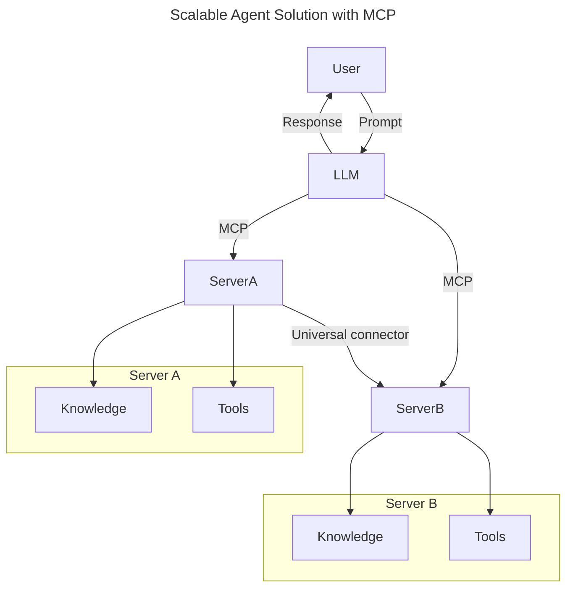
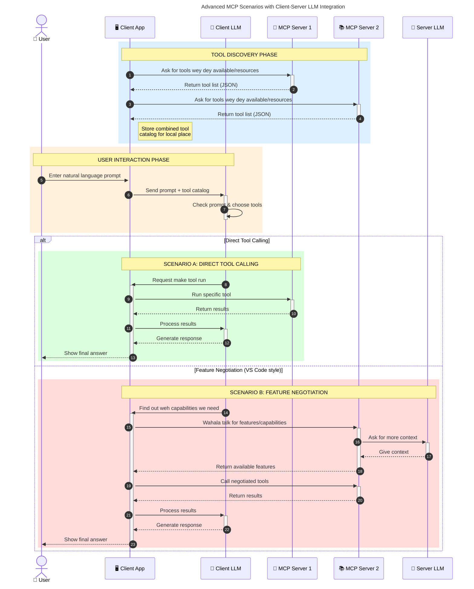

# Introduction to Model Context Protocol (MCP): Why E Important for Scalable AI Applications

[](https://youtu.be/agBbdiOPLQA)

_(Click the image above to watch dis lesson video)_

Generative AI applications na big step forward because dem dey usually allow user to interact wit di app using natural language prompts. But as you put more time and resources for these apps, you go wan make sure say e easy to join functionalities and resources so dat e go easy to expand, dat your app fit handle more than one model and fit manage different model wahala. To put am simply, to build Gen AI apps easy to start but as dem grow and become complex, you go need start to define architecture and e fit be say you go need rely on standard to make sure say your apps dey built in consistent way. Na here MCP dey come organize tins and give standard.

---

## **🔍 Wetin be Model Context Protocol (MCP)?**

**Model Context Protocol (MCP)** na **open, standardized interface** wey allow Large Language Models (LLMs) to connect wella with tools, APIs, and data sources outside. E provide one consistent architecture wey go make AI model functionality beta pass their training data, make AI systems smarter, scalable, and better to respond.

---

## **🎯 Why Standardization for AI E Important**

As generative AI apps dey get more complex, e dey important to adopt standards wey go ensure **scalability, extensibility, maintainability,** and **avoid vendor lock-in**. MCP dey solve dis wahala by:

- Join model-tool integration
- Reduce fragile, one-off custom solutions
- Allow many models from different vendors to work together for one ecosystem

**Note:** Even though MCP talk say na open standard, no plan dey to make MCP become standard through any standards bodies like IEEE, IETF, W3C, ISO, or any other bodies.

---

## **📚 Wetin You Go Learn**

By the time you finish dis article, you go fit:

- Define **Model Context Protocol (MCP)** and wetin e dey used for
- Understand how MCP dey standardize model-to-tool talk
- Identify main parts of MCP architecture
- Check real-life applications of MCP for enterprise and development

---

## **💡 Why Model Context Protocol (MCP) Na Big Thing**

### **🔗 MCP Dey Solve AI Fragmentation**

Before MCP, to join models wit tools you go:

- Write custom code per tool-model pair
- Use non-standard APIs for each vendor
- Break often because of updates
- No fit scale well if more tools join

### **✅ Wetin You Go Gain if You Use MCP Standardization**

| **Wetin You Go Gain**           | **Explanation**                                                             |
|-------------------------------|-----------------------------------------------------------------------------|
| Interoperability               | LLMs go work wella wit tools from different vendors                         |
| Consistency                   | Same way of work for all platforms and tools                                |
| Reusability                   | Tools wey dem build once fit use for many projects and systems              |
| Accelerated Development       | Reduce dev time, use standard plug-and-play interfaces                      |

---

## **🧱 Overview of MCP Architecture at High Level**

MCP dey follow **client-server model**, wey mean:

- **MCP Hosts** dey run AI models
- **MCP Clients** dey do request
- **MCP Servers** dey serve context, tools and capabilities

### **Main Components:**

- **Resources** – Static or dynamic data for models  
- **Prompts** – Predefined workflows for guided generation  
- **Tools** – Functions wey fit run like search, calculations  
- **Sampling** – Agentic behavior through recursive interactions (deprecated in `2026-07-28` release candidate)
- **Elicitation** – Server-initiated requests for user input
- **Roots** – Filesystem limits to control server access (deprecated in `2026-07-28` release candidate)

### **Protocol Architecture:**

MCP get two-layer architecture:
- **Data Layer**: JSON-RPC 2.0 communication with lifecycle management plus primitives
- **Transport Layer**: STDIO (local) and Streamable HTTP with SSE (remote) channels

---

## How MCP Servers Dem Dey Work

MCP servers dem dey work so:

- **Request Flow**:
    1. User or software wey dey act for them go start request.
    2. **MCP Client** go send request to **MCP Host** wey dey run AI Model runtime.
    3. **AI Model** go receive user prompt and fit ask access to external tools or data through one or more tool calls.
    4. **MCP Host**, no be model directly, dey talk to **MCP Server(s)** using di standard protocol.
- **MCP Host Functionality**:
    - **Tool Registry**: Get catalog of tools and wetin dem fit do.
    - **Authentication**: Check if permission dey for tool access.
    - **Request Handler**: Handle incoming requests from model.
    - **Response Formatter**: Arrange tool results in way model fit understand.
- **MCP Server Execution**:
    - **MCP Host** go send tool calls to one or more **MCP Servers**, each one get special functions (search, calculations, database query).
    - **MCP Servers** go do their work and return results to **MCP Host** in consistent format.
    - **MCP Host** go arrange results make e ready for **AI Model**.
- **Response Completion**:
    - **AI Model** go include tool outputs inside final answer.
    - **MCP Host** go send final response to **MCP Client**, wey go give am to user or software wey call am.
    

```mermaid
---
title: MCP Architecture and Component Interactions
description: A diagram showing the flows of the components in MCP.
---
graph TD
    Client[MCP Client/Application] -->|Dey Send Request| H[MCP Host]
    H -->|Dey Call| A[AI Model]
    A -->|Tool Call Request| H
    H -->|MCP Protocol| T1[MCP Server Tool 01: Web Search
    H -->|MCP Protocol| T2[MCP Server Tool 02: Calculator tool
    H -->|MCP Protocol| T3[MCP Server Tool 03: Database Access tool
    H -->|MCP Protocol| T4[MCP Server Tool 04: File System tool
    H -->|Dey Send Response| Client

    subgraph "MCP Host Components"
        H
        G[Tool Registry]
        I[Authentication]
        J[Request Handler]
        K[Response Formatter]
    end

    H <--> G
    H <--> I
    H <--> J
    H <--> K

    style A fill:#f9d5e5,stroke:#333,stroke-width:2px
    style H fill:#eeeeee,stroke:#333,stroke-width:2px
    style Client fill:#d5e8f9,stroke:#333,stroke-width:2px
    style G fill:#fffbe6,stroke:#333,stroke-width:1px
    style I fill:#fffbe6,stroke:#333,stroke-width:1px
    style J fill:#fffbe6,stroke:#333,stroke-width:1px
    style K fill:#fffbe6,stroke:#333,stroke-width:1px
    style T1 fill:#c2f0c2,stroke:#333,stroke-width:1px
    style T2 fill:#c2f0c2,stroke:#333,stroke-width:1px
    style T3 fill:#c2f0c2,stroke:#333,stroke-width:1px
    style T4 fill:#c2f0c2,stroke:#333,stroke-width:1px
```

## 👨‍💻 How to Build MCP Server (With Examples)

MCP servers dey allow you extend LLM power by providing data and functionalities.

Ready to try am? Here na language or stack specific SDKs plus examples to create simple MCP servers for different languages/stacks:

- **Python SDK**: https://github.com/modelcontextprotocol/python-sdk

- **TypeScript SDK**: https://github.com/modelcontextprotocol/typescript-sdk

- **Java SDK**: https://github.com/modelcontextprotocol/java-sdk

- **C#/.NET SDK**: https://github.com/modelcontextprotocol/csharp-sdk


## 🌍 Real-World MCP Use Cases

MCP fit enable many applications by extending AI power:

| **Application**                  | **Explanation**                                                            |
|--------------------------------|----------------------------------------------------------------------------|
| Enterprise Data Integration      | Connect LLMs to databases, CRMs, or tools wey dem get inside company         |
| Agentic AI Systems               | Make autonomous agents wey fit use tools and make decisions                 |
| Multi-modal Applications         | Join text, image, audio tools inside one AI app                            |
| Real-time Data Integration       | Carry live data come AI interactions for accurate and current responses      |


### 🧠 MCP = Universal Standard for AI Interactions

Model Context Protocol (MCP) na universal standard for AI interactions, like USB-C wey standardize physical device connections. For AI world, MCP dey provide one consistent interface, make models (clients) fit join external tools and data providers (servers). This one remove di need for different custom protocols for each API or data source.

Under MCP, MCP-compatible tool (which be MCP server) follow one normal standard. These servers fit show the tools or actions dem get and perform those actions when AI agent ask am. AI agent platforms wey support MCP fit find tools wey servers get and fit use them through this protocol.

### 💡 E Make Access to Knowledge Easy

MCP no just give tools, e also enable access to knowledge. E allow applications to give context to LLMs by linking dem to different data sources. Like, one MCP server fit be company document store, so agents fit find correct info when dem need am. Another server fit handle tasks like sending email or updating records. For agent mind, these na tools wey dem fit use—some tools return data (knowledge context), others do actions. MCP manage both well well.

Agent wey connect to MCP server by itself go learn the server capabilities and data wey e fit access through one normal format. This standardization dey allow tools to dey available anytime. For example, if you add new MCP server to agent system, e functions go ready to use immediately without change agent instructions.

This smooth integration dey follow dis diagram wey show how servers dey provide both tools and knowledge, to make sure systems dey work together well.

### 👉 Example: Scalable Agent Solution


The Universal Connector make MCP servers fit talk and share capabilities, make ServerA fit give ServerB tasks or access im tools and knowledge. This one make tools and data fit spread across servers, support scalable and modular agent architectures. Because MCP standardize tools exposure, agents fit find and direct requests between servers without hardwire integration.


Tool and knowledge federation: Tools and data fit access across servers, make agentic architectures scalable and modular.

### 🔄 Advanced MCP Scenarios wit Client-Side LLM Integration

Beyond basic MCP, some advanced cases get both client and server with LLMs, make interactions more sophisticated. For the diagram below, **Client App** fit be IDE with many MCP tools wey LLM fit use:



## 🔐 Practical Benefits of MCP

Here na wetin you go gain from using MCP:

- **Freshness**: Models fit get up-to-date info beyond their training data
- **Capability Extension**: Models fit use special tools for tasks wey dem no train for
- **Reduced Hallucinations**: External data sources dey ground facts
- **Privacy**: Sensitive data fit remain for secure environments, no need embed am for prompts

## 📌 Main Takeaways

Make you remember these about MCP:

- **MCP** dey standardize how AI models dey interact with tools and data
- Promote **extensibility, consistency, and interoperability**
- MCP dey help **reduce dev time, improve reliability, and extend model power**
- Client-server architecture **go allow flexible, extensible AI apps**

## 🧠 Exercise

Think about one AI app wey you want build.

- Which **external tools or data** fit make am better?
- How MCP fit make joining am **simpler and more reliable?**

## More Resources

- [MCP GitHub Repository](https://github.com/modelcontextprotocol)


## Wetin Next

Next: [Chapter 1: Core Concepts](../01-CoreConcepts/README.md)

---

<!-- CO-OP TRANSLATOR DISCLAIMER START -->
**Disclaimer**:
Dis document don translate wit AI translation service [Co-op Translator](https://github.com/Azure/co-op-translator). Even tho we dey try make am correct, abeg make you know say automated translation fit get errors or mistakes. Di original document for dia own language na im be di correct source. For important info, make person wey sabi human translation do am. We no go responsible for any misunderstanding or wrong understanding wey fit happen because of dis translation.
<!-- CO-OP TRANSLATOR DISCLAIMER END -->