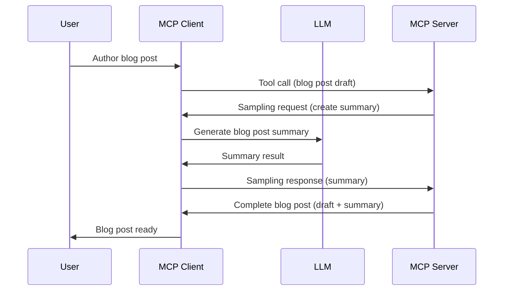

> [DEPRECATED: 2026-07-28 RELEASE CANDIDATE](https://blog.modelcontextprotocol.io/posts/2026-07-28-release-candidate/)

# Sampling - delegate features to the Client

> **Deprecation notice:** di `2026-07-28` MCP specification release candidate mark Sampling as old and no longer beta na for use direct integration with LLM provider APIs. Sampling still dey work for `2025-11-25` and go still work for at least one year after any official depreciation, so everything inside dis lesson still valid — but new server design suppose consider the new way wey dem dey do am. See [Wetin Change for MCP: Di 2026-07-28 Release Candidate](../../01-CoreConcepts/mcp-2026-07-28-release-candidate.md).

Sometimes, you go need make MCP Client and MCP Server work together to achieve one goal. You fit get situation wey require server to use help from LLM wey dey on the client side. For dat kind situation, sampling na wetin you suppose use.

Make we look some use case and how to build solution wey involve sampling.

## Overview

For dis lesson, we go focus how and when you go take use Sampling and how to set am configure.

## Learning Objectives

For dis chapter, we go:

- Explain wetin Sampling be and when to take use am.
- Show how to set Sampling for MCP.
- Give example of how Sampling dey work.

## Wetin be Sampling and why you suppose use am?

Sampling na advanced feature wey dey work like dis:



### Sampling request

Ok, now we get general picture of correct scenario, make we talk about the sampling request wey server dey send back to client. Dis na how the request fit be for JSON-RPC format:

```json
{
  "jsonrpc": "2.0",
  "id": 1,
  "method": "sampling/createMessage",
  "params": {
    "messages": [
      {
        "role": "user",
        "content": {
          "type": "text",
          "text": "Create a blog post summary of the following blog post: <BLOG POST>"
        }
      }
    ],
    "modelPreferences": {
      "hints": [
        {
          "name": "claude-3-sonnet"
        }
      ],
      "intelligencePriority": 0.8,
      "speedPriority": 0.5
    },
    "systemPrompt": "You are a helpful assistant.",
    "maxTokens": 100
  }
}
```

Some tins dey here wey worth talk:

- Prompt, under content -> text, na the instruction wey we send to LLM to summarize blog post content.

- **modelPreferences**. Dis section na wetin person prefer, e be like advisory on how to configure the LLM. User fit decide whether dem go follow the advice or change am. For this case, dem talk for which model to use and speed and intelligence priority.
- **systemPrompt**, na your normal system prompt wey give your LLM personality and instructions.
- **maxTokens**, dis na number of tokens wey dem recommend to use for dis task.

### Sampling response

Dis response na wetin MCP Client go send back to MCP Server as result of client calling the LLM, wait for response, then create dis message. Dis na how e fit look for JSON-RPC:

```json
{
  "jsonrpc": "2.0",
  "id": 1,
  "result": {
    "role": "assistant",
    "content": {
      "type": "text",
      "text": "Here's your abstract <ABSTRACT>"
    },
    "model": "gpt-5",
    "stopReason": "endTurn"
  }
}
```

Notice say the response na abstract of the blog post like we ask for. Also notice say the `model` used no be the one we ask for but "gpt-5" instead of "claude-3-sonnet". Dis show say user fit change mind about wetin to use and your sampling request na just recommendation.

Ok, now we don understand the main flow, and the useful task to do am for "blog post creation + abstract", make we see wetin we need to do make am work.

### Message types

Sampling messages no restrict to just text, but you fit also send images and audio. Dis na how the JSON-RPC differ:

**Text**

```json
{
  "type": "text",
  "text": "The message content"
}
```

**Image content**

```json
{
  "type": "image",
  "data": "base64-encoded-image-data",
  "mimeType": "image/jpeg"
}
```

**Audio content**

```json
{
  "type": "audio",
  "data": "base64-encoded-audio-data",
  "mimeType": "audio/wav"
}
```

> NOTE: for more detailed info on Sampling, check out the [official docs](https://modelcontextprotocol.io/specification/2025-11-25/client/sampling)

## How to Configure Sampling in the Client

> Note: if na only server you dey build, you no need too much for here.

For client, you need to specify dis feature like dis:

```json
{
  "capabilities": {
    "sampling": {}
  }
}
```

Dis one go dey picked up when your chosen client start with the server.

## Example of Sampling in Action - Create a Blog Post

Make we code sampling server together, we go need do dis:

1. Create tool for the Server.
1. The tool go create a sampling request.
1. Tool go wait for client sampling request answer.
1. Then the tool result go come out.

Make we see di code step by step:

### -1- Create the tool

**python**

```python
@mcp.tool()
async def create_blog(title: str, content: str, ctx: Context[ServerSession, None]) -> str:
    """Create a blog post and generate a summary"""

```

### -2- Create a sampling request

Add this code to your tool:

**python**

```python
post = BlogPost(
        id=len(posts) + 1,
        title=title,
        content=content,
        abstract=""
    )

prompt = f"Create an abstract of the following blog post: title: {title} and draft: {content} "

result = await ctx.session.create_message(
        messages=[
            SamplingMessage(
                role="user",
                content=TextContent(type="text", text=prompt),
            )
        ],
        max_tokens=100,
)

```

### -3- Wait for the response and return response

**python**

```python
post.abstract = result.content.text

posts.append(post)

# return di full product
return json.dumps({
    "id": post.title,
    "abstract": post.abstract
})
```

### -4- Full code

**python**

```python
from starlette.applications import Starlette
from starlette.routing import Mount, Host

from mcp.server.fastmcp import Context, FastMCP

from mcp.server.session import ServerSession
from mcp.types import SamplingMessage, TextContent

import json


from uuid import uuid4
from typing import List
from pydantic import BaseModel


mcp = FastMCP("Blog post generator")

# app = FastAPI()

posts = []

class BlogPost(BaseModel):
    id: int
    title: str
    content: str
    abstract: str

posts: List[BlogPost] = []

@mcp.tool()
async def create_blog(title: str, content: str, ctx: Context[ServerSession, None]) -> str:
    """Create a blog post and generate a summary"""

    post = BlogPost(
        id=len(posts) + 1,
        title=title,
        content=content,
        abstract=""
    )

    prompt = f"Create an abstract of the following blog post: title: {title} and draft: {content} "

    result = await ctx.session.create_message(
        messages=[
            SamplingMessage(
                role="user",
                content=TextContent(type="text", text=prompt),
            )
        ],
        max_tokens=100,
    )

    post.abstract = result.content.text

    posts.append(post)

    # return di whole blog post
    return json.dumps({
        "id": post.title,
        "abstract": post.abstract
    })

if __name__ == "__main__":
    print("Starting server...")
    # mcp.run()
    mcp.run(transport="streamable-http")

# run di app wit: python server.py
```

### -5- Testing it in Visual Studio Code

To test am for Visual Studio Code, do dis:

1. Start server for terminal
1. Add am to *mcp.json* (make sure e start) e.g like dis:

   ```json
   "servers": {
      "blog-server": {
        "type": "http",
        "url": "http://localhost:8000/mcp"
      }
   }
   ```

1. Type your prompt:

   ```text
   create a blog post named "Where Python comes from", the content is "Python is actually named after Monty Python Flying Circus"
   ```

1. Allow the sampling make e happen. First time you try dis, you go see extra dialog wey you go need accept, then you go see normal dialog to ask you make you run tool.

1. Check the results. You go see results nicely show for GitHub Copilot Chat, and you fit also check the raw JSON response.

**Bonus**. Visual Studio Code get good support for sampling. You fit set Sampling access on the installed server by navigating like dis:

1. Go to extension section.
1. Select the cog icon for your installed server for "MCP SERVERS - INSTALLED" section.
1 Pick "Configure Model Access", you fit select which Models GitHub Copilot fit use for sampling. You fit also see all recent sampling requests by selecting "Show Sampling requests".

## Assignment

For dis assignment, you go build different kind Sampling, wey na sampling integration wey fit generate product description. Here be your scenario:

**Scenario**: Worker for back office for e-commerce dey find help, e dey take too much time to create product descriptions. So, you go build solution weh fit call tool "create_product" with "title" and "keywords" as arguments and e go give full product with "description" field wey client LLM go fill.

TIP: use wetin you don learn before to create this server and tool with sampling request.

## Solution

[Solution](./solution/README.md)

## Key Takeaways

Sampling na powerful feature wey allow server to pass some tasks go client if e need LLM help.

## What's Next

- [Chapter 4 - Practical implementation](../../04-PracticalImplementation/README.md)

---

<!-- CO-OP TRANSLATOR DISCLAIMER START -->
**Disclaimer**:
Dis document don translate wit AI translation service [Co-op Translator](https://github.com/Azure/co-op-translator). Even tho we dey try make am correct, abeg make you know say automated translation fit get errors or mistakes. Di original document for dia own language na im be di correct source. For important info, make person wey sabi human translation do am. We no go responsible for any misunderstanding or wrong understanding wey fit happen because of dis translation.
<!-- CO-OP TRANSLATOR DISCLAIMER END -->