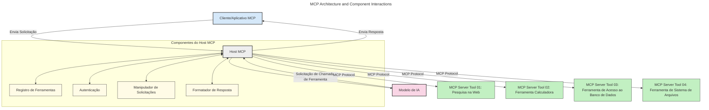
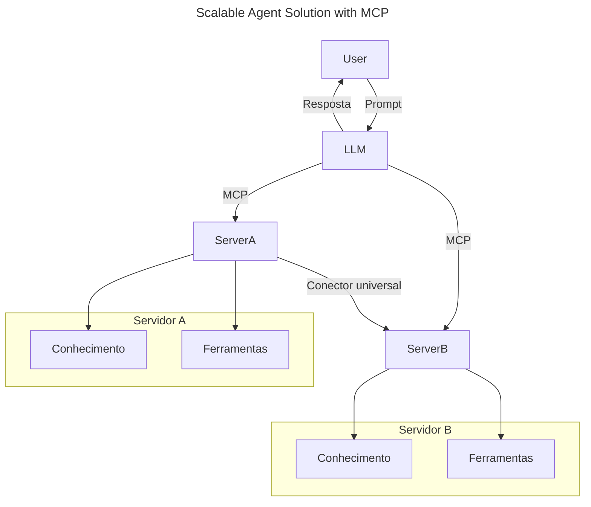
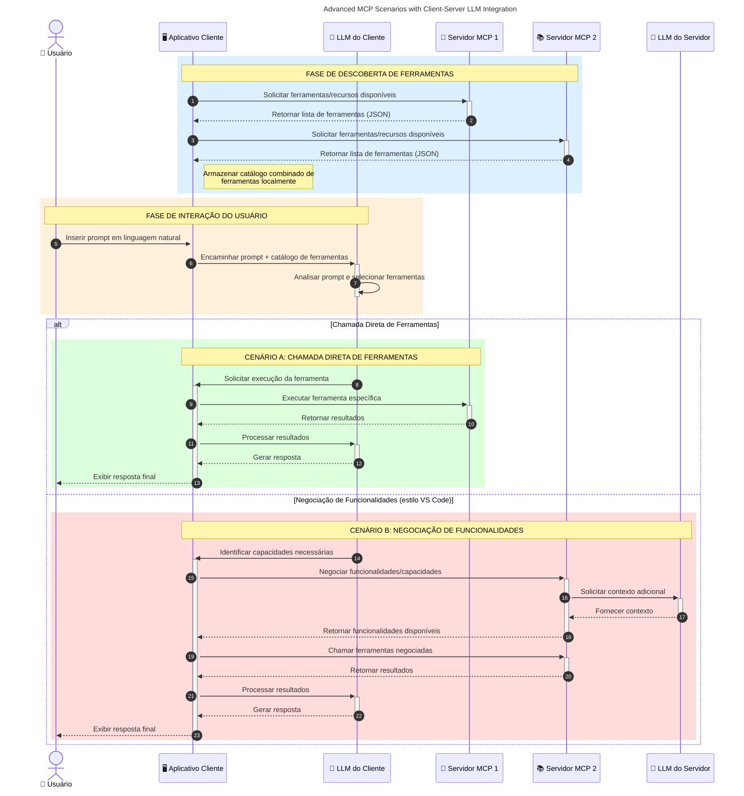

# Introdução ao Protocolo de Contexto de Modelo (MCP): Por Que Ele É Importante para Aplicações de IA Escaláveis

_(Clique na imagem acima para assistir ao vídeo desta lição)_

Aplicações de IA generativa são um grande avanço, pois geralmente permitem que o usuário interaja com o aplicativo usando comandos em linguagem natural. Contudo, à medida que mais tempo e recursos são investidos nesses aplicativos, você quer garantir que seja fácil integrar funcionalidades e recursos de forma que seja simples expandir, que seu aplicativo possa atender a mais de um modelo em uso e lidar com várias particularidades do modelo. Em resumo, construir aplicativos de IA generativa é fácil no começo, mas à medida que crescem e se tornam mais complexos, é necessário começar a definir uma arquitetura e provavelmente depender de um padrão para garantir que seus aplicativos sejam construídos de forma consistente. É aí que o MCP entra para organizar as coisas e fornecer um padrão.

---

## **🔍 O Que é o Protocolo de Contexto de Modelo (MCP)?**

O **Protocolo de Contexto de Modelo (MCP)** é uma **interface aberta e padronizada** que permite que Grandes Modelos de Linguagem (LLMs) interajam perfeitamente com ferramentas externas, APIs e fontes de dados. Ele fornece uma arquitetura consistente para ampliar a funcionalidade dos modelos de IA além dos seus dados de treinamento, possibilitando sistemas de IA mais inteligentes, escaláveis e responsivos.

---

## **🎯 Por Que a Padronização em IA é Importante**

Conforme as aplicações de IA generativa se tornam mais complexas, é essencial adotar padrões que assegurem **escalabilidade, extensibilidade, mantenibilidade** e **evitar dependência exclusiva de fornecedores**. O MCP atende a essas necessidades ao:

- Unificar integrações modelo-ferramenta
- Reduzir soluções personalizadas frágeis e pontuais
- Permitir que múltiplos modelos de diferentes fornecedores coexistam em um único ecossistema

**Nota:** Embora o MCP se apresente como um padrão aberto, não há planos para padronizar o MCP por meio de órgãos de padronização existentes como IEEE, IETF, W3C, ISO ou qualquer outro órgão de padrões.

---

## **📚 Objetivos de Aprendizagem**

Ao final deste artigo, você será capaz de:

- Definir **Protocolo de Contexto de Modelo (MCP)** e seus casos de uso
- Entender como o MCP padroniza a comunicação modelo-ferramenta
- Identificar os componentes principais da arquitetura MCP
- Explorar aplicações reais do MCP em contextos empresariais e de desenvolvimento

---

## **💡 Por Que o Protocolo de Contexto de Modelo (MCP) É um Divisor de Águas**

### **🔗 MCP Resolve a Fragmentação nas Interações de IA**

Antes do MCP, integrar modelos com ferramentas exigia:

- Código personalizado por par ferramenta-modelo
- APIs não padronizadas para cada fornecedor
- Quebras frequentes devido a atualizações
- Escalabilidade ruim com mais ferramentas

### **✅ Benefícios da Padronização MCP**

| **Benefício**              | **Descrição**                                                                |
|--------------------------|--------------------------------------------------------------------------------|
| Interoperabilidade         | LLMs funcionam perfeitamente com ferramentas de diferentes fornecedores      |
| Consistência              | Comportamento uniforme entre plataformas e ferramentas                       |
| Reutilização              | Ferramentas construídas uma vez podem ser usadas em múltiplos projetos e sistemas |
| Desenvolvimento Acelerado | Reduz tempo de desenvolvimento usando interfaces padronizadas e plug-and-play |

---

## **🧱 Visão Geral da Arquitetura MCP em Alto Nível**

O MCP segue um **modelo cliente-servidor**, onde:

- **Hosts MCP** executam os modelos de IA
- **Clientes MCP** iniciam requisições
- **Servidores MCP** fornecem contexto, ferramentas e funcionalidades

### **Componentes-Chave:**

- **Recursos** – Dados estáticos ou dinâmicos para modelos  
- **Prompts** – Fluxos de trabalho predefinidos para geração guiada  
- **Ferramentas** – Funções executáveis como buscas, cálculos  
- **Amostragem** – Comportamento agente via interações recursivas (obsoleto na release candidate `2026-07-28`)
- **Elucidação** – Requisições iniciadas pelo servidor para input do usuário
- **Raízes** – Limites do sistema de arquivos para controle de acesso do servidor (obsoleto na release candidate `2026-07-28`)

### **Arquitetura do Protocolo:**

MCP utiliza uma arquitetura em duas camadas:
- **Camada de Dados**: Comunicação baseada em JSON-RPC 2.0 com gerenciamento de ciclo de vida e primitivas
- **Camada de Transporte**: STLIO (local) e HTTP transmissível com SSE (comunicação remota)

---

## Como Funcionam os Servidores MCP

Os servidores MCP operam da seguinte forma:

- **Fluxo de Requisição**:
    1. Uma requisição é iniciada por um usuário final ou software agindo em seu nome.
    2. O **Cliente MCP** envia a requisição para um **Host MCP**, que gerencia o tempo de execução do Modelo de IA.
    3. O **Modelo de IA** recebe o prompt do usuário e pode solicitar acesso a ferramentas externas ou dados por meio de uma ou mais chamadas de ferramenta.
    4. O **Host MCP**, não o modelo diretamente, comunica-se com o(s) **Servidor(es) MCP** apropriado(s) usando o protocolo padronizado.
- **Funcionalidade do Host MCP**:
    - **Registro de Ferramentas**: Mantém um catálogo das ferramentas disponíveis e suas capacidades.
    - **Autenticação**: Verifica permissões para acesso às ferramentas.
    - **Manipulador de Requisições**: Processa as requisições de ferramentas vindas do modelo.
    - **Formatador de Respostas**: Estrutura as saídas das ferramentas em formato compreensível para o modelo.
- **Execução do Servidor MCP**:
    - O **Host MCP** encaminha chamadas de ferramentas para um ou mais **Servidores MCP**, cada um expondo funções especializadas (ex.: buscas, cálculos, consultas a banco de dados).
    - Os **Servidores MCP** realizam suas operações e retornam os resultados ao **Host MCP** em formato consistente.
    - O **Host MCP** formata e retransmite esses resultados para o **Modelo de IA**.
- **Completação da Resposta**:
    - O **Modelo de IA** incorpora as saídas das ferramentas em uma resposta final.
    - O **Host MCP** envia essa resposta de volta ao **Cliente MCP**, que a entrega ao usuário final ou software solicitante.
    

## 👨‍💻 Como Construir um Servidor MCP (Com Exemplos)

Servidores MCP permitem que você expanda as capacidades de LLMs fornecendo dados e funcionalidades. 

Pronto para experimentar? Aqui estão SDKs específicos por linguagem e/ou stack com exemplos de criação de servidores MCP simples em diferentes linguagens/stack:

- **SDK Python**: https://github.com/modelcontextprotocol/python-sdk

- **SDK TypeScript**: https://github.com/modelcontextprotocol/typescript-sdk

- **SDK Java**: https://github.com/modelcontextprotocol/java-sdk

- **SDK C#/.NET**: https://github.com/modelcontextprotocol/csharp-sdk

## 🌍 Casos de Uso Reais para MCP

MCP possibilita uma ampla gama de aplicações ao expandir as capacidades de IA:

| **Aplicação**              | **Descrição**                                                                |
|------------------------------|--------------------------------------------------------------------------------|
| Integração de Dados Empresariais  | Conectar LLMs a bancos de dados, CRMs ou ferramentas internas              |
| Sistemas de IA Agentes           | Habilitar agentes autônomos com acesso a ferramentas e fluxos de decisão    |
| Aplicações Multi-modais          | Combinar ferramentas de texto, imagem e áudio dentro de um único app unificado |
| Integração de Dados em Tempo Real| Trazer dados ao vivo para interações de IA para saídas mais precisas e atuais |

### 🧠 MCP = Padrão Universal para Interações de IA

O Protocolo de Contexto de Modelo (MCP) atua como um padrão universal para interações de IA, assim como o USB-C padronizou conexões físicas para dispositivos. No mundo da IA, o MCP fornece uma interface consistente, permitindo que modelos (clientes) integrem-se perfeitamente com ferramentas externas e provedores de dados (servidores). Isso elimina a necessidade de protocolos diversos e personalizados para cada API ou fonte de dados.

Sob o MCP, uma ferramenta compatível com MCP (referida como servidor MCP) segue um padrão unificado. Esses servidores podem listar as ferramentas ou ações que oferecem e executá-las quando solicitadas por um agente de IA. Plataformas de agentes de IA que suportam MCP podem descobrir ferramentas disponíveis dos servidores e invocá-las através deste protocolo padrão.

### 💡 Facilita o acesso ao conhecimento

Além de oferecer ferramentas, o MCP também facilita o acesso ao conhecimento. Ele permite que aplicações forneçam contexto para grandes modelos de linguagem (LLMs) vinculando-os a várias fontes de dados. Por exemplo, um servidor MCP pode representar o repositório de documentos de uma empresa, permitindo que agentes recuperem informações relevantes sob demanda. Outro servidor pode executar ações específicas, como enviar e-mails ou atualizar registros. Do ponto de vista do agente, são simplesmente ferramentas que ele pode usar — algumas ferramentas retornam dados (contexto de conhecimento), enquanto outras realizam ações. O MCP gerencia ambos eficientemente.

Um agente conectado a um servidor MCP aprende automaticamente as capacidades disponíveis e os dados acessíveis pelo servidor através de um formato padrão. Essa padronização permite disponibilidade dinâmica de ferramentas. Por exemplo, adicionar um novo servidor MCP ao sistema de um agente torna suas funções imediatamente utilizáveis sem exigir personalização adicional das instruções do agente.

Essa integração simplificada alinha-se ao fluxo mostrado no diagrama a seguir, onde servidores fornecem tanto ferramentas quanto conhecimento, garantindo colaboração fluida entre sistemas. 

### 👉 Exemplo: Solução de Agente Escalável

O Universal Connector permite que servidores MCP se comuniquem e compartilhem capacidades entre si, permitindo que ServerA delegue tarefas para ServerB ou acesse suas ferramentas e conhecimento. Isso federar ferramentas e dados através dos servidores, apoiando arquiteturas de agentes escaláveis e modulares. Porque o MCP padroniza a exposição das ferramentas, agentes podem descobrir dinamicamente e rotear requisições entre servidores sem integrações codificadas diretamente.

Federação de ferramentas e conhecimento: Ferramentas e dados podem ser acessados entre servidores, possibilitando arquiteturas agentic mais escaláveis e modulares.

### 🔄 Cenários Avançados MCP com Integração de LLM do Lado do Cliente

Além da arquitetura básica do MCP, existem cenários avançados onde cliente e servidor contêm LLMs, permitindo interações mais sofisticadas. No diagrama a seguir, **App Cliente** poderia ser um IDE com várias ferramentas MCP disponíveis para uso do LLM:

## 🔐 Benefícios Práticos do MCP

Aqui estão os benefícios práticos de usar o MCP:

- **Atualização**: Modelos podem acessar informações atualizadas além dos dados de treinamento
- **Extensão de Capacidades**: Modelos podem aproveitar ferramentas especializadas para tarefas para as quais não foram treinados
- **Redução de Alucinações**: Fontes externas de dados fornecem fundamentação factual
- **Privacidade**: Dados sensíveis podem permanecer em ambientes seguros ao invés de serem embutidos em prompts

## 📌 Principais Conclusões

Confira os principais pontos sobre o uso do MCP:

- **MCP** padroniza como modelos de IA interagem com ferramentas e dados
- Promove **extensibilidade, consistência e interoperabilidade**
- MCP ajuda a **reduzir o tempo de desenvolvimento, melhorar a confiabilidade e expandir as capacidades do modelo**
- A arquitetura cliente-servidor **permite aplicações de IA flexíveis e extensíveis**

## 🧠 Exercício

Pense em uma aplicação de IA que você deseja construir.

- Quais **ferramentas externas ou dados** poderiam melhorar suas capacidades?
- Como o MCP poderia tornar a integração **mais simples e confiável?**

## Recursos Adicionais

- [Repositório MCP no GitHub](https://github.com/modelcontextprotocol)

## O que vem a seguir

Próximo: [Capítulo 1: Conceitos Básicos](../01-CoreConcepts/README.md)

---

<!-- CO-OP TRANSLATOR DISCLAIMER START -->
**Aviso Legal**:
Este documento foi traduzido usando o serviço de tradução por IA [Co-op Translator](https://github.com/Azure/co-op-translator). Embora nos esforcemos pela precisão, por favor, esteja ciente de que traduções automatizadas podem conter erros ou imprecisões. O documento original em seu idioma nativo deve ser considerado a fonte autorizada. Para informações críticas, recomenda-se tradução profissional humana. Não nos responsabilizamos por quaisquer mal-entendidos ou interpretações incorretas decorrentes do uso desta tradução.
<!-- CO-OP TRANSLATOR DISCLAIMER END -->