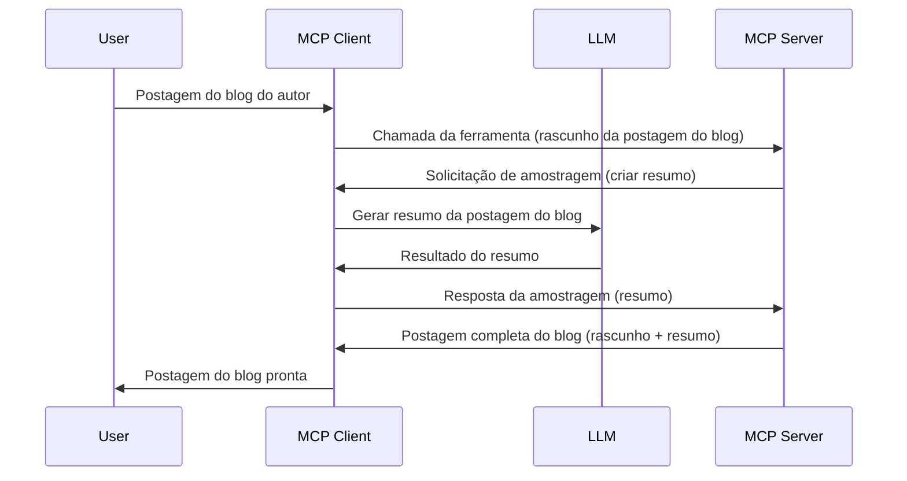

> [OBSOLETO: CANDIDATO A LANÇAMENTO 2026-07-28](https://blog.modelcontextprotocol.io/posts/2026-07-28-release-candidate/)

# Sampling - delegar funcionalidades ao Cliente

> **Aviso de descontinuação:** o candidato a lançamento da especificação MCP `2026-07-28` marca o Sampling como obsoleto em favor da integração direta com APIs de provedores LLM. Sampling continua funcionando em `2025-11-25` e por pelo menos um ano após qualquer descontinuação formal, então tudo nesta lição permanece válido — mas novos designs de servidores devem avaliar o padrão substituto. Veja [O que está mudando no MCP: Candidato a lançamento 2026-07-28](../../01-CoreConcepts/mcp-2026-07-28-release-candidate.md).

Às vezes, você precisa que o Cliente MCP e o Servidor MCP colaborem para atingir um objetivo comum. Você pode ter um caso em que o Servidor requer a ajuda de um LLM que está no cliente. Para essa situação, o sampling é o que você deve usar.

Vamos explorar alguns casos de uso e como construir uma solução envolvendo sampling.

## Visão Geral

Nesta lição, focamos em explicar quando e onde usar Sampling e como configurá-lo.

## Objetivos de Aprendizagem

Neste capítulo, iremos:

- Explicar o que é Sampling e quando usá-lo.
- Mostrar como configurar Sampling no MCP.
- Fornecer exemplos de Sampling em ação.

## O que é Sampling e por que usá-lo?

Sampling é um recurso avançado que funciona da seguinte maneira:



### Solicitação de Sampling

Ok, agora que temos uma visão geral de um cenário plausível, vamos falar sobre a solicitação de sampling que o servidor envia de volta ao cliente. Veja como essa solicitação pode parecer no formato JSON-RPC:

```json
{
  "jsonrpc": "2.0",
  "id": 1,
  "method": "sampling/createMessage",
  "params": {
    "messages": [
      {
        "role": "user",
        "content": {
          "type": "text",
          "text": "Create a blog post summary of the following blog post: <BLOG POST>"
        }
      }
    ],
    "modelPreferences": {
      "hints": [
        {
          "name": "claude-3-sonnet"
        }
      ],
      "intelligencePriority": 0.8,
      "speedPriority": 0.5
    },
    "systemPrompt": "You are a helpful assistant.",
    "maxTokens": 100
  }
}
```

Existem algumas coisas interessantes aqui para destacar:

- Prompt, em content -> text, é nosso prompt que é uma instrução para o LLM resumir o conteúdo do post do blog.

- **modelPreferences**. Esta seção é exatamente isso, uma preferência, uma recomendação de qual configuração usar com o LLM. O usuário pode optar por seguir essas recomendações ou modificá-las. Neste caso, há recomendações sobre qual modelo usar e prioridade entre velocidade e inteligência.
- **systemPrompt**, este é seu prompt normal de sistema que dá ao seu LLM uma personalidade e contém instruções de orientação.
- **maxTokens**, esta é outra propriedade usada para indicar quantos tokens são recomendados para essa tarefa.

### Resposta de Sampling

Essa resposta é o que o Cliente MCP acaba enviando de volta ao Servidor MCP e é o resultado do cliente chamar o LLM, aguardar essa resposta e então construir essa mensagem. Veja como pode ser no JSON-RPC:

```json
{
  "jsonrpc": "2.0",
  "id": 1,
  "result": {
    "role": "assistant",
    "content": {
      "type": "text",
      "text": "Here's your abstract <ABSTRACT>"
    },
    "model": "gpt-5",
    "stopReason": "endTurn"
  }
}
```

Note como a resposta é um resumo do post do blog exatamente como pedimos. Também note como o `model` usado não é o que pedimos, mas "gpt-5" em vez de "claude-3-sonnet". Isso ilustra que o usuário pode mudar de ideia sobre o que usar e que sua solicitação de sampling é uma recomendação.

Ok, agora que entendemos o fluxo principal e uma tarefa útil para usar isso "criação de post de blog + resumo", vamos ver o que precisamos fazer para fazê-lo funcionar.

### Tipos de mensagens

Mensagens de sampling não estão limitadas apenas a texto, você também pode enviar imagens e áudio. Veja como o JSON-RPC fica diferente:

**Texto**

```json
{
  "type": "text",
  "text": "The message content"
}
```

**Conteúdo da imagem**

```json
{
  "type": "image",
  "data": "base64-encoded-image-data",
  "mimeType": "image/jpeg"
}
```

**Conteúdo de áudio**

```json
{
  "type": "audio",
  "data": "base64-encoded-audio-data",
  "mimeType": "audio/wav"
}
```

> NOTA: para informações mais detalhadas sobre Sampling, confira a [documentação oficial](https://modelcontextprotocol.io/specification/2025-11-25/client/sampling)

## Como Configurar Sampling no Cliente

> Nota: se você está construindo apenas um servidor, não precisa fazer muito aqui.

Em um cliente, você precisa especificar a funcionalidade da seguinte forma:

```json
{
  "capabilities": {
    "sampling": {}
  }
}
```

Isso será então detectado quando seu cliente escolhido inicializar com o servidor.

## Exemplo de Sampling em Ação - Criar um Post de Blog

Vamos codificar um servidor de sampling juntos, precisaremos fazer o seguinte:

1. Criar uma ferramenta no Servidor.
1. Essa ferramenta deve criar uma solicitação de sampling
1. A ferramenta deve esperar pela resposta à solicitação de sampling do cliente.
1. Então o resultado da ferramenta deve ser produzido.

Vamos ver o código passo a passo:

### -1- Criar a ferramenta

**python**

```python
@mcp.tool()
async def create_blog(title: str, content: str, ctx: Context[ServerSession, None]) -> str:
    """Create a blog post and generate a summary"""

```

### -2- Criar uma solicitação de sampling

Estenda sua ferramenta com o seguinte código:

**python**

```python
post = BlogPost(
        id=len(posts) + 1,
        title=title,
        content=content,
        abstract=""
    )

prompt = f"Create an abstract of the following blog post: title: {title} and draft: {content} "

result = await ctx.session.create_message(
        messages=[
            SamplingMessage(
                role="user",
                content=TextContent(type="text", text=prompt),
            )
        ],
        max_tokens=100,
)

```

### -3- Aguarde a resposta e retorne a resposta

**python**

```python
post.abstract = result.content.text

posts.append(post)

# retorne o produto completo
return json.dumps({
    "id": post.title,
    "abstract": post.abstract
})
```

### -4- Código completo

**python**

```python
from starlette.applications import Starlette
from starlette.routing import Mount, Host

from mcp.server.fastmcp import Context, FastMCP

from mcp.server.session import ServerSession
from mcp.types import SamplingMessage, TextContent

import json


from uuid import uuid4
from typing import List
from pydantic import BaseModel


mcp = FastMCP("Blog post generator")

# app = FastAPI()

posts = []

class BlogPost(BaseModel):
    id: int
    title: str
    content: str
    abstract: str

posts: List[BlogPost] = []

@mcp.tool()
async def create_blog(title: str, content: str, ctx: Context[ServerSession, None]) -> str:
    """Create a blog post and generate a summary"""

    post = BlogPost(
        id=len(posts) + 1,
        title=title,
        content=content,
        abstract=""
    )

    prompt = f"Create an abstract of the following blog post: title: {title} and draft: {content} "

    result = await ctx.session.create_message(
        messages=[
            SamplingMessage(
                role="user",
                content=TextContent(type="text", text=prompt),
            )
        ],
        max_tokens=100,
    )

    post.abstract = result.content.text

    posts.append(post)

    # retornar o post completo do blog
    return json.dumps({
        "id": post.title,
        "abstract": post.abstract
    })

if __name__ == "__main__":
    print("Starting server...")
    # mcp.run()
    mcp.run(transport="streamable-http")

# execute o app com: python server.py
```

### -5- Testando no Visual Studio Code

Para testar isso no Visual Studio Code, faça o seguinte:

1. Inicie o servidor no terminal
1. Adicione-o ao *mcp.json* (e certifique-se de que está iniciado) algo como:

   ```json
   "servers": {
      "blog-server": {
        "type": "http",
        "url": "http://localhost:8000/mcp"
      }
   }
   ```

1. Digite um prompt:

   ```text
   create a blog post named "Where Python comes from", the content is "Python is actually named after Monty Python Flying Circus"
   ```

1. Permita que o sampling aconteça. Na primeira vez que testar isso, será apresentado um diálogo adicional que você precisará aceitar, depois verá o diálogo normal para pedir que execute uma ferramenta

1. Veja os resultados. Você verá os resultados renderizados de forma agradável no GitHub Copilot Chat, mas também poderá inspecionar a resposta JSON bruta.

**Bônus**. As ferramentas do Visual Studio Code têm ótimo suporte para sampling. Você pode configurar o acesso a Sampling no seu servidor instalado navegando assim:

1. Navegue até a seção de extensões.
1. Selecione o ícone de engrenagem para seu servidor instalado na seção "MCP SERVERS - INSTALLED".
1 Selecione "Configure Model Access", aqui você pode selecionar quais Modelos o GitHub Copilot está permitido usar ao realizar sampling. Você também pode ver todas as solicitações de sampling recentes selecionando "Show Sampling requests".

## Tarefa

Nesta tarefa, você vai construir um Sampling um pouco diferente, nomeadamente uma integração de sampling que suporte gerar uma descrição de produto. Aqui está seu cenário:

**Cenário**: O trabalhador do back office de um e-commerce precisa de ajuda, leva tempo demais para gerar descrições de produtos. Portanto, você deve construir uma solução onde possa chamar uma ferramenta "create_product" com "title" e "keywords" como argumentos e ela deve produzir um produto completo incluindo um campo "description" que deve ser preenchido por um LLM do cliente.

DICA: use o que aprendeu anteriormente para construir este servidor e sua ferramenta usando uma solicitação de sampling.

## Solução

[Solução](./solution/README.md)

## Principais Conclusões

Sampling é um recurso poderoso que permite que o servidor delegue tarefas ao cliente quando precisa da ajuda de um LLM.

## O que vem a seguir

- [Capítulo 4 - Implementação prática](../../04-PracticalImplementation/README.md)

---

<!-- CO-OP TRANSLATOR DISCLAIMER START -->
**Aviso Legal**:
Este documento foi traduzido usando o serviço de tradução por IA [Co-op Translator](https://github.com/Azure/co-op-translator). Embora nos esforcemos pela precisão, por favor, esteja ciente de que traduções automatizadas podem conter erros ou imprecisões. O documento original em seu idioma nativo deve ser considerado a fonte autorizada. Para informações críticas, recomenda-se tradução profissional humana. Não nos responsabilizamos por quaisquer mal-entendidos ou interpretações incorretas decorrentes do uso desta tradução.
<!-- CO-OP TRANSLATOR DISCLAIMER END -->