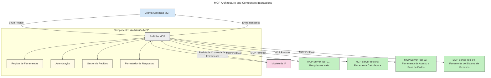
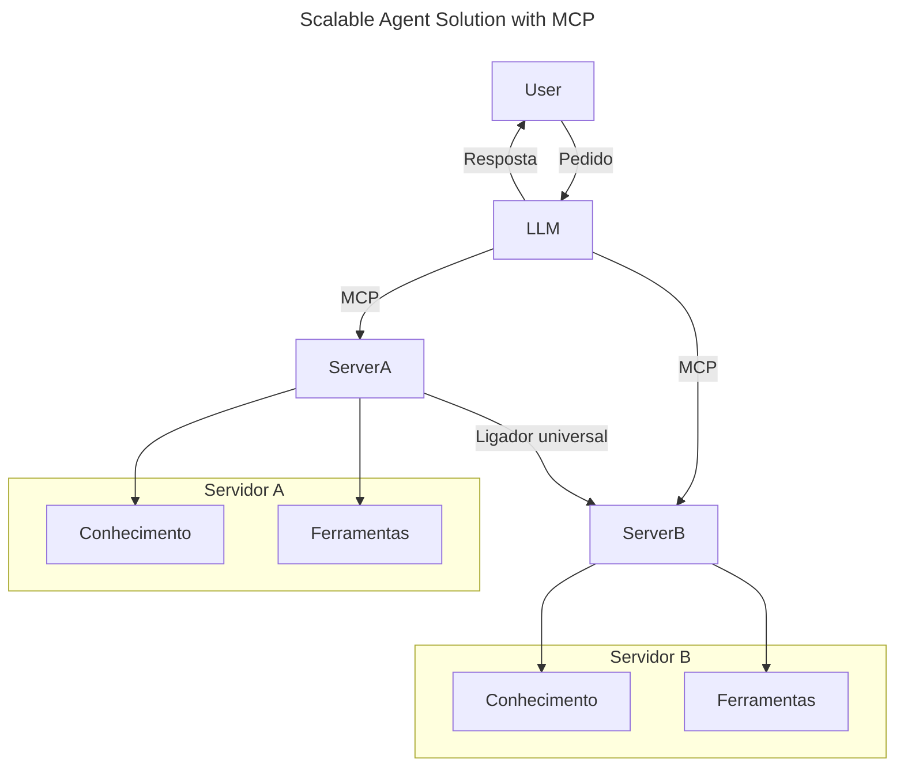
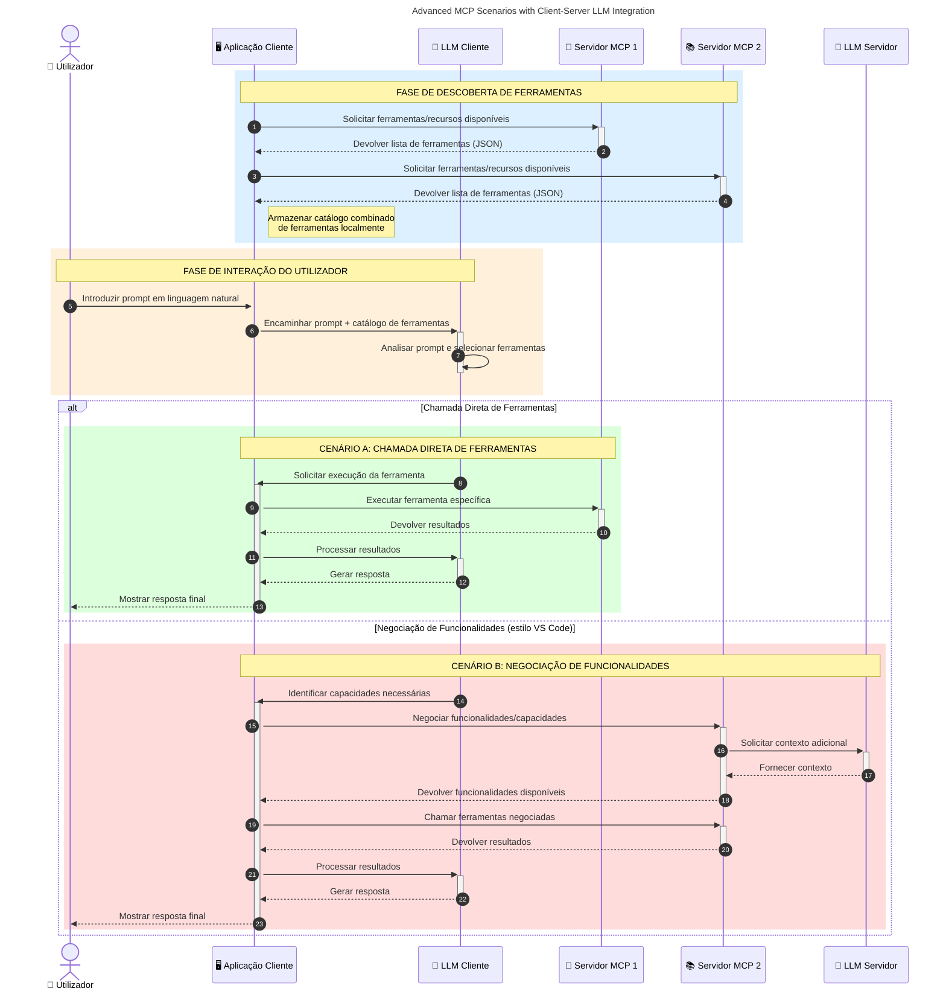

# Introdução ao Protocolo de Contexto de Modelos (MCP): Porque é Importante para Aplicações de IA Escaláveis

_(Clique na imagem acima para ver o vídeo desta lição)_

As aplicações de IA generativa representam um grande avanço pois frequentemente permitem ao utilizador interagir com a aplicação usando comandos em linguagem natural. No entanto, à medida que mais tempo e recursos são investidos nestas aplicações, quer se certificar de que pode integrar funcionalidades e recursos facilmente, de forma a que seja simples de expandir, que a sua app possa suportar mais do que um modelo em uso e lidar com várias particularidades dos modelos. Em suma, construir aplicações de IA generativa é fácil no início, mas à medida que crescem e se tornam mais complexas, é necessário começar a definir uma arquitetura e provavelmente vai precisar de um padrão para garantir que as suas aplicações são construídas de forma consistente. É aqui que o MCP entra para organizar tudo e fornecer um padrão.

---

## **🔍 O que é o Protocolo de Contexto de Modelos (MCP)?**

O **Protocolo de Contexto de Modelos (MCP)** é uma **interface aberta e padronizada** que permite que os Grandes Modelos de Linguagem (LLMs) interajam perfeitamente com ferramentas externas, APIs, e fontes de dados. Proporciona uma arquitetura consistente para melhorar a funcionalidade dos modelos de IA para além dos seus dados de treino, permitindo sistemas de IA mais inteligentes, escaláveis e mais responsivos.

---

## **🎯 Por que a padronização na IA é importante**

À medida que as aplicações de IA generativa se tornam mais complexas, é essencial adotar padrões que assegurem **escalabilidade, extensibilidade, manutenção** e **evitem o aprisionamento a fornecedores**. O MCP responde a estas necessidades ao:

- Unificar as integrações entre modelos e ferramentas
- Reduzir soluções personalizadas frágeis e pontuais
- Permitir que múltiplos modelos de diferentes fornecedores coexistam num ecossistema

**Nota:** Embora o MCP se apresente como um padrão aberto, não existem planos para padronizar o MCP através de organismos de normalização existentes como IEEE, IETF, W3C, ISO, ou outro organismo de normas.

---

## **📚 Objetivos de Aprendizagem**

No final deste artigo, será capaz de:

- Definir o **Protocolo de Contexto de Modelos (MCP)** e os seus casos de uso
- Compreender como o MCP padroniza a comunicação entre modelo e ferramenta
- Identificar os componentes principais da arquitetura MCP
- Explorar aplicações reais do MCP em contextos empresariais e de desenvolvimento

---

## **💡 Porque o Protocolo de Contexto de Modelos (MCP) é uma Revolução**

### **🔗 MCP resolve a fragmentação nas interações de IA**

Antes do MCP, integrar modelos com ferramentas requeria:

- Código personalizado para cada par ferramenta-modelo
- APIs não padronizadas para cada fornecedor
- Interrupções frequentes devido a atualizações
- Escalabilidade deficiente com mais ferramentas

### **✅ Benefícios da padronização MCP**

| **Benefício**             | **Descrição**                                                                 |
|--------------------------|-------------------------------------------------------------------------------|
| Interoperabilidade        | Os LLMs funcionam sem interrupções com ferramentas de diferentes fornecedores  |
| Consistência             | Comportamento uniforme entre plataformas e ferramentas                         |
| Reutilização             | Ferramentas construídas uma vez podem ser usadas em múltiplos projetos e sistemas |
| Desenvolvimento Acelerado| Reduz o tempo de desenvolvimento com interfaces padronizadas plug-and-play     |

---

## **🧱 Visão Geral de Alto Nível da Arquitetura MCP**

O MCP segue um **modelo cliente-servidor**, onde:

- **Hosts MCP** executam os modelos de IA
- **Clientes MCP** iniciam pedidos
- **Servidores MCP** fornecem contexto, ferramentas e capacidades

### **Componentes-chave:**

- **Recursos** – Dados estáticos ou dinâmicos para modelos  
- **Prompts** – Fluxos de trabalho predefinidos para geração guiada  
- **Ferramentas** – Funções executáveis como pesquisa, cálculos  
- **Amostragem** – Comportamento agente via interações recursivas (obsoleto na versão candidata `2026-07-28`)
- **Elucidação** – Pedidos iniciados pelo servidor para entrada de utilizador
- **Raízes** – Limites do sistema de ficheiros para controlo de acesso no servidor (obsoleto na versão candidata `2026-07-28`)

### **Arquitetura do Protocolo:**

O MCP utiliza uma arquitetura em duas camadas:
- **Camada de Dados**: Comunicação baseada em JSON-RPC 2.0 com gestão de ciclo de vida e primitivas
- **Camada de Transporte**: Canais de comunicação locais STDIO e HTTP Streamable com SSE para comunicação remota

---

## Como Funcionam os Servidores MCP

Os servidores MCP operam da seguinte forma:

- **Fluxo de Pedido**:
    1. Um pedido é iniciado por um utilizador final ou software que atua em seu nome.
    2. O **Cliente MCP** envia o pedido a um **Host MCP**, que gere o tempo de execução do Modelo de IA.
    3. O **Modelo de IA** recebe o prompt do utilizador e pode requisitar acesso a ferramentas ou dados externos através de uma ou mais chamadas de ferramentas.
    4. O **Host MCP**, não o modelo diretamente, comunica-se com o(s) **Servidor(es) MCP** apropriado(s) usando o protocolo padronizado.
- **Funcionalidade do Host MCP**:
    - **Registo de Ferramentas**: Mantém um catálogo de ferramentas e suas capacidades.
    - **Autenticação**: Verifica permissões de acesso às ferramentas.
    - **Gestor de Pedidos**: Processa pedidos de ferramentas vindos do modelo.
    - **Formatador de Respostas**: Estrutura as saídas das ferramentas num formato que o modelo compreende.
- **Execução no Servidor MCP**:
    - O **Host MCP** encaminha as chamadas de ferramentas para um ou mais **Servidores MCP**, cada um expondo funções especializadas (ex.: pesquisa, cálculos, consultas a bases de dados).
    - Os **Servidores MCP** realizam as operações respetivas e retornam resultados ao **Host MCP** de forma consistente.
    - O **Host MCP** formata e retransmite estes resultados ao **Modelo de IA**.
- **Conclusão da Resposta**:
    - O **Modelo de IA** incorpora as saídas das ferramentas numa resposta final.
    - O **Host MCP** envia esta resposta de volta ao **Cliente MCP**, que a entrega ao utilizador final ou software solicitante.
    

## 👨‍💻 Como Construir um Servidor MCP (Com Exemplos)

Os servidores MCP permitem-lhe estender as capacidades dos LLMs fornecendo dados e funcionalidades.

Pronto para experimentar? Aqui estão SDKs específicos de linguagens e/ou stacks com exemplos de como criar servidores MCP simples em diferentes linguagens/stacks:

- **SDK Python**: https://github.com/modelcontextprotocol/python-sdk

- **SDK TypeScript**: https://github.com/modelcontextprotocol/typescript-sdk

- **SDK Java**: https://github.com/modelcontextprotocol/java-sdk

- **SDK C#/.NET**: https://github.com/modelcontextprotocol/csharp-sdk

## 🌍 Casos de Uso Reais para MCP

O MCP possibilita uma vasta gama de aplicações ao expandir as capacidades da IA:

| **Aplicação**                | **Descrição**                                                               |
|------------------------------|-----------------------------------------------------------------------------|
| Integração de Dados Empresariais | Conectar LLMs a bases de dados, CRMs, ou ferramentas internas             |
| Sistemas de IA Agentiva       | Permitir agentes autónomos com acesso a ferramentas e fluxos de decisão     |
| Aplicações multimodais        | Combinar ferramentas de texto, imagem e áudio numa única aplicação unificada|
| Integração de Dados em Tempo Real | Trazer dados em direto para interações de IA para resultados mais precisos e atuais |

### 🧠 MCP = Padrão Universal para Interações de IA

O Protocolo de Contexto de Modelos (MCP) atua como um padrão universal para interações de IA, tal como o USB-C padronizou as conexões físicas para dispositivos. No mundo da IA, o MCP fornece uma interface consistente, permitindo aos modelos (clientes) integrar-se perfeitamente com ferramentas externas e fornecedores de dados (servidores). Isto elimina a necessidade de protocolos diversos e personalizados para cada API ou fonte de dados.

Sob o MCP, uma ferramenta compatível com MCP (referida como servidor MCP) segue um padrão unificado. Estes servidores podem listar as ferramentas ou ações que oferecem e executar essas ações quando solicitadas por um agente de IA. Plataformas de agentes de IA que suportam MCP são capazes de descobrir ferramentas disponíveis nos servidores e invocá-las através deste protocolo padrão.

### 💡 Facilita o acesso ao conhecimento

Para além de oferecer ferramentas, o MCP também facilita o acesso ao conhecimento. Permite que aplicações forneçam contexto a grandes modelos de linguagem (LLMs) ao ligá-los a várias fontes de dados. Por exemplo, um servidor MCP pode representar o repositório de documentos de uma empresa, permitindo que agentes recuperem informações relevantes sob demanda. Outro servidor pode tratar ações específicas como o envio de emails ou atualização de registos. Do ponto de vista do agente, estes são simplesmente ferramentas que pode usar—algumas ferramentas devolvem dados (contexto de conhecimento), enquanto outras executam ações. O MCP gere ambos eficazmente.

Um agente que se conecta a um servidor MCP aprende automaticamente as capacidades disponíveis do servidor e os dados acessíveis através de um formato padrão. Esta padronização permite a disponibilização dinâmica de ferramentas. Por exemplo, adicionar um novo servidor MCP ao sistema de um agente torna as suas funções imediatamente utilizáveis sem necessidade de personalizar mais as instruções do agente.

Esta integração simplificada alinha-se com o fluxo representado no seguinte diagrama, onde os servidores fornecem tanto ferramentas como conhecimento, assegurando colaboração fluida entre sistemas.

### 👉 Exemplo: Solução de Agente Escalável

O Universal Connector permite que servidores MCP comuniquem e partilhem capacidades entre si, possibilitando que o ServerA delegue tarefas ao ServerB ou aceda às suas ferramentas e conhecimento. Isto federar ferramentas e dados entre servidores, apoiando arquiteturas de agentes escaláveis e modulares. Como o MCP padroniza a exposição de ferramentas, os agentes podem descobrir dinamicamente e encaminhar pedidos entre servidores sem integrações codificadas.

Federação de ferramentas e conhecimento: Ferramentas e dados podem ser acedidos entre servidores, permitindo arquiteturas agentes mais escaláveis e modulares.

### 🔄 Cenários Avançados MCP com Integração de LLM no Lado do Cliente

Para além da arquitetura básica do MCP, existem cenários avançados onde tanto o cliente como o servidor contêm LLMs, permitindo interações mais sofisticadas. No diagrama seguinte, **Aplicação Cliente** pode ser um IDE com várias ferramentas MCP disponíveis para uso pelo LLM:

## 🔐 Benefícios Práticos do MCP

Aqui estão os benefícios práticos de usar o MCP:

- **Atualização**: Modelos podem aceder a informação atualizada para além dos seus dados de treino
- **Extensão de Capacidades**: Modelos podem usar ferramentas especializadas para tarefas para as quais não foram treinados
- **Redução de Alucinações**: Fontes de dados externas fornecem fundamentação factual
- **Privacidade**: Dados sensíveis podem permanecer em ambientes seguros em vez de estarem embutidos nos prompts

## 📌 Principais Conclusões

Seguem-se as principais conclusões para o uso do MCP:

- O **MCP** padroniza como os modelos de IA interagem com ferramentas e dados
- Promove **extensibilidade, consistência e interoperabilidade**
- O MCP ajuda a **reduzir tempo de desenvolvimento, melhorar fiabilidade e ampliar capacidades do modelo**
- A arquitetura cliente-servidor **permite aplicações de IA flexíveis e extensíveis**

## 🧠 Exercício

Pense numa aplicação de IA que lhe interesse construir.

- Que **ferramentas externas ou dados** poderiam aumentar as suas capacidades?
- Como é que o MCP poderia tornar a integração **mais simples e fiável?**

## Recursos Adicionais

- [Repositório MCP no GitHub](https://github.com/modelcontextprotocol)

## O que vem a seguir

Seguinte: [Capítulo 1: Conceitos Fundamentais](../01-CoreConcepts/README.md)

---

<!-- CO-OP TRANSLATOR DISCLAIMER START -->
**Aviso Legal**:
Este documento foi traduzido utilizando o serviço de tradução automática [Co-op Translator](https://github.com/Azure/co-op-translator). Embora nos esforcemos pela precisão, esteja ciente de que traduções automáticas podem conter erros ou imprecisões. O documento original na sua língua nativa deve ser considerado a fonte autorizada. Para informações críticas, recomenda-se tradução profissional humana. Não nos responsabilizamos por quaisquer mal-entendidos ou interpretações incorretas resultantes da utilização desta tradução.
<!-- CO-OP TRANSLATOR DISCLAIMER END -->