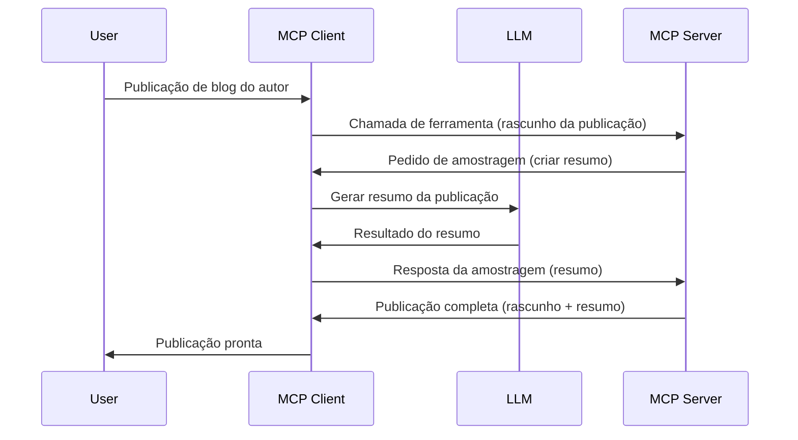

> [OBSOLETO: CANDIDATO A LANÇAMENTO 2026-07-28](https://blog.modelcontextprotocol.io/posts/2026-07-28-release-candidate/)

# Amostragem - delegar funcionalidades ao Cliente

> **Aviso de descontinuação:** o candidato a lançamento da especificação MCP `2026-07-28` marca a Amostragem como obsoleta em favor da integração direta com APIs dos fornecedores de LLM. A Amostragem continua a funcionar em `2025-11-25` e pelo menos durante um ano após qualquer descontinuação formal, pelo que tudo nesta lição permanece válido — mas novos designs de servidor devem avaliar o padrão de substituição. Veja [O que está a mudar no MCP: o candidato a lançamento 2026-07-28](../../01-CoreConcepts/mcp-2026-07-28-release-candidate.md).

Por vezes, é necessário que o Cliente MCP e o Servidor MCP colaborem para alcançar um objetivo comum. Pode haver um caso em que o Servidor necessita da ajuda de um LLM que esteja no cliente. Para esta situação, a amostragem é o que deve usar.

Vamos explorar alguns casos de uso e como construir uma solução envolvendo amostragem.

## Visão Geral

Nesta lição, focamo-nos em explicar quando e onde usar a Amostragem e como a configurar.

## Objetivos de Aprendizagem

Neste capítulo, iremos:

- Explicar o que é a Amostragem e quando a usar.
- Mostrar como configurar a Amostragem no MCP.
- Fornecer exemplos da Amostragem em ação.

## O que é a Amostragem e porque usá-la?

A Amostragem é uma funcionalidade avançada que funciona da seguinte forma:



### Pedido de amostragem

Ok, agora que temos uma visão geral de um cenário credível, vamos falar sobre o pedido de amostragem que o servidor envia de volta para o cliente. Aqui está como tal pedido pode parecer no formato JSON-RPC:

```json
{
  "jsonrpc": "2.0",
  "id": 1,
  "method": "sampling/createMessage",
  "params": {
    "messages": [
      {
        "role": "user",
        "content": {
          "type": "text",
          "text": "Create a blog post summary of the following blog post: <BLOG POST>"
        }
      }
    ],
    "modelPreferences": {
      "hints": [
        {
          "name": "claude-3-sonnet"
        }
      ],
      "intelligencePriority": 0.8,
      "speedPriority": 0.5
    },
    "systemPrompt": "You are a helpful assistant.",
    "maxTokens": 100
  }
}
```

Há algumas coisas aqui que valem a pena destacar:

- O Prompt, em content -> text, é o nosso prompt que é uma instrução para o LLM resumir o conteúdo do post do blog.

- **modelPreferences**. Esta seção é exatamente isso, uma preferência, uma recomendação de qual configuração usar com o LLM. O utilizador pode escolher se segue estas recomendações ou as altera. Neste caso existem recomendações sobre o modelo a usar, velocidade e prioridade de inteligência.
- **systemPrompt**, este é o seu prompt normal do sistema que dá ao seu LLM uma personalidade e contém instruções de orientação.
- **maxTokens**, esta é outra propriedade usada para indicar quantos tokens são recomendados para esta tarefa.

### Resposta de amostragem

Esta resposta é o que o Cliente MCP acaba por enviar de volta para o Servidor MCP e resulta do cliente chamar o LLM, aguardar essa resposta e depois construir esta mensagem. Aqui está como pode parecer em JSON-RPC:

```json
{
  "jsonrpc": "2.0",
  "id": 1,
  "result": {
    "role": "assistant",
    "content": {
      "type": "text",
      "text": "Here's your abstract <ABSTRACT>"
    },
    "model": "gpt-5",
    "stopReason": "endTurn"
  }
}
```

Note como a resposta é um resumo do post do blog exatamente como pedimos. Note também como o `model` usado não é o que pedimos, mas "gpt-5" em vez de "claude-3-sonnet". Isto é para ilustrar que o utilizador pode mudar de opinião sobre o que usar e que o seu pedido de amostragem é uma recomendação.

Ok, agora que entendemos o fluxo principal e uma tarefa útil para usar: "criação de post de blog + resumo", vamos ver o que precisamos fazer para colocar isto a funcionar.

### Tipos de mensagem

As mensagens de amostragem não estão limitadas apenas a texto, pode também enviar imagens e áudio. Aqui está como o JSON-RPC é diferente:

**Texto**

```json
{
  "type": "text",
  "text": "The message content"
}
```

**Conteúdo de imagem**

```json
{
  "type": "image",
  "data": "base64-encoded-image-data",
  "mimeType": "image/jpeg"
}
```

**Conteúdo de áudio**

```json
{
  "type": "audio",
  "data": "base64-encoded-audio-data",
  "mimeType": "audio/wav"
}
```

> NOTA: para mais informações detalhadas sobre Amostragem, consulte a [documentação oficial](https://modelcontextprotocol.io/specification/2025-11-25/client/sampling)

## Como Configurar a Amostragem no Cliente

> Nota: se estiver a construir apenas um servidor, não precisa de fazer muito aqui.

Num cliente, deve especificar a seguinte funcionalidade desta forma:

```json
{
  "capabilities": {
    "sampling": {}
  }
}
```

Isto será depois incorporado quando o seu cliente escolhido iniciar com o servidor.

## Exemplo de Amostragem em Ação - Criar um Post de Blog

Vamos codificar um servidor de amostragem juntos, teremos de fazer o seguinte:

1. Criar uma ferramenta no Servidor.
1. Essa ferramenta deve criar um pedido de amostragem
1. A ferramenta deve aguardar a resposta do pedido de amostragem do cliente.
1. Depois o resultado da ferramenta deve ser produzido.

Vamos ver o código passo a passo:

### -1- Criar a ferramenta

**python**

```python
@mcp.tool()
async def create_blog(title: str, content: str, ctx: Context[ServerSession, None]) -> str:
    """Create a blog post and generate a summary"""

```

### -2- Criar um pedido de amostragem

Estenda a sua ferramenta com o seguinte código:

**python**

```python
post = BlogPost(
        id=len(posts) + 1,
        title=title,
        content=content,
        abstract=""
    )

prompt = f"Create an abstract of the following blog post: title: {title} and draft: {content} "

result = await ctx.session.create_message(
        messages=[
            SamplingMessage(
                role="user",
                content=TextContent(type="text", text=prompt),
            )
        ],
        max_tokens=100,
)

```

### -3- Aguarde a resposta e retorne a resposta

**python**

```python
post.abstract = result.content.text

posts.append(post)

# retorna o produto completo
return json.dumps({
    "id": post.title,
    "abstract": post.abstract
})
```

### -4- Código completo

**python**

```python
from starlette.applications import Starlette
from starlette.routing import Mount, Host

from mcp.server.fastmcp import Context, FastMCP

from mcp.server.session import ServerSession
from mcp.types import SamplingMessage, TextContent

import json


from uuid import uuid4
from typing import List
from pydantic import BaseModel


mcp = FastMCP("Blog post generator")

# app = FastAPI()

posts = []

class BlogPost(BaseModel):
    id: int
    title: str
    content: str
    abstract: str

posts: List[BlogPost] = []

@mcp.tool()
async def create_blog(title: str, content: str, ctx: Context[ServerSession, None]) -> str:
    """Create a blog post and generate a summary"""

    post = BlogPost(
        id=len(posts) + 1,
        title=title,
        content=content,
        abstract=""
    )

    prompt = f"Create an abstract of the following blog post: title: {title} and draft: {content} "

    result = await ctx.session.create_message(
        messages=[
            SamplingMessage(
                role="user",
                content=TextContent(type="text", text=prompt),
            )
        ],
        max_tokens=100,
    )

    post.abstract = result.content.text

    posts.append(post)

    # retorna o post completo do blog
    return json.dumps({
        "id": post.title,
        "abstract": post.abstract
    })

if __name__ == "__main__":
    print("Starting server...")
    # mcp.run()
    mcp.run(transport="streamable-http")

# execute a app com: python server.py
```

### -5- Testar no Visual Studio Code

Para testar isto no Visual Studio Code, faça o seguinte:

1. Inicie o servidor no terminal
1. Adicione-o ao *mcp.json* (e assegure-se de que está iniciado) algo assim:

   ```json
   "servers": {
      "blog-server": {
        "type": "http",
        "url": "http://localhost:8000/mcp"
      }
   }
   ```

1. Escreva um prompt:

   ```text
   create a blog post named "Where Python comes from", the content is "Python is actually named after Monty Python Flying Circus"
   ```

1. Permita que a amostragem aconteça. Na primeira vez que testar isto será apresentado um diálogo adicional que terá de aceitar, depois verá o diálogo normal a pedir que execute uma ferramenta

1. Inspecione os resultados. Verá os resultados apresentados de forma agradável no GitHub Copilot Chat, mas também pode inspecionar a resposta JSON bruta.

**Bónus**. As ferramentas do Visual Studio Code têm excelente suporte para amostragem. Pode configurar o acesso à Amostragem no seu servidor instalado navegando assim:

1. Navegue para a secção de extensões.
1. Selecione o ícone de engrenagem para o seu servidor instalado na secção "MCP SERVERS - INSTALLED".
1 Selecione "Configurar Acesso ao Modelo", aqui pode selecionar quais os Modelos que o GitHub Copilot pode usar durante a amostragem. Também pode ver todos os pedidos de amostragem recentes selecionando "Mostrar pedidos de Amostragem".

## Tarefa

Nesta tarefa, vai construir uma Amostragem ligeiramente diferente, ou seja, uma integração de amostragem que suporte a geração de uma descrição de produto. Aqui está o seu cenário:

**Cenário**: O trabalhador do back office num e-commerce precisa de ajuda, demora demasiado tempo a gerar descrições de produtos. Por isso, tem de construir uma solução onde possa chamar uma ferramenta "create_product" com "title" e "keywords" como argumentos e esta deve produzir um produto completo incluindo um campo "description" que deve ser preenchido por um LLM do cliente.

DICA: use o que aprendeu anteriormente para construir este servidor e a sua ferramenta usando um pedido de amostragem.

## Solução

[Solução](./solution/README.md)

## Principais Conclusões

A Amostragem é uma funcionalidade poderosa que permite ao servidor delegar tarefas ao cliente quando precisa da ajuda de um LLM.

## O que vem a seguir

- [Capítulo 4 - Implementação prática](../../04-PracticalImplementation/README.md)

---

<!-- CO-OP TRANSLATOR DISCLAIMER START -->
**Aviso Legal**:
Este documento foi traduzido utilizando o serviço de tradução automática [Co-op Translator](https://github.com/Azure/co-op-translator). Embora nos esforcemos pela precisão, esteja ciente de que traduções automáticas podem conter erros ou imprecisões. O documento original na sua língua nativa deve ser considerado a fonte autorizada. Para informações críticas, recomenda-se tradução profissional humana. Não nos responsabilizamos por quaisquer mal-entendidos ou interpretações incorretas resultantes da utilização desta tradução.
<!-- CO-OP TRANSLATOR DISCLAIMER END -->