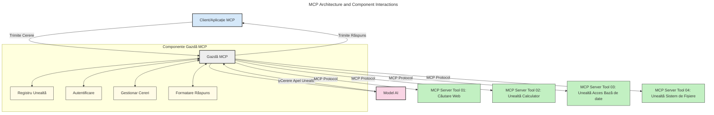
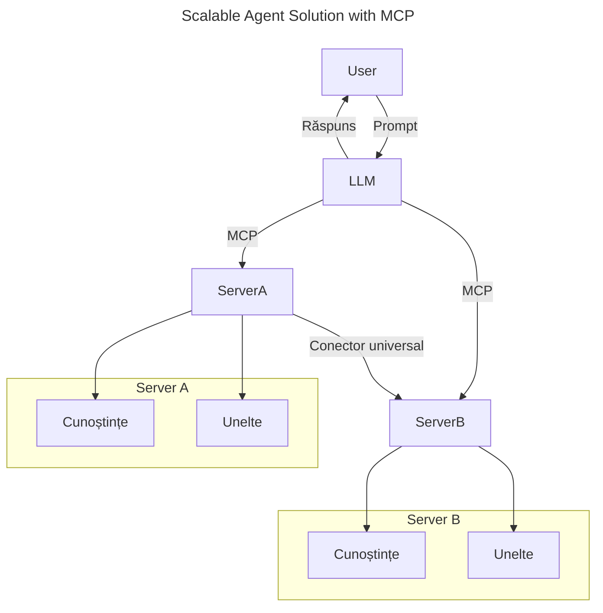
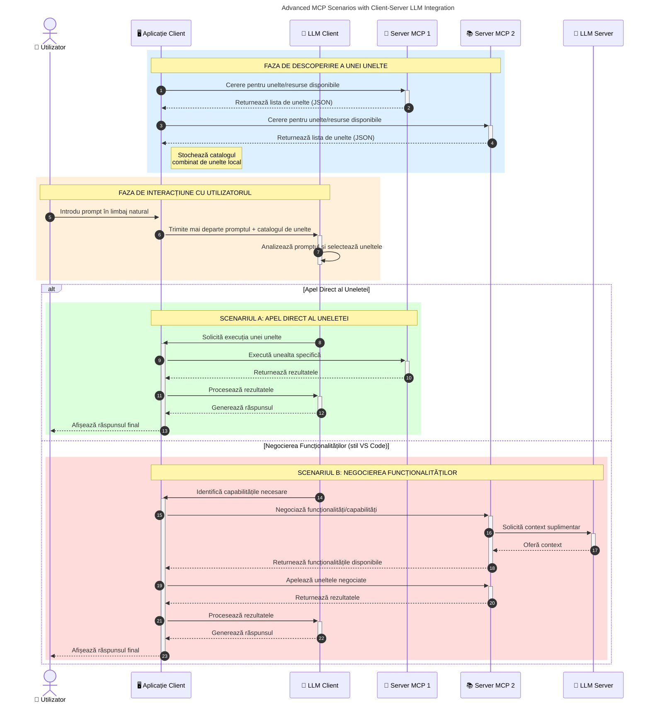

# Introducere în Model Context Protocol (MCP): De ce este important pentru aplicațiile AI scalabile

_(Faceți clic pe imaginea de mai sus pentru a viziona videoclipul acestei lecții)_

Aplicațiile AI generative reprezintă un pas important înainte, deoarece adesea permit utilizatorului să interacționeze cu aplicația folosind comenzi în limbaj natural. Totuși, pe măsură ce se investesc mai mult timp și resurse în astfel de aplicații, vrei să te asiguri că poți integra cu ușurință funcționalități și resurse într-un mod care să fie ușor de extins, ca aplicația ta să poată suporta mai mult de un model folosit și să gestioneze diverse subtilități ale modelelor. Pe scurt, construirea aplicațiilor Gen AI este ușoară la început, dar pe măsură ce acestea cresc și devin mai complexe, trebuie să începi să definești o arhitectură și probabil va fi nevoie să te bazezi pe un standard pentru a asigura că aplicațiile tale sunt construite într-un mod consistent. Aici intervine MCP pentru a organiza lucrurile și a oferi un standard.

---

## **🔍 Ce este Model Context Protocol (MCP)?**

**Model Context Protocol (MCP)** este o **interfață deschisă, standardizată** care permite modelelor de limbaj mare (LLM-uri) să interacționeze fără întreruperi cu unelte externe, API-uri și surse de date. Oferă o arhitectură consistentă pentru a îmbunătăți funcționalitatea modelelor AI dincolo de datele lor de antrenament, permițând sisteme AI mai inteligente, scalabile și mai responsive.

---

## **🎯 Importanța standardizării în AI**

Pe măsură ce aplicațiile AI generative devin mai complexe, este esențial să adopți standarde care să asigure **scalabilitatea, extensibilitatea, întreținerea** și **evitarea dependenței de un singur furnizor**. MCP abordează aceste nevoi prin:

- Unificarea integrărilor model-unelte
- Reducerea soluțiilor personalizate fragile și unice
- Permisiunea ca mai multe modele de la diferiți furnizori să coexiste în același ecosistem

**Notă:** Deși MCP se prezintă ca un standard deschis, nu există planuri pentru standardizarea MCP prin organisme de standardizare existente precum IEEE, IETF, W3C, ISO sau orice alt organism de standardizare.

---

## **📚 Obiectivele de învățare**

Până la finalul acestui articol, vei fi capabil să:

- Definiți **Model Context Protocol (MCP)** și cazurile sale de utilizare
- Înțelegeți cum MCP standardizează comunicarea model-unealtă
- Identificați componentele de bază ale arhitecturii MCP
- Explorați aplicații din lumea reală ale MCP în contexte de întreprinderi și dezvoltare

---

## **💡 De ce Model Context Protocol (MCP) este revoluționar**

### **🔗 MCP rezolvă fragmentarea în interacțiunile AI**

Înainte de MCP, integrarea modelelor cu unelte necesită:

- Cod personalizat pentru fiecare pereche unealtă-model
- API-uri non-standard pentru fiecare furnizor
- Avem întreruperi frecvente din cauza actualizărilor
- Scalabilitate slabă la adăugarea mai multor unelte

### **✅ Beneficiile standardizării MCP**

| **Beneficiu**              | **Descriere**                                                                 |
|---------------------------|-------------------------------------------------------------------------------|
| Interoperabilitate        | LLM-urile lucrează perfect cu unelte de la diferiți furnizori                |
| Consistență               | Comportament uniform între platforme și unelte                              |
| Reutilizabilitate         | Uneltele construite o dată pot fi utilizate în mai multe proiecte și sisteme |
| Dezvoltare accelerată     | Se reduce timpul de dezvoltare folosind interfețe standard, plug-and-play    |

---

## **🧱 Prezentare generală a arhitecturii MCP la nivel înalt**

MCP urmează un **model client-server**, unde:

- **Gazdele MCP** rulează modelele AI
- **Clienții MCP** inițiază cererile
- **Serverele MCP** oferă context, unelte și capabilități

### **Componente cheie:**

- **Resurse** – Date statice sau dinamice pentru modele  
- **Comenzi** – Fluxuri de lucru predefinite pentru generare ghidată  
- **Unelte** – Funcții executabile precum căutare, calcule  
- **Eșantionare** – Comportament agentic prin interacțiuni recursive (învechit în candidatul pentru lansare `2026-07-28`)
- **Solicitări** – Cereri inițiate de server pentru inputul utilizatorului
- **Rădăcini** – Limitele sistemului de fișiere pentru controlul accesului serverului (învechit în candidatul pentru lansare `2026-07-28`)

### **Arhitectura protocolului:**

MCP folosește o arhitectură cu două straturi:
- **Stratul de date**: Comunicare bazată pe JSON-RPC 2.0 cu managementul ciclului de viață și primitive
- **Stratul de transport**: Canale de comunicare STDIO (local) și HTTP Streamable cu SSE (remote)

---

## Cum funcționează Serverele MCP

Serverele MCP operează în următorul mod:

- **Fluxul cererii**:
    1. O cerere este inițiată de un utilizator final sau de un software care acționează în numele său.
    2. **Clientul MCP** trimite cererea către un **Gazdă MCP**, care gestionează rularea Modelului AI.
    3. **Modelul AI** primește comanda utilizatorului și poate solicita acces la unelte externe sau date prin una sau mai multe apeluri de unelte.
    4. **Gazda MCP**, nu modelul direct, comunică cu **Serverul/Serverele MCP** potrivite folosind protocolul standardizat.
- **Funcționalitatea Gazdei MCP**:
    - **Registrul Uneltelor**: Menține un catalog al uneltelor disponibile și al capabilităților lor.
    - **Autentificare**: Verifică permisiunile de acces la unelte.
    - **Gestionarea Cererilor**: Procesează cererile de unelte primite de la model.
    - **Formatator Răspunsuri**: Structurează rezultatele uneltelor într-un format pe care modelul îl poate înțelege.
- **Executarea pe Serverul MCP**:
    - **Gazda MCP** direcționează apelurile către una sau mai multe **Servere MCP**, fiecare oferind funcții specializate (ex: căutare, calcule, interogări baze de date).
    - **Serverele MCP** își îndeplinesc respectivele operațiuni și returnează rezultatele către **Gazda MCP** într-un format consistent.
    - **Gazda MCP** formatează și transmite aceste rezultate către **Modelul AI**.
- **Finalizarea răspunsului**:
    - **Modelul AI** încorporează rezultatele uneltelor într-un răspuns final.
    - **Gazda MCP** trimite acest răspuns înapoi către **Clientul MCP**, care îl livrează utilizatorului final sau software-ului care a făcut apelul.
    

## 👨‍💻 Cum să construiești un server MCP (cu exemple)

Serverele MCP îți permit să extinzi capabilitățile LLM-urilor oferind date și funcționalitate.

Pregătit să încerci? Iată SDK-uri specifice limbajului și/sau stack-ului cu exemple de creare a unor servere MCP simple în diferite limbaje/stack-uri:

- **Python SDK**: https://github.com/modelcontextprotocol/python-sdk

- **TypeScript SDK**: https://github.com/modelcontextprotocol/typescript-sdk

- **Java SDK**: https://github.com/modelcontextprotocol/java-sdk

- **C#/.NET SDK**: https://github.com/modelcontextprotocol/csharp-sdk

## 🌍 Cazuri de utilizare din lumea reală pentru MCP

MCP permite o gamă largă de aplicații prin extinderea capabilităților AI:

| **Aplicație**                | **Descriere**                                                                |
|-----------------------------|-------------------------------------------------------------------------------|
| Integrare date în întreprinderi | Conectează LLM-uri la baze de date, CRM-uri sau unelte interne                |
| Sisteme AI agentice          | Permite agenților autonomi acces la unelte și fluxuri decizionale             |
| Aplicații multimodale        | Combină unelte pentru text, imagine și audio într-o singură aplicație AI unificată |
| Integrare date în timp real  | Adu date live în interacțiunile AI pentru rezultate mai exacte și actuale     |

### 🧠 MCP = Standard universal pentru interacțiunile AI

Model Context Protocol (MCP) acționează ca un standard universal pentru interacțiunile AI, similar modului în care USB-C a standardizat conexiunile fizice pentru dispozitive. În lumea AI, MCP oferă o interfață consistentă, permițând modelelor (client) să se integreze fără probleme cu uneltele externe și furnizorii de date (servere). Aceasta elimină nevoia unor protocoale diverse, personalizate pentru fiecare API sau sursa de date.

În cadrul MCP, o unealtă compatibilă MCP (numită server MCP) urmează un standard unificat. Aceste servere pot lista uneltele sau acțiunile oferite și execută aceste acțiuni când sunt solicitate de un agent AI. Platformele agent AI care suportă MCP pot descoperi uneltele disponibile de la servere și le pot invoca prin acest protocol standard.

### 💡 Facilitează accesul la cunoștințe

Dincolo de oferirea uneltelor, MCP facilitează și accesul la cunoaștere. Permite aplicațiilor să ofere context modelelor de limbaj mare (LLM) prin conectarea lor la diverse surse de date. De exemplu, un server MCP poate reprezenta un depozit de documente al unei companii, permițând agenților să extragă informații relevante la cerere. Un alt server ar putea gestiona acțiuni specifice precum trimiterea de emailuri sau actualizarea înregistrărilor. Din perspectiva agentului, acestea sunt doar unelte ce pot fi folosite – unele unelte furnizează date (context de cunoaștere), iar altele execută acțiuni. MCP gestionează eficient ambele.

Un agent care se conectează la un server MCP învață automat capabilitățile disponibile ale serverului și datele accesibile printr-un format standard. Această standardizare permite disponibilitatea dinamică a uneltelor. De exemplu, adăugarea unui nou server MCP în sistemul agentului face ca funcțiile sale să fie imediat utilizabile fără a necesita personalizări suplimentare ale instrucțiunilor agentului.

Această integrare simplificată se aliniază cu fluxul ilustrat în diagrama următoare, unde serverele oferă atât unelte cât și cunoaștere, asigurând colaborare fără întreruperi între sisteme.

### 👉 Exemplu: Soluție agent scalabilă

Connectorul Universal permite serverelor MCP să comunice și să partajeze capabilități între ele, permițând ServerA să delege sarcini către ServerB sau să acceseze uneltele și cunoștințele acestuia. Aceasta federare a uneltelor și datelor între servere susține arhitecturi agentice scalabile și modulare. Deoarece MCP standardizează expunerea uneltelor, agenții pot descoperi și direcționa dinamic cererile între servere fără integrări codate manual.

Federarea uneltelor și cunoștințelor: Uneltele și datele pot fi accesate prin servere diferite, permițând arhitecturi agentice mai scalabile și modulare.

### 🔄 Scenarii avansate MCP cu integrarea LLM pe partea clientului

Dincolo de arhitectura MCP de bază, există scenarii avansate unde atât clientul, cât și serverul conțin LLM-uri, permițând interacțiuni mai sofisticate. În diagrama următoare, **Aplicația Client** ar putea fi un IDE cu un număr de unelte MCP disponibile pentru utilizarea de către LLM:

## 🔐 Beneficii practice ale MCP

Iată beneficiile practice ale utilizării MCP:

- **Actualitate**: Modelele pot accesa informații actualizate dincolo de datele lor de antrenament
- **Extinderea capacităților**: Modelele pot folosi unelte specializate pentru sarcini pentru care nu au fost antrenate
- **Reducerea halucinațiilor**: Sursele externe de date oferă o bază factuală
- **Confidențialitate**: Datele sensibile pot rămâne în medii securizate în loc să fie încorporate în comenzi

## 📌 Concluzii cheie

Următoarele sunt concluzii cheie pentru utilizarea MCP:

- **MCP** standardizează modul în care modelele AI interacționează cu uneltele și datele
- Promovează **extensibilitate, consistență și interoperabilitate**
- MCP ajută la **reducerea timpului de dezvoltare, îmbunătățirea fiabilității și extinderea capacităților modelelor**
- Arhitectura client-server **permite aplicații AI flexibile și extensibile**

## 🧠 Exercițiu

Gândește-te la o aplicație AI pe care dorești să o construiești.

- Ce **unelte externe sau date** ar putea să-i îmbunătățească capabilitățile?
- Cum ar putea MCP să facă integrarea **mai simplă și mai fiabilă?**

## Resurse suplimentare

- [Repository MCP GitHub](https://github.com/modelcontextprotocol)

## Ce urmează

Următor: [Capitolul 1: Concepte de bază](../01-CoreConcepts/README.md)

---

<!-- CO-OP TRANSLATOR DISCLAIMER START -->
**Declinare a responsabilității**:
Acest document a fost tradus folosind serviciul de traducere AI [Co-op Translator](https://github.com/Azure/co-op-translator). În timp ce ne străduim pentru acuratețe, vă rugăm să rețineți că traducerile automate pot conține erori sau inexactități. Documentul original în limba sa nativă trebuie considerat sursa autorizată. Pentru informații critice, se recomandă traducerea profesională realizată de un om. Nu ne asumăm responsabilitatea pentru eventualele neînțelegeri sau interpretări greșite care decurg din utilizarea acestei traduceri.
<!-- CO-OP TRANSLATOR DISCLAIMER END -->