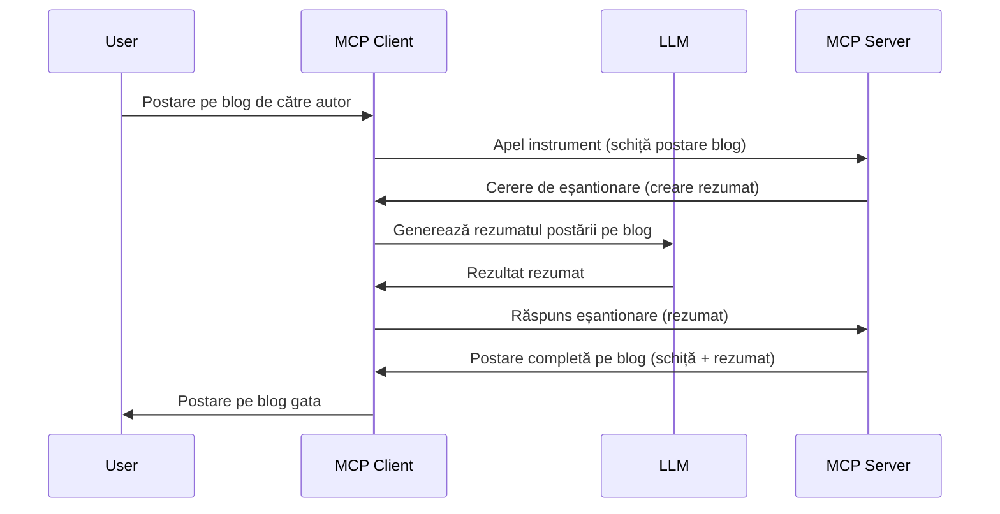

> [DEPRECATED: 2026-07-28 RELEASE CANDIDATE](https://blog.modelcontextprotocol.io/posts/2026-07-28-release-candidate/)

# Sampling - delegarea funcționalităților către Client

> **Notificare de deprecizare:** candidatul de lansare a specificației MCP `2026-07-28` marchează Sampling ca depreciat în favoarea integrării directe cu API-urile furnizorilor LLM. Sampling continuă să funcționeze în `2025-11-25` și cel puțin un an după orice deprecizare formală, astfel că tot ce este în această lecție rămâne valabil — dar noile designuri de server ar trebui să evalueze modelul de înlocuire. Vezi [Ce se schimbă în MCP: Candidatul de lansare 2026-07-28](../../01-CoreConcepts/mcp-2026-07-28-release-candidate.md).

Uneori, ai nevoie ca Clientul MCP și Serverul MCP să colaboreze pentru a atinge un scop comun. Poate exista un caz în care Serverul necesită ajutorul unui LLM care se află pe client. Pentru această situație, sampling este ceea ce ar trebui să folosești.

Să explorăm câteva cazuri de utilizare și cum să construim o soluție implicând sampling.

## Prezentare generală

În această lecție, ne concentrăm pe explicarea când și unde să folosești Sampling și cum să îl configurezi.

## Obiective de învățare

În acest capitol, vom:

- Explica ce este Sampling și când să-l folosești.
- Arăta cum să configurezi Sampling în MCP.
- Oferi exemple de Sampling în acțiune.

## Ce este Sampling și de ce să-l folosești?

Sampling este o funcționalitate avansată care funcționează în felul următor:



### Cererea de Sampling

Ok, acum că avem o vedere de ansamblu a unui scenariu credibil, să discutăm despre cererea de sampling pe care serverul o trimite clientului. Iată cum poate arăta o astfel de cerere în format JSON-RPC:

```json
{
  "jsonrpc": "2.0",
  "id": 1,
  "method": "sampling/createMessage",
  "params": {
    "messages": [
      {
        "role": "user",
        "content": {
          "type": "text",
          "text": "Create a blog post summary of the following blog post: <BLOG POST>"
        }
      }
    ],
    "modelPreferences": {
      "hints": [
        {
          "name": "claude-3-sonnet"
        }
      ],
      "intelligencePriority": 0.8,
      "speedPriority": 0.5
    },
    "systemPrompt": "You are a helpful assistant.",
    "maxTokens": 100
  }
}
```

Sunt câteva lucruri demne de menționat aici:

- Prompt-ul, sub content -> text, este prompt-ul nostru care este o instrucțiune pentru LLM de a rezuma conținutul unei postări de blog.

- **modelPreferences**. Această secțiune este fix asta, o preferință, o recomandare despre ce configurație să folosești cu LLM. Utilizatorul poate alege dacă urmează aceste recomandări sau le schimbă. În acest caz, există recomandări privind modelul de folosit și prioritățile de viteză și inteligență.
- **systemPrompt**, acesta este prompt-ul normal de sistem care oferă LLM-ului tău o personalitate și conține instrucțiuni de ghidare.
- **maxTokens**, această proprietate este folosită pentru a indica câți tokeni sunt recomandați pentru această sarcină.

### Răspunsul la Sampling

Acest răspuns este ceea ce Clientul MCP ajunge să trimită înapoi Serverului MCP și este rezultatul apelului clientului către LLM, așteptarea răspunsului și apoi construirea acestui mesaj. Iată cum poate arăta în JSON-RPC:

```json
{
  "jsonrpc": "2.0",
  "id": 1,
  "result": {
    "role": "assistant",
    "content": {
      "type": "text",
      "text": "Here's your abstract <ABSTRACT>"
    },
    "model": "gpt-5",
    "stopReason": "endTurn"
  }
}
```

Observă cum răspunsul este un rezumat al postării de blog exact cum am cerut. De asemenea, observă cum modelul folosit `model` nu este cel pe care l-am cerut, ci "gpt-5" în loc de "claude-3-sonnet". Acest exemplu ilustrează că utilizatorul poate să își schimbe opinia despre ce să folosească și că cererea ta de sampling este o recomandare.

Ok, acum că înțelegem fluxul principal și o sarcină utilă pentru a-l folosi „crearea postării de blog + rezumat”, să vedem ce trebuie să facem pentru a-l pune în funcțiune.

### Tipuri de mesaje

Mesajele de sampling nu sunt limitate doar la text, ci poți trimite și imagini și audio. Iată cum diferă JSON-RPC-ul:

**Text**

```json
{
  "type": "text",
  "text": "The message content"
}
```

**Conținut imagine**

```json
{
  "type": "image",
  "data": "base64-encoded-image-data",
  "mimeType": "image/jpeg"
}
```

**Conținut audio**

```json
{
  "type": "audio",
  "data": "base64-encoded-audio-data",
  "mimeType": "audio/wav"
}
```

> NOTĂ: pentru informații mai detaliate despre Sampling, consultă [documentația oficială](https://modelcontextprotocol.io/specification/2025-11-25/client/sampling)

## Cum să configurezi Sampling în Client

> Notă: dacă construiești doar un server, nu ai nevoie să faci prea multe aici.

Într-un client, trebuie să specifici această funcționalitate astfel:

```json
{
  "capabilities": {
    "sampling": {}
  }
}
```

Aceasta va fi preluată când clientul ales inițializează conexiunea cu serverul.

## Exemplu de Sampling în Acțiune - Crearea unei Postări de Blog

Să codăm împreună un server de sampling, va trebui să facem următoarele:

1. Creăm un instrument pe Server.
1. Acest instrument trebuie să creeze o cerere de sampling.
1. Instrumentul trebuie să aștepte răspunsul la cererea de sampling a clientului.
1. Apoi să producă rezultatul instrumentului.

Să vedem codul pas cu pas:

### -1- Crearea instrumentului

**python**

```python
@mcp.tool()
async def create_blog(title: str, content: str, ctx: Context[ServerSession, None]) -> str:
    """Create a blog post and generate a summary"""

```

### -2- Crearea unei cereri de sampling

Extinde-ți instrumentul cu următorul cod:

**python**

```python
post = BlogPost(
        id=len(posts) + 1,
        title=title,
        content=content,
        abstract=""
    )

prompt = f"Create an abstract of the following blog post: title: {title} and draft: {content} "

result = await ctx.session.create_message(
        messages=[
            SamplingMessage(
                role="user",
                content=TextContent(type="text", text=prompt),
            )
        ],
        max_tokens=100,
)

```

### -3- Așteaptă răspunsul și returnează răspunsul

**python**

```python
post.abstract = result.content.text

posts.append(post)

# returnează produsul complet
return json.dumps({
    "id": post.title,
    "abstract": post.abstract
})
```

### -4- Cod complet

**python**

```python
from starlette.applications import Starlette
from starlette.routing import Mount, Host

from mcp.server.fastmcp import Context, FastMCP

from mcp.server.session import ServerSession
from mcp.types import SamplingMessage, TextContent

import json


from uuid import uuid4
from typing import List
from pydantic import BaseModel


mcp = FastMCP("Blog post generator")

# app = FastAPI()

posts = []

class BlogPost(BaseModel):
    id: int
    title: str
    content: str
    abstract: str

posts: List[BlogPost] = []

@mcp.tool()
async def create_blog(title: str, content: str, ctx: Context[ServerSession, None]) -> str:
    """Create a blog post and generate a summary"""

    post = BlogPost(
        id=len(posts) + 1,
        title=title,
        content=content,
        abstract=""
    )

    prompt = f"Create an abstract of the following blog post: title: {title} and draft: {content} "

    result = await ctx.session.create_message(
        messages=[
            SamplingMessage(
                role="user",
                content=TextContent(type="text", text=prompt),
            )
        ],
        max_tokens=100,
    )

    post.abstract = result.content.text

    posts.append(post)

    # returnează postarea completă de pe blog
    return json.dumps({
        "id": post.title,
        "abstract": post.abstract
    })

if __name__ == "__main__":
    print("Starting server...")
    # mcp.run()
    mcp.run(transport="streamable-http")

# rulează aplicația cu: python server.py
```

### -5- Testarea în Visual Studio Code

Pentru a testa asta în Visual Studio Code, fă următoarele:

1. Pornește serverul în terminal
1. Adaugă-l în *mcp.json* (și asigură-te că e pornit) ceva de genul:

   ```json
   "servers": {
      "blog-server": {
        "type": "http",
        "url": "http://localhost:8000/mcp"
      }
   }
   ```

1. Scrie un prompt:

   ```text
   create a blog post named "Where Python comes from", the content is "Python is actually named after Monty Python Flying Circus"
   ```

1. Permite sampling-ul. Prima dată când testezi asta, ți se va prezenta un dialog suplimentar pe care va trebui să îl accepți, apoi vei vedea dialogul normal care te întreabă să rulezi un instrument

1. Inspectează rezultatele. Vei vedea rezultatele afișate frumos în GitHub Copilot Chat, dar poți inspecta și răspunsul JSON brut.

**Bonus**. Instrumentele Visual Studio Code au suport excelent pentru sampling. Poți configura accesul Sampling pe serverul instalat navigând astfel:

1. Navighează la secțiunea de extensii.
1. Selectează pictograma de rotiță pentru serverul instalat în secțiunea "MCP SERVERS - INSTALLED".
1 Selectează "Configure Model Access", aici poți selecta modelele pe care GitHub Copilot este permis să le folosească pentru sampling. De asemenea, poți vedea toate cererile de sampling realizate recent selectând "Show Sampling requests".

## Tema

În această temă, vei construi un Sampling ușor diferit, respectiv o integrare de sampling care susține generarea unei descrieri de produs. Iată scenariul tău:

**Scenariu**: Lucrătorul din back office la un magazin online are nevoie de ajutor, îi ia prea mult timp să genereze descrieri de produse. Prin urmare, trebuie să construiești o soluție în care poți apela un instrument "create_product" cu "title" și "keywords" ca argumente și ar trebui să producă un produs complet cu un câmp "description" populat de LLM-ul clientului.

SUGESTIE: folosește ceea ce ai învățat mai devreme pentru a construi acest server și instrumentul său folosind o cerere de sampling.

## Soluție

[Soluție](./solution/README.md)

## Concluzii cheie

Sampling este o caracteristică puternică care permite serverului să delege sarcini clientului când are nevoie de ajutorul unui LLM.

## Ce urmează

- [Capitolul 4 - Implementare practică](../../04-PracticalImplementation/README.md)

---

<!-- CO-OP TRANSLATOR DISCLAIMER START -->
**Declinare a responsabilității**:
Acest document a fost tradus folosind serviciul de traducere AI [Co-op Translator](https://github.com/Azure/co-op-translator). În timp ce ne străduim pentru acuratețe, vă rugăm să rețineți că traducerile automate pot conține erori sau inexactități. Documentul original în limba sa nativă trebuie considerat sursa autorizată. Pentru informații critice, se recomandă traducerea profesională realizată de un om. Nu ne asumăm responsabilitatea pentru eventualele neînțelegeri sau interpretări greșite care decurg din utilizarea acestei traduceri.
<!-- CO-OP TRANSLATOR DISCLAIMER END -->