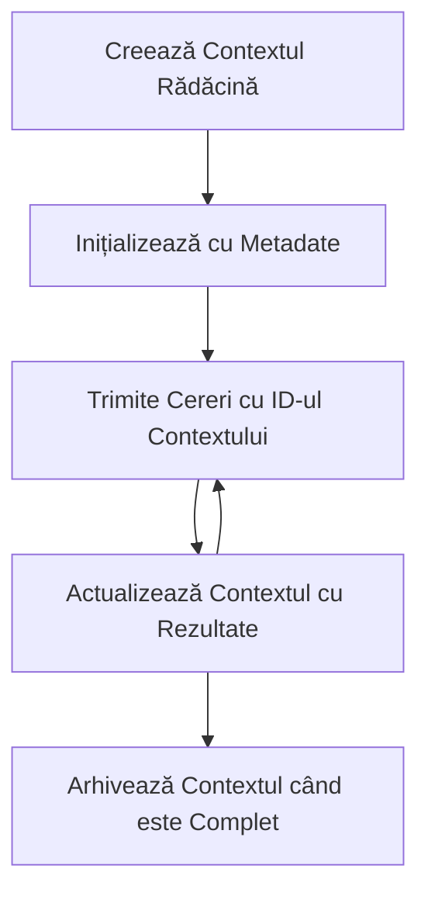

> [DEPRECIAȚI: 2026-07-28 RELEASE CANDIDATE](https://blog.modelcontextprotocol.io/posts/2026-07-28-release-candidate/#roots-sampling-and-logging-are-deprecated)

# Contextul Rădăcină MCP

> **Notificare de depreciere:** candidatul pentru lansarea specificației MCP din `2026-07-28` marchează rădăcinile ca fiind depreciate în favoarea parametrilor instrumentului, URI-urilor resurselor sau configurației serverului. Rădăcinile continuă să funcționeze în `2025-11-25` și cel puțin un an după orice depreciere formală, astfel că tot ce este în această lecție rămâne valid - dar noile proiecte de server ar trebui să evalueze modelul de înlocuire. Vezi [Ce se schimbă în MCP: Candidatul pentru lansarea 2026-07-28](../../01-CoreConcepts/mcp-2026-07-28-release-candidate.md).

Contextul rădăcină este un concept fundamental în Model Context Protocol care oferă un strat persistent pentru menținerea istoricului conversației și a stării partajate pe mai multe solicitări și sesiuni.

## Introducere

În această lecție, vom explora cum să creăm, să gestionăm și să utilizăm contexturile rădăcină în MCP.

## Obiective de învățare

La finalul acestei lecții, vei putea să:

- Înțelegi scopul și structura contexturilor rădăcină
- Creezi și să gestionezi contexturi rădăcină folosind biblioteci client MCP
- Implementezi contexturi rădăcină în aplicații .NET, Java, JavaScript și Python
- Utilizezi contexturi rădăcină pentru conversații multi-turn și managementul stării
- Implementezi bune practici pentru gestionarea contextului rădăcină

## Înțelegerea contexturilor rădăcină

Contexturile rădăcină servesc ca containere care dețin istoricul și starea pentru o serie de interacțiuni înrudite. Ele permit:

- **Persistența conversației**: menținerea coerentă a conversațiilor multi-turn
- **Managementul memoriei**: stocarea și recuperarea informațiilor pe parcursul interacțiunilor
- **Managementul stării**: urmărirea progresului în fluxuri de lucru complexe
- **Partajarea contextului**: permit accesul mai multor clienți la aceeași stare a conversației

În MCP, contexturile rădăcină au aceste caracteristici-cheie:

- Fiecare context rădăcină are un identificator unic.
- Pot conține istoricul conversației, preferințe ale utilizatorului și alte metadate.
- Pot fi create, accesate și arhivate după necesitate.
- Susțin controlul fin al accesului și permisiunilor.

## Ciclu de viață al contextului rădăcină



## Lucrul cu contexturile rădăcină

Iată un exemplu de cum să creezi și să gestionezi contexturi rădăcină.

### Implementare C#

```csharp
// .NET Example: Root Context Management
using Microsoft.Mcp.Client;
using System;
using System.Threading.Tasks;
using System.Collections.Generic;

public class RootContextExample
{
    private readonly IMcpClient _client;
    private readonly IRootContextManager _contextManager;
    
    public RootContextExample(IMcpClient client, IRootContextManager contextManager)
    {
        _client = client;
        _contextManager = contextManager;
    }
    
    public async Task DemonstrateRootContextAsync()
    {
        // 1. Create a new root context
        var contextResult = await _contextManager.CreateRootContextAsync(new RootContextCreateOptions
        {
            Name = "Customer Support Session",
            Metadata = new Dictionary<string, string>
            {
                ["CustomerName"] = "Acme Corporation",
                ["PriorityLevel"] = "High",
                ["Domain"] = "Cloud Services"
            }
        });
        
        string contextId = contextResult.ContextId;
        Console.WriteLine($"Created root context with ID: {contextId}");
        
        // 2. First interaction using the context
        var response1 = await _client.SendPromptAsync(
            "I'm having issues scaling my web service deployment in the cloud.", 
            new SendPromptOptions { RootContextId = contextId }
        );
        
        Console.WriteLine($"First response: {response1.GeneratedText}");
        
        // Second interaction - the model will have access to the previous conversation
        var response2 = await _client.SendPromptAsync(
            "Yes, we're using containerized deployments with Kubernetes.", 
            new SendPromptOptions { RootContextId = contextId }
        );
        
        Console.WriteLine($"Second response: {response2.GeneratedText}");
        
        // 3. Add metadata to the context based on conversation
        await _contextManager.UpdateContextMetadataAsync(contextId, new Dictionary<string, string>
        {
            ["TechnicalEnvironment"] = "Kubernetes",
            ["IssueType"] = "Scaling"
        });
        
        // 4. Get context information
        var contextInfo = await _contextManager.GetRootContextInfoAsync(contextId);
        
        Console.WriteLine("Context Information:");
        Console.WriteLine($"- Name: {contextInfo.Name}");
        Console.WriteLine($"- Created: {contextInfo.CreatedAt}");
        Console.WriteLine($"- Messages: {contextInfo.MessageCount}");
        
        // 5. When the conversation is complete, archive the context
        await _contextManager.ArchiveRootContextAsync(contextId);
        Console.WriteLine($"Archived context {contextId}");
    }
}
```

În codul de mai sus am:

1. Creat un context rădăcină pentru o sesiune de suport client.
1. Trimis mai multe mesaje în cadrul acelui context, permițând modelului să mențină starea.
1. Actualizat contextul cu metadate relevante bazate pe conversație.
1. Obținut informații despre context pentru a înțelege istoricul conversației.
1. Arhivat contextul când conversația a fost terminată.

## Exemplu: Implementarea contextului rădăcină pentru analiza financiară

În acest exemplu, vom crea un context rădăcină pentru o sesiune de analiză financiară, demonstrând cum să menținem starea pe parcursul mai multor interacțiuni.

### Implementare Java

```java
// Exemplu Java: Implementarea Contextului Rădăcină
package com.example.mcp.contexts;

import com.mcp.client.McpClient;
import com.mcp.client.ContextManager;
import com.mcp.models.RootContext;
import com.mcp.models.McpResponse;

import java.util.HashMap;
import java.util.Map;
import java.util.UUID;

public class RootContextsDemo {
    private final McpClient client;
    private final ContextManager contextManager;
    
    public RootContextsDemo(String serverUrl) {
        this.client = new McpClient.Builder()
            .setServerUrl(serverUrl)
            .build();
            
        this.contextManager = new ContextManager(client);
    }
    
    public void demonstrateRootContext() throws Exception {
        // Creează metadatele contextului
        Map<String, String> metadata = new HashMap<>();
        metadata.put("projectName", "Financial Analysis");
        metadata.put("userRole", "Financial Analyst");
        metadata.put("dataSource", "Q1 2025 Financial Reports");
        
        // 1. Creează un nou context rădăcină
        RootContext context = contextManager.createRootContext("Financial Analysis Session", metadata);
        String contextId = context.getId();
        
        System.out.println("Created context: " + contextId);
        
        // 2. Prima interacțiune
        McpResponse response1 = client.sendPrompt(
            "Analyze the trends in Q1 financial data for our technology division",
            contextId
        );
        
        System.out.println("First response: " + response1.getGeneratedText());
        
        // 3. Actualizează contextul cu informații importante obținute din răspuns
        contextManager.addContextMetadata(contextId, 
            Map.of("identifiedTrend", "Increasing cloud infrastructure costs"));
        
        // A doua interacțiune - folosind același context
        McpResponse response2 = client.sendPrompt(
            "What's driving the increase in cloud infrastructure costs?",
            contextId
        );
        
        System.out.println("Second response: " + response2.getGeneratedText());
        
        // 4. Generează un rezumat al sesiunii de analiză
        McpResponse summaryResponse = client.sendPrompt(
            "Summarize our analysis of the technology division financials in 3-5 key points",
            contextId
        );
        
        // Stochează rezumatul în metadatele contextului
        contextManager.addContextMetadata(contextId, 
            Map.of("analysisSummary", summaryResponse.getGeneratedText()));
            
        // Obține informațiile actualizate ale contextului
        RootContext updatedContext = contextManager.getRootContext(contextId);
        
        System.out.println("Context Information:");
        System.out.println("- Created: " + updatedContext.getCreatedAt());
        System.out.println("- Last Updated: " + updatedContext.getLastUpdatedAt());
        System.out.println("- Analysis Summary: " + 
            updatedContext.getMetadata().get("analysisSummary"));
            
        // 5. Arhivează contextul când ai terminat
        contextManager.archiveContext(contextId);
        System.out.println("Context archived");
    }
}
```

În codul precedent am:

1. Creat un context rădăcină pentru o sesiune de analiză financiară.
2. Trimis mai multe mesaje în cadrul acelui context, permițând modelului să mențină starea.
3. Actualizat contextul cu metadate relevante bazate pe conversație.
4. Generat un rezumat al sesiunii de analiză și stocat în metadatele contextului.
5. Arhivat contextul când conversația a fost terminată.

## Exemplu: Managementul contextului rădăcină

Gestionarea eficientă a contexturilor rădăcină este crucială pentru menținerea istoricului și a stării conversației. Mai jos este un exemplu despre cum să implementezi managementul contextului rădăcină.

### Implementare JavaScript

```javascript
// Exemplu JavaScript: Gestionarea contextelor root MCP
const { McpClient, RootContextManager } = require('@mcp/client');

class ContextSession {
  constructor(serverUrl, apiKey = null) {
    // Inițializează clientul MCP
    this.client = new McpClient({
      serverUrl,
      apiKey
    });
    
    // Inițializează managerul de context
    this.contextManager = new RootContextManager(this.client);
  }
  
  /**
   * Create a new conversation context
   * @param {string} sessionName - Name of the conversation session
   * @param {Object} metadata - Additional metadata for the context
   * @returns {Promise<string>} - Context ID
   */
  async createConversationContext(sessionName, metadata = {}) {
    try {
      const contextResult = await this.contextManager.createRootContext({
        name: sessionName,
        metadata: {
          ...metadata,
          createdAt: new Date().toISOString(),
          status: 'active'
        }
      });
      
      console.log(`Created root context '${sessionName}' with ID: ${contextResult.id}`);
      return contextResult.id;
    } catch (error) {
      console.error('Error creating root context:', error);
      throw error;
    }
  }
  
  /**
   * Send a message in an existing context
   * @param {string} contextId - The root context ID
   * @param {string} message - The user's message
   * @param {Object} options - Additional options
   * @returns {Promise<Object>} - Response data
   */
  async sendMessage(contextId, message, options = {}) {
    try {
      // Trimite mesajul folosind contextul specificat
      const response = await this.client.sendPrompt(message, {
        rootContextId: contextId,
        temperature: options.temperature || 0.7,
        allowedTools: options.allowedTools || []
      });
      
      // Opțional, stochează informații importante din conversație
      if (options.storeInsights) {
        await this.storeConversationInsights(contextId, message, response.generatedText);
      }
      
      return {
        message: response.generatedText,
        toolCalls: response.toolCalls || [],
        contextId
      };
    } catch (error) {
      console.error(`Error sending message in context ${contextId}:`, error);
      throw error;
    }
  }
  
  /**
   * Store important insights from a conversation
   * @param {string} contextId - The root context ID
   * @param {string} userMessage - User's message
   * @param {string} aiResponse - AI's response
   */
  async storeConversationInsights(contextId, userMessage, aiResponse) {
    try {
      // Extrage potențiale informații (într-o aplicație reală, ar fi mai sofisticat)
      const combinedText = userMessage + "\n" + aiResponse;
      
      // Heuristică simplă pentru a identifica potențiale informații
      const insightWords = ["important", "key point", "remember", "significant", "crucial"];
      
      const potentialInsights = combinedText
        .split(".")
        .filter(sentence => 
          insightWords.some(word => sentence.toLowerCase().includes(word))
        )
        .map(sentence => sentence.trim())
        .filter(sentence => sentence.length > 10);
      
      // Stochează informațiile în metadatele contextului
      if (potentialInsights.length > 0) {
        const insights = {};
        potentialInsights.forEach((insight, index) => {
          insights[`insight_${Date.now()}_${index}`] = insight;
        });
        
        await this.contextManager.updateContextMetadata(contextId, insights);
        console.log(`Stored ${potentialInsights.length} insights in context ${contextId}`);
      }
    } catch (error) {
      console.warn('Error storing conversation insights:', error);
      // Eroare necritic, deci doar înregistrează un avertisment
    }
  }
  
  /**
   * Get summary information about a context
   * @param {string} contextId - The root context ID
   * @returns {Promise<Object>} - Context information
   */
  async getContextInfo(contextId) {
    try {
      const contextInfo = await this.contextManager.getContextInfo(contextId);
      
      return {
        id: contextInfo.id,
        name: contextInfo.name,
        created: new Date(contextInfo.createdAt).toLocaleString(),
        lastUpdated: new Date(contextInfo.lastUpdatedAt).toLocaleString(),
        messageCount: contextInfo.messageCount,
        metadata: contextInfo.metadata,
        status: contextInfo.status
      };
    } catch (error) {
      console.error(`Error getting context info for ${contextId}:`, error);
      throw error;
    }
  }
  
  /**
   * Generate a summary of the conversation in a context
   * @param {string} contextId - The root context ID
   * @returns {Promise<string>} - Generated summary
   */
  async generateContextSummary(contextId) {
    try {
      // Cere modelului să genereze un rezumat al conversației de până acum
      const response = await this.client.sendPrompt(
        "Please summarize our conversation so far in 3-4 sentences, highlighting the main points discussed.",
        { rootContextId: contextId, temperature: 0.3 }
      );
      
      // Stochează rezumatul în metadatele contextului
      await this.contextManager.updateContextMetadata(contextId, {
        conversationSummary: response.generatedText,
        summarizedAt: new Date().toISOString()
      });
      
      return response.generatedText;
    } catch (error) {
      console.error(`Error generating context summary for ${contextId}:`, error);
      throw error;
    }
  }
  
  /**
   * Archive a context when it's no longer needed
   * @param {string} contextId - The root context ID
   * @returns {Promise<Object>} - Result of the archive operation
   */
  async archiveContext(contextId) {
    try {
      // Generează un rezumat final înainte de arhivare
      const summary = await this.generateContextSummary(contextId);
      
      // Arhivează contextul
      await this.contextManager.archiveContext(contextId);
      
      return {
        status: "archived",
        contextId,
        summary
      };
    } catch (error) {
      console.error(`Error archiving context ${contextId}:`, error);
      throw error;
    }
  }
}

// Exemplu de utilizare
async function demonstrateContextSession() {
  const session = new ContextSession('https://mcp-server-example.com');
  
  try {
    // 1. Creează un nou context pentru o conversație de suport produs
    const contextId = await session.createConversationContext(
      'Product Support - Database Performance',
      {
        customer: 'Globex Corporation',
        product: 'Enterprise Database',
        severity: 'Medium',
        supportAgent: 'AI Assistant'
      }
    );
    
    // 2. Primul mesaj în conversație
    const response1 = await session.sendMessage(
      contextId,
      "I'm experiencing slow query performance on our database cluster after the latest update.",
      { storeInsights: true }
    );
    console.log('Response 1:', response1.message);
    
    // Mesaj de urmărire în același context
    const response2 = await session.sendMessage(
      contextId,
      "Yes, we've already checked the indexes and they seem to be properly configured.",
      { storeInsights: true }
    );
    console.log('Response 2:', response2.message);
    
    // 3. Obține informații despre context
    const contextInfo = await session.getContextInfo(contextId);
    console.log('Context Information:', contextInfo);
    
    // 4. Generează și afișează rezumatul conversației
    const summary = await session.generateContextSummary(contextId);
    console.log('Conversation Summary:', summary);
    
    // 5. Arhivează contextul când ai terminat
    const archiveResult = await session.archiveContext(contextId);
    console.log('Archive Result:', archiveResult);
    
    // 6. Gestionează orice erori cu grație
  } catch (error) {
    console.error('Error in context session demonstration:', error);
  }
}

demonstrateContextSession();
```

În codul precedent am:

1. Creat un context rădăcină pentru o conversație de suport produs cu funcția `createConversationContext`. În acest caz, contextul este despre probleme de performanță a bazei de date.

1. Trimis mai multe mesaje în cadrul acelui context, permițând modelului să mențină starea cu funcția `sendMessage`. Mesajele trimise sunt despre performanța interogărilor lente și configurarea indexului.

1. Actualizat contextul cu metadate relevante bazate pe conversație.

1. Generat un rezumat al conversației și stocat în metadatele contextului cu funcția `generateContextSummary`.

1. Arhivat contextul când conversația a fost terminată cu funcția `archiveContext`.

1. Gestionat erorile cu grație pentru a asigura robustetea.

## Context rădăcină pentru asistență multi-turn

În acest exemplu, vom crea un context rădăcină pentru o sesiune de asistență multi-turn, demonstrând cum să menținem starea pe parcursul mai multor interacțiuni.

### Implementare Python

```python
# Exemplu Python: Context rădăcină pentru asistență multi-turn
import asyncio
from datetime import datetime
from mcp_client import McpClient, RootContextManager

class AssistantSession:
    def __init__(self, server_url, api_key=None):
        self.client = McpClient(server_url=server_url, api_key=api_key)
        self.context_manager = RootContextManager(self.client)
    
    async def create_session(self, name, user_info=None):
        """Create a new root context for an assistant session"""
        metadata = {
            "session_type": "assistant",
            "created_at": datetime.now().isoformat(),
        }
        
        # Adaugă informații despre utilizator dacă sunt furnizate
        if user_info:
            metadata.update({f"user_{k}": v for k, v in user_info.items()})
            
        # Creează contextul rădăcină
        context = await self.context_manager.create_root_context(name, metadata)
        return context.id
    
    async def send_message(self, context_id, message, tools=None):
        """Send a message within a root context"""
        # Creează opțiuni cu ID-ul contextului
        options = {
            "root_context_id": context_id
        }
        
        # Adaugă unelte dacă sunt specificate
        if tools:
            options["allowed_tools"] = tools
        
        # Trimite promptul în cadrul contextului
        response = await self.client.send_prompt(message, options)
        
        # Actualizează metadatele contextului cu progresul conversației
        await self.context_manager.update_context_metadata(
            context_id,
            {
                f"message_{datetime.now().timestamp()}": message[:50] + "...",
                "last_interaction": datetime.now().isoformat()
            }
        )
        
        return response
    
    async def get_conversation_history(self, context_id):
        """Retrieve conversation history from a context"""
        context_info = await self.context_manager.get_context_info(context_id)
        messages = await self.client.get_context_messages(context_id)
        
        return {
            "context_info": context_info,
            "messages": messages
        }
    
    async def end_session(self, context_id):
        """End an assistant session by archiving the context"""
        # Generează mai întâi un prompt de rezumat
        summary_response = await self.client.send_prompt(
            "Please summarize our conversation and any key points or decisions made.",
            {"root_context_id": context_id}
        )
        
        # Stochează rezumatul în metadate
        await self.context_manager.update_context_metadata(
            context_id,
            {
                "summary": summary_response.generated_text,
                "ended_at": datetime.now().isoformat(),
                "status": "completed"
            }
        )
        
        # Arhivează contextul
        await self.context_manager.archive_context(context_id)
        
        return {
            "status": "completed",
            "summary": summary_response.generated_text
        }

# Exemplu de utilizare
async def demo_assistant_session():
    assistant = AssistantSession("https://mcp-server-example.com")
    
    # 1. Crează sesiunea
    context_id = await assistant.create_session(
        "Technical Support Session",
        {"name": "Alex", "technical_level": "advanced", "product": "Cloud Services"}
    )
    print(f"Created session with context ID: {context_id}")
    
    # 2. Prima interacțiune
    response1 = await assistant.send_message(
        context_id, 
        "I'm having trouble with the auto-scaling feature in your cloud platform.",
        ["documentation_search", "diagnostic_tool"]
    )
    print(f"Response 1: {response1.generated_text}")
    
    # A doua interacțiune în același context
    response2 = await assistant.send_message(
        context_id,
        "Yes, I've already checked the configuration settings you mentioned, but it's still not working."
    )
    print(f"Response 2: {response2.generated_text}")
    
    # 3. Obține istoricul
    history = await assistant.get_conversation_history(context_id)
    print(f"Session has {len(history['messages'])} messages")
    
    # 4. Încheie sesiunea
    end_result = await assistant.end_session(context_id)
    print(f"Session ended with summary: {end_result['summary']}")

if __name__ == "__main__":
    asyncio.run(demo_assistant_session())
```

În codul precedent am:

1. Creat un context rădăcină pentru o sesiune de suport tehnic cu funcția `create_session`. Contextul include informații despre utilizator, cum ar fi numele și nivelul tehnic.

1. Trimis mai multe mesaje în cadrul acelui context, permițând modelului să mențină starea cu funcția `send_message`. Mesajele trimise sunt despre probleme cu funcția de auto-scalare.

1. Obținut istoricul conversației folosind funcția `get_conversation_history`, care oferă informații despre context și mesaje.

1. Încheiat sesiunea prin arhivarea contextului și generarea unui rezumat cu funcția `end_session`. Rezumatul surprinde punctele cheie din conversație.

## Bune practici pentru contextul rădăcină

Iată câteva bune practici pentru gestionarea eficientă a contexturilor rădăcină:

- **Creează contexte concentrate**: Creează contexte rădăcină separate pentru scopuri sau domenii diferite ale conversației pentru a menține claritatea.

- **Stabilește politici de expirare**: Implementează politici pentru arhivarea sau ștergerea contextelor vechi pentru a gestiona spațiul de stocare și a respecta politicile de păstrare a datelor.

- **Stochează metadate relevante**: Folosește metadatele contextului pentru a stoca informații importante despre conversație care ar putea fi utile ulterior.

- **Folosește ID-urile contextelor consistent**: Odată creat un context, folosește ID-ul său în mod consecvent pentru toate solicitările aferente pentru a menține continuitatea.

- **Generează rezumate**: Atunci când un context devine mare, ia în considerare generarea de rezumate pentru a surprinde informațiile esențiale și a gestiona dimensiunea contextului.

- **Implementează controlul accesului**: Pentru sisteme multi-utilizator, implementează controale de acces adecvate pentru a asigura confidențialitatea și securitatea contextelor conversației.

- **Gestionează limitările contextului**: Fii conștient de limitările dimensiunii contextului și implementează strategii pentru gestionarea conversațiilor foarte lungi.

- **Arhivează când este complet**: Arhivează contexte atunci când conversațiile sunt finalizate pentru a elibera resurse, păstrând în același timp istoricul conversației.

## Ce urmează

- [5.5 Ruting](../mcp-routing/README.md)

---

<!-- CO-OP TRANSLATOR DISCLAIMER START -->
**Declinare a responsabilității**:
Acest document a fost tradus folosind serviciul de traducere AI [Co-op Translator](https://github.com/Azure/co-op-translator). În timp ce ne străduim pentru acuratețe, vă rugăm să rețineți că traducerile automate pot conține erori sau inexactități. Documentul original în limba sa nativă trebuie considerat sursa autorizată. Pentru informații critice, se recomandă traducerea profesională realizată de un om. Nu ne asumăm responsabilitatea pentru eventualele neînțelegeri sau interpretări greșite care decurg din utilizarea acestei traduceri.
<!-- CO-OP TRANSLATOR DISCLAIMER END -->