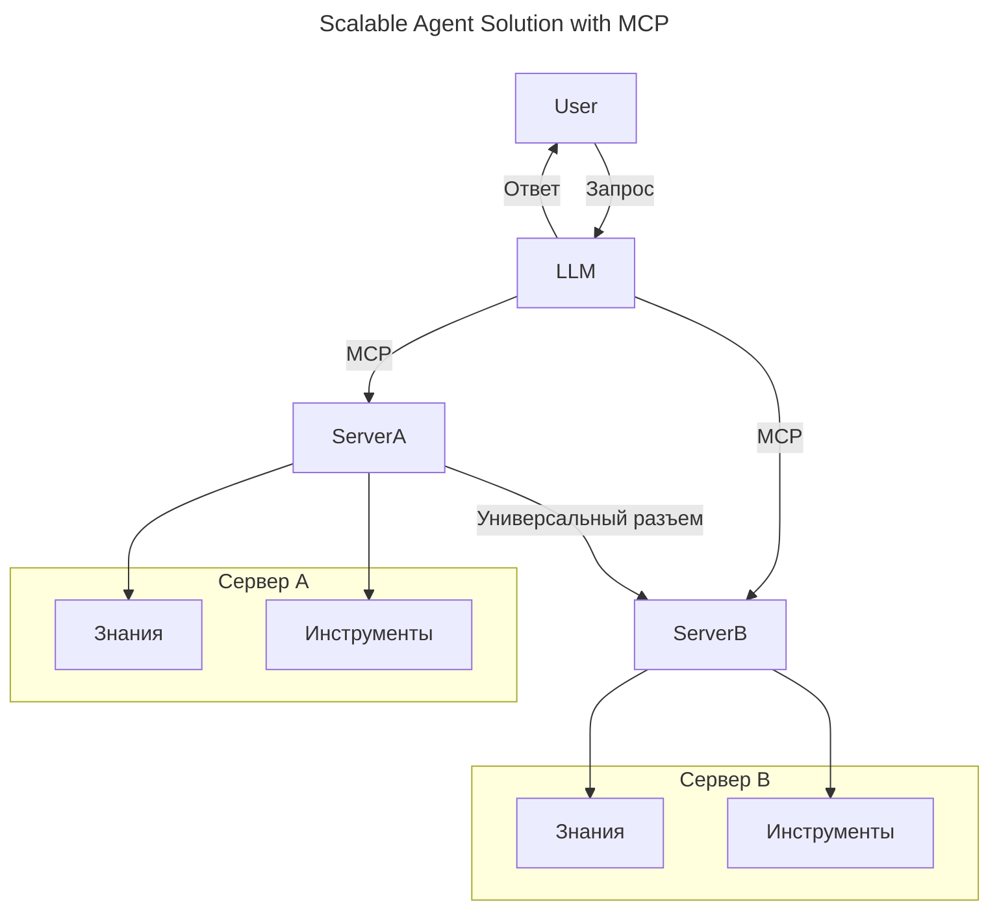
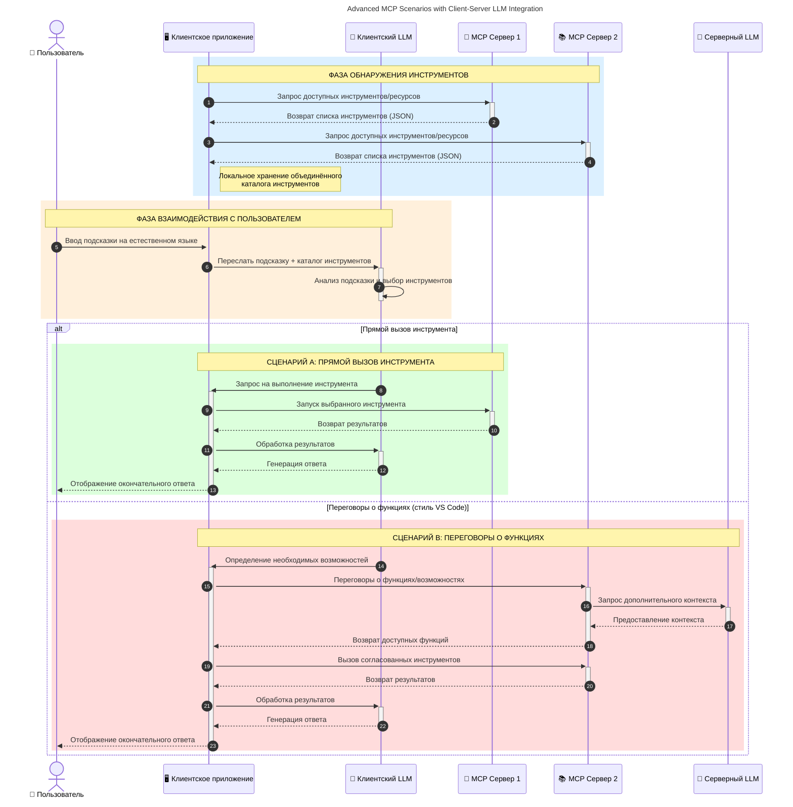

# Введение в Протокол Контекста Модели (MCP): Почему это важно для масштабируемых AI-приложений  

[](https://youtu.be/agBbdiOPLQA)  

_(Нажмите на изображение выше, чтобы посмотреть видео этого урока)_  

Генеративные AI-приложения — это большой шаг вперёд, поскольку они часто позволяют пользователю взаимодействовать с приложением с помощью естественно-языковых запросов. Однако по мере того, как в такие приложения вкладывается больше времени и ресурсов, важно обеспечить лёгкую интеграцию функциональностей и ресурсов так, чтобы их было просто расширять, чтобы ваше приложение могло работать с более чем одной моделью и обрабатывать различные особенности моделей. Проще говоря, создание приложений на основе генеративного AI — это просто в начале, но по мере роста и усложнения вы должны начинать определять архитектуру и, скорее всего, полагаться на стандарт, чтобы гарантировать последовательную реализацию приложений. Здесь на помощь приходит MCP, который организует и предоставляет стандарт.  

---  

## **🔍 Что такое Протокол Контекста Модели (MCP)?**  

**Протокол Контекста Модели (MCP)** — это **открытый, стандартизированный интерфейс**, который позволяет крупным языковым моделям (LLM) бесшовно взаимодействовать с внешними инструментами, API и источниками данных. Он обеспечивает последовательную архитектуру для расширения функционала AI-моделей за пределы их обучающих данных, что позволяет создавать более умные, масштабируемые и отзывчивые AI-системы.  

---  

## **🎯 Почему стандартизация в AI важна**  

По мере усложнения генеративных AI-приложений важно принимать стандарты, гарантирующие **масштабируемость, расширяемость, поддерживаемость** и **избегание зависимости от поставщика**. MCP решает эти задачи:  

- Унификация интеграций моделей с инструментами  
- Снижение числа хрупких, разовых кастомных решений  
- Позволяет нескольким моделям от разных поставщиков сосуществовать в одной экосистеме  

**Примечание:** Несмотря на то, что MCP позиционируется как открытый стандарт, нет планов стандартизировать MCP через существующие организации по стандартизации, такие как IEEE, IETF, W3C, ISO или другие.  

---  

## **📚 Учебные цели**  

К концу этой статьи вы сможете:  

- Определить **Протокол Контекста Модели (MCP)** и его сценарии использования  
- Понять, как MCP стандартизирует коммуникацию между моделью и инструментом  
- Выделить основные компоненты архитектуры MCP  
- Исследовать реальные применения MCP в корпоративных и разработческих контекстах  

---  

## **💡 Почему Протокол Контекста Модели (MCP) — это прорыв**  

### **🔗 MCP решает проблему фрагментации AI-взаимодействий**  

До MCP интеграция моделей с инструментами требовала:  

- Кастомного кода для каждой пары инструмент-модель  
- Нестандартных API для каждого поставщика  
- Частых разрывов из-за обновлений  
- Плохой масштабируемости с ростом количества инструментов  

### **✅ Преимущества стандартизации MCP**  

| **Преимущество**           | **Описание**                                                                  |  
|---------------------------|------------------------------------------------------------------------------|  
| Совместимость              | LLM бесшовно работают с инструментами от разных поставщиков                 |  
| Последовательность         | Единое поведение на разных платформах и инструментах                         |  
| Повторное использование   | Инструменты, созданные один раз, можно применять в разных проектах и системах|  
| Ускоренная разработка     | Сокращение времени разработки с помощью стандартизированных, готовых к подключению интерфейсов|  

---  

## **🧱 Краткий обзор архитектуры MCP**  

MCP следует модели **клиент-сервер**, где:  

- **MCP Хосты** запускают AI-модели  
- **MCP Клиенты** инициируют запросы  
- **MCP Серверы** предоставляют контекст, инструменты и возможности  

### **Ключевые компоненты:**  

- **Ресурсы** – статические или динамические данные для моделей  
- **Подсказки** – предопределённые рабочие процессы для управляемой генерации  
- **Инструменты** – исполняемые функции, такие как поиск, вычисления  
- **Отбор (Sampling)** – агентское поведение через рекурсивные взаимодействия (устарел в выпуске кандидата к `2026-07-28`)  
- **Запросы (Elicitation)** – запросы, инициируемые сервером для ввода пользователя  
- **Корни (Roots)** – границы файловой системы для контроля доступа сервера (устарел в выпуске кандидата к `2026-07-28`)  

### **Архитектура протокола:**  

MCP использует двухслойную архитектуру:  
- **Уровень данных**: коммуникация на базе JSON-RPC 2.0 с управлением жизненным циклом и примитивами  
- **Транспортный уровень**: STDIO (локальный) и потоковый HTTP с SSE (удалённый) каналы связи  

---  

## Как работают MCP-серверы  

MCP-серверы функционируют следующим образом:  

- **Поток запросов**:  
    1. Запрос инициируется конечным пользователем или программным обеспечением, действующим от его имени.  
    2. **MCP Клиент** отправляет запрос **MCP Хосту**, который управляет временем работы AI модели.  
    3. **AI Модель** получает пользовательский запрос и может потребовать доступ к внешним инструментам или данным через один или несколько вызовов инструментов.  
    4. **MCP Хост**, а не непосредственно модель, взаимодействует с соответствующими **MCP Сервер(ами)**, используя стандартизованный протокол.  
- **Функциональность MCP Хоста**:  
    - **Реестр инструментов**: ведёт каталог доступных инструментов и их возможностей.  
    - **Аутентификация**: проверяет права доступа к инструментам.  
    - **Обработчик запросов**: обрабатывает входящие запросы от модели.  
    - **Форматировщик ответов**: структурирует выводы инструментов в формате, понятном модели.  
- **Выполнение на MCP Сервере**:  
    - **MCP Хост** направляет вызовы инструментов одному или нескольким **MCP Сервер(ам)**, каждый из которых предоставляет специализированные функции (например, поиск, вычисления, запросы к базе данных).  
    - **MCP Серверы** выполняют соответствующие операции и возвращают результаты **MCP Хосту** в единообразном формате.  
    - **MCP Хост** форматирует и передаёт эти результаты AI Модели.  
- **Завершение ответа**:  
    - **AI Модель** интегрирует выводы инструментов в итоговый ответ.  
    - **MCP Хост** отправляет этот ответ обратно **MCP Клиенту**, который передаёт его конечному пользователю или вызывающему программному обеспечению.  
    

```mermaid
---
title: MCP Architecture and Component Interactions
description: A diagram showing the flows of the components in MCP.
---
graph TD
    Client[Клиент/приложение MCP] -->|Отправляет запрос| H[Хост MCP]
    H -->|Вызывает| A[AI Модель]
    A -->|Запрос вызова инструмента| H
    H -->|MCP Protocol| T1[MCP Server Tool 01: Веб-поиск]
    H -->|MCP Protocol| T2[MCP Server Tool 02: Калькулятор]
    H -->|MCP Protocol| T3[MCP Server Tool 03: Инструмент доступа к базе данных]
    H -->|MCP Protocol| T4[MCP Server Tool 04: Инструмент файловой системы]
    H -->|Отправляет ответ| Client

    subgraph «Компоненты хоста MCP»
        H
        G[Реестр инструментов]
        I[Аутентификация]
        J[Обработчик запросов]
        K[Форматировщик ответов]
    end

    H <--> G
    H <--> I
    H <--> J
    H <--> K

    style A fill:#f9d5e5,stroke:#333,stroke-width:2px
    style H fill:#eeeeee,stroke:#333,stroke-width:2px
    style Client fill:#d5e8f9,stroke:#333,stroke-width:2px
    style G fill:#fffbe6,stroke:#333,stroke-width:1px
    style I fill:#fffbe6,stroke:#333,stroke-width:1px
    style J fill:#fffbe6,stroke:#333,stroke-width:1px
    style K fill:#fffbe6,stroke:#333,stroke-width:1px
    style T1 fill:#c2f0c2,stroke:#333,stroke-width:1px
    style T2 fill:#c2f0c2,stroke:#333,stroke-width:1px
    style T3 fill:#c2f0c2,stroke:#333,stroke-width:1px
    style T4 fill:#c2f0c2,stroke:#333,stroke-width:1px
```
  
## 👨‍💻 Как создать MCP-сервер (с примерами)  

MCP-серверы позволяют расширять возможности LLM, предоставляя данные и функциональность.  

Готовы попробовать? Вот SDK на разных языках и/или стеках с примерами создания простых MCP-серверов:  

- **Python SDK**: https://github.com/modelcontextprotocol/python-sdk  

- **TypeScript SDK**: https://github.com/modelcontextprotocol/typescript-sdk  

- **Java SDK**: https://github.com/modelcontextprotocol/java-sdk  

- **C#/.NET SDK**: https://github.com/modelcontextprotocol/csharp-sdk  


## 🌍 Реальные кейсы использования MCP  

MCP открывает широкий спектр применений, расширяя возможности AI:  

| **Применение**               | **Описание**                                                                 |  
|-----------------------------|----------------------------------------------------------------------------|  
| Интеграция данных в компании| Подключение LLM к базам данных, CRM или внутренним инструментам            |  
| Агентские AI-системы        | Обеспечение автономных агентов с доступом к инструментам и рабочим процессам принятия решений |  
| Мультимодальные приложения  | Объединение текстовых, визуальных и аудиоинструментов в едином AI-приложении |  
| Интеграция с данными в реальном времени | Включение живых данных в AI-взаимодействия для более точных и актуальных результатов|  


### 🧠 MCP = Универсальный стандарт для AI-взаимодействий  

Протокол Контекста Модели (MCP) выступает универсальным стандартом для AI-взаимодействий, подобно тому, как USB-C стандартизировал физические подключения устройств. В мире AI MCP обеспечивает единый интерфейс, позволяющий моделям (клиентам) интегрироваться с внешними инструментами и поставщиками данных (серверами) без проблем. Это избавляет от необходимости создавать разнообразные, кастомные протоколы для каждого API или источника данных.  

В рамках MCP совместимый инструмент (называемый MCP сервером) следует единому стандарту. Такие серверы могут перечислять доступные инструменты или действия и выполнять их по запросу AI-агента. Платформы AI-агентов, поддерживающие MCP, могут обнаруживать доступные инструменты на серверах и вызывать их через этот стандартный протокол.  

### 💡 Облегчает доступ к знаниям  

Помимо предоставления инструментов, MCP облегчает доступ к знаниям. Он позволяет приложениям обеспечивать контекст для крупных языковых моделей (LLM), связывая их с различными источниками данных. Например, MCP сервер может представлять репозиторий документов компании, позволяя агентам получать релевантную информацию по запросу. Другой сервер может обрабатывать конкретные действия — отправку писем или обновление записей. С точки зрения агента, это просто инструменты — одни возвращают данные (контекст знаний), другие выполняют действия. MCP эффективно управляет обоими.  

Агент, подключающийся к MCP серверу, автоматически узнаёт доступные возможности и данные сервера в стандартном формате. Эта стандартизация обеспечивает динамическую доступность инструментов. Например, добавление нового MCP сервера в систему агента делает его функции сразу доступными без дополнительной настройки инструкций агента.  

Такая упрощённая интеграция соответствует потоку, показанному на следующей диаграмме, где серверы предоставляют как инструменты, так и знания, обеспечивая бесшовное взаимодействие между системами.  

### 👉 Пример: Масштабируемое агентское решение  


Универсальный Коннектор позволяет MCP серверам обмениваться данными и возможностями, позволяя ServerA поручать задачи ServerB или получать доступ к его инструментам и знаниям. Это федерация инструментов и данных между серверами, поддерживающая масштабируемые и модульные архитектуры агентов. Так как MCP стандартизирует раскрытие инструментов, агенты могут динамически обнаруживать и направлять запросы между серверами без жёстко прописанных интеграций.  


Федерация инструментов и знаний: инструменты и данные доступны между серверами, что обеспечивает более масштабируемые и модульные агентские архитектуры.  

### 🔄 Расширенные сценарии MCP с интеграцией LLM на стороне клиента  

Помимо базовой архитектуры MCP существуют продвинутые сценарии, где и у клиента, и у сервера есть LLM, что даёт возможность более сложного взаимодействия. На следующей диаграмме **Клиентское приложение** может быть IDE с рядом доступных MCP инструментов для использования LLM:  


  
## 🔐 Практические преимущества MCP  

Вот практические преимущества использования MCP:  

- **Актуальность**: модели имеют доступ к актуальной информации, выходящей за пределы обучающих данных  
- **Расширение возможностей**: модели могут использовать специализированные инструменты для задач, на которые они не были обучены  
- **Сокращение галлюцинаций**: внешние источники данных обеспечивают фактическую основу  
- **Конфиденциальность**: чувствительные данные остаются в защищённых средах, а не встроены в подсказки  

## 📌 Основные выводы  

Основные выводы по использованию MCP:  

- **MCP** стандартизирует взаимодействие AI моделей с инструментами и данными  
- Способствует **расширяемости, последовательности и совместимости**  
- MCP помогает **сократить время разработки, повысить надёжность и расширить возможности моделей**  
- Архитектура клиент-сервер **обеспечивает гибкость и расширяемость AI-приложений**  

## 🧠 Упражнение  

Подумайте об AI-приложении, которое вы хотите создать.  

- Какие **внешние инструменты или данные** могли бы улучшить его возможности?  
- Как MCP может сделать интеграцию **проще и надёжнее**?  

## Дополнительные ресурсы  

- [MCP GitHub Репозиторий](https://github.com/modelcontextprotocol)  


## Что дальше  

Далее: [Глава 1: Основные концепции](../01-CoreConcepts/README.md)  

---

<!-- CO-OP TRANSLATOR DISCLAIMER START -->
**Отказ от ответственности**:
Этот документ был переведен с использованием сервиса машинного перевода [Co-op Translator](https://github.com/Azure/co-op-translator). Несмотря на наши усилия по обеспечению точности, имейте в виду, что автоматический перевод может содержать ошибки или неточности. Оригинальный документ на его исходном языке следует считать авторитетным источником. Для получения критически важной информации рекомендуется обратиться к профессиональному человеческому переводу. Мы не несем ответственности за любые недоразумения или неправильные толкования, возникшие в результате использования этого перевода.
<!-- CO-OP TRANSLATOR DISCLAIMER END -->