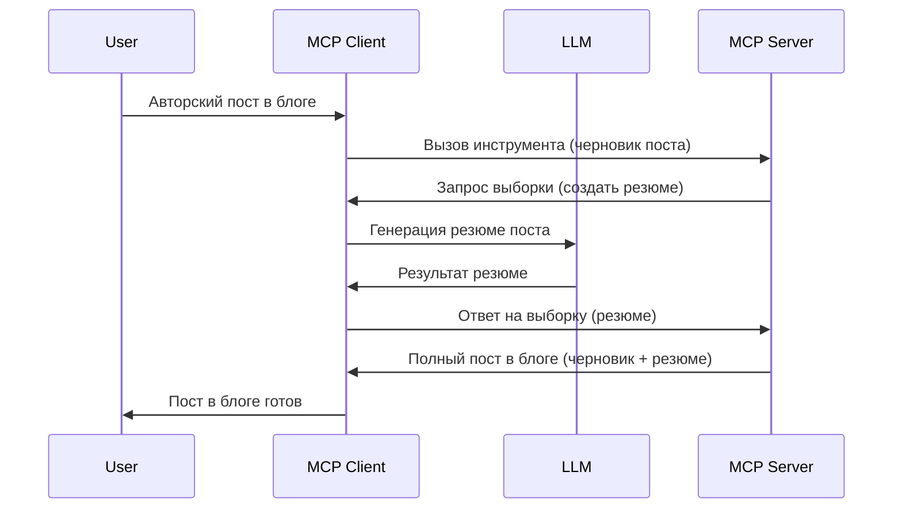

> [УСТАРЕЛО: КАНДИДАТ НА ВЫПУСК 2026-07-28](https://blog.modelcontextprotocol.io/posts/2026-07-28-release-candidate/)

# Сэмплирование — делегируйте функции клиенту

> **Уведомление об устаревании:** кандидат на выпуск спецификации MCP `2026-07-28` отмечает Сэмплирование как устаревшее в пользу прямой интеграции с API провайдеров LLM. Сэмплирование продолжит работать в версии `2025-11-25` и как минимум год после формального устаревания, так что всё в этом уроке остаётся актуальным — но новые серверные решения должны рассмотреть заменяющий паттерн. Смотрите [Что изменилось в MCP: Кандидат на выпуск 2026-07-28](../../01-CoreConcepts/mcp-2026-07-28-release-candidate.md).

Иногда нужно, чтобы MCP Клиент и MCP Сервер сотрудничали для достижения общей цели. Может возникнуть ситуация, когда серверу нужна помощь LLM, которая находится на клиенте. В такой ситуации вам следует использовать сэмплирование.

Давайте рассмотрим несколько сценариев и как построить решение с использованием сэмплирования.

## Обзор

В этом уроке мы сосредоточимся на объяснении, когда и где использовать сэмплирование и как его настроить.

## Цели обучения

В этой главе мы:

- Объясним, что такое сэмплирование и когда его применять.
- Покажем, как настроить сэмплирование в MCP.
- Приведём примеры работы сэмплирования.

## Что такое сэмплирование и зачем его использовать?

Сэмплирование — это продвинутая функция, которая работает следующим образом:



### Запрос на сэмплирование

Хорошо, теперь у нас есть общее представление о реалистичном сценарии, давайте поговорим о запросе на сэмплирование, который сервер отправляет клиенту. Вот как такой запрос может выглядеть в формате JSON-RPC:

```json
{
  "jsonrpc": "2.0",
  "id": 1,
  "method": "sampling/createMessage",
  "params": {
    "messages": [
      {
        "role": "user",
        "content": {
          "type": "text",
          "text": "Create a blog post summary of the following blog post: <BLOG POST>"
        }
      }
    ],
    "modelPreferences": {
      "hints": [
        {
          "name": "claude-3-sonnet"
        }
      ],
      "intelligencePriority": 0.8,
      "speedPriority": 0.5
    },
    "systemPrompt": "You are a helpful assistant.",
    "maxTokens": 100
  }
}
```

Здесь есть несколько моментов, на которые стоит обратить внимание:

- Подсказка, внутри content -> text, — это наша инструкция для LLM, чтобы она суммировала содержание блог-поста.

- **modelPreferences**. Этот раздел — просто рекомендация конфигурации для LLM. Пользователь может выбрать использовать эти рекомендации или изменить их. В данном случае есть рекомендации по модели, скорости и приоритету интеллекта.
- **systemPrompt**, это обычная системная подсказка, которая задаёт личность вашей LLM и содержит указания.
- **maxTokens**, это ещё одно свойство, указывающее рекомендуемое количество токенов для этой задачи.

### Ответ на сэмплирование

Этот ответ — то, что MCP Клиент отправляет обратно MCP Серверу, и результат вызова клиентом LLM с ожиданием ответа, а затем формированием этого сообщения. Вот как он может выглядеть в JSON-RPC:

```json
{
  "jsonrpc": "2.0",
  "id": 1,
  "result": {
    "role": "assistant",
    "content": {
      "type": "text",
      "text": "Here's your abstract <ABSTRACT>"
    },
    "model": "gpt-5",
    "stopReason": "endTurn"
  }
}
```

Обратите внимание, что ответ — это аннотация блог-поста, как мы и просили. Также обратите внимание, что используемая `model` не та, которую мы указали, а "gpt-5" вместо "claude-3-sonnet". Это иллюстрирует, что пользователь может изменить своё решение о том, что использовать, и что ваш запрос на сэмплирование — рекомендация.

Хорошо, теперь, когда мы понимаем основной поток и полезную задачу применения — "создание блог-поста + аннотация", давайте посмотрим, что нужно сделать, чтобы это работало.

### Типы сообщений

Сообщения сэмплирования не ограничиваются только текстом, вы также можете отправлять изображения и аудио. Вот как JSON-RPC отличается:

**Текст**

```json
{
  "type": "text",
  "text": "The message content"
}
```

**Изображение**

```json
{
  "type": "image",
  "data": "base64-encoded-image-data",
  "mimeType": "image/jpeg"
}
```

**Аудио**

```json
{
  "type": "audio",
  "data": "base64-encoded-audio-data",
  "mimeType": "audio/wav"
}
```

> NOTE: для более подробной информации о сэмплировании смотрите [официальную документацию](https://modelcontextprotocol.io/specification/2025-11-25/client/sampling)

## Как настроить сэмплирование в клиенте

> Примечание: если вы строите только сервер, делать много здесь не нужно.

В клиенте необходимо указать следующую функцию следующим образом:

```json
{
  "capabilities": {
    "sampling": {}
  }
}
```

После этого эта настройка будет задействована при инициализации выбранного клиента с сервером.

## Пример работы сэмплирования — создание блог-поста

Давайте вместе напишем сэмплирование сервера, нам нужно сделать следующее:

1. Создать инструмент на сервере.
1. Этот инструмент должен создавать запрос на сэмплирование.
1. Инструмент должен ждать ответа на запрос сэмплирования от клиента.
1. Затем должен быть сформирован результат инструмента.

Рассмотрим код пошагово:

### -1- Создаём инструмент

**python**

```python
@mcp.tool()
async def create_blog(title: str, content: str, ctx: Context[ServerSession, None]) -> str:
    """Create a blog post and generate a summary"""

```

### -2- Создаём запрос на сэмплирование

Расширьте ваш инструмент следующим кодом:

**python**

```python
post = BlogPost(
        id=len(posts) + 1,
        title=title,
        content=content,
        abstract=""
    )

prompt = f"Create an abstract of the following blog post: title: {title} and draft: {content} "

result = await ctx.session.create_message(
        messages=[
            SamplingMessage(
                role="user",
                content=TextContent(type="text", text=prompt),
            )
        ],
        max_tokens=100,
)

```

### -3- Ждём ответа и возвращаем результат

**python**

```python
post.abstract = result.content.text

posts.append(post)

# вернуть полный продукт
return json.dumps({
    "id": post.title,
    "abstract": post.abstract
})
```

### -4- Полный код

**python**

```python
from starlette.applications import Starlette
from starlette.routing import Mount, Host

from mcp.server.fastmcp import Context, FastMCP

from mcp.server.session import ServerSession
from mcp.types import SamplingMessage, TextContent

import json


from uuid import uuid4
from typing import List
from pydantic import BaseModel


mcp = FastMCP("Blog post generator")

# app = FastAPI()

posts = []

class BlogPost(BaseModel):
    id: int
    title: str
    content: str
    abstract: str

posts: List[BlogPost] = []

@mcp.tool()
async def create_blog(title: str, content: str, ctx: Context[ServerSession, None]) -> str:
    """Create a blog post and generate a summary"""

    post = BlogPost(
        id=len(posts) + 1,
        title=title,
        content=content,
        abstract=""
    )

    prompt = f"Create an abstract of the following blog post: title: {title} and draft: {content} "

    result = await ctx.session.create_message(
        messages=[
            SamplingMessage(
                role="user",
                content=TextContent(type="text", text=prompt),
            )
        ],
        max_tokens=100,
    )

    post.abstract = result.content.text

    posts.append(post)

    # вернуть полный блог-пост
    return json.dumps({
        "id": post.title,
        "abstract": post.abstract
    })

if __name__ == "__main__":
    print("Starting server...")
    # mcp.run()
    mcp.run(transport="streamable-http")

# запустить приложение с помощью: python server.py
```

### -5- Тестирование в Visual Studio Code

Чтобы протестировать это в Visual Studio Code, сделайте следующее:

1. Запустите сервер в терминале
1. Добавьте его в *mcp.json* (и убедитесь, что он запущен), например так:

   ```json
   "servers": {
      "blog-server": {
        "type": "http",
        "url": "http://localhost:8000/mcp"
      }
   }
   ```

1. Введите подсказку:

   ```text
   create a blog post named "Where Python comes from", the content is "Python is actually named after Monty Python Flying Circus"
   ```

1. Позвольте сэмплированию произойти. При первом тесте будет показан дополнительный диалог, который нужно подтвердить, после чего появится обычный диалог с запросом на запуск инструмента

1. Проверьте результат. Вы увидите результат, красиво отрисованный в GitHub Copilot Chat, а также сможете просмотреть исходный JSON-ответ.

**Бонус**. Инструменты Visual Studio Code отлично поддерживают сэмплирование. Вы можете настроить доступ к сэмплированию на вашем установленном сервере следующим образом:

1. Перейдите в раздел расширений.
1. Выберите значок шестерёнки для вашего установленного сервера в разделе "MCP SERVERS - INSTALLED".
1 Выберите "Настроить доступ к модели", здесь вы можете выбрать, какие модели разрешены GitHub Copilot при сэмплировании. Также вы можете просмотреть все недавние запросы на сэмплирование, выбрав "Показать запросы на сэмплирование".

## Задание

В этом задании вы создадите немного другое сэмплирование — интеграцию сэмплирования, поддерживающую генерацию описания продукта. Вот ваш сценарий:

**Сценарий**: сотруднику бэк-офиса интернет-магазина нужна помощь, так как на создание описаний товаров уходит слишком много времени. Поэтому нужно создать решение, где можно вызвать инструмент "create_product" с аргументами "title" и "keywords", и он должен вернуть полный продукт, включая поле "description", которое заполняется с помощью LLM клиента.

ПОДСКАЗКА: используйте знания из предыдущих разделов для создания этого сервера и инструмента с помощью запроса на сэмплирование.

## Решение

[Решение](./solution/README.md)

## Ключевые выводы

Сэмплирование — это мощная функция, позволяющая серверу делегировать задачи клиенту, когда требуется помощь LLM.

## Что дальше

- [Глава 4 - Практическая реализация](../../04-PracticalImplementation/README.md)

---

<!-- CO-OP TRANSLATOR DISCLAIMER START -->
**Отказ от ответственности**:
Этот документ был переведен с использованием сервиса машинного перевода [Co-op Translator](https://github.com/Azure/co-op-translator). Несмотря на наши усилия по обеспечению точности, имейте в виду, что автоматический перевод может содержать ошибки или неточности. Оригинальный документ на его исходном языке следует считать авторитетным источником. Для получения критически важной информации рекомендуется обратиться к профессиональному человеческому переводу. Мы не несем ответственности за любые недоразумения или неправильные толкования, возникшие в результате использования этого перевода.
<!-- CO-OP TRANSLATOR DISCLAIMER END -->