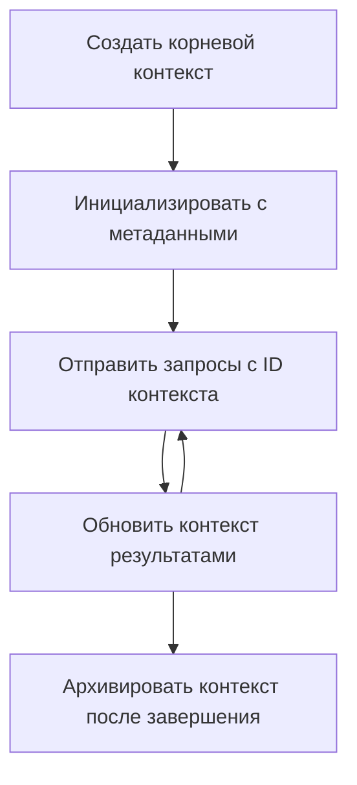

> [УСТАРЕЛО: КАНДИДАТ НА ВЫПУСК 2026-07-28](https://blog.modelcontextprotocol.io/posts/2026-07-28-release-candidate/#roots-sampling-and-logging-are-deprecated)

# Корневые контексты MCP

> **Уведомление об устаревании:** релиз-кандидат спецификации MCP от `2026-07-28` объявляет корни устаревшими в пользу параметров инструментов, URI ресурсов или конфигурации сервера. Корни продолжают работать в версии `2025-11-25` и в течение как минимум года после официального объявления об устаревании, поэтому всё в этом уроке остаётся актуальным — но новые серверные решения должны рассмотреть альтернативный подход. См. [Что меняется в MCP: кандидаты на релиз 2026-07-28](../../01-CoreConcepts/mcp-2026-07-28-release-candidate.md).

Корневые контексты являются фундаментальной концепцией в Протоколе Контекста Модели, обеспечивающей постоянный слой для поддержания истории разговоров и общего состояния между множеством запросов и сессий.

## Введение

В этом уроке мы рассмотрим, как создавать, управлять и использовать корневые контексты в MCP. 

## Цели обучения

По окончании урока вы сможете:

- Понимать назначение и структуру корневых контекстов
- Создавать и управлять корневыми контекстами с помощью клиентских библиотек MCP
- Внедрять корневые контексты в приложениях на .NET, Java, JavaScript и Python
- Использовать корневые контексты для многошаговых разговоров и управления состоянием
- Реализовывать лучшие практики управления корневыми контекстами

## Понимание корневых контекстов

Корневые контексты служат контейнерами, которые хранят историю и состояние серии связанных взаимодействий. Они обеспечивают:

- **Сохранение разговора**: Поддержание связных многошаговых диалогов
- **Управление памятью**: Хранение и извлечение информации между взаимодействиями
- **Управление состоянием**: Отслеживание прогресса в сложных рабочих процессах
- **Совместное использование контекста**: Позволение нескольким клиентам получить доступ к одному и тому же состоянию разговора

В MCP корневые контексты обладают следующими ключевыми характеристиками:

- Каждый корневой контекст имеет уникальный идентификатор.
- В них может содержаться история разговора, пользовательские предпочтения и другая метадата.
- Их можно создавать, получать доступ и архивировать по мере необходимости.
- Они поддерживают точечный контроль доступа и разрешения.

## Жизненный цикл корневого контекста



## Работа с корневыми контекстами

Вот пример того, как создавать и управлять корневыми контекстами.

### Реализация на C#

```csharp
// .NET Example: Root Context Management
using Microsoft.Mcp.Client;
using System;
using System.Threading.Tasks;
using System.Collections.Generic;

public class RootContextExample
{
    private readonly IMcpClient _client;
    private readonly IRootContextManager _contextManager;
    
    public RootContextExample(IMcpClient client, IRootContextManager contextManager)
    {
        _client = client;
        _contextManager = contextManager;
    }
    
    public async Task DemonstrateRootContextAsync()
    {
        // 1. Create a new root context
        var contextResult = await _contextManager.CreateRootContextAsync(new RootContextCreateOptions
        {
            Name = "Customer Support Session",
            Metadata = new Dictionary<string, string>
            {
                ["CustomerName"] = "Acme Corporation",
                ["PriorityLevel"] = "High",
                ["Domain"] = "Cloud Services"
            }
        });
        
        string contextId = contextResult.ContextId;
        Console.WriteLine($"Created root context with ID: {contextId}");
        
        // 2. First interaction using the context
        var response1 = await _client.SendPromptAsync(
            "I'm having issues scaling my web service deployment in the cloud.", 
            new SendPromptOptions { RootContextId = contextId }
        );
        
        Console.WriteLine($"First response: {response1.GeneratedText}");
        
        // Second interaction - the model will have access to the previous conversation
        var response2 = await _client.SendPromptAsync(
            "Yes, we're using containerized deployments with Kubernetes.", 
            new SendPromptOptions { RootContextId = contextId }
        );
        
        Console.WriteLine($"Second response: {response2.GeneratedText}");
        
        // 3. Add metadata to the context based on conversation
        await _contextManager.UpdateContextMetadataAsync(contextId, new Dictionary<string, string>
        {
            ["TechnicalEnvironment"] = "Kubernetes",
            ["IssueType"] = "Scaling"
        });
        
        // 4. Get context information
        var contextInfo = await _contextManager.GetRootContextInfoAsync(contextId);
        
        Console.WriteLine("Context Information:");
        Console.WriteLine($"- Name: {contextInfo.Name}");
        Console.WriteLine($"- Created: {contextInfo.CreatedAt}");
        Console.WriteLine($"- Messages: {contextInfo.MessageCount}");
        
        // 5. When the conversation is complete, archive the context
        await _contextManager.ArchiveRootContextAsync(contextId);
        Console.WriteLine($"Archived context {contextId}");
    }
}
```

В приведённом коде мы:

1. Создали корневой контекст для сессии поддержки клиентов.
1. Отправили несколько сообщений в этом контексте, что позволило модели поддерживать состояние.
1. Обновили контекст соответствующей метадатой на основе разговора.
1. Получили информацию о контексте, чтобы понять историю разговора.
1. Архивировали контекст после окончания разговора.

## Пример: реализация корневого контекста для финансового анализа

В этом примере мы создадим корневой контекст для сессии финансового анализа, демонстрируя, как поддерживать состояние между несколькими взаимодействиями.

### Реализация на Java

```java
// Пример на Java: Реализация корневого контекста
package com.example.mcp.contexts;

import com.mcp.client.McpClient;
import com.mcp.client.ContextManager;
import com.mcp.models.RootContext;
import com.mcp.models.McpResponse;

import java.util.HashMap;
import java.util.Map;
import java.util.UUID;

public class RootContextsDemo {
    private final McpClient client;
    private final ContextManager contextManager;
    
    public RootContextsDemo(String serverUrl) {
        this.client = new McpClient.Builder()
            .setServerUrl(serverUrl)
            .build();
            
        this.contextManager = new ContextManager(client);
    }
    
    public void demonstrateRootContext() throws Exception {
        // Создать метаданные контекста
        Map<String, String> metadata = new HashMap<>();
        metadata.put("projectName", "Financial Analysis");
        metadata.put("userRole", "Financial Analyst");
        metadata.put("dataSource", "Q1 2025 Financial Reports");
        
        // 1. Создать новый корневой контекст
        RootContext context = contextManager.createRootContext("Financial Analysis Session", metadata);
        String contextId = context.getId();
        
        System.out.println("Created context: " + contextId);
        
        // 2. Первое взаимодействие
        McpResponse response1 = client.sendPrompt(
            "Analyze the trends in Q1 financial data for our technology division",
            contextId
        );
        
        System.out.println("First response: " + response1.getGeneratedText());
        
        // 3. Обновить контекст важной информацией, полученной из ответа
        contextManager.addContextMetadata(contextId, 
            Map.of("identifiedTrend", "Increasing cloud infrastructure costs"));
        
        // Второе взаимодействие - использование того же контекста
        McpResponse response2 = client.sendPrompt(
            "What's driving the increase in cloud infrastructure costs?",
            contextId
        );
        
        System.out.println("Second response: " + response2.getGeneratedText());
        
        // 4. Создать резюме сессии анализа
        McpResponse summaryResponse = client.sendPrompt(
            "Summarize our analysis of the technology division financials in 3-5 key points",
            contextId
        );
        
        // Сохранить резюме в метаданных контекста
        contextManager.addContextMetadata(contextId, 
            Map.of("analysisSummary", summaryResponse.getGeneratedText()));
            
        // Получить обновленную информацию контекста
        RootContext updatedContext = contextManager.getRootContext(contextId);
        
        System.out.println("Context Information:");
        System.out.println("- Created: " + updatedContext.getCreatedAt());
        System.out.println("- Last Updated: " + updatedContext.getLastUpdatedAt());
        System.out.println("- Analysis Summary: " + 
            updatedContext.getMetadata().get("analysisSummary"));
            
        // 5. Архивировать контекст после завершения
        contextManager.archiveContext(contextId);
        System.out.println("Context archived");
    }
}
```

В приведённом коде мы:

1. Создали корневой контекст для сессии финансового анализа.
2. Отправили несколько сообщений в этом контексте, что позволило модели поддерживать состояние.
3. Обновили контекст соответствующей метадатой на основе разговора.
4. Создали сводку сессии анализа и сохранили её в метаданных контекста.
5. Архивировали контекст после окончания разговора.

## Пример: управление корневыми контекстами

Эффективное управление корневыми контекстами критично для сохранения истории разговоров и состояния. Ниже пример реализации управления корневыми контекстами.

### Реализация на JavaScript

```javascript
// Пример на JavaScript: Управление корневыми контекстами MCP
const { McpClient, RootContextManager } = require('@mcp/client');

class ContextSession {
  constructor(serverUrl, apiKey = null) {
    // Инициализация клиента MCP
    this.client = new McpClient({
      serverUrl,
      apiKey
    });
    
    // Инициализация менеджера контекстов
    this.contextManager = new RootContextManager(this.client);
  }
  
  /**
   * Create a new conversation context
   * @param {string} sessionName - Name of the conversation session
   * @param {Object} metadata - Additional metadata for the context
   * @returns {Promise<string>} - Context ID
   */
  async createConversationContext(sessionName, metadata = {}) {
    try {
      const contextResult = await this.contextManager.createRootContext({
        name: sessionName,
        metadata: {
          ...metadata,
          createdAt: new Date().toISOString(),
          status: 'active'
        }
      });
      
      console.log(`Created root context '${sessionName}' with ID: ${contextResult.id}`);
      return contextResult.id;
    } catch (error) {
      console.error('Error creating root context:', error);
      throw error;
    }
  }
  
  /**
   * Send a message in an existing context
   * @param {string} contextId - The root context ID
   * @param {string} message - The user's message
   * @param {Object} options - Additional options
   * @returns {Promise<Object>} - Response data
   */
  async sendMessage(contextId, message, options = {}) {
    try {
      // Отправить сообщение, используя указанный контекст
      const response = await this.client.sendPrompt(message, {
        rootContextId: contextId,
        temperature: options.temperature || 0.7,
        allowedTools: options.allowedTools || []
      });
      
      // При необходимости сохранить важные выводы из разговора
      if (options.storeInsights) {
        await this.storeConversationInsights(contextId, message, response.generatedText);
      }
      
      return {
        message: response.generatedText,
        toolCalls: response.toolCalls || [],
        contextId
      };
    } catch (error) {
      console.error(`Error sending message in context ${contextId}:`, error);
      throw error;
    }
  }
  
  /**
   * Store important insights from a conversation
   * @param {string} contextId - The root context ID
   * @param {string} userMessage - User's message
   * @param {string} aiResponse - AI's response
   */
  async storeConversationInsights(contextId, userMessage, aiResponse) {
    try {
      // Извлечь потенциальные выводы (в реальном приложении это будет более сложным)
      const combinedText = userMessage + "\n" + aiResponse;
      
      // Простая эвристика для определения потенциальных выводов
      const insightWords = ["important", "key point", "remember", "significant", "crucial"];
      
      const potentialInsights = combinedText
        .split(".")
        .filter(sentence => 
          insightWords.some(word => sentence.toLowerCase().includes(word))
        )
        .map(sentence => sentence.trim())
        .filter(sentence => sentence.length > 10);
      
      // Сохранить выводы в метаданных контекста
      if (potentialInsights.length > 0) {
        const insights = {};
        potentialInsights.forEach((insight, index) => {
          insights[`insight_${Date.now()}_${index}`] = insight;
        });
        
        await this.contextManager.updateContextMetadata(contextId, insights);
        console.log(`Stored ${potentialInsights.length} insights in context ${contextId}`);
      }
    } catch (error) {
      console.warn('Error storing conversation insights:', error);
      // Некритическая ошибка, поэтому просто залогировать предупреждение
    }
  }
  
  /**
   * Get summary information about a context
   * @param {string} contextId - The root context ID
   * @returns {Promise<Object>} - Context information
   */
  async getContextInfo(contextId) {
    try {
      const contextInfo = await this.contextManager.getContextInfo(contextId);
      
      return {
        id: contextInfo.id,
        name: contextInfo.name,
        created: new Date(contextInfo.createdAt).toLocaleString(),
        lastUpdated: new Date(contextInfo.lastUpdatedAt).toLocaleString(),
        messageCount: contextInfo.messageCount,
        metadata: contextInfo.metadata,
        status: contextInfo.status
      };
    } catch (error) {
      console.error(`Error getting context info for ${contextId}:`, error);
      throw error;
    }
  }
  
  /**
   * Generate a summary of the conversation in a context
   * @param {string} contextId - The root context ID
   * @returns {Promise<string>} - Generated summary
   */
  async generateContextSummary(contextId) {
    try {
      // Попросить модель сгенерировать резюме текущего разговора
      const response = await this.client.sendPrompt(
        "Please summarize our conversation so far in 3-4 sentences, highlighting the main points discussed.",
        { rootContextId: contextId, temperature: 0.3 }
      );
      
      // Сохранить резюме в метаданных контекста
      await this.contextManager.updateContextMetadata(contextId, {
        conversationSummary: response.generatedText,
        summarizedAt: new Date().toISOString()
      });
      
      return response.generatedText;
    } catch (error) {
      console.error(`Error generating context summary for ${contextId}:`, error);
      throw error;
    }
  }
  
  /**
   * Archive a context when it's no longer needed
   * @param {string} contextId - The root context ID
   * @returns {Promise<Object>} - Result of the archive operation
   */
  async archiveContext(contextId) {
    try {
      // Сгенерировать итоговое резюме перед архивированием
      const summary = await this.generateContextSummary(contextId);
      
      // Заархивировать контекст
      await this.contextManager.archiveContext(contextId);
      
      return {
        status: "archived",
        contextId,
        summary
      };
    } catch (error) {
      console.error(`Error archiving context ${contextId}:`, error);
      throw error;
    }
  }
}

// Пример использования
async function demonstrateContextSession() {
  const session = new ContextSession('https://mcp-server-example.com');
  
  try {
    // 1. Создать новый контекст для разговора о поддержке продукта
    const contextId = await session.createConversationContext(
      'Product Support - Database Performance',
      {
        customer: 'Globex Corporation',
        product: 'Enterprise Database',
        severity: 'Medium',
        supportAgent: 'AI Assistant'
      }
    );
    
    // 2. Первое сообщение в разговоре
    const response1 = await session.sendMessage(
      contextId,
      "I'm experiencing slow query performance on our database cluster after the latest update.",
      { storeInsights: true }
    );
    console.log('Response 1:', response1.message);
    
    // Последующее сообщение в том же контексте
    const response2 = await session.sendMessage(
      contextId,
      "Yes, we've already checked the indexes and they seem to be properly configured.",
      { storeInsights: true }
    );
    console.log('Response 2:', response2.message);
    
    // 3. Получить информацию о контексте
    const contextInfo = await session.getContextInfo(contextId);
    console.log('Context Information:', contextInfo);
    
    // 4. Сгенерировать и вывести резюме разговора
    const summary = await session.generateContextSummary(contextId);
    console.log('Conversation Summary:', summary);
    
    // 5. Заархивировать контекст после завершения
    const archiveResult = await session.archiveContext(contextId);
    console.log('Archive Result:', archiveResult);
    
    // 6. Элегантно обработать любые ошибки
  } catch (error) {
    console.error('Error in context session demonstration:', error);
  }
}

demonstrateContextSession();
```

В приведённом коде мы:

1. Создали корневой контекст для разговора по поддержке продукта с помощью функции `createConversationContext`. В данном случае, контекст касается проблем производительности базы данных.

1. Отправили несколько сообщений в этом контексте, что позволило модели поддерживать состояние с помощью функции `sendMessage`. Отправляемые сообщения посвящены медленной работе запросов и конфигурации индексов.

1. Обновили контекст соответствующей метадатой на основе разговора.

1. Создали сводку разговора и сохранили её в метаданных контекста с помощью функции `generateContextSummary`.

1. Архивировали контекст по окончании разговора с помощью функции `archiveContext`.

1. Грамотно обработали ошибки для обеспечения устойчивости.

## Корневой контекст для многошаговой помощи

В этом примере мы создадим корневой контекст для сессии многошаговой помощи, демонстрируя, как поддерживать состояние между несколькими взаимодействиями.

### Реализация на Python

```python
# Пример на Python: корневой контекст для многократной помощи
import asyncio
from datetime import datetime
from mcp_client import McpClient, RootContextManager

class AssistantSession:
    def __init__(self, server_url, api_key=None):
        self.client = McpClient(server_url=server_url, api_key=api_key)
        self.context_manager = RootContextManager(self.client)
    
    async def create_session(self, name, user_info=None):
        """Create a new root context for an assistant session"""
        metadata = {
            "session_type": "assistant",
            "created_at": datetime.now().isoformat(),
        }
        
        # Добавить информацию о пользователе, если указана
        if user_info:
            metadata.update({f"user_{k}": v for k, v in user_info.items()})
            
        # Создать корневой контекст
        context = await self.context_manager.create_root_context(name, metadata)
        return context.id
    
    async def send_message(self, context_id, message, tools=None):
        """Send a message within a root context"""
        # Создать опции с идентификатором контекста
        options = {
            "root_context_id": context_id
        }
        
        # Добавить инструменты, если указаны
        if tools:
            options["allowed_tools"] = tools
        
        # Отправить запрос в контексте
        response = await self.client.send_prompt(message, options)
        
        # Обновить метаданные контекста с ходом разговора
        await self.context_manager.update_context_metadata(
            context_id,
            {
                f"message_{datetime.now().timestamp()}": message[:50] + "...",
                "last_interaction": datetime.now().isoformat()
            }
        )
        
        return response
    
    async def get_conversation_history(self, context_id):
        """Retrieve conversation history from a context"""
        context_info = await self.context_manager.get_context_info(context_id)
        messages = await self.client.get_context_messages(context_id)
        
        return {
            "context_info": context_info,
            "messages": messages
        }
    
    async def end_session(self, context_id):
        """End an assistant session by archiving the context"""
        # Сначала сгенерировать краткий запрос
        summary_response = await self.client.send_prompt(
            "Please summarize our conversation and any key points or decisions made.",
            {"root_context_id": context_id}
        )
        
        # Сохранить краткое содержание в метаданных
        await self.context_manager.update_context_metadata(
            context_id,
            {
                "summary": summary_response.generated_text,
                "ended_at": datetime.now().isoformat(),
                "status": "completed"
            }
        )
        
        # Архивировать контекст
        await self.context_manager.archive_context(context_id)
        
        return {
            "status": "completed",
            "summary": summary_response.generated_text
        }

# Пример использования
async def demo_assistant_session():
    assistant = AssistantSession("https://mcp-server-example.com")
    
    # 1. Создать сессию
    context_id = await assistant.create_session(
        "Technical Support Session",
        {"name": "Alex", "technical_level": "advanced", "product": "Cloud Services"}
    )
    print(f"Created session with context ID: {context_id}")
    
    # 2. Первое взаимодействие
    response1 = await assistant.send_message(
        context_id, 
        "I'm having trouble with the auto-scaling feature in your cloud platform.",
        ["documentation_search", "diagnostic_tool"]
    )
    print(f"Response 1: {response1.generated_text}")
    
    # Второе взаимодействие в том же контексте
    response2 = await assistant.send_message(
        context_id,
        "Yes, I've already checked the configuration settings you mentioned, but it's still not working."
    )
    print(f"Response 2: {response2.generated_text}")
    
    # 3. Получить историю
    history = await assistant.get_conversation_history(context_id)
    print(f"Session has {len(history['messages'])} messages")
    
    # 4. Завершить сессию
    end_result = await assistant.end_session(context_id)
    print(f"Session ended with summary: {end_result['summary']}")

if __name__ == "__main__":
    asyncio.run(demo_assistant_session())
```

В приведённом коде мы:

1. Создали корневой контекст для сессии технической поддержки с помощью функции `create_session`. Контекст включает информацию о пользователе, такую как имя и технический уровень.

1. Отправили несколько сообщений в этом контексте, что позволило модели поддерживать состояние с помощью функции `send_message`. Отправляемые сообщения касаются проблем с функцией автоматического масштабирования.

1. Получили историю разговора с помощью функции `get_conversation_history`, которая предоставляет информацию о контексте и сообщения.

1. Закончили сессию, архивировав контекст и создав сводку с помощью функции `end_session`. Сводка включает ключевые моменты разговора.

## Лучшие практики для корневых контекстов

Вот несколько лучших практик для эффективного управления корневыми контекстами:

- **Создавайте сфокусированные контексты**: создавайте отдельные корневые контексты для разных целей или доменов разговоров, чтобы сохранять ясность.

- **Устанавливайте политики истечения срока**: реализуйте политики архивирования или удаления старых контекстов для управления хранением и соблюдения правил хранения данных.

- **Храните релевантную метадату**: используйте метаданные контекста для сохранения важной информации о разговоре, которая может пригодиться позже.

- **Последовательно используйте ID контекста**: после создания контекста используйте его ID во всех связанных запросах для поддержания непрерывности.

- **Создавайте сводки**: когда контекст растёт, рассмотрите возможность создания сводок, чтобы зафиксировать важную информацию и контролировать размер контекста.

- **Реализуйте контроль доступа**: для систем с несколькими пользователями внедрите корректный контроль доступа для обеспечения конфиденциальности и безопасности контекстов разговоров.

- **Учитывайте ограничения контекста**: знайте о лимитах размера контекста и внедряйте стратегии обработки очень длинных разговоров.

- **Архивируйте после завершения**: архивируйте контексты после завершения разговоров, чтобы освободить ресурсы и сохранить историю.

## Что дальше

- [5.5 Маршрутизация](../mcp-routing/README.md)

---

<!-- CO-OP TRANSLATOR DISCLAIMER START -->
**Отказ от ответственности**:
Этот документ был переведен с использованием сервиса машинного перевода [Co-op Translator](https://github.com/Azure/co-op-translator). Несмотря на наши усилия по обеспечению точности, имейте в виду, что автоматический перевод может содержать ошибки или неточности. Оригинальный документ на его исходном языке следует считать авторитетным источником. Для получения критически важной информации рекомендуется обратиться к профессиональному человеческому переводу. Мы не несем ответственности за любые недоразумения или неправильные толкования, возникшие в результате использования этого перевода.
<!-- CO-OP TRANSLATOR DISCLAIMER END -->