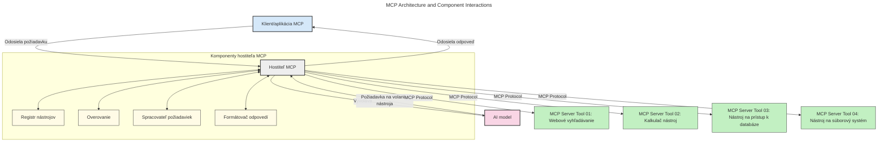
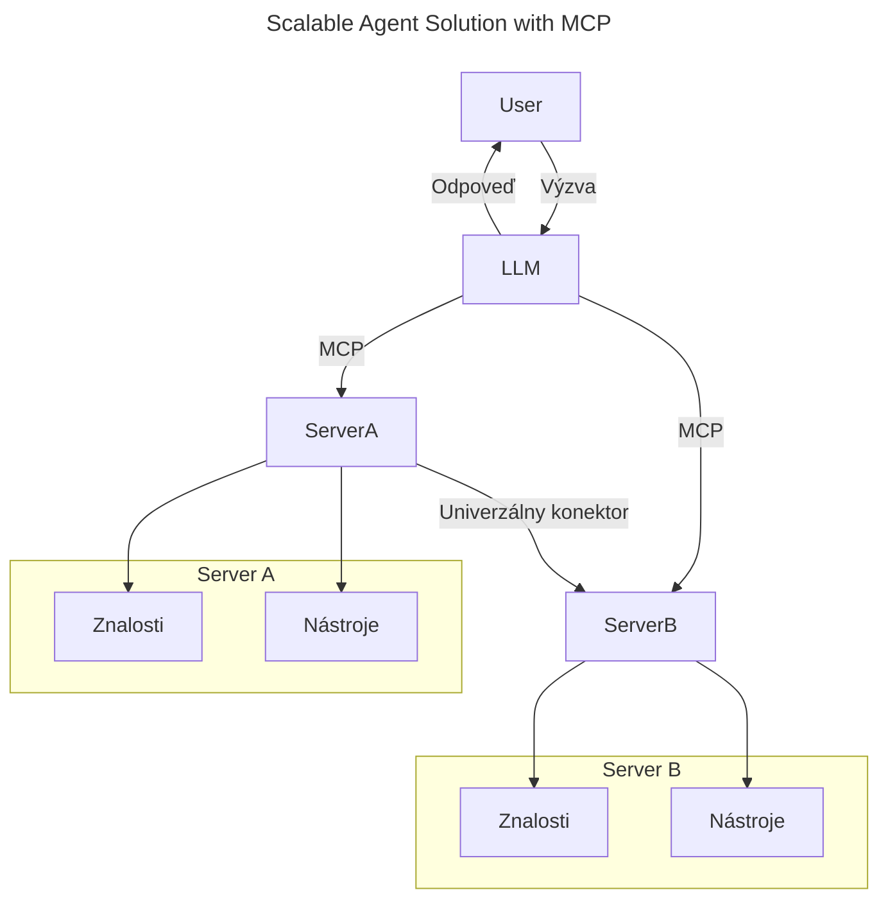
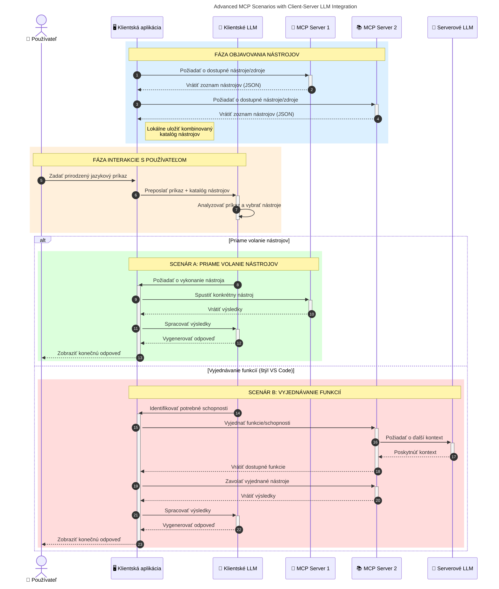

# Úvod do Model Context Protocol (MCP): Prečo je dôležitý pre škálovateľné AI aplikácie

_(Kliknite na obrázok vyššie pre zobrazenie videa tejto lekcie)_

Generatívne AI aplikácie sú veľkým krokom vpred, pretože často umožňujú používateľovi interagovať s aplikáciou pomocou prirodzených jazykových požiadaviek. Avšak, keď sa do takýchto aplikácií investuje viac času a zdrojov, chcete mať istotu, že môžete ľahko integrovať funkcie a zdroje tak, aby bolo jednoduché aplikácie rozširovať, aby mohli podporovať viac ako jeden model a zvládať rôzne detaily modelov. Stručne povedané, budovanie generatívnych AI aplikácií je na začiatku jednoduché, ale ako rastú a stávajú sa zložitejšími, je potrebné začať definovať architektúru a pravdepodobne bude potrebné spoľahnúť sa na štandard, ktorý zaručí, že vaše aplikácie budú vyvíjané konzistentným spôsobom. Tu vstupuje do hry MCP na zorganizovanie a poskytnutie štandardu.

---

## **🔍 Čo je Model Context Protocol (MCP)?**

**Model Context Protocol (MCP)** je **otvorený, štandardizovaný rozhranie**, ktoré umožňuje veľkým jazykovým modelom (LLM) bezproblémov komunikovať s externými nástrojmi, API a zdrojmi dát. Poskytuje jednotnú architektúru na rozšírenie funkčnosti AI modelov ponad ich tréningové dáta, čím umožňuje inteligentnejšie, škálovateľnejšie a citlivejšie AI systémy.

---

## **🎯 Prečo je štandardizácia v AI dôležitá**

Ako generatívne AI aplikácie rastú na zložitosti, je nevyhnutné prijať štandardy, ktoré zabezpečia **škálovateľnosť, rozšíriteľnosť, udržiavateľnosť** a **zamedzia závislosti na jednom dodávateľovi**. MCP rieši tieto potreby takto:

- Zjednocuje integrácie modelov s nástrojmi
- Znižuje krehké, jednorazové vlastné riešenia
- Umožňuje viacerým modelom od rôznych dodávateľov koexistovať v jednom ekosystéme

**Poznámka:** Na rozdiel od toho, že MCP sa prezentuje ako otvorený štandard, nie sú plánované žiadne procesy normalizácie MCP prostredníctvom existujúcich štandardizačných orgánov ako IEEE, IETF, W3C, ISO alebo iných štandardizačných organizácií.

---

## **📚 Výučbové ciele**

Po prečítaní tohto článku budete schopní:

- Definovať **Model Context Protocol (MCP)** a jeho použitia
- Pochopiť, ako MCP štandardizuje komunikáciu medzi modelom a nástrojmi
- Identifikovať kľúčové komponenty architektúry MCP
- Preskúmať reálne príklady použitia MCP v podnikových a vývojových kontextoch

---

## **💡 Prečo je Model Context Protocol (MCP) zásadnou zmenou**

### **🔗 MCP rieši fragmentáciu v AI interakciách**

Pred MCP vyžadovalo prepojenie modelov s nástrojmi:

- Vlastný kód pre každý pár model-nástroj
- Nestandardné API pre každého dodávateľa
- Časté prerušenia kvôli aktualizáciám
- Slabú škálovateľnosť s väčším počtom nástrojov

### **✅ Výhody štandardizácie MCP**

| **Výhoda**                 | **Popis**                                                                       |
|----------------------------|---------------------------------------------------------------------------------|
| Interoperabilita           | LLM pracujú bezproblémovo s nástrojmi od rôznych dodávateľov                    |
| Konzistencia               | Jednotné správanie naprieč platformami a nástrojmi                              |
| Znovupoužiteľnosť          | Nástroje vybudované raz môžu byť použité v rôznych projektoch a systémoch       |
| Urýchlený vývoj            | Skrátenie vývojového času vďaka štandardizovaným rozhraniam plug-and-play       |

---

## **🧱 Prehľad architektúry MCP na vysokej úrovni**

MCP používa **klient-server model**, kde:

- **MCP Hostitelia** prevádzkujú AI modely
- **MCP Klienti** iniciujú požiadavky
- **MCP Servery** poskytujú kontext, nástroje a funkcie

### **Kľúčové komponenty:**

- **Zdroje** – statické alebo dynamické údaje pre modely  
- **Prompt-y** – preddefinované postupy pre riadenú generáciu  
- **Nástroje** – vykonateľné funkcie ako vyhľadávanie, výpočty  
- **Sampling** – agentné správanie cez rekurzívne interakcie (deprecated v `2026-07-28` verzii kandidáta)
- **Elicitačné požiadavky** – požiadavky serveru na vstup od používateľa
- **Roots** – súborové hranice pre riadenie prístupu na server (deprecated v `2026-07-28` verzii kandidáta)

### **Architektúra protokolu:**

MCP používa dvojvrstvovú architektúru:
- **Vrstva dát**: komunikácia založená na JSON-RPC 2.0 s riadením životného cyklu a primitívami
- **Vrstva transportu**: STDIO (lokálna) a Streamable HTTP so SSE (prechodná) komunikačné kanály

---

## Ako fungujú MCP Servery

MCP servery fungujú nasledovne:

- **Priebeh požiadavky**:
    1. Požiadavka je iniciovaná koncovým používateľom alebo softvérom konajúcim v jeho mene.
    2. **MCP Klient** odošle požiadavku na **MCP Hostiteľa**, ktorý spravuje AI model runtime.
    3. **AI Model** prijme používateľský prompt a môže požiadať o prístup k externým nástrojom alebo údajom prostredníctvom jednej alebo viacerých volaní nástrojov.
    4. **MCP Hostiteľ**, nie priamo model, komunikuje so správnymi **MCP Servermi** pomocou štandardizovaného protokolu.
- **Funkcionalita MCP Hostiteľa**:
    - **Registr nástrojov**: Uchováva katalóg dostupných nástrojov a ich schopností.
    - **Overovanie**: Overuje oprávnenia pre prístup k nástrojom.
    - **Spracovateľ požiadaviek**: Spracováva prichádzajúce požiadavky na nástroje od modelu.
    - **Formátovač odpovedí**: Štruktúruje výstupy nástrojov do formátu, ktorý model dokáže pochopiť.
- **Vykonávanie na MCP Serveri**:
    - **MCP Hostiteľ** smeruje volania nástrojov na jedného alebo viacerých **MCP Serverov**, z ktorých každý poskytuje špecializované funkcie (napr. vyhľadávanie, výpočty, databázové dopyty).
    - **MCP Servery** vykonajú svoje operácie a vrátia výsledky MCP Hostiteľovi vo formáte, ktorý dodržiava konzistenciu.
    - **MCP Hostiteľ** formátuje a odovzdáva tieto výsledky AI Modelu.
- **Dokončenie odpovede**:
    - **AI Model** začlenením výstupov nástrojov vytvorí konečnú odpoveď.
    - **MCP Hostiteľ** odošle túto odpoveď späť **MCP Klientovi**, ktorý ju doručí koncovému používateľovi alebo volajúcemu softvéru.
    

## 👨‍💻 Ako vybudovať MCP Server (s príkladmi)

MCP servery umožňujú rozšíriť schopnosti LLM poskytovaním dát a funkcií. 

Ste pripravení to vyskúšať? Tu sú SDK špecifické pre jazyk a/alebo stack s príkladmi vytvorenia jednoduchých MCP serverov v rôznych jazykoch/stackoch:

- **Python SDK**: https://github.com/modelcontextprotocol/python-sdk

- **TypeScript SDK**: https://github.com/modelcontextprotocol/typescript-sdk

- **Java SDK**: https://github.com/modelcontextprotocol/java-sdk

- **C#/.NET SDK**: https://github.com/modelcontextprotocol/csharp-sdk

## 🌍 Reálne použitia MCP

MCP umožňuje široké spektrum aplikácií rozširovaním schopností AI:

| **Použitie**                 | **Popis**                                                                      |
|-----------------------------|--------------------------------------------------------------------------------|
| Podniková integrácia dát    | Pripojenie LLM k databázam, CRM alebo interným nástrojom                        |
| Agentné AI systémy           | Umožnenie autonómnych agentov s prístupom k nástrojom a rozhodovacími postupmi |
| Multimodálne aplikácie       | Kombinácia textových, obrazových a audio nástrojov v jednej jednotnej AI aplikácii |
| Integrácia dát v reálnom čase | Prinášanie živých dát do AI interakcií pre presnejšie a aktuálne výsledky      |

### 🧠 MCP = Univerzálny štandard pre AI interakcie

Model Context Protocol (MCP) pôsobí ako univerzálny štandard pre AI interakcie podobne ako USB-C štandardizoval fyzické pripojenia zariadení. Vo svete AI poskytuje MCP konzistentné rozhranie, ktoré umožňuje modelom (klientom) bez problémov integrovať sa s externými nástrojmi a poskytovateľmi dát (servermi). To eliminuje potrebu rôznorodých, vlastných protokolov pre každé API alebo zdroj dát.

Podľa MCP nástroj kompatibilný s MCP (nazývaný MCP server) dodržiava jednotný štandard. Tieto servery môžu uvádzať nástroje alebo akcie, ktoré ponúkajú, a vykonávať ich, keď to vyžaduje AI agent. Platformy AI agentov podporujúce MCP sú schopné objavovať dostupné nástroje zo serverov a vyvolávať ich prostredníctvom tohto štandardného protokolu.

### 💡 Uľahčuje prístup k vedomostiam

Okrem ponuky nástrojov MCP tiež uľahčuje prístup k vedomostiam. Umožňuje aplikáciám poskytovať kontext veľkým jazykovým modelom (LLM) tým, že ich prepája s rôznymi dátovými zdrojmi. Napríklad MCP server môže reprezentovať firemnú dokumentačnú databázu, čo umožňuje agentom na požiadanie získať relevantné informácie. Iný server môže vykonávať špecifické akcie ako odosielanie e-mailov alebo aktualizovanie záznamov. Z pohľadu agenta sú to jednoducho nástroje, ktoré môže používať – niektoré nástroje vracajú dáta (kontext vedomostí), iné vykonávajú akcie. MCP efektívne spravuje oboje.

Agent, ktorý sa pripája k MCP serveru, automaticky získa vedomosť o dostupných schopnostiach a prístupných dátach servera prostredníctvom štandardného formátu. Táto štandardizácia umožňuje dynamickú dostupnosť nástrojov. Napríklad pridanie nového MCP servera do systému agenta sprístupní jeho funkcie okamžite bez nutnosti ďalšej úpravy inštrukcií agenta.

Táto zjednodušená integrácia sa zhoduje s tokom zobrazeným na nasledujúcom obrázku, kde servery poskytujú nástroje aj vedomosti, čím zabezpečujú bezproblémovú spoluprácu medzi systémami. 

### 👉 Príklad: škálovateľné riešenie agenta

Univerzálny konektor umožňuje MCP serverom komunikovať a zdieľať schopnosti navzájom, čo umožňuje ServerA delegovať úlohy na ServerB alebo pristupovať k jeho nástrojom a vedomostiam. Tým sa nástroje a dáta federujú naprieč servermi, podporujúc škálovateľné a modulárne agentné architektúry. Keďže MCP štandardizuje vystavovanie nástrojov, agenti môžu dynamicky objavovať a smerovať požiadavky medzi servermi bez pevne zakódovaných integrácií.

Federovanie nástrojov a vedomostí: Nástroje a dáta môžu byť prístupné naprieč servermi, čo umožňuje škálovateľnejšie a modulárne agentné architektúry.

### 🔄 Pokročilé scenáre MCP s integráciou LLM na strane klienta

Okrem základnej architektúry MCP existujú pokročilé scenáre, kde klient aj server obsahujú LLM, čo umožňuje sofistikovanejšie interakcie. Na nasledujúcom obrázku môže byť **Klientska aplikácia** IDE s radom MCP nástrojov dostupných pre použitie LLM:

## 🔐 Praktické výhody MCP

Tu sú praktické výhody použitia MCP:

- **Aktuálnosť**: Modely majú prístup k najnovším informáciám mimo svojich tréningových dát
- **Rozšírenie schopností**: Modely môžu využiť špecializované nástroje pre úlohy, na ktoré neboli trénované
- **Zníženie halucinácií**: Externé zdroje dát poskytujú faktickú oporu
- **Súkromie**: Citlivé údaje môžu zostať v zabezpečených prostrediach namiesto vloženia do promptov

## 📌 Kľúčové poznatky

Nasledovné sú kľúčové poznatky pri používaní MCP:

- **MCP** štandardizuje spôsob, akým AI modely interagujú s nástrojmi a dátami
- Podporuje **rozšíriteľnosť, konzistenciu a interoperabilitu**
- MCP pomáha **skrýtiť vývojový čas, zlepšovať spoľahlivosť a rozširovať schopnosti modelov**
- Klient-server architektúra **umožňuje flexibilné, rozšíriteľné AI aplikácie**

## 🧠 Cvičenie

Zamyslite sa nad AI aplikáciou, ktorú by ste chceli vytvoriť.

- Aké **externé nástroje alebo dáta** by mohli zlepšiť jej schopnosti?
- Ako by mohol MCP spraviť integráciu **jednoduchšou a spoľahlivejšou?**

## Dodatočné zdroje

- [MCP GitHub Úložisko](https://github.com/modelcontextprotocol)

## Čo nasleduje

Nasleduje: [Kapitola 1: Základné koncepty](../01-CoreConcepts/README.md)

---

<!-- CO-OP TRANSLATOR DISCLAIMER START -->
**Vyhlásenie o zodpovednosti**:
Tento dokument bol preložený pomocou AI prekladateľskej služby [Co-op Translator](https://github.com/Azure/co-op-translator). Hoci sa snažíme o presnosť, vezmite prosím na vedomie, že automatické preklady môžu obsahovať chyby alebo nepresnosti. Pôvodný dokument v jeho natívnom jazyku by mal byť považovaný za autoritatívny zdroj. Pre kritické informácie sa odporúča profesionálny ľudský preklad. Nie sme zodpovední za žiadne nedorozumenia alebo nesprávne interpretácie vyplývajúce z použitia tohto prekladu.
<!-- CO-OP TRANSLATOR DISCLAIMER END -->