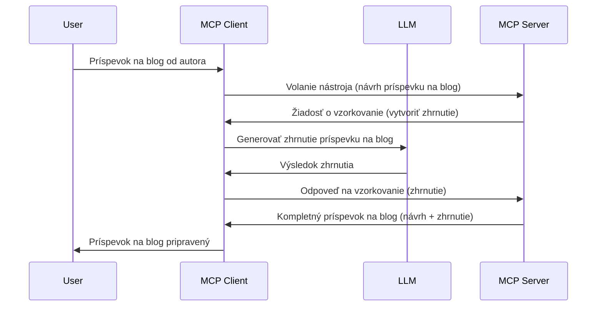

> [ZASTARANÉ: VYDANIE KANDIDÁTA 2026-07-28](https://blog.modelcontextprotocol.io/posts/2026-07-28-release-candidate/)

# Sampling - delegovanie funkcií na Klienta

> **Upozornenie na zastaranie:** kandidát špecifikácie MCP `2026-07-28` označuje Sampling ako zastaraný v prospech priamej integrácie s API poskytovateľov LLM. Sampling naďalej funguje v `2025-11-25` a najmenej rok po akejkoľvek formálnej deprekácii, takže všetko v tejto lekcii zostáva platné — ale nové návrhy serverov by mali zvážiť náhradný vzor. Pozrite si [Čo sa mení v MCP: kandidát vydania 2026-07-28](../../01-CoreConcepts/mcp-2026-07-28-release-candidate.md).

Niekedy je potrebné, aby MCP Klient a MCP Server spolupracovali na dosiahnutí spoločného cieľa. Môžete mať situáciu, kde Server potrebuje pomoc LLM, ktorý beží na klientovi. Pre túto situáciu by ste mali použiť sampling.

Poďme preskúmať niekoľko prípadov použitia a ako vybudovať riešenie zahŕňajúce sampling.

## Prehľad

V tejto lekcii sa zameriame na vysvetlenie, kedy a kde použiť Sampling a ako ho nakonfigurovať.

## Ciele učenia

V tejto kapitole budeme:

- Vysvetľovať, čo je Sampling a kedy ho použiť.
- Ukázať, ako nakonfigurovať Sampling v MCP.
- Poskytnúť príklady Sampling v praxi.

## Čo je Sampling a prečo ho používať?

Sampling je pokročilá funkcia, ktorá funguje nasledovne:



### Sampling požiadavka

Dobre, teraz máme približný pohľad na dôveryhodný scenár, poďme hovoriť o sampling požiadavke, ktorú server odosiela klientovi. Takáto požiadavka môže vyzerať v JSON-RPC formáte takto:

```json
{
  "jsonrpc": "2.0",
  "id": 1,
  "method": "sampling/createMessage",
  "params": {
    "messages": [
      {
        "role": "user",
        "content": {
          "type": "text",
          "text": "Create a blog post summary of the following blog post: <BLOG POST>"
        }
      }
    ],
    "modelPreferences": {
      "hints": [
        {
          "name": "claude-3-sonnet"
        }
      ],
      "intelligencePriority": 0.8,
      "speedPriority": 0.5
    },
    "systemPrompt": "You are a helpful assistant.",
    "maxTokens": 100
  }
}
```

Tu je niekoľko vecí, na ktoré stojí za to poukázať:

- Prompt, v poli content -> text, je naša výzva, inštrukcia pre LLM, aby zhrnulo obsah blogového príspevku.

- **modelPreferences**. Táto sekcia je práve odporúčanie, návrh konfigurácie pre LLM. Používateľ si môže vybrať, či sa bude riadiť týmito odporúčaniami alebo ich zmeniť. V tomto prípade sú odporúčania ohľadom použitého modelu a priorít rýchlosti a inteligencie.
- **systemPrompt**, toto je váš bežný systémový prompt, ktorý dáva LLM osobnosť a obsahuje pokyny.
- **maxTokens**, toto je ďalšia vlastnosť, ktorá určuje, koľko tokenov je odporúčané použiť pre danú úlohu.

### Sampling odpoveď

Táto odpoveď je to, čo MCP Klient nakoniec pošle späť MCP Serveru a je výsledkom zavolania LLM klientom, počkania na odpoveď a potom zostavenia tejto správy. Takto to môže vyzerať v JSON-RPC:

```json
{
  "jsonrpc": "2.0",
  "id": 1,
  "result": {
    "role": "assistant",
    "content": {
      "type": "text",
      "text": "Here's your abstract <ABSTRACT>"
    },
    "model": "gpt-5",
    "stopReason": "endTurn"
  }
}
```

Všimnite si, že odpoveď je abstrakt blogového príspevku, presne ako sme požadovali. Tiež všimnite, že použitý `model` nie je ten, ktorý sme požadovali, ale "gpt-5" namiesto "claude-3-sonnet". Toto ilustruje, že používateľ si môže rozmyslieť, čo použiť, a že vaša sampling požiadavka je odporúčanie.

Dobre, teraz keď chápeme hlavný tok a užitočnú úlohu na ktorú to použiť "vytváranie blogového príspevku + abstrakt", pozrime sa, čo treba urobiť, aby to fungovalo.

### Typy správ

Sampling správy nie sú obmedzené len na text, môžete tiež posielať obrázky a zvuk. Takto vyzerá odlišný JSON-RPC:

**Text**

```json
{
  "type": "text",
  "text": "The message content"
}
```

**Obsah obrázka**

```json
{
  "type": "image",
  "data": "base64-encoded-image-data",
  "mimeType": "image/jpeg"
}
```

**Obsah zvuku**

```json
{
  "type": "audio",
  "data": "base64-encoded-audio-data",
  "mimeType": "audio/wav"
}
```

> POZNÁMKA: pre podrobnejšie informácie o Sampling si pozrite [oficiálnu dokumentáciu](https://modelcontextprotocol.io/specification/2025-11-25/client/sampling)

## Ako nakonfigurovať Sampling na Klientovi

> Poznámka: ak iba budujete server, nemusíte tu robiť veľa.

Na klientovi musíte zadefinovať nasledovnú funkciu takto:

```json
{
  "capabilities": {
    "sampling": {}
  }
}
```

Toto sa následne zachytí pri inicializácii vášho vybraného klienta so serverom.

## Príklad Sampling v praxi - vytvorte blogový príspevok

Poďme spolu kódovať sampling server, budeme musieť urobiť nasledujúce:

1. Vytvoriť nástroj na Serveri.
1. Tento nástroj by mal vytvoriť sampling požiadavku.
1. Nástroj by mal čakať na odpoveď sampling požiadavky klienta.
1. Potom by mal byť vyradený výsledok nástroja.

Pozrime sa na kód krok po kroku:

### -1- Vytvorte nástroj

**python**

```python
@mcp.tool()
async def create_blog(title: str, content: str, ctx: Context[ServerSession, None]) -> str:
    """Create a blog post and generate a summary"""

```

### -2- Vytvorte sampling požiadavku

Rozšírte svoj nástroj nasledujúcim kódom:

**python**

```python
post = BlogPost(
        id=len(posts) + 1,
        title=title,
        content=content,
        abstract=""
    )

prompt = f"Create an abstract of the following blog post: title: {title} and draft: {content} "

result = await ctx.session.create_message(
        messages=[
            SamplingMessage(
                role="user",
                content=TextContent(type="text", text=prompt),
            )
        ],
        max_tokens=100,
)

```

### -3- Počkajte na odpoveď a vráťte odpoveď

**python**

```python
post.abstract = result.content.text

posts.append(post)

# vrátiť kompletný produkt
return json.dumps({
    "id": post.title,
    "abstract": post.abstract
})
```

### -4- Kompletný kód

**python**

```python
from starlette.applications import Starlette
from starlette.routing import Mount, Host

from mcp.server.fastmcp import Context, FastMCP

from mcp.server.session import ServerSession
from mcp.types import SamplingMessage, TextContent

import json


from uuid import uuid4
from typing import List
from pydantic import BaseModel


mcp = FastMCP("Blog post generator")

# app = FastAPI()

posts = []

class BlogPost(BaseModel):
    id: int
    title: str
    content: str
    abstract: str

posts: List[BlogPost] = []

@mcp.tool()
async def create_blog(title: str, content: str, ctx: Context[ServerSession, None]) -> str:
    """Create a blog post and generate a summary"""

    post = BlogPost(
        id=len(posts) + 1,
        title=title,
        content=content,
        abstract=""
    )

    prompt = f"Create an abstract of the following blog post: title: {title} and draft: {content} "

    result = await ctx.session.create_message(
        messages=[
            SamplingMessage(
                role="user",
                content=TextContent(type="text", text=prompt),
            )
        ],
        max_tokens=100,
    )

    post.abstract = result.content.text

    posts.append(post)

    # vrátiť celý blogový príspevok
    return json.dumps({
        "id": post.title,
        "abstract": post.abstract
    })

if __name__ == "__main__":
    print("Starting server...")
    # mcp.run()
    mcp.run(transport="streamable-http")

# spustiť aplikáciu príkazom: python server.py
```

### -5- Testovanie vo Visual Studio Code

Na otestovanie vo Visual Studio Code urobte nasledovné:

1. Spustite server v termináli
1. Pridajte ho do *mcp.json* (a uistite sa, že je spustený) napríklad takto:

   ```json
   "servers": {
      "blog-server": {
        "type": "http",
        "url": "http://localhost:8000/mcp"
      }
   }
   ```

1. Napíšte prompt:

   ```text
   create a blog post named "Where Python comes from", the content is "Python is actually named after Monty Python Flying Circus"
   ```

1. Umožnite sampling. Pri prvom teste sa zobrazí dodatočný dialóg, ktorý musíte akceptovať, potom uvidíte bežný dialóg na spustenie nástroja.

1. Skontrolujte výsledky. Výsledky uvidíte pekne zobrazené v GitHub Copilot Chat, ale tiež môžete skontrolovať surovú JSON odpoveď.

**Bonus**. Nástroje Visual Studio Code majú skvelú podporu pre sampling. Nastavenie prístupu k sampling vo vašom nainštalovanom serveri môžete vykonať takto:

1. Prejdite do sekcie rozšírení.
1. Vyberte ikonu ozubeného kolieska pre váš nainštalovaný server v sekcii "MCP SERVERS - INSTALLED".
1 Vyberte "Configure Model Access", tu môžete vybrať, ktoré modely môže GitHub Copilot pri sampling používať. Tiež môžete vidieť všetky nedávne sampling požiadavky výberom "Show Sampling requests".

## Zadanie

V tomto zadaní vybudujete mierne odlišný Sampling, konkrétne sampling integráciu, ktorá podporuje generovanie popisu produktu. Tu je váš scenár:

**Scenár**: pracovník back office v e-commerce potrebuje pomoc, trvá mu príliš dlho vytvárať popisy produktov. Preto vybudujete riešenie, kde môžete zavolať nástroj "create_product" s argumentami "title" a "keywords" a mal by vytvoriť kompletný produkt vrátane poľa "description", ktoré by mal vyplniť klientsky LLM.

TIP: použite to, čo ste sa naučili vyššie, aby ste postavili tento server a jeho nástroj s použitím sampling požiadavky.

## Riešenie

[Riešenie](./solution/README.md)

## Kľúčové závery

Sampling je silná funkcia, ktorá umožňuje serveru delegovať úlohy klientovi, keď potrebuje pomoc LLM.

## Čo ďalej

- [Kapitola 4 - Praktická implementácia](../../04-PracticalImplementation/README.md)

---

<!-- CO-OP TRANSLATOR DISCLAIMER START -->
**Vyhlásenie o zodpovednosti**:
Tento dokument bol preložený pomocou AI prekladateľskej služby [Co-op Translator](https://github.com/Azure/co-op-translator). Hoci sa snažíme o presnosť, vezmite prosím na vedomie, že automatické preklady môžu obsahovať chyby alebo nepresnosti. Pôvodný dokument v jeho natívnom jazyku by mal byť považovaný za autoritatívny zdroj. Pre kritické informácie sa odporúča profesionálny ľudský preklad. Nie sme zodpovední za žiadne nedorozumenia alebo nesprávne interpretácie vyplývajúce z použitia tohto prekladu.
<!-- CO-OP TRANSLATOR DISCLAIMER END -->