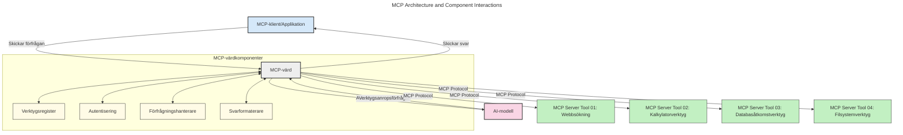
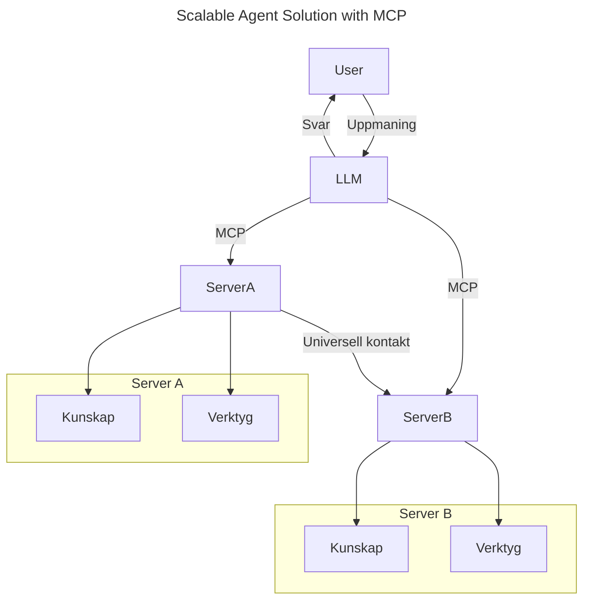
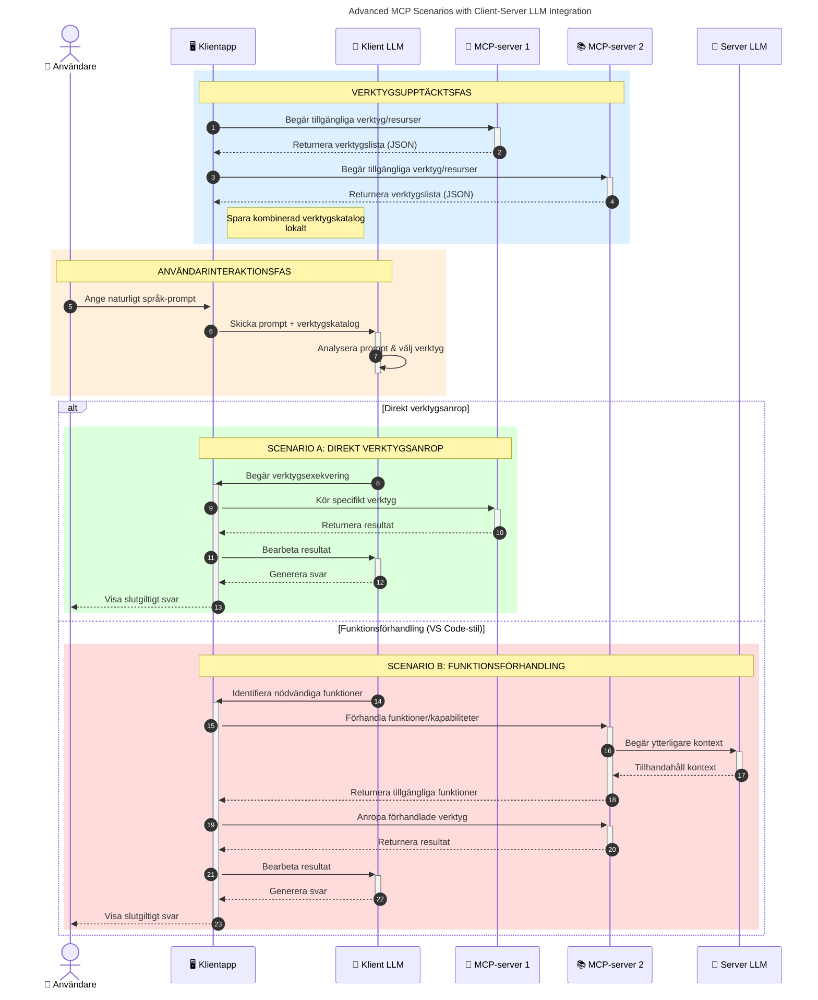

# Introduktion till Model Context Protocol (MCP): Varför det är viktigt för skalbara AI-applikationer

_(Klicka på bilden ovan för att titta på videon av denna lektion)_

Generativa AI-applikationer är ett stort steg framåt eftersom de ofta låter användaren interagera med appen via naturliga språkkommandon. Men när mer tid och resurser investeras i sådana appar vill du försäkra dig om att du enkelt kan integrera funktionaliteter och resurser på ett sätt som är lätt att utöka, att din app kan hantera mer än en modell samtidigt, och hantera olika modellkomplexiteter. Kort sagt, att bygga Gen AI-appar är enkelt att börja med, men när de växer och blir mer komplexa behöver du börja definiera en arkitektur och kommer sannolikt behöva förlita dig på en standard för att säkerställa att dina appar byggs på ett konsekvent sätt. Här kommer MCP in för att organisera saker och ge en standard.

---

## **🔍 Vad är Model Context Protocol (MCP)?**

**Model Context Protocol (MCP)** är ett **öppet, standardiserat gränssnitt** som tillåter stora språkmodeller (LLMs) att sömlöst interagera med externa verktyg, API:er och datakällor. Det erbjuder en konsekvent arkitektur för att förbättra AI-modellernas funktionalitet bortom deras träningsdata, vilket möjliggör smartare, skalbara och mer responsiva AI-system.

---

## **🎯 Varför standardisering inom AI är viktigt**

När generativa AI-appar blir mer komplexa är det avgörande att anta standarder som säkerställer **skalbarhet, utbyggbarhet, underhållbarhet** och **undviker leverantörslåsning**. MCP hanterar dessa behov genom att:

- Ena modell-verktygsintegrationer
- Minska sköra, engångsanpassade lösningar
- Tillåta flera modeller från olika leverantörer att samexistera inom ett ekosystem

**Notera:** Även om MCP kallar sig en öppen standard finns inga planer att standardisera MCP via någon existerande standardiseringsorganisation såsom IEEE, IETF, W3C, ISO eller någon annan standardorgan.

---

## **📚 Lärandemål**

I slutet av denna artikel kommer du att kunna:

- Definiera **Model Context Protocol (MCP)** och dess användningsområden
- Förstå hur MCP standardiserar modell-till-verktyg-kommunikation
- Identifiera de centrala komponenterna i MCP-arkitekturen
- Utforska verkliga tillämpningar av MCP inom företag och utvecklingskontexter

---

## **💡 Varför Model Context Protocol (MCP) är en banbrytare**

### **🔗 MCP löser fragmentering i AI-interaktioner**

Före MCP krävde integration av modeller med verktyg:

- Anpassad kod per verktyg-modellpar
- Icke-standardiserade API:er för varje leverantör
- Frekventa avbrott p.g.a. uppdateringar
- Dålig skalbarhet med fler verktyg

### **✅ Fördelar med MCP-standardisering**

| **Fördel**              | **Beskrivning**                                                                |
|--------------------------|--------------------------------------------------------------------------------|
| Interoperabilitet         | LLM:er fungerar sömlöst med verktyg från olika leverantörer                     |
| Konsistens               | Enhetligt beteende över plattformar och verktyg                                |
| Återanvändbarhet         | Verktyg byggda en gång kan användas över projekt och system                     |
| Försnabbad utveckling    | Minska utvecklingstid genom att använda standardiserade plug-and-play-gränssnitt|

---

## **🧱 Översikt av hög nivå på MCP-arkitekturen**

MCP följer en **klient-server-modell**, där:

- **MCP Hosts** kör AI-modellerna
- **MCP Clients** initierar förfrågningar
- **MCP Servers** tillhandahåller kontext, verktyg och kapaciteter

### **Nyckelkomponenter:**

- **Resurser** – Statisk eller dynamisk data för modeller  
- **Promptar** – Fördefinierade arbetsflöden för styrd generering  
- **Verktyg** – Körbara funktioner som sökning, beräkningar  
- **Sampling** – Agentiskt beteende via rekursiva interaktioner (avvecklas i `2026-07-28` utgåvekandidat)
- **Elicitation** – Serverinitierade förfrågningar om användarinmatning
- **Roots** – Filsystemgränser för serveraccesskontroll (avvecklas i `2026-07-28` utgåvekandidat)

### **Protokollarkitektur:**

MCP använder en tvålagers arkitektur:
- **Datalager**: JSON-RPC 2.0 baserad kommunikation med livscykelhantering och primitiva funktioner
- **Transportlager**: STDIO (lokal) och strömmande HTTP med SSE (fjärr) kommunikationskanaler

---

## Hur MCP-servrar fungerar

MCP-servrar opererar på följande sätt:

- **Förfrågningsflöde**:
    1. En förfrågan initieras av en slutanvändare eller programvara som agerar på deras vägnar.
    2. **MCP-klienten** skickar förfrågan till en **MCP Host**, som hanterar AI-modellens körning.
    3. **AI-modellen** tar emot användarens prompt och kan begära tillgång till externa verktyg eller data via en eller flera verktygsanrop.
    4. **MCP Host**, inte modellen direkt, kommunicerar med lämpliga **MCP-servrar** med hjälp av standardiserat protokoll.
- **MCP Host-funktioner**:
    - **Verktygsregister**: Upprätthåller en katalog över tillgängliga verktyg och deras kapaciteter.
    - **Autentisering**: Verifierar tillstånd för verktygsåtkomst.
    - **Förfrågningshanterare**: Bearbetar inkommande verktygsförfrågningar från modellen.
    - **Svarformatterare**: Strukturerar verktygsutdata i ett format som modellen kan förstå.
- **MCP-serverexekvering**:
    - **MCP Host** skickar verktygsanrop till en eller flera **MCP-servrar**, vilka exponerar specialiserade funktioner (t.ex. sökning, beräkningar, databasfrågor).
    - **MCP-servrarna** utför sina respektive operationer och returnerar resultat till **MCP Host** i ett konsekvent format.
    - **MCP Host** formaterar och vidarebefordrar dessa resultat till **AI-modellen**.
- **Svarskomplettering**:
    - **AI-modellen** införlivar verktygsutdata i ett slutgiltigt svar.
    - **MCP Host** skickar detta svar tillbaka till **MCP-klienten**, som levererar det till slutanvändaren eller anropande programvara.
    

## 👨‍💻 Hur man bygger en MCP-server (med exempel)

MCP-servrar låter dig utöka LLM-funktioner genom att tillhandahålla data och funktionalitet. 

Redo att testa? Här är språk- och/eller stackspecifika SDK:er med exempel på hur du skapar enkla MCP-servrar i olika språk/stacks:

- **Python SDK**: https://github.com/modelcontextprotocol/python-sdk

- **TypeScript SDK**: https://github.com/modelcontextprotocol/typescript-sdk

- **Java SDK**: https://github.com/modelcontextprotocol/java-sdk

- **C#/.NET SDK**: https://github.com/modelcontextprotocol/csharp-sdk

## 🌍 Verkliga användningsfall för MCP

MCP möjliggör en mängd olika tillämpningar genom att utöka AI:s förmågor:

| **Tillämpning**              | **Beskrivning**                                                                |
|------------------------------|--------------------------------------------------------------------------------|
| Företagsdataintegration      | Koppla LLM:er till databaser, CRM-system eller interna verktyg                 |
| Agentiska AI-system          | Möjliggör autonoma agenter med verktygstillgång och beslutsflöden             |
| Multimodala applikationer     | Kombinera text-, bild- och ljudverktyg inom en enda enhetlig AI-app            |
| Realtidsdataintegration       | Integrera live-data i AI-interaktioner för mer korrekta och aktuella svar       |

### 🧠 MCP = Universell standard för AI-interaktioner

Model Context Protocol (MCP) fungerar som en universell standard för AI-interaktioner, precis som USB-C standardiserade fysiska anslutningar för enheter. Inom AI-världen erbjuder MCP ett konsekvent gränssnitt som gör det möjligt för modeller (klienter) att integrera sömlöst med externa verktyg och dataleverantörer (servrar). Detta eliminerar behovet av olika, anpassade protokoll för varje API eller datakälla.

Under MCP följer ett MCP-kompatibelt verktyg (kallat en MCP-server) en enhetlig standard. Dessa servrar kan lista vilka verktyg eller åtgärder de erbjuder och utföra dessa åtgärder när de begärs av en AI-agent. AI-agentplattformar som stöder MCP kan upptäcka tillgängliga verktyg från servrarna och anropa dem via detta standardiserade protokoll.

### 💡 Underlättar tillgång till kunskap

Utöver att erbjuda verktyg underlättar MCP också tillgång till kunskap. Det möjliggör för applikationer att ge kontext till stora språkmodeller (LLMs) genom att koppla dem till olika datakällor. Till exempel kan en MCP-server representera ett företags dokumentarkiv, vilket gör det möjligt för agenter att hämta relevant information på begäran. En annan server kan hantera specifika åtgärder såsom att skicka e-post eller uppdatera register. Ur agentens perspektiv är dessa helt enkelt verktyg den kan använda—vissa verktyg returnerar data (kunskapskontext), medan andra utför handlingar. MCP hanterar båda effektivt.

En agent som ansluter till en MCP-server lär sig automatiskt serverns tillgängliga kapaciteter och åtkomliga data via ett standardiserat format. Denna standardisering möjliggör dynamisk verktygstillgänglighet. Till exempel, att lägga till en ny MCP-server till en agents system gör dess funktioner omedelbart användbara utan att agentens instruktioner behöver anpassas ytterligare.

Denna strömlinjeformade integration stämmer överens med flödet som visas i följande diagram, där servrar tillhandahåller både verktyg och kunskap och säkerställer sömlöst samarbete mellan system.

### 👉 Exempel: Skalbar agentlösning

Den universella anslutaren möjliggör att MCP-servrar kan kommunicera och dela kapaciteter med varandra, vilket tillåter ServerA att delegera uppgifter till ServerB eller använda dess verktyg och kunskap. Detta federerar verktyg och data över servrar, vilket stödjer skalbara och modulära agentarkitekturer. Eftersom MCP standardiserar exponering av verktyg kan agenter dynamiskt upptäcka och dirigera förfrågningar mellan servrar utan hårdkodade integrationer.

Verktygs- och kunskapsfederation: Verktyg och data kan nås över servrar, vilket möjliggör mer skalbara och modulära agentiska arkitekturer.

### 🔄 Avancerade MCP-scenarier med LLM-integration på klientsidan

Utöver den grundläggande MCP-arkitekturen finns avancerade scenarier där både klient och server innehåller LLM:er, vilket möjliggör mer sofistikerade interaktioner. I följande diagram kan **Klientapp** vara en IDE med ett antal MCP-verktyg tillgängliga för användning av LLM:

## 🔐 Praktiska fördelar med MCP

Här är de praktiska fördelarna med att använda MCP:

- **Aktualitet**: Modeller kan nå uppdaterad information bortom sin träningsdata
- **Kapacitetsutvidgning**: Modeller kan utnyttja specialiserade verktyg för uppgifter de inte tränats för
- **Minskade hallucinationer**: Externa datakällor skapar faktabaserad grund
- **Sekretess**: Känslig data kan stanna inom säkra miljöer istället för att bäddas in i promptar

## 📌 Viktiga slutsatser

Följande är viktiga slutsatser för användning av MCP:

- **MCP** standardiserar hur AI-modeller interagerar med verktyg och data
- Främjar **utbyggbarhet, konsistens och interoperabilitet**
- MCP hjälper till att **minska utvecklingstid, förbättra tillförlitlighet och utöka modellkapaciteter**
- Klient-server-arkitekturen **möjliggör flexibla, utbyggbara AI-applikationer**

## 🧠 Övning

Tänk på en AI-applikation du är intresserad av att bygga.

- Vilka **externa verktyg eller data** skulle kunna förbättra dess kapaciteter?
- Hur kan MCP göra integrationen **enklare och mer pålitlig?**

## Ytterligare resurser

- [MCP GitHub Repository](https://github.com/modelcontextprotocol)

## Vad som kommer härnäst

Nästa: [Kapitel 1: Kärnbegrepp](../01-CoreConcepts/README.md)

---

<!-- CO-OP TRANSLATOR DISCLAIMER START -->
**Ansvarsfriskrivning**:
Detta dokument har översatts med hjälp av AI-översättningstjänsten [Co-op Translator](https://github.com/Azure/co-op-translator). Även om vi strävar efter noggrannhet, var vänlig notera att automatiska översättningar kan innehålla fel eller brister. Det ursprungliga dokumentet på dess modersmål bör betraktas som den auktoritativa källan. För kritisk information rekommenderas professionell mänsklig översättning. Vi ansvarar inte för några missförstånd eller feltolkningar som uppstår till följd av användningen av denna översättning.
<!-- CO-OP TRANSLATOR DISCLAIMER END -->