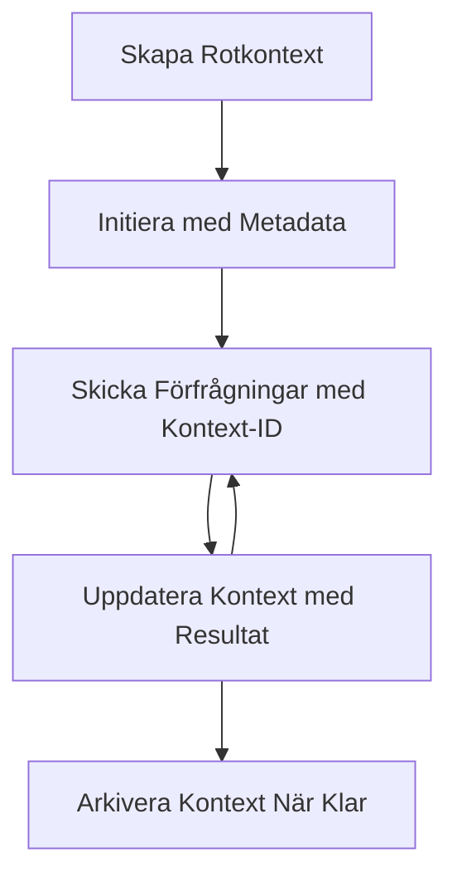

> [FASADERAD: 2026-07-28 RELEASE CANDIDATE](https://blog.modelcontextprotocol.io/posts/2026-07-28-release-candidate/#roots-sampling-and-logging-are-deprecated)

# MCP Rötter Kontexter

> **Avvecklingsmeddelande:** MCP-specifikationskandidaten `2026-07-28` markerar Rötter som föråldrade till förmån för verktygsparametrar, resurs-URI:er eller serverkonfiguration. Rötter fortsätter att fungera i `2025-11-25` och minst ett år efter någon formell avveckling, så allt i denna lektion är fortfarande giltigt - men nya serverdesigner bör utvärdera ersättningsmönstret. Se [Vad som ändras i MCP: 2026-07-28 Release Candidate](../../01-CoreConcepts/mcp-2026-07-28-release-candidate.md).

Rotkontexter är ett grundläggande koncept i Model Context Protocol som tillhandahåller ett beständigt lager för att bevara konversationshistorik och delat tillstånd över flera förfrågningar och sessioner.

## Introduktion

I denna lektion kommer vi att utforska hur man skapar, hanterar och använder rotkontexter i MCP. 

## Läromål

I slutet av denna lektion kommer du att kunna:

- Förstå syftet och strukturen för rotkontexter
- Skapa och hantera rotkontexter med MCP-klientbibliotek
- Implementera rotkontexter i .NET, Java, JavaScript och Python-applikationer
- Använda rotkontexter för flerstegs-konversationer och tillståndshantering
- Implementera bästa praxis för hantering av rotkontext

## Förstå rotkontexter

Rotkontexter fungerar som containrar som håller historik och tillstånd för en serie relaterade interaktioner. De möjliggör:

- **Konversationspersistens**: Underhålla sammanhängande flerstegs-konversationer
- **Minneshantering**: Lagra och hämta information över interaktioner
- **Tillståndshantering**: Spåra framsteg i komplexa arbetsflöden
- **Delning av kontext**: Tillåta flera klienter att få tillgång till samma konversationstillstånd

I MCP har rotkontexter dessa nyckelkarakteristika:

- Varje rotkontext har ett unikt identifierare.
- De kan innehålla konversationshistorik, användarpreferenser och annan metadata.
- De kan skapas, nås och arkiveras vid behov.
- De stödjer detaljerad åtkomstkontroll och behörigheter.

## Rotkontextens livscykel



## Arbeta med rotkontexter

Här är ett exempel på hur man skapar och hanterar rotkontexter. 

### C#-implementering

```csharp
// .NET Example: Root Context Management
using Microsoft.Mcp.Client;
using System;
using System.Threading.Tasks;
using System.Collections.Generic;

public class RootContextExample
{
    private readonly IMcpClient _client;
    private readonly IRootContextManager _contextManager;
    
    public RootContextExample(IMcpClient client, IRootContextManager contextManager)
    {
        _client = client;
        _contextManager = contextManager;
    }
    
    public async Task DemonstrateRootContextAsync()
    {
        // 1. Create a new root context
        var contextResult = await _contextManager.CreateRootContextAsync(new RootContextCreateOptions
        {
            Name = "Customer Support Session",
            Metadata = new Dictionary<string, string>
            {
                ["CustomerName"] = "Acme Corporation",
                ["PriorityLevel"] = "High",
                ["Domain"] = "Cloud Services"
            }
        });
        
        string contextId = contextResult.ContextId;
        Console.WriteLine($"Created root context with ID: {contextId}");
        
        // 2. First interaction using the context
        var response1 = await _client.SendPromptAsync(
            "I'm having issues scaling my web service deployment in the cloud.", 
            new SendPromptOptions { RootContextId = contextId }
        );
        
        Console.WriteLine($"First response: {response1.GeneratedText}");
        
        // Second interaction - the model will have access to the previous conversation
        var response2 = await _client.SendPromptAsync(
            "Yes, we're using containerized deployments with Kubernetes.", 
            new SendPromptOptions { RootContextId = contextId }
        );
        
        Console.WriteLine($"Second response: {response2.GeneratedText}");
        
        // 3. Add metadata to the context based on conversation
        await _contextManager.UpdateContextMetadataAsync(contextId, new Dictionary<string, string>
        {
            ["TechnicalEnvironment"] = "Kubernetes",
            ["IssueType"] = "Scaling"
        });
        
        // 4. Get context information
        var contextInfo = await _contextManager.GetRootContextInfoAsync(contextId);
        
        Console.WriteLine("Context Information:");
        Console.WriteLine($"- Name: {contextInfo.Name}");
        Console.WriteLine($"- Created: {contextInfo.CreatedAt}");
        Console.WriteLine($"- Messages: {contextInfo.MessageCount}");
        
        // 5. When the conversation is complete, archive the context
        await _contextManager.ArchiveRootContextAsync(contextId);
        Console.WriteLine($"Archived context {contextId}");
    }
}
```

I koden ovan har vi:

1. Skapat en rotkontext för en kundsupportsession.
1. Skickat flera meddelanden inom den kontexten, vilket tillåter modellen att behålla tillståndet.
1. Uppdaterat kontexten med relevant metadata baserat på konversationen.
1. Hämtat kontextinformation för att förstå konversationshistoriken.
1. Arkiverat kontexten när konversationen var klar.

## Exempel: Implementering av rotkontext för finansiell analys

I detta exempel skapar vi en rotkontext för en finansiell analys session, som visar hur man bevarar tillstånd över flera interaktioner.

### Java-implementering

```java
// Java Exempel: Rotkontektsimplementering
package com.example.mcp.contexts;

import com.mcp.client.McpClient;
import com.mcp.client.ContextManager;
import com.mcp.models.RootContext;
import com.mcp.models.McpResponse;

import java.util.HashMap;
import java.util.Map;
import java.util.UUID;

public class RootContextsDemo {
    private final McpClient client;
    private final ContextManager contextManager;
    
    public RootContextsDemo(String serverUrl) {
        this.client = new McpClient.Builder()
            .setServerUrl(serverUrl)
            .build();
            
        this.contextManager = new ContextManager(client);
    }
    
    public void demonstrateRootContext() throws Exception {
        // Skapa kontextmetadata
        Map<String, String> metadata = new HashMap<>();
        metadata.put("projectName", "Financial Analysis");
        metadata.put("userRole", "Financial Analyst");
        metadata.put("dataSource", "Q1 2025 Financial Reports");
        
        // 1. Skapa en ny rotkontext
        RootContext context = contextManager.createRootContext("Financial Analysis Session", metadata);
        String contextId = context.getId();
        
        System.out.println("Created context: " + contextId);
        
        // 2. Första interaktionen
        McpResponse response1 = client.sendPrompt(
            "Analyze the trends in Q1 financial data for our technology division",
            contextId
        );
        
        System.out.println("First response: " + response1.getGeneratedText());
        
        // 3. Uppdatera kontexten med viktig information från svaret
        contextManager.addContextMetadata(contextId, 
            Map.of("identifiedTrend", "Increasing cloud infrastructure costs"));
        
        // Andra interaktionen - använda samma kontext
        McpResponse response2 = client.sendPrompt(
            "What's driving the increase in cloud infrastructure costs?",
            contextId
        );
        
        System.out.println("Second response: " + response2.getGeneratedText());
        
        // 4. Generera en sammanfattning av sessionsanalysen
        McpResponse summaryResponse = client.sendPrompt(
            "Summarize our analysis of the technology division financials in 3-5 key points",
            contextId
        );
        
        // Spara sammanfattningen i kontextmetadata
        contextManager.addContextMetadata(contextId, 
            Map.of("analysisSummary", summaryResponse.getGeneratedText()));
            
        // Hämta uppdaterad kontextinformation
        RootContext updatedContext = contextManager.getRootContext(contextId);
        
        System.out.println("Context Information:");
        System.out.println("- Created: " + updatedContext.getCreatedAt());
        System.out.println("- Last Updated: " + updatedContext.getLastUpdatedAt());
        System.out.println("- Analysis Summary: " + 
            updatedContext.getMetadata().get("analysisSummary"));
            
        // 5. Arkivera kontext när klar
        contextManager.archiveContext(contextId);
        System.out.println("Context archived");
    }
}
```

I koden ovan har vi:

1. Skapat en rotkontext för en finansiell analys session.
2. Skickat flera meddelanden inom den kontexten, vilket tillåter modellen att behålla tillståndet.
3. Uppdaterat kontexten med relevant metadata baserat på konversationen.
4. Skapat en sammanfattning av analys sessionen och lagrat den i kontextens metadata.
5. Arkiverat kontexten när konversationen var klar.

## Exempel: Hantering av rotkontext

Effektiv hantering av rotkontexter är avgörande för att bevara konversationshistorik och tillstånd. Nedan är ett exempel på hur man implementerar hantering av rotkontext.

### JavaScript-implementering

```javascript
// JavaScript Exempel: Hantering av MCP Root Contexts
const { McpClient, RootContextManager } = require('@mcp/client');

class ContextSession {
  constructor(serverUrl, apiKey = null) {
    // Initialisera MCP-klienten
    this.client = new McpClient({
      serverUrl,
      apiKey
    });
    
    // Initiera kontexthanteraren
    this.contextManager = new RootContextManager(this.client);
  }
  
  /**
   * Create a new conversation context
   * @param {string} sessionName - Name of the conversation session
   * @param {Object} metadata - Additional metadata for the context
   * @returns {Promise<string>} - Context ID
   */
  async createConversationContext(sessionName, metadata = {}) {
    try {
      const contextResult = await this.contextManager.createRootContext({
        name: sessionName,
        metadata: {
          ...metadata,
          createdAt: new Date().toISOString(),
          status: 'active'
        }
      });
      
      console.log(`Created root context '${sessionName}' with ID: ${contextResult.id}`);
      return contextResult.id;
    } catch (error) {
      console.error('Error creating root context:', error);
      throw error;
    }
  }
  
  /**
   * Send a message in an existing context
   * @param {string} contextId - The root context ID
   * @param {string} message - The user's message
   * @param {Object} options - Additional options
   * @returns {Promise<Object>} - Response data
   */
  async sendMessage(contextId, message, options = {}) {
    try {
      // Skicka meddelandet med den angivna kontexten
      const response = await this.client.sendPrompt(message, {
        rootContextId: contextId,
        temperature: options.temperature || 0.7,
        allowedTools: options.allowedTools || []
      });
      
      // Valfritt lagra viktiga insikter från konversationen
      if (options.storeInsights) {
        await this.storeConversationInsights(contextId, message, response.generatedText);
      }
      
      return {
        message: response.generatedText,
        toolCalls: response.toolCalls || [],
        contextId
      };
    } catch (error) {
      console.error(`Error sending message in context ${contextId}:`, error);
      throw error;
    }
  }
  
  /**
   * Store important insights from a conversation
   * @param {string} contextId - The root context ID
   * @param {string} userMessage - User's message
   * @param {string} aiResponse - AI's response
   */
  async storeConversationInsights(contextId, userMessage, aiResponse) {
    try {
      // Extrahera potentiella insikter (i en riktig app skulle detta vara mer sofistikerat)
      const combinedText = userMessage + "\n" + aiResponse;
      
      // Enkel heuristik för att identifiera potentiella insikter
      const insightWords = ["important", "key point", "remember", "significant", "crucial"];
      
      const potentialInsights = combinedText
        .split(".")
        .filter(sentence => 
          insightWords.some(word => sentence.toLowerCase().includes(word))
        )
        .map(sentence => sentence.trim())
        .filter(sentence => sentence.length > 10);
      
      // Lagra insikter i kontextmetadata
      if (potentialInsights.length > 0) {
        const insights = {};
        potentialInsights.forEach((insight, index) => {
          insights[`insight_${Date.now()}_${index}`] = insight;
        });
        
        await this.contextManager.updateContextMetadata(contextId, insights);
        console.log(`Stored ${potentialInsights.length} insights in context ${contextId}`);
      }
    } catch (error) {
      console.warn('Error storing conversation insights:', error);
      // Icke-kritiskt fel, så bara logga varning
    }
  }
  
  /**
   * Get summary information about a context
   * @param {string} contextId - The root context ID
   * @returns {Promise<Object>} - Context information
   */
  async getContextInfo(contextId) {
    try {
      const contextInfo = await this.contextManager.getContextInfo(contextId);
      
      return {
        id: contextInfo.id,
        name: contextInfo.name,
        created: new Date(contextInfo.createdAt).toLocaleString(),
        lastUpdated: new Date(contextInfo.lastUpdatedAt).toLocaleString(),
        messageCount: contextInfo.messageCount,
        metadata: contextInfo.metadata,
        status: contextInfo.status
      };
    } catch (error) {
      console.error(`Error getting context info for ${contextId}:`, error);
      throw error;
    }
  }
  
  /**
   * Generate a summary of the conversation in a context
   * @param {string} contextId - The root context ID
   * @returns {Promise<string>} - Generated summary
   */
  async generateContextSummary(contextId) {
    try {
      // Be modellen att generera en sammanfattning av konversationen hittills
      const response = await this.client.sendPrompt(
        "Please summarize our conversation so far in 3-4 sentences, highlighting the main points discussed.",
        { rootContextId: contextId, temperature: 0.3 }
      );
      
      // Lagra sammanfattningen i kontextmetadata
      await this.contextManager.updateContextMetadata(contextId, {
        conversationSummary: response.generatedText,
        summarizedAt: new Date().toISOString()
      });
      
      return response.generatedText;
    } catch (error) {
      console.error(`Error generating context summary for ${contextId}:`, error);
      throw error;
    }
  }
  
  /**
   * Archive a context when it's no longer needed
   * @param {string} contextId - The root context ID
   * @returns {Promise<Object>} - Result of the archive operation
   */
  async archiveContext(contextId) {
    try {
      // Generera en slutlig sammanfattning innan arkivering
      const summary = await this.generateContextSummary(contextId);
      
      // Arkivera kontexten
      await this.contextManager.archiveContext(contextId);
      
      return {
        status: "archived",
        contextId,
        summary
      };
    } catch (error) {
      console.error(`Error archiving context ${contextId}:`, error);
      throw error;
    }
  }
}

// Exempel på användning
async function demonstrateContextSession() {
  const session = new ContextSession('https://mcp-server-example.com');
  
  try {
    // 1. Skapa en ny kontext för en produktstöds-konversation
    const contextId = await session.createConversationContext(
      'Product Support - Database Performance',
      {
        customer: 'Globex Corporation',
        product: 'Enterprise Database',
        severity: 'Medium',
        supportAgent: 'AI Assistant'
      }
    );
    
    // 2. Första meddelandet i konversationen
    const response1 = await session.sendMessage(
      contextId,
      "I'm experiencing slow query performance on our database cluster after the latest update.",
      { storeInsights: true }
    );
    console.log('Response 1:', response1.message);
    
    // Uppföljningsmeddelande i samma kontext
    const response2 = await session.sendMessage(
      contextId,
      "Yes, we've already checked the indexes and they seem to be properly configured.",
      { storeInsights: true }
    );
    console.log('Response 2:', response2.message);
    
    // 3. Hämta information om kontexten
    const contextInfo = await session.getContextInfo(contextId);
    console.log('Context Information:', contextInfo);
    
    // 4. Generera och visa konversationssammanfattning
    const summary = await session.generateContextSummary(contextId);
    console.log('Conversation Summary:', summary);
    
    // 5. Arkivera kontexten när du är klar
    const archiveResult = await session.archiveContext(contextId);
    console.log('Archive Result:', archiveResult);
    
    // 6. Hantera eventuella fel på ett smidigt sätt
  } catch (error) {
    console.error('Error in context session demonstration:', error);
  }
}

demonstrateContextSession();
```

I koden ovan har vi:

1. Skapat en rotkontext för en produktstöds-konversation med funktionen `createConversationContext`. I detta fall handlar kontexten om databaspersformanceproblem.

1. Skickat flera meddelanden inom den kontexten, vilket tillåter modellen att behålla tillstånd med funktionen `sendMessage`. De skickade meddelandena handlar om långsam frågeprestanda och indexkonfiguration.

1. Uppdaterat kontexten med relevant metadata baserat på konversationen.

1. Skapat en sammanfattning av konversationen och lagrat den i kontextens metadata med funktionen `generateContextSummary`.

1. Arkiverat kontexten när konversationen var klar med funktionen `archiveContext`.

1. Hanterat fel smidigt för att säkerställa robusthet.

## Rotkontext för flerstegsassistans

I detta exempel skapar vi en rotkontext för en flerstegsassistanssession, som visar hur man bevarar tillstånd över flera interaktioner.

### Python-implementering

```python
# Python Exempel: Rotkontext för flernivåassistans
import asyncio
from datetime import datetime
from mcp_client import McpClient, RootContextManager

class AssistantSession:
    def __init__(self, server_url, api_key=None):
        self.client = McpClient(server_url=server_url, api_key=api_key)
        self.context_manager = RootContextManager(self.client)
    
    async def create_session(self, name, user_info=None):
        """Create a new root context for an assistant session"""
        metadata = {
            "session_type": "assistant",
            "created_at": datetime.now().isoformat(),
        }
        
        # Lägg till användarinformation om tillhandahållen
        if user_info:
            metadata.update({f"user_{k}": v for k, v in user_info.items()})
            
        # Skapa rotkontexten
        context = await self.context_manager.create_root_context(name, metadata)
        return context.id
    
    async def send_message(self, context_id, message, tools=None):
        """Send a message within a root context"""
        # Skapa alternativ med kontext-ID
        options = {
            "root_context_id": context_id
        }
        
        # Lägg till verktyg om angivna
        if tools:
            options["allowed_tools"] = tools
        
        # Skicka prompten inom kontexten
        response = await self.client.send_prompt(message, options)
        
        # Uppdatera kontextmetadata med samtalsprogress
        await self.context_manager.update_context_metadata(
            context_id,
            {
                f"message_{datetime.now().timestamp()}": message[:50] + "...",
                "last_interaction": datetime.now().isoformat()
            }
        )
        
        return response
    
    async def get_conversation_history(self, context_id):
        """Retrieve conversation history from a context"""
        context_info = await self.context_manager.get_context_info(context_id)
        messages = await self.client.get_context_messages(context_id)
        
        return {
            "context_info": context_info,
            "messages": messages
        }
    
    async def end_session(self, context_id):
        """End an assistant session by archiving the context"""
        # Generera en sammanfattande prompt först
        summary_response = await self.client.send_prompt(
            "Please summarize our conversation and any key points or decisions made.",
            {"root_context_id": context_id}
        )
        
        # Spara sammanfattning i metadata
        await self.context_manager.update_context_metadata(
            context_id,
            {
                "summary": summary_response.generated_text,
                "ended_at": datetime.now().isoformat(),
                "status": "completed"
            }
        )
        
        # Arkivera kontexten
        await self.context_manager.archive_context(context_id)
        
        return {
            "status": "completed",
            "summary": summary_response.generated_text
        }

# Exempel på användning
async def demo_assistant_session():
    assistant = AssistantSession("https://mcp-server-example.com")
    
    # 1. Skapa session
    context_id = await assistant.create_session(
        "Technical Support Session",
        {"name": "Alex", "technical_level": "advanced", "product": "Cloud Services"}
    )
    print(f"Created session with context ID: {context_id}")
    
    # 2. Första interaktionen
    response1 = await assistant.send_message(
        context_id, 
        "I'm having trouble with the auto-scaling feature in your cloud platform.",
        ["documentation_search", "diagnostic_tool"]
    )
    print(f"Response 1: {response1.generated_text}")
    
    # Andra interaktionen i samma kontext
    response2 = await assistant.send_message(
        context_id,
        "Yes, I've already checked the configuration settings you mentioned, but it's still not working."
    )
    print(f"Response 2: {response2.generated_text}")
    
    # 3. Hämta historik
    history = await assistant.get_conversation_history(context_id)
    print(f"Session has {len(history['messages'])} messages")
    
    # 4. Avsluta session
    end_result = await assistant.end_session(context_id)
    print(f"Session ended with summary: {end_result['summary']}")

if __name__ == "__main__":
    asyncio.run(demo_assistant_session())
```

I koden ovan har vi:

1. Skapat en rotkontext för en teknisk supportsession med funktionen `create_session`. Kontexten inkluderar användarinformation såsom namn och teknisk nivå.

1. Skickat flera meddelanden inom den kontexten, vilket tillåter modellen att behålla tillstånd med funktionen `send_message`. De skickade meddelandena gäller problem med autoskalningsfunktionen.

1. Hämtat konversationshistorik med funktionen `get_conversation_history`, som tillhandahåller kontextinformation och meddelanden.

1. Avslutat sessionen genom att arkivera kontexten och generera en sammanfattning med funktionen `end_session`. Sammanfattningen fångar viktiga punkter från konversationen.

## Bästa praxis för rotkontext

Här är några bästa praxis för effektiv hantering av rotkontexter:

- **Skapa fokuserade kontexter**: Skapa separata rotkontexter för olika konversationsändamål eller domäner för att behålla tydlighet.

- **Sätt utgångspolicys**: Implementera policys för att arkivera eller ta bort gamla kontexter för att hantera lagring och följa datalagringspolicyer.

- **Lagra relevant metadata**: Använd kontextmetadata för att lagra viktig information om konversationen som kan vara användbar senare.

- **Använd kontext-ID:n konsekvent**: När en kontext är skapad, använd dess ID konsekvent för alla relaterade förfrågningar för att behålla kontinuitet.

- **Skapa sammanfattningar**: När en kontext blir stor, överväg att skapa sammanfattningar för att fånga essentiell information samtidigt som kontextstorleken hanteras.

- **Implementera åtkomstkontroll**: För system med flera användare, implementera korrekt åtkomstkontroll för att säkerställa sekretess och säkerhet för konversationskontexter.

- **Hanterar kontextbegränsningar**: Var medveten om kontextstorleksbegränsningar och implementera strategier för att hantera mycket långa konversationer.

- **Arkivera när klar**: Arkivera kontexter när konversationer är klara för att frigöra resurser samtidigt som konversationshistoriken bevaras.

## Vad som komma skall

- [5.5 Routing](../mcp-routing/README.md)

---

<!-- CO-OP TRANSLATOR DISCLAIMER START -->
**Ansvarsfriskrivning**:
Detta dokument har översatts med hjälp av AI-översättningstjänsten [Co-op Translator](https://github.com/Azure/co-op-translator). Även om vi strävar efter noggrannhet, var vänlig notera att automatiska översättningar kan innehålla fel eller brister. Det ursprungliga dokumentet på dess modersmål bör betraktas som den auktoritativa källan. För kritisk information rekommenderas professionell mänsklig översättning. Vi ansvarar inte för några missförstånd eller feltolkningar som uppstår till följd av användningen av denna översättning.
<!-- CO-OP TRANSLATOR DISCLAIMER END -->