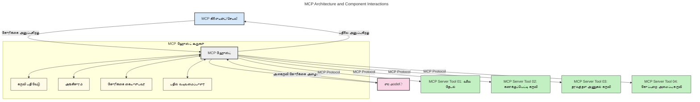
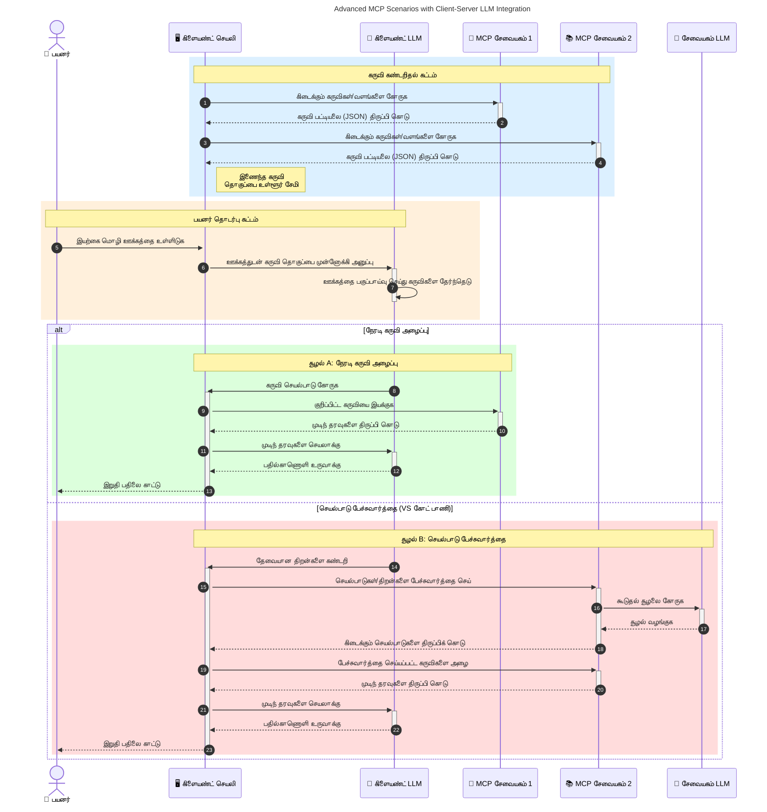

# மாதிரி சங்கிலி நடைமுறைக்குரிய அறிமுகம் (MCP): பருமன் AI பயன்பாடுகளுக்கு அது ஏன் முக்கியமானது

[](https://youtu.be/agBbdiOPLQA)

_(இந்த படத்தை கிளிக் செய்து இந்த பாடத்தின் வீடியோவை பாருங்கள்)_

ஜெனரேட்டிவ் AI பயன்பாடுகள் பயனர் இயல்பான மொழிப் பரிந்துரைகளைப் பயன்படுத்தி செயலிகளுடன் தொடர்பு கொள்ள அனுமதிப்பதற்கு சிறந்த முன்னேற்றமாக உள்ளன. ஆனால், இந்த மாதிரி செயலிகளுக்கு அதிகமான நேரமும் வளங்களும் முதலீடு செய்யப்படும்போது, நீங்கள் செயல்பாடுகள் மற்றும் வளங்களை எளிதில் ஒருங்கிணைக்க முடியும் என்று உறுதி செய்ய வேண்டும், அது விரிவுபடுத்த எளிதாக இருக்க வேண்டும், உங்கள் பயன்பாடு ஒரு மாதிரிக்கு மேற்பட்டதை கையாள முடியும் என்று, மேலும் பல மாதிரி சிக்கல்களை கையாள முடியும் என்பதை உறுதி செய்ய வேண்டும். சுருக்கமாக, ஜெனிய AI செயலிகளை ஆரம்பிப்பது எளிது, ஆனால் அவை வளர்ந்து சிக்கலாக வாய்ப்படும்போது, நீங்கள் ஒரு வடிவமைப்பை வரையறுக்கத் தொடங்க வேண்டும் மற்றும் உங்கள் பயன்பாடுகள் ஒரே மாதிரியில் கட்டப்பட்டுள்ளதை உறுதிசெய்ய ஒரு நடைமுறையைக் கடைபிடிக்க வேண்டியிருக்கும். இதுவே MCP வந்தது இந்த அனைத்தையும் ஒழுங்குபடுத்து மற்றும் ஒரு முறைபாடு வழங்குவதற்கு.

---

## **🔍 மாதிரி சங்கிலி நடைமுறை (MCP) என்றால் என்ன?**

**மாதிரி சங்கிலி நடைமுறை (MCP)** என்பது பெரிய மொழி மாதிரிகள் (LLMs) வெளிப்புற கருவிகள், APIக்கள் மற்றும் தரவுத் தளங்களுடன் இலக்கப்பரிசு இல்லாமல் ஒன்றிணைக்க அனுமதிக்கும் **திறந்த, தரநிலைப்படுத்தப்பட்ட இடைமுகம்** ஆகும். இது AI மாதிரி செயல்திறனை அவர்களின் பயிற்சி தரவுக்கு அப்பால் மேம்படுத்த ஒரு ஒருங்கிணைந்த கட்டமைப்பை வழங்குகிறது, மேலும் சிறந்த, பருமன் மற்றும் பதிலளிக்கும் AI அமைப்புகளை சாத்தியமாக்குகிறது.

---

## **🎯 AIயில் தரநிலைப்படுத்தல் ஏன் முக்கியம்?**

ஜெனரேட்டிவ் AI பயன்பாடுகள் மேலும் சிக்கலானதாக மாறும் போது, **பருமன், விரிவாக்கக்கூடாது, பராமரிப்பில் எளிதாக,** மற்றும் **விற்பனையாளர் கட்டுப்பாடு தவிர்ப்பு** என்பதை உறுதி செய்கிற தரநிலைகளை கடைபிடிப்பது அவசியம். MCP இந்த தேவைகளை பூர்த்தி செய்கிறது:

- மாதிரி-கருவி ஒருங்கிணைப்புகளை ஒருங்கிணைக்கும்
- பலவீனமான தனிப்பயன் தீர்வுகளை குறைக்கும்
- வெவ்வேறு விற்பனையாளர்கள் இருந்து பல மாதிரிகள் ஒரே சூழலில் இணங்க இருப்பதற்கான அனுமதி வழங்கும்

**குறிப்பு:** MCP தன்னை திறந்த தரநிலையாக விளக்கும் போதும், IEEE, IETF, W3C, ISO அல்லது வேறு தரநிலை அமைப்புகளில் MCPயை தரநிலைப்படுத்த திட்டங்கள் எதுவும் இல்லை.

---

## **📚 கற்றல் நோக்கங்கள்**

இந்த கட்டுரை முடிவில் நீங்கள் இதை செய்யக்கூடியவள்:

- **மாதிரி சங்கிலி நடைமுறை (MCP)** என்ன என்று வரையறுக்கவும் மற்றும் அதன் பயன்பாடுகளை அறிந்து கொள்
- MCP மாதிரி-கருவி தொடர்புகளை எவ்வாறு தரநிலைப்படுத்தும் என்பதை புரிந்துகொள்
- MCP கட்டமைப்பு முக்கிய கூறுகளை அடையாளப்படுத்து
- நிறுவன மற்றும் மேம்பாட்டு சூழலைகளில் MCP நிா்மானிகள் மேலும் பயன்பாடுகளைக் காண்க

---

## **💡 மாதிரி சங்கிலி நடைமுறை (MCP) எப்படி விளைவுகளை மாற்றுகிறது**

### **🔗 MCP AI தொடர்புகளில் பிரிவினையைத் தணிக்கிறது**

MCPக்கு முன், மாதிரிகளையும் கருவிகளையும் ஒருமித்தமாக இணைப்பது:

- ஒவ்வொரு கருவி-மாதிரி ஜோடியுக்கான தனிப்பயன் குறியீடு
- ஒவ்வொரு விற்பனையாளருக்குமான தரநிலையற்ற APIக்கள்
- புதுப்பிப்புகளால் ஏற்படும் அடிக்கடி உட்ங்களிப்புகள்
- அதிகமான கருவிகளால் குறைந்த பருமன்

### **✅ MCP தரநிலைப்படுத்தலின் பயன்கள்**

| **பயன்**              | **விவரம்**                                                                |
|--------------------------|--------------------------------------------------------------------------------|
| ஒருங்குமை               | LLMகள் வெவ்வேறு விற்பனையாளர்களின் கருவிகளுடன் தடை இல்லாமல் இயங்கி விடும்                       |
| ஒற்றுமை                | தளம் மற்றும் கருவிகளில் ஒரே மாதிரியான நடத்தை                                    |
| மறுபயன்பாடு            | ஒரு முறை உருவாக்கப்பட்ட கருவிகள் பல திட்டங்களுடனும் அமைப்புகளுடனும் பயன்படுத்தப்படலாம்                       |
| விரைவான மேம்பாடு        | தரநிலைப்படுத்தப்பட்ட, பிளக்-அண்ட்-பிளே இடைமுகங்களை பயன்படுத்தி மேம்பாட்டை குறைக்கவும்                |

---

## **🧱 உயர் நிலை MCP கட்டமைப்பு மதிப்பாய்வு**

MCP ஒரு **க்ளையன்ட்-செர்வர் மாதிரியைக்** கடைப்பிடிக்கிறது, இதில்:

- **MCP ஹோஸ்ட்கள்** AI மாதிரிகளை இயக்குகின்றன
- **MCP கிளையன்டுகள்** கோரிக்கைகளை தொடங்குகின்றன
- **MCP சர்வர்கள்** சூழல், கருவிகள் மற்றும் திறன்களை வழங்குகின்றன

### **முக்கிய கூறுகள்:**

- **வளங்கள்** – மாதிரிகளுக்கு நிலையான அல்லது இயக்கக்கூடிய தரவு  
- **பிராம்ட்கள்** – வழிநடத்தப்பட்ட உருவாக்கத்திற்கான முன்பிராம்ட் வேலைவடிவங்கள்  
- **கருவிகள்** – தேடல், கணக்கீடுகள் போன்ற செயல்படுத்தக்கூடிய செயலிகள்  
- **சேம்பிளிங்** – மீளமுயற்சி கொண்ட முகவர் செயல் (2026-07-28 வெளியீட்டு வேற்பாட்டாளர் இடமாற்றப்பட்டவை)  
- **எலிசிடேஷன்** – பயனர் உள்ளீட்டிற்கு சர்வர் தூண்டல் கோரிக்கைகள்
- **ருட்ஸ்** – சர்வர் அணுகல் கட்டுப்பாட்டிற்கான கோப்பு தொகுதி எல்லைகள் (2026-07-28 வெளியீட்டு வேற்பாட்டாளர் இடமாற்றப்பட்டவை)

### **நடைமுறை கட்டமைப்பு:**

MCP இரண்டு அடுக்கு கட்டமைப்பைக் கொண்டுள்ளது:
- **தரவு அடுக்கு**: JSON-RPC 2.0 அடிப்படையிலான தொடர்பு வாழ்க்கைச் சுற்றுச் மேலாண்மை மற்றும் ஆரம்பக்கட்டைகள்
- **போக்குவரத்து அடுக்கு**: STDIO (உள்ளூர்) மற்றும் SSE உடன் ஸ்ட்ரீமப்ட்ஹ்டிபி தொிர்போக இணைப்புக்களில் (தொலை) தொடர்பு சேனல்கள்

---

## MCP சர்வர்கள் எப்படி செயல்படுகின்றன

MCP சர்வர்கள் பின்வரும் முறையில் இயங்குகின்றன:

- **கோரிக்கை ஓட்டம்**:
    1. கோரிக்கை ஒரு இறுதி பயனர் அல்லது அவர behalf செயல்படும் மென்பொருள் மூலம் தொடங்கப்படுகிறது.
    2. **MCP கிளையன்ட்** கோரிக்கையை **MCP ஹோஸ்டுக்கு** அனுப்புகிறது, இது AI மாதிரி ரன்டைம் நிர்வகிக்கிறது.
    3. **AI மாதிரி** பயனர் பிராம்ட் பெறுகிறது மற்றும் ஒரு அல்லது பல கருவி அழைப்புகளின் மூலம் வெளிப்புற கருவிகள் அல்லது தரவு அணுகலைக் கோரலாம்.
    4. **MCP ஹோஸ்ட்**, மாதிரிக்கு நேரடியாக அல்ல, பொருத்தமான **MCP சர்வர்(கள்)** உடன் தரநிலை நடைமுறை மூலம் தொடர்பு கொள்கிறது.
- **MCP ஹோஸ்ட் செயல்பாடு**:
    - **கருவி பதிவு**: கிடைக்கும் கருவிகள் மற்றும் திறன்கள் பட்டியலை பராமரிக்கிறது.
    - **அங்கீகாரம்**: கருவி அணுகல் அனுமதிகளை சரிபார்க்கிறது.
    - **கோரிக்கை நிர்வாகி**: மாதிரிடமிருந்து வந்த கருவி கோரிக்கைகளை செயலாக்குகிறது.
    - **பதிலளிப்பு வடிவமைப்பாளர்**: மாதிரியால் புரியும் வடிவத்தில் கருவி வெளியீடுகளை அமைக்கிறது.
- **MCP சர்வர் செயல்பாடு**:
    - **MCP ஹோஸ்ட்** ஒரு அல்லது பல **MCP சர்வர்களுக்கு** கருவி அழைப்புகளை வழிசெய்கிறது, ஒவ்வொன்றும் சிறப்பு செயலிகளை (எ.கா., தேடல், கணக்கீடுகள், தரவுத்தளம் விசாரணைகள்) வெளிப்படுத்து.
    - **MCP சர்வர்கள்** தங்கள் செயல்பாடுகளை செய்கின்றன மற்றும் முடிவுகளை ஒரே வடிவத்தில் **MCP ஹோஸ்டுக்கு** திருப்பி அளிக்கின்றன.
    - **MCP ஹோஸ்ட்** இந்த முடிவுகளை வடிவமைத்து **AI மாதிரிக்குச்** அனுப்புகிறது.
- **பதிலளிப்பு நிறைவு**:
    - **AI மாதிரி** கருவி வெளியீடுகளை இறுதி பதிலில் அடங்கவைக்கிறது.
    - **MCP ஹோஸ்ட்** அந்த பதிலை மீண்டும் **MCP கிளையன்ட்** க்கு அனுப்புகிறது, அது இறுதி பயனருக்கு அல்லது அழைக்கும் மென்பொருளுக்கு பரிமாறுகிறது.
    



## 👨‍💻 MCP சர்வர் எப்படி கட்டுவது (உதாரணங்களுடன்)

MCP சர்வர்கள் LLM திறன்களை தரவு மற்றும் செயல்பாடுகளை வழங்குவதன் மூலம் விரிவாக்க அனுமதிக்கின்றன.

முயற்சி செய்ய தயாரா? வெவ்வேறு மொழிகள்/ஸ்டாக்களில் எளிய MCP சர்வர்களை உருவாக்க உதவும் SDKகள் மற்றும் உதாரணங்கள் இங்கே உள்ளன:

- **Python SDK**: https://github.com/modelcontextprotocol/python-sdk

- **TypeScript SDK**: https://github.com/modelcontextprotocol/typescript-sdk

- **Java SDK**: https://github.com/modelcontextprotocol/java-sdk

- **C#/.NET SDK**: https://github.com/modelcontextprotocol/csharp-sdk


## 🌍 MCPக்கான உண்மையான உலக பயன்பாடுகள்

MCP AI திறன்களை விரிவாக்குவதன் மூலம் பலவகை பயன்பாடுகளுக்கு அனுமதிக்கிறது:

| **பயன்பாடு**              | **விவரம்**                                                                |
|------------------------------|--------------------------------------------------------------------------------|
| நிறுவன தரவுக் இணைப்புகள்  | LLMகளை தரவுத்தளங்கள், CRMகள் அல்லது உள்ளக கருவிகளுடன் இணைக்கிறது                             |
| முகவர் AI அமைப்புகள்           | கருவி அணுகலும் முடிவு எடுக்கல் வேலைவடிவங்களுடன் சுயமாக செயல்படும் முகவர்களை இயக்கு        |
| பன்மாதிரி செயலிகள்     | ஒரு ஒருங்கிணைந்த AI செயலியில் உரை, படம் மற்றும் ஒலி கருவிகளை சேர்க்கிறது            |
| நேரடி தரவுக் இணைப்புகள்   | AI தொடர்புகளில் நேரடி தரவை கொண்டு வந்து அதிகமாக துல்லியமான, தற்போதைய வெளிப்பாடுகளை வழங்குகிறது        |


### 🧠 MCP = AI தொடர்புகளுக்கான உலகளாவிய தரநிலை

மாதிரி சங்கிலி நடைமுறை (MCP) AI தொடர்புகளுக்கு உலகளாவிய தரநிலை ஆக செயல்படுகிறது, USB-C பொருட்களின் இயந்திர இணைப்புகளுக்கு தரநிலைப்படுத்தியது போல. AI உலகத்தில், MCP ஒரே மாதிரியான இடைமுகத்தை வழங்குகிறது, இது மாதிரிகளை (கிளையன்ட்கள்) வெளிப்புற கருவிகள் மற்றும் தரவு வழங்குநர்களுடன் (சர்வர்கள்) இலக்குத்தனமாக இணைக்க அனுமதிக்கிறது. இது ஒவ்வொரு API அல்லது தரவு மூலம் தனித்தனி தனிப்பயன் நடைமுறைகளைக் தவிர்க்க உதவுகிறது.

MCP அடிப்படையில், ஒரு MCP இணக்கமான கருவி (MCP சர்வர் என்று குறிப்பிடப்படும்) ஒருமித்த தரநிலையை பின்பற்றுகிறது. இந்த சர்வர்கள் தங்கள் கருவிகள் அல்லது செயல்களை பட்டியலிட முடியும் மற்றும் AI முகவர் கோரிக்கை செய்வதில் அந்த செயல்களை விரைவாக செயல்படுத்த முடியும். MCPக்கு ஆதரவு வழங்கும் ஏஜென்ட் தளங்கள் சர்வர்களில் உள்ள கருவிகளை கண்டறிந்து, இந்த தரநிலை நடைமுறையின் மூலம் அவற்றை அழைக்க முடியும்.

### 💡 அறிவுக்கு அணுகலை எளிதாக்குகிறது

கருவிகளை வழங்குவதினைத் தவிர MCP அறிவுக்கு அணுகலை எளிதாக்குகிறது. இது பயன்பாடுகளை பெரிய மொழி மாதிரிகளுக்கு (LLMs) பல்வேறு தரவு மூலங்களுடன் இணைத்து சூழலை வழங்கும் வகையில் திறன் வாய்ந்ததாக செய்கிறது. உதாரணமாக, ஒரு MCP சர்வர் நிறுவனத்தின் ஆவண அகராதியை பிரதிநிதித்துவமாக்கலாம், இதில் முகவர்கள் தேவையான தகவலை விரும்பிய நேரத்தில் பெற முடியும். மற்றொரு சர்வர் தனியாக கூரியர்கள் அனுப்புதல் அல்லது பதிவுகளை புதுப்பித்தல் போன்ற குறிப்பிட்ட செயல்களை கையாள முடியும். முகவரின் பார்வையில், இவை சில கருவிகள் மட்டுமே - சில கருவிகள் தரவு (அறிவு சூழல்) திருப்புகின்றன, மற்றவை செயல்களை செய்கின்றன. MCP இரண்டும் திறமையாக கையாள்கிறது.

MCP சர்வருக்கு இணைக்கப்பட்ட முகவர் அந்த சர்வரின் கிடைக்கக்கூடிய திறன்கள் மற்றும் அணுகக்கூடிய தரவு ஒரு தரநிலையான வடிவில் தானாக கற்றுக்கொள்வான். இந்த தரநிலைப்படுத்தல் இயக்க דக்க கருவி கிடைக்கலை உறுதி செய்கிறது. உதாரணமாக, ஒரு புதிய MCP சர்வரை முகவரின் அமைப்பில் சேர்க்கும்போது அதன் செயல்பாடுகள் உடனடியாக பயன்பாட்டுக்கு வருகிறது, மேலும் முகவரின் கட்டளையை மறு அமைப்பு செய்ய தேவையில்லை.

இந்த சம்மந்தான ஒருங்கிணைப்பு அடுத்த வரைபடத்தில் காட்டபட்டுள்ளது, இதில் சர்வர்கள் கருவிகள் மற்றும் அறிவை வழங்குகின்றன, அமைப்புகளுக்கு இடையே தனித்தனியான ஒத்துழைப்பை உறுதி செய்கின்றன.

### 👉 உதாரணம்: பருமன் முகவர் தீர்வு

```mermaid
---
title: Scalable Agent Solution with MCP
description: A diagram illustrating how a user interacts with an LLM that connects to multiple MCP servers, with each server providing both knowledge and tools, creating a scalable AI system architecture
---
graph TD
    User -->|உத்தரவு| LLM
    LLM -->|பதில்| User
    LLM -->|MCP| ServerA
    LLM -->|MCP| ServerB
    ServerA -->|பொதுமயமான இணைப்பி| ServerB
    ServerA --> KnowledgeA
    ServerA --> ToolsA
    ServerB --> KnowledgeB
    ServerB --> ToolsB

    subgraph சேவையகம் A
        KnowledgeA[அறிவு]
        ToolsA[கருவிகள்]
    end

    subgraph சேவையகம் B
        KnowledgeB[அறிவு]
        ToolsB[கருவிகள்]
    end
```
ஜெனரிக் இணைப்பாளர் MCP சர்வர்களுக்கு ஒருவருடன் மற்றவருடன் தொடர்பு கொள்ளும் மற்றும் திறன்களை பகிர்ந்துகொள்ளும் வாய்ப்பை வழங்குகிறது, இதனால் ServerA ServerBக்கு பணிகளை ஒப்படைக்க முடியும் அல்லது அதன் கருவிகள் மற்றும் அறிவை அணுகலாம். இது சர்வர்கள் மத்தியில் கருவிகள் மற்றும் தரவு பகிர்வை ஏற்படுத்துகிறது, பருமனான மற்றும் தொகுக்கக்கூடிய முகவர் கட்டமைப்புகளுக்கு ஆதரவாகும். MCP கருவி காட்சியளிப்பை தரநிலைப்படுத்துவதால், முகவர்கள் உறுதியான ஒருங்கிணைப்புகள் இல்லாமல் சர்வர்களை இடைநிலை உருவாக்கி கோரிக்கைகளை வழிசெலுத்த முடியும்.


கருவி மற்றும் அறிவு பகிர்வு: கருவிகள் மற்றும் தரவுகளுக்கு சர்வர்களுக்கு இடையிலான அணுகல் பருமனான மற்றும் தொகுக்கக்கூடிய முகவர்கள்வடான கட்டமைப்பை வழங்குகிறது.

### 🔄 முன்முயற்சி MCP சூழல்கள் க்ளையன்ட் பக்க LLM இணைப்புடன்

அடிப்படை MCP கட்டமைப்பைத் தாண்டி, முன்முயற்சி சூழல்கள் உள்ளன, அவைகளில் கிளையன்ட் மற்றும் சர்வர் இரண்டும் LLMகளை கொண்டிருக்கும், மேலும் அதிக எழுத்து தொடர்புகளை நாம்காண்கிறோம். பின்வரும் வரைபடத்தில், **கிளையன்ட் செயலி** LLM மூலம் பயன்படுத்தக்கூடிய பல MCP கருவிகள் கொண்ட ஒரு IDE ஆக இருக்கலாம்:



## 🔐 MCPயின் நடைமுறைக் குணங்கள்

MCP பயன்படுத்துவதன் நடைமுறை விளைவுகள்:

- **புதியவை**: மாதிரிகள் பயிற்சி தரவுக்கு அப்பால் புதுப்பிக்கப்பட்டத் தகவல்களை அணுக முடியும்
- **திறன் விரிதல்**: மாதிரிகள் பயிற்சியிடப்படாத பணிகளுக்கான சிறப்பு கருவிகளை பயன்படுத்தலாம்
- **கற்பனைகள் குறைவு**: வெளிப்புற தரவு மூலங்கள் உண்மையான அடிப்படையை வழங்குகின்றன
- **தனியுரிமை**: சென்டிவ் தகவல்கள் அழைப்பில் உள்ளடக்குவதைவிட பாதுகாப்பான சுற்றுச்சூழலில் இருக்க முடியும்

## 📌 முக்கிய எடுத்துக்காட்டுகள்

MCP பயன்படுத்துவதற்கான முக்கிய எடுத்துக்காட்டுகள்:

- **MCP** AI மாதிரிகள் கருவிகளுடன் மற்றும் தரவுடன் தொடர்பு கொள்ளும் முறையை தரநிலைப்படுத்துகிறது
- **விரிவாக்கம், ஒற்றுமை மற்றும் ஒருங்குமை**க்கு துணை செய்கிறது
- MCP மேம்பாட்டு நேரத்தை குறைக்கவும், நம்பகத்தன்மையை மேம்படுத்தவும் மற்றும் மாதிரி திறன்களை விரிவாக்கவும் உதவுகிறது
- கிளையன்ட்-செர்வர் கட்டமைப்பு **நெகிழ்வான, விரிவாக்கக்கூடிய AI செயலிகளை** கையாள உதவுகிறது

## 🧠 பயிற்சி

நீங்கள் கட்ட விரும்பும் AI செயலியை பற்றி யோசிக்கவும்.

- எந்த வெளிப்புற கருவிகள் அல்லது தரவு அதன் திறன்களை மேம்படுத்தும்?
- MCP ஒருங்கிணைப்பை எவ்வாறு சுலபமாகவும் நம்பகமாகவும் செய்யலாம்?

## கூடுதல் வளங்கள்

- [MCP GitHub தொகுப்பு](https://github.com/modelcontextprotocol)


## அடுத்தது என்ன

அடுத்தது: [அத்தியாயம் 1: அடிப்படைக் கருத்துகள்](../01-CoreConcepts/README.md)

---

<!-- CO-OP TRANSLATOR DISCLAIMER START -->
**மறுப்பு**:
இந்த ஆவணம் AI மொழிபெயர்ப்பு சேவை [Co-op Translator](https://github.com/Azure/co-op-translator) பயன்படுத்தி மொழிபெயர்க்கப்பட்டுள்ளது. நாங்கள் துல்லியத்திற்காக முயற்சி செய்துள்ளோம், ஆனால் தானாக செய்யப்படும் மொழிபெயர்ப்புகளில் பிழைகள் அல்லது தவறுகள் இருக்கலாம் என்பதை கவனத்தில் கொள்ளவும். அசல் ஆவணம் அதன் தாய்மொழியில் அதிகாரப்பூர்வ ஆதாரமாக கருதப்பட வேண்டும். முக்கியமான தகவல்களுக்கு, தொழில்நுட்பமான மனித மொழிபெயர்ப்பு பரிந்துரைக்கப்படுகிறது. இந்த மொழிபெயர்ப்பைப் பயன்படுத்துவதால் ஏற்படும் எந்த தவறான புரிதல்கள் அல்லது தவறான விளக்கத்திற்கும் நாங்கள் பொறுப்பில்வில்லை.
<!-- CO-OP TRANSLATOR DISCLAIMER END -->