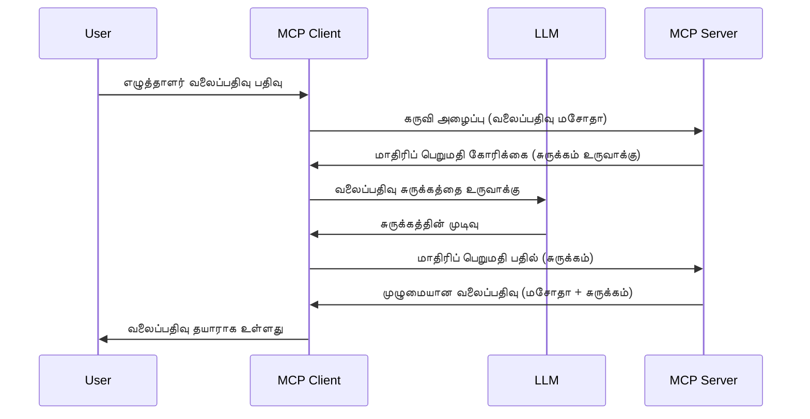

> [மூலமாக்கப்பட்டது: 2026-07-28 வெளியீடு வேட்பாளர்](https://blog.modelcontextprotocol.io/posts/2026-07-28-release-candidate/)

# மாதவிடாய் - விசாரணை பணிகளை கிளையண்டுக்கு ஒப்படைக்கவும்

> **மூலமாக்கல் அறிவிப்பு:** `2026-07-28` MCP விபரக்குறிப்பு வெளியீடு வேட்பாளர் மாதவிடாயை நேரடியான LLM வழங்குநர் APIகளுடன் ஒருங்கிணைப்பின் ஆதரவில் மூலமாக்கப்பட்டது என்று குறிக்கிறது. மாதவிடாய் `2025-11-25` மற்றும் எந்தவொரு அதிகாரப்பூர்வ மூலமாக்கலுக்கு அறுனாண்டு வரை வேலை செய்கிறது, எனவே இந்த பாடத்தில் உள்ள அனைத்தும் செல்லுபடியாகும் — ஆனால் புதிய சர்வர் வடிவமைப்புகள் மாற்று மாதிரியை மதிப்பாய்வு செய்ய வேண்டும். பார்க்கவும் [MCP இல் என்ன மாற்றம்: 2026-07-28 வெளியீடு வேட்பாளர்](../../01-CoreConcepts/mcp-2026-07-28-release-candidate.md).

சில நேரங்களில், பொதுவான இலக்கை அடைய MCP கிளையண்டும் MCP சர்வரும் இணைந்து செயல்பட வேண்டும். சர்வருக்கு கிளையண்டில் இருப்பதான ஒரு LLM உதவியுடன் தேவையாகக்கூட இருக்கலாம். இந்த நிலைக்கு, மாதவிடாய் பயன்படுத்தப்பட வேண்டியது ஆகும்.

சில பயன்பாட்டு வழிகளை ஆராய்ந்து, மாதவிடாய் உடன் தீர்வு உருவாக்க எப்படி என்பதை பார்க்கலாம்.

## மேலாண்மை

இந்த பாடத்தில், எப்போது மற்றும் எங்கே மாதவிடாயை பயன்படுத்துவது மற்றும் அதை எவ்வாறு அமைப்பது என்பதை விளக்குவோம்.

## கற்றல் இலக்குகள்

இந்த அதிகாரத்தில், நாம்:

- மாதவிடாய் என்பதின் பொருள் மற்றும் எப்போது பயன்படுத்த வேண்டும் என்பதனை விளக்குவோம்.
- MCP இல் மாதவிடாய் அமைப்பதை காட்டுவோம்.
- செயலில் மாதவிடாயின் உதாரணங்களை வழங்குவோம்.

## மாதவிடாய் என்ன மற்றும் ஏன் பயன்படுத்த வேண்டும்?

மாதவிடாய் கீழ்காணும் முறையில் செயல்படும் ஒரு முன்னேற்ற அம்சம் ஆகும்:



### மாதவிடாய் கோரிக்கை

சரி, இப்போது நம்மிடம் உயர் அளவிலான ஒரு நம்பகமான நிலை உள்ளது, சர்வர் கிளையண்டுக்கு அனுப்பும் மாதவிடாய் கோரிக்கையை பற்றி பேசுவோம். JSON-RPC வடிவில் அப்படிப்பட்ட கோரிக்கை எப்படி இருக்கும் என இதோ உதாரணம்:

```json
{
  "jsonrpc": "2.0",
  "id": 1,
  "method": "sampling/createMessage",
  "params": {
    "messages": [
      {
        "role": "user",
        "content": {
          "type": "text",
          "text": "Create a blog post summary of the following blog post: <BLOG POST>"
        }
      }
    ],
    "modelPreferences": {
      "hints": [
        {
          "name": "claude-3-sonnet"
        }
      ],
      "intelligencePriority": 0.8,
      "speedPriority": 0.5
    },
    "systemPrompt": "You are a helpful assistant.",
    "maxTokens": 100
  }
}
```

இங்கே சில விஷயங்களை குறிப்பிடுவது நன்று:

- Prompt, உள்ளடக்கத்தின் கீழ் -> text என்பது LLM க்கு பிளாக் பதிவின் உள்ளடக்கத்தை சுருக்கவைக்கும் ஒரு அறிவுறுத்தல் ஆகும்.

- **modelPreferences**. இந்த பகுதி ஒரு விருப்பம் மட்டுமே, LLM உடன் எந்த அமைப்பைப் பயன்படுத்த வேண்டும் என்பதற்கான பரிந்துரை ஆகும். பயனர் இந்த பரிந்துரைகளை பின்பற்றவோ மாற்றவோ செய்யலாம். இதில் பயன்படுத்த வேண்டிய மாதிரி, வேகம் மற்றும் நுண்ணறிவு முன்னுரிமைகள் பற்றிய பரிந்துரைகள் உள்ளன.
- **systemPrompt**, இது உங்கள் சாதாரண அமைப்பு அறிவுறுத்தல் ஆகும், அது உங்கள் LLM க்கு தன்மை அளிக்கிறது மற்றும் வழிகாட்டும் அறிவுறுத்தல்களை கொண்டுள்ளது.
- **maxTokens**, இந்த பணிக்குப் பயன்படுத்த பரிந்துரைக்கப்படும் குறியீடுகளின் மிக அதிக எண்ணிக்கையை குறிப்பிடும் ஒரு பண்பாகும்.

### மாதவிடாய் பதில்

இந்த பதில் MCP கிளையண்ட் MCP சர்வருக்கு அனுப்பும், கிளையண்ட் LLM ஐ அழைத்து, அந்த பதிலை காத்திருந்து, இந்த செய்தியை உருவாக்கும் முடிவாகும். JSON-RPC இல் இது எப்படி இருக்கும் என்பதற்கான உதாரணம் இங்கே:

```json
{
  "jsonrpc": "2.0",
  "id": 1,
  "result": {
    "role": "assistant",
    "content": {
      "type": "text",
      "text": "Here's your abstract <ABSTRACT>"
    },
    "model": "gpt-5",
    "stopReason": "endTurn"
  }
}
```

பதில், மாதவிடாயில் கேட்டபடியே பிளாக் பதிவின் சுருக்கமாக இருக்கிறது. மேலும் பயன்படுத்திய `model` கேட்ட மாதிரியல்லாமல் "gpt-5" என்பதை "claude-3-sonnet"க்கு மேல் வைத்துள்ளார். இது பயனர் எந்த மாதிரியை பயன்படுத்துவத konusunda தங்கள் மனதைக் மாற்றக்கூடும் என்பதை விளக்குவதற்காக உள்ளது மற்றும் உங்கள் மாதவிடாய் கோரிக்கை ஒரு பரிந்துரையாகும்.

சரி, இப்போது நாம் முக்கிய வழிமுறையை புரிந்துகொண்டோம், மற்றும் இதை பயன்படுத்த சிறந்த பணியாக "பிளாக் பதிவு உருவாக்கம் + சுருக்கம்" உள்ளது, இதை செயல்படுத்த என்ன செய்ய வேண்டும் என்பதைக் காண்போம்.

### செய்தித் வகைகள்

மாதவிடாய் செய்திகள் வெறும் உரைக்கு மட்டுமல்ல, படங்கள் மற்றும் ஒலி அனுப்பவும் முடியும். JSON-RPC இல் இதுபோன்ற வேறுபாடாக இருக்கும்:

**உரை**

```json
{
  "type": "text",
  "text": "The message content"
}
```

**பட உள்ளடக்கம்**

```json
{
  "type": "image",
  "data": "base64-encoded-image-data",
  "mimeType": "image/jpeg"
}
```

**ஒலி உள்ளடக்கம்**

```json
{
  "type": "audio",
  "data": "base64-encoded-audio-data",
  "mimeType": "audio/wav"
}
```

> NOTE: மேலும் விரிவான விபரங்களுக்கு மாதவிடாய் பற்றி [அதிகாரப்பூர்வ ஆவணங்களை](https://modelcontextprotocol.io/specification/2025-11-25/client/sampling) பார்வையிடவும்

## கிளையண்டில் மாதவிடாயை எப்படி அமைப்பது

> குறிப்பு: நீங்கள் ஒரு சர்வர் மட்டுமே உருவாக்கினால் இங்கு அதிக செயல்பாடு தேவையில்லை.

ஒரு கிளையண்டில் நீங்கள் கீழ்காணும் அம்சத்தை இவ்வாறு குறிப்பிட வேண்டும்:

```json
{
  "capabilities": {
    "sampling": {}
  }
}
```

இது உங்கள் தேர்ந்தெடுத்த கிளையண்ட் சர்வர் தொடங்கும் பொழுது எடுக்கப்படும்.

## செயலில் மாதவிடாய் உதாரணம் - ஒரு பிளாக் பதிவு உருவாக்குதல்

மாதவிடாய் சர்வரை ஒன்றாக எழுதலாம், கீழ்காணும் செயல்பாடுகளை செய்ய வேண்டும்:

1. சர்வரில் ஒரு கருவியை உருவாக்கவும்.
1. அந்த கருவி ஒரு மாதவிடாய் கோரிக்கையை உருவாக்க வேண்டும்.
1. கருவி கிளையண்டின் மாதவிடாய் கோரிக்கைக்கு பதில் வரும் வரை காத்திருக்க வேண்டும்.
1. பின்னர் கருவியின் முடிவை தயாரிக்க வேண்டும்.

நு 在線ரின் படி என பார்க்கலாம்:

### -1- கருவியை உருவாக்கவும்

**python**

```python
@mcp.tool()
async def create_blog(title: str, content: str, ctx: Context[ServerSession, None]) -> str:
    """Create a blog post and generate a summary"""

```

### -2- மாதவிடாய் கோரிக்கையை உருவாக் கவும்

உங்கள் கருவியை கீழ்காணும் கோடுடன் விரிவு படுத்தவும்:

**python**

```python
post = BlogPost(
        id=len(posts) + 1,
        title=title,
        content=content,
        abstract=""
    )

prompt = f"Create an abstract of the following blog post: title: {title} and draft: {content} "

result = await ctx.session.create_message(
        messages=[
            SamplingMessage(
                role="user",
                content=TextContent(type="text", text=prompt),
            )
        ],
        max_tokens=100,
)

```

### -3- பதிலை காத்திருந்து பதிலை திரும்ப அளிக்கவும்

**python**

```python
post.abstract = result.content.text

posts.append(post)

# முழுமையான தயாரிப்பை திருப்பி அனுப்பு
return json.dumps({
    "id": post.title,
    "abstract": post.abstract
})
```

### -4- முழு குறியீடு

**python**

```python
from starlette.applications import Starlette
from starlette.routing import Mount, Host

from mcp.server.fastmcp import Context, FastMCP

from mcp.server.session import ServerSession
from mcp.types import SamplingMessage, TextContent

import json


from uuid import uuid4
from typing import List
from pydantic import BaseModel


mcp = FastMCP("Blog post generator")

# app = FastAPI()

posts = []

class BlogPost(BaseModel):
    id: int
    title: str
    content: str
    abstract: str

posts: List[BlogPost] = []

@mcp.tool()
async def create_blog(title: str, content: str, ctx: Context[ServerSession, None]) -> str:
    """Create a blog post and generate a summary"""

    post = BlogPost(
        id=len(posts) + 1,
        title=title,
        content=content,
        abstract=""
    )

    prompt = f"Create an abstract of the following blog post: title: {title} and draft: {content} "

    result = await ctx.session.create_message(
        messages=[
            SamplingMessage(
                role="user",
                content=TextContent(type="text", text=prompt),
            )
        ],
        max_tokens=100,
    )

    post.abstract = result.content.text

    posts.append(post)

    # முழு வலைப்பதிவு பதிவைத் திரும்ப அளிக்கவும்
    return json.dumps({
        "id": post.title,
        "abstract": post.abstract
    })

if __name__ == "__main__":
    print("Starting server...")
    # mcp.run()
    mcp.run(transport="streamable-http")

# செயலியை இயக்க: python server.py
```

### -5- Visual Studio Code இல் சோதனை

Visual Studio Code இல் இது சோதனை செய்ய, கீழ்காணும் படி செய்க:

1. டெர்மினலில் சர்வரை தொடங்கவும்
1. இதை *mcp.json*ல் சேர்க்கவும் (தொடங்கியுள்ளதை உறுதி செய்யவும்) உதாரணமாக:

   ```json
   "servers": {
      "blog-server": {
        "type": "http",
        "url": "http://localhost:8000/mcp"
      }
   }
   ```

1. ஒரு ப்ராம்ப்டை டைப் செய்யவும்:

   ```text
   create a blog post named "Where Python comes from", the content is "Python is actually named after Monty Python Flying Circus"
   ```

1. மாதவிடாய் நிகழ விடுங்கள். முதலில் நீங்கள் சோதனை செய்யும் பொழுது கூடுதல் உரையாடல் வரும், அதை ஏற்றுக் கொள்ள வேண்டும், பின்னர் உங்களுக்கு கருவி இயக்க கேட்கும் சாதாரண உரையாடல் காணப்படும்

1. முடிவுகளை ஆய்வு செய்யவும். உங்கள் முடிவுகள் GitHub Copilot Chat இல் நன்கு வடிவமைக்கப்பட்டாக காணப்படும் மற்றும் நீங்கள் மொத்த JSON பதிலைச் தமிழும் செய்யலாம்.

**போனஸ்**. Visual Studio Code கருவிகளுக்கு மாதவிடாய் சிறந்த ஆதரவு உள்ளது. உங்கள் நிறுவிய சர்வரின் மாதவிடாய் அணுகலை இதுபோல் கட்டமைக்கலாம்:

1. விரிவாக்கப் பகுதியை கொண்டு செல்லவும்.
1. "MCP சர்வர்கள் - நிறுவியது" பகுதியில் உங்கள் நிறுவிய சர்வருக்கான கோக் ஐகானை தேர்வு செய்யவும்.
1 "மாதிரி அணுகலை அமைக்கவும்"ஐத் தேர்ந்தெடுக்கவும், இங்கு மாதவிடாய் செயல்படுத்தும் பொழுது GitHub Copilot பயன்படுத்த அனுமதிக்கப்படும் மாதிரிகளை தேர்வு செய்யலாம். சமீபத்தில் நடைபெற்ற அனைத்து மாதவிடாய் கோரிக்கைகளையும் "மாதவிடாய் கோரிக்கை காட்டவும்" தேர்வு செய்தால் காணலாம்.

## பணிக்கு விபரம்

இந்த பணியில், நீங்கள் சிறிது வித்தியாசமான மாதவிடாய் ஒன்றை உருவாக்குவீர்கள், அதாவது "create_product" என்ற கருவியை "title" மற்றும் "keywords" ஆகிய Arguments உடன் அழைக்கும் மாதவிடாய் ஒருங்கிணைப்பை. இது ஒரு முழுமையான பொருள் விவரணத்தை (= product description) உருவாக்க வேண்டும், அந்த "description" வளையம் கிளையண்டின் LLM மூலம் நிரப்பப்பட வேண்டியது.

**நிலையைப் பாருங்கள்**: ஒரு மின்னணு வணிகத் துறையாளர் அதிக அளவில் பொருள் விவரணங்கள் உருவாக்க தேவையுள்ளதால் உதவி தேவைப்படுகிறது. எனவே இந்த தீர்வை உருவாக்க வேண்டும்.

அறிவுரை: நீங்கள் முன்னர் கற்றது போல இந்த சர்வரை மற்றும் அதன் கருவியை மாதவிடாய் கோரிக்கையை பயன்படுத்தி கட்டமைக்கவும்.

## தீர்வு

[தீர்வு](./solution/README.md)

## முக்கியக் குறிப்புகள்

மாதவிடாய் ஒரு சக்திவாய்த அம்சம் ஆகும், இது சர்வருக்கு LLM உதவிக்கு கிளையண்டிற்கு பணி ஒப்படைக்க அனுமதிக்கிறது.

## அடுத்தது என்ன

- [அதிகாரம் 4 - நடைமுறை செயல்பாடு](../../04-PracticalImplementation/README.md)

---

<!-- CO-OP TRANSLATOR DISCLAIMER START -->
**மறுப்பு**:
இந்த ஆவணம் AI மொழிபெயர்ப்பு சேவை [Co-op Translator](https://github.com/Azure/co-op-translator) பயன்படுத்தி மொழிபெயர்க்கப்பட்டுள்ளது. நாங்கள் துல்லியத்திற்காக முயற்சி செய்துள்ளோம், ஆனால் தானாக செய்யப்படும் மொழிபெயர்ப்புகளில் பிழைகள் அல்லது தவறுகள் இருக்கலாம் என்பதை கவனத்தில் கொள்ளவும். அசல் ஆவணம் அதன் தாய்மொழியில் அதிகாரப்பூர்வ ஆதாரமாக கருதப்பட வேண்டும். முக்கியமான தகவல்களுக்கு, தொழில்நுட்பமான மனித மொழிபெயர்ப்பு பரிந்துரைக்கப்படுகிறது. இந்த மொழிபெயர்ப்பைப் பயன்படுத்துவதால் ஏற்படும் எந்த தவறான புரிதல்கள் அல்லது தவறான விளக்கத்திற்கும் நாங்கள் பொறுப்பில்வில்லை.
<!-- CO-OP TRANSLATOR DISCLAIMER END -->