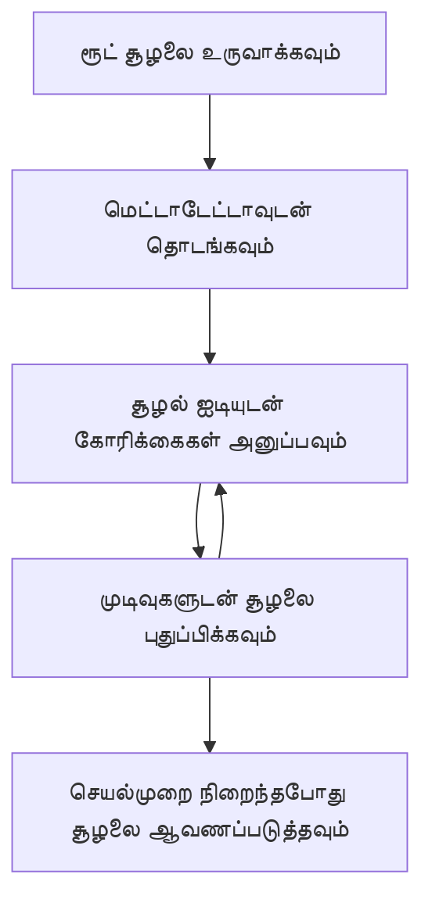

> [பழையது: 2026-07-28 வெளியீடு வேட்பாளர்](https://blog.modelcontextprotocol.io/posts/2026-07-28-release-candidate/#roots-sampling-and-logging-are-deprecated)

# MCP ரூட் கன்டெக்ஸ்ட்கள்

> **பழையது அறிவிப்பு:** `2026-07-28` MCP குறிப்பீட்டு வெளியீடு வேட்பாளர் ரூட்‌களை கருவி பரிமாற்றிகள், வள URIகள் அல்லது சர்வர் கட்டமைப்பிற்கு பதிலாக பழையதாகக் குறிக்கிறது. ரூட்‌கள் `2025-11-25` மற்றும் எந்தவொரு சீர்திருத்தப்பட்ட கால அடுத்த ஒரு வருடத்திற்கு காமோட்டமாக செயல்படுகின்றன, எனவே இந்த பாடத்தில் உள்ள அனைத்தும் செல்லுபடியாகும் - ஆனால் புதிய சர்வர் வடிவமைப்புகள் மாற்று முறைமையை மதிப்பாய்வு செய்ய வேண்டும். பார்க்க [MCP இல் என்ன மாற்றமாவது: 2026-07-28 வெளியீடு வேட்பாளர்](../../01-CoreConcepts/mcp-2026-07-28-release-candidate.md).

ரூட் கன்டெக்ஸ்ட்கள் Model Context Protocol இல் அடிப்படையான கொள்கை ஆகும், இது பல கோரிக்கைகள் மற்றும் அமர்வுகளுக்கு இடையில் உரையாடல் வரலாறு மற்றும் பகிர்ந்து கொள்ளப்பட்ட நிலையை நிலைத்திருக்கும் படியளவாக ஒரு நிலையான அடுக்கை வழங்குகிறது.

## அறிமுகம்

இந்த பாடத்தில், நாம் MCP இல் ரூட் கன்டெக்ஸ்ட்களை உருவாக்குவது, நிர்வகித்தல் மற்றும் பயன்படுத்துவது எப்படி என்பதை ஆராய்வோம்.

## கற்றல் நோக்கங்கள்

இந்தப் பாடத்தின் முடிவில், நீங்கள் முடியும்:

- ரூட் கன்டெக்ஸ்ட்களின் நோக்கம் மற்றும் அமைப்பை புரிந்துகொள்ளவும்
- MCP கிளையண்ட் நூலகங்களைப் பயன்படுத்தி ரூட் கன்டெக்ஸ்ட்களை உருவாக்கவும், நிர்வகிக்கவும்
- .NET, ஜாவா, ஜாவாஸ்கிரிப்ட் மற்றும் பைதான் பயன்பாடுகளில் ரூட் கன்டெக்ஸ்ட்களை செயல்படுத்தவும்
- பல-துருப்புள்ள உரையாடல்களுக்கும் நிலை நிர்வகிப்புக்கும் ரூட் கன்டெக்ஸ்ட்களை பயன்படுத்தவும்
- ரூட் கன்டெக்ச்ட் நிர்வகிப்புக்கான சிறந்த நடைமுறைகளை நடைமுறைப்படுத்தவும்

## ரூட் கன்டெக்ஸ்ட்களைப் புரிந்துகொள்வது

ரூட் கன்டெக்ஸ்ட்கள் தொடர்புடைய தொடர்ச்சியான தொடர்புகளுக்கான வரலாறு மற்றும் நிலையை கையாளும் கொண்டெய்னர்களாக செயல்படுகின்றன. அவை கீழ்வருமாறு உதவுகின்றன:

- **உரையாடல் நிலைத்தன்மை**: தொடர்பிருந்த பல-துரு உரையாடல்களை பராமரித்தல்
- **நினைவக நிர்வாகம்**: தொடர்புகளுக்கு இடையில் தகவலை சேமித்தல் மற்றும் மீட்டெடுத்தல்
- **நிலை நிர்வாகம்**: சிக்கலான பணிச்சுற்றங்களில் முன்னேற்றத்தை கண்காணித்தல்
- **கன்டெக்ஸ்ட் பகிர்வு**: பல கிளையண்ட்கள் ஒரே உரையாடல் நிலைக்கு அணுக தீர்வுகொடுத்தல்

MCP இல், ரூட் கன்டெக்ஸ்ட்களுக்கு உள்ள முக்கிய அம்சங்கள்:

- ஒவ்வொரு ரூட் கன்டெக்ஸ்டுக்கும் தனித்துவமான அடையாளம் உண்டு.
- அவை உரையாடல் வரலாறு, பயனர் விருப்பங்கள் மற்றும் பிற மெட்டாடேட்டாவை கொண்டிருக்க முடியும்.
- அவற்றை தேவையானபோது உருவாக்கவும், அணுகவும், காப்பகப்படுத்தவும் முடியும்.
- அவை நுட்பமான அணுகல் கட்டுப்பாடு மற்றும் அனுமதிகளை ஆதரிக்கின்றன.

## ரூட் கன்டெக்ஸ் வாழ்நாள் சுழல்



## ரூட் கன்டெக்ஸ்ட்களுடன் வேலை செய்யுதல்

ரூட் கன்டெக்ஸ்ட்களை உருவாக்கி, நிர்வகிப்பது எப்படி என்பதை ஒரு உதாரணம் கீழே கொடுக்கப்பட்டுள்ளது.

### C# செயல்படுத்தல்

```csharp
// .NET Example: Root Context Management
using Microsoft.Mcp.Client;
using System;
using System.Threading.Tasks;
using System.Collections.Generic;

public class RootContextExample
{
    private readonly IMcpClient _client;
    private readonly IRootContextManager _contextManager;
    
    public RootContextExample(IMcpClient client, IRootContextManager contextManager)
    {
        _client = client;
        _contextManager = contextManager;
    }
    
    public async Task DemonstrateRootContextAsync()
    {
        // 1. Create a new root context
        var contextResult = await _contextManager.CreateRootContextAsync(new RootContextCreateOptions
        {
            Name = "Customer Support Session",
            Metadata = new Dictionary<string, string>
            {
                ["CustomerName"] = "Acme Corporation",
                ["PriorityLevel"] = "High",
                ["Domain"] = "Cloud Services"
            }
        });
        
        string contextId = contextResult.ContextId;
        Console.WriteLine($"Created root context with ID: {contextId}");
        
        // 2. First interaction using the context
        var response1 = await _client.SendPromptAsync(
            "I'm having issues scaling my web service deployment in the cloud.", 
            new SendPromptOptions { RootContextId = contextId }
        );
        
        Console.WriteLine($"First response: {response1.GeneratedText}");
        
        // Second interaction - the model will have access to the previous conversation
        var response2 = await _client.SendPromptAsync(
            "Yes, we're using containerized deployments with Kubernetes.", 
            new SendPromptOptions { RootContextId = contextId }
        );
        
        Console.WriteLine($"Second response: {response2.GeneratedText}");
        
        // 3. Add metadata to the context based on conversation
        await _contextManager.UpdateContextMetadataAsync(contextId, new Dictionary<string, string>
        {
            ["TechnicalEnvironment"] = "Kubernetes",
            ["IssueType"] = "Scaling"
        });
        
        // 4. Get context information
        var contextInfo = await _contextManager.GetRootContextInfoAsync(contextId);
        
        Console.WriteLine("Context Information:");
        Console.WriteLine($"- Name: {contextInfo.Name}");
        Console.WriteLine($"- Created: {contextInfo.CreatedAt}");
        Console.WriteLine($"- Messages: {contextInfo.MessageCount}");
        
        // 5. When the conversation is complete, archive the context
        await _contextManager.ArchiveRootContextAsync(contextId);
        Console.WriteLine($"Archived context {contextId}");
    }
}
```

மேலே உள்ள கோडில் நாங்கள்:

1. வாடிக்கையாளர் ஆதரவு அமர்வுக்கான ஒரு ரூட் கன்டெக்ஸ்டை உருவாக்கினோம்.
1. அந்த கன்டெக்ஸ்டில் பல செய்திகளை அனுப்பி, மாதிரிக்கு நிலையை பராமரிக்க அனுமதித்தோம்.
1. உரையாடல் அடிப்படையில் தொடர்புடைய மெட்டாடேட்டாவுடன் கன்டெக்ஸ்டை மேம்படுத்தினோம்.
1. உரையாடல் வரலாற்றை புரிந்துகொள்ள கன்டெக்ஸ் தகவலை பெறினோம்.
1. உரையாடல் முடிந்து காப்பகப்படுத்தினோம்.

## உதாரணம்: நிதி பகுப்பாய்விற்கு ரூட் கன்டெக்ஸ் செயல்படுத்தல்

இந்த உதாரணத்தில், பல தொடர்புகளுக்கிடையேயான நிலையை பராமரிப்பது எப்படி என்பதை காட்டி நிதி பகுப்பாய்விற்காக ஒரு ரூட் கன்டெக்ஸ்டை உருவாக்குவோம்.

### ஜாவா செயல்படுத்தல்

```java
// Java எடுத்துக்காட்டு: ரூட் கன்டெக்ஸ்ட் செயலாக்கம்
package com.example.mcp.contexts;

import com.mcp.client.McpClient;
import com.mcp.client.ContextManager;
import com.mcp.models.RootContext;
import com.mcp.models.McpResponse;

import java.util.HashMap;
import java.util.Map;
import java.util.UUID;

public class RootContextsDemo {
    private final McpClient client;
    private final ContextManager contextManager;
    
    public RootContextsDemo(String serverUrl) {
        this.client = new McpClient.Builder()
            .setServerUrl(serverUrl)
            .build();
            
        this.contextManager = new ContextManager(client);
    }
    
    public void demonstrateRootContext() throws Exception {
        // கன்டெக்ஸ்ட் மெட்டாடேட்டாவை உருவாக்கு
        Map<String, String> metadata = new HashMap<>();
        metadata.put("projectName", "Financial Analysis");
        metadata.put("userRole", "Financial Analyst");
        metadata.put("dataSource", "Q1 2025 Financial Reports");
        
        // 1. புதிய ரூட் கன்டெக்ஸ்டை உருவாக்கு
        RootContext context = contextManager.createRootContext("Financial Analysis Session", metadata);
        String contextId = context.getId();
        
        System.out.println("Created context: " + contextId);
        
        // 2. முதல் தொடர்பு
        McpResponse response1 = client.sendPrompt(
            "Analyze the trends in Q1 financial data for our technology division",
            contextId
        );
        
        System.out.println("First response: " + response1.getGeneratedText());
        
        // 3. பதிலிலிருந்து பெறப்பட்ட முக்கிய தகவலுடன் கன்டெக்ஸ்டை புதுப்பி
        contextManager.addContextMetadata(contextId, 
            Map.of("identifiedTrend", "Increasing cloud infrastructure costs"));
        
        // இரண்டாவது தொடர்பு - அதே கன்டெக்ஸ்டை பயன்படுத்தி
        McpResponse response2 = client.sendPrompt(
            "What's driving the increase in cloud infrastructure costs?",
            contextId
        );
        
        System.out.println("Second response: " + response2.getGeneratedText());
        
        // 4. பகுப்பாய்வு அமர்வு சுருக்கத்தை உருவாக்கு
        McpResponse summaryResponse = client.sendPrompt(
            "Summarize our analysis of the technology division financials in 3-5 key points",
            contextId
        );
        
        // சுருக்கத்தை கன்டெக்ஸ்ட் மெட்டாடேட்டாவில் சேமி
        contextManager.addContextMetadata(contextId, 
            Map.of("analysisSummary", summaryResponse.getGeneratedText()));
            
        // புதுப்பிக்கப்பட்ட கன்டெக்ஸ்ட் தகவலைப் பெறு
        RootContext updatedContext = contextManager.getRootContext(contextId);
        
        System.out.println("Context Information:");
        System.out.println("- Created: " + updatedContext.getCreatedAt());
        System.out.println("- Last Updated: " + updatedContext.getLastUpdatedAt());
        System.out.println("- Analysis Summary: " + 
            updatedContext.getMetadata().get("analysisSummary"));
            
        // 5. முடிந்தவுடன் கன்டெக்ஸ்டை ஆவணப்படுத்து
        contextManager.archiveContext(contextId);
        System.out.println("Context archived");
    }
}
```

மேலே உள்ள கோடில் நாங்கள்:

1. நிதி பகுப்பாய்வு அமர்வுக்கான ஒரு ரூட் கன்டெக்ஸ்டை உருவாக்கினோம்.
2. அந்த கன்டெக்ஸ்டில் பல செய்திகளை அனுப்பி, மாதிரிக்கு நிலையை பராமரிக்க அனுமதித்தோம்.
3. உரையாடல் அடிப்படையில் கன்டெக்ஸ்டை தொடர்புடைய மெட்டாடேட்டாவுடன் மேம்படுத்தினோம்.
4. பகுப்பாய்வு அமர்வின் சுருக்கத்தை உருவாக்கி கன்டெக்ஸ் மெட்டாடேட்டாவில் சேமித்தோம்.
5. உரையாடல் முடிந்து கன்டெக்ஸ்டை காப்பகப்படுத்தினோம்.

## உதாரணம்: ரூட் கன்டெக்ஸ் நிர்வாகம்

உரையாடல் வரலாறும் நிலையும் பராமரிப்பதற்கு ரூட் கன்டெக்ஸ்ட்களை பயனுள்ளதாக நிர்வகிப்பது முக்கியமாகும். கீழே ரூட் கன்டெக்ஸ் நிர்வாகம் எப்படி செயல்படுத்துவது பற்றி உதாரணம் கொடுக்கப்பட்டுள்ளது.

### ஜாவா ஸ்கிரிப்ட் செயல்படுத்தல்

```javascript
// JavaScript உதாரணம்: MCP ரூட் சூழல்களை மேலாண்மைசெய்தல்
const { McpClient, RootContextManager } = require('@mcp/client');

class ContextSession {
  constructor(serverUrl, apiKey = null) {
    // MCP கிளையண்டை துவக்கம் செய்
    this.client = new McpClient({
      serverUrl,
      apiKey
    });
    
    // சூழல் மேலாளரை துவக்கம் செய்
    this.contextManager = new RootContextManager(this.client);
  }
  
  /**
   * Create a new conversation context
   * @param {string} sessionName - Name of the conversation session
   * @param {Object} metadata - Additional metadata for the context
   * @returns {Promise<string>} - Context ID
   */
  async createConversationContext(sessionName, metadata = {}) {
    try {
      const contextResult = await this.contextManager.createRootContext({
        name: sessionName,
        metadata: {
          ...metadata,
          createdAt: new Date().toISOString(),
          status: 'active'
        }
      });
      
      console.log(`Created root context '${sessionName}' with ID: ${contextResult.id}`);
      return contextResult.id;
    } catch (error) {
      console.error('Error creating root context:', error);
      throw error;
    }
  }
  
  /**
   * Send a message in an existing context
   * @param {string} contextId - The root context ID
   * @param {string} message - The user's message
   * @param {Object} options - Additional options
   * @returns {Promise<Object>} - Response data
   */
  async sendMessage(contextId, message, options = {}) {
    try {
      // குறிப்பிட்ட சூழலை பயன்படுத்தி செய்தியை அனுப்பு
      const response = await this.client.sendPrompt(message, {
        rootContextId: contextId,
        temperature: options.temperature || 0.7,
        allowedTools: options.allowedTools || []
      });
      
      // விருப்பமாக உரையாடலின் முக்கிய நடரங்களைச் சேமி
      if (options.storeInsights) {
        await this.storeConversationInsights(contextId, message, response.generatedText);
      }
      
      return {
        message: response.generatedText,
        toolCalls: response.toolCalls || [],
        contextId
      };
    } catch (error) {
      console.error(`Error sending message in context ${contextId}:`, error);
      throw error;
    }
  }
  
  /**
   * Store important insights from a conversation
   * @param {string} contextId - The root context ID
   * @param {string} userMessage - User's message
   * @param {string} aiResponse - AI's response
   */
  async storeConversationInsights(contextId, userMessage, aiResponse) {
    try {
      // சாத்தியமான நடரங்களை எடு (ஒரு உண்மையான செயலியில் இது அதிகச் சிக்கலாக இருக்கும்)
      const combinedText = userMessage + "\n" + aiResponse;
      
      // சாத்தியமான நடரங்களை அடையாளம் காணும் எளிய ஹியூரிஸ்டிக்
      const insightWords = ["important", "key point", "remember", "significant", "crucial"];
      
      const potentialInsights = combinedText
        .split(".")
        .filter(sentence => 
          insightWords.some(word => sentence.toLowerCase().includes(word))
        )
        .map(sentence => sentence.trim())
        .filter(sentence => sentence.length > 10);
      
      // நடரங்களை சூழல் மெட்டாடேட்டாவில் சேமி
      if (potentialInsights.length > 0) {
        const insights = {};
        potentialInsights.forEach((insight, index) => {
          insights[`insight_${Date.now()}_${index}`] = insight;
        });
        
        await this.contextManager.updateContextMetadata(contextId, insights);
        console.log(`Stored ${potentialInsights.length} insights in context ${contextId}`);
      }
    } catch (error) {
      console.warn('Error storing conversation insights:', error);
      // அவசியமற்ற பிழை, ஆகவே எச்சரிக்கை பதிவேடு செய்யவும்
    }
  }
  
  /**
   * Get summary information about a context
   * @param {string} contextId - The root context ID
   * @returns {Promise<Object>} - Context information
   */
  async getContextInfo(contextId) {
    try {
      const contextInfo = await this.contextManager.getContextInfo(contextId);
      
      return {
        id: contextInfo.id,
        name: contextInfo.name,
        created: new Date(contextInfo.createdAt).toLocaleString(),
        lastUpdated: new Date(contextInfo.lastUpdatedAt).toLocaleString(),
        messageCount: contextInfo.messageCount,
        metadata: contextInfo.metadata,
        status: contextInfo.status
      };
    } catch (error) {
      console.error(`Error getting context info for ${contextId}:`, error);
      throw error;
    }
  }
  
  /**
   * Generate a summary of the conversation in a context
   * @param {string} contextId - The root context ID
   * @returns {Promise<string>} - Generated summary
   */
  async generateContextSummary(contextId) {
    try {
      // இதுவரை உரையாடலின் சுருக்கத்தை உருவாக்க மாதிரியை கேள்
      const response = await this.client.sendPrompt(
        "Please summarize our conversation so far in 3-4 sentences, highlighting the main points discussed.",
        { rootContextId: contextId, temperature: 0.3 }
      );
      
      // சுருக்கத்தை சூழல் மெட்டாடேட்டாவில் சேமி
      await this.contextManager.updateContextMetadata(contextId, {
        conversationSummary: response.generatedText,
        summarizedAt: new Date().toISOString()
      });
      
      return response.generatedText;
    } catch (error) {
      console.error(`Error generating context summary for ${contextId}:`, error);
      throw error;
    }
  }
  
  /**
   * Archive a context when it's no longer needed
   * @param {string} contextId - The root context ID
   * @returns {Promise<Object>} - Result of the archive operation
   */
  async archiveContext(contextId) {
    try {
      // உறைசிக்கும் நேரத்தில் இறுதி சுருக்கத்தை உருவாக்கு
      const summary = await this.generateContextSummary(contextId);
      
      // சூழலை உறைசு
      await this.contextManager.archiveContext(contextId);
      
      return {
        status: "archived",
        contextId,
        summary
      };
    } catch (error) {
      console.error(`Error archiving context ${contextId}:`, error);
      throw error;
    }
  }
}

// உதாரண பயன்பாடு
async function demonstrateContextSession() {
  const session = new ContextSession('https://mcp-server-example.com');
  
  try {
    // 1. ஒரு உற்பத்தி ஆதரவு உரையாடலுக்கான புதிய சூழலை உருவாக்கு
    const contextId = await session.createConversationContext(
      'Product Support - Database Performance',
      {
        customer: 'Globex Corporation',
        product: 'Enterprise Database',
        severity: 'Medium',
        supportAgent: 'AI Assistant'
      }
    );
    
    // 2. உரையாடலின் முதல் செய்தி
    const response1 = await session.sendMessage(
      contextId,
      "I'm experiencing slow query performance on our database cluster after the latest update.",
      { storeInsights: true }
    );
    console.log('Response 1:', response1.message);
    
    // அதே சூழலில் தொடர்ச்சிகுழு செய்தி
    const response2 = await session.sendMessage(
      contextId,
      "Yes, we've already checked the indexes and they seem to be properly configured.",
      { storeInsights: true }
    );
    console.log('Response 2:', response2.message);
    
    // 3. சூழல் பற்றி தகவல் பெறு
    const contextInfo = await session.getContextInfo(contextId);
    console.log('Context Information:', contextInfo);
    
    // 4. உரையாடல் சுருக்கத்தை உருவாக்கி காட்டு
    const summary = await session.generateContextSummary(contextId);
    console.log('Conversation Summary:', summary);
    
    // 5. முடிந்தவுடன் சூழலை உறைசு
    const archiveResult = await session.archiveContext(contextId);
    console.log('Archive Result:', archiveResult);
    
    // 6. எந்த பிழைகளையும் மென்மையாக கையாள்
  } catch (error) {
    console.error('Error in context session demonstration:', error);
  }
}

demonstrateContextSession();
```

மேலே உள்ள கோடில் நாங்கள்:

1. `createConversationContext` செயல்பாட்டை பயன்படுத்தி ஒரு தயாரிப்பு ஆதரவு உரையாடலுக்கான ரூட் கன்டெக்ஸ்டை உருவாக்கினோம். இந்தக் கன்டெக்ஸ்ட் தரவுத்தள செயல்திறன் பிரச்சனைகள் பற்றியது.

1. `sendMessage` செயல்பாட்டைப் பயன்படுத்தி அதே கன்டெக்ஸ்டில் பல செய்திகள் அனுப்பி, மாதிரிக்கு நிலையை பராமரிக்க அனுமதித்தோம். அனுப்பப்படும் செய்திகள் மெதுவான கூரிய கோரிக்கைகள் மற்றும் குறியீட்டு அமைப்புக்குரியவை.

1. உரையாடல் அடிப்படையில் கன்டெக்ஸ்டை தொடர்புடைய மெட்டாடேட்டாவுடன் மேம்படுத்தினோம்.

1. உரையாடலின் சுருக்கத்தை உருவாக்கி `generateContextSummary` செயல்பாட்டால் கன்டெக்ஸ் மெட்டாடேட்டாவில் சேமித்தோம்.

1. உரையாடல் முடிந்து `archiveContext` மூலம் கன்டெக்ஸ்டை காப்பகப்படுத்தினோம்.

1. பிழைகளை அறிந்து சரியாக கையாள்ந்து உறுதிப்படுத்தினோம்.

## பல-துரு உதவிக்கு ரூட் கன்டெக்ஸ்

இந்த உதாரணத்தில், பல-துரு உதவி அமர்வுக்கு ஒரு ரூட் கன்டெக்ஸ்டை உருவாக்கி பல தொடர்புகளுக்கிடையில் நிலையை பராமரிப்பது எப்படி என்பதை காண்போம்.

### பைதான் செயல்படுத்தல்

```python
# பைதான் எடுத்துக்காட்டு: பல திருப்புகளுக்கான ருட் சூழல் உதவி
import asyncio
from datetime import datetime
from mcp_client import McpClient, RootContextManager

class AssistantSession:
    def __init__(self, server_url, api_key=None):
        self.client = McpClient(server_url=server_url, api_key=api_key)
        self.context_manager = RootContextManager(self.client)
    
    async def create_session(self, name, user_info=None):
        """Create a new root context for an assistant session"""
        metadata = {
            "session_type": "assistant",
            "created_at": datetime.now().isoformat(),
        }
        
        # வழங்கப்பட்டால் பயனர் தகவல்களைச் சேர்க்கவும்
        if user_info:
            metadata.update({f"user_{k}": v for k, v in user_info.items()})
            
        # ருட் சூழலை உருவாக்கவும்
        context = await self.context_manager.create_root_context(name, metadata)
        return context.id
    
    async def send_message(self, context_id, message, tools=None):
        """Send a message within a root context"""
        # சூழல் ஐடியுடன் விருப்பங்களை உருவாக்கவும்
        options = {
            "root_context_id": context_id
        }
        
        # குறிப்பிடப்பட்டிருந்தால் கருவிகளைச் சேர்க்கவும்
        if tools:
            options["allowed_tools"] = tools
        
        # சூழல் பகுதியில் வார்த்தைப் பைலை அனுப்பவும்
        response = await self.client.send_prompt(message, options)
        
        # உரையாடல் முன்னேற்றத்துடன் சூழல் மெட்டா தரவுகளை புதுப்பிக்கவும்
        await self.context_manager.update_context_metadata(
            context_id,
            {
                f"message_{datetime.now().timestamp()}": message[:50] + "...",
                "last_interaction": datetime.now().isoformat()
            }
        )
        
        return response
    
    async def get_conversation_history(self, context_id):
        """Retrieve conversation history from a context"""
        context_info = await self.context_manager.get_context_info(context_id)
        messages = await self.client.get_context_messages(context_id)
        
        return {
            "context_info": context_info,
            "messages": messages
        }
    
    async def end_session(self, context_id):
        """End an assistant session by archiving the context"""
        # முதலில் ஒரு சுருக்க வார்த்தை உருவாக்கவும்
        summary_response = await self.client.send_prompt(
            "Please summarize our conversation and any key points or decisions made.",
            {"root_context_id": context_id}
        )
        
        # மெட்டா தரவில் சுருக்கத்தைச் சேமிக்கவும்
        await self.context_manager.update_context_metadata(
            context_id,
            {
                "summary": summary_response.generated_text,
                "ended_at": datetime.now().isoformat(),
                "status": "completed"
            }
        )
        
        # சூழல் ஆவணப்படுத்தவும்
        await self.context_manager.archive_context(context_id)
        
        return {
            "status": "completed",
            "summary": summary_response.generated_text
        }

# எடுத்துக்காட்டு பயன்பாடு
async def demo_assistant_session():
    assistant = AssistantSession("https://mcp-server-example.com")
    
    # 1. அமர்வை உருவாக்கவும்
    context_id = await assistant.create_session(
        "Technical Support Session",
        {"name": "Alex", "technical_level": "advanced", "product": "Cloud Services"}
    )
    print(f"Created session with context ID: {context_id}")
    
    # 2. முதல் இடையீடு
    response1 = await assistant.send_message(
        context_id, 
        "I'm having trouble with the auto-scaling feature in your cloud platform.",
        ["documentation_search", "diagnostic_tool"]
    )
    print(f"Response 1: {response1.generated_text}")
    
    # அதே சூழலில் இரண்டாம் இடையீடு
    response2 = await assistant.send_message(
        context_id,
        "Yes, I've already checked the configuration settings you mentioned, but it's still not working."
    )
    print(f"Response 2: {response2.generated_text}")
    
    # 3. வரலாற்றைப் பெறவும்
    history = await assistant.get_conversation_history(context_id)
    print(f"Session has {len(history['messages'])} messages")
    
    # 4. அமர்வை முடிக்கவும்
    end_result = await assistant.end_session(context_id)
    print(f"Session ended with summary: {end_result['summary']}")

if __name__ == "__main__":
    asyncio.run(demo_assistant_session())
```

மேலே உள்ள கோடில் நாங்கள்:

1. `create_session` செயல்பாட்டுடன் தொழில்நுட்ப ஆதரவு அமர்வுக்கான ஒரு ரூட் கன்டெக்ஸ்டை உருவாக்கினோம். கன்டெக்ஸ்டில் பயனர் பெயர் மற்றும் தொழில்நுட்ப நிலை போன்ற தகவல்கள் உள்ளன.

1. `send_message` செயல்பாட்டைப் பயன்படுத்தி அதே கன்டெக்ஸ்டில் பல செய்திகள் அனுப்பி மாதிரிக்கு நிலையை பராமரிக்க அனுமதித்தோம். அனுப்பப்படும் செய்திகள் தானாக அளவீடு செய்யும் அம்சத்தில் பிரச்சனைகள் பற்றியது.

1. `get_conversation_history` செயல்பாட்டைப் பயன்படுத்தி உரையாடல் வரலாறு மற்றும் தகவல்களை பெற்றோம்.

1. அமர்வை முடித்து, `end_session` செயல்பாட்டால் கன்டெக்ஸ்டை காப்பகப்படுத்தி, உரையாடல் முக்கிய புள்ளிகளை உள்ளடக்கிய சுருக்கத்தையும் உருவாக்கினோம்.

## ரூட் கன்டெக்ஸ் சிறந்த நடைமுறைகள்

ரூட் கன்டெக்ஸ்ட்களை சிறப்பாக நிர்வகிக்க சில சிறந்த நடைமுறைகள்:

- **கவனமாக கூர்ந்த கன்டெக்ஸ்ட்களை உருவாக்கவும்**: தெளிவாக இருக்க உரையாடல் நோக்கங்களுக்கோ அல்லது பிரதேசங்களுக்கு தனித்தனியாக ரூட் கன்டெக்ஸ்ட்களை உருவாக்கவும்.

- **காலாவதி கொள்கைகளை அமைக்கவும்**: சேமிப்பை நிர்வகிக்க மற்றும் தரவு பாதுகாப்பு கொள்கைகளுக்கு ஏற்ப பழைய கன்டெக்ஸ்ட்களை காப்பகப்படுத்த அல்லது நீக்க கொள்கைகளை செயல்படுத்தவும்.

- **ബന്ധப்பட்ட மெட்டாடேட்டாவை சேமிக்கவும்**: நிகழ்தகுரிய தகவல்களை சேமிக்க கன்டெக்ஸ் மெட்டாடேட்டாவைப் பயன்படுத்தவும்.

- **கன்டெக்ஸ் IDs ஐ தொடர்ந்து பயன்படுத்தவும்**: கன்டெக்ஸ்ட் உருவாக்கப்பட்டதும் அதனுடைய ID ஐ அனைத்து தொடர்புடைய கோரிக்கைகளுக்குமே தொடர்ச்சியாகப் பயன்படுத்தவும்.

- **சுருக்கங்களை உருவாக்கவும்**: கன்டெக்ஸ் மிகப்பெரியதாக வளர்ந்தால் முக்கியமான தகவல்களைப் பிடிக்க சுருக்கங்களை உருவாக்க பரிசீலிக்கவும்.

- **அணுகல் கட்டுப்பாட்டை செயல்படுத்தவும்**: பல பயனருக்கான அமைப்புகளுக்கு உரையாடல் கன்டெக்ஸ்ட்களின் தனியுரிமையையும் பாதுகாப்பையும் உறுதி செய்வதற்கான உரிய அணுகல் கட்டுப்பாடுகளை செயல்படுத்தவும்.

- **கன்டெக்ஸ் வரம்புக்களை கையாளவும்**: கன்டெக்ஸ் அளவு வரம்புகளைக் கவனித்து மிக நீண்டு செல்லும் உரையாடல்களுக்கு கையாளும் முறைகளை செயல்படுத்தவும்.

- **முடிந்தவுடன் காப்பகப்படுத்தவும்**: உரையாடல் முடிந்தவுடன் கன்டெக்ஸ்ட்களை காப்பகப்படுத்தி வளங்களை விடுவித்து உரையாடல் வரலாற்றை பாதுகாப்பதாக வைக்கவும்.

## அடுத்தது என்ன

- [5.5 வழிமாற்றல்](../mcp-routing/README.md)

---

<!-- CO-OP TRANSLATOR DISCLAIMER START -->
**மறுப்பு**:
இந்த ஆவணம் AI மொழிபெயர்ப்பு சேவை [Co-op Translator](https://github.com/Azure/co-op-translator) பயன்படுத்தி மொழிபெயர்க்கப்பட்டுள்ளது. நாங்கள் துல்லியத்திற்காக முயற்சி செய்துள்ளோம், ஆனால் தானாக செய்யப்படும் மொழிபெயர்ப்புகளில் பிழைகள் அல்லது தவறுகள் இருக்கலாம் என்பதை கவனத்தில் கொள்ளவும். அசல் ஆவணம் அதன் தாய்மொழியில் அதிகாரப்பூர்வ ஆதாரமாக கருதப்பட வேண்டும். முக்கியமான தகவல்களுக்கு, தொழில்நுட்பமான மனித மொழிபெயர்ப்பு பரிந்துரைக்கப்படுகிறது. இந்த மொழிபெயர்ப்பைப் பயன்படுத்துவதால் ஏற்படும் எந்த தவறான புரிதல்கள் அல்லது தவறான விளக்கத்திற்கும் நாங்கள் பொறுப்பில்வில்லை.
<!-- CO-OP TRANSLATOR DISCLAIMER END -->