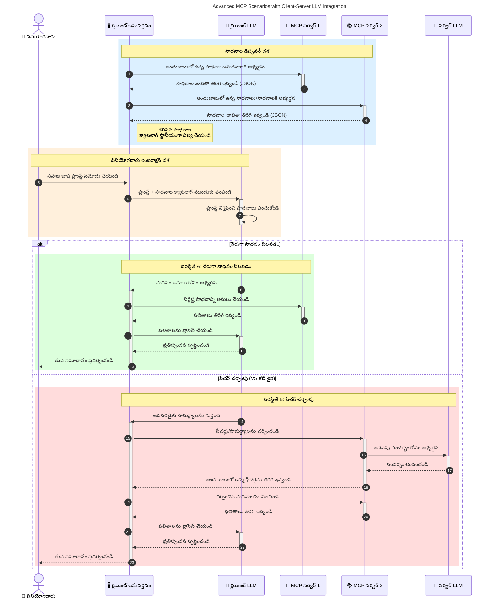

# మోడల్ కాంటెక్స్ ప్రోటోకాల్ (MCP) కి పరిచయం: స్కేలబుల్ AI అప్లికేషనులకు ఇది ఎందుకు ముఖ్యం

[](https://youtu.be/agBbdiOPLQA)

_(ఈ పాఠం వీడియో చూడటం కోసం పై చిత్రం‌పై క్లిక్ చేయండి)_

జనరేటివ్ AI అప్లికేషన్లు అనేవి గొప్ప ముందడుగు, ఎందుకంటే అవి సాధారణ భాషా సూచనలతో యూజర్‌ను యాప్‌తో అంతర్రియర్ చేయడానికి సహాయపడతాయి. అయితే, ఇలాంటి అప్లికేషన్లలో ఎక్కువ సమయం మరియు వనరులను పెట్టుబడి పెట్టినప్పుడు, మీరు ఇది సులభంగా విస్తరించగల విధంగా ఫంక్షనాలిటీస్ మరియు వనరులను సమన్వయాపరచగలగాలి, మీ యాప్ ఒక కన్నా ఎక్కువ మోడల్స్ ఉపయోగించే కేసుల కోసం తగినట్లు ఉండాలి మరియు వివిధ మోడల్ సంక్లిష్టతలను నిర్వహించగలగాలి. సంక్షిప్తంగా చెప్పాలంటే, జనరేటివ్ AI అప్లికేషన్లు ప్రారంభంలో సులభంగా ఉండవచ్చు, కానీ అవి పెరిగి క్లిష్టత పెరిగినప్పుడు, మీరు ఒక ఆర్కిటెక్చర్ నిర్వచించాలి మరియు మీ యాప్స్ సुसంఘటితంగా నిర్మించబడేలా ఒక ప్రమాణం మీద ఆధారపడాల్సి ఉంటుంది. ఇదే MCP సందర్భంలో వస్తుంది, వ్యవస్థీకరిస్తుంది మరియు ఒక ప్రమాణం అందిస్తుంది.

---

## **🔍 మోడల్ కాంటెక్స్ ప్రోటోకాల్ (MCP) అంటే ఏమిటి?**

**మోడల్ కాంటెక్స్ ప్రోటోకాల్ (MCP)** అనేది ఒక **ఓపెన్, ప్రమాణీకృత ఇంటర్‌ఫేస్** ఇది పెద్ద భాషా మోడల్స్ (LLMs) కి బాహ్య టూల్స్, APIలు మరియు డేటా వనరులతో సజావుగా ఇన్టరాక్ట్ కావడానికి ప్రవేశాన్ని అందిస్తుంది. ఇది AI మోడల్ ఫంక్షనాలిటిని వారి ట్రైనింగ్ డేటా దాటి మరింత బోధనీయమైన, స్కేలబుల్, మరియు స్పందనాత్మక AI వ్యవస్థలకు అభివృద్ధి చేయడానికి నిరంతర ఆర్కిటెక్చర్ అందిస్తుంది.

---

## **🎯 AIలో ప్రమాణీకరణ ఎందుకు ముఖ్యం**

జనరేటివ్ AI అప్లికేషన్లు క్లిష్టత పెరుగుతుంటే, **స్కేలబిలిటీ, విస్తరణ సామర్థ్యం, నిర్వహణ సౌలభ్యం**, మరియు **వెండార్ లాక్-ఇన్ ను నివారించడం** వంటి అవసరాలను కలిగి ఉండే ప్రమాణాలను ఏకరీతిగా అవలంబించడం అవసరం. MCP ఈ అవసరాలను ఈ విధంగా పరిష్కరిస్తుంది:

- మోడల్-టూల్ ఇంటిగ్రేషన్లను ఐక్యవధానం చేస్తుంది
- దుర్బలమైన, ప్రత్యేక సొంత పరిష్కారాలను తగ్గిస్తుంది
- విభిన్న వెండర్లు నుండి వచ్చే అనేక మోడల్స్ ఒకే సిస్టంలో ఉండగలుగుతాయి

**గమనిక:** MCP తన క్వాలిటీలో ఓపెన్ ప్రమాణంగా ఉండగా, IEEE, IETF, W3C, ISO లేదా ఇతర ఎలాంటి ఉన్న ప్రమాణాల సంస్థల ద్వారా MCPని ప్రమాణీకరించాలని ప్రణాళిక లేదు.

---

## **📚 నేర్చుకునే లక్ష్యాలు**

ఈ వ్యాసం చివరికి, మీరు చేయగలరు:

- **మోడల్ కాంటెక్స్ ప్రోటోకాల్ (MCP)** మరియు దాని ఉపయోగాల నిర్వచనం
- MCP ఎలా మోడల్-టూల్ కమ్యూనికేషన్ ప్రమాణీకరిస్తుందో అర్థం చేసుకోవడం
- MCP ఆర్కిటెక్చర్లో ప్రాథమిక భాగాలు గుర్తించడం
- MCP యొక్క నిజ భూమిక ప్రచారాలు ఎంటర్‌ప్రైజ్ మరియు డెవలప్‌మెంట్ సందర్భాలలో అన్వేషణ

---

## **💡 మోడల్ కాంటెక్స్ ప్రోటోకాల్ (MCP) ఎందుకు గొప్ప మార్పు**

### **🔗 MCP AI అంతర్రియాలలో విభజనను పరిష్కరిస్తుంది**

MCPకి ముందు, మోడల్స్ మరియు టూల్స్ ఏకీకృతం చేయడానికి అవసరమయ్యేది:

- ప్రతి టూల్-మోడల్ జంటకు ప్రత్యేక కోడ్
- ప్రతి వెండర్ కోసం ప్రామాణికేతర APIలు
- అప్డేట్ల వలన తరచూ విరామాలు
- ఎక్కువ టూల్స్ తో తక్కువ స్కేలుబిలిటీ

### **✅ MCP ప్రమాణీకరణ లాభాలు**

| **లాభం**               | **వివరణ**                                                                   |
|------------------------|-----------------------------------------------------------------------------|
| పరస్పర కార్యాచరణ        | LLMలు విభిన్న వెండర్ల టూల్స్‌తో సజావుగా పని చేస్తాయి                        |
| సారూప్యత                 | వేదికలు మరియు టూల్స్ అంతటా ఏకకాల వ్యవహారం                                 |
| పునర్వినియోగం            | ఒకసారి నిర్మించిన టూల్స్ ప్రాజెక్టులు, సిస్టమ్స్ లో ఉపయోగించవచ్చు           |
| వేగవంతమైన అభివృద్ధి       | ప్రమాణీకృత, ప్లగ్-అండ్-ప్లే ఇంటర్‌ఫేస్‌లను ఉపయోగించి అభివృద్ధి సమయాన్ని తగ్గించు|

---

## **🧱 MCP ఆర్కిటెక్చర్ అవలోకనం**

MCP ఒక **క్లయింట్-సర్వర్ మోడల్** ని అనుసరిస్తుంది, ఇందులో:

- **MCP హోస్ట్‌లు** AI మోడల్స్‌ను నడిపిస్తాయి
- **MCP క్లయింట్లు** అభ్యర్థనలని ప్రారంభిస్తాయి
- **MCP సర్వర్లు** కాంటెక్స్ట్, టూల్స్, సామర్థ్యాలను అందిస్తాయి

### **ప్రధాన భాగాలు:**

- **వనరులు** – మోడల్స్ కోసం స్థిర లేదా గతిశీల డేటా  
- **ప్రాంప్ట్స్** – గైడెడ్ జనరేషన్ కోసం ముందస్తు నిర్వచించిన వర్క్‌ఫ్లోలు  
- **టూల్స్** – వెతుకుబడి, లెక్కలు వంటి అమలు కాని ఫంక్షన్లు  
- **సాంప్లింగ్** – పునరావృత చర్యల ద్వారా ఏజెంటిక్ ప్రవర్తన (2026-07-28 విడుదల అభ్యర్థిలో డిప్రికేటెడ్)  
- **ఎలిసిటేషన్** – యూజర్ ఇన్‌పుట్ కోసం సర్వర్-ప్రారంభిత అభ్యర్థనలు
- **రూట్స్** – సర్వర్ యాక్సెస్ నియంత్రణ కోసం ఫైలుసిస్టమ్ సరిహద్దులు (2026-07-28 విడుదల అభ్యర్థిలో డిప్రికేటెడ్)

### **ప్రోటోకాల్ ఆర్కిటెక్చర్:**

MCP రెండు-స్థాయి ఆర్కిటెక్చర్ ఉపయోగిస్తుంది:
- **డేటా లేయర్**: JSON-RPC 2.0 ఆధారిత కమ్యూనికేషన్, లైఫ్‌సైకిల్ నిర్వహణ మరియు ప్రిమిటివ్స్‌తో
- **ట్రాన్స్‌పోర్ట్ లేయర్**: STDIO (లోకల్) మరియు Streamable HTTP తో SSE (రిమోట్) కమ్యూనికేషన్ చానల్స్

---

## MCP సర్వర్లు ఎలా పనిచేస్తాయి

MCP సర్వర్లు క్రింది విధంగా పనిచేస్తాయి:

- **అభ్యర్థన ప్రవాహం**:
    1. ఒక అభ్యర్థన ఒక ఎండ్ యూజర్ లేదా వారి తరఫున కృషి చేస్తున్న సాఫ్ట్‌వేర్ ద్వారా ప్రారంభించబడుతుంది.
    2. **MCP క్లయింట్** ఆ అభ్యర్థనను **MCP హోస్ట్** కి పంపుతుంది, ఇది AI మోడల్ రన్‌టైమ్‌ను నిర్వహిస్తుంది.
    3. **AI మోడల్** యూజర్ ప్రాంప్ట్‌ను అందుకుని, ఒకటి లేదా ఎక్కువ టూల్ పిలుపుల ద్వారా బాహ్య టూల్స్ లేదా డేటా యాక్సెస్ కోసం అభ్యర్థించవచ్చు.
    4. మోడల్ నేరుగా కాకుండా, **MCP హోస్ట్** ప్రమాణీకృత ప్రోటోకాల్ ఉపయోగించి సరిగ్గా ఉన్న **MCP సర్వర్(లు)** తో కమ్యూనికేట్ చేస్తుంది.
- **MCP హోస్ట్ ఫంక్షనాలిటీ**:
    - **టూల్ రిజిస్ట్రి**: అందుబాటులో ఉన్న టూల్స్ మరియు వాటి సామర్థ్యాల క్యాటలాగ్ నిర్వహణ.
    - **ప్రామాణీకరణ**: టూల్ యాక్సెస్ కోసం అనుమతులను ధృవీకరించడం.
    - **అభ్యర్థన హ్యాండ్లర్**: మోడల్ నుండి వచ్చే టూల్ అభ్యర్థనలను ప్రాసెస్ చేయడం.
    - **ప్రతిస్పందన ఫార్మాటర్**: మోడల్ అర్థం చేసుకునే ఫార్మాట్‌లో టూల్ ఉత్పత్తులను నిర్మించడం.
- **MCP సర్వర్ అమలు**:
    - **MCP హోస్ట్** ఒకటి లేదా ఎక్కువ **MCP సర్వర్లు** కి టూల్ కాల్స్ ను రూట్ చేస్తుంది, ప్రతి సర్వర్ ప్రత్యేక ఫంక్షన్లు (ఉదా: వెతుకడం, లెక్కలు, డేటాబేస్ ప్రశ్నలు) అందిస్తుంది.
    - **MCP సర్వర్లు** తమ సంబంధిత కార్యకలాపాలను నిర్వహించి ఫలితాలను సరి అయిన ఫార్మాట్‌లో **MCP హోస్ట్** కు ఇస్తాయి.
    - **MCP హోస్ట్** ఆ ఫలితాలను ఫార్మాట్ చేసి **AI మోడల్** కు రిప్లే చేస్తుంది.
- **ప్రతిస్పందన పూర్తి**:
    - **AI మోడల్** టూల్ ఉత్పత్తులను తుది ప్రతిస్పందనలో చేర్చుతుంది.
    - **MCP హోస్ట్** ఆ ప్రతిస్పందనను **MCP క్లయింట్** కు పంపుతుంది, అది ఎండ్ యూజర్ లేదా కాలింగ్ సాఫ్ట్‌వేర్‌కి ఇవ్వబడుతుంది.
    

```mermaid
---
title: MCP Architecture and Component Interactions
description: A diagram showing the flows of the components in MCP.
---
graph TD
    Client[MCP క్లయింట్/అప్లికేషన్] -->|అభ్యర్థనను పంపు| H[MCP హోస్ట్]
    H -->|పిలుస్తుంది| A[AI మోడల్]
    A -->|సాధనం కాల్ అభ్యర్థన| H
    H -->|MCP Protocol| T1[MCP Server Tool 01: వెబ్ శోధన
    H -->|MCP Protocol| T2[MCP Server Tool 02: క్యాలిక్యులేటర్ సాధనం
    H -->|MCP Protocol| T3[MCP Server Tool 03: డేటాబేస్ యాక్సెస్ సాధనం
    H -->|MCP Protocol| T4[MCP Server Tool 04: ఫైల్ సిస్టం సాధనం
    H -->|స్పందనను పంపు| Client

    subgraph "MCP హోస్ట్ భాగాలు"
        H
        G[సాధనం రిజిస్ట్రీ]
        I[ధృవీకరణ]
        J[అభ్యర్థన హ్యాండ్లర్]
        K[స్పందన ఫార్మాటర్]
    end

    H <--> G
    H <--> I
    H <--> J
    H <--> K

    style A fill:#f9d5e5,stroke:#333,stroke-width:2px
    style H fill:#eeeeee,stroke:#333,stroke-width:2px
    style Client fill:#d5e8f9,stroke:#333,stroke-width:2px
    style G fill:#fffbe6,stroke:#333,stroke-width:1px
    style I fill:#fffbe6,stroke:#333,stroke-width:1px
    style J fill:#fffbe6,stroke:#333,stroke-width:1px
    style K fill:#fffbe6,stroke:#333,stroke-width:1px
    style T1 fill:#c2f0c2,stroke:#333,stroke-width:1px
    style T2 fill:#c2f0c2,stroke:#333,stroke-width:1px
    style T3 fill:#c2f0c2,stroke:#333,stroke-width:1px
    style T4 fill:#c2f0c2,stroke:#333,stroke-width:1px
```

## 👨‍💻 MCP సర్వర్‌ను ఎలా నిర్మించాలి (ఉదాహరణలతో)

MCP సర్వర్లు LLM సామర్థ్యాలను డేటా మరియు కార్యాచరణ ద్వారా విస్తరించడానికి అనుమతిస్తాయి.

ప్రయత్నించడానికి సిద్ధంగా ఉన్నారా? వివిధ భాషలు/స్టాక్స్‌లో సింపుల్ MCP సర్వర్లు సృష్టించేందుకు భాషా మరియు/లేదా స్టాక్-విశేష SDKలు మరియు ఉదాహరణలు క్రింద ఇచ్చబడ్డాయి:

- **Python SDK**: https://github.com/modelcontextprotocol/python-sdk

- **TypeScript SDK**: https://github.com/modelcontextprotocol/typescript-sdk

- **Java SDK**: https://github.com/modelcontextprotocol/java-sdk

- **C#/.NET SDK**: https://github.com/modelcontextprotocol/csharp-sdk


## 🌍 MCP కోసం వాస్తవ ప్రపంచ వినియోగాలు

MCP AI సామర్థ్యాలను విస్తరించడం ద్వారా అనేక అప్లికేషన్లకు అనుమతిస్తుంది:

| **అప్లికేషన్**                  | **వివరణ**                                                                    |
|------------------------------|------------------------------------------------------------------------------|
| ఎంటర్‌ప్రైజ్ డేటా ఇంటిగ్రేషన్  | LLMలను డేటాబేసులు, CRMలు లేదా అంతర్గత టూల్స్ కు ఆపసోపాలు చేయడం            |
| ఏజెంటిక్ AI వ్యవస్థలు           | టూల్ యాక్సెస్ మరియు నిర్ణయం-తయారీ వర్క్‌ఫ్లోలతో స్వయంపాలిత ఏజెంట్లను సక్రియం చేయడం     |
| మల్టీ-మోడ్ అప్లికేషన్లు         | ఒకే ఐక్య AI యాప్‌లో టెక్స్ట్, చిత్రం, ఆడియో టూల్స్ కంపైనింగ్ చేయడం           |
| రియల్ టైమ్ డేటా ఇంటిగ్రేషన్   | AI అంతర్రియాలకు ప్రత్యక్ష డేటా తీసుకుని మరింత ఖచ్చితమైన, ప్రస్తుత అవుట్పుట్‌లు అందించడం          |


### 🧠 MCP = AI అంతర్రియలకు యూనివర్సల్ ప్రమాణం

మోడల్ కాంటెక్స్ ప్రోటోకాల్ (MCP) USB-C ఎలా పరికరాల కోసం భౌతిక కనెక్షన్లను ప్రమాణీకరించింది అనే విధంగా AI అంతర్రియలకు యూనివర్సల్ ప్రమాణంగా పనిచేస్తుంది. AI ప్రపంచంలో, MCP ఒక సాదారణ ఇంటర్‌ఫేస్ అందిస్తుంది, మోడల్స్ (క్లయింట్లు) బాహ్య టూల్స్ మరియు డేటా ప్రొవైడర్ల (సర్వర్లు)తో సజావుగా సమన్వయం అవ్వడానికి వీలు పెడుతుంది. ఇది ప్రతీ API లేదా డేటా స్రవంతి కోసం విభిన్న, సొంత ప్రోటోకాల్‌ల అవసరాన్ని తొలగిస్తుంది.

MCP కింద, MCP సరిపడే టూల్ (అది MCP సర్వర్ గా పిలవబడుతుంది) ఏకీభూత ప్రమాణాన్ని అనుసరిస్తుంది. ఈ సర్వర్లు వారు అందించే టూల్స్ లేదా చర్యలను జాబితా చేయగలుగుతాయి మరియు AI ఏజెంట్ ద్వారా అభ్యర్థించినప్పుడు ఆ చర్యలను అమలు చేస్తాయి. MCP మద్దతు చేసే AI ఏజెంట్ వేదికలు సర్వర్ల నుండి అందుబాటులో ఉన్న టూల్స్ ను కనుగొని ఈ ప్రమాణిత ప్రోటోకాల్ ద్వారా వాటిని పిలవగలుగుతాయి.

### 💡 జ్ఞాన ప్రవేశాన్ని సులభతరం చేయడం

టూల్స్ మాత్రమే కాకుండా, MCP జ్ఞాన ప్రవేశాన్నీ సులభతరం చేస్తుంది. ఇది అప్లికేషన్లు పెద్ద భాషా మోడల్స్ (LLMs) కు సందర్భాన్ని ఇస్తుంది వాటిని వివిధ డేటా వనరులతో సంకలనం చేయడం ద్వారా. ఉదాహరణకు, ఒక MCP సర్వర్ ఒక సంస్థ యొక్క డాక్యుమెంట్ నిల్వను ప్రతినిధ్యం చేస్తూ ఏజెంట్లు డిమాండ్ ప్రకారం సంబంధిత సమాచారం పొందగలుగుతారు. మరో సర్వర్ ప్రత్యేక చర్యలను నిర్వహించవచ్చు ఉదా: ఇమెయిల్స్ పంపడం లేదా రికార్డులు నవీకరించడం. ఏజెంట్ దృష్టినుంచి, ఇవి సాధారణ టూల్స్ మాత్రమే—కొన్ని టూల్స్ జ్ఞాన (కాంటెక్స్) డేటాను ఇస్తాయి, మరి కొన్ని చర్యలు చేస్తాయి. MCP ఈ రెండింటినీ సమర్థవంతంగా నిర్వహిస్తుంది.

MCP సర్వర్‌కు కనెక్ట్ అయ్యే ఏజెంట్ ఆ సర్వర్ అందించే సామర్థ్యాలు మరియు యాక్సెస్ చేయగలిగే డేటాను ప్రమాణీకృత ఫార్మాట్ ద్వారా ఆటోమేటిక్‌గా తెలుసుకుంటుంది. ఈ ప్రమాణీకరణ డైనమిక్ టూల్ అందుబాటును అనుమతిస్తుంది. ఉదాహరణకు, ఏజెంట్ సిస్టంలో కొత్త MCP సర్వర్ ను జోడించడం ద్వారా ఆ సర్వర్ ఫంక్షన్లు అదనపు ఏజెంట్ ఆదేశాలు మార్చకుండా వెంటనే ఉపయోగించుకోవచ్చు.

ఈ సరళమైన సంకలనం క్రింది చిత్రంలో చూపిన ప్రవాహంతో అనుగుణంగా ఉంటుంది, అక్కడ సర్వర్లు టూల్స్ మరియు జ్ఞానాన్ని అందిస్తూ వ్యవస్థల మధ్య నిరంతర సహకారాన్ని నిర్ధారిస్తాయి.

### 👉 ఉదాహరణ: స్కేలబుల్ ఏజెంట్ పరిష్కారం

```mermaid
---
title: Scalable Agent Solution with MCP
description: A diagram illustrating how a user interacts with an LLM that connects to multiple MCP servers, with each server providing both knowledge and tools, creating a scalable AI system architecture
---
graph TD
    User -->|ప్రాంప్ట్| LLM
    LLM -->|ప్రతిస్పందన| User
    LLM -->|MCP| ServerA
    LLM -->|MCP| ServerB
    ServerA -->|యూనివర్సల్ కనెక్టర్| ServerB
    ServerA --> KnowledgeA
    ServerA --> ToolsA
    ServerB --> KnowledgeB
    ServerB --> ToolsB

    subgraph సర్వర్ ఏ
        KnowledgeA[జ్ఞానం]
        ToolsA[టూల్స్]
    end

    subgraph సర్వర్ బి
        KnowledgeB[జ్ఞానం]
        ToolsB[టూల్స్]
    end
```
యూనివర్సల్ కనెక్టర్ MCP సర్వర్లు ఒకరికొకరు కమ్యూనికేట్ చేయడానికి మరియు సామర్థ్యాలు పంచుకోవడానికి అనుమతిస్తుంది, దీనివల్ల సర్వర్A సర్వర్Bకి పనులను అప్పగించవచ్చు లేదా అది టూల్స్ మరియు జ్ఞానాన్ని యాక్సెస్ చేయవచ్చు. ఇది సర్వర్ల మధ్య టూల్స్ మరియు డేటా ఫెడరేషన్ ని సులభతరం చేసి స్కేలబుల్ మరియు మోడ్యులర్ ఏజెంట్ ఆర్కిటెక్చర్లను మద్దతు ఇస్తుంది. MCP టూల్ ఎక్స్‌పోజర్ ని ప్రమాణీకరించడంతో, ఏజెంట్లు డైనమిక్‌గా సర్వర్ల నుండి టూల్స్ కనుగొని అభ్యర్థనలు మార్గదర్శనం చేయగలవు, హార్డ్‌కోడ్ చేసిన ఇంటిగ్రేషన్లు అవసరం లేవు.


టూల్ మరియు జ్ఞాన ఫెడరేషన్: టూల్స్ మరియు డేటాను సర్వర్ల మధ్య యాక్సెస్ చేయవచ్చు, ఎక్కువ స్కేలబుల్ మరియు మోడ్యులర్ ఏజెంటిక్ ఆర్కిటెక్చర్లకు అనుకూలం.

### 🔄 క్లయింట్-సైడ్ LLM ఇంటిగ్రేషన్‌తో అధునాతన MCP సన్నివేశాలు

ప్రాథమిక MCP ఆర్కిటెక్చర్ ని మించిన అధునాతన సందర్భాల్లో క్లయింట్ మరియు సర్వర్ రెండింటిలో LLMలు ఉంటాయి, ఇది మరింత నైపుణ్యవంతమైన అంతర్రియాలను సాధ్యం చేస్తుంది. క్రింద ఉన్న డయాగ్రామ్‌లో **క్లయింట్ యాప్** ఒక IDE అవుతుంది, ఇందులో LLM ఉపయోగించుకునే పలు MCP టూల్స్ అందుబాటులో ఉంటాయి:



## 🔐 MCP వాడకం యొక్క ప్రాథమిక లాభాలు

MCP వాడకం ద్వారా వచ్చే ప్రాథమిక లాభాలు:

- **తాజాదనం**: మోడల్స్ తమ ట్రైనింగ్ డేటాను మించి తాజా సమాచారం పొందగలవు
- **సామర్థ్య విస్తరణ**: మోడల్స్‌కి ప్రత్యేక టూల్స్ ద్వారా తమకు అనుకూలమైన పనులు చేయగలరని అనుమతిస్తుంది
- **తక్కువ భ్రాంతులు**: బాహ్య డేటా వనరులు నిజమైన ఆధారాన్ని అందిస్తాయి
- ** గోప్యత**: సున్నిత డేటా ప్రాంప్ట్‌లలో చేర్చకుండా సురక్షిత వాతావరణాలలోనే ఉంచవచ్చు

## 📌 ముఖ్య విషయాలు

MCP వాడకం కోసం ముఖ్య విషయాలు:

- **MCP** AI మోడల్స్ టూల్‌లు మరియు డేటాతో ఎలా కమ్యూనికేట్ చేస్తాయో ప్రమాణీకరిస్తుంది
- **విస్తరణ సామర్థ్యం, సారూప్యత, మరియు పరస్పర కార్యాచరణ** కు ప్రోత్సాహం ఇస్తుంది
- MCP అభివృద్ధి సమయంలో సమయాన్ని తగ్గించడంలో, నమ్మకాన్ని మెరుగుపరచడంలో, మరియు మోడల్ సామర్థ్యాలను విస్తరించడంలో సహాయపడుతుంది
- క్లయింట్-సర్వర్ ఆర్కిటెక్చర్ సౌలభ్యంతో, విస్తరణ మరియు చదివేలా AI అప్లికేషన్లకు అవకాశమిస్తుంది

## 🧠 వ్యాయామం

మీరు నిర్మించదలచుకున్న AI అప్లికేషన్ గురించి ఆలోచించండి.

- దాని సామర్థ్యాలను మెరుగుపర్చేందుకు ఏ **బాహ్య టూల్స్ లేదా డేటా** ఉపయోగించవచ్చు?
- MCP ద్వారా ఇంటిగ్రేషన్ ఎలా **సులభమయిన మరియు విశ్వసనీయమైన** అవుతుంది?

## అదనపు వనరులు

- [MCP GitHub Repository](https://github.com/modelcontextprotocol)


## తదుపరి ఏమిటి

తదుపరి: [అధ్యాయం 1: ప్రాథమిక భావాలు](../01-CoreConcepts/README.md)

---

<!-- CO-OP TRANSLATOR DISCLAIMER START -->
**అస్వీకరణ**:
ఈ పత్రం AI అనువాద సేవ [Co-op Translator](https://github.com/Azure/co-op-translator) ఉపయోగించి అనువదించబడింది. మేము ఖచ్చితత్వానికి ప్రయత్నిస్తున్నప్పటికీ, ఆటోమేటెడ్ అనువాదాలు తప్పులు లేదా అసమగ్రతలను కలిగి ఉండవచ్చు. దాని స్వదేశ భాషలో ఉన్న అసలు పత్రాన్ని అధికారం కలిగిన మూలంగా పరిగణించాలి. కీలకమైన సమాచారం కోసం, ప్రొఫెషనల్ మానవ అనువాదాన్ని సిఫారసు చేస్తాము. ఈ అనువాదం ఉపయోగం వల్ల కలిగే ఏవైనా అపార్థాలు లేదా తప్పుదారులు కోసం మేము బాధ్యత వహించము.
<!-- CO-OP TRANSLATOR DISCLAIMER END -->