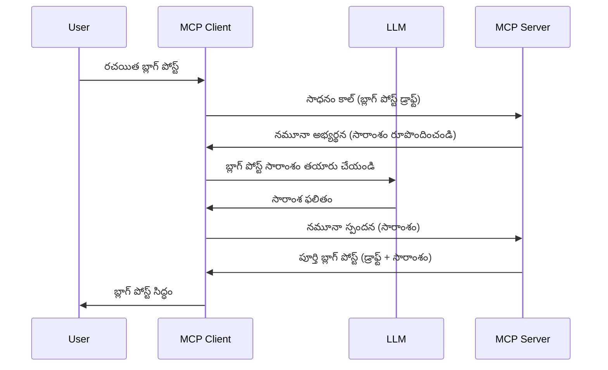

> [నిరాకరించబడింది: 2026-07-28 విడుదల అభ్యర్థి](https://blog.modelcontextprotocol.io/posts/2026-07-28-release-candidate/)

# శాంప్లింగ్ - క్లయింట్‌కు ఫీచర్లను ద委గేట్ చేయడం

> **నిరాకరణ నోటీసు:** `2026-07-28` MCP స్పెసిఫికేషన్ విడుదల అభ్యర్థి శాంప్లింగ్‌ను నేరుగా LLM ప్రొవైడర్ APIs‌తో సమైక్యం చేయడాన్ని ప్రాధాన్యం ఇచ్చి నిరాకరించబడినదిగా సూచిస్తుంది. శాంప్లింగ్ `2025-11-25` లో మరియు ఏవైనా అధికారిక నిరాకరణ తర్వాత కనీసం సంవత్సరం పాటు పని చేస్తూనే ఉంటుంది, కాబట్టి ఈ పాఠములోని అన్ని విషయాలు శ válido గా ఉంటాయి — కానీ కొత్త సర్వర్ డిజైన్లు ప్రత్యామ్నాయ నమూనాను ఆవలంబించాలి. [MCPలో మార్పులు ఏమిటి: 2026-07-28 విడుదల అభ్యర్థి](../../01-CoreConcepts/mcp-2026-07-28-release-candidate.md) చూడండి.

కొన్నిసార్లు, మీరు MCP క్లయింట్ మరియు MCP సర్వర్‌ను సాధారణ లక్ష్యాన్ని సాధించడానికి కలిసి పనిచేయాల్సి ఉంటుంది. మీరు ఒక సందర్భంలో సర్వర్‌కు క్లయింట్‌పై ఉన్న LLM సాయం అవసరం అవచ్చు. ఈ పరిస్థితికి, శాంప్లింగ్‌ను ఉపయోగించాలి.

కొన్నివాడుకల సందర్భాలు మరియు శాంప్లింగ్‌ను ఎలా నిర్మించాలో చూద్దాం.

## సమీక్ష

ఈ పాఠంలో, శాంప్లింగ్ ఎప్పుడు మరియు ఎక్కడ ఉపయోగించాలో, దీన్ని ఎలా కాన్ఫిగర్ చేయాలో మేము చర్చిస్తాము.

## నేర్చుకోవాల్సిన లక్ష్యాలు

ఈ అధ్యాయంలో, మేము:

- శాంప్లింగ్ అంటే ఏమిటి మరియు ఎప్పుడు ఉపయోగించాలో వివరించాలి.
- MCPలో శాంప్లింగ్‌ను ఎలా కాన్ఫిగర్ చేయాలో చూపించాలి.
- శాంప్లింగ్‌తో పని చేసే ఉదాహరణలను అందించాలి.

## శాంప్లింగ్ అంటే ఏమిటి మరియు దీన్ని ఎందుకు ఉపయోగించాలి?

శాంప్లింగ్ అనేది ఈ విధంగా పని చేసే ఒక అధునాతన ఫీచర్:



### శాంప్లింగ్ అభ్యర్థన

సరే, ఇప్పుడు మనకు ఒక నమ్మదగిన సందర్భం ఉన్నందున, సర్వర్ క్లయింట్‌కి పంపే శాంప్లింగ్ అభ్యర్థన గురించి మాట్లాడుకుందాం. JSON-RPC ఫార్మాట్‌లో ఈ అభ్యర్థన ఇలా కనిపించవచ్చు:

```json
{
  "jsonrpc": "2.0",
  "id": 1,
  "method": "sampling/createMessage",
  "params": {
    "messages": [
      {
        "role": "user",
        "content": {
          "type": "text",
          "text": "Create a blog post summary of the following blog post: <BLOG POST>"
        }
      }
    ],
    "modelPreferences": {
      "hints": [
        {
          "name": "claude-3-sonnet"
        }
      ],
      "intelligencePriority": 0.8,
      "speedPriority": 0.5
    },
    "systemPrompt": "You are a helpful assistant.",
    "maxTokens": 100
  }
}
```

ఇక్కడ కొన్ని ముఖ్యమైన అంశాలు ఉన్నాయి:

- ప్రాంప్ట్, content -> text క్రింద ఉంటుంది, ఇది LLMకి బ్లాగ్ పోస్ట్ కంటెంట్‌ను సారాంశం చేయాలని సూచించే సూచన.

- **modelPreferences**. ఈ విభాగం కేవలం ఒక అభిరుచి, LLMతో ఉపయోగించాల్సిన కాన్ఫిగరేషన్ కు సిఫార్సు. వినియోగదారు ఈ సిఫార్సులను అనుసరించవచ్చు లేదా మార్చుకోవచ్చు. ఈ సందర్భంలో మోడల్, వేగం మరియు నిపుణత ప్రాధాన్యతలపై సిఫార్సులు ఉన్నాయి.
- **systemPrompt**, ఇది మీ LLMకి వ్యక్తిత్వాన్ని ఇస్తుంది మరియు మార్గదర్శక సూచనలుంటుంది.
- **maxTokens**, ఈ ప్రాపర్టీ ఈ పనికి ఎంత టోకన్స్ సిఫార్సు చేశాలో సూచిస్తుంది.

### శాంప్లింగ్ స్పందన

ఈ స్పందన MCP క్లయింట్ MCP సర్వర్‌కి తిరిగి పంపేదే, ఇది క్లయింట్ LLMను పిలిచి ఆ స్పందన కోసం వేచి ఉండి, ఆ సందేశాన్ని నిర్మించే ఫలితం. JSON-RPCలో ఇది ఈ విధంగా కనిపించవచ్చు:

```json
{
  "jsonrpc": "2.0",
  "id": 1,
  "result": {
    "role": "assistant",
    "content": {
      "type": "text",
      "text": "Here's your abstract <ABSTRACT>"
    },
    "model": "gpt-5",
    "stopReason": "endTurn"
  }
}
```

స్పందన బ్లాగ్ పోస్ట్ యొక్క సారాంశం లాంటిదే ఉన్నదని గమనించండి, అలాగే ఉపయోగించిన `model` మేము అడిగినది కాదు కానీ "claude-3-sonnet" మీద "gpt-5" అని ఉంది. ఇది వినియోగదారు తమ ఇష్టాన్ని మార్చుకోవచ్చు అని చూపడానికి, మీ శాంప్లింగ్ అభ్యర్థన సిఫార్సు మాత్రమే అని దృఢీకరించడానికి.

సరే, ఇప్పుడు మేము ప్రధాన ప్రవాహాన్ని అర్థం చేసుకున్నాము, మరియు ఉపయోగకరమైన పని "బ్లాగ్ పోస్ట్ సృష్టి + సారాంశం" కోసం ఈ శాంప్లింగ్‌ను ఉపయోగించాలి.

### సందేశ రకాలు

శాంప్లింగ్ సందేశాలు కేవలం టెక్స్ట్ కు మాత్రమే పరిమితం కావు, మీరు చిత్రాలు మరియు ఆడియో కూడా పంపవచ్చు. JSON-RPC ఇలా భిన్నంగా కనిపిస్తుంది:

**టెక్స్ట్**

```json
{
  "type": "text",
  "text": "The message content"
}
```

**చిత్ర కంటెంట్**

```json
{
  "type": "image",
  "data": "base64-encoded-image-data",
  "mimeType": "image/jpeg"
}
```

**ఆడియో కంటెంట్**

```json
{
  "type": "audio",
  "data": "base64-encoded-audio-data",
  "mimeType": "audio/wav"
}
```

> NOTE: శాంప్లింగ్ పై మరింత వివరణ కోసం [అధికారిక డాక్యుమెంట్స్](https://modelcontextprotocol.io/specification/2025-11-25/client/sampling) చూడండి

## క్లయింట్‌లో శాంప్లింగ్‌ను ఎలా కాన్ఫిగర్ చేయాలి

> గమనిక: మీరు కేవలం సర్వర్‌ను మాత్రమే బిల్డ్ చేస్తుంటే ఇక్కడ ఎక్కువగా చేసుకునే పని లేదు.

క్లయింట్లో, మీరు ఈ ఫీచర్‌ను ఈ విధంగా పేర్కొనాలి:

```json
{
  "capabilities": {
    "sampling": {}
  }
}
```

ఇది మీరు ఎంచుకున్న క్లయింట్ సర్వర్‌తో ప్రారంభించినప్పుడు పిక్ అప్ అవుతుంది.

## శాంప్లింగ్ ప్రాక్టీస్ ఉదాహరణ - బ్లాగ్ పోస్ట్ సృష్టి

శాంప్లింగ్ సర్వర్‌ను కుడా కోడ్ చేయండి, కింది పనులు చేయాల్సివుంటాయి:

1. సర్వర్కి టూల్‌ను సృష్టించండి.
1. ఆ టూల్ శాంప్లింగ్ అభ్యర్థన సృష్టించాలి
1. క్లయింట్ శాంప్లింగ్ అభ్యర్థనకు సమాధానం రావడానికి టూల్ వేచిచూడాలి.
1. ఆ తర్వాత టూల్ ఫలితాన్ని ఉత్పత్తి చేయాలి.

కోడ్‌ను దశలవారీగా చూద్దాం:

### -1- టూల్ సృష్టించు

**python**

```python
@mcp.tool()
async def create_blog(title: str, content: str, ctx: Context[ServerSession, None]) -> str:
    """Create a blog post and generate a summary"""

```

### -2- శాంప్లింగ్ అభ్యర్థన సృష్టించు

మీ టూల్‌ను ఈ క్రింది కోడ్‌తో విస్తరించండి:

**python**

```python
post = BlogPost(
        id=len(posts) + 1,
        title=title,
        content=content,
        abstract=""
    )

prompt = f"Create an abstract of the following blog post: title: {title} and draft: {content} "

result = await ctx.session.create_message(
        messages=[
            SamplingMessage(
                role="user",
                content=TextContent(type="text", text=prompt),
            )
        ],
        max_tokens=100,
)

```

### -3- సమాధానం కోసం వేచి ఉండి సమాధానం తిరిగి ఇవ్వండి

**python**

```python
post.abstract = result.content.text

posts.append(post)

# పూర్తి ఉత్పత్తిని రిటర్న్ చేయండి
return json.dumps({
    "id": post.title,
    "abstract": post.abstract
})
```

### -4- పూర్తైన కోడ్

**python**

```python
from starlette.applications import Starlette
from starlette.routing import Mount, Host

from mcp.server.fastmcp import Context, FastMCP

from mcp.server.session import ServerSession
from mcp.types import SamplingMessage, TextContent

import json


from uuid import uuid4
from typing import List
from pydantic import BaseModel


mcp = FastMCP("Blog post generator")

# app = FastAPI()

posts = []

class BlogPost(BaseModel):
    id: int
    title: str
    content: str
    abstract: str

posts: List[BlogPost] = []

@mcp.tool()
async def create_blog(title: str, content: str, ctx: Context[ServerSession, None]) -> str:
    """Create a blog post and generate a summary"""

    post = BlogPost(
        id=len(posts) + 1,
        title=title,
        content=content,
        abstract=""
    )

    prompt = f"Create an abstract of the following blog post: title: {title} and draft: {content} "

    result = await ctx.session.create_message(
        messages=[
            SamplingMessage(
                role="user",
                content=TextContent(type="text", text=prompt),
            )
        ],
        max_tokens=100,
    )

    post.abstract = result.content.text

    posts.append(post)

    # పూర్తి బ్లాగ్ పోస్ట్‌ను తిరిగి ఇవ్వండి
    return json.dumps({
        "id": post.title,
        "abstract": post.abstract
    })

if __name__ == "__main__":
    print("Starting server...")
    # mcp.run()
    mcp.run(transport="streamable-http")

# యాప్‌ను ఈ విధంగా నడపండి: python server.py
```

### -5- విజువల్ స్టూడియో కోడ్‌లో పరీక్ష

దీన్ని విజువల్ స్టూడియో కోడ్‌లో పరీక్షించడానికి, ఈ క్రింద ఇవ్వబడినట్లు చేయండి:

1. టెర్మినల్‌లో సర్వర్ ప్రారంభించండి
1. దాన్ని *mcp.json* లో చేరజేయండి (మరియు అది ప్రారంభించబడిందో లేదో చూసుకోండి), ఉదా: ఇలా:

   ```json
   "servers": {
      "blog-server": {
        "type": "http",
        "url": "http://localhost:8000/mcp"
      }
   }
   ```

1. ప్రాంప్ట్ టైప్ చేయండి:

   ```text
   create a blog post named "Where Python comes from", the content is "Python is actually named after Monty Python Flying Circus"
   ```

1. శాంప్లింగ్ జరుగడానికి అనుమతించండి. మీరు తొలిసారిగా ఈ పరీక్ష చేస్తే అదనపు డైలాగ్ కనిపిస్తుంది, దాన్ని మంజూరు చేయాలి, ఆపై సాధారణ టూల్ రన్ చేయమని డైలాగ్ వస్తుంది

1. ఫలితాలను పరిశీలించండి. మీరు ఫలితాలను GitHub Copilot చాట్‌లో అద్భుతంగా చూసుకోగలుగుతారు, అలాగే రా JSON స్పందనను కూడా పరిశీలించవచ్చు.

**బోనస్**. విజువల్ స్టూడియో కోడ్ టూలింగ్ శాంప్లింగ్‌కు గొప్ప మద్దతు ఇస్తుంది. మీరు ఇన్స్టాల్ చేసిన సర్వర్‌లో శాంప్లింగ్ యాక్సెస్‌ని ఈ విధంగా కాన్ఫిగర్ చేయవచ్చు:

1. ఎక్స్‌టెన్షన్ విభాగానికి వెళ్ళండి.
1. "MCP SERVERS - INSTALLED" విభాగంలో మీ ఇన్స్టాల్ చేసిన సర్వర్ కోసం కాగ్ ఐకాన్‌ను ఎంచుకోండి.
1 "Configure Model Access" ఎంచుకోండి, ఇక్కడ GitHub Copilot శాంప్లింగ్ నిర్వహించే సమయంలో ఉపయోగించే మోడల్‌లను ఎంచుకోవచ్చు. అలాగే "Show Sampling requests" ఎంచుకుంటే ఇటీవల జరిగిన అన్ని శాంప్లింగ్ అభ్యర్థనలను చూడవచ్చు.

## అస్సైన్మెంట్

ఈ అస్సైన్మెంట్‌లో, మీరు కొంచెం వేరొక రకం శాంప్లింగ్ నిర్మించబోతున్నారు, అనగా ఉత్పత్తి వివరణను రూపొందించడం జరుగుతోన్న శాంప్లింగ్ సమైక్యం. మీ పరిస్థితి ఇదే:

**సినారియో**: ఈ-కామర్స్ బ్యాక్ ఆఫీస్ కార్యకర్త ఉత్పత్తి వివరణ తయారు చేయడానికి చాలా ఎక్కువ సమయం పడుతుంది. అందువల్ల, మీరు "create_product" అనే టూల్‌ను "title" మరియు "keywords" ఆర్గుమెంట్లతో పిలిచి, క్లయింట్‌ LLM ద్వారా "description" ఫీల్డ్‌తో కూడిన పూర్తి ఉత్పత్తిని ఉత్పత్తి చేసే ఒక పరిష్కారాన్ని నిర్మించాలి.

TIP: మీరు ముందుగా నేర్చుకున్నదిని ఉపయోగించి ఈ సర్వర్ మరియు టూల్‌ను శాంప్లింగ్ అభ్యర్థన సహాయంతో నిర్మించాలి.

## పరిష్కారం

[పరిష్కారం](./solution/README.md)

## ముఖ్యాంశాలు

శాంప్లింగ్ అనేది ఒక శక్తివంతమైన ఫీచర్, ఇది సర్వర్ LLM సహాయం అవసరం అయితే పనులను క్లయింటిDelegate చేయ allows.

## తరువాత ఏమి ఉంటుంది

- [అధ్యాయం 4 - ప్రాయోగిక అమలు](../../04-PracticalImplementation/README.md)

---

<!-- CO-OP TRANSLATOR DISCLAIMER START -->
**అస్వీకరణ**:
ఈ పత్రం AI అనువాద సేవ [Co-op Translator](https://github.com/Azure/co-op-translator) ఉపయోగించి అనువదించబడింది. మేము ఖచ్చితత్వానికి ప్రయత్నిస్తున్నప్పటికీ, ఆటోమేటెడ్ అనువాదాలు తప్పులు లేదా అసమగ్రతలను కలిగి ఉండవచ్చు. దాని స్వదేశ భాషలో ఉన్న అసలు పత్రాన్ని అధికారం కలిగిన మూలంగా పరిగణించాలి. కీలకమైన సమాచారం కోసం, ప్రొఫెషనల్ మానవ అనువాదాన్ని సిఫారసు చేస్తాము. ఈ అనువాదం ఉపయోగం వల్ల కలిగే ఏవైనా అపార్థాలు లేదా తప్పుదారులు కోసం మేము బాధ్యత వహించము.
<!-- CO-OP TRANSLATOR DISCLAIMER END -->