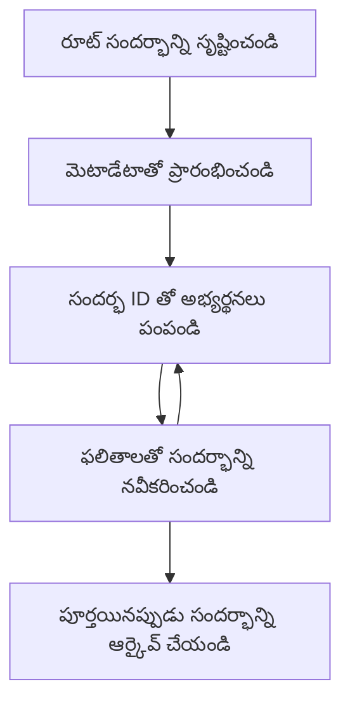

> [డిప్రికేటెడ్: 2026-07-28 విడుదల అభ్యర్థి](https://blog.modelcontextprotocol.io/posts/2026-07-28-release-candidate/#roots-sampling-and-logging-are-deprecated)

# MCP రూట్ కాంటెక్స్ట్స్

> **డిప్రికేషన్ నోటీసు:** `2026-07-28` MCP స్పెసిఫికేషన్ విడుదల అభ్యర్థి రూట్స్‌ ను టూల్ పారామితులు, వనరు URIలు లేదా సర్వర్ కాన్ఫిగరేషన్‌కు బదులు డిప్రికేటెడ్‌గా గుర్తించింది. రూట్స్ `2025-11-25` లో మరియు ఏదైనా అధికారిక డిప్రికేషన్ తరువాత కనీసం ఒక సంవత్సరం పాటు పని చేస్తాయి, కాబట్టి ఈ పాఠంలోని ప్రతీదీ చెల్లుబాటులో ఉంటుంది - కానీ కొత్త సర్వర్ డిజైన్లు ప్రత్యామ్నాయ నమూనాను పరిశీలించాలి. చూడండి [MCP లో మార్పులు: 2026-07-28 విడుదల అభ్యర్థి](../../01-CoreConcepts/mcp-2026-07-28-release-candidate.md).

రూట్ కాంటెక్స్ట్స్ మోడల్ కాంటెక్స్ట్ ప్రోటోకాల్‌లో ఒక ప్రాథమిక భావన, ఇవి సంభాషణ చరిత్ర మరియు పలు అభ్యర్థనలు మరియు సెషన్‌ల మధ్య పంచుకున్న స్థితిని నిల్వ చేయడానికి ఒక స్థిరమైన పొరగా పనిచేస్తాయి.

## పరిచయం

ఈ పాఠంలో, మేము MCPలో రూట్ కాంటెక్స్ట్స్ ను ఎలా సృష్టించాలి, నిర్వహించాలి మరియు ఉపయోగించాలో అన్వేషించబోతున్నాం.

## నేర్చుకునే లక్ష్యాలు

ఈ పాఠం ముగిసేటప్పుడు, మీరు వీటిని చేయగలుగుతారు:

- రూట్ కాంటెక్స్ట్స్ యొక్క ఉద్దేశ్యం మరియు నిర్మాణం అర్థం చేసుకోవడం
- MCP క్లయింట్ లైబ్రరీలను ఉపయోగించి రూట్ కాంటెక్స్ట్స్ సృష్టించడం మరియు నిర్వహించడం
- .NET, Java, జావాస్క్రిప్ట్, మరియు పython అనువర్తనాలలో రూట్ కాంటెక్స్ట్స్‌ని అమలు చేయడం
- బహుళ-తిరుగుబాటు సంభాషణల మరియు స్థితి నిర్వహణ కోసం రూట్ కాంటెక్స్ట్స్‌ని ఉపయోగించడం
- రూట్ కాంటెక్స్ట్ నిర్వహణకు ఉత్తమ పద్ధతులను అమలు చేయడం

## రూట్ కాంటెక్స్ట్స్ అర్థం చేసుకోడం

రూట్ కాంటెక్స్ట్స్ అనేవి సంబంధిత సంక్రియల సిరీస్ కోసం చరిత్ర మరియు స్థితిని కలిగి ఉన్న కంటైనర్లు. అవి ఇది సాద్యం చేస్తాయి:

- **సంభాషణ స్థిరత్వం**: సుసంపన్న బహుళ-తిరుగుబాటు సంభాషణలను నిర్వహించడం
- **మెమరీ నిర్వహణ**: సంక్రియలలో సమాచారం నిల్వ చేయడం మరియు తీసుకోవటం
- **స్థితి నిర్వహణ**: క్లిష్టమైన వర్క్‌ఫ్లోలలో పురోగతిని ట్రాక్ చేయడం
- **కాంటెక్స్ట్ షేరింగ్**: అనేక క్లయింట్లు ఒకే సంభాషణ స్థితిని యాక్సెస్ చేయడం

MCPలో, రూట్ కాంటెక్స్ట్స్ ఈ ముఖ్య లక్షణాలు కలిగి ఉంటాయి:

- ప్రతి రూట్ కాంటెక్స్ట్ కు ఒక ప్రత్యేక ఐడెంటిఫయర్ ఉంటుంది.
- అవి సంభాషణ చరిత్ర, యూజర్ ప్రాధాన్యతలు మరియు ఇతర మెటాడేటాను కలిగి ఉండవచ్చు.
- అవసరమనుకుంటే అవి సృష్టించబడతాయి, యాక్సెస్ చేయబడతాయి, మరియు ఆర్కైవ్ చేయబడతాయి.
- అవి సూక్ష్మ అనుమతి నియంత్రణ మరియు పరిమితులను మద్దతు ఇస్తాయి.

## రూట్ కాంటెక్స్ట్ జీవనచక్రం



## రూట్ కాంటెక్స్ట్స్‌తో పని చేయడం

ఇక్కడ రూట్ కాంటెక్ష్ట్స్ ఎలా సృష్టించాలి మరియు నిర్వహించాలో ఒక ఉదాహరణ ఉంది.

### C# అమలు

```csharp
// .NET Example: Root Context Management
using Microsoft.Mcp.Client;
using System;
using System.Threading.Tasks;
using System.Collections.Generic;

public class RootContextExample
{
    private readonly IMcpClient _client;
    private readonly IRootContextManager _contextManager;
    
    public RootContextExample(IMcpClient client, IRootContextManager contextManager)
    {
        _client = client;
        _contextManager = contextManager;
    }
    
    public async Task DemonstrateRootContextAsync()
    {
        // 1. Create a new root context
        var contextResult = await _contextManager.CreateRootContextAsync(new RootContextCreateOptions
        {
            Name = "Customer Support Session",
            Metadata = new Dictionary<string, string>
            {
                ["CustomerName"] = "Acme Corporation",
                ["PriorityLevel"] = "High",
                ["Domain"] = "Cloud Services"
            }
        });
        
        string contextId = contextResult.ContextId;
        Console.WriteLine($"Created root context with ID: {contextId}");
        
        // 2. First interaction using the context
        var response1 = await _client.SendPromptAsync(
            "I'm having issues scaling my web service deployment in the cloud.", 
            new SendPromptOptions { RootContextId = contextId }
        );
        
        Console.WriteLine($"First response: {response1.GeneratedText}");
        
        // Second interaction - the model will have access to the previous conversation
        var response2 = await _client.SendPromptAsync(
            "Yes, we're using containerized deployments with Kubernetes.", 
            new SendPromptOptions { RootContextId = contextId }
        );
        
        Console.WriteLine($"Second response: {response2.GeneratedText}");
        
        // 3. Add metadata to the context based on conversation
        await _contextManager.UpdateContextMetadataAsync(contextId, new Dictionary<string, string>
        {
            ["TechnicalEnvironment"] = "Kubernetes",
            ["IssueType"] = "Scaling"
        });
        
        // 4. Get context information
        var contextInfo = await _contextManager.GetRootContextInfoAsync(contextId);
        
        Console.WriteLine("Context Information:");
        Console.WriteLine($"- Name: {contextInfo.Name}");
        Console.WriteLine($"- Created: {contextInfo.CreatedAt}");
        Console.WriteLine($"- Messages: {contextInfo.MessageCount}");
        
        // 5. When the conversation is complete, archive the context
        await _contextManager.ArchiveRootContextAsync(contextId);
        Console.WriteLine($"Archived context {contextId}");
    }
}
```

ముందు కోడ్‌లో మేము:

1. కస్టమర్ సపోర్ట్ సెషన్ కోసం రూట్ కాంటెక్స్ట్ సృష్టించాము.
1. ఆ కాంటెక్స్ట్‌లో పలు సందేశాలు పంపించాము, మోడల్ స్థితిని నిర్వహించడానికి అనుమతించాము.
1. సంభాషణ ఆధారంగా సంబంధిత మెటాడేటాతో కాంటెక్స్ట్‌ను నవీకరించాము.
1. సంభాషణ చరిత్రను అర్థం చేసుకోవడానికి కాంటెక్స్ట్ సమాచారం తెచ్చాము.
1. సంభాషణ పూర్తయినప్పుడు కాంటెక్స్ట్‌ను ఆర్కైవ్ చేశాము.

## ఉదాహరణ: ఆర్థిక విశ్లేషణ కోసం రూట్ కాంటెక్స్ట్ అమలు

ఈ ఉదాహరణలో, మేము పలు సంక్రియల మధ్య స్థితిని నిర్వహించాలనే విధంగా ఆర్థిక విశ్లేషణ సెషన్ కోసం రూట్ కాంటెక్స్ట్ సృష్టిస్తాము.

### జావా అమలు

```java
// జావా ఉదాహరణ: రూట్ కాంటెక్స్ట్ అమలుచేయడం
package com.example.mcp.contexts;

import com.mcp.client.McpClient;
import com.mcp.client.ContextManager;
import com.mcp.models.RootContext;
import com.mcp.models.McpResponse;

import java.util.HashMap;
import java.util.Map;
import java.util.UUID;

public class RootContextsDemo {
    private final McpClient client;
    private final ContextManager contextManager;
    
    public RootContextsDemo(String serverUrl) {
        this.client = new McpClient.Builder()
            .setServerUrl(serverUrl)
            .build();
            
        this.contextManager = new ContextManager(client);
    }
    
    public void demonstrateRootContext() throws Exception {
        // కాంటెక్స్ట్ మెటాడేటా సృష్టించండి
        Map<String, String> metadata = new HashMap<>();
        metadata.put("projectName", "Financial Analysis");
        metadata.put("userRole", "Financial Analyst");
        metadata.put("dataSource", "Q1 2025 Financial Reports");
        
        // 1. కొత్త రూట్ కాంటెక్స్ట్ సృష్టించండి
        RootContext context = contextManager.createRootContext("Financial Analysis Session", metadata);
        String contextId = context.getId();
        
        System.out.println("Created context: " + contextId);
        
        // 2. మొదటి పరస్పర చర్య
        McpResponse response1 = client.sendPrompt(
            "Analyze the trends in Q1 financial data for our technology division",
            contextId
        );
        
        System.out.println("First response: " + response1.getGeneratedText());
        
        // 3. స్పందన నుండి పొందిన ముఖ్యమైన సమాచారంతో కాంటెక్స్ట్‌ను నవీకరించండి
        contextManager.addContextMetadata(contextId, 
            Map.of("identifiedTrend", "Increasing cloud infrastructure costs"));
        
        // రెండవ పరస్పర చర్య - అదే కాంటెక్స్ట్ ఉపయోగించడం
        McpResponse response2 = client.sendPrompt(
            "What's driving the increase in cloud infrastructure costs?",
            contextId
        );
        
        System.out.println("Second response: " + response2.getGeneratedText());
        
        // 4. విశ్లేషణ సెషన్ యొక్క సారాంశాన్ని రూపొందించండి
        McpResponse summaryResponse = client.sendPrompt(
            "Summarize our analysis of the technology division financials in 3-5 key points",
            contextId
        );
        
        // సారాంశాన్ని కాంటెక్స్ట్ మెటాడేటాలో నిల్వ చేయండి
        contextManager.addContextMetadata(contextId, 
            Map.of("analysisSummary", summaryResponse.getGeneratedText()));
            
        // నవీకరించిన కాంటెక్స్ట్ సమాచారం పొందండి
        RootContext updatedContext = contextManager.getRootContext(contextId);
        
        System.out.println("Context Information:");
        System.out.println("- Created: " + updatedContext.getCreatedAt());
        System.out.println("- Last Updated: " + updatedContext.getLastUpdatedAt());
        System.out.println("- Analysis Summary: " + 
            updatedContext.getMetadata().get("analysisSummary"));
            
        // 5. పూర్తయిన తర్వాత కాంటెక్స్ట్‌ను ఆర్కైవ్ చేయండి
        contextManager.archiveContext(contextId);
        System.out.println("Context archived");
    }
}
```

ముందు కోడ్‌లో మేము:

1. ఆర్థిక విశ్లేషణ సెషన్ కోసం రూట్ కాంటెక్స్ట్ సృష్టించాము.
2. ఆ కాంటెక్స్ట్‌లో పలు సందేశాలు పంపించాము, మోడల్ స్థితిని నిర్వహించడానికి అనుమతించాము.
3. సంభాషణ ఆధారంగా సంబంధిత మెటాడేటాతో కాంటెక్స్ట్‌ను నవీకరించాము.
4. విశ్లేషణ సెషన్ సారాంశాన్ని ఉత్పత్తి చేసి, దాన్ని కాంటెక్స్ట్ మెటాడేటాలో నిల్వ చేశాము.
5. సంభాషణ పూర్తయినప్పుడు కాంటెక్స్ట్‌ను ఆర్కైవ్ చేశాము.

## ఉదాహరణ: రూట్ కాంటెక్స్ట్ నిర్వహణ

సంభాషణ చరిత్ర మరియు స్థితిని నిర్వహించడానికి రూట్ కాంటెక్స్ట్స్‌ను సమర్ధవంతంగా నిర్వహించడం కీలకం. క్రింది ఉదాహరణ రూట్ కాంటెక్స్ట్ నిర్వహణను ఎలా అమలు చేయాలో చూపిస్తుంది.

### జావాస్క్రిప్ట్ అమలు

```javascript
// జావాస్క్రిప్ట్ ఉదాహరణ: MCP రూట్ కాంటెక్స్ట్‌లను నిర్వహించడం
const { McpClient, RootContextManager } = require('@mcp/client');

class ContextSession {
  constructor(serverUrl, apiKey = null) {
    // MCP క్లయింట్ను ప్రారంభించండి
    this.client = new McpClient({
      serverUrl,
      apiKey
    });
    
    // కాంటెక్స్ట్ మేనేజర్‌ను ప్రారంభించండి
    this.contextManager = new RootContextManager(this.client);
  }
  
  /**
   * Create a new conversation context
   * @param {string} sessionName - Name of the conversation session
   * @param {Object} metadata - Additional metadata for the context
   * @returns {Promise<string>} - Context ID
   */
  async createConversationContext(sessionName, metadata = {}) {
    try {
      const contextResult = await this.contextManager.createRootContext({
        name: sessionName,
        metadata: {
          ...metadata,
          createdAt: new Date().toISOString(),
          status: 'active'
        }
      });
      
      console.log(`Created root context '${sessionName}' with ID: ${contextResult.id}`);
      return contextResult.id;
    } catch (error) {
      console.error('Error creating root context:', error);
      throw error;
    }
  }
  
  /**
   * Send a message in an existing context
   * @param {string} contextId - The root context ID
   * @param {string} message - The user's message
   * @param {Object} options - Additional options
   * @returns {Promise<Object>} - Response data
   */
  async sendMessage(contextId, message, options = {}) {
    try {
      // నిర్దిష్ట కాంటెక్స్ట్ ఉపయోగించి సందేశాన్ని పంపండి
      const response = await this.client.sendPrompt(message, {
        rootContextId: contextId,
        temperature: options.temperature || 0.7,
        allowedTools: options.allowedTools || []
      });
      
      // సంభాషణ నుండి ముఖ్యమైన అవగాహనలను ఐచ్ఛికంగా నిల్వ చేయండి
      if (options.storeInsights) {
        await this.storeConversationInsights(contextId, message, response.generatedText);
      }
      
      return {
        message: response.generatedText,
        toolCalls: response.toolCalls || [],
        contextId
      };
    } catch (error) {
      console.error(`Error sending message in context ${contextId}:`, error);
      throw error;
    }
  }
  
  /**
   * Store important insights from a conversation
   * @param {string} contextId - The root context ID
   * @param {string} userMessage - User's message
   * @param {string} aiResponse - AI's response
   */
  async storeConversationInsights(contextId, userMessage, aiResponse) {
    try {
      // సంభావ్య అవగాహనలను తీసుకోండి (నిజమైన యాప్‌లో ఇది మరింత స్మార్ట్‌గా ఉంటుంది)
      const combinedText = userMessage + "\n" + aiResponse;
      
      // సంభావ్య అవగాహనలను గుర్తించే సరళమైన హ్యూరిస్టిక్
      const insightWords = ["important", "key point", "remember", "significant", "crucial"];
      
      const potentialInsights = combinedText
        .split(".")
        .filter(sentence => 
          insightWords.some(word => sentence.toLowerCase().includes(word))
        )
        .map(sentence => sentence.trim())
        .filter(sentence => sentence.length > 10);
      
      // అవగాహనలను కాంటెక్స్ట్ మెటాడేటాలో నిల్వ చేయండి
      if (potentialInsights.length > 0) {
        const insights = {};
        potentialInsights.forEach((insight, index) => {
          insights[`insight_${Date.now()}_${index}`] = insight;
        });
        
        await this.contextManager.updateContextMetadata(contextId, insights);
        console.log(`Stored ${potentialInsights.length} insights in context ${contextId}`);
      }
    } catch (error) {
      console.warn('Error storing conversation insights:', error);
      // అతి ముఖ్యమైన తప్పిదం కాదు, కాబట్టి హెచ్చరికను మాత్రమే లాగ్ చేయండి
    }
  }
  
  /**
   * Get summary information about a context
   * @param {string} contextId - The root context ID
   * @returns {Promise<Object>} - Context information
   */
  async getContextInfo(contextId) {
    try {
      const contextInfo = await this.contextManager.getContextInfo(contextId);
      
      return {
        id: contextInfo.id,
        name: contextInfo.name,
        created: new Date(contextInfo.createdAt).toLocaleString(),
        lastUpdated: new Date(contextInfo.lastUpdatedAt).toLocaleString(),
        messageCount: contextInfo.messageCount,
        metadata: contextInfo.metadata,
        status: contextInfo.status
      };
    } catch (error) {
      console.error(`Error getting context info for ${contextId}:`, error);
      throw error;
    }
  }
  
  /**
   * Generate a summary of the conversation in a context
   * @param {string} contextId - The root context ID
   * @returns {Promise<string>} - Generated summary
   */
  async generateContextSummary(contextId) {
    try {
      // ఇప్పటి వరకు సంభాషణకు మోడల్‌ను సారాంశం రూపొందించమని అడగండి
      const response = await this.client.sendPrompt(
        "Please summarize our conversation so far in 3-4 sentences, highlighting the main points discussed.",
        { rootContextId: contextId, temperature: 0.3 }
      );
      
      // సారాంశాన్ని కాంటెక్స్ట్ మెటాడేటాలో నిల్వ చేయండి
      await this.contextManager.updateContextMetadata(contextId, {
        conversationSummary: response.generatedText,
        summarizedAt: new Date().toISOString()
      });
      
      return response.generatedText;
    } catch (error) {
      console.error(`Error generating context summary for ${contextId}:`, error);
      throw error;
    }
  }
  
  /**
   * Archive a context when it's no longer needed
   * @param {string} contextId - The root context ID
   * @returns {Promise<Object>} - Result of the archive operation
   */
  async archiveContext(contextId) {
    try {
      // ఆర్కైవ్ చేయడానికి ముందే తుది సారాంశాన్ని రూపొందించండి
      const summary = await this.generateContextSummary(contextId);
      
      // కాంటెక్స్ట్‌ను ఆర్కైవ్ చేయండి
      await this.contextManager.archiveContext(contextId);
      
      return {
        status: "archived",
        contextId,
        summary
      };
    } catch (error) {
      console.error(`Error archiving context ${contextId}:`, error);
      throw error;
    }
  }
}

// ఉదాహరణ వాడకం
async function demonstrateContextSession() {
  const session = new ContextSession('https://mcp-server-example.com');
  
  try {
    // 1. ఉత్పత్తి మద్దతు సంభాషణ కోసం కొత్త కాంటెక్స్ట్ సృష్టించండి
    const contextId = await session.createConversationContext(
      'Product Support - Database Performance',
      {
        customer: 'Globex Corporation',
        product: 'Enterprise Database',
        severity: 'Medium',
        supportAgent: 'AI Assistant'
      }
    );
    
    // 2. సంభాషణలో మొదటి సందేశం
    const response1 = await session.sendMessage(
      contextId,
      "I'm experiencing slow query performance on our database cluster after the latest update.",
      { storeInsights: true }
    );
    console.log('Response 1:', response1.message);
    
    // అదే కాంటెక్స్ట్‌లో అనుస‌రించు సందేశం
    const response2 = await session.sendMessage(
      contextId,
      "Yes, we've already checked the indexes and they seem to be properly configured.",
      { storeInsights: true }
    );
    console.log('Response 2:', response2.message);
    
    // 3. కాంటెక్స్ట్ గురించి సమాచారం పొందండి
    const contextInfo = await session.getContextInfo(contextId);
    console.log('Context Information:', contextInfo);
    
    // 4. సంభాషణ సారాంశాన్ని రూపొందించి ప్రదర్శించండి
    const summary = await session.generateContextSummary(contextId);
    console.log('Conversation Summary:', summary);
    
    // 5. పూర్తయిన తర్వాత కాంటెక్స్ట్‌ను ఆర్కైవ్ చేయండి
    const archiveResult = await session.archiveContext(contextId);
    console.log('Archive Result:', archiveResult);
    
    // 6. ఏ తప్పిదాలు వచ్చినా సున్నితంగా నిర్వహించండి
  } catch (error) {
    console.error('Error in context session demonstration:', error);
  }
}

demonstrateContextSession();
```

ముందు కోడ్‌లో మేము:

1. `createConversationContext` ఫంక్షన్ తో ప్రొడక్ట్ సపోర్ట్ సంభాషణ కోసం ఒక రూట్ కాంటెక్స్ట్ సృష్టించాము. ఇందులో కాంటెక్స్ట్ డేటాబేస్ పనితీరు సమస్యల గురించి ఉంది.

1. `sendMessage` ఫంక్షన్ తో ఆ కాంటెక్స్ట్‌లోపల పలు సందేశాలు పంపించాము, మోడల్ స్థితిని నిర్వహించడానికి అనుమతించాము. పంపబడే సందేశాలు నెమ్మదిగా పనిచేసే క్వెరీ పనితీరు మరియు సూచిక కాన్ఫిగరేషన్ గురించి.

1. సంభాషణ ఆధారంగా సంబంధిత మెటాడేటాతో కాంటెక్స్ట్‌ను నవీకరించాము.

1. `generateContextSummary` ఫంక్షన్ తో సంభాషణ సారాంశాన్ని ఉత్పత్తి చేసి, దాన్ని కాంటెక్స్ట్ మెటాడేటాలో నిల్వ చేశాము.

1. సంభాషణ పూర్తయినప్పుడు `archiveContext` ఫంక్షన్ తో కాంటెక్స్ట్‌ను ఆర్కైవ్ చేశాము.

1. బలహీనతలు లేకుండా తప్పుల్ని సమర్థవంతంగా నిర్వహించాము.

## బహుళ-తిరుగుబాటు సహాయానికి రూట్ కాంటెక్స్ట్

ఈ ఉదాహరణలో, మేము బహుళ-తిరుగుబాటు సహాయ సెషన్ కోసం ఒక రూట్ కాంటెక్స్ట్ సృష్టిస్తాము, పలు సంక్రియల మధ్య స్థితిని నిర్వహించడానికి ఎలా చేయాలో చూపిస్తుంది.

### పython అమలు

```python
# పైథన్ ఉదాహరణ: బహుళ-రివర్స్ సహాయానికి రూట్ కాంటెక్స్ట్
import asyncio
from datetime import datetime
from mcp_client import McpClient, RootContextManager

class AssistantSession:
    def __init__(self, server_url, api_key=None):
        self.client = McpClient(server_url=server_url, api_key=api_key)
        self.context_manager = RootContextManager(self.client)
    
    async def create_session(self, name, user_info=None):
        """Create a new root context for an assistant session"""
        metadata = {
            "session_type": "assistant",
            "created_at": datetime.now().isoformat(),
        }
        
        # అందించబడితే వినియోగదారు సమాచారం జతచేయండి
        if user_info:
            metadata.update({f"user_{k}": v for k, v in user_info.items()})
            
        # రూట్ కాంటెక్స్ట్ సృష్టించండి
        context = await self.context_manager.create_root_context(name, metadata)
        return context.id
    
    async def send_message(self, context_id, message, tools=None):
        """Send a message within a root context"""
        # కాంటెక్స్ట్ IDతో ఆప్షన్లు సృష్టించండి
        options = {
            "root_context_id": context_id
        }
        
        # సూచించబడితే టూల్స్ జతచేయండి
        if tools:
            options["allowed_tools"] = tools
        
        # కాంటెక్స్ట్ లో ప్రాంప్ట్ పంపండి
        response = await self.client.send_prompt(message, options)
        
        # సంభాషణ పురోగతితో కాంటెక్స్ట్ మెటాడేటాను అప్డేట్ చేయండి
        await self.context_manager.update_context_metadata(
            context_id,
            {
                f"message_{datetime.now().timestamp()}": message[:50] + "...",
                "last_interaction": datetime.now().isoformat()
            }
        )
        
        return response
    
    async def get_conversation_history(self, context_id):
        """Retrieve conversation history from a context"""
        context_info = await self.context_manager.get_context_info(context_id)
        messages = await self.client.get_context_messages(context_id)
        
        return {
            "context_info": context_info,
            "messages": messages
        }
    
    async def end_session(self, context_id):
        """End an assistant session by archiving the context"""
        # ముందుగా ఒక సారాంశ ప్రాంప్ట్ తయారుచేయండి
        summary_response = await self.client.send_prompt(
            "Please summarize our conversation and any key points or decisions made.",
            {"root_context_id": context_id}
        )
        
        # మెటాడేటాలో సారాంశాన్ని నిల్వచేయండి
        await self.context_manager.update_context_metadata(
            context_id,
            {
                "summary": summary_response.generated_text,
                "ended_at": datetime.now().isoformat(),
                "status": "completed"
            }
        )
        
        # కాంటెక్స్ట్ ని ఆర్కైవ్ చేయండి
        await self.context_manager.archive_context(context_id)
        
        return {
            "status": "completed",
            "summary": summary_response.generated_text
        }

# ఉదాహరణ వినియోగం
async def demo_assistant_session():
    assistant = AssistantSession("https://mcp-server-example.com")
    
    # 1. సెషన్ సృష్టించండి
    context_id = await assistant.create_session(
        "Technical Support Session",
        {"name": "Alex", "technical_level": "advanced", "product": "Cloud Services"}
    )
    print(f"Created session with context ID: {context_id}")
    
    # 2. మొదటి పరస్పర చర్య
    response1 = await assistant.send_message(
        context_id, 
        "I'm having trouble with the auto-scaling feature in your cloud platform.",
        ["documentation_search", "diagnostic_tool"]
    )
    print(f"Response 1: {response1.generated_text}")
    
    # అదే కాంటెక్స్ట్ లో రెండవ పరస్పర చర్య
    response2 = await assistant.send_message(
        context_id,
        "Yes, I've already checked the configuration settings you mentioned, but it's still not working."
    )
    print(f"Response 2: {response2.generated_text}")
    
    # 3. చరిత్ర పొందండి
    history = await assistant.get_conversation_history(context_id)
    print(f"Session has {len(history['messages'])} messages")
    
    # 4. సెషన్ ముగించండి
    end_result = await assistant.end_session(context_id)
    print(f"Session ended with summary: {end_result['summary']}")

if __name__ == "__main__":
    asyncio.run(demo_assistant_session())
```

ముందు కోడ్‌లో మేము:

1. `create_session` ఫంక్షన్ తో ఒక సాంకేతిక మద్దతు సెషన్ కోసం రూట్ కాంటెక్స్ట్ సృష్టించాము. కాంటెక్స్ట్‌లో యూజర్ సమాచారంగా పేరు మరియు సాంకేతిక స్థాయి ఉన్నాయి.

1. `send_message` ఫంక్షన్ తో ఆ కాంటెక్స్ట్‌లోపల పలు సందేశాలు పంపించాము, మోడల్ స్థితిని నిర్వహించడానికి అనుమతించాము. పంపబడే సందేశాలు ఆటో-స్కేలింగ్ ఫీచర్ సమస్యల గురించి.

1. `get_conversation_history` ఫంక్షన్ ద్వారా సంభాషణ చరిత్రను తెచ్చాము, ఇది కాంటెక్స్ట్ సమాచారం మరియు సందేశాలను అందిస్తుంది.

1. `end_session` ఫంక్షన్ తో సెషన్ ముగించాము, కాంటెక్స్ట్‌ను ఆర్కైవ్ చేసి, సంభాషణ నుండి ముఖ్యాంశాలను సారం చేయడం.

## రూట్ కాంటెక్స్ట్ ఉత్తమ ప్రాక్టీసులు

రూట్ కాంటెక్స్ట్స్‌ను సమర్ధవంతంగా నిర్వహించేందుకు కొన్ని ఉత్తమ పద్ధతులు ఇవి:

- **దృష్టి పెట్టిన కాంటెక్స్ట్స్ సృష్టించండి**: వివిధ సంభాషణ లక్ష్యాలు లేదా డొమైన్‌ల కోసం ప్రత్యేక రూట్ కాంటెక్స్ట్స్ సృష్టించి స్పష్టం చేయండి.

- **గడువు విధానాలు అమలు చేయండి**: నిల్వ నిర్వహణ మరియు డేటా నిల్వ విధానాలతో అనుసరించేందుకు పాత కాంటెక్స్ట్స్‌ను ఆర్కైవ్ లేదా తొలగించే విధానాలు అమలు చేయండి.

- **సంబంధిత మెటాడేటాను నిల్వ చేయండి**: సంభాషణ గురించి ముఖ్యం అనిపించే సమాచారాన్ని భవిష్యత్తులో ఉపయోగం కొరకు కాంటెక్స్ట్ మెటాడేటాలో నిల్వ చేయండి.

- **కాంటెక్స్ట్ ఐడీఎస్‌ను సాకారం చేయండి**: ఒకసారి కాంటెక్స్ట్ సృష్టించిన తర్వాత, దాని ID ను సంబంధిత అన్ని అభ్యర్థనల్లో ఓర్పుగా ఉపయోగించండి.

- **సారాంశాలను రూపొందించండి**: ఒక కాంటెక్స్ట్ పెద్దదిగా పెరిగినప్పుడు, ముఖ్యమైన సమాచారాన్ని పట్టుకోవడానికి సారాంశాలను సృష్టించడం పరిగణించండి.

- **యాక్సెస్ నియంత్రణను అమలు చేయండి**: బహుళ-యూజర్ వ్యవస్థల కోసం సంభాషణ కాంటెక్స్ట్స్ గోప్యత మరియు భద్రత కోసం సరయిన యాక్సెస్ నియంత్రణలు అమలు చేయండి.

- **కాంటెక్స్ట్ పరిమితులను నిర్వహించండి**: కాంటెక్స్ట్ పరిమాణ పరిమితులపై జాగ్రత్తగా ఉండండి మరియు చాలా పొడవైన సంభాషణలను నిర్వహించడానికి వ్యూహాలు అమలు చేయండి.

- **పూర్తయినప్పుడు ఆర్కైవ్ చేయండి**: సంభాషణలు పూర్తైనప్పుడు రూట్ కాంటెక్స్ట్స్‌ను ఆర్కైవ్ చేసి వనరులను విముక్తం చేయండి, అదే సమయంలో సంభాషణ చరిత్రను నిలుపుకోండి.

## తర్వాత ఏమిటి

- [5.5 రౌటింగ్](../mcp-routing/README.md)

---

<!-- CO-OP TRANSLATOR DISCLAIMER START -->
**అస్వీకరణ**:
ఈ పత్రం AI అనువాద సేవ [Co-op Translator](https://github.com/Azure/co-op-translator) ఉపయోగించి అనువదించబడింది. మేము ఖచ్చితత్వానికి ప్రయత్నిస్తున్నప్పటికీ, ఆటోమేటెడ్ అనువాదాలు తప్పులు లేదా అసమగ్రతలను కలిగి ఉండవచ్చు. దాని స్వదేశ భాషలో ఉన్న అసలు పత్రాన్ని అధికారం కలిగిన మూలంగా పరిగణించాలి. కీలకమైన సమాచారం కోసం, ప్రొఫెషనల్ మానవ అనువాదాన్ని సిఫారసు చేస్తాము. ఈ అనువాదం ఉపయోగం వల్ల కలిగే ఏవైనా అపార్థాలు లేదా తప్పుదారులు కోసం మేము బాధ్యత వహించము.
<!-- CO-OP TRANSLATOR DISCLAIMER END -->