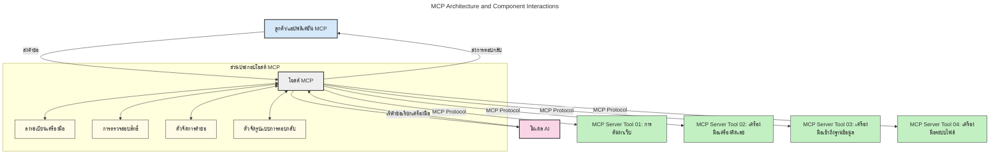
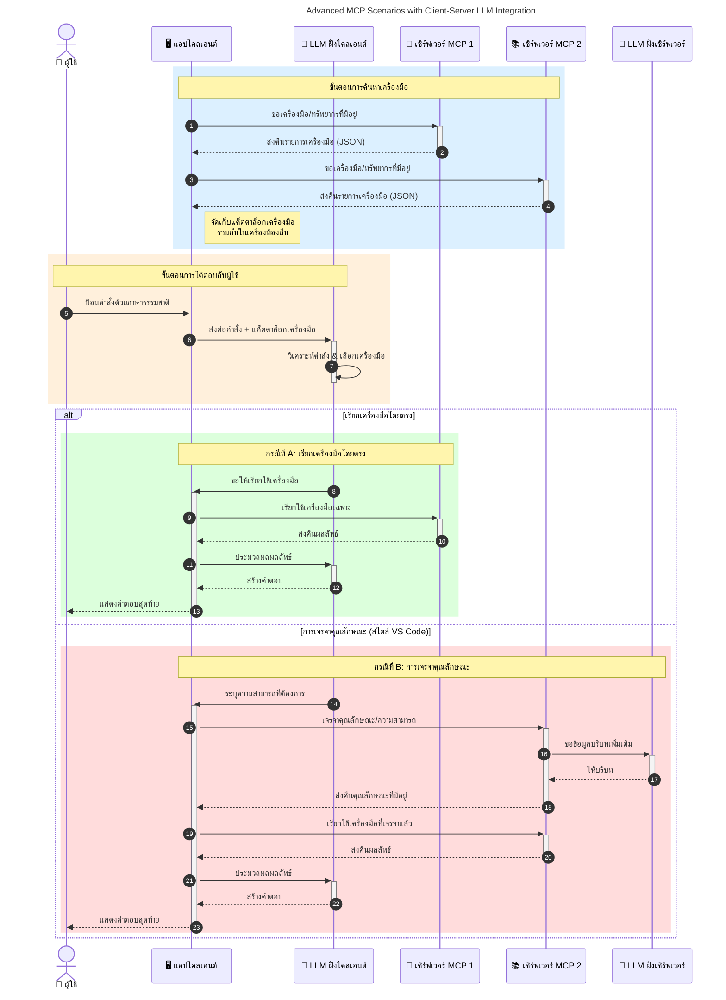

# แนะนำโปรโตคอล Model Context (MCP): ทำไมถึงสำคัญสำหรับแอปพลิเคชัน AI ที่ขยายตัวได้

[](https://youtu.be/agBbdiOPLQA)

_(คลิกที่ภาพด้านบนเพื่อดูวิดีโอของบทเรียนนี้)_

แอปพลิเคชัน Generative AI นับเป็นก้าวที่ยิ่งใหญ่เนื่องจากมักอนุญาตให้ผู้ใช้โต้ตอบกับแอปโดยใช้คำสั่งภาษาธรรมชาติ อย่างไรก็ตาม เมื่อมีการลงทุนเวลาและทรัพยากรมากขึ้นกับแอปเหล่านี้ คุณต้องการมั่นใจว่าสามารถผนวกรวมฟังก์ชันการทำงานและทรัพยากรได้อย่างง่ายดายในลักษณะที่ขยายได้ง่าย แอปของคุณสามารถรองรับแบบจำลองมากกว่าหนึ่งแบบที่ถูกใช้งาน และจัดการกับความซับซ้อนต่าง ๆ ของแบบจำลองได้ สรุปสั้น ๆ การสร้างแอป Gen AI นั้นง่ายในช่วงเริ่มต้น แต่เมื่อมันขยายตัวและมีความซับซ้อนมากขึ้น คุณจะต้องเริ่มกำหนดสถาปัตยกรรมและน่าจะต้องพึ่งพามาตรฐานเพื่อให้มั่นใจว่าแอปของคุณถูกสร้างขึ้นในรูปแบบที่สอดคล้อง นี่คือจุดที่ MCP เข้ามาจัดระเบียบสิ่งต่าง ๆ และจัดหามาตรฐาน

---

## **🔍 โปรโตคอล Model Context (MCP) คืออะไร?**

**โปรโตคอล Model Context (MCP)** คือ **อินเทอร์เฟซเปิดแบบมาตรฐาน** ที่ช่วยให้ Large Language Models (LLMs) โต้ตอบกับเครื่องมือ API และแหล่งข้อมูลภายนอกได้อย่างราบรื่น มันจัดเตรียมสถาปัตยกรรมที่สอดคล้องเพื่อเพิ่มฟังก์ชันการทำงานของโมเดล AI นอกเหนือจากข้อมูลการฝึกสอน ช่วยให้ระบบ AI มีความฉลาด ขยายขนาดได้ และตอบสนองได้ดียิ่งขึ้น

---

## **🎯 ทำไมการมีมาตรฐานใน AI จึงสำคัญ**

เมื่อแอปพลิเคชัน generative AI มีความซับซ้อนมากขึ้น การนำมาตรฐานมาใช้เพื่อให้มั่นใจในเรื่อง **ความสามารถในการขยายตัว, ความสามารถในการขยายเพิ่ม, การบำรุงรักษาได้ง่าย** และ **หลีกเลี่ยงการผูกขาดกับผู้ผลิตรายใดรายหนึ่ง** เป็นสิ่งจำเป็น MCP ตอบโจทย์ความต้องการเหล่านี้โดย:

- รวมการผนวกรวมแบบจำลอง-เครื่องมือให้เป็นมาตรฐานเดียว
- ลดความเปราะบางและการแก้ไขแบบครอบคลุมเป็นครั้งคราว
- อนุญาตให้หลาย ๆ แบบจำลองจากผู้ผลิตต่างกันอยู่ร่วมกันในระบบนิเวศเดียวกัน

**หมายเหตุ:** แม้ MCP จะโปรโมตตัวเองในฐานะมาตรฐานเปิด แต่ไม่มีแผนที่จะทำให้ MCP เป็นมาตรฐานผ่านองค์กรมาตรฐานใด ๆ ที่มีอยู่ เช่น IEEE, IETF, W3C, ISO หรือองค์กรมาตรฐานอื่น ๆ

---

## **📚 วัตถุประสงค์การเรียนรู้**

เมื่อคุณอ่านบทความนี้จบ คุณจะสามารถ:

- นิยาม **โปรโตคอล Model Context (MCP)** และกรณีการใช้งาน
- เข้าใจวิธีที่ MCP ทำให้การสื่อสารระหว่างแบบจำลองและเครื่องมือเป็นมาตรฐาน
- ระบุส่วนประกอบหลักของสถาปัตยกรรม MCP
- สำรวจการใช้งาน MCP ในบริบทการพัฒนาและองค์กรจริง

---

## **💡 ทำไมโปรโตคอล Model Context (MCP) ถึงเปลี่ยนเกมได้**

### **🔗 MCP แก้ปัญหาเรื่องความแยกส่วนในปฏิสัมพันธ์ AI**

ก่อน MCP การผนวกรวมแบบจำลองกับเครื่องมือจำเป็นต้อง:

- เขียนโค้ดเฉพาะสำหรับแต่ละคู่เครื่องมือ-แบบจำลอง
- มี API ที่ไม่เป็นมาตรฐานของแต่ละผู้ผลิต
- มีการหยุดชะงักบ่อยครั้งเนื่องจากการอัพเดต
- ขยายขนาดได้ไม่ดีเมื่อมีเครื่องมือจำนวนมาก

### **✅ ประโยชน์ของการมีมาตรฐาน MCP**

| **ประโยชน์**              | **คำอธิบาย**                                                                |
|--------------------------|------------------------------------------------------------------------------|
| การทำงานร่วมกัน          | LLM ทำงานร่วมกับเครื่องมือต่างผู้ผลิตได้อย่างราบรื่น                       |
| ความสม่ำเสมอ             | พฤติกรรมที่เหมือนกันในทุกแพลตฟอร์มและเครื่องมือ                         |
| การใช้ซ้ำ                 | เครื่องมือที่สร้างขึ้นมาแล้วใช้ได้ในโปรเจกต์และระบบต่าง ๆ                |
| การพัฒนาเร็วขึ้น         | ลดเวลาการพัฒนาโดยใช้อินเทอร์เฟซมาตรฐานที่เสียบใช้งานง่าย                |

---

## **🧱 ภาพรวมสถาปัตยกรรม MCP ระดับสูง**

MCP ใช้ **สถาปัตยกรรมแบบไคลเอ็นต์-เซิร์ฟเวอร์** โดย:

- **MCP Hosts** เป็นผู้รันโมเดล AI
- **MCP Clients** เป็นฝ่ายเริ่มต้นคำขอ
- **MCP Servers** ให้บริการบริบท เครื่องมือ และความสามารถ

### **ส่วนประกอบหลัก:**

- **ทรัพยากร** – ข้อมูลแบบคงที่หรือไดนามิกสำหรับโมเดล  
- **พรอมต์** – เวิร์กโฟลว์ที่กำหนดไว้ล่วงหน้าสำหรับการสร้างคำสั่งโดยมีคำแนะนำ  
- **เครื่องมือ** – ฟังก์ชันที่เรียกใช้งานได้ เช่น การค้นหา การคำนวณ  
- **การสุ่มตัวอย่าง** – พฤติกรรมแบบมีตัวแทนผ่านปฏิสัมพันธ์แบบวนซ้ำ (เลิกใช้ใน `2026-07-28` release candidate)
- **การดึงข้อมูลแบบมีเงื่อนไข** – คำขอที่เริ่มต้นโดยเซิร์ฟเวอร์เพื่อรับข้อมูลผู้ใช้
- **ราก** – ขอบเขตไฟล์ซิสเต็มสำหรับการควบคุมการเข้าถึงเซิร์ฟเวอร์ (เลิกใช้ใน `2026-07-28` release candidate)

### **สถาปัตยกรรมโปรโตคอล:**

MCP ใช้สถาปัตยกรรมสองชั้น:
- **ชั้นข้อมูล**: การสื่อสารฐาน JSON-RPC 2.0 พร้อมการจัดการวงจรชีวิตและพื้นฐาน
- **ชั้นการขนส่ง**: การสื่อสาร STDIO (ภายในเครื่อง) และ HTTP แบบสตรีมด้วย SSE (ระยะไกล)

---

## วิธีการทำงานของ MCP Servers

เซิร์ฟเวอร์ MCP ทำงานดังนี้:

- **ลำดับคำขอ**:
    1. คำขอถูกเริ่มโดยผู้ใช้ปลายทางหรือซอฟต์แวร์ที่ทำงานแทน
    2. **MCP Client** ส่งคำขอไปยัง **MCP Host** ซึ่งจัดการ runtime ของโมเดล AI
    3. **โมเดล AI** รับพรอมต์จากผู้ใช้และอาจร้องขอการเข้าถึงเครื่องมือหรือข้อมูลภายนอกผ่านการเรียกเครื่องมือหนึ่งหรือหลายครั้ง
    4. **MCP Host** ไม่ใช่โมเดลโดยตรง แต่เป็นฝ่ายสื่อสารกับ **MCP Server(s)** ที่เหมาะสมโดยใช้โปรโตคอลมาตรฐาน
- **ฟังก์ชันของ MCP Host**:
    - **ทะเบียนเครื่องมือ**: เก็บบัญชีรายชื่อเครื่องมือที่ใช้งานได้และความสามารถของแต่ละเครื่องมือ
    - **การตรวจสอบสิทธิ์**: ตรวจสอบสิทธิ์สำหรับการเข้าถึงเครื่องมือ
    - **ตัวจัดการคำขอ**: ประมวลผลคำขอเครื่องมือที่เข้ามาจากโมเดล
    - **ตัวจัดรูปแบบการตอบกลับ**: จัดโครงสร้างผลลัพธ์จากเครื่องมือให้อยู่ในรูปแบบที่โมเดลเข้าใจได้
- **การทำงานของ MCP Server**:
    - **MCP Host** ส่งคำเรียกเครื่องมือไปยังหนึ่งหรือหลาย **MCP Server** ซึ่งแต่ละเซิร์ฟเวอร์มีฟังก์ชันพิเศษ (เช่น การค้นหา การคำนวณ การสืบค้นฐานข้อมูล)
    - **MCP Servers** ดำเนินการตามหน้าที่และส่งผลลัพธ์กลับไปยัง **MCP Host** ในรูปแบบที่มั่นคง
    - **MCP Host** จัดรูปแบบผลลัพธ์และส่งต่อไปยัง **โมเดล AI**
- **การตอบสนองคำตอบสุดท้าย**:
    - **โมเดล AI** ผสมผสานผลลัพธ์จากเครื่องมือเข้ากับคำตอบสุดท้าย
    - **MCP Host** ส่งคำตอบนี้กลับไปยัง **MCP Client** ซึ่งส่งต่อไปยังผู้ใช้ปลายทางหรือซอฟต์แวร์เรียกใช้งาน
    



## 👨‍💻 วิธีสร้าง MCP Server (พร้อมตัวอย่าง)

MCP servers ช่วยให้คุณขยายความสามารถของ LLM ได้โดยการให้ข้อมูลและฟังก์ชันการทำงาน

พร้อมลองกันไหม? นี่คือ SDK ที่เฉพาะกับภาษาและ/หรือสแตก พร้อมตัวอย่างการสร้าง MCP servers ง่ายๆ ในภาษา/สแตกต่าง ๆ:

- **Python SDK**: https://github.com/modelcontextprotocol/python-sdk

- **TypeScript SDK**: https://github.com/modelcontextprotocol/typescript-sdk

- **Java SDK**: https://github.com/modelcontextprotocol/java-sdk

- **C#/.NET SDK**: https://github.com/modelcontextprotocol/csharp-sdk


## 🌍 กรณีใช้งานจริงของ MCP

MCP ช่วยให้สามารถใช้งานที่หลากหลายโดยการขยายความสามารถของ AI:

| **แอปพลิเคชัน**          | **คำอธิบาย**                                                           |
|--------------------------|-------------------------------------------------------------------------|
| การผนวกรวมข้อมูลองค์กร    | เชื่อมต่อ LLMs กับฐานข้อมูล, CRM หรือเครื่องมือภายในองค์กร            |
| ระบบ AI แบบมีตัวแทน       | เปิดใช้งานเอเย่นต์อัตโนมัติที่มีการเข้าถึงเครื่องมือและเวิร์กโฟลว์การตัดสินใจ |
| แอปมัลติ-โหมด            | รวมเครื่องมือข้อความ รูปภาพ และเสียงภายในแอป AI เดียว                  |
| การผนวกรวมข้อมูลแบบเรียลไทม์ | นำข้อมูลสดเข้าสู่ปฏิสัมพันธ์ AI เพื่อผลลัพธ์ที่แม่นยำและทันสมัย          |


### 🧠 MCP = มาตรฐานสากลสำหรับปฏิสัมพันธ์ AI

โปรโตคอล Model Context (MCP) ทำหน้าที่เป็นมาตรฐานสากลสำหรับปฏิสัมพันธ์ AI คล้ายกับวิธีที่ USB-C เป็นมาตรฐานการเชื่อมต่อทางกายภาพสำหรับอุปกรณ์ ในโลกของ AI, MCP ให้เป็นอินเทอร์เฟซที่สอดคล้อง ช่วยให้โมเดล (ไคลเอ็นต์) สามารถผนวกรวมได้อย่างราบรื่นกับเครื่องมือและผู้ให้บริการข้อมูลภายนอก (เซิร์ฟเวอร์) ขจัดความจำเป็นที่จะต้องใช้โปรโตคอลที่แตกต่างและกำหนดเองสำหรับแต่ละ API หรือแหล่งข้อมูล

ภายใต้ MCP, เครื่องมือที่เข้ากันได้กับ MCP (เรียกว่า MCP server) จะปฏิบัติตามมาตรฐานเดียวกัน เซิร์ฟเวอร์เหล่านี้สามารถแสดงรายการเครื่องมือหรือการกระทำที่ให้บริการได้ และดำเนินการเหล่านั้นเมื่อได้รับคำขอจากเอเย่นต์ AI แพลตฟอร์มเอเย่นต์ AI ที่รองรับ MCP สามารถค้นพบเครื่องมือที่พร้อมใช้งานจากเซิร์ฟเวอร์และเรียกใช้งานได้ผ่านโปรโตคอลมาตรฐานนี้

### 💡 ช่วยอำนวยความสะดวกในการเข้าถึงความรู้

นอกเหนือจากการเสนอเครื่องมือ MCP ยังช่วยอำนวยความสะดวกในการเข้าถึงความรู้ ช่วยให้อุปกรณ์แอปพลิเคชันสามารถให้บริบทกับโมเดลภาษาขนาดใหญ่ (LLMs) โดยเชื่อมโยงกับแหล่งข้อมูลหลากหลาย เช่น MCP server อาจเป็นตัวแทนของแหล่งเก็บเอกสารของบริษัท ช่วยให้เอเย่นต์ดึงข้อมูลที่เกี่ยวข้องได้ตามคำขอ อีกเซิร์ฟเวอร์อาจจัดการกับการกระทำเฉพาะ เช่น ส่งอีเมลหรืออัปเดตบันทึก จากมุมมองของเอเย่นต์ เครื่องมือเหล่านี้เป็นเพียงเครื่องมือที่สามารถเรียกใช้—บางเครื่องมือคืนข้อมูล (บริบทความรู้) ขณะที่บางเครื่องมือดำเนินการ MCP จัดการทั้งสองอย่างได้อย่างมีประสิทธิภาพ

เอเย่นต์ที่เชื่อมต่อกับ MCP server จะเรียนรู้โดยอัตโนมัติถึงความสามารถที่มีอยู่และข้อมูลที่เข้าถึงได้ของเซิร์ฟเวอร์ผ่านรูปแบบมาตรฐาน การทำให้เป็นมาตรฐานนี้ช่วยให้เครื่องมือมีความพร้อมใช้งานแบบไดนามิก ตัวอย่างเช่น การเพิ่ม MCP server ใหม่เข้าสู่ระบบของเอเย่นต์ทำให้ฟังก์ชันการทำงานของมันสามารถใช้งานได้ทันทีโดยไม่ต้องปรับแต่งคำสั่งของเอเย่นต์เพิ่มเติม

การผนวกรวมที่ราบรื่นนี้สอดคล้องกับไดอะแกรมต่อไปนี้ ที่เซิร์ฟเวอร์ให้บริการทั้งเครื่องมือและความรู้ เพื่อรับรองการทำงานร่วมกันอย่างไม่มีสะดุดระหว่างระบบ

### 👉 ตัวอย่าง: โซลูชันเอเย่นต์ที่ขยายตัวได้

```mermaid
---
title: Scalable Agent Solution with MCP
description: A diagram illustrating how a user interacts with an LLM that connects to multiple MCP servers, with each server providing both knowledge and tools, creating a scalable AI system architecture
---
graph TD
    User -->|คำสั่ง| LLM
    LLM -->|การตอบกลับ| User
    LLM -->|MCP| ServerA
    LLM -->|MCP| ServerB
    ServerA -->|ตัวเชื่อมต่อสากล| ServerB
    ServerA --> KnowledgeA
    ServerA --> ToolsA
    ServerB --> KnowledgeB
    ServerB --> ToolsB

    subgraph เซิร์ฟเวอร์ A
        KnowledgeA[ความรู้]
        ToolsA[เครื่องมือ]
    end

    subgraph เซิร์ฟเวอร์ B
        KnowledgeB[ความรู้]
        ToolsB[เครื่องมือ]
    end
```
Universal Connector ช่วยให้ MCP servers สื่อสารและแบ่งปันความสามารถกันเอง ทำให้ ServerA สามารถมอบหมายงานให้ ServerB หรือเข้าถึงเครื่องมือและความรู้ของมันได้ สิ่งนี้ช่วยรวมเครื่องมือและข้อมูลระหว่างเซิร์ฟเวอร์ สนับสนุนสถาปัตยกรรมเอเย่นต์ที่ขยายตัวและโมดูลาร์ เพราะ MCP เป็นมาตรฐานการเปิดเผยเครื่องมือ เอเย่นต์จึงสามารถค้นหาและส่งคำขอระหว่างเซิร์ฟเวอร์ได้แบบไดนามิกโดยไม่ต้องกำหนดการรวมแบบตายตัว


การกระจายเครื่องมือและความรู้: เครื่องมือและข้อมูลสามารถเข้าถึงได้ระหว่างเซิร์ฟเวอร์ ทำให้สถาปัตยกรรมเอเย่นต์ที่ขยายตัวและโมดูลาร์มากขึ้น

### 🔄 สถานการณ์ขั้นสูงของ MCP กับการผนวกรวม LLM ฝั่งไคลเอ็นต์

นอกเหนือจากสถาปัตยกรรม MCP พื้นฐาน ยังมีสถานการณ์ขั้นสูงที่ทั้งไคลเอ็นต์และเซิร์ฟเวอร์มี LLMs ทำให้เกิดการปฏิสัมพันธ์ที่ซับซ้อนมากขึ้น ในไดอะแกรมต่อไปนี้, **Client App** อาจเป็น IDE ที่มีเครื่องมือ MCP จำนวนหนึ่งให้ LLM ใช้งาน:



## 🔐 ประโยชน์เชิงปฏิบัติของ MCP

ประโยชน์เชิงปฏิบัติของการใช้ MCP คือ:

- **ความสดใหม่ของข้อมูล**: โมเดลเข้าถึงข้อมูลที่อัปเดตล่าสุดเกินกว่าข้อมูลฝึกอบรม
- **การขยายความสามารถ**: โมเดลใช้ประโยชน์จากเครื่องมือเฉพาะทางสำหรับงานที่ไม่ได้รับการฝึก
- **ลดการหลอกลวงของโมเดล**: แหล่งข้อมูลภายนอกให้หลักฐานข้อมูลที่ถูกต้อง
- **ความเป็นส่วนตัว**: ข้อมูลที่ละเอียดอ่อนเก็บไว้ในสภาพแวดล้อมที่ปลอดภัย แทนที่จะฝังในพรอมต์

## 📌 ข้อสรุปสำคัญ

ข้อสรุปสำคัญจากการใช้ MCP มีดังนี้:

- **MCP** ทำให้การโต้ตอบของโมเดล AI กับเครื่องมือและข้อมูลเป็นมาตรฐาน
- ส่งเสริม **การขยายตัว, ความสม่ำเสมอ และการทำงานร่วมกัน**
- MCP ช่วย **ลดเวลาการพัฒนา, ปรับปรุงความน่าเชื่อถือ และขยายความสามารถของโมเดล**
- สถาปัตยกรรมไคลเอ็นต์-เซิร์ฟเวอร์ **เปิดโอกาสให้แอป AI ที่ยืดหยุ่นและขยายตัวได้**

## 🧠 แบบฝึกหัด

ลองคิดถึงแอปพลิเคชัน AI ที่คุณสนใจจะสร้าง

- เครื่องมือภายนอกหรือข้อมูลใดที่อาจช่วยเพิ่มความสามารถของมันได้บ้าง?
- MCP จะช่วยทำให้การผนวกรวมเป็นเรื่องง่ายและน่าเชื่อถือมากขึ้นได้อย่างไร?

## แหล่งข้อมูลเพิ่มเติม

- [MCP GitHub Repository](https://github.com/modelcontextprotocol)


## ต่อไปคือ

ถัดไป: [บทที่ 1: แนวคิดพื้นฐาน](../01-CoreConcepts/README.md)

---

<!-- CO-OP TRANSLATOR DISCLAIMER START -->
**ปฏิเสธความรับผิดชอบ**:
เอกสารนี้ได้รับการแปลโดยใช้บริการแปลภาษา AI [Co-op Translator](https://github.com/Azure/co-op-translator) ขณะที่เราพยายามให้ความถูกต้อง โปรดทราบว่าการแปลโดยอัตโนมัติอาจมีข้อผิดพลาดหรือความไม่ถูกต้อง เอกสารต้นฉบับในภาษาต้นทางควรถูกพิจารณาเป็นแหล่งข้อมูลที่เชื่อถือได้ สำหรับข้อมูลที่สำคัญ แนะนำให้ใช้การแปลโดยมนุษย์มืออาชีพ เราไม่รับผิดชอบต่อความเข้าใจผิดหรือการตีความที่ผิดพลาดที่เกิดขึ้นจากการใช้การแปลนี้
<!-- CO-OP TRANSLATOR DISCLAIMER END -->