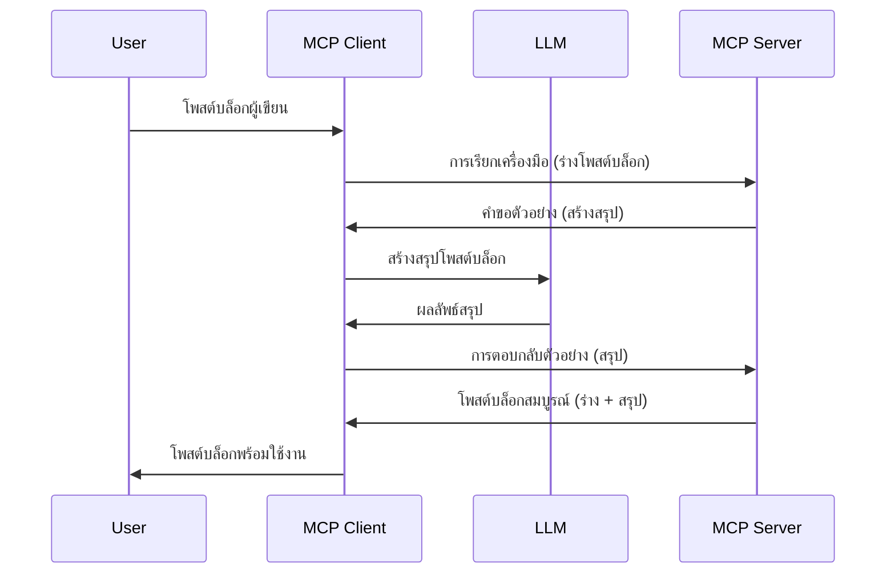

> [เลิกใช้: ตัวอย่างรุ่นปล่อย 2026-07-28](https://blog.modelcontextprotocol.io/posts/2026-07-28-release-candidate/)

# การ Sampling - มอบหมายฟีเจอร์ให้ Client

> **ประกาศเลิกใช้:** MCP สเปคตัวอย่างรุ่นปล่อย `2026-07-28` ระบุว่า Sampling ถูกเลิกใช้เพื่อสนับสนุนการรวมโดยตรงกับ API ผู้ให้บริการ LLM การ Sampling ยังคงใช้งานได้ใน `2025-11-25` และอย่างน้อยหนึ่งปีหลังจากประกาศเลิกใช้ทางการ ดังนั้นทุกอย่างในบทเรียนนี้ยังคงถูกต้อง — แต่การออกแบบเซิร์ฟเวอร์ใหม่ควรประเมินรูปแบบการแทนที่ ดู [มีอะไรเปลี่ยนแปลงใน MCP: ตัวอย่างรุ่นปล่อย 2026-07-28](../../01-CoreConcepts/mcp-2026-07-28-release-candidate.md)

บางครั้งคุณต้องการให้ MCP Client และ MCP Server ทำงานร่วมกันเพื่อบรรลุเป้าหมายร่วมกัน อาจมีกรณีที่ Server ต้องการความช่วยเหลือจาก LLM ที่อยู่บน client สำหรับสถานการณ์นี้ Sampling คือสิ่งที่คุณควรใช้

มาสำรวจกรณีการใช้งานและวิธีสร้างโซลูชันที่เกี่ยวข้องกับการ sampling กัน

## ภาพรวม

ในบทเรียนนี้ เราจะเน้นอธิบายว่าเมื่อไหร่และที่ไหนควรใช้ Sampling และวิธีการตั้งค่ามัน

## วัตถุประสงค์การเรียนรู้

ในบทนี้ เราจะ:

- อธิบายว่า Sampling คืออะไรและควรใช้เมื่อใด
- แสดงวิธีตั้งค่า Sampling ใน MCP
- ให้ตัวอย่างการใช้งาน Sampling จริง

## Sampling คืออะไรและทำไมต้องใช้มัน?

Sampling เป็นฟีเจอร์ขั้นสูงที่ทำงานตามวิธีดังนี้:



### คำขอ Sampling

ตอนนี้เรามีภาพรวมระดับสูงของสถานการณ์ที่สมเหตุสมผลแล้ว มาพูดถึงคำขอ sampling ที่ server ส่งกลับไปยัง client กัน นี่คือตัวอย่างคำขอรูปแบบ JSON-RPC:

```json
{
  "jsonrpc": "2.0",
  "id": 1,
  "method": "sampling/createMessage",
  "params": {
    "messages": [
      {
        "role": "user",
        "content": {
          "type": "text",
          "text": "Create a blog post summary of the following blog post: <BLOG POST>"
        }
      }
    ],
    "modelPreferences": {
      "hints": [
        {
          "name": "claude-3-sonnet"
        }
      ],
      "intelligencePriority": 0.8,
      "speedPriority": 0.5
    },
    "systemPrompt": "You are a helpful assistant.",
    "maxTokens": 100
  }
}
```

มีบางอย่างที่น่าสนใจในนี้:

- ตัว prompt ภายใต้ content -> text คือคำสั่งที่ให้ LLM สรุปเนื้อหาโพสต์บล็อก

- **modelPreferences** ส่วนนี้คือความชอบ คำแนะนำในการตั้งค่าที่ใช้กับ LLM ผู้ใช้สามารถเลือกใช้คำแนะนำเหล่านี้หรือแก้ไขได้ กรณีนี้มีคำแนะนำเรื่องโมเดลที่ใช้ และลำดับความสำคัญของความเร็วและความฉลาด
- **systemPrompt** คือ prompt ระบบปกติที่ให้บุคลิกแก่ LLM และมีคำแนะนำต่างๆ
- **maxTokens** คุณสมบัติที่ใช้ระบุจำนวนโทเค็นที่แนะนำสำหรับงานนี้

### การตอบ Sampling

การตอบนี้คือสิ่งที่ MCP Client ส่งกลับไปยัง MCP Server หลังจาก client เรียกใช้ LLM รอคำตอบ แล้วสร้างข้อความนี้ขึ้นมา นี่คือตัวอย่างใน JSON-RPC:

```json
{
  "jsonrpc": "2.0",
  "id": 1,
  "result": {
    "role": "assistant",
    "content": {
      "type": "text",
      "text": "Here's your abstract <ABSTRACT>"
    },
    "model": "gpt-5",
    "stopReason": "endTurn"
  }
}
```

สังเกตการตอบกลับเป็นบทสรุปของโพสต์บล็อกตามที่ขอ นอกจากนี้สังเกตว่า `model` ที่ใช้ไม่ใช่ที่เราเลือก แต่เป็น "gpt-5" แทน "claude-3-sonnet" เพื่อแสดงว่าผู้ใช้สามารถเปลี่ยนใจได้และคำขอ sampling ของคุณเป็นเพียงคำแนะนำ

ตอนนี้เราเข้าใจลำดับขั้นตอนหลักและงานที่มีประโยชน์ เช่น "การสร้างโพสต์บล็อก + บทสรุป" มาดูกันว่าต้องทำอะไรบ้างเพื่อให้มันทำงานได้

### ประเภทข้อความ

ข้อความ Sampling ไม่จำกัดแค่ข้อความแต่คุณยังสามารถส่งรูปภาพและเสียงได้ นี่คือตัวอย่าง JSON-RPC ที่แตกต่างกัน:

**ข้อความ**

```json
{
  "type": "text",
  "text": "The message content"
}
```

**เนื้อหารูปภาพ**

```json
{
  "type": "image",
  "data": "base64-encoded-image-data",
  "mimeType": "image/jpeg"
}
```

**เนื้อหาเสียง**

```json
{
  "type": "audio",
  "data": "base64-encoded-audio-data",
  "mimeType": "audio/wav"
}
```

> NOTE: สำหรับข้อมูลเพิ่มเติมเกี่ยวกับ Sampling ดูที่ [เอกสารอย่างเป็นทางการ](https://modelcontextprotocol.io/specification/2025-11-25/client/sampling)

## วิธีตั้งค่า Sampling ใน Client

> หมายเหตุ: ถ้าคุณสร้างแค่ server คุณไม่ต้องทำอะไรมากที่นี่

ใน client คุณต้องกำหนดคุณสมบัติต่อไปนี้ดังนี้:

```json
{
  "capabilities": {
    "sampling": {}
  }
}
```

จากนั้นจะถูกดึงขึ้นเมื่อ client ที่คุณเลือกเริ่มการเชื่อมต่อกับ server

## ตัวอย่างการทำ Sampling - สร้างโพสต์บล็อก

มาร่วมเขียนโค้ด sampling server กัน เราจะต้องทำดังนี้:

1. สร้างเครื่องมือบน Server
1. เครื่องมือนั้นควรสร้างคำขอ sampling
1. เครื่องมือควรรอคำตอบคำขอ sampling จาก client
1. จากนั้นเครื่องมือควรสร้างผลลัพธ์

มาดูโค้ดทีละขั้นตอน:

### -1- สร้างเครื่องมือ

**python**

```python
@mcp.tool()
async def create_blog(title: str, content: str, ctx: Context[ServerSession, None]) -> str:
    """Create a blog post and generate a summary"""

```

### -2- สร้างคำขอ sampling

ขยายเครื่องมือของคุณด้วยโค้ดต่อไปนี้:

**python**

```python
post = BlogPost(
        id=len(posts) + 1,
        title=title,
        content=content,
        abstract=""
    )

prompt = f"Create an abstract of the following blog post: title: {title} and draft: {content} "

result = await ctx.session.create_message(
        messages=[
            SamplingMessage(
                role="user",
                content=TextContent(type="text", text=prompt),
            )
        ],
        max_tokens=100,
)

```

### -3- รอคำตอบและส่งคำตอบกลับ

**python**

```python
post.abstract = result.content.text

posts.append(post)

# ส่งคืนผลิตภัณฑ์ที่สมบูรณ์
return json.dumps({
    "id": post.title,
    "abstract": post.abstract
})
```

### -4- โค้ดเต็ม

**python**

```python
from starlette.applications import Starlette
from starlette.routing import Mount, Host

from mcp.server.fastmcp import Context, FastMCP

from mcp.server.session import ServerSession
from mcp.types import SamplingMessage, TextContent

import json


from uuid import uuid4
from typing import List
from pydantic import BaseModel


mcp = FastMCP("Blog post generator")

# app = FastAPI()

posts = []

class BlogPost(BaseModel):
    id: int
    title: str
    content: str
    abstract: str

posts: List[BlogPost] = []

@mcp.tool()
async def create_blog(title: str, content: str, ctx: Context[ServerSession, None]) -> str:
    """Create a blog post and generate a summary"""

    post = BlogPost(
        id=len(posts) + 1,
        title=title,
        content=content,
        abstract=""
    )

    prompt = f"Create an abstract of the following blog post: title: {title} and draft: {content} "

    result = await ctx.session.create_message(
        messages=[
            SamplingMessage(
                role="user",
                content=TextContent(type="text", text=prompt),
            )
        ],
        max_tokens=100,
    )

    post.abstract = result.content.text

    posts.append(post)

    # ส่งคืนโพสต์บล็อกฉบับสมบูรณ์
    return json.dumps({
        "id": post.title,
        "abstract": post.abstract
    })

if __name__ == "__main__":
    print("Starting server...")
    # mcp.run()
    mcp.run(transport="streamable-http")

# รันแอปด้วย: python server.py
```

### -5- การทดสอบใน Visual Studio Code

ในการทดสอบใน Visual Studio Code ทำดังนี้:

1. เริ่ม server ใน terminal
1. เพิ่มลงใน *mcp.json* (และแน่ใจว่า server เริ่มทำงาน) เช่นนี้:

   ```json
   "servers": {
      "blog-server": {
        "type": "http",
        "url": "http://localhost:8000/mcp"
      }
   }
   ```

1. พิมพ์ prompt:

   ```text
   create a blog post named "Where Python comes from", the content is "Python is actually named after Monty Python Flying Circus"
   ```

1. อนุญาตให้ sampling ทำงาน ครั้งแรกที่ทดสอบคุณจะเห็นไดอะล็อกเพิ่มเติมที่ต้องยอมรับ หลังจากนั้นจะเป็นไดอะล็อกปกติให้คุณเรียกใช้เครื่องมือ

1. ตรวจสอบผลลัพธ์ คุณจะเห็นผลลัพธ์ทั้งแบบแสดงผลสวยงามใน GitHub Copilot Chat และสามารถดู JSON ตอบกลับดิบได้

**โบนัส** Visual Studio Code สนับสนุน sampling อย่างดี คุณสามารถตั้งค่าการเข้าถึง Sampling บน server ที่ติดตั้งโดยไปที่:

1. ไปที่ส่วนส่วนขยาย
1. เลือกไอคอนฟันเฟืองของ server ที่ติดตั้งในส่วน "MCP SERVERS - INSTALLED"
1 เลือก "Configure Model Access" ที่นี่คุณสามารถเลือกโมเดลที่ GitHub Copilot ใช้สำหรับ sampling และดูคำขอ sampling ล่าสุดโดยเลือก "Show Sampling requests"

## การบ้าน

ในการบ้านนี้ คุณจะสร้าง Sampling แบบแตกต่างเล็กน้อย คือ การรวม Sampling ที่สนับสนุนการสร้างคำอธิบายผลิตภัณฑ์ นี่คือสถานการณ์ของคุณ:

**สถานการณ์**: พนักงานหลังบ้านในอีคอมเมิร์ซ ต้องการความช่วยเหลือ เพราะใช้เวลานานเกินไปในการสร้างคำอธิบายผลิตภัณฑ์ ดังนั้นคุณต้องสร้างโซลูชันที่เรียกใช้เครื่องมือ "create_product" พร้อมกับ "title" และ "keywords" เป็นอาร์กิวเมนต์และควรสร้างสินค้าทั้งหมดรวมถึงฟิลด์ "description" ที่ควรมีข้อมูลเติมโดย LLM บน client

TIP: ใช้สิ่งที่คุณเรียนรู้ก่อนหน้านี้ในการสร้าง server และเครื่องมือโดยใช้คำขอ sampling นี้

## โซลูชัน

[โซลูชัน](./solution/README.md)

## สรุปประเด็นสำคัญ

Sampling เป็นฟีเจอร์ทรงพลังที่ช่วยให้ server มอบหมายงานให้ client เมื่อมันต้องการความช่วยเหลือจาก LLM

## ต่อไป

- [บทที่ 4 - การใช้งานเชิงปฏิบัติ](../../04-PracticalImplementation/README.md)

---

<!-- CO-OP TRANSLATOR DISCLAIMER START -->
**ปฏิเสธความรับผิดชอบ**:
เอกสารนี้ได้รับการแปลโดยใช้บริการแปลภาษา AI [Co-op Translator](https://github.com/Azure/co-op-translator) ขณะที่เราพยายามให้ความถูกต้อง โปรดทราบว่าการแปลโดยอัตโนมัติอาจมีข้อผิดพลาดหรือความไม่ถูกต้อง เอกสารต้นฉบับในภาษาต้นทางควรถูกพิจารณาเป็นแหล่งข้อมูลที่เชื่อถือได้ สำหรับข้อมูลที่สำคัญ แนะนำให้ใช้การแปลโดยมนุษย์มืออาชีพ เราไม่รับผิดชอบต่อความเข้าใจผิดหรือการตีความที่ผิดพลาดที่เกิดขึ้นจากการใช้การแปลนี้
<!-- CO-OP TRANSLATOR DISCLAIMER END -->