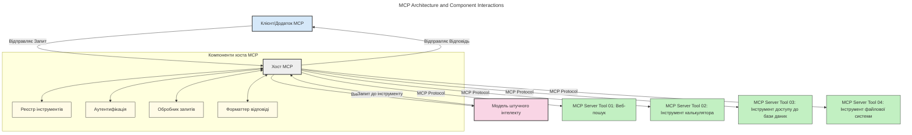
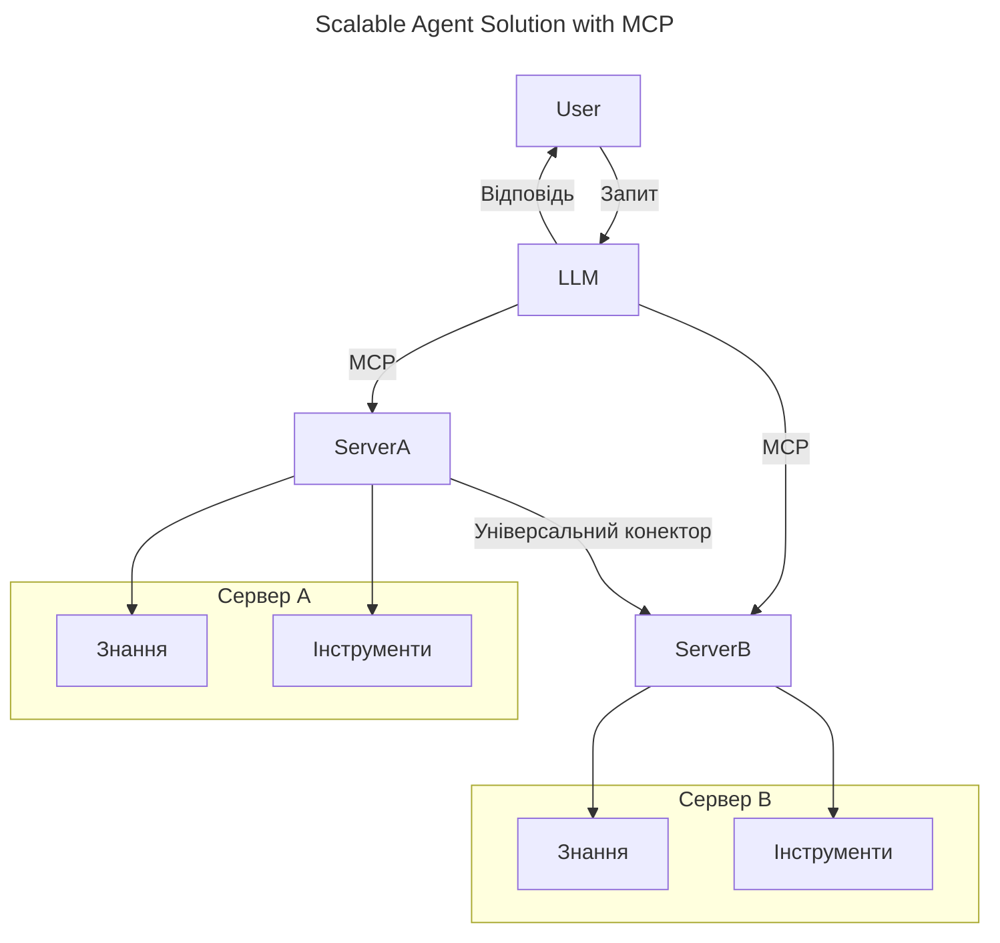
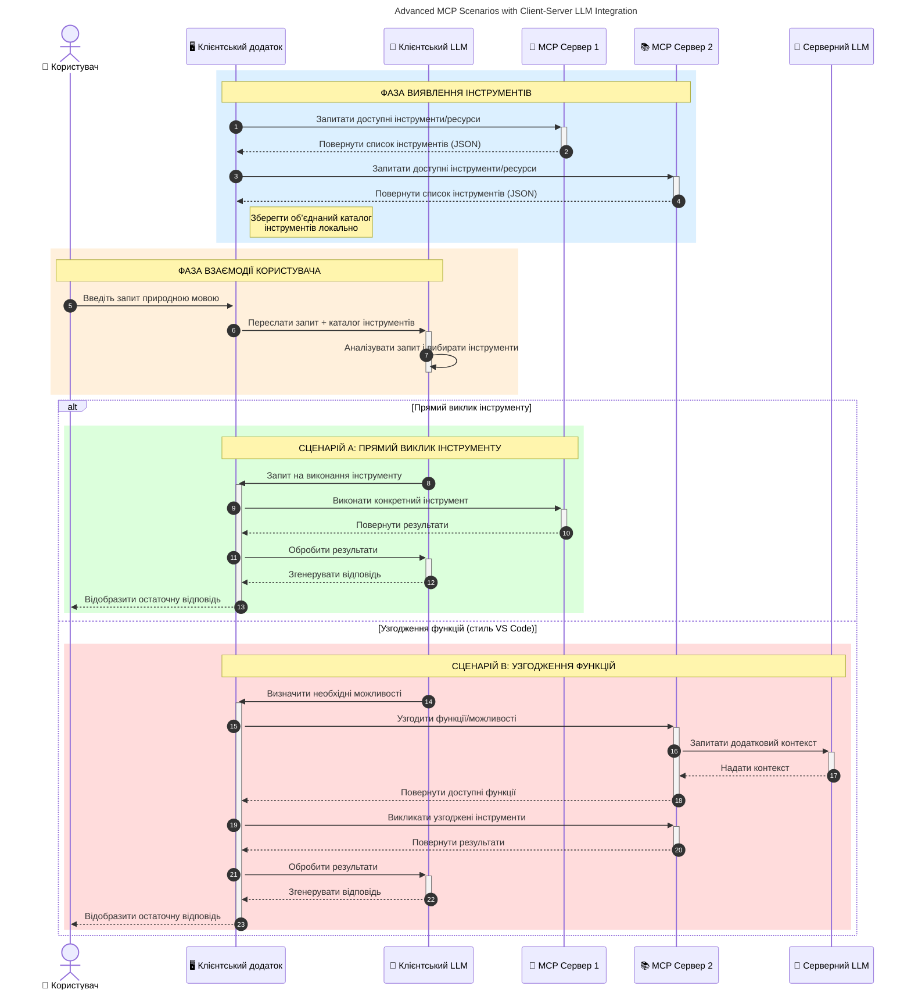

# Вступ до Протоколу Контексту Моделі (MCP): Чому це важливо для масштабованих AI-застосунків

_(Натисніть на зображення вище, щоб переглянути відео цього уроку)_

Генеративні AI-застосунки — це великий крок уперед, оскільки вони часто дозволяють користувачу взаємодіяти з програмою за допомогою природних мовних підказок. Проте, коли в такі застосунки інвестується більше часу та ресурсів, потрібно впевнитися, що ви можете легко інтегрувати функціональність і ресурси так, щоб це було легко розширювати, щоб ваш застосунок міг підтримувати більше однієї використаної моделі та обробляти різні складнощі моделей. Грубо кажучи, будувати генеративні AI-застосунки спочатку просто, але з їх зростанням і ускладненням потрібно почати визначати архітектуру і, ймовірно, покладатися на стандарт для забезпечення побудови ваших застосунків послідовним способом. Саме тут MCP допомагає організувати процес і забезпечує стандарт.

---

## **🔍 Що таке Протокол Контексту Моделі (MCP)?**

**Протокол Контексту Моделі (MCP)** – це **відкритий стандартизований інтерфейс**, який дозволяє великим мовним моделям (LLM) безперешкодно взаємодіяти з зовнішніми інструментами, API та джерелами даних. Він забезпечує єдину архітектуру для розширення функціональності AI-моделей за межі їхніх навчальних даних, створюючи більш розумні, масштабовані та чутливі AI-системи.

---

## **🎯 Чому стандартизація в AI важлива**

Оскільки генеративні AI-застосунки стають складнішими, необхідно впроваджувати стандарти, які забезпечують **масштабованість, розширюваність, підтримуваність** і **запобігання прив’язці до постачальника**. MCP відповідає цим потребам, шляхом:

- Уніфікації інтеграцій моделей з інструментами
- Зменшення крихких одноразових кастомних рішень
- Дозволу кільком моделям від різних постачальників співіснувати в межах однієї екосистеми

**Примітка:** Хоча MCP позиціонує себе як відкритий стандарт, немає планів стандартизувати MCP через існуючі органи стандартизації, такі як IEEE, IETF, W3C, ISO чи будь-які інші.

---

## **📚 Навчальні цілі**

До кінця цієї статті ви зможете:

- Визначити **Протокол Контексту Моделі (MCP)** та його сфери застосування
- Зрозуміти, як MCP стандартизує комунікацію між моделями та інструментами
- Виявити основні компоненти архітектури MCP
- Дослідити реальні приклади застосування MCP у корпоративному та розробницькому середовищах

---

## **💡 Чому Протокол Контексту Моделі (MCP) змінює правила гри**

### **🔗 MCP вирішує проблему фрагментації в AI-взаємодіях**

До MCP інтеграція моделей з інструментами вимагала:

- Індивідуального коду для кожної пари інструмент-модель
- Нестандартних API для кожного постачальника
- Частих збоїв через оновлення
- Поганої масштабованості при збільшенні кількості інструментів

### **✅ Переваги стандартизації MCP**

| **Перевага**            | **Опис**                                                                       |
|------------------------|--------------------------------------------------------------------------------|
| Взаємодія               | LLM безперешкодно працюють з інструментами від різних постачальників           |
| Узгодженість            | Однакова поведінка на різних платформах і інструментах                         |
| Повторне використання   | Інструменти, створені один раз, можуть використовуватися в різних проєктах і системах |
| Прискорена розробка     | Зменшення часу розробки завдяки використанню стандартизованих інтерфейсів plug-and-play |

---

## **🧱 Огляд архітектури MCP на високому рівні**

MCP слідує **клієнт-серверній моделі**, де:

- **MCP Host** запускає AI-моделі
- **MCP Client** ініціює запити
- **MCP Server** надає контекст, інструменти та можливості

### **Ключові компоненти:**

- **Ресурси** – Статичні або динамічні дані для моделей  
- **Підказки** – Попередньо визначені робочі потоки для керованої генерації  
- **Інструменти** – Виконувані функції, такі як пошук, обчислення  
- **Вибірка** – Агентна поведінка через рекурсивні взаємодії (вилучено у релізі-кандидаті `2026-07-28`)
- **Виклик** – Запити, ініційовані сервером для введення користувача
- **Корені** – Межі файлової системи для контролю доступу серверу (вилучено у релізі-кандидаті `2026-07-28`)

### **Архітектура протоколу:**

MCP використовує двошарову архітектуру:
- **Шар даних**: Комунікація на базі JSON-RPC 2.0 з керуванням життєвим циклом і примітивами
- **Транспортний шар**: STDIO (локальний) та Streamable HTTP з SSE (віддалений) канали зв’язку

---

## Як працюють сервери MCP

Сервери MCP працюють таким чином:

- **Потік запиту**:
    1. Запит ініціюється кінцевим користувачем або програмним забезпеченням від його імені.
    2. **MCP Client** надсилає запит до **MCP Host**, який управляє часом виконання AI-моделі.
    3. **AI-модель** отримує підказку користувача і може запросити доступ до зовнішніх інструментів або даних через один або кілька викликів інструментів.
    4. Комунікацію здійснює не сама модель, а **MCP Host**, використовуючи стандартизований протокол з відповідними **MCP Server(ами)**.
- **Функціональність MCP Host**:
    - **Реєстр інструментів**: Підтримує каталог доступних інструментів і їхніх можливостей.
    - **Аутентифікація**: Перевіряє дозволи на доступ до інструментів.
    - **Обробник запитів**: Обробляє вхідні запити інструментів від моделі.
    - **Форматувач відповідей**: Структурує вивід інструментів у форматі, зрозумілому моделі.
- **Виконання на MCP Server**:
    - **MCP Host** направляє виклики інструментів одному або кільком **MCP Servers**, кожний з яких надає спеціалізовані функції (наприклад, пошук, обчислення, запити до бази даних).
    - **MCP Servers** виконують відповідні операції та повертають результати **MCP Host** у послідовному форматі.
    - **MCP Host** форматує та пересилає ці результати до **AI-моделі**.
- **Завершення відповіді**:
    - **AI-модель** інтегрує вивід інструментів у фінальну відповідь.
    - **MCP Host** надсилає цю відповідь назад до **MCP Client**, який доставляє її кінцевому користувачу або викликачу.
    

## 👨‍💻 Як побудувати MCP Server (з прикладами)

Сервери MCP дозволяють розширювати можливості LLM, надаючи дані та функціонал.

Готові спробувати? Ось SDK для різних мов та стеків з прикладами створення простих серверів MCP:

- **Python SDK**: https://github.com/modelcontextprotocol/python-sdk

- **TypeScript SDK**: https://github.com/modelcontextprotocol/typescript-sdk

- **Java SDK**: https://github.com/modelcontextprotocol/java-sdk

- **C#/.NET SDK**: https://github.com/modelcontextprotocol/csharp-sdk

## 🌍 Реальні випадки використання MCP

MCP розширює можливості AI у багатьох застосуваннях:

| **Застосунок**                 | **Опис**                                                                      |
|-------------------------------|-------------------------------------------------------------------------------|
| Інтеграція корпоративних даних | Підключення LLM до баз даних, CRM або внутрішніх інструментів                   |
| Агентні AI-системи              | Надання автономним агентам доступу до інструментів і робочих процесів прийняття рішень |
| Мультимодальні застосунки       | Поєднання текстових, образних та аудіоінструментів в одному уніфікованому AI-застосунку |
| Інтеграція даних у реальному часі | Подача живих даних у AI-взаємодії для більш точних та актуальних результатів    |

### 🧠 MCP = Універсальний стандарт для AI-взаємодій

Протокол Контексту Моделі (MCP) виступає як універсальний стандарт для AI-взаємодій, подібно до того, як USB-C стандартизував фізичні з’єднання для пристроїв. У світі AI MCP забезпечує єдиний інтерфейс, що дозволяє моделям (клієнтам) безперешкодно інтегруватись із зовнішніми інструментами та постачальниками даних (серверами). Це усуває необхідність у різних, індивідуальних протоколах для кожного API чи джерела даних.

В рамках MCP інструмент, сумісний з MCP (звана MCP сервером), дотримується уніфікованого стандарту. Ці сервери можуть перелічувати інструменти або дії, які вони пропонують, і виконувати їх, коли AI-агент запитує. Платформи AI-агентів, що підтримують MCP, можуть виявляти доступні інструменти з серверів і викликати їх через цей стандартний протокол.

### 💡 Сприяє доступу до знань

Окрім надання інструментів, MCP також полегшує доступ до знань. Він дає можливість застосункам надавати контекст великим мовним моделям (LLM), підключаючи їх до різних джерел даних. Наприклад, MCP сервер може представляти сховище документів компанії, дозволяючи агентам отримувати відповідну інформацію за потреби. Інший сервер може обробляти певні дії, як-от надсилання електронних листів або оновлення записів. З точки зору агента, це просто інструменти, які він може використовувати — деякі інструменти повертають дані (контекст знань), інші виконують дії. MCP ефективно управляє обома.

Агент, що підключається до MCP сервера, автоматично дізнається про доступні можливості сервера і доступні дані у стандартному форматі. Ця стандартизація дозволяє динамічну доступність інструментів. Наприклад, додавання нового MCP сервера до системи агента робить його функції негайно придатними до використання без додаткової кастомізації інструкцій агента.

Така спрощена інтеграція відповідає потоку, зображеному на наступній схемі, де сервери надають як інструменти, так і знання, забезпечуючи безперебійне співробітництво між системами.

### 👉 Приклад: Масштабоване агентське рішення

Універсальний конектор дозволяє MCP серверам спілкуватися та ділитися можливостями один з одним, дозволяючи ServerA делегувати задачі ServerB або отримувати доступ до його інструментів та знань. Це федерація інструментів і даних між серверами, підтримуючи масштабовані й модульні архітектури агентів. Оскільки MCP стандартизує експозицію інструментів, агенти можуть динамічно визначати доступні інструменти та маршрутизувати запити між серверами без жорстко закодованих інтеграцій.

Федерація інструментів і знань: Інструменти та дані можуть бути доступні між серверами, сприяючи більш масштабованим і модульним агентним архітектурам.

### 🔄 Розширені сценарії MCP з інтеграцією LLM на стороні клієнта

Окрім базової архітектури MCP, існують розширені сценарії, в яких і клієнт, і сервер містять LLM, що дозволяє більш складні взаємодії. На наступному малюнку **Клієнтський застосунок** може бути IDE з рядом MCP інструментів, доступних для користування LLM:

## 🔐 Практичні переваги MCP

Ось практичні переваги використання MCP:

- **Актуальність**: Моделі можуть отримувати доступ до оновленої інформації за межами навчальних даних
- **Розширення можливостей**: Моделі можуть використовувати спеціалізовані інструменти для завдань, для яких вони не були навчені
- **Зменшення галюцинацій**: Зовнішні джерела даних забезпечують фактичну основу
- **Конфіденційність**: Чутливі дані можуть залишатися в безпечному середовищі замість включення в підказки

## 📌 Основні висновки

Основні висновки щодо використання MCP:

- **MCP** стандартизує спосіб взаємодії AI-моделей з інструментами та даними
- Сприяє **розширюваності, послідовності та взаємодії**
- MCP допомагає **скорочувати час розробки, покращувати надійність і розширювати можливості моделей**
- Клієнт-серверна архітектура **дозволяє гнучкі, розширювані AI-застосунки**

## 🧠 Вправа

Подумайте про AI-застосунок, який ви хотіли б створити.

- Які **зовнішні інструменти або дані** могли б розширити його можливості?
- Як MCP може зробити інтеграцію **простішою та надійнішою?**

## Додаткові ресурси

- [MCP GitHub Репозиторій](https://github.com/modelcontextprotocol)

## Що далі

Далі: [Розділ 1: Основні поняття](../01-CoreConcepts/README.md)

---

<!-- CO-OP TRANSLATOR DISCLAIMER START -->
**Відмова від відповідальності**:
Цей документ було перекладено за допомогою сервісу штучного інтелекту для перекладу [Co-op Translator](https://github.com/Azure/co-op-translator). Хоча ми прагнемо до точності, будь ласка, майте на увазі, що автоматичні переклади можуть містити помилки або неточності. Оригінальний документ рідною мовою слід вважати авторитетним джерелом. Для критично важливої інформації рекомендується професійний людський переклад. Ми не несемо відповідальності за будь-які непорозуміння або неправильні тлумачення, що виникли внаслідок використання цього перекладу.
<!-- CO-OP TRANSLATOR DISCLAIMER END -->