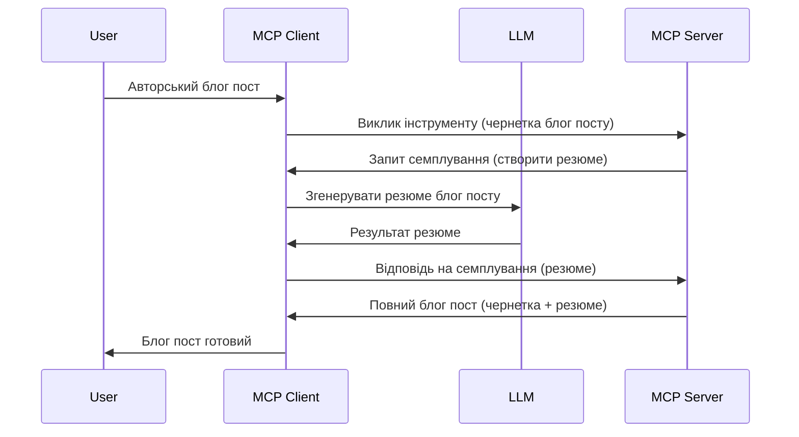

> [ЗАРЕЗЕРВОВАНО: 2026-07-28 RELEASE CANDIDATE](https://blog.modelcontextprotocol.io/posts/2026-07-28-release-candidate/)

# Sampling — делегування функцій клієнту

> **Повідомлення про застарілість:** кандидат у реліз специфікації MCP `2026-07-28` позначає Sampling як застарілий на користь прямої інтеграції з API провайдерів LLM. Sampling продовжує працювати у версії `2025-11-25` та принаймні рік після офіційної застарілості, тож все, що наведено у цьому уроці, лишається дійсним — але нові серверні архітектури мають оцінити патерн заміни. Докладніше дивіться у [Що змінюється в MCP: кандидат у реліз 2026-07-28](../../01-CoreConcepts/mcp-2026-07-28-release-candidate.md).

Іноді потрібно, щоб MCP Клієнт і MCP Сервер співпрацювали для досягнення спільної мети. Можливо, у вас є випадок, коли сервер потребує допомоги LLM, який розміщений на клієнті. Для такої ситуації слід використовувати sampling.

Давайте розглянемо кілька випадків використання і як побудувати рішення з sampling.

## Огляд

У цьому уроці ми зосередимося на поясненні, коли й де використовувати Sampling і як його налаштувати.

## Цілі навчання

У цій главі ми:

- Пояснимо, що таке Sampling і коли його застосовувати.
- Покажемо, як налаштувати Sampling у MCP.
- Наведемо приклади практичного використання Sampling.

## Що таке Sampling і чому його використовувати?

Sampling — це розширена функція, яка працює таким чином:



### Запит на Sampling

Отже, тепер ми маємо загальне уявлення про достовірний сценарій, поговоримо про запит на sampling, який сервер надсилає клієнту. Ось як такий запит може виглядати у форматі JSON-RPC:

```json
{
  "jsonrpc": "2.0",
  "id": 1,
  "method": "sampling/createMessage",
  "params": {
    "messages": [
      {
        "role": "user",
        "content": {
          "type": "text",
          "text": "Create a blog post summary of the following blog post: <BLOG POST>"
        }
      }
    ],
    "modelPreferences": {
      "hints": [
        {
          "name": "claude-3-sonnet"
        }
      ],
      "intelligencePriority": 0.8,
      "speedPriority": 0.5
    },
    "systemPrompt": "You are a helpful assistant.",
    "maxTokens": 100
  }
}
```

Тут варто звернути увагу на кілька моментів:

- Prompt, у контенті -> text, це наш запит, інструкція для LLM підсумувати вміст блогу.

- **modelPreferences**. Цей розділ — це просто побажання, рекомендація щодо конфігурації LLM. Користувач може вибрати, чи дотримуватися цих рекомендацій, або змінити їх. Тут наведені рекомендації щодо моделі, пріоритету швидкості і розумності.
- **systemPrompt**, це звичайний системний підказ, що задає особистість для вашого LLM і містить інструкції.
- **maxTokens**, це властивість, яка вказує, скільки токенів рекомендовано використати для цього завдання.

### Відповідь на Sampling

Ця відповідь — те, що MCP Клієнт надсилає назад MCP Серверу як результат виклику LLM клієнтом: чекає на відповідь і формує це повідомлення. Ось як це може виглядати у JSON-RPC:

```json
{
  "jsonrpc": "2.0",
  "id": 1,
  "result": {
    "role": "assistant",
    "content": {
      "type": "text",
      "text": "Here's your abstract <ABSTRACT>"
    },
    "model": "gpt-5",
    "stopReason": "endTurn"
  }
}
```

Зверніть увагу, що відповідь є абстрактом блогу як ми і просили. Також зауважте, що використана модель не та, що ми замовляли, а "gpt-5" замість "claude-3-sonnet". Це ілюструє, що користувач може змінювати вибір, і ваш запит на sampling — це рекомендація.

Добре, тепер, коли ми розуміємо основний потік і корисне завдання "створення блогу + абстракт", давайте подивимося, що потрібно зробити, щоб це запрацювало.

### Типи повідомлень

Повідомлення sampling не обмежуються лише текстом, можна також надсилати зображення й аудіо. Ось як відрізняється JSON-RPC:

**Текст**

```json
{
  "type": "text",
  "text": "The message content"
}
```

**Зображення**

```json
{
  "type": "image",
  "data": "base64-encoded-image-data",
  "mimeType": "image/jpeg"
}
```

**Аудіо**

```json
{
  "type": "audio",
  "data": "base64-encoded-audio-data",
  "mimeType": "audio/wav"
}
```

> ПРИМІТКА: більш детальну інформацію про Sampling дивіться в [офіційній документації](https://modelcontextprotocol.io/specification/2025-11-25/client/sampling)

## Як налаштувати Sampling у клієнті

> Примітка: якщо ви створюєте лише сервер, тут робити багато не потрібно.

У клієнті потрібно вказати таку функцію:

```json
{
  "capabilities": {
    "sampling": {}
  }
}
```

Це буде враховано, коли обраний клієнт ініціалізуватиметься із сервером.

## Приклад використання Sampling — створення блогу

Давайте разом напишемо sampling сервер, нам потрібно виконати таке:

1. Створити інструмент на сервері.
1. Цей інструмент має створювати запит на sampling.
1. Інструмент має чекати на відповідь клієнта на запит sampling.
1. Потім має бути сформований результат інструменту.

Розглянемо код крок за кроком:

### -1- Створення інструменту

**python**

```python
@mcp.tool()
async def create_blog(title: str, content: str, ctx: Context[ServerSession, None]) -> str:
    """Create a blog post and generate a summary"""

```

### -2- Створення запиту на sampling

Розширте ваш інструмент таким кодом:

**python**

```python
post = BlogPost(
        id=len(posts) + 1,
        title=title,
        content=content,
        abstract=""
    )

prompt = f"Create an abstract of the following blog post: title: {title} and draft: {content} "

result = await ctx.session.create_message(
        messages=[
            SamplingMessage(
                role="user",
                content=TextContent(type="text", text=prompt),
            )
        ],
        max_tokens=100,
)

```

### -3- Очікуємо відповідь і повертаємо результат

**python**

```python
post.abstract = result.content.text

posts.append(post)

# повернути повний продукт
return json.dumps({
    "id": post.title,
    "abstract": post.abstract
})
```

### -4- Повний код

**python**

```python
from starlette.applications import Starlette
from starlette.routing import Mount, Host

from mcp.server.fastmcp import Context, FastMCP

from mcp.server.session import ServerSession
from mcp.types import SamplingMessage, TextContent

import json


from uuid import uuid4
from typing import List
from pydantic import BaseModel


mcp = FastMCP("Blog post generator")

# app = FastAPI()

posts = []

class BlogPost(BaseModel):
    id: int
    title: str
    content: str
    abstract: str

posts: List[BlogPost] = []

@mcp.tool()
async def create_blog(title: str, content: str, ctx: Context[ServerSession, None]) -> str:
    """Create a blog post and generate a summary"""

    post = BlogPost(
        id=len(posts) + 1,
        title=title,
        content=content,
        abstract=""
    )

    prompt = f"Create an abstract of the following blog post: title: {title} and draft: {content} "

    result = await ctx.session.create_message(
        messages=[
            SamplingMessage(
                role="user",
                content=TextContent(type="text", text=prompt),
            )
        ],
        max_tokens=100,
    )

    post.abstract = result.content.text

    posts.append(post)

    # повернути повний блог-пост
    return json.dumps({
        "id": post.title,
        "abstract": post.abstract
    })

if __name__ == "__main__":
    print("Starting server...")
    # mcp.run()
    mcp.run(transport="streamable-http")

# запустити додаток командою: python server.py
```

### -5- Тестування у Visual Studio Code

Щоб протестувати це у Visual Studio Code, зробіть так:

1. Запустіть сервер у терміналі
1. Додайте його в *mcp.json* (і переконайтеся, що він запущений), наприклад так:

   ```json
   "servers": {
      "blog-server": {
        "type": "http",
        "url": "http://localhost:8000/mcp"
      }
   }
   ```

1. Введіть підказку:

   ```text
   create a blog post named "Where Python comes from", the content is "Python is actually named after Monty Python Flying Circus"
   ```

1. Дайте дозвіл на sampling. При першому тесті буде показано додатковий діалог, який потрібно прийняти, потім з’явиться звичайний діалог для запуску інструменту.

1. Перегляньте результати. Ви побачите результати у зручному вигляді у GitHub Copilot Chat, а також можете переглянути сирий JSON-відповідь.

**Бонус**. Засоби Visual Studio Code чудово підтримують sampling. Ви можете налаштувати доступ до Sampling на встановленому сервері так:

1. Перейдіть до розділу розширень.
1. Оберіть значок шестерні для вашого встановленого сервера у розділі "MCP SERVERS - INSTALLED".
1. Оберіть "Configure Model Access", тут можна вибрати, які моделі GitHub Copilot може використовувати для sampling. Також можна переглянути всі останні запити sampling, обравши "Show Sampling requests".

## Завдання

У цьому завданні ви створите дещо інший Sampling — інтеграцію sampling, яка підтримує генерацію опису продукту. Ось ваш сценарій:

**Сценарій**: працівнику бек-офісу у сфері e-commerce потрібна допомога, оскільки створення описів товарів займає занадто багато часу. Вам необхідно створити рішення, у якому можна викликати інструмент "create_product" з аргументами "title" і "keywords", і він має створювати повний опис товару, де поле "description" заповнюється клієнтським LLM.

Підказка: використовуйте знання, здобуті раніше, щоб побудувати цей сервер і його інструмент із використанням запиту sampling.

## Рішення

[Рішення](./solution/README.md)

## Основні висновки

Sampling — це потужна функція, що дозволяє серверу делегувати завдання клієнту, коли потрібна допомога LLM.

## Що далі

- [Глава 4 — Практична реалізація](../../04-PracticalImplementation/README.md)

---

<!-- CO-OP TRANSLATOR DISCLAIMER START -->
**Відмова від відповідальності**:
Цей документ було перекладено за допомогою сервісу штучного інтелекту для перекладу [Co-op Translator](https://github.com/Azure/co-op-translator). Хоча ми прагнемо до точності, будь ласка, майте на увазі, що автоматичні переклади можуть містити помилки або неточності. Оригінальний документ рідною мовою слід вважати авторитетним джерелом. Для критично важливої інформації рекомендується професійний людський переклад. Ми не несемо відповідальності за будь-які непорозуміння або неправильні тлумачення, що виникли внаслідок використання цього перекладу.
<!-- CO-OP TRANSLATOR DISCLAIMER END -->