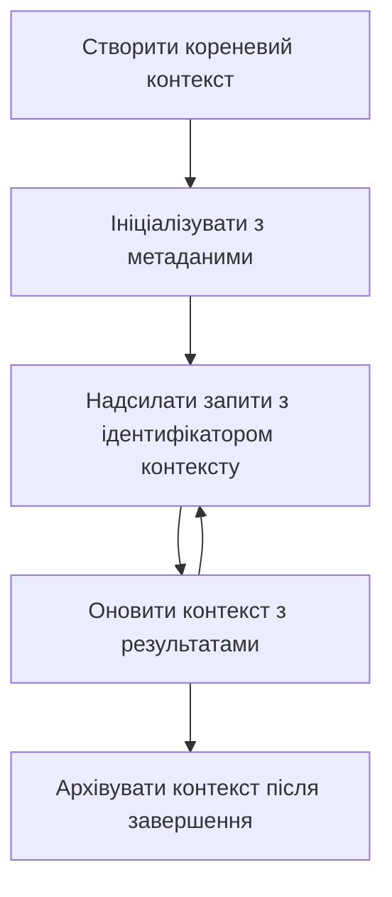

> [ВИДАЛЕНО: РЕЛІЗ-КАНДИДАТ 2026-07-28](https://blog.modelcontextprotocol.io/posts/2026-07-28-release-candidate/#roots-sampling-and-logging-are-deprecated)

# Кореневі контексти MCP

> **Повідомлення про видалення:** кандидат у реліз специфікації MCP `2026-07-28` позначає корені як застарілі на користь параметрів інструментів, URI ресурсів або конфігурації сервера. Корені продовжують працювати у версії `2025-11-25` та принаймні ще рік після будь-якого офіційного зняття з підтримки, тому все в цьому уроці залишається дійсним — але нові серверні рішення повинні оцінити модель заміщення. Дивіться [Що змінюється в MCP: Реліз-кандидат 2026-07-28](../../01-CoreConcepts/mcp-2026-07-28-release-candidate.md).

Кореневі контексти — це фундаментальна концепція в Model Context Protocol, яка забезпечує стійкий рівень для збереження історії розмови та спільного стану між кількома запитами та сесіями.

## Вступ

У цьому уроці ми розглянемо, як створювати, керувати та використовувати кореневі контексти в MCP.

## Цілі навчання

До кінця цього уроку ви зможете:

- Розуміти призначення та структуру кореневих контекстів
- Створювати та керувати кореневими контекстами за допомогою клієнтських бібліотек MCP
- Запроваджувати кореневі контексти у додатках .NET, Java, JavaScript та Python
- Використовувати кореневі контексти для багаторівневих розмов і управління станом
- Впроваджувати найкращі практики керування кореневими контекстами

## Розуміння кореневих контекстів

Кореневі контексти слугують контейнерами, які зберігають історію та стан для серії пов’язаних взаємодій. Вони забезпечують:

- **Збереження розмови**: підтримку послідовних багатокрокових розмов
- **Управління пам’яттю**: зберігання та отримання інформації між взаємодіями
- **Управління станом**: відстеження прогресу у складних робочих процесах
- **Спільний доступ до контексту**: дозвіл кільком клієнтам доступу до одного й того ж стану розмови

У MCP кореневі контексти мають такі ключові характеристики:

- Кожен кореневий контекст має унікальний ідентифікатор.
- Вони можуть містити історію розмов, налаштування користувача та інші метадані.
- Їх можна створювати, отримувати доступ і архівувати за потреби.
- Вони підтримують тонке керування доступом і дозволами.

## Життєвий цикл кореневого контексту



## Робота з кореневими контекстами

Ось приклад того, як створювати та керувати кореневими контекстами.

### Реалізація на C#

```csharp
// .NET Example: Root Context Management
using Microsoft.Mcp.Client;
using System;
using System.Threading.Tasks;
using System.Collections.Generic;

public class RootContextExample
{
    private readonly IMcpClient _client;
    private readonly IRootContextManager _contextManager;
    
    public RootContextExample(IMcpClient client, IRootContextManager contextManager)
    {
        _client = client;
        _contextManager = contextManager;
    }
    
    public async Task DemonstrateRootContextAsync()
    {
        // 1. Create a new root context
        var contextResult = await _contextManager.CreateRootContextAsync(new RootContextCreateOptions
        {
            Name = "Customer Support Session",
            Metadata = new Dictionary<string, string>
            {
                ["CustomerName"] = "Acme Corporation",
                ["PriorityLevel"] = "High",
                ["Domain"] = "Cloud Services"
            }
        });
        
        string contextId = contextResult.ContextId;
        Console.WriteLine($"Created root context with ID: {contextId}");
        
        // 2. First interaction using the context
        var response1 = await _client.SendPromptAsync(
            "I'm having issues scaling my web service deployment in the cloud.", 
            new SendPromptOptions { RootContextId = contextId }
        );
        
        Console.WriteLine($"First response: {response1.GeneratedText}");
        
        // Second interaction - the model will have access to the previous conversation
        var response2 = await _client.SendPromptAsync(
            "Yes, we're using containerized deployments with Kubernetes.", 
            new SendPromptOptions { RootContextId = contextId }
        );
        
        Console.WriteLine($"Second response: {response2.GeneratedText}");
        
        // 3. Add metadata to the context based on conversation
        await _contextManager.UpdateContextMetadataAsync(contextId, new Dictionary<string, string>
        {
            ["TechnicalEnvironment"] = "Kubernetes",
            ["IssueType"] = "Scaling"
        });
        
        // 4. Get context information
        var contextInfo = await _contextManager.GetRootContextInfoAsync(contextId);
        
        Console.WriteLine("Context Information:");
        Console.WriteLine($"- Name: {contextInfo.Name}");
        Console.WriteLine($"- Created: {contextInfo.CreatedAt}");
        Console.WriteLine($"- Messages: {contextInfo.MessageCount}");
        
        // 5. When the conversation is complete, archive the context
        await _contextManager.ArchiveRootContextAsync(contextId);
        Console.WriteLine($"Archived context {contextId}");
    }
}
```

У наведеному вище коді ми:

1. Створили кореневий контекст для сесії підтримки клієнтів.
1. Відправили кілька повідомлень у цьому контексті, дозволяючи моделі підтримувати стан.
1. Оновили контекст відповідними метаданими на основі розмови.
1. Отримали інформацію контексту для розуміння історії розмови.
1. Архівували контекст, коли розмова була завершена.

## Приклад: Реалізація кореневого контексту для фінансового аналізу

У цьому прикладі ми створимо кореневий контекст для сесії фінансового аналізу, демонструючи, як підтримувати стан між кількома взаємодіями.

### Реалізація на Java

```java
// Приклад Java: Реалізація кореневого контексту
package com.example.mcp.contexts;

import com.mcp.client.McpClient;
import com.mcp.client.ContextManager;
import com.mcp.models.RootContext;
import com.mcp.models.McpResponse;

import java.util.HashMap;
import java.util.Map;
import java.util.UUID;

public class RootContextsDemo {
    private final McpClient client;
    private final ContextManager contextManager;
    
    public RootContextsDemo(String serverUrl) {
        this.client = new McpClient.Builder()
            .setServerUrl(serverUrl)
            .build();
            
        this.contextManager = new ContextManager(client);
    }
    
    public void demonstrateRootContext() throws Exception {
        // Створити метадані контексту
        Map<String, String> metadata = new HashMap<>();
        metadata.put("projectName", "Financial Analysis");
        metadata.put("userRole", "Financial Analyst");
        metadata.put("dataSource", "Q1 2025 Financial Reports");
        
        // 1. Створити новий кореневий контекст
        RootContext context = contextManager.createRootContext("Financial Analysis Session", metadata);
        String contextId = context.getId();
        
        System.out.println("Created context: " + contextId);
        
        // 2. Перша взаємодія
        McpResponse response1 = client.sendPrompt(
            "Analyze the trends in Q1 financial data for our technology division",
            contextId
        );
        
        System.out.println("First response: " + response1.getGeneratedText());
        
        // 3. Оновити контекст важливою інформацією, отриманою з відповіді
        contextManager.addContextMetadata(contextId, 
            Map.of("identifiedTrend", "Increasing cloud infrastructure costs"));
        
        // Друга взаємодія - використання того ж контексту
        McpResponse response2 = client.sendPrompt(
            "What's driving the increase in cloud infrastructure costs?",
            contextId
        );
        
        System.out.println("Second response: " + response2.getGeneratedText());
        
        // 4. Згенерувати резюме сесії аналізу
        McpResponse summaryResponse = client.sendPrompt(
            "Summarize our analysis of the technology division financials in 3-5 key points",
            contextId
        );
        
        // Зберегти резюме в метаданих контексту
        contextManager.addContextMetadata(contextId, 
            Map.of("analysisSummary", summaryResponse.getGeneratedText()));
            
        // Отримати оновлену інформацію контексту
        RootContext updatedContext = contextManager.getRootContext(contextId);
        
        System.out.println("Context Information:");
        System.out.println("- Created: " + updatedContext.getCreatedAt());
        System.out.println("- Last Updated: " + updatedContext.getLastUpdatedAt());
        System.out.println("- Analysis Summary: " + 
            updatedContext.getMetadata().get("analysisSummary"));
            
        // 5. Архівувати контекст після завершення
        contextManager.archiveContext(contextId);
        System.out.println("Context archived");
    }
}
```

У наведеному коді ми:

1. Створили кореневий контекст для сесії фінансового аналізу.
2. Відправили кілька повідомлень у цьому контексті, дозволяючи моделі підтримувати стан.
3. Оновили контекст відповідними метаданими на основі розмови.
4. Згенерували підсумок сесії аналізу і зберегли його в метаданих контексту.
5. Архівували контекст, коли розмова була завершена.

## Приклад: Керування кореневим контекстом

Ефективне керування кореневими контекстами є ключовим для збереження історії та стану розмови. Нижче наведено приклад, як реалізувати керування кореневим контекстом.

### Реалізація на JavaScript

```javascript
// Приклад на JavaScript: Управління кореневими контекстами MCP
const { McpClient, RootContextManager } = require('@mcp/client');

class ContextSession {
  constructor(serverUrl, apiKey = null) {
    // Ініціалізуйте клієнта MCP
    this.client = new McpClient({
      serverUrl,
      apiKey
    });
    
    // Ініціалізуйте менеджер контексту
    this.contextManager = new RootContextManager(this.client);
  }
  
  /**
   * Create a new conversation context
   * @param {string} sessionName - Name of the conversation session
   * @param {Object} metadata - Additional metadata for the context
   * @returns {Promise<string>} - Context ID
   */
  async createConversationContext(sessionName, metadata = {}) {
    try {
      const contextResult = await this.contextManager.createRootContext({
        name: sessionName,
        metadata: {
          ...metadata,
          createdAt: new Date().toISOString(),
          status: 'active'
        }
      });
      
      console.log(`Created root context '${sessionName}' with ID: ${contextResult.id}`);
      return contextResult.id;
    } catch (error) {
      console.error('Error creating root context:', error);
      throw error;
    }
  }
  
  /**
   * Send a message in an existing context
   * @param {string} contextId - The root context ID
   * @param {string} message - The user's message
   * @param {Object} options - Additional options
   * @returns {Promise<Object>} - Response data
   */
  async sendMessage(contextId, message, options = {}) {
    try {
      // Надішліть повідомлення, використовуючи вказаний контекст
      const response = await this.client.sendPrompt(message, {
        rootContextId: contextId,
        temperature: options.temperature || 0.7,
        allowedTools: options.allowedTools || []
      });
      
      // За потреби збережіть важливі висновки з розмови
      if (options.storeInsights) {
        await this.storeConversationInsights(contextId, message, response.generatedText);
      }
      
      return {
        message: response.generatedText,
        toolCalls: response.toolCalls || [],
        contextId
      };
    } catch (error) {
      console.error(`Error sending message in context ${contextId}:`, error);
      throw error;
    }
  }
  
  /**
   * Store important insights from a conversation
   * @param {string} contextId - The root context ID
   * @param {string} userMessage - User's message
   * @param {string} aiResponse - AI's response
   */
  async storeConversationInsights(contextId, userMessage, aiResponse) {
    try {
      // Витягніть потенційні висновки (у реальному застосунку це було б складніше)
      const combinedText = userMessage + "\n" + aiResponse;
      
      // Проста евристика для виявлення потенційних висновків
      const insightWords = ["important", "key point", "remember", "significant", "crucial"];
      
      const potentialInsights = combinedText
        .split(".")
        .filter(sentence => 
          insightWords.some(word => sentence.toLowerCase().includes(word))
        )
        .map(sentence => sentence.trim())
        .filter(sentence => sentence.length > 10);
      
      // Збережіть висновки у метаданих контексту
      if (potentialInsights.length > 0) {
        const insights = {};
        potentialInsights.forEach((insight, index) => {
          insights[`insight_${Date.now()}_${index}`] = insight;
        });
        
        await this.contextManager.updateContextMetadata(contextId, insights);
        console.log(`Stored ${potentialInsights.length} insights in context ${contextId}`);
      }
    } catch (error) {
      console.warn('Error storing conversation insights:', error);
      // Некритична помилка, тому просто зафіксуйте попередження
    }
  }
  
  /**
   * Get summary information about a context
   * @param {string} contextId - The root context ID
   * @returns {Promise<Object>} - Context information
   */
  async getContextInfo(contextId) {
    try {
      const contextInfo = await this.contextManager.getContextInfo(contextId);
      
      return {
        id: contextInfo.id,
        name: contextInfo.name,
        created: new Date(contextInfo.createdAt).toLocaleString(),
        lastUpdated: new Date(contextInfo.lastUpdatedAt).toLocaleString(),
        messageCount: contextInfo.messageCount,
        metadata: contextInfo.metadata,
        status: contextInfo.status
      };
    } catch (error) {
      console.error(`Error getting context info for ${contextId}:`, error);
      throw error;
    }
  }
  
  /**
   * Generate a summary of the conversation in a context
   * @param {string} contextId - The root context ID
   * @returns {Promise<string>} - Generated summary
   */
  async generateContextSummary(contextId) {
    try {
      // Запитайте модель створити підсумок розмови на цей момент
      const response = await this.client.sendPrompt(
        "Please summarize our conversation so far in 3-4 sentences, highlighting the main points discussed.",
        { rootContextId: contextId, temperature: 0.3 }
      );
      
      // Збережіть підсумок у метаданих контексту
      await this.contextManager.updateContextMetadata(contextId, {
        conversationSummary: response.generatedText,
        summarizedAt: new Date().toISOString()
      });
      
      return response.generatedText;
    } catch (error) {
      console.error(`Error generating context summary for ${contextId}:`, error);
      throw error;
    }
  }
  
  /**
   * Archive a context when it's no longer needed
   * @param {string} contextId - The root context ID
   * @returns {Promise<Object>} - Result of the archive operation
   */
  async archiveContext(contextId) {
    try {
      // Згенеруйте остаточний підсумок перед архівацією
      const summary = await this.generateContextSummary(contextId);
      
      // Архівуйте контекст
      await this.contextManager.archiveContext(contextId);
      
      return {
        status: "archived",
        contextId,
        summary
      };
    } catch (error) {
      console.error(`Error archiving context ${contextId}:`, error);
      throw error;
    }
  }
}

// Приклад використання
async function demonstrateContextSession() {
  const session = new ContextSession('https://mcp-server-example.com');
  
  try {
    // 1. Створіть новий контекст для розмови щодо підтримки продукту
    const contextId = await session.createConversationContext(
      'Product Support - Database Performance',
      {
        customer: 'Globex Corporation',
        product: 'Enterprise Database',
        severity: 'Medium',
        supportAgent: 'AI Assistant'
      }
    );
    
    // 2. Перше повідомлення в розмові
    const response1 = await session.sendMessage(
      contextId,
      "I'm experiencing slow query performance on our database cluster after the latest update.",
      { storeInsights: true }
    );
    console.log('Response 1:', response1.message);
    
    // Наступне повідомлення в тому ж контексті
    const response2 = await session.sendMessage(
      contextId,
      "Yes, we've already checked the indexes and they seem to be properly configured.",
      { storeInsights: true }
    );
    console.log('Response 2:', response2.message);
    
    // 3. Отримайте інформацію про контекст
    const contextInfo = await session.getContextInfo(contextId);
    console.log('Context Information:', contextInfo);
    
    // 4. Згенеруйте та відобразіть підсумок розмови
    const summary = await session.generateContextSummary(contextId);
    console.log('Conversation Summary:', summary);
    
    // 5. Архівуйте контекст після завершення
    const archiveResult = await session.archiveContext(contextId);
    console.log('Archive Result:', archiveResult);
    
    // 6. Коректно обробляйте будь-які помилки
  } catch (error) {
    console.error('Error in context session demonstration:', error);
  }
}

demonstrateContextSession();
```

У наведеному вище коді ми:

1. Створили кореневий контекст для розмови з підтримки продукту за допомогою функції `createConversationContext`. У цьому випадку контекст стосується проблем з продуктивністю бази даних.

1. Відправили кілька повідомлень у цьому контексті, дозволяючи моделі підтримувати стан за допомогою функції `sendMessage`. Надіслані повідомлення стосуються повільної роботи запитів та конфігурації індексів.

1. Оновили контекст релевантними метаданими на основі розмови.

1. Згенерували підсумок розмови і зберегли його у метаданих контексту за допомогою функції `generateContextSummary`.

1. Архівували контекст, коли розмова була завершена за допомогою функції `archiveContext`.

1. Обробили помилки коректно для забезпечення надійності.

## Кореневий контекст для багатокрокової підтримки

У цьому прикладі ми створимо кореневий контекст для сесії багатокрокової підтримки, демонструючи, як підтримувати стан між кількома взаємодіями.

### Реалізація на Python

```python
# Приклад на Python: Кореневий контекст для багатокрокової допомоги
import asyncio
from datetime import datetime
from mcp_client import McpClient, RootContextManager

class AssistantSession:
    def __init__(self, server_url, api_key=None):
        self.client = McpClient(server_url=server_url, api_key=api_key)
        self.context_manager = RootContextManager(self.client)
    
    async def create_session(self, name, user_info=None):
        """Create a new root context for an assistant session"""
        metadata = {
            "session_type": "assistant",
            "created_at": datetime.now().isoformat(),
        }
        
        # Додати інформацію про користувача, якщо вона надана
        if user_info:
            metadata.update({f"user_{k}": v for k, v in user_info.items()})
            
        # Створити кореневий контекст
        context = await self.context_manager.create_root_context(name, metadata)
        return context.id
    
    async def send_message(self, context_id, message, tools=None):
        """Send a message within a root context"""
        # Створити параметри з ідентифікатором контексту
        options = {
            "root_context_id": context_id
        }
        
        # Додати інструменти, якщо вказано
        if tools:
            options["allowed_tools"] = tools
        
        # Надіслати підказку в межах контексту
        response = await self.client.send_prompt(message, options)
        
        # Оновити метадані контексту з прогресом розмови
        await self.context_manager.update_context_metadata(
            context_id,
            {
                f"message_{datetime.now().timestamp()}": message[:50] + "...",
                "last_interaction": datetime.now().isoformat()
            }
        )
        
        return response
    
    async def get_conversation_history(self, context_id):
        """Retrieve conversation history from a context"""
        context_info = await self.context_manager.get_context_info(context_id)
        messages = await self.client.get_context_messages(context_id)
        
        return {
            "context_info": context_info,
            "messages": messages
        }
    
    async def end_session(self, context_id):
        """End an assistant session by archiving the context"""
        # Спочатку згенерувати підказку для підсумку
        summary_response = await self.client.send_prompt(
            "Please summarize our conversation and any key points or decisions made.",
            {"root_context_id": context_id}
        )
        
        # Зберегти підсумок у метаданих
        await self.context_manager.update_context_metadata(
            context_id,
            {
                "summary": summary_response.generated_text,
                "ended_at": datetime.now().isoformat(),
                "status": "completed"
            }
        )
        
        # Архівувати контекст
        await self.context_manager.archive_context(context_id)
        
        return {
            "status": "completed",
            "summary": summary_response.generated_text
        }

# Приклад використання
async def demo_assistant_session():
    assistant = AssistantSession("https://mcp-server-example.com")
    
    # 1. Створити сесію
    context_id = await assistant.create_session(
        "Technical Support Session",
        {"name": "Alex", "technical_level": "advanced", "product": "Cloud Services"}
    )
    print(f"Created session with context ID: {context_id}")
    
    # 2. Перша взаємодія
    response1 = await assistant.send_message(
        context_id, 
        "I'm having trouble with the auto-scaling feature in your cloud platform.",
        ["documentation_search", "diagnostic_tool"]
    )
    print(f"Response 1: {response1.generated_text}")
    
    # Друга взаємодія в тому ж контексті
    response2 = await assistant.send_message(
        context_id,
        "Yes, I've already checked the configuration settings you mentioned, but it's still not working."
    )
    print(f"Response 2: {response2.generated_text}")
    
    # 3. Отримати історію
    history = await assistant.get_conversation_history(context_id)
    print(f"Session has {len(history['messages'])} messages")
    
    # 4. Завершити сесію
    end_result = await assistant.end_session(context_id)
    print(f"Session ended with summary: {end_result['summary']}")

if __name__ == "__main__":
    asyncio.run(demo_assistant_session())
```

У наведеному коді ми:

1. Створили кореневий контекст для сесії технічної підтримки за допомогою функції `create_session`. Контекст включає інформацію про користувача, таку як ім’я та технічний рівень.

1. Відправили кілька повідомлень у цьому контексті, дозволяючи моделі підтримувати стан за допомогою функції `send_message`. Надіслані повідомлення стосуються проблем з функцією автозмасштабування.

1. Отримали історію розмов за допомогою функції `get_conversation_history`, яка надає інформацію про контекст та повідомлення.

1. Завершили сесію, архівувавши контекст і згенерувавши підсумок за допомогою функції `end_session`. Підсумок фіксує ключові моменти розмови.

## Найкращі практики кореневого контексту

Нижче наведені деякі найкращі практики ефективного керування кореневими контекстами:

- **Створюйте сфокусовані контексти**: створюйте окремі кореневі контексти для різних цілей або доменів розмов, щоб зберігати чіткість.

- **Встановлюйте політики зберігання**: реалізуйте політики для архівування або видалення застарілих контекстів для управління сховищем і дотримання правил зберігання даних.

- **Зберігайте релевантні метадані**: використовуйте метадані контексту для збереження важливої інформації про розмову, яка може бути корисною пізніше.

- **Використовуйте ідентифікатори контексту послідовно**: після створення контексту використовуйте його ID послідовно для всіх пов’язаних запитів, щоб зберігати цілісність.

- **Генеруйте підсумки**: коли контекст стає великим, розглядайте можливість генерації підсумків для фіксації основної інформації при управлінні розміром контексту.

- **Впроваджуйте контроль доступу**: для мультикористувацьких систем реалізуйте належні засоби контролю доступу задля забезпечення приватності та безпеки контекстів розмов.

- **Обробляйте обмеження контексту**: враховуйте обмеження розміру контексту та впроваджуйте стратегії для роботи з надто довгими розмовами.

- **Архівуйте після завершення**: архівуйте контексти, коли розмови завершені, щоб звільнити ресурси, зберігаючи при цьому історію розмови.

## Що далі

- [5.5 Маршрутизація](../mcp-routing/README.md)

---

<!-- CO-OP TRANSLATOR DISCLAIMER START -->
**Відмова від відповідальності**:
Цей документ було перекладено за допомогою сервісу штучного інтелекту для перекладу [Co-op Translator](https://github.com/Azure/co-op-translator). Хоча ми прагнемо до точності, будь ласка, майте на увазі, що автоматичні переклади можуть містити помилки або неточності. Оригінальний документ рідною мовою слід вважати авторитетним джерелом. Для критично важливої інформації рекомендується професійний людський переклад. Ми не несемо відповідальності за будь-які непорозуміння або неправильні тлумачення, що виникли внаслідок використання цього перекладу.
<!-- CO-OP TRANSLATOR DISCLAIMER END -->