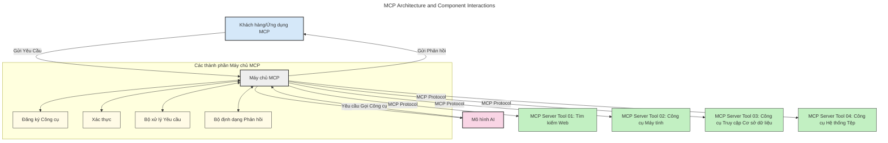
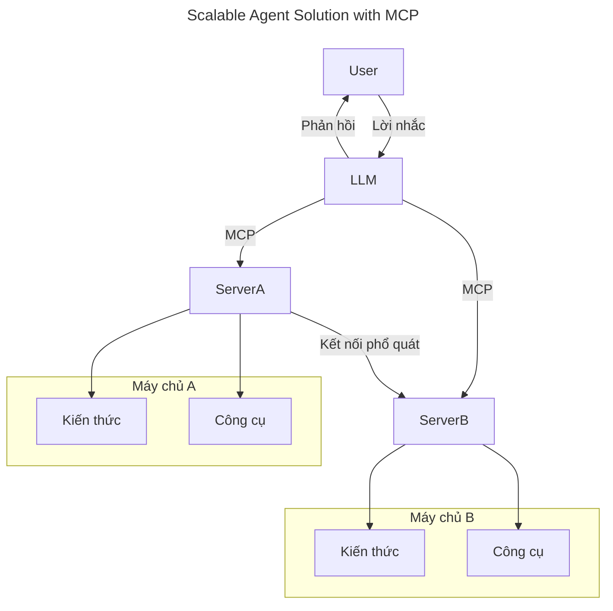
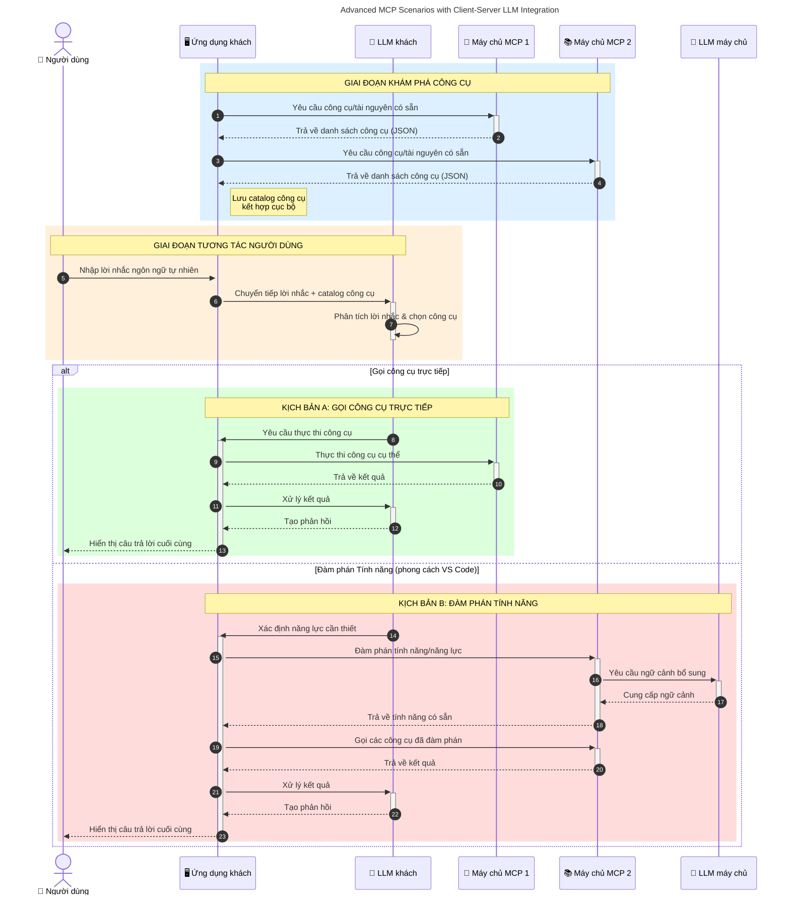

# Giới thiệu về Model Context Protocol (MCP): Tại sao nó quan trọng đối với các ứng dụng AI mở rộng

_(Nhấn vào hình trên để xem video bài học này)_

Các ứng dụng AI tạo sinh là một bước tiến lớn vì chúng thường cho phép người dùng tương tác với ứng dụng bằng các lệnh ngôn ngữ tự nhiên. Tuy nhiên, khi đầu tư nhiều thời gian và nguồn lực vào các ứng dụng như vậy, bạn muốn đảm bảo rằng có thể dễ dàng tích hợp các chức năng và nguồn lực theo cách dễ mở rộng, ứng dụng của bạn có thể phục vụ nhiều mô hình khác nhau và xử lý các chi tiết phức tạp của mô hình. Tóm lại, xây dựng ứng dụng Gen AI ban đầu rất dễ, nhưng khi chúng phát triển và trở nên phức tạp hơn, bạn cần bắt đầu xác định một kiến trúc và có thể cần dựa vào một tiêu chuẩn để đảm bảo các ứng dụng được xây dựng một cách nhất quán. Đây là lý do MCP xuất hiện để tổ chức mọi thứ và cung cấp một tiêu chuẩn.

---

## **🔍 Model Context Protocol (MCP) là gì?**

**Model Context Protocol (MCP)** là một **giao diện mở, tiêu chuẩn** cho phép các Mô hình Ngôn ngữ Lớn (LLMs) tương tác trơn tru với các công cụ bên ngoài, API và nguồn dữ liệu. Nó cung cấp kiến trúc nhất quán để nâng cao chức năng mô hình AI vượt ra ngoài dữ liệu huấn luyện, giúp các hệ thống AI thông minh hơn, có thể mở rộng và đáp ứng tốt hơn.

---

## **🎯 Tại sao việc tiêu chuẩn hóa trong AI lại quan trọng**

Khi các ứng dụng AI tạo sinh trở nên phức tạp hơn, việc áp dụng các tiêu chuẩn đảm bảo **khả năng mở rộng, dễ dàng mở rộng thêm, bảo trì**, và **tránh bị khóa nhà cung cấp** là điều thiết yếu. MCP đáp ứng những nhu cầu này bằng cách:

- Hợp nhất việc tích hợp mô hình-công cụ
- Giảm các giải pháp tùy chỉnh đơn lẻ dễ vỡ
- Cho phép nhiều mô hình từ các nhà cung cấp khác nhau cùng tồn tại trong một hệ sinh thái

**Lưu ý:** Mặc dù MCP tự quảng bá là một tiêu chuẩn mở, không có kế hoạch tiêu chuẩn hóa MCP thông qua bất kỳ tổ chức tiêu chuẩn hiện có nào như IEEE, IETF, W3C, ISO hoặc bất kỳ tổ chức tiêu chuẩn nào khác.

---

## **📚 Mục tiêu học tập**

Đến cuối bài viết này, bạn sẽ có thể:

- Định nghĩa **Model Context Protocol (MCP)** và các trường hợp sử dụng của nó
- Hiểu cách MCP tiêu chuẩn hóa giao tiếp giữa mô hình và công cụ
- Xác định các thành phần cốt lõi của kiến trúc MCP
- Khám phá các ứng dụng thực tế của MCP trong bối cảnh doanh nghiệp và phát triển

---

## **💡 Tại sao Model Context Protocol (MCP) là bước đột phá**

### **🔗 MCP giải quyết sự phân mảnh trong tương tác AI**

Trước MCP, để tích hợp mô hình với công cụ cần:

- Mã tùy chỉnh cho mỗi cặp công cụ-mô hình
- API không tiêu chuẩn cho từng nhà cung cấp
- Thường xuyên bị hỏng do cập nhật
- Khả năng mở rộng kém khi có nhiều công cụ hơn

### **✅ Lợi ích của việc tiêu chuẩn hóa MCP**

| **Lợi ích**              | **Mô tả**                                                                |
|--------------------------|-------------------------------------------------------------------------|
| Tương tác đa chiều        | LLM làm việc trơn tru với công cụ từ nhiều nhà cung cấp                  |
| Tính nhất quán            | Hành vi đồng nhất trên các nền tảng và công cụ                           |
| Tái sử dụng               | Công cụ xây dựng một lần có thể dùng cho nhiều dự án và hệ thống          |
| Tăng tốc phát triển       | Giảm thời gian phát triển nhờ sử dụng giao diện tiêu chuẩn, cắm và chạy  |

---

## **🧱 Tổng quan kiến trúc MCP cấp cao**

MCP tuân theo **mô hình khách - chủ**, trong đó:

- **MCP Hosts** chạy các mô hình AI
- **MCP Clients** khởi tạo các yêu cầu
- **MCP Servers** cung cấp ngữ cảnh, công cụ và khả năng

### **Các thành phần chính:**

- **Nguồn lực** – Dữ liệu tĩnh hoặc động cho các mô hình  
- **Lệnh nhắc** – Các quy trình định trước để tạo đầu ra có hướng dẫn  
- **Công cụ** – Các hàm có thể thực thi như tìm kiếm, tính toán  
- **Lấy mẫu** – Hành vi đại lý qua các tương tác đệ quy (không còn dùng ở phiên bản ứng viên phát hành `2026-07-28`)
- **Gọi người dùng** – Yêu cầu do server khởi tạo để lấy đầu vào của người dùng
- **Rễ** – Ranh giới hệ thống tập tin để kiểm soát truy cập server (không còn dùng ở phiên bản ứng viên phát hành `2026-07-28`)

### **Kiến trúc giao thức:**

MCP sử dụng kiến trúc hai lớp:
- **Lớp dữ liệu**: Giao tiếp dựa trên JSON-RPC 2.0 với quản lý vòng đời và các thao tác cơ bản
- **Lớp vận chuyển**: Kênh giao tiếp STDIO (cục bộ) và HTTP có thể truyền phát với SSE (từ xa)

---

## Cách MCP Servers hoạt động

Các server MCP hoạt động như sau:

- **Luồng yêu cầu**:
    1. Yêu cầu được khởi tạo bởi người dùng cuối hoặc phần mềm thay mặt họ.
    2. **MCP Client** gửi yêu cầu đến một **MCP Host**, người quản lý thời gian chạy Mô hình AI.
    3. **Mô hình AI** nhận lệnh nhắc của người dùng và có thể yêu cầu truy cập các công cụ hoặc dữ liệu bên ngoài thông qua một hoặc nhiều lần gọi công cụ.
    4. **MCP Host**, chứ không phải mô hình trực tiếp, giao tiếp với **MCP Server(s)** phù hợp sử dụng giao thức tiêu chuẩn.
- **Chức năng của MCP Host**:
    - **Đăng ký Công cụ**: Duy trì danh mục các công cụ và khả năng của chúng.
    - **Xác thực**: Xác minh quyền truy cập công cụ.
    - **Xử lý Yêu cầu**: Xử lý các yêu cầu công cụ đến từ mô hình.
    - **Định dạng Phản hồi**: Cấu trúc đầu ra công cụ theo định dạng mà mô hình có thể hiểu.
- **Thực thi MCP Server**:
    - **MCP Host** chuyển tiếp các cuộc gọi công cụ đến một hoặc nhiều **MCP Servers**, mỗi server cung cấp các chức năng chuyên biệt (ví dụ: tìm kiếm, tính toán, truy vấn cơ sở dữ liệu).
    - **MCP Servers** thực hiện các thao tác tương ứng và trả kết quả về cho **MCP Host** theo định dạng nhất quán.
    - **MCP Host** định dạng và chuyển tiếp các kết quả này tới **Mô hình AI**.
- **Hoàn thành phản hồi**:
    - **Mô hình AI** kết hợp các đầu ra công cụ vào phản hồi cuối cùng.
    - **MCP Host** gửi phản hồi này trở lại cho **MCP Client**, người chuyển đến người dùng cuối hoặc phần mềm gọi.
    

## 👨‍💻 Cách xây dựng một MCP Server (Kèm ví dụ)

Các MCP servers cho phép bạn mở rộng khả năng của LLM bằng cách cung cấp dữ liệu và chức năng.

Sẵn sàng thử chưa? Dưới đây là các SDK theo ngôn ngữ và/hoặc ngăn xếp với ví dụ tạo MCP servers đơn giản trên các ngôn ngữ/ngăn xếp khác nhau:

- **Python SDK**: https://github.com/modelcontextprotocol/python-sdk

- **TypeScript SDK**: https://github.com/modelcontextprotocol/typescript-sdk

- **Java SDK**: https://github.com/modelcontextprotocol/java-sdk

- **C#/.NET SDK**: https://github.com/modelcontextprotocol/csharp-sdk

## 🌍 Các trường hợp sử dụng thực tế của MCP

MCP cho phép nhiều ứng dụng khác nhau bằng cách mở rộng khả năng AI:

| **Ứng dụng**              | **Mô tả**                                                               |
|---------------------------|------------------------------------------------------------------------|
| Tích hợp dữ liệu doanh nghiệp | Kết nối LLM với cơ sở dữ liệu, CRM hoặc công cụ nội bộ                |
| Hệ thống AI biết hành động  | Cho phép các tác nhân tự động có quyền truy cập công cụ và quy trình quyết định |
| Ứng dụng đa mô thức         | Kết hợp công cụ văn bản, hình ảnh và âm thanh trong một ứng dụng AI duy nhất |
| Tích hợp dữ liệu thời gian thực | Mang dữ liệu trực tiếp vào tương tác AI để đầu ra chính xác, cập nhật hơn |

### 🧠 MCP = Tiêu chuẩn chung cho tương tác AI

Model Context Protocol (MCP) đóng vai trò là tiêu chuẩn chung cho tương tác AI, tương tự như cách USB-C tiêu chuẩn hóa kết nối vật lý cho các thiết bị. Trong thế giới AI, MCP cung cấp giao diện nhất quán, cho phép các mô hình (khách) tích hợp dễ dàng với các công cụ và nhà cung cấp dữ liệu bên ngoài (chủ). Điều này loại bỏ nhu cầu về các giao thức đa dạng, tùy chỉnh cho từng API hoặc nguồn dữ liệu.

Theo MCP, một công cụ tương thích MCP (được gọi là MCP server) tuân theo một tiêu chuẩn thống nhất. Các server này có thể liệt kê các công cụ hoặc hành động mà chúng cung cấp và thực thi các hành động đó khi được một tác nhân AI yêu cầu. Nền tảng tác nhân AI có hỗ trợ MCP có thể khám phá các công cụ sẵn có từ các server và gọi chúng qua giao thức tiêu chuẩn này.

### 💡 Tạo điều kiện truy cập kiến thức

Ngoài việc cung cấp công cụ, MCP còn tạo điều kiện truy cập kiến thức. Nó cho phép ứng dụng cung cấp ngữ cảnh cho các mô hình ngôn ngữ lớn (LLMs) bằng cách liên kết chúng với nhiều nguồn dữ liệu khác nhau. Ví dụ, một MCP server có thể đại diện cho kho lưu trữ tài liệu của một công ty, cho phép các tác nhân truy xuất thông tin phù hợp khi cần. Một server khác có thể xử lý các hành động cụ thể như gửi email hoặc cập nhật hồ sơ. Từ góc nhìn của tác nhân, đây chỉ là các công cụ nó có thể dùng—một số công cụ trả về dữ liệu (ngữ cảnh kiến thức), trong khi những công cụ khác thực hiện hành động. MCP quản lý hiệu quả cả hai.

Một tác nhân kết nối với MCP server tự động học các khả năng sẵn có và dữ liệu có thể truy cập của server thông qua định dạng tiêu chuẩn. Việc tiêu chuẩn hóa này cho phép công cụ có sẵn một cách động. Ví dụ, thêm một MCP server mới vào hệ thống của tác nhân làm cho các chức năng của server đó có thể dùng ngay mà không cần tùy chỉnh thêm hướng dẫn cho tác nhân.

Việc tích hợp được đơn giản hóa này phù hợp với luồng trong sơ đồ dưới đây, trong đó các server cung cấp cả công cụ và kiến thức, đảm bảo sự hợp tác liền mạch giữa các hệ thống.

### 👉 Ví dụ: Giải pháp tác nhân có khả năng mở rộng

Bộ Kết Nối Toàn Cầu cho phép các MCP servers giao tiếp và chia sẻ khả năng với nhau, cho phép ServerA ủy thác tác vụ cho ServerB hoặc truy cập công cụ và kiến thức của nó. Điều này liên kết các công cụ và dữ liệu trên các server, hỗ trợ kiến trúc tác nhân mở rộng và mô-đun. Vì MCP tiêu chuẩn hóa việc phơi bày công cụ, các tác nhân có thể tự khám phá và chuyển hướng yêu cầu giữa các server mà không cần tích hợp cứng mã.

Liên kết công cụ và kiến thức: Các công cụ và dữ liệu có thể truy cập qua các server, giúp kiến trúc tác nhân có khả năng mở rộng và mô-đun hơn.

### 🔄 Các kịch bản MCP nâng cao với tích hợp LLM phía khách

Ngoài kiến trúc MCP cơ bản, có các kịch bản nâng cao khi cả khách hàng và server đều chứa LLM, cho phép các tương tác tinh vi hơn. Trong sơ đồ dưới đây, **Ứng dụng Khách** có thể là IDE với nhiều công cụ MCP sẵn có cho LLM sử dụng:

## 🔐 Lợi ích thực tiễn của MCP

Dưới đây là các lợi ích thực tế khi sử dụng MCP:

- **Luôn mới**: Mô hình có thể truy cập thông tin cập nhật ngoài dữ liệu huấn luyện
- **Mở rộng khả năng**: Mô hình có thể tận dụng công cụ chuyên biệt cho nhiệm vụ không được huấn luyện
- **Giảm ảo giác**: Nguồn dữ liệu bên ngoài cung cấp nền tảng sự thật
- **Bảo mật**: Dữ liệu nhạy cảm có thể ở trong môi trường an toàn thay vì nhúng trong lệnh nhắc

## 📌 Các điểm chính cần nhớ

Dưới đây là những điểm chính khi sử dụng MCP:

- **MCP** tiêu chuẩn hóa cách mô hình AI tương tác với công cụ và dữ liệu
- Thúc đẩy **khả năng mở rộng, tính nhất quán, và tương tác đa chiều**
- MCP giúp **giảm thời gian phát triển, cải thiện độ tin cậy, và mở rộng khả năng mô hình**
- Kiến trúc khách - chủ **cho phép ứng dụng AI linh hoạt, có khả năng mở rộng**

## 🧠 Bài tập

Hãy suy nghĩ về một ứng dụng AI mà bạn quan tâm muốn xây dựng.

- Công cụ hoặc dữ liệu bên ngoài nào có thể nâng cao khả năng của nó?
- MCP có thể làm cho việc tích hợp đơn giản và đáng tin cậy hơn như thế nào?

## Tài nguyên bổ sung

- [Kho mã nguồn MCP trên GitHub](https://github.com/modelcontextprotocol)

## Tiếp theo

Tiếp: [Chương 1: Các khái niệm cốt lõi](../01-CoreConcepts/README.md)

---

<!-- CO-OP TRANSLATOR DISCLAIMER START -->
**Tuyên bố miễn trừ trách nhiệm**:
Tài liệu này đã được dịch bằng dịch vụ dịch thuật AI [Co-op Translator](https://github.com/Azure/co-op-translator). Mặc dù chúng tôi cố gắng đảm bảo độ chính xác, xin lưu ý rằng bản dịch tự động có thể chứa lỗi hoặc sai sót. Tài liệu gốc bằng ngôn ngữ gốc nên được coi là nguồn tin chính thức. Đối với thông tin quan trọng, nên sử dụng dịch vụ dịch thuật chuyên nghiệp bởi con người. Chúng tôi không chịu trách nhiệm về bất kỳ hiểu lầm hoặc giải thích sai nào phát sinh từ việc sử dụng bản dịch này.
<!-- CO-OP TRANSLATOR DISCLAIMER END -->