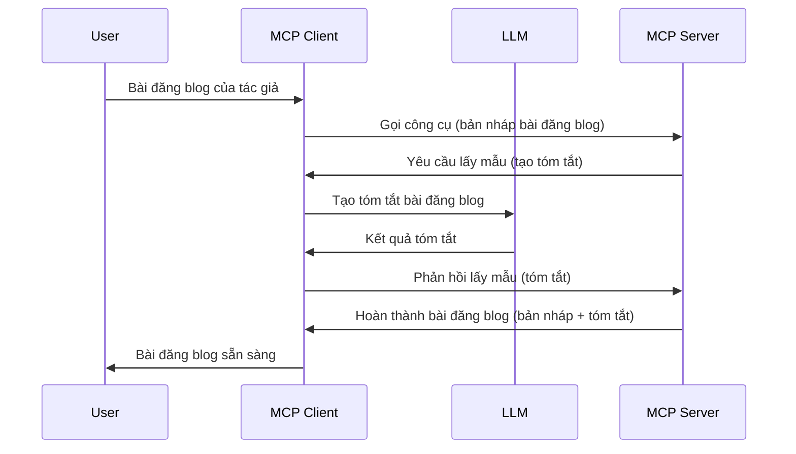

> [ĐÃ NGỪNG HỖ TRỢ: ỨNG CỬ PHÁT HÀNH 2026-07-28](https://blog.modelcontextprotocol.io/posts/2026-07-28-release-candidate/)

# Lấy mẫu - ủy quyền tính năng cho Client

> **Thông báo ngừng hỗ trợ:** ứng cử phát hành đặc tả MCP `2026-07-28` đánh dấu Lấy mẫu là tính năng đã ngừng hỗ trợ ủng hộ cho tích hợp trực tiếp với API nhà cung cấp LLM. Lấy mẫu vẫn hoạt động trong phiên bản `2025-11-25` và ít nhất một năm sau khi chính thức ngừng hỗ trợ, vì vậy tất cả nội dung bài học này vẫn còn hiệu lực — nhưng các thiết kế server mới nên đánh giá mẫu thay thế. Xem [Những Thay Đổi trong MCP: Ứng Cử Phát Hành 2026-07-28](../../01-CoreConcepts/mcp-2026-07-28-release-candidate.md).

Đôi khi, bạn cần Client MCP và Server MCP hợp tác đạt một mục tiêu chung. Có thể xảy ra trường hợp Server cần giúp đỡ từ LLM nằm trên client. Trong trường hợp này, lấy mẫu là cái bạn nên dùng.

Hãy cùng khám phá một số trường hợp sử dụng và cách xây dựng giải pháp có liên quan đến lấy mẫu.

## Tổng quan

Trong bài học này, chúng ta tập trung giải thích khi nào và ở đâu nên dùng Lấy mẫu và cách cấu hình nó.

## Mục tiêu học tập

Trong chương này, bạn sẽ:

- Giải thích Lấy mẫu là gì và khi nào dùng nó.
- Chỉ cách cấu hình Lấy mẫu trong MCP.
- Cung cấp ví dụ thực tế về Lấy mẫu.

## Lấy mẫu là gì và tại sao dùng nó?

Lấy mẫu là một tính năng nâng cao hoạt động theo cách sau:



### Yêu cầu lấy mẫu

Ok, giờ chúng ta đã có cái nhìn bao quát về một kịch bản khả thi, hãy nói về yêu cầu lấy mẫu mà server gửi lại cho client. Đây là ví dụ yêu cầu dạng JSON-RPC:

```json
{
  "jsonrpc": "2.0",
  "id": 1,
  "method": "sampling/createMessage",
  "params": {
    "messages": [
      {
        "role": "user",
        "content": {
          "type": "text",
          "text": "Create a blog post summary of the following blog post: <BLOG POST>"
        }
      }
    ],
    "modelPreferences": {
      "hints": [
        {
          "name": "claude-3-sonnet"
        }
      ],
      "intelligencePriority": 0.8,
      "speedPriority": 0.5
    },
    "systemPrompt": "You are a helpful assistant.",
    "maxTokens": 100
  }
}
```

Có vài điểm đáng chú ý:

- Prompt, dưới content -> text, là lời nhắc – tức là chỉ dẫn cho LLM tóm tắt nội dung bài blog.

- **modelPreferences**. Phần này chỉ là sở thích, đề xuất về cấu hình dùng với LLM. Người dùng có thể chọn theo đề xuất hoặc đổi lại. Trong trường hợp này có đề xuất model dùng, ưu tiên tốc độ và độ thông minh.
- **systemPrompt**, đây là prompt hệ thống bình thường của bạn, cung cấp cho LLM tính cách và hướng dẫn.
- **maxTokens**, đây là thuộc tính nói số token được đề xuất dùng cho tác vụ này.

### Phản hồi lấy mẫu

Phản hồi này là cái Client MCP gửi lại Server MCP, kết quả của việc client gọi LLM, chờ phản hồi rồi dựng thông điệp này. Đây là ví dụ JSON-RPC:

```json
{
  "jsonrpc": "2.0",
  "id": 1,
  "result": {
    "role": "assistant",
    "content": {
      "type": "text",
      "text": "Here's your abstract <ABSTRACT>"
    },
    "model": "gpt-5",
    "stopReason": "endTurn"
  }
}
```

Lưu ý phản hồi là bản tóm tắt bài blog đúng như yêu cầu. Cũng chú ý model được dùng không phải cái ta yêu cầu mà là "gpt-5" thay vì "claude-3-sonnet". Điều này để minh họa người dùng có thể đổi ý chọn model sử dụng và yêu cầu lấy mẫu của bạn chỉ là đề xuất.

Ok, giờ chúng ta đã hiểu dòng chảy chính, và tác vụ hữu ích dùng nó “tạo bài blog + tóm tắt”, hãy xem cần làm gì để nó hoạt động.

### Các loại tin nhắn

Tin nhắn lấy mẫu không giới hạn chỉ văn bản mà bạn còn có thể gửi hình ảnh và âm thanh. Dưới đây là cách JSON-RPC khác nhau:

**Văn bản**

```json
{
  "type": "text",
  "text": "The message content"
}
```

**Nội dung hình ảnh**

```json
{
  "type": "image",
  "data": "base64-encoded-image-data",
  "mimeType": "image/jpeg"
}
```

**Nội dung âm thanh**

```json
{
  "type": "audio",
  "data": "base64-encoded-audio-data",
  "mimeType": "audio/wav"
}
```

> LƯU Ý: để biết thêm chi tiết về Lấy mẫu, xem tài liệu chính thức tại [đây](https://modelcontextprotocol.io/specification/2025-11-25/client/sampling)

## Cách cấu hình Lấy mẫu trên Client

> Lưu ý: nếu bạn chỉ xây dựng server, bạn không cần làm nhiều bước ở đây.

Trên client, bạn cần khai báo tính năng này như sau:

```json
{
  "capabilities": {
    "sampling": {}
  }
}
```

Sau đó tính năng này sẽ được kích hoạt khi client của bạn khởi tạo kết nối server.

## Ví dụ Lấy mẫu thực tế - Tạo bài blog

Hãy cùng viết code server lấy mẫu, chúng ta cần làm:

1. Tạo một công cụ trên Server.
1. Công cụ đó tạo yêu cầu lấy mẫu
1. Công cụ đợi yêu cầu lấy mẫu của client được trả lời.
1. Rồi công cụ trả kết quả.

Hãy xem code từng bước:

### -1- Tạo công cụ

**python**

```python
@mcp.tool()
async def create_blog(title: str, content: str, ctx: Context[ServerSession, None]) -> str:
    """Create a blog post and generate a summary"""

```

### -2- Tạo yêu cầu lấy mẫu

Mở rộng công cụ bằng code sau:

**python**

```python
post = BlogPost(
        id=len(posts) + 1,
        title=title,
        content=content,
        abstract=""
    )

prompt = f"Create an abstract of the following blog post: title: {title} and draft: {content} "

result = await ctx.session.create_message(
        messages=[
            SamplingMessage(
                role="user",
                content=TextContent(type="text", text=prompt),
            )
        ],
        max_tokens=100,
)

```

### -3- Đợi phản hồi và trả về

**python**

```python
post.abstract = result.content.text

posts.append(post)

# trả về sản phẩm hoàn chỉnh
return json.dumps({
    "id": post.title,
    "abstract": post.abstract
})
```

### -4- Code đầy đủ

**python**

```python
from starlette.applications import Starlette
from starlette.routing import Mount, Host

from mcp.server.fastmcp import Context, FastMCP

from mcp.server.session import ServerSession
from mcp.types import SamplingMessage, TextContent

import json


from uuid import uuid4
from typing import List
from pydantic import BaseModel


mcp = FastMCP("Blog post generator")

# app = FastAPI()

posts = []

class BlogPost(BaseModel):
    id: int
    title: str
    content: str
    abstract: str

posts: List[BlogPost] = []

@mcp.tool()
async def create_blog(title: str, content: str, ctx: Context[ServerSession, None]) -> str:
    """Create a blog post and generate a summary"""

    post = BlogPost(
        id=len(posts) + 1,
        title=title,
        content=content,
        abstract=""
    )

    prompt = f"Create an abstract of the following blog post: title: {title} and draft: {content} "

    result = await ctx.session.create_message(
        messages=[
            SamplingMessage(
                role="user",
                content=TextContent(type="text", text=prompt),
            )
        ],
        max_tokens=100,
    )

    post.abstract = result.content.text

    posts.append(post)

    # trả về bài đăng blog đầy đủ
    return json.dumps({
        "id": post.title,
        "abstract": post.abstract
    })

if __name__ == "__main__":
    print("Starting server...")
    # mcp.chạy()
    mcp.run(transport="streamable-http")

# chạy ứng dụng với: python server.py
```

### -5- Thử nghiệm trong Visual Studio Code

Để thử trong Visual Studio Code, làm như sau:

1. Khởi động server trong terminal
1. Thêm vào *mcp.json* (và đảm bảo server đã chạy) ví dụ như:

   ```json
   "servers": {
      "blog-server": {
        "type": "http",
        "url": "http://localhost:8000/mcp"
      }
   }
   ```

1. Gõ prompt:

   ```text
   create a blog post named "Where Python comes from", the content is "Python is actually named after Monty Python Flying Circus"
   ```

1. Cho phép lấy mẫu diễn ra. Lần đầu test bạn sẽ thấy hộp thoại phụ thêm phải đồng ý, rồi mới thấy hộp thoại bình thường hỏi cho phép chạy tool.

1. Kiểm tra kết quả. Bạn sẽ thấy kết quả dựng đẹp trong GitHub Copilot Chat và cũng có thể xem phản hồi JSON thô.

**Thưởng**. Công cụ Visual Studio Code hỗ trợ lấy mẫu rất tốt. Bạn có thể cấu hình truy cập Lấy mẫu trên server đã cài bằng cách mở tới nó như sau:

1. Vào phần extension.
1. Chọn biểu tượng bánh răng cho server đã cài tại phần "MCP SERVERS - INSTALLED".
1 Chọn "Configure Model Access", ở đây bạn có thể chọn Model nào GitHub Copilot được phép dùng khi lấy mẫu. Bạn cũng có thể xem tất cả yêu cầu lấy mẫu gần đây bằng cách chọn "Show Sampling requests".

## Bài tập

Trong bài tập này, bạn sẽ tạo một lấy mẫu hơi khác, một tích hợp lấy mẫu hỗ trợ tạo mô tả sản phẩm. Đây là kịch bản của bạn:

**Kịch bản**: Nhân viên hậu cần tại thương mại điện tử cần trợ giúp, vì mất quá nhiều thời gian tạo mô tả sản phẩm. Vì vậy bạn sẽ xây một giải pháp có công cụ "create_product" với tham số "title" và "keywords" và nó sẽ tạo sản phẩm hoàn chỉnh bao gồm trường "description" do LLM của client tạo ra.

MẸO: dùng những gì bạn học ở trên để xây server và công cụ bằng yêu cầu lấy mẫu.

## Giải pháp

[Giải pháp](./solution/README.md)

## Những điểm chính cần nhớ

Lấy mẫu là tính năng mạnh cho phép server ủy quyền tác vụ cho client khi cần giúp từ LLM.

## Tiếp theo

- [Chương 4 - Triển khai thực tế](../../04-PracticalImplementation/README.md)

---

<!-- CO-OP TRANSLATOR DISCLAIMER START -->
**Tuyên bố miễn trừ trách nhiệm**:
Tài liệu này đã được dịch bằng dịch vụ dịch thuật AI [Co-op Translator](https://github.com/Azure/co-op-translator). Mặc dù chúng tôi cố gắng đảm bảo độ chính xác, xin lưu ý rằng bản dịch tự động có thể chứa lỗi hoặc sai sót. Tài liệu gốc bằng ngôn ngữ gốc nên được coi là nguồn tin chính thức. Đối với thông tin quan trọng, nên sử dụng dịch vụ dịch thuật chuyên nghiệp bởi con người. Chúng tôi không chịu trách nhiệm về bất kỳ hiểu lầm hoặc giải thích sai nào phát sinh từ việc sử dụng bản dịch này.
<!-- CO-OP TRANSLATOR DISCLAIMER END -->