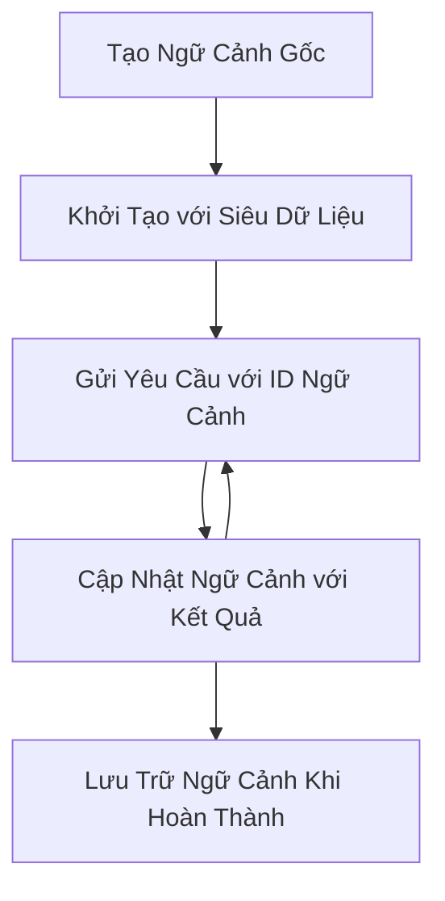

> [KHÔNG KHUYẾN KHÍCH SỬ DỤNG: ỨNG CỬ PHÁT HÀNH 2026-07-28](https://blog.modelcontextprotocol.io/posts/2026-07-28-release-candidate/#roots-sampling-and-logging-are-deprecated)

# Ngữ cảnh Root MCP

> **Thông báo ngừng hỗ trợ:** ứng cử phát hành đặc tả MCP `2026-07-28` đánh dấu Roots là không được khuyến khích sử dụng, thay vào đó dùng các tham số công cụ, URI tài nguyên, hoặc cấu hình máy chủ. Roots vẫn hoạt động trong phiên bản `2025-11-25` và ít nhất một năm sau khi bị ngừng chính thức, nên tất cả trong bài học này vẫn còn hiệu lực - nhưng thiết kế máy chủ mới nên xem xét mô hình thay thế. Xem [Có gì thay đổi trong MCP: Ứng cử phát hành 2026-07-28](../../01-CoreConcepts/mcp-2026-07-28-release-candidate.md).

Ngữ cảnh root là một khái niệm cơ bản trong Model Context Protocol cung cấp một lớp lưu trữ liên tục để duy trì lịch sử đối thoại và trạng thái chung qua nhiều yêu cầu và phiên làm việc.

## Giới thiệu

Trong bài học này, chúng ta sẽ khám phá cách tạo, quản lý và sử dụng ngữ cảnh root trong MCP.

## Mục tiêu học tập

Đến cuối bài học này, bạn sẽ có khả năng:

- Hiểu được mục đích và cấu trúc của ngữ cảnh root
- Tạo và quản lý ngữ cảnh root bằng các thư viện khách MCP
- Triển khai ngữ cảnh root trong các ứng dụng .NET, Java, JavaScript và Python
- Sử dụng ngữ cảnh root cho các cuộc hội thoại đa lượt và quản lý trạng thái
- Thực hiện các phương pháp tốt nhất cho quản lý ngữ cảnh root

## Hiểu về Ngữ cảnh Root

Ngữ cảnh root hoạt động như các container giữ lịch sử và trạng thái cho một chuỗi các tương tác liên quan. Chúng cho phép:

- **Duy trì cuộc hội thoại**: Bảo đảm hội thoại đa lượt được mạch lạc
- **Quản lý bộ nhớ**: Lưu giữ và truy xuất thông tin qua các tương tác
- **Quản lý trạng thái**: Theo dõi tiến trình trong các quy trình phức tạp
- **Chia sẻ ngữ cảnh**: Cho phép nhiều khách hàng truy cập cùng trạng thái đối thoại

Trong MCP, ngữ cảnh root có những đặc điểm chính sau:

- Mỗi ngữ cảnh root có một định danh duy nhất.
- Có thể chứa lịch sử đối thoại, sở thích người dùng, và các siêu dữ liệu khác.
- Có thể được tạo, truy cập và lưu trữ khi cần thiết.
- Hỗ trợ kiểm soát truy cập và quyền hạn chi tiết.

## Vòng đời ngữ cảnh Root



## Làm việc với Ngữ cảnh Root

Dưới đây là ví dụ về cách tạo và quản lý ngữ cảnh root.

### Triển khai C#

```csharp
// .NET Example: Root Context Management
using Microsoft.Mcp.Client;
using System;
using System.Threading.Tasks;
using System.Collections.Generic;

public class RootContextExample
{
    private readonly IMcpClient _client;
    private readonly IRootContextManager _contextManager;
    
    public RootContextExample(IMcpClient client, IRootContextManager contextManager)
    {
        _client = client;
        _contextManager = contextManager;
    }
    
    public async Task DemonstrateRootContextAsync()
    {
        // 1. Create a new root context
        var contextResult = await _contextManager.CreateRootContextAsync(new RootContextCreateOptions
        {
            Name = "Customer Support Session",
            Metadata = new Dictionary<string, string>
            {
                ["CustomerName"] = "Acme Corporation",
                ["PriorityLevel"] = "High",
                ["Domain"] = "Cloud Services"
            }
        });
        
        string contextId = contextResult.ContextId;
        Console.WriteLine($"Created root context with ID: {contextId}");
        
        // 2. First interaction using the context
        var response1 = await _client.SendPromptAsync(
            "I'm having issues scaling my web service deployment in the cloud.", 
            new SendPromptOptions { RootContextId = contextId }
        );
        
        Console.WriteLine($"First response: {response1.GeneratedText}");
        
        // Second interaction - the model will have access to the previous conversation
        var response2 = await _client.SendPromptAsync(
            "Yes, we're using containerized deployments with Kubernetes.", 
            new SendPromptOptions { RootContextId = contextId }
        );
        
        Console.WriteLine($"Second response: {response2.GeneratedText}");
        
        // 3. Add metadata to the context based on conversation
        await _contextManager.UpdateContextMetadataAsync(contextId, new Dictionary<string, string>
        {
            ["TechnicalEnvironment"] = "Kubernetes",
            ["IssueType"] = "Scaling"
        });
        
        // 4. Get context information
        var contextInfo = await _contextManager.GetRootContextInfoAsync(contextId);
        
        Console.WriteLine("Context Information:");
        Console.WriteLine($"- Name: {contextInfo.Name}");
        Console.WriteLine($"- Created: {contextInfo.CreatedAt}");
        Console.WriteLine($"- Messages: {contextInfo.MessageCount}");
        
        // 5. When the conversation is complete, archive the context
        await _contextManager.ArchiveRootContextAsync(contextId);
        Console.WriteLine($"Archived context {contextId}");
    }
}
```

Trong đoạn mã trên, chúng ta đã:

1. Tạo một ngữ cảnh root cho phiên hỗ trợ khách hàng.
1. Gửi nhiều tin nhắn trong ngữ cảnh đó, cho phép mô hình duy trì trạng thái.
1. Cập nhật ngữ cảnh với siêu dữ liệu liên quan dựa trên cuộc hội thoại.
1. Truy xuất thông tin ngữ cảnh để hiểu lịch sử cuộc hội thoại.
1. Lưu trữ ngữ cảnh khi cuộc hội thoại hoàn thành.

## Ví dụ: Triển khai Ngữ cảnh Root cho phân tích tài chính

Trong ví dụ này, chúng ta sẽ tạo một ngữ cảnh root cho phiên phân tích tài chính, trình bày cách duy trì trạng thái qua nhiều tương tác.

### Triển khai Java

```java
// Ví dụ Java: Triển khai Ngữ cảnh Gốc
package com.example.mcp.contexts;

import com.mcp.client.McpClient;
import com.mcp.client.ContextManager;
import com.mcp.models.RootContext;
import com.mcp.models.McpResponse;

import java.util.HashMap;
import java.util.Map;
import java.util.UUID;

public class RootContextsDemo {
    private final McpClient client;
    private final ContextManager contextManager;
    
    public RootContextsDemo(String serverUrl) {
        this.client = new McpClient.Builder()
            .setServerUrl(serverUrl)
            .build();
            
        this.contextManager = new ContextManager(client);
    }
    
    public void demonstrateRootContext() throws Exception {
        // Tạo siêu dữ liệu ngữ cảnh
        Map<String, String> metadata = new HashMap<>();
        metadata.put("projectName", "Financial Analysis");
        metadata.put("userRole", "Financial Analyst");
        metadata.put("dataSource", "Q1 2025 Financial Reports");
        
        // 1. Tạo một ngữ cảnh gốc mới
        RootContext context = contextManager.createRootContext("Financial Analysis Session", metadata);
        String contextId = context.getId();
        
        System.out.println("Created context: " + contextId);
        
        // 2. Tương tác đầu tiên
        McpResponse response1 = client.sendPrompt(
            "Analyze the trends in Q1 financial data for our technology division",
            contextId
        );
        
        System.out.println("First response: " + response1.getGeneratedText());
        
        // 3. Cập nhật ngữ cảnh với thông tin quan trọng thu được từ phản hồi
        contextManager.addContextMetadata(contextId, 
            Map.of("identifiedTrend", "Increasing cloud infrastructure costs"));
        
        // Tương tác thứ hai - sử dụng cùng ngữ cảnh
        McpResponse response2 = client.sendPrompt(
            "What's driving the increase in cloud infrastructure costs?",
            contextId
        );
        
        System.out.println("Second response: " + response2.getGeneratedText());
        
        // 4. Tạo tóm tắt của phiên phân tích
        McpResponse summaryResponse = client.sendPrompt(
            "Summarize our analysis of the technology division financials in 3-5 key points",
            contextId
        );
        
        // Lưu tóm tắt vào siêu dữ liệu ngữ cảnh
        contextManager.addContextMetadata(contextId, 
            Map.of("analysisSummary", summaryResponse.getGeneratedText()));
            
        // Lấy thông tin ngữ cảnh đã cập nhật
        RootContext updatedContext = contextManager.getRootContext(contextId);
        
        System.out.println("Context Information:");
        System.out.println("- Created: " + updatedContext.getCreatedAt());
        System.out.println("- Last Updated: " + updatedContext.getLastUpdatedAt());
        System.out.println("- Analysis Summary: " + 
            updatedContext.getMetadata().get("analysisSummary"));
            
        // 5. Lưu trữ ngữ cảnh khi hoàn thành
        contextManager.archiveContext(contextId);
        System.out.println("Context archived");
    }
}
```

Trong đoạn mã trên, chúng ta đã:

1. Tạo một ngữ cảnh root cho phiên phân tích tài chính.
2. Gửi nhiều tin nhắn trong ngữ cảnh đó, cho phép mô hình duy trì trạng thái.
3. Cập nhật ngữ cảnh với siêu dữ liệu liên quan dựa trên cuộc hội thoại.
4. Tạo tóm tắt phiên phân tích và lưu trữ nó trong siêu dữ liệu ngữ cảnh.
5. Lưu trữ ngữ cảnh khi cuộc hội thoại hoàn thành.

## Ví dụ: Quản lý Ngữ cảnh Root

Quản lý ngữ cảnh root hiệu quả là rất quan trọng để duy trì lịch sử cuộc hội thoại và trạng thái. Dưới đây là ví dụ về cách triển khai quản lý ngữ cảnh root.

### Triển khai JavaScript

```javascript
// Ví dụ JavaScript: Quản lý các ngữ cảnh gốc MCP
const { McpClient, RootContextManager } = require('@mcp/client');

class ContextSession {
  constructor(serverUrl, apiKey = null) {
    // Khởi tạo client MCP
    this.client = new McpClient({
      serverUrl,
      apiKey
    });
    
    // Khởi tạo trình quản lý ngữ cảnh
    this.contextManager = new RootContextManager(this.client);
  }
  
  /**
   * Create a new conversation context
   * @param {string} sessionName - Name of the conversation session
   * @param {Object} metadata - Additional metadata for the context
   * @returns {Promise<string>} - Context ID
   */
  async createConversationContext(sessionName, metadata = {}) {
    try {
      const contextResult = await this.contextManager.createRootContext({
        name: sessionName,
        metadata: {
          ...metadata,
          createdAt: new Date().toISOString(),
          status: 'active'
        }
      });
      
      console.log(`Created root context '${sessionName}' with ID: ${contextResult.id}`);
      return contextResult.id;
    } catch (error) {
      console.error('Error creating root context:', error);
      throw error;
    }
  }
  
  /**
   * Send a message in an existing context
   * @param {string} contextId - The root context ID
   * @param {string} message - The user's message
   * @param {Object} options - Additional options
   * @returns {Promise<Object>} - Response data
   */
  async sendMessage(contextId, message, options = {}) {
    try {
      // Gửi tin nhắn sử dụng ngữ cảnh đã chỉ định
      const response = await this.client.sendPrompt(message, {
        rootContextId: contextId,
        temperature: options.temperature || 0.7,
        allowedTools: options.allowedTools || []
      });
      
      // Tùy chọn lưu trữ những nhận định quan trọng từ cuộc trò chuyện
      if (options.storeInsights) {
        await this.storeConversationInsights(contextId, message, response.generatedText);
      }
      
      return {
        message: response.generatedText,
        toolCalls: response.toolCalls || [],
        contextId
      };
    } catch (error) {
      console.error(`Error sending message in context ${contextId}:`, error);
      throw error;
    }
  }
  
  /**
   * Store important insights from a conversation
   * @param {string} contextId - The root context ID
   * @param {string} userMessage - User's message
   * @param {string} aiResponse - AI's response
   */
  async storeConversationInsights(contextId, userMessage, aiResponse) {
    try {
      // Trích xuất những nhận định tiềm năng (trong ứng dụng thực tế, việc này sẽ tinh vi hơn)
      const combinedText = userMessage + "\n" + aiResponse;
      
      // Heuristic đơn giản để xác định những nhận định tiềm năng
      const insightWords = ["important", "key point", "remember", "significant", "crucial"];
      
      const potentialInsights = combinedText
        .split(".")
        .filter(sentence => 
          insightWords.some(word => sentence.toLowerCase().includes(word))
        )
        .map(sentence => sentence.trim())
        .filter(sentence => sentence.length > 10);
      
      // Lưu nhận định trong siêu dữ liệu ngữ cảnh
      if (potentialInsights.length > 0) {
        const insights = {};
        potentialInsights.forEach((insight, index) => {
          insights[`insight_${Date.now()}_${index}`] = insight;
        });
        
        await this.contextManager.updateContextMetadata(contextId, insights);
        console.log(`Stored ${potentialInsights.length} insights in context ${contextId}`);
      }
    } catch (error) {
      console.warn('Error storing conversation insights:', error);
      // Lỗi không quan trọng, chỉ ghi cảnh báo
    }
  }
  
  /**
   * Get summary information about a context
   * @param {string} contextId - The root context ID
   * @returns {Promise<Object>} - Context information
   */
  async getContextInfo(contextId) {
    try {
      const contextInfo = await this.contextManager.getContextInfo(contextId);
      
      return {
        id: contextInfo.id,
        name: contextInfo.name,
        created: new Date(contextInfo.createdAt).toLocaleString(),
        lastUpdated: new Date(contextInfo.lastUpdatedAt).toLocaleString(),
        messageCount: contextInfo.messageCount,
        metadata: contextInfo.metadata,
        status: contextInfo.status
      };
    } catch (error) {
      console.error(`Error getting context info for ${contextId}:`, error);
      throw error;
    }
  }
  
  /**
   * Generate a summary of the conversation in a context
   * @param {string} contextId - The root context ID
   * @returns {Promise<string>} - Generated summary
   */
  async generateContextSummary(contextId) {
    try {
      // Yêu cầu mô hình tạo tóm tắt cuộc trò chuyện đến hiện tại
      const response = await this.client.sendPrompt(
        "Please summarize our conversation so far in 3-4 sentences, highlighting the main points discussed.",
        { rootContextId: contextId, temperature: 0.3 }
      );
      
      // Lưu tóm tắt trong siêu dữ liệu ngữ cảnh
      await this.contextManager.updateContextMetadata(contextId, {
        conversationSummary: response.generatedText,
        summarizedAt: new Date().toISOString()
      });
      
      return response.generatedText;
    } catch (error) {
      console.error(`Error generating context summary for ${contextId}:`, error);
      throw error;
    }
  }
  
  /**
   * Archive a context when it's no longer needed
   * @param {string} contextId - The root context ID
   * @returns {Promise<Object>} - Result of the archive operation
   */
  async archiveContext(contextId) {
    try {
      // Tạo tóm tắt cuối cùng trước khi lưu trữ
      const summary = await this.generateContextSummary(contextId);
      
      // Lưu trữ ngữ cảnh
      await this.contextManager.archiveContext(contextId);
      
      return {
        status: "archived",
        contextId,
        summary
      };
    } catch (error) {
      console.error(`Error archiving context ${contextId}:`, error);
      throw error;
    }
  }
}

// Ví dụ sử dụng
async function demonstrateContextSession() {
  const session = new ContextSession('https://mcp-server-example.com');
  
  try {
    // 1. Tạo ngữ cảnh mới cho cuộc trò chuyện hỗ trợ sản phẩm
    const contextId = await session.createConversationContext(
      'Product Support - Database Performance',
      {
        customer: 'Globex Corporation',
        product: 'Enterprise Database',
        severity: 'Medium',
        supportAgent: 'AI Assistant'
      }
    );
    
    // 2. Tin nhắn đầu tiên trong cuộc trò chuyện
    const response1 = await session.sendMessage(
      contextId,
      "I'm experiencing slow query performance on our database cluster after the latest update.",
      { storeInsights: true }
    );
    console.log('Response 1:', response1.message);
    
    // Tin nhắn tiếp theo trong cùng ngữ cảnh
    const response2 = await session.sendMessage(
      contextId,
      "Yes, we've already checked the indexes and they seem to be properly configured.",
      { storeInsights: true }
    );
    console.log('Response 2:', response2.message);
    
    // 3. Lấy thông tin về ngữ cảnh
    const contextInfo = await session.getContextInfo(contextId);
    console.log('Context Information:', contextInfo);
    
    // 4. Tạo và hiển thị tóm tắt cuộc trò chuyện
    const summary = await session.generateContextSummary(contextId);
    console.log('Conversation Summary:', summary);
    
    // 5. Lưu trữ ngữ cảnh khi hoàn thành
    const archiveResult = await session.archiveContext(contextId);
    console.log('Archive Result:', archiveResult);
    
    // 6. Xử lý mọi lỗi một cách nhẹ nhàng
  } catch (error) {
    console.error('Error in context session demonstration:', error);
  }
}

demonstrateContextSession();
```

Trong đoạn mã trên, chúng ta đã:

1. Tạo một ngữ cảnh root cho cuộc hội thoại hỗ trợ sản phẩm với hàm `createConversationContext`. Trong trường hợp này, ngữ cảnh là về các vấn đề hiệu suất cơ sở dữ liệu.

1. Gửi nhiều tin nhắn trong ngữ cảnh đó, cho phép mô hình duy trì trạng thái với hàm `sendMessage`. Các tin nhắn gửi đi liên quan đến hiệu suất truy vấn chậm và cấu hình chỉ mục.

1. Cập nhật ngữ cảnh với siêu dữ liệu liên quan dựa trên cuộc hội thoại.

1. Tạo bản tóm tắt cuộc hội thoại và lưu vào siêu dữ liệu ngữ cảnh với hàm `generateContextSummary`.

1. Lưu trữ ngữ cảnh khi cuộc hội thoại hoàn thành với hàm `archiveContext`.

1. Xử lý lỗi một cách linh hoạt để đảm bảo sự ổn định.

## Ngữ cảnh Root cho Hỗ trợ Đa lượt

Trong ví dụ này, chúng ta sẽ tạo một ngữ cảnh root cho phiên hỗ trợ đa lượt, trình bày cách duy trì trạng thái qua nhiều tương tác.

### Triển khai Python

```python
# Ví dụ Python: Ngữ cảnh gốc cho Hỗ trợ Đa lượt
import asyncio
from datetime import datetime
from mcp_client import McpClient, RootContextManager

class AssistantSession:
    def __init__(self, server_url, api_key=None):
        self.client = McpClient(server_url=server_url, api_key=api_key)
        self.context_manager = RootContextManager(self.client)
    
    async def create_session(self, name, user_info=None):
        """Create a new root context for an assistant session"""
        metadata = {
            "session_type": "assistant",
            "created_at": datetime.now().isoformat(),
        }
        
        # Thêm thông tin người dùng nếu có
        if user_info:
            metadata.update({f"user_{k}": v for k, v in user_info.items()})
            
        # Tạo ngữ cảnh gốc
        context = await self.context_manager.create_root_context(name, metadata)
        return context.id
    
    async def send_message(self, context_id, message, tools=None):
        """Send a message within a root context"""
        # Tạo tùy chọn với ID ngữ cảnh
        options = {
            "root_context_id": context_id
        }
        
        # Thêm công cụ nếu được chỉ định
        if tools:
            options["allowed_tools"] = tools
        
        # Gửi lời nhắc trong ngữ cảnh
        response = await self.client.send_prompt(message, options)
        
        # Cập nhật siêu dữ liệu ngữ cảnh với tiến trình hội thoại
        await self.context_manager.update_context_metadata(
            context_id,
            {
                f"message_{datetime.now().timestamp()}": message[:50] + "...",
                "last_interaction": datetime.now().isoformat()
            }
        )
        
        return response
    
    async def get_conversation_history(self, context_id):
        """Retrieve conversation history from a context"""
        context_info = await self.context_manager.get_context_info(context_id)
        messages = await self.client.get_context_messages(context_id)
        
        return {
            "context_info": context_info,
            "messages": messages
        }
    
    async def end_session(self, context_id):
        """End an assistant session by archiving the context"""
        # Tạo lời nhắc tóm tắt trước
        summary_response = await self.client.send_prompt(
            "Please summarize our conversation and any key points or decisions made.",
            {"root_context_id": context_id}
        )
        
        # Lưu trữ tóm tắt trong siêu dữ liệu
        await self.context_manager.update_context_metadata(
            context_id,
            {
                "summary": summary_response.generated_text,
                "ended_at": datetime.now().isoformat(),
                "status": "completed"
            }
        )
        
        # Lưu trữ ngữ cảnh
        await self.context_manager.archive_context(context_id)
        
        return {
            "status": "completed",
            "summary": summary_response.generated_text
        }

# Ví dụ sử dụng
async def demo_assistant_session():
    assistant = AssistantSession("https://mcp-server-example.com")
    
    # 1. Tạo phiên
    context_id = await assistant.create_session(
        "Technical Support Session",
        {"name": "Alex", "technical_level": "advanced", "product": "Cloud Services"}
    )
    print(f"Created session with context ID: {context_id}")
    
    # 2. Tương tác đầu tiên
    response1 = await assistant.send_message(
        context_id, 
        "I'm having trouble with the auto-scaling feature in your cloud platform.",
        ["documentation_search", "diagnostic_tool"]
    )
    print(f"Response 1: {response1.generated_text}")
    
    # Tương tác thứ hai trong cùng ngữ cảnh
    response2 = await assistant.send_message(
        context_id,
        "Yes, I've already checked the configuration settings you mentioned, but it's still not working."
    )
    print(f"Response 2: {response2.generated_text}")
    
    # 3. Lấy lịch sử
    history = await assistant.get_conversation_history(context_id)
    print(f"Session has {len(history['messages'])} messages")
    
    # 4. Kết thúc phiên
    end_result = await assistant.end_session(context_id)
    print(f"Session ended with summary: {end_result['summary']}")

if __name__ == "__main__":
    asyncio.run(demo_assistant_session())
```

Trong đoạn mã trên, chúng ta đã:

1. Tạo một ngữ cảnh root cho phiên hỗ trợ kỹ thuật với hàm `create_session`. Ngữ cảnh bao gồm thông tin người dùng như tên và trình độ kỹ thuật.

1. Gửi nhiều tin nhắn trong ngữ cảnh đó, cho phép mô hình duy trì trạng thái với hàm `send_message`. Các tin nhắn gửi về vấn đề tính năng tự động mở rộng.

1. Truy xuất lịch sử cuộc hội thoại bằng hàm `get_conversation_history`, cung cấp thông tin ngữ cảnh và các tin nhắn.

1. Kết thúc phiên làm việc bằng cách lưu trữ ngữ cảnh và tạo bản tóm tắt với hàm `end_session`. Bản tóm tắt ghi lại các điểm quan trọng từ cuộc hội thoại.

## Thực hành tốt nhất cho Ngữ cảnh Root

Dưới đây là một số thực hành tốt nhất để quản lý ngữ cảnh root hiệu quả:

- **Tạo ngữ cảnh tập trung**: Tạo các ngữ cảnh root riêng biệt cho các mục đích hoặc lĩnh vực đối thoại khác nhau để duy trì sự rõ ràng.

- **Đặt chính sách hết hạn**: Triển khai chính sách lưu trữ hoặc xóa các ngữ cảnh cũ để quản lý dung lượng và tuân thủ quy định lưu trữ dữ liệu.

- **Lưu trữ siêu dữ liệu liên quan**: Dùng siêu dữ liệu ngữ cảnh để lưu các thông tin quan trọng về cuộc hội thoại có thể hữu ích sau này.

- **Sử dụng ID ngữ cảnh nhất quán**: Khi ngữ cảnh được tạo, dùng ID đó nhất quán cho tất cả các yêu cầu liên quan để duy trì sự liên tục.

- **Tạo tóm tắt**: Khi ngữ cảnh trở nên lớn, cân nhắc tạo các bản tóm tắt để ghi lại thông tin thiết yếu trong khi quản lý kích thước ngữ cảnh.

- **Triển khai kiểm soát truy cập**: Đối với hệ thống nhiều người dùng, thực hiện kiểm soát truy cập phù hợp để đảm bảo quyền riêng tư và bảo mật ngữ cảnh cuộc hội thoại.

- **Xử lý giới hạn ngữ cảnh**: Nhận biết giới hạn về kích thước ngữ cảnh và triển khai các chiến lược để xử lý các cuộc hội thoại rất dài.

- **Lưu trữ khi hoàn thành**: Lưu trữ các ngữ cảnh khi cuộc hội thoại kết thúc để giải phóng tài nguyên đồng thời bảo tồn lịch sử cuộc hội thoại.

## Tiếp theo là

- [5.5 Định tuyến](../mcp-routing/README.md)

---

<!-- CO-OP TRANSLATOR DISCLAIMER START -->
**Tuyên bố miễn trừ trách nhiệm**:
Tài liệu này đã được dịch bằng dịch vụ dịch thuật AI [Co-op Translator](https://github.com/Azure/co-op-translator). Mặc dù chúng tôi cố gắng đảm bảo độ chính xác, xin lưu ý rằng bản dịch tự động có thể chứa lỗi hoặc sai sót. Tài liệu gốc bằng ngôn ngữ gốc nên được coi là nguồn tin chính thức. Đối với thông tin quan trọng, nên sử dụng dịch vụ dịch thuật chuyên nghiệp bởi con người. Chúng tôi không chịu trách nhiệm về bất kỳ hiểu lầm hoặc giải thích sai nào phát sinh từ việc sử dụng bản dịch này.
<!-- CO-OP TRANSLATOR DISCLAIMER END -->